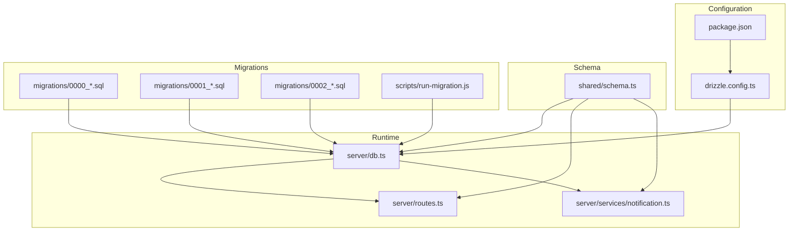
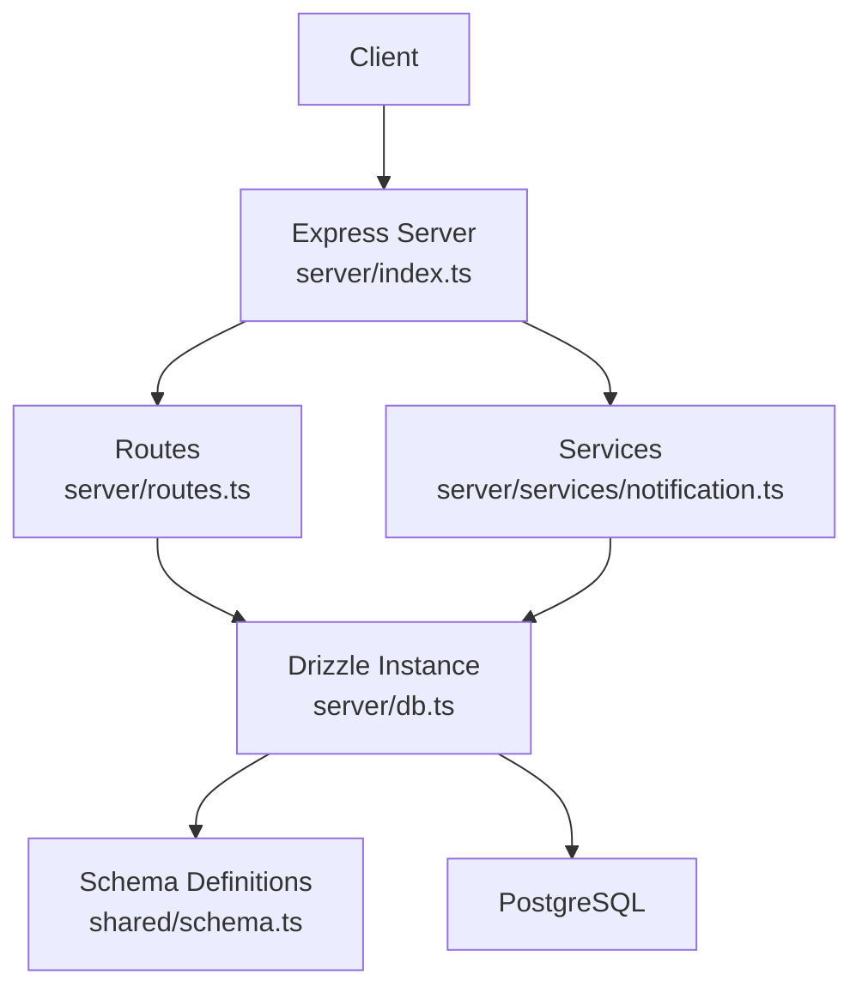
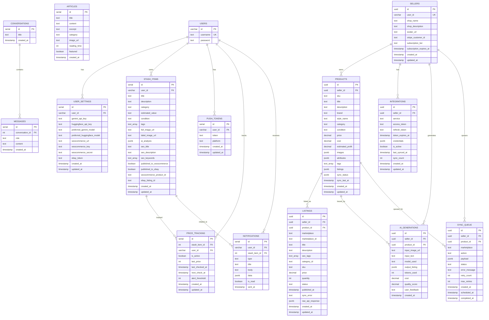
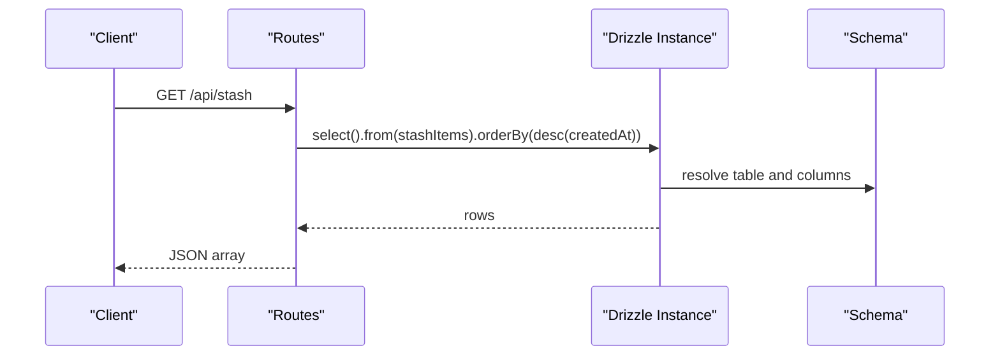
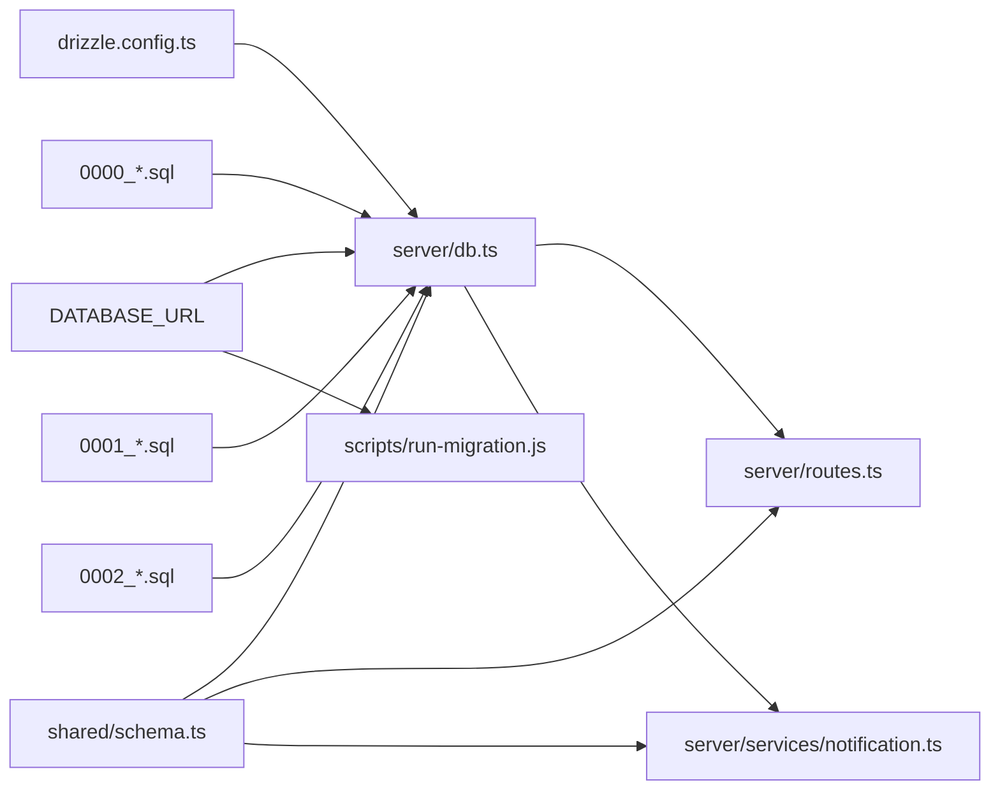

# Database Layer

<cite>
**Referenced Files in This Document**
- [drizzle.config.ts](file://drizzle.config.ts)
- [server/db.ts](file://server/db.ts)
- [shared/schema.ts](file://shared/schema.ts)
- [migrations/0000_sticky_night_thrasher.sql](file://migrations/0000_sticky_night_thrasher.sql)
- [migrations/0001_flipagent_tables.sql](file://migrations/0001_flipagent_tables.sql)
- [migrations/0002_rls_policies.sql](file://migrations/0002_rls_policies.sql)
- [scripts/run-migration.js](file://scripts/run-migration.js)
- [server/routes.ts](file://server/routes.ts)
- [server/services/notification.ts](file://server/services/notification.ts)
- [server/index.ts](file://server/index.ts)
- [package.json](file://package.json)
</cite>

## Table of Contents
1. [Introduction](#introduction)
2. [Project Structure](#project-structure)
3. [Core Components](#core-components)
4. [Architecture Overview](#architecture-overview)
5. [Detailed Component Analysis](#detailed-component-analysis)
6. [Dependency Analysis](#dependency-analysis)
7. [Performance Considerations](#performance-considerations)
8. [Troubleshooting Guide](#troubleshooting-guide)
9. [Conclusion](#conclusion)

## Introduction
This document describes the database layer implementation powered by Drizzle ORM and PostgreSQL. It covers configuration, connection management, schema design, migrations, Row-Level Security (RLS), and practical usage patterns in the backend routes and services. It also outlines repository-style patterns, query optimization strategies, and operational workflows for schema evolution and data integrity.

## Project Structure
The database layer is organized around:
- Drizzle configuration and runtime connection
- Shared schema definitions used by both ORM and migrations
- SQL-based migrations for schema evolution
- Backend routes and services that operate on the schema
- Scripts for manual migration execution

**Diagram sources**
- [drizzle.config.ts](file://drizzle.config.ts#L1-L19)
- [server/db.ts](file://server/db.ts#L1-L19)
- [shared/schema.ts](file://shared/schema.ts#L1-L344)
- [migrations/0000_sticky_night_thrasher.sql](file://migrations/0000_sticky_night_thrasher.sql#L1-L82)
- [migrations/0001_flipagent_tables.sql](file://migrations/0001_flipagent_tables.sql#L1-L117)
- [migrations/0002_rls_policies.sql](file://migrations/0002_rls_policies.sql#L1-L66)
- [scripts/run-migration.js](file://scripts/run-migration.js#L1-L34)
- [server/routes.ts](file://server/routes.ts#L1-L929)
- [server/services/notification.ts](file://server/services/notification.ts#L1-L414)
- [package.json](file://package.json#L1-L95)

**Section sources**
- [drizzle.config.ts](file://drizzle.config.ts#L1-L19)
- [server/db.ts](file://server/db.ts#L1-L19)
- [shared/schema.ts](file://shared/schema.ts#L1-L344)
- [migrations/0000_sticky_night_thrasher.sql](file://migrations/0000_sticky_night_thrasher.sql#L1-L82)
- [migrations/0001_flipagent_tables.sql](file://migrations/0001_flipagent_tables.sql#L1-L117)
- [migrations/0002_rls_policies.sql](file://migrations/0002_rls_policies.sql#L1-L66)
- [scripts/run-migration.js](file://scripts/run-migration.js#L1-L34)
- [server/routes.ts](file://server/routes.ts#L1-L929)
- [server/services/notification.ts](file://server/services/notification.ts#L1-L414)
- [package.json](file://package.json#L1-L95)

## Core Components
- Drizzle configuration: Defines migration output directory, schema file, and PostgreSQL dialect.
- Runtime database connection: Creates a connection pool and exports a drizzle instance bound to the shared schema.
- Schema definitions: Centralized table definitions with constraints, indexes, and Zod insert schemas.
- Migrations: SQL scripts for initial schema, FlipAgent tables, and RLS policies.
- Routes and services: Use the drizzle instance to perform CRUD and joins; services encapsulate business logic.

**Section sources**
- [drizzle.config.ts](file://drizzle.config.ts#L1-L19)
- [server/db.ts](file://server/db.ts#L1-L19)
- [shared/schema.ts](file://shared/schema.ts#L1-L344)
- [migrations/0000_sticky_night_thrasher.sql](file://migrations/0000_sticky_night_thrasher.sql#L1-L82)
- [migrations/0001_flipagent_tables.sql](file://migrations/0001_flipagent_tables.sql#L1-L117)
- [migrations/0002_rls_policies.sql](file://migrations/0002_rls_policies.sql#L1-L66)
- [server/routes.ts](file://server/routes.ts#L1-L929)
- [server/services/notification.ts](file://server/services/notification.ts#L1-L414)

## Architecture Overview
The runtime architecture connects Express routes and services to the database via a single drizzle instance. Queries are composed using typed schema definitions, ensuring compile-time safety and runtime correctness.

**Diagram sources**
- [server/index.ts](file://server/index.ts#L1-L262)
- [server/routes.ts](file://server/routes.ts#L1-L929)
- [server/services/notification.ts](file://server/services/notification.ts#L1-L414)
- [server/db.ts](file://server/db.ts#L1-L19)
- [shared/schema.ts](file://shared/schema.ts#L1-L344)

## Detailed Component Analysis

### Drizzle ORM Configuration
- Migration output directory and schema path are defined.
- Dialect is PostgreSQL.
- Database URL is loaded from environment variables.

Operational notes:
- Ensure DATABASE_URL is present in the environment.
- Use the provided script or CLI to push schema changes.

**Section sources**
- [drizzle.config.ts](file://drizzle.config.ts#L1-L19)
- [package.json](file://package.json#L14-L14)

### Runtime Connection Management
- A PostgreSQL connection pool is created from the DATABASE_URL.
- SSL is configured with certificate verification disabled.
- A drizzle instance is exported, bound to the shared schema.

Operational notes:
- DATABASE_URL must be set.
- The pool is reused across requests.

**Section sources**
- [server/db.ts](file://server/db.ts#L1-L19)

### Schema Design and Entity Relationships
The schema defines core entities and their relationships:
- Users and user settings
- Stash items with AI analysis and SEO fields
- Articles and conversations/messages
- FlipAgent domain: sellers, products, listings, integrations, AI generations, sync queue
- Push tokens, price tracking, and notifications

Key constraints and indexes:
- Primary keys and foreign keys enforce referential integrity.
- Unique indexes on (sellerId, sku) and (sellerId, service) prevent duplicates.
- Indexes on frequently filtered/joined columns improve query performance.

**Diagram sources**
- [shared/schema.ts](file://shared/schema.ts#L1-L344)

**Section sources**
- [shared/schema.ts](file://shared/schema.ts#L1-L344)

### Migration Management and Schema Evolution
- Initial schema: users, user_settings, stash_items, articles, conversations, messages.
- FlipAgent tables: sellers, products, listings, integrations, ai_generations, sync_queue with indexes.
- RLS policies: enable RLS and define per-table policies for select/insert/update/delete.

Operational workflows:
- Use drizzle-kit to push schema changes to the database.
- Manual migration runner script executes specific SQL files against the database.
- RLS policies are applied to FlipAgent tables to restrict rows to the owning seller.

**Section sources**
- [migrations/0000_sticky_night_thrasher.sql](file://migrations/0000_sticky_night_thrasher.sql#L1-L82)
- [migrations/0001_flipagent_tables.sql](file://migrations/0001_flipagent_tables.sql#L1-L117)
- [migrations/0002_rls_policies.sql](file://migrations/0002_rls_policies.sql#L1-L66)
- [scripts/run-migration.js](file://scripts/run-migration.js#L1-L34)
- [package.json](file://package.json#L14-L14)

### Transaction Handling
- The codebase does not demonstrate explicit transaction blocks in the reviewed files.
- Individual operations are executed as single statements.
- For multi-step operations requiring atomicity, wrap them in a transaction block using drizzle’s transaction API.

Recommended pattern:
- Wrap dependent writes in a transaction to ensure consistency.

[No sources needed since this section provides general guidance]

### Repository Patterns
- The routes and services directly use the drizzle instance to compose queries.
- There is no dedicated repository interface or class in the reviewed files.
- To adopt a repository pattern:
  - Define interfaces for each domain (e.g., IUserRepository).
  - Implement them using the drizzle instance.
  - Inject repositories into services for better testability and separation of concerns.

[No sources needed since this section provides general guidance]

### Query Optimization and Performance Considerations
- Use indexes on join and filter columns (e.g., seller_id, (seller_id, sku), (seller_id, marketplace)).
- Prefer selective queries with appropriate WHERE clauses.
- Use returning() to minimize round-trips when inserting/updating.
- Batch operations where feasible.
- Monitor slow queries and add targeted indexes as needed.

[No sources needed since this section provides general guidance]

### Examples of Database Operations
- Select all stash items ordered by creation date.
- Insert a new stash item with returning to get the inserted record.
- Delete a stash item by ID.
- Join price tracking with stash items to compute alerts.
- Update push tokens and notifications.

**Diagram sources**
- [server/routes.ts](file://server/routes.ts#L216-L227)
- [shared/schema.ts](file://shared/schema.ts#L29-L50)

**Section sources**
- [server/routes.ts](file://server/routes.ts#L216-L297)
- [server/services/notification.ts](file://server/services/notification.ts#L332-L413)
- [shared/schema.ts](file://shared/schema.ts#L29-L50)

### Data Integrity Enforcement
- Primary keys and foreign keys maintain referential integrity.
- Unique indexes prevent duplicate combinations (e.g., (sellerId, sku), (sellerId, service)).
- Default values and NOT NULL constraints ensure consistent data shape.
- RLS policies restrict access to seller-owned records.

**Section sources**
- [shared/schema.ts](file://shared/schema.ts#L149-L151)
- [shared/schema.ts](file://shared/schema.ts#L218-L220)
- [migrations/0002_rls_policies.sql](file://migrations/0002_rls_policies.sql#L1-L66)

## Dependency Analysis
- server/db.ts depends on shared/schema.ts and exports a drizzle instance.
- server/routes.ts and server/services/notification.ts depend on server/db.ts and shared/schema.ts.
- drizzle.config.ts depends on environment variables and shared/schema.ts.
- scripts/run-migration.js depends on environment variables and migration SQL files.

**Diagram sources**
- [drizzle.config.ts](file://drizzle.config.ts#L1-L19)
- [server/db.ts](file://server/db.ts#L1-L19)
- [shared/schema.ts](file://shared/schema.ts#L1-L344)
- [migrations/0000_sticky_night_thrasher.sql](file://migrations/0000_sticky_night_thrasher.sql#L1-L82)
- [migrations/0001_flipagent_tables.sql](file://migrations/0001_flipagent_tables.sql#L1-L117)
- [migrations/0002_rls_policies.sql](file://migrations/0002_rls_policies.sql#L1-L66)
- [scripts/run-migration.js](file://scripts/run-migration.js#L1-L34)

**Section sources**
- [drizzle.config.ts](file://drizzle.config.ts#L1-L19)
- [server/db.ts](file://server/db.ts#L1-L19)
- [shared/schema.ts](file://shared/schema.ts#L1-L344)
- [migrations/0000_sticky_night_thrasher.sql](file://migrations/0000_sticky_night_thrasher.sql#L1-L82)
- [migrations/0001_flipagent_tables.sql](file://migrations/0001_flipagent_tables.sql#L1-L117)
- [migrations/0002_rls_policies.sql](file://migrations/0002_rls_policies.sql#L1-L66)
- [scripts/run-migration.js](file://scripts/run-migration.js#L1-L34)

## Performance Considerations
- Use indexes on columns frequently used in WHERE, JOIN, and ORDER BY clauses.
- Prefer selective projections and limit result sets.
- Batch updates and inserts when possible.
- Monitor query execution plans and add missing indexes.
- Keep default values and constraints to reduce application-side validation overhead.

[No sources needed since this section provides general guidance]

## Troubleshooting Guide
Common issues and resolutions:
- Missing DATABASE_URL: Ensure the environment variable is set before starting the server.
- Connection failures: Verify the connection string and network access to the database host.
- Migration errors: Confirm the migration SQL is valid and the database user has sufficient privileges.
- RLS policy errors: Ensure the client is authenticated and the seller ownership matches the current user context.

Operational references:
- Environment variable loading and validation occur in the database connection setup.
- Migration runner script connects to the database and executes SQL files.
- Scheduled tasks rely on the database being reachable.

**Section sources**
- [server/db.ts](file://server/db.ts#L7-L9)
- [scripts/run-migration.js](file://scripts/run-migration.js#L5-L10)
- [server/index.ts](file://server/index.ts#L247-L258)

## Conclusion
The database layer leverages Drizzle ORM with a centralized schema definition, robust migrations, and RLS policies for secure access control. The routes and services demonstrate straightforward CRUD and join operations. Adopting explicit transactions for multi-step writes, a repository pattern for better modularity, and continuous monitoring of query performance will further strengthen the layer.