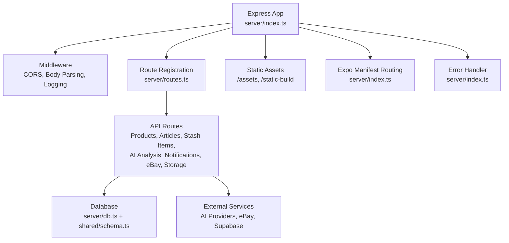
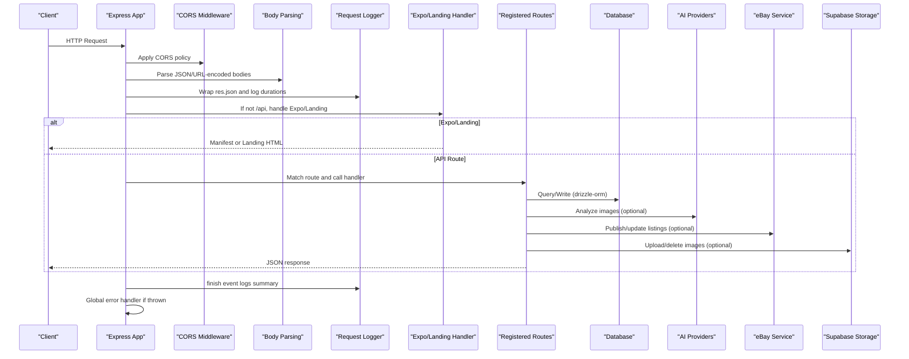
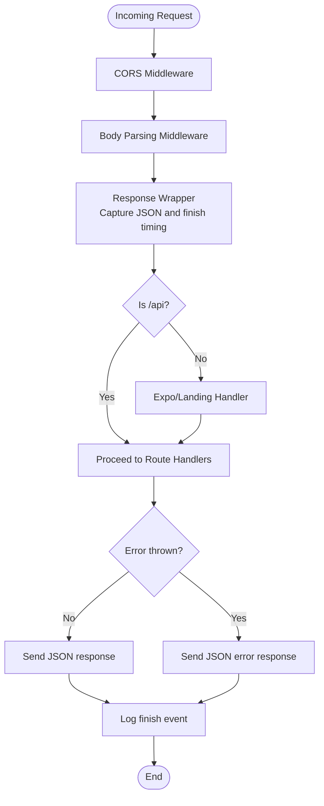
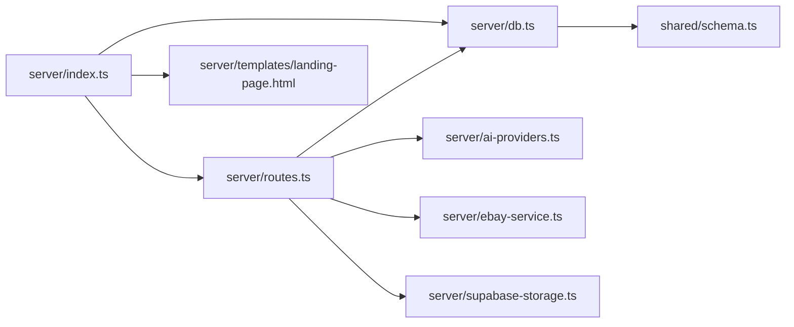

# Express Server

<cite>
**Referenced Files in This Document**
- [server/index.ts](file://server/index.ts)
- [server/routes.ts](file://server/routes.ts)
- [server/templates/landing-page.html](file://server/templates/landing-page.html)
- [server/db.ts](file://server/db.ts)
- [server/services/notification.ts](file://server/services/notification.ts)
- [server/ai-providers.ts](file://server/ai-providers.ts)
- [server/ebay-service.ts](file://server/ebay-service.ts)
- [server/supabase-storage.ts](file://server/supabase-storage.ts)
- [shared/schema.ts](file://shared/schema.ts)
- [app.json](file://app.json)
- [package.json](file://package.json)
</cite>

## Table of Contents
1. [Introduction](#introduction)
2. [Project Structure](#project-structure)
3. [Core Components](#core-components)
4. [Architecture Overview](#architecture-overview)
5. [Detailed Component Analysis](#detailed-component-analysis)
6. [Dependency Analysis](#dependency-analysis)
7. [Performance Considerations](#performance-considerations)
8. [Security Considerations](#security-considerations)
9. [Troubleshooting Guide](#troubleshooting-guide)
10. [Conclusion](#conclusion)

## Introduction
This document explains the Express.js server implementation powering the backend for the Hidden-Gem project. It covers server initialization, middleware configuration (CORS, body parsing, request logging, and error handling), the modular route registration system, Expo manifest serving for mobile distribution, the landing page template system with dynamic URL generation, and operational topics such as security, logging, and performance. It also provides practical examples of middleware setup, route registration patterns, and server configuration options.

## Project Structure
The server is organized around a single entry point that composes middleware, mounts routes, serves static assets and Expo manifests, and exposes a comprehensive API surface for product, article, stash item, AI analysis, push notifications, eBay integration, and Supabase image storage.

**Diagram sources**
- [server/index.ts](file://server/index.ts#L10-L261)
- [server/routes.ts](file://server/routes.ts#L44-L928)
- [server/db.ts](file://server/db.ts#L1-L19)
- [shared/schema.ts](file://shared/schema.ts#L1-L344)

**Section sources**
- [server/index.ts](file://server/index.ts#L10-L261)
- [server/routes.ts](file://server/routes.ts#L44-L928)

## Core Components
- Express initialization and server bootstrap
- Middleware stack: CORS, body parsing, request logging, error handling
- Modular route registration via a single function that mounts many endpoints
- Expo manifest and landing page serving for mobile distribution
- Database connectivity and schema definitions
- External service integrations (AI providers, eBay, Supabase)

**Section sources**
- [server/index.ts](file://server/index.ts#L10-L261)
- [server/routes.ts](file://server/routes.ts#L44-L928)
- [server/db.ts](file://server/db.ts#L1-L19)
- [shared/schema.ts](file://shared/schema.ts#L1-L344)

## Architecture Overview
The server composes middleware in order, then mounts routes, and finally sets up a global error handler. Requests that do not match API routes are handled by Expo and landing page logic, which dynamically generates URLs and serves manifests based on the incoming request headers and path.

**Diagram sources**
- [server/index.ts](file://server/index.ts#L19-L225)
- [server/routes.ts](file://server/routes.ts#L44-L928)
- [server/db.ts](file://server/db.ts#L1-L19)
- [server/ai-providers.ts](file://server/ai-providers.ts#L1-L696)
- [server/ebay-service.ts](file://server/ebay-service.ts#L1-L474)
- [server/supabase-storage.ts](file://server/supabase-storage.ts#L1-L93)

## Detailed Component Analysis

### Server Initialization and Bootstrap
- Creates the Express app and attaches a custom rawBody hook for signature verification scenarios.
- Initializes database connectivity using a PostgreSQL pool.
- Schedules a recurring job to process price tracking alerts.

Key behaviors:
- Port binding to environment-controlled port with host 0.0.0.0.
- Graceful scheduling of periodic tasks.

**Section sources**
- [server/index.ts](file://server/index.ts#L10-L17)
- [server/index.ts](file://server/index.ts#L227-L261)
- [server/db.ts](file://server/db.ts#L1-L19)

### Middleware Configuration
- CORS: Dynamically allows origins from environment variables and supports localhost for Expo web dev.
- Body parsing: JSON and URL-encoded bodies with rawBody capture for downstream verification.
- Request logging: Wraps response JSON and logs method, path, status, duration, and a truncated JSON payload for API routes.
- Error handling: Centralized handler that extracts status/message from thrown errors and responds with JSON.

**Diagram sources**
- [server/index.ts](file://server/index.ts#L19-L225)

**Section sources**
- [server/index.ts](file://server/index.ts#L19-L101)
- [server/index.ts](file://server/index.ts#L210-L225)

### Modular Route Registration System
The route registration function mounts numerous endpoints grouped by domain:

- Push notifications: register/unregister tokens, fetch notifications, read/unread management, price tracking enable/disable/status.
- Stash items: list, count, retrieve, create, delete, and publish to marketplaces.
- Articles: list and retrieve.
- AI analysis: image-based item analysis and retry with feedback.
- SEO generation: derive SEO title/description/keywords from analysis.
- eBay integration: refresh tokens, update/delete listings, publish items.
- Supabase image storage: upload and delete product images.
- Products (FlipAgent): CRUD for products and marketplace listings.

Each route includes input validation, error handling, and database operations using drizzle-orm.

**Section sources**
- [server/routes.ts](file://server/routes.ts#L44-L928)
- [shared/schema.ts](file://shared/schema.ts#L29-L50)
- [shared/schema.ts](file://shared/schema.ts#L128-L151)
- [shared/schema.ts](file://shared/schema.ts#L153-L172)

### Expo Manifest Serving and Landing Page Template
- Static asset serving: /assets and /static-build directories.
- Dynamic manifest routing: On GET / or /manifest with expo-platform header, serves platform-specific manifest.json with appropriate headers.
- Landing page: Reads a bundled HTML template, injects BASE_URL_PLACEHOLDER, EXPS_URL_PLACEHOLDER, and APP_NAME_PLACEHOLDER, and sends the rendered HTML.

Dynamic URL generation:
- Base URL derived from x-forwarded-proto/host or req.protocol/host.
- EXPS_URL placeholder used for deep links.

App name resolution:
- Reads app.json expo.name to populate the template.

**Section sources**
- [server/index.ts](file://server/index.ts#L166-L208)
- [server/index.ts](file://server/index.ts#L103-L112)
- [server/templates/landing-page.html](file://server/templates/landing-page.html#L1-L466)
- [app.json](file://app.json#L2-L50)

### Database Connectivity and Schema
- Uses drizzle-orm with a PostgreSQL pool.
- Defines tables for users, settings, stash items, articles, conversations, messages, sellers, products, listings, AI generations, sync queue, integrations, push tokens, price tracking, and notifications.
- Provides insert schemas for validation and type safety.

Operational notes:
- Requires DATABASE_URL environment variable.
- SSL configuration accepts self-signed certs for local environments.

**Section sources**
- [server/db.ts](file://server/db.ts#L1-L19)
- [shared/schema.ts](file://shared/schema.ts#L1-L344)

### External Integrations
- AI providers: Support for Gemini, OpenAI, Anthropic, and custom endpoints; includes retry logic and connection testing.
- eBay service: Token refresh, listing retrieval, inventory updates, deletion, and publishing.
- Supabase storage: Upload and delete product images with namespace-aware paths and validation.

**Section sources**
- [server/ai-providers.ts](file://server/ai-providers.ts#L1-L696)
- [server/ebay-service.ts](file://server/ebay-service.ts#L1-L474)
- [server/supabase-storage.ts](file://server/supabase-storage.ts#L1-L93)

## Dependency Analysis
The server composes several modules with clear boundaries:

**Diagram sources**
- [server/index.ts](file://server/index.ts#L1-L10)
- [server/routes.ts](file://server/routes.ts#L1-L12)
- [shared/schema.ts](file://shared/schema.ts#L1-L344)

**Section sources**
- [server/index.ts](file://server/index.ts#L1-L10)
- [server/routes.ts](file://server/routes.ts#L1-L12)
- [shared/schema.ts](file://shared/schema.ts#L1-L344)

## Performance Considerations
- Prefer streaming or pagination for large datasets (e.g., listing endpoints).
- Cache frequently accessed static assets under /assets and /static-build.
- Limit concurrent AI requests and apply rate limiting for image analysis endpoints.
- Use database indexes on frequently filtered columns (e.g., user IDs, timestamps).
- Monitor request durations via the built-in logger to identify slow endpoints.

[No sources needed since this section provides general guidance]

## Security Considerations
- CORS: Origins are controlled by environment variables; ensure only trusted domains are whitelisted. Localhost is permitted for Expo web development.
- Body parsing: JSON and URL-encoded bodies are parsed; validate and sanitize inputs at route handlers.
- Error handling: Centralized error handler prevents stack traces from leaking sensitive details.
- AI endpoints: Validate provider configuration and restrict custom endpoints to safe domains.
- eBay integration: Keep refresh tokens secure; avoid logging sensitive credentials.
- Supabase storage: Enforce MIME type and size checks; namespace files by seller ID.

**Section sources**
- [server/index.ts](file://server/index.ts#L19-L56)
- [server/index.ts](file://server/index.ts#L210-L225)
- [server/ai-providers.ts](file://server/ai-providers.ts#L188-L222)
- [server/ebay-service.ts](file://server/ebay-service.ts#L329-L364)
- [server/supabase-storage.ts](file://server/supabase-storage.ts#L50-L57)

## Troubleshooting Guide
Common issues and remedies:
- CORS failures: Verify REPLIT_DEV_DOMAIN and REPLIT_DOMAINS environment variables and ensure the origin matches allowed patterns.
- Missing DATABASE_URL: The server throws early if the environment variable is not set.
- Expo manifest not found: Confirm platform-specific manifest.json exists under static-build/<platform>.
- AI analysis errors: Test provider connections using the AI provider test endpoint; check API keys and model names.
- eBay publishing errors: Validate credentials and refresh tokens; ensure required business policies are configured in the seller hub.
- Supabase upload failures: Confirm bucket accessibility and credentials; ensure file MIME type starts with image/.

**Section sources**
- [server/index.ts](file://server/index.ts#L227-L261)
- [server/db.ts](file://server/db.ts#L7-L9)
- [server/index.ts](file://server/index.ts#L114-L134)
- [server/ai-providers.ts](file://server/ai-providers.ts#L604-L695)
- [server/ebay-service.ts](file://server/ebay-service.ts#L43-L62)
- [server/supabase-storage.ts](file://server/supabase-storage.ts#L32-L39)

## Conclusion
The Express server is a modular, extensible backend that integrates database operations, external AI services, marketplace APIs, and mobile distribution via Expo. Its middleware stack ensures robust CORS, body parsing, logging, and error handling. The route registration system cleanly organizes business logic, while the Expo and landing page serving enables seamless mobile preview and distribution. By following the security and performance recommendations herein, the system can be maintained reliably in production.