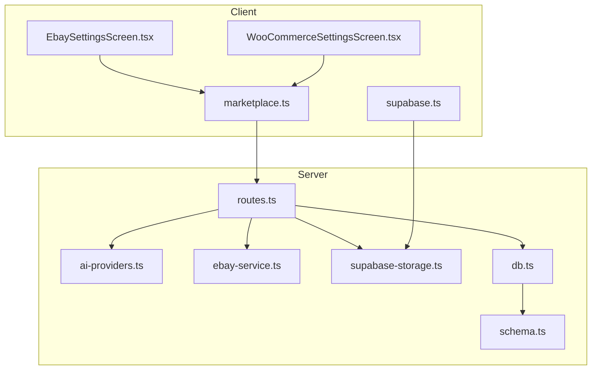
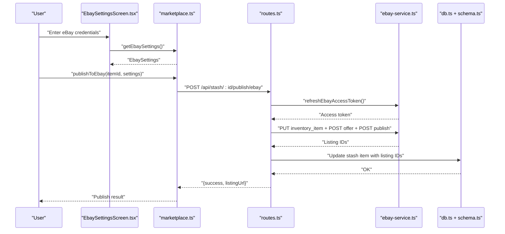
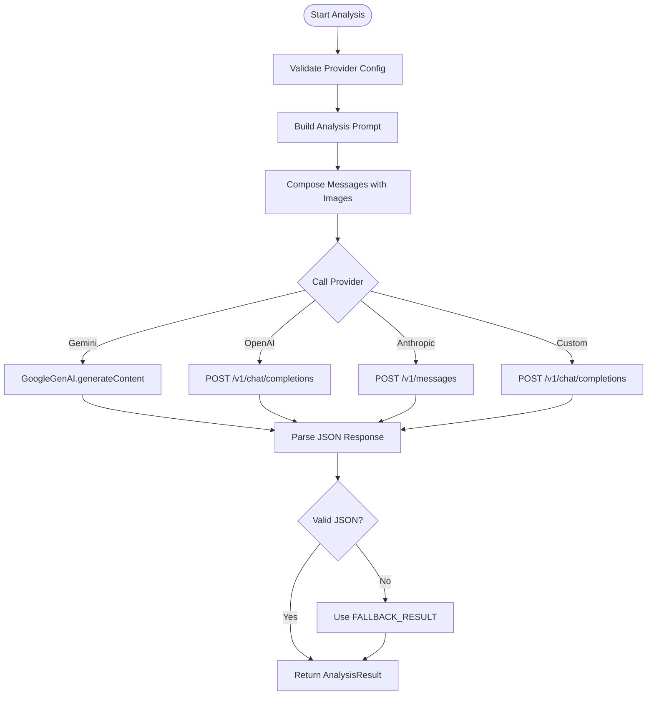
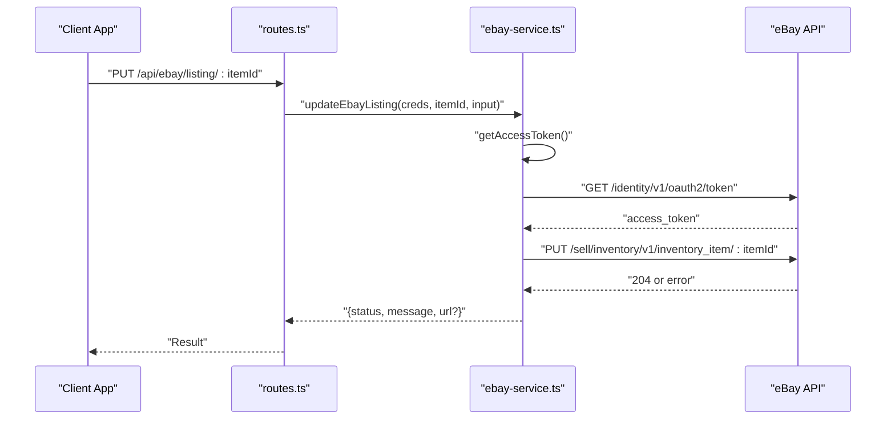
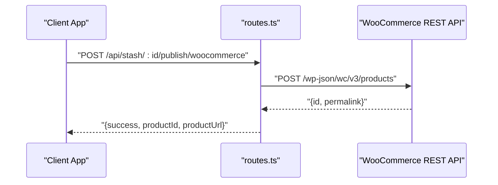
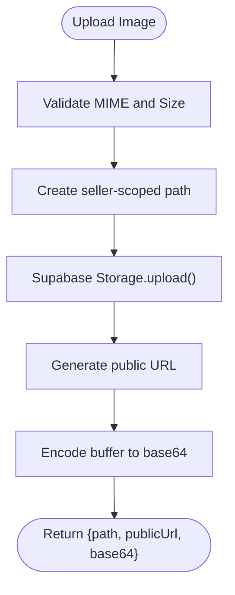
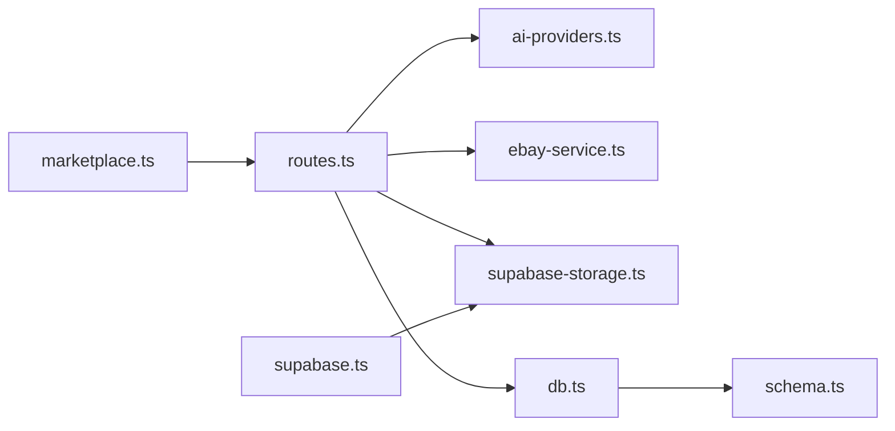

# Service Integration

<cite>
**Referenced Files in This Document**
- [ai-providers.ts](file://server/ai-providers.ts)
- [ebay-service.ts](file://server/ebay-service.ts)
- [routes.ts](file://server/routes.ts)
- [supabase-storage.ts](file://server/supabase-storage.ts)
- [db.ts](file://server/db.ts)
- [schema.ts](file://shared/schema.ts)
- [ENVIRONMENT.md](file://ENVIRONMENT.md)
- [marketplace.ts](file://client/lib/marketplace.ts)
- [supabase.ts](file://client/lib/supabase.ts)
- [EbaySettingsScreen.tsx](file://client/screens/EbaySettingsScreen.tsx)
- [WooCommerceSettingsScreen.tsx](file://client/screens/WooCommerceSettingsScreen.tsx)
</cite>

## Table of Contents
1. [Introduction](#introduction)
2. [Project Structure](#project-structure)
3. [Core Components](#core-components)
4. [Architecture Overview](#architecture-overview)
5. [Detailed Component Analysis](#detailed-component-analysis)
6. [Dependency Analysis](#dependency-analysis)
7. [Performance Considerations](#performance-considerations)
8. [Troubleshooting Guide](#troubleshooting-guide)
9. [Conclusion](#conclusion)
10. [Appendices](#appendices)

## Introduction
This document explains external service integrations in the project, focusing on:
- AI provider integration with Google Gemini and OpenAI, including configuration, retry mechanisms, and error handling
- Marketplace service implementations for eBay and WooCommerce, covering OAuth flows, API communication patterns, and data synchronization
- Storage service integration with Supabase and local file storage
- Service configuration, authentication flows, rate limiting, and monitoring approaches
- Examples of service interactions and failure recovery patterns

## Project Structure
The integration surface spans backend routes, service modules, and client-side configuration screens:
- Backend routes define endpoints for AI analysis, marketplace publishing, image storage, and eBay token refresh
- Service modules encapsulate provider logic and marketplace API clients
- Client libraries manage credentials and publish actions
- Environment configuration documents required variables and setup steps

**Diagram sources**
- [routes.ts](file://server/routes.ts#L1-L929)
- [ai-providers.ts](file://server/ai-providers.ts#L1-L696)
- [ebay-service.ts](file://server/ebay-service.ts#L1-L474)
- [supabase-storage.ts](file://server/supabase-storage.ts#L1-L93)
- [db.ts](file://server/db.ts#L1-L19)
- [schema.ts](file://shared/schema.ts#L1-L344)
- [marketplace.ts](file://client/lib/marketplace.ts#L1-L129)
- [supabase.ts](file://client/lib/supabase.ts#L1-L39)
- [EbaySettingsScreen.tsx](file://client/screens/EbaySettingsScreen.tsx#L1-L568)
- [WooCommerceSettingsScreen.tsx](file://client/screens/WooCommerceSettingsScreen.tsx#L1-L512)

**Section sources**
- [routes.ts](file://server/routes.ts#L1-L929)
- [ENVIRONMENT.md](file://ENVIRONMENT.md#L1-L219)

## Core Components
- AI Provider Integration (Google Gemini, OpenAI, Anthropic, Custom)
  - Centralized provider selection, configuration, and analysis
  - Retry workflow with structured prompts
  - Connection testing and validation helpers
- eBay Marketplace Integration
  - OAuth token refresh and listing CRUD operations
  - Inventory item updates and deletion
  - Category mapping and listing publishing
- WooCommerce Marketplace Integration
  - Consumer key/secret authentication
  - Product creation and listing publication
- Supabase Storage Integration
  - Image upload with validation and namespace scoping
  - Public URL generation and deletion
- Local File Storage (Client)
  - Secure credential storage and retrieval for eBay/WooCommerce
- Database Integration
  - Drizzle ORM schema for marketplace records, sync queues, and integrations

**Section sources**
- [ai-providers.ts](file://server/ai-providers.ts#L1-L696)
- [ebay-service.ts](file://server/ebay-service.ts#L1-L474)
- [routes.ts](file://server/routes.ts#L387-L647)
- [supabase-storage.ts](file://server/supabase-storage.ts#L1-L93)
- [marketplace.ts](file://client/lib/marketplace.ts#L1-L129)
- [schema.ts](file://shared/schema.ts#L115-L220)
- [db.ts](file://server/db.ts#L1-L19)

## Architecture Overview
The system orchestrates AI analysis, marketplace publishing, and storage through a layered architecture:
- Client screens capture credentials and initiate publish actions
- Client library packages credentials and forwards to backend routes
- Backend routes validate inputs, call service modules, and persist outcomes
- Service modules interact with external APIs and handle errors
- Storage modules manage image uploads and URLs
- Database stores marketplace records and sync state

**Diagram sources**
- [EbaySettingsScreen.tsx](file://client/screens/EbaySettingsScreen.tsx#L1-L568)
- [marketplace.ts](file://client/lib/marketplace.ts#L105-L129)
- [routes.ts](file://server/routes.ts#L457-L647)
- [ebay-service.ts](file://server/ebay-service.ts#L329-L364)
- [db.ts](file://server/db.ts#L1-L19)
- [schema.ts](file://shared/schema.ts#L29-L50)

## Detailed Component Analysis

### AI Provider Integration (Google Gemini and OpenAI)
- Configuration
  - Provider type selection and optional endpoint override
  - Model selection and API key sourcing from config or environment
- Analysis Workflow
  - Image ingestion as base64 data URLs
  - Structured prompts and JSON response parsing
  - Fallback result handling for malformed responses
- Retry Mechanism
  - Enhanced prompt incorporating previous result and feedback
  - Provider-agnostic retry dispatcher
- Error Handling
  - Validation of custom endpoints and network constraints
  - Provider-specific error extraction and user-friendly messages
  - Connection test endpoint for pre-flight verification

**Diagram sources**
- [ai-providers.ts](file://server/ai-providers.ts#L224-L396)
- [ai-providers.ts](file://server/ai-providers.ts#L418-L442)
- [ai-providers.ts](file://server/ai-providers.ts#L131-L180)

**Section sources**
- [ai-providers.ts](file://server/ai-providers.ts#L1-L696)
- [routes.ts](file://server/routes.ts#L649-L711)

### eBay Marketplace Integration
- OAuth Flow
  - Token refresh using client credentials and refresh token
  - Returns new access token, refresh token, and expiry timestamp
- API Communication Patterns
  - Listing CRUD: GET active listings, GET inventory items, DELETE listing, PUT inventory item, PUT offer
  - Publishing: PUT inventory item, POST offer, POST publish
- Data Synchronization
  - Category mapping from app categories to eBay taxonomy
  - Listing URL construction for production and sandbox environments
- Error Handling
  - Distinguishes 404 vs. error responses
  - Extracts error messages from provider responses
  - Graceful handling of missing business policies during offer creation

**Diagram sources**
- [routes.ts](file://server/routes.ts#L863-L876)
- [ebay-service.ts](file://server/ebay-service.ts#L386-L430)

**Section sources**
- [ebay-service.ts](file://server/ebay-service.ts#L1-L474)
- [routes.ts](file://server/routes.ts#L457-L647)

### WooCommerce Marketplace Integration
- Authentication
  - Basic auth using consumer key and secret
- API Communication
  - POST product creation to WC REST API
  - Updates stash item with published identifiers and URLs
- Error Handling
  - Parses error messages from provider responses
  - Prevents duplicate publishing attempts

**Diagram sources**
- [routes.ts](file://server/routes.ts#L387-L455)

**Section sources**
- [routes.ts](file://server/routes.ts#L387-L455)
- [marketplace.ts](file://client/lib/marketplace.ts#L81-L103)

### Supabase Storage Integration
- Upload
  - Validates MIME type and size limits
  - Names files under a seller-specific namespace
  - Returns path, public URL, and base64 representation
- Delete
  - Removes files by path
- Client-side Supabase
  - Creates Supabase client with environment variables
  - Handles redirect URL detection for web and native platforms

**Diagram sources**
- [supabase-storage.ts](file://server/supabase-storage.ts#L45-L80)
- [supabase.ts](file://client/lib/supabase.ts#L1-L39)

**Section sources**
- [supabase-storage.ts](file://server/supabase-storage.ts#L1-L93)
- [supabase.ts](file://client/lib/supabase.ts#L1-L39)

### Client Credential Management
- eBay
  - Stores environment, status, and credentials in secure storage
  - Supports optional refresh token for listing creation
- WooCommerce
  - Stores store URL and consumer credentials
  - Normalizes URL and enforces presence of all fields

**Section sources**
- [EbaySettingsScreen.tsx](file://client/screens/EbaySettingsScreen.tsx#L1-L568)
- [WooCommerceSettingsScreen.tsx](file://client/screens/WooCommerceSettingsScreen.tsx#L1-L512)
- [marketplace.ts](file://client/lib/marketplace.ts#L1-L129)

## Dependency Analysis
- Backend routes depend on:
  - AI provider module for analysis and retries
  - eBay service module for marketplace operations
  - Supabase storage module for image handling
  - Drizzle ORM for database operations
- Database schema supports marketplace records, sync queues, and integration credentials
- Client libraries depend on environment variables and secure storage

**Diagram sources**
- [routes.ts](file://server/routes.ts#L1-L929)
- [ai-providers.ts](file://server/ai-providers.ts#L1-L696)
- [ebay-service.ts](file://server/ebay-service.ts#L1-L474)
- [supabase-storage.ts](file://server/supabase-storage.ts#L1-L93)
- [db.ts](file://server/db.ts#L1-L19)
- [schema.ts](file://shared/schema.ts#L1-L344)
- [marketplace.ts](file://client/lib/marketplace.ts#L1-L129)
- [supabase.ts](file://client/lib/supabase.ts#L1-L39)

**Section sources**
- [routes.ts](file://server/routes.ts#L1-L929)
- [schema.ts](file://shared/schema.ts#L115-L220)

## Performance Considerations
- Image Upload Limits
  - Enforce size constraints to prevent oversized payloads
- Provider Latency
  - Consider implementing exponential backoff and circuit breaker patterns for external API calls
- Retry Strategy
  - Use bounded retries with jitter for AI analysis retries
- Database Writes
  - Batch writes and minimize round trips for marketplace operations
- Monitoring
  - Track provider latency, error rates, and token expiry timing

[No sources needed since this section provides general guidance]

## Troubleshooting Guide
- AI Provider Connectivity
  - Use the test endpoint to validate provider configuration and credentials
  - Check environment variables for AI integration keys
- eBay Publishing Failures
  - Ensure business policies are configured in the seller hub
  - Verify refresh token validity and environment selection
- WooCommerce Publishing Failures
  - Confirm REST API is enabled and credentials are correct
  - Validate store URL normalization and absence of trailing slashes
- Supabase Storage Errors
  - Verify Supabase URL and keys are configured
  - Ensure file MIME type starts with “image/” and size under 20 MB
- Database Connection
  - Confirm DATABASE_URL is set and PostgreSQL is reachable

**Section sources**
- [routes.ts](file://server/routes.ts#L649-L670)
- [routes.ts](file://server/routes.ts#L457-L647)
- [supabase-storage.ts](file://server/supabase-storage.ts#L32-L38)
- [db.ts](file://server/db.ts#L7-L9)
- [ENVIRONMENT.md](file://ENVIRONMENT.md#L12-L68)

## Conclusion
The project integrates AI providers, marketplace services, and storage through a clean separation of concerns:
- AI analysis is provider-agnostic with robust retry and fallback logic
- eBay and WooCommerce integrations follow standard authentication and API patterns with strong error handling
- Supabase storage provides secure, validated image handling
- Client-side credential management ensures secure storage and user-friendly flows
Adhering to the documented configuration, authentication, and error handling patterns will improve reliability and maintainability.

[No sources needed since this section summarizes without analyzing specific files]

## Appendices

### Configuration Reference
- Environment Variables
  - Database: DATABASE_URL
  - Supabase: EXPO_PUBLIC_SUPABASE_URL, EXPO_PUBLIC_SUPABASE_ANON_KEY, SUPABASE_SERVICE_ROLE_KEY
  - AI Integrations: AI_INTEGRATIONS_GEMINI_API_KEY, AI_INTEGRATIONS_GEMINI_BASE_URL
  - Session: SESSION_SECRET
- User Credentials (stored locally)
  - eBay: Client ID, Client Secret, Refresh Token, Environment
  - WooCommerce: Store URL, Consumer Key, Consumer Secret

**Section sources**
- [ENVIRONMENT.md](file://ENVIRONMENT.md#L12-L68)