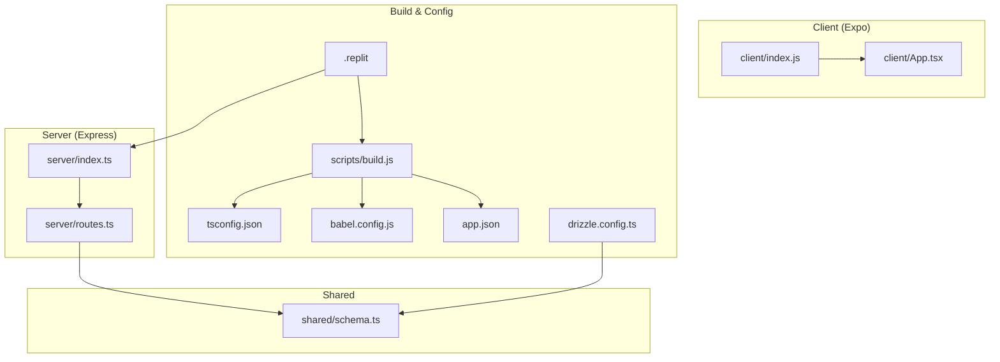
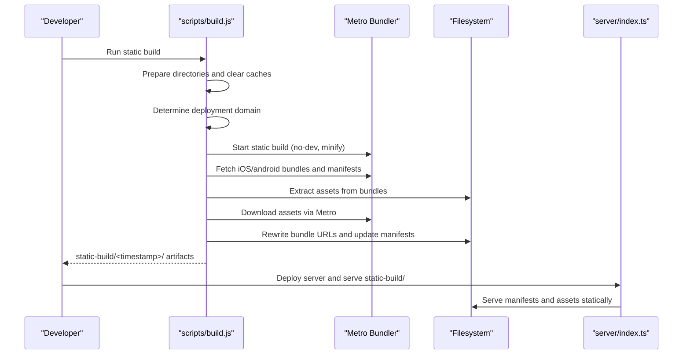
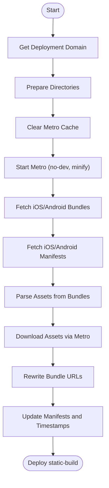
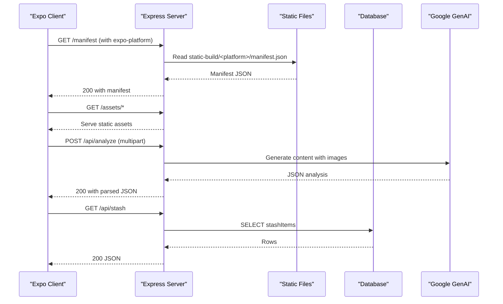
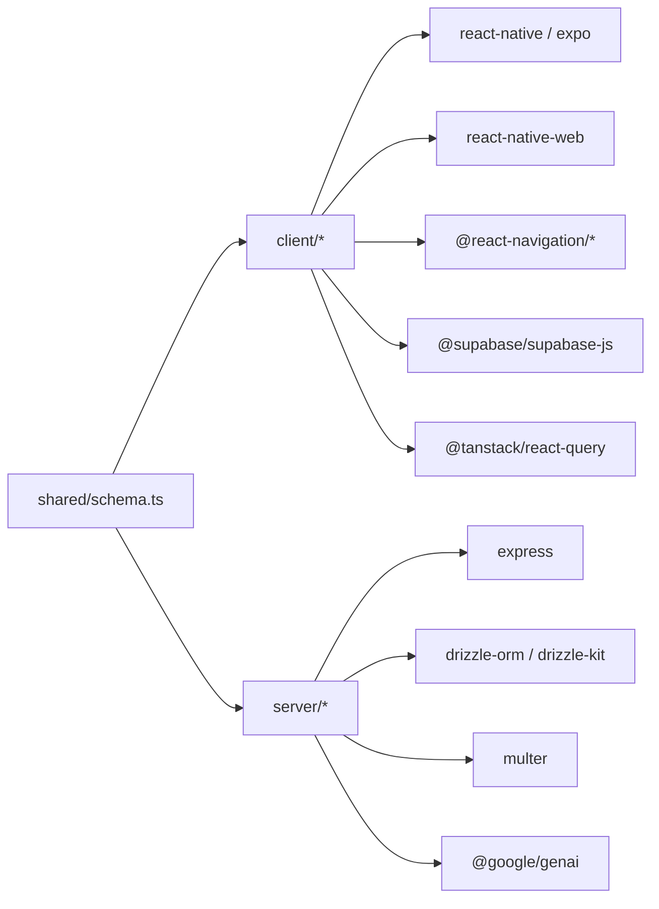

# Build and Deployment

<cite>
**Referenced Files in This Document**
- [package.json](file://package.json)
- [tsconfig.json](file://tsconfig.json)
- [babel.config.js](file://babel.config.js)
- [app.json](file://app.json)
- [scripts/build.js](file://scripts/build.js)
- [server/index.ts](file://server/index.ts)
- [server/routes.ts](file://server/routes.ts)
- [ENVIRONMENT.md](file://ENVIRONMENT.md)
- [.replit](file://.replit)
- [drizzle.config.ts](file://drizzle.config.ts)
- [client/App.tsx](file://client/App.tsx)
- [client/index.js](file://client/index.js)
- [eslint.config.js](file://eslint.config.js)
</cite>

## Table of Contents
1. [Introduction](#introduction)
2. [Project Structure](#project-structure)
3. [Core Components](#core-components)
4. [Architecture Overview](#architecture-overview)
5. [Detailed Component Analysis](#detailed-component-analysis)
6. [Dependency Analysis](#dependency-analysis)
7. [Performance Considerations](#performance-considerations)
8. [Troubleshooting Guide](#troubleshooting-guide)
9. [Conclusion](#conclusion)
10. [Appendices](#appendices)

## Introduction
This document explains the build configuration and deployment processes for both the client (Expo/React Native) and server (Express) components. It covers TypeScript compilation settings, Babel configuration for module resolution, asset bundling strategies, static build generation, environment variable handling, production optimizations, and deployment approaches for mobile and server environments. It also outlines CI/CD considerations, automated testing integration, and release management practices tailored to this project’s stack.

## Project Structure
The project is organized into:
- Client (Expo/React Native): TypeScript sources under client/, entry via client/index.js, and root component client/App.tsx.
- Server (Express): TypeScript sources under server/, with routing and API endpoints.
- Shared: Database schema definitions under shared/.
- Build and configuration: TypeScript, Babel, Metro/Expo configs, and a custom static build script under scripts/.

**Diagram sources**
- [client/index.js](file://client/index.js#L1-L6)
- [client/App.tsx](file://client/App.tsx#L1-L57)
- [server/index.ts](file://server/index.ts#L1-L247)
- [server/routes.ts](file://server/routes.ts#L1-L493)
- [tsconfig.json](file://tsconfig.json#L1-L15)
- [babel.config.js](file://babel.config.js#L1-L21)
- [app.json](file://app.json#L1-L52)
- [scripts/build.js](file://scripts/build.js#L1-L562)
- [.replit](file://.replit#L1-L82)
- [drizzle.config.ts](file://drizzle.config.ts#L1-L15)

**Section sources**
- [package.json](file://package.json#L1-L85)
- [tsconfig.json](file://tsconfig.json#L1-L15)
- [babel.config.js](file://babel.config.js#L1-L21)
- [app.json](file://app.json#L1-L52)
- [scripts/build.js](file://scripts/build.js#L1-L562)
- [server/index.ts](file://server/index.ts#L1-L247)
- [server/routes.ts](file://server/routes.ts#L1-L493)
- [drizzle.config.ts](file://drizzle.config.ts#L1-L15)
- [client/App.tsx](file://client/App.tsx#L1-L57)
- [client/index.js](file://client/index.js#L1-L6)
- [.replit](file://.replit#L1-L82)

## Core Components
- TypeScript configuration: Strict compiler options, path aliases, and inclusion/exclusion patterns.
- Babel configuration: Expo preset and module resolver with path aliases and extensions.
- Static build script: Orchestrates Metro startup, bundle/manifest retrieval, asset extraction, and output generation for static hosting.
- Server runtime: Express server with CORS, body parsing, logging, and static hosting of Expo assets and manifests.
- Replit deployment: Cloud Run-style deployment with build and run steps, ports, and environment variables.

**Section sources**
- [tsconfig.json](file://tsconfig.json#L1-L15)
- [babel.config.js](file://babel.config.js#L1-L21)
- [scripts/build.js](file://scripts/build.js#L1-L562)
- [server/index.ts](file://server/index.ts#L1-L247)
- [.replit](file://.replit#L1-L82)

## Architecture Overview
The build and deployment pipeline centers on generating a static Expo bundle and manifest, then serving them via an Express server that also hosts API endpoints. The static build script coordinates with Metro to fetch platform-specific bundles and assets, rewrite URLs, and produce a deployable artifact.

**Diagram sources**
- [scripts/build.js](file://scripts/build.js#L1-L562)
- [server/index.ts](file://server/index.ts#L1-L247)

## Detailed Component Analysis

### TypeScript Compilation Settings
- Extends Expo’s base tsconfig.
- Enables strict mode and interop.
- Path aliases for client and shared folders.
- Includes TS/TSX files and excludes node_modules, build, dist, and test files.

Optimization tips:
- Keep strict mode enabled for early bug detection.
- Use path aliases consistently to avoid relative path drift.
- Exclude unnecessary directories to speed up type checks.

**Section sources**
- [tsconfig.json](file://tsconfig.json#L1-L15)

### Babel Configuration and Module Resolution
- Uses Expo preset for React Native/Expo projects.
- Adds module-resolver plugin with:
  - root set to project root.
  - aliases for @ (client) and @shared.
  - extensions for RN targets (.ios.js, .android.js, .js, .ts, .tsx, .json).
- Includes react-native-reanimated/plugin.

Optimization tips:
- Keep alias mapping aligned with tsconfig paths.
- Limit extensions to reduce ambiguity.
- Ensure reanimated plugin is present for gesture and animation features.

**Section sources**
- [babel.config.js](file://babel.config.js#L1-L21)

### Static Build Generation Process
The static build script performs:
- Signal handling and cleanup.
- Domain discovery from environment variables (Replit internal, dev, or public).
- Directory preparation and Metro cache clearing.
- Starting Metro with EXPO_PUBLIC_DOMAIN injected.
- Fetching iOS and Android bundles and manifests concurrently.
- Parsing bundles to extract asset metadata and downloading assets.
- Rewriting bundle URLs and updating manifests with base URL and timestamps.
- Serving the resulting static-build directory.

**Diagram sources**
- [scripts/build.js](file://scripts/build.js#L1-L562)

**Section sources**
- [scripts/build.js](file://scripts/build.js#L1-L562)

### Environment Variable Handling
- Client-side public variables exposed via EXPO_PUBLIC_* are embedded at build-time by Expo/Expo CLI.
- Server-side secrets and dynamic configuration are loaded from environment variables at runtime.
- Replit provides automatic environment variables for databases and AI integrations.

Key variables:
- Database: DATABASE_URL (and PG* on Replit).
- Supabase: EXPO_PUBLIC_SUPABASE_URL, EXPO_PUBLIC_SUPABASE_ANON_KEY, SUPABASE_ANON_KEY.
- Session: SESSION_SECRET.
- AI Integrations: AI_INTEGRATIONS_GEMINI_API_KEY, AI_INTEGRATIONS_GEMINI_BASE_URL.
- Server: PORT (default 5000), EXPO_PUBLIC_DOMAIN (used by static build).

**Section sources**
- [ENVIRONMENT.md](file://ENVIRONMENT.md#L1-L219)
- [server/index.ts](file://server/index.ts#L16-L53)
- [.replit](file://.replit#L24-L30)

### Production Optimizations
- Metro static build uses no-dev and minify flags.
- esbuild bundles the server with external packages and ESM output.
- Express server serves static assets and manifests directly.
- Manifests are rewritten to point to the deployed base URL and timestamped paths.

Recommendations:
- Enable tree-shaking and remove unused imports.
- Split vendor and app bundles if the bundle grows large.
- Use gzip/brotli compression at the CDN/proxy level.
- Cache-bust assets via hashes and long-lived caching for immutable assets.

**Section sources**
- [package.json](file://package.json#L5-L17)
- [scripts/build.js](file://scripts/build.js#L189-L210)
- [server/index.ts](file://server/index.ts#L163-L205)

### Server Hosting and Routing
- Express server:
  - CORS setup based on Replit domains and localhost.
  - Body parsing with rawBody capture.
  - Request logging for API paths.
  - Dynamic manifest routing based on expo-platform header.
  - Static serving of assets and static-build directory.
  - Centralized error handler.
- Routes:
  - Articles and stash CRUD endpoints.
  - Image analysis endpoint using Google GenAI.
  - Publishing endpoints to WooCommerce and eBay.

**Diagram sources**
- [server/index.ts](file://server/index.ts#L111-L131)
- [server/index.ts](file://server/index.ts#L163-L205)
- [server/routes.ts](file://server/routes.ts#L140-L226)
- [server/routes.ts](file://server/routes.ts#L228-L296)
- [server/routes.ts](file://server/routes.ts#L298-L488)

**Section sources**
- [server/index.ts](file://server/index.ts#L1-L247)
- [server/routes.ts](file://server/routes.ts#L1-L493)

### Mobile App Distribution Strategies
- Expo Go static build:
  - Use the static build script to generate artifacts for iOS and Android.
  - Host the static-build directory behind HTTPS.
  - Configure EXPO_PUBLIC_DOMAIN during build so manifests and assets resolve correctly.
- Development builds:
  - Expo CLI dev server runs on port 8081 with hot reloading.
  - Replit provides “Open in Expo Go” flow for physical devices.
- Production builds:
  - Build standalone apps via Expo Application Services (EAS) for distribution to stores.
  - Store signing secrets and app identifiers in EAS configuration.

Notes:
- The project’s app.json defines iOS bundle identifier, Android package name, splash screen, and web output configuration.
- Platform-specific permissions and info are declared in app.json.

**Section sources**
- [app.json](file://app.json#L1-L52)
- [scripts/build.js](file://scripts/build.js#L502-L504)
- [ENVIRONMENT.md](file://ENVIRONMENT.md#L148-L171)

### CI/CD Pipeline Considerations
- Replit deployment:
  - Build step runs static build and server build.
  - Run step starts the production server.
  - Ports mapped for backend (5000), Expo dev server (80), and preview (3002).
  - Agent integrations enable AI features.
- Recommended additions:
  - Automated linting and type checking in CI.
  - Unit/e2e tests integrated with Maestro flows.
  - Release tagging and immutable deployments with timestamped artifacts.
  - Pre-deploy health checks for manifests and assets.

**Section sources**
- [.replit](file://.replit#L7-L30)

### Automated Testing Integration
- Maestro flows exist for auth, discover, settings, stash, and scan flows.
- Integrate Maestro tests in CI to validate UI flows against the deployed static build and server endpoints.
- Combine with unit tests and API tests for comprehensive coverage.

**Section sources**
- [.replit](file://.replit#L34-L76)

### Release Management Processes
- Tag releases and pin commit hashes for reproducible builds.
- Use timestamped static-build directories to support rollbacks.
- Maintain separate environment configurations for staging and production.
- Rotate secrets regularly and enforce least privilege for AI and commerce APIs.

[No sources needed since this section provides general guidance]

## Dependency Analysis
- Client depends on Expo, React Navigation, Supabase, React Query, and platform-specific libraries.
- Server depends on Express, Multer, Drizzle ORM, and AI SDKs.
- Shared schema is consumed by both client (via type imports) and server.

**Diagram sources**
- [package.json](file://package.json#L19-L67)
- [server/routes.ts](file://server/routes.ts#L1-L10)
- [client/App.tsx](file://client/App.tsx#L1-L16)

**Section sources**
- [package.json](file://package.json#L19-L67)
- [server/routes.ts](file://server/routes.ts#L1-L10)
- [client/App.tsx](file://client/App.tsx#L1-L16)

## Performance Considerations
- Bundle size:
  - Prefer lazy loading and code splitting where feasible.
  - Remove unused dependencies and tree-shake aggressively.
- Asset delivery:
  - Serve images and assets from a CDN or static host with compression.
  - Use hashed filenames for cache busting.
- Network:
  - Minimize round-trips by bundling assets and using single-page static hosting.
- Runtime:
  - Enable minification and disable dev mode in production builds.
  - Use streaming responses for large payloads.

[No sources needed since this section provides general guidance]

## Troubleshooting Guide
Common issues and remedies:
- Metro timeout or failing bundles:
  - Clear caches and retry static build.
  - Verify EXPO_PUBLIC_DOMAIN is set and reachable.
- Missing assets or broken links:
  - Ensure asset extraction and URL rewriting succeeded.
  - Confirm static-build directory is served at the base URL.
- CORS errors:
  - Verify origin is whitelisted in server CORS setup.
- Database connectivity:
  - Ensure DATABASE_URL is set and reachable.
- AI integration failures:
  - Confirm API key and base URL are configured.
- Port conflicts:
  - Kill processes using ports 5000 and 8081 as needed.

**Section sources**
- [scripts/build.js](file://scripts/build.js#L97-L152)
- [server/index.ts](file://server/index.ts#L16-L53)
- [ENVIRONMENT.md](file://ENVIRONMENT.md#L172-L195)

## Conclusion
This project combines a static Expo build with an Express server to deliver a mobile-first application with AI-powered features and e-commerce integrations. By leveraging the provided scripts, configurations, and Replit deployment, teams can reliably build, test, and deploy both client and server components. Adopting the recommended practices around environment management, performance, and CI/CD will further improve reliability and developer velocity.

[No sources needed since this section summarizes without analyzing specific files]

## Appendices

### Practical Examples and Commands
- Build static client:
  - Run the static build script to generate artifacts.
  - Command: see [package.json](file://package.json#L9-L9)
- Build server:
  - esbuild compiles server/index.ts to server_dist with external packages and ESM output.
  - Command: see [package.json](file://package.json#L10-L10)
- Start server in production:
  - Set NODE_ENV=production and run the compiled server.
  - Command: see [package.json](file://package.json#L11-L11)
- Development:
  - Start backend and frontend in parallel terminals.
  - Commands: see [ENVIRONMENT.md](file://ENVIRONMENT.md#L75-L90)
- Linting and formatting:
  - Commands: see [package.json](file://package.json#L13-L17)
- Type checking:
  - Command: see [package.json](file://package.json#L15-L15)

**Section sources**
- [package.json](file://package.json#L5-L17)
- [ENVIRONMENT.md](file://ENVIRONMENT.md#L75-L90)

### Environment Configuration Reference
- Required:
  - DATABASE_URL, EXPO_PUBLIC_SUPABASE_URL, EXPO_PUBLIC_SUPABASE_ANON_KEY, SUPABASE_ANON_KEY, SESSION_SECRET.
- Auto-configured (Replit):
  - AI integrations, PostgreSQL credentials.
- User-provided credentials (stored locally):
  - WooCommerce and eBay integration settings.

**Section sources**
- [ENVIRONMENT.md](file://ENVIRONMENT.md#L12-L68)

### Database Schema and Migrations
- Drizzle configuration defines migration output and schema path.
- Use drizzle-kit to generate and apply migrations.

**Section sources**
- [drizzle.config.ts](file://drizzle.config.ts#L1-L15)

### Code Quality and Formatting
- ESLint flat config with Expo and Prettier recommended rules.
- Ignore dist directory in linting.

**Section sources**
- [eslint.config.js](file://eslint.config.js#L1-L13)