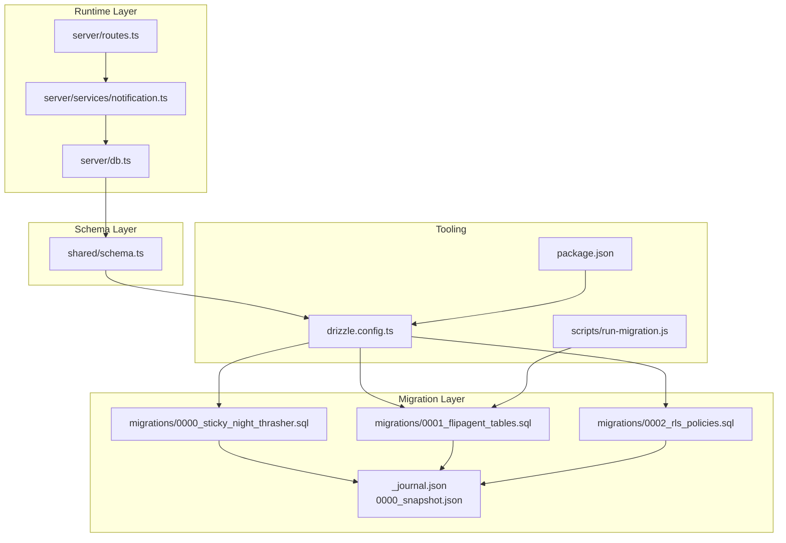
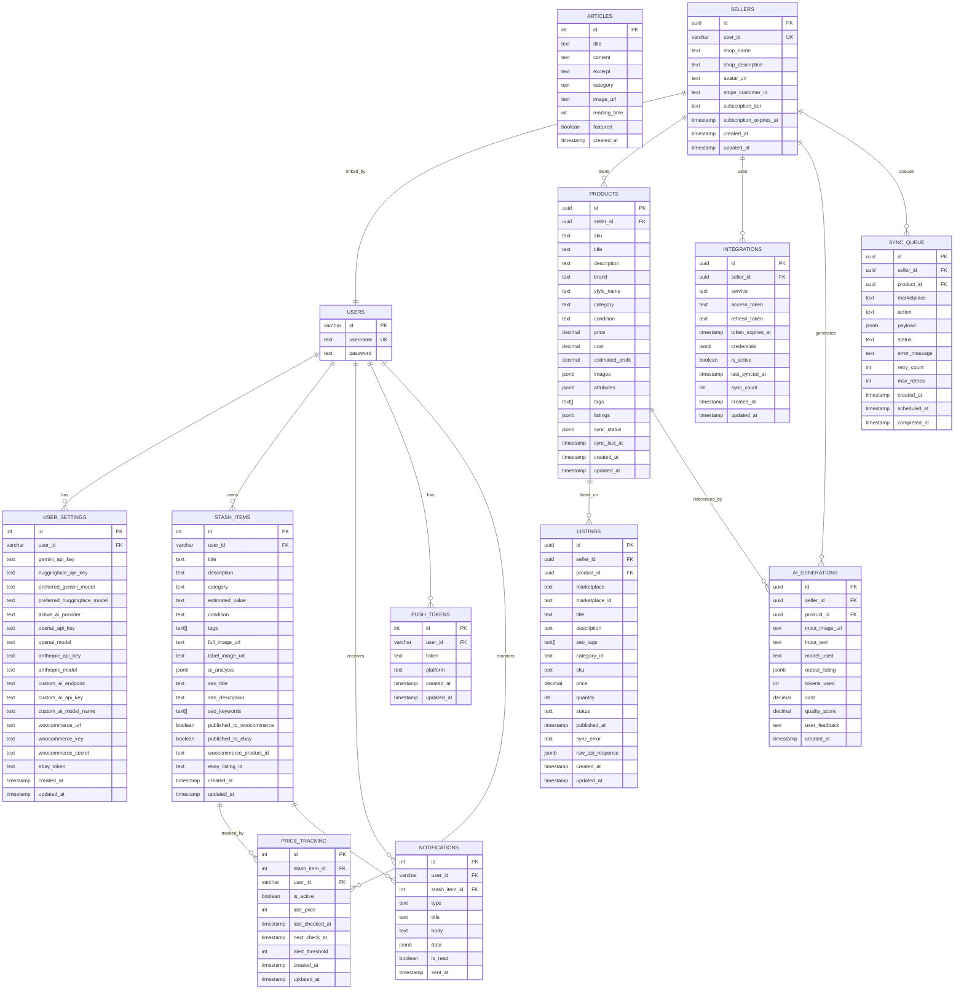
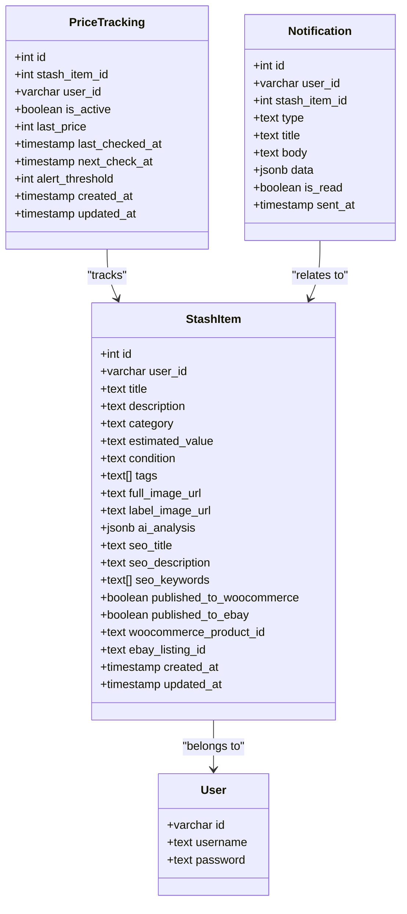
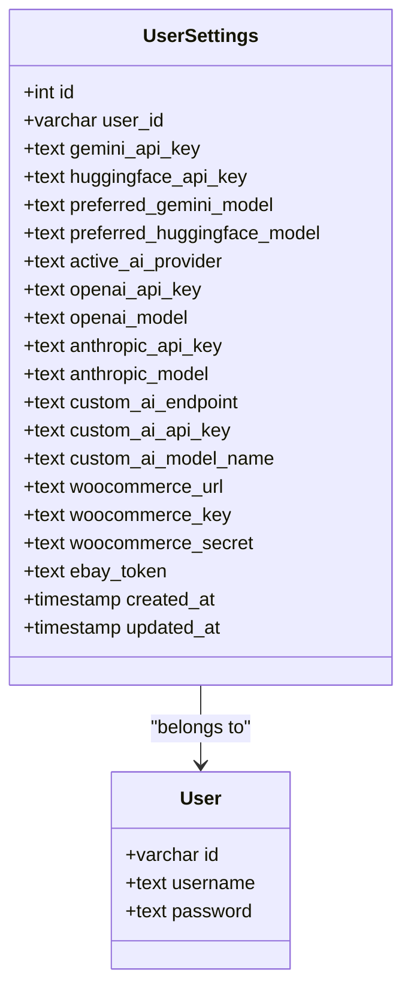
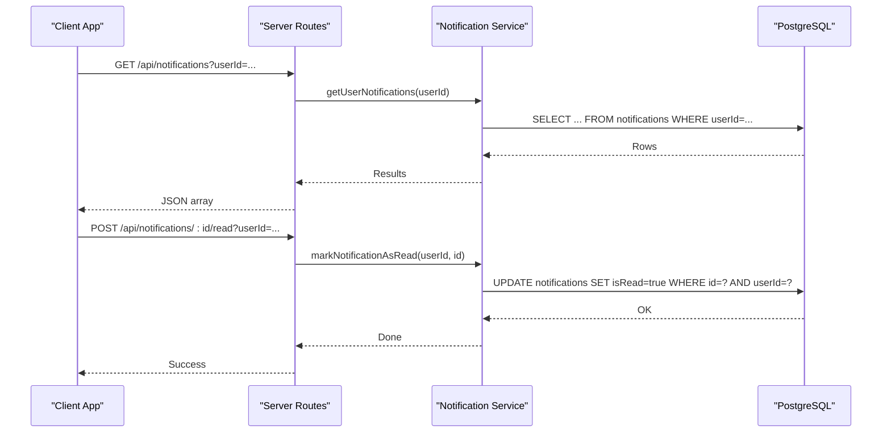
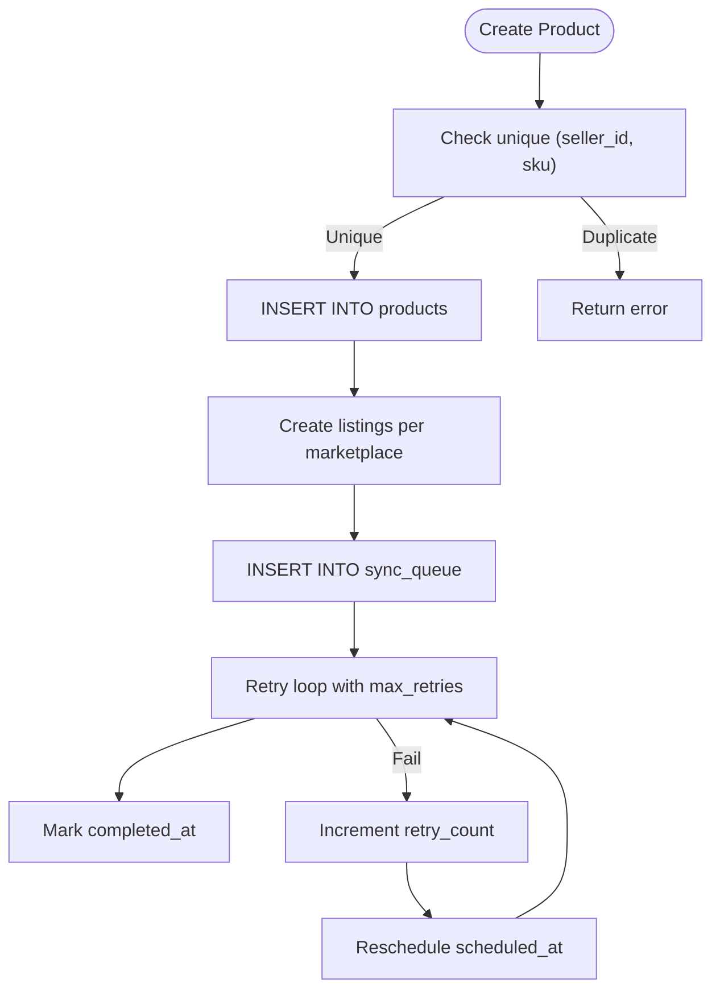
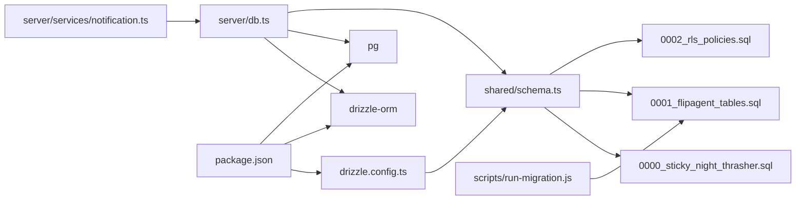

# Data Management

<cite>
**Referenced Files in This Document**
- [drizzle.config.ts](file://drizzle.config.ts)
- [server/db.ts](file://server/db.ts)
- [shared/schema.ts](file://shared/schema.ts)
- [migrations/0000_sticky_night_thrasher.sql](file://migrations/0000_sticky_night_thrasher.sql)
- [migrations/0001_flipagent_tables.sql](file://migrations/0001_flipagent_tables.sql)
- [migrations/0002_rls_policies.sql](file://migrations/0002_rls_policies.sql)
- [migrations/meta/_journal.json](file://migrations/meta/_journal.json)
- [migrations/meta/0000_snapshot.json](file://migrations/meta/0000_snapshot.json)
- [scripts/run-migration.js](file://scripts/run-migration.js)
- [server/services/notification.ts](file://server/services/notification.ts)
- [server/routes.ts](file://server/routes.ts)
- [package.json](file://package.json)
</cite>

## Table of Contents
1. [Introduction](#introduction)
2. [Project Structure](#project-structure)
3. [Core Components](#core-components)
4. [Architecture Overview](#architecture-overview)
5. [Detailed Component Analysis](#detailed-component-analysis)
6. [Dependency Analysis](#dependency-analysis)
7. [Performance Considerations](#performance-considerations)
8. [Troubleshooting Guide](#troubleshooting-guide)
9. [Conclusion](#conclusion)
10. [Appendices](#appendices)

## Introduction
This document provides comprehensive data model documentation for Hidden-Gem’s PostgreSQL database schema. It covers entity relationships among stashItems, userSettings, articles, notifications, and marketplace listings, detailing field definitions, data types, primary and foreign keys, indexes, and constraints. It also explains the Drizzle ORM configuration, migration management, and data access patterns. Guidance is included for data lifecycle management, indexing strategies, transaction handling, security considerations, access control policies, and backup/recovery procedures. Examples of CRUD operations, complex queries, and migration scenarios are provided to help developers implement and maintain the data layer effectively.

## Project Structure
The data model is defined in a single source-of-truth schema file and materialized through SQL migrations. Drizzle Kit is configured to generate and apply migrations against a PostgreSQL database. The server-side code uses Drizzle ORM to connect to the database and perform data operations.

**Diagram sources**
- [drizzle.config.ts](file://drizzle.config.ts#L1-L19)
- [server/db.ts](file://server/db.ts#L1-L19)
- [shared/schema.ts](file://shared/schema.ts#L1-L344)
- [migrations/0000_sticky_night_thrasher.sql](file://migrations/0000_sticky_night_thrasher.sql#L1-L82)
- [migrations/0001_flipagent_tables.sql](file://migrations/0001_flipagent_tables.sql#L1-L117)
- [migrations/0002_rls_policies.sql](file://migrations/0002_rls_policies.sql#L1-L66)
- [migrations/meta/_journal.json](file://migrations/meta/_journal.json#L1-L13)
- [migrations/meta/0000_snapshot.json](file://migrations/meta/0000_snapshot.json#L1-L523)
- [scripts/run-migration.js](file://scripts/run-migration.js#L1-L34)
- [server/services/notification.ts](file://server/services/notification.ts#L1-L414)
- [server/routes.ts](file://server/routes.ts#L70-L107)
- [package.json](file://package.json#L1-L95)

**Section sources**
- [drizzle.config.ts](file://drizzle.config.ts#L1-L19)
- [server/db.ts](file://server/db.ts#L1-L19)
- [shared/schema.ts](file://shared/schema.ts#L1-L344)
- [migrations/0000_sticky_night_thrasher.sql](file://migrations/0000_sticky_night_thrasher.sql#L1-L82)
- [migrations/0001_flipagent_tables.sql](file://migrations/0001_flipagent_tables.sql#L1-L117)
- [migrations/0002_rls_policies.sql](file://migrations/0002_rls_policies.sql#L1-L66)
- [migrations/meta/_journal.json](file://migrations/meta/_journal.json#L1-L13)
- [migrations/meta/0000_snapshot.json](file://migrations/meta/0000_snapshot.json#L1-L523)
- [scripts/run-migration.js](file://scripts/run-migration.js#L1-L34)
- [server/services/notification.ts](file://server/services/notification.ts#L1-L414)
- [server/routes.ts](file://server/routes.ts#L70-L107)
- [package.json](file://package.json#L1-L95)

## Core Components
This section documents the core entities and their relationships, focusing on stashItems, userSettings, articles, notifications, and marketplace listings.

- users
  - Purpose: Authentication and identity for all users.
  - Primary key: id (varchar, primary key, default gen_random_uuid())
  - Constraints: username unique
  - Related entities: userSettings (one-to-one via user_id), stashItems (one-to-many via user_id), notifications (one-to-many via user_id), pushTokens (one-to-many via user_id), sellers (one-to-one via user_id)

- userSettings
  - Purpose: Stores per-user API keys and preferences for AI providers and marketplace integrations.
  - Primary key: id (serial)
  - Foreign key: user_id -> users(id) with cascade delete
  - Notable fields: geminiApiKey, huggingfaceApiKey, preferredGeminiModel, preferredHuggingfaceModel, openaiApiKeys, anthropicApiKeys, customAiEndpoint, customAiApiKey, customAiModelName, woocommerceUrl, woocommerceKey, woocommerceSecret, ebayToken
  - Timestamps: created_at, updated_at

- stashItems
  - Purpose: Represents user-owned items tracked for potential sale or resale.
  - Primary key: id (serial)
  - Foreign key: user_id -> users(id) with cascade delete
  - Notable fields: title, description, category, estimatedValue, condition, tags (array), fullImageUrl, labelImageUrl, aiAnalysis (jsonb), seoTitle, seoDescription, seoKeywords (array), publishedToWoocommerce, publishedToEbay, woocommerceProductId, ebayListingId
  - Timestamps: created_at, updated_at

- articles
  - Purpose: Static content articles.
  - Primary key: id (serial)
  - Fields: title, content, excerpt, category, imageUrl, readingTime (default 5), featured (default false), createdAt

- notifications
  - Purpose: Historical record of sent notifications to users.
  - Primary key: id (serial)
  - Foreign key: user_id -> users(id) with cascade delete
  - Optional foreign key: stashItemId -> stashItems(id) with cascade delete
  - Fields: type, title, body, data (jsonb), isRead (default false), sentAt

- pushTokens
  - Purpose: Device push notification tokens per user.
  - Primary key: id (serial)
  - Foreign key: user_id -> users(id) with cascade delete
  - Fields: token (text), platform ('ios' | 'android' | 'web'), timestamps

- priceTracking
  - Purpose: Tracks price changes for stash items and triggers alerts.
  - Primary key: id (serial)
  - Foreign keys: stash_item_id -> stashItems(id) with cascade delete, user_id -> users(id) with cascade delete
  - Fields: isActive (default true), lastPrice, lastCheckedAt, nextCheckAt, alertThreshold, timestamps

- sellers (FlipAgent)
  - Purpose: Marketplace seller profile linked to users.
  - Primary key: id (uuid)
  - Unique constraint: user_id unique
  - Foreign key: user_id -> users(id) with cascade delete
  - Fields: shopName, shopDescription, avatarUrl, stripeCustomerId, subscriptionTier, subscriptionExpiresAt, timestamps

- products (FlipAgent)
  - Purpose: Inventory items with pricing and metadata.
  - Primary key: id (uuid)
  - Unique index: (seller_id, sku)
  - Foreign key: seller_id -> sellers(id) with cascade delete
  - Fields: sku, title, description, brand, styleName, category, condition, price, cost, estimatedProfit, images (jsonb), attributes (jsonb), tags (array), listings (jsonb), syncStatus (jsonb), syncLastAt, timestamps

- listings (FlipAgent)
  - Purpose: Per-marketplace listing records.
  - Primary key: id (uuid)
  - Foreign keys: seller_id -> sellers(id) with cascade delete, product_id -> products(id) with cascade delete
  - Fields: marketplace, marketplaceId, title, description, seoTags (array), categoryId, sku, price, quantity, status, publishedAt, syncError, rawApiResponse (jsonb), timestamps

- integrations (FlipAgent)
  - Purpose: Credentials and state for external integrations.
  - Primary key: id (uuid)
  - Unique index: (seller_id, service)
  - Foreign key: seller_id -> sellers(id) with cascade delete
  - Fields: service, accessToken, refreshToken, tokenExpiresAt, credentials (jsonb), isActive, lastSyncedAt, syncCount, timestamps

- aiGenerations (FlipAgent)
  - Purpose: Audit trail of AI-generated listings.
  - Primary key: id (uuid)
  - Foreign keys: seller_id -> sellers(id) with cascade delete, product_id -> products(id) with set null
  - Fields: inputImageUrl, inputText, modelUsed, outputListing (jsonb), tokensUsed, cost, qualityScore, userFeedback, createdAt

- syncQueue (FlipAgent)
  - Purpose: Async retry queue for marketplace sync operations.
  - Primary key: id (uuid)
  - Foreign keys: seller_id -> sellers(id) with cascade delete, product_id -> products(id) with cascade delete
  - Fields: marketplace, action, payload (jsonb), status, errorMessage, retryCount, maxRetries, timestamps (including scheduledAt)

**Section sources**
- [shared/schema.ts](file://shared/schema.ts#L6-L126)
- [shared/schema.ts](file://shared/schema.ts#L128-L220)
- [shared/schema.ts](file://shared/schema.ts#L258-L293)
- [migrations/0000_sticky_night_thrasher.sql](file://migrations/0000_sticky_night_thrasher.sql#L1-L82)
- [migrations/0001_flipagent_tables.sql](file://migrations/0001_flipagent_tables.sql#L5-L117)
- [migrations/meta/0000_snapshot.json](file://migrations/meta/0000_snapshot.json#L6-L523)

## Architecture Overview
The data architecture centers around a single schema definition that is translated into SQL migrations and enforced at runtime via Drizzle ORM. Access control is implemented using Row-Level Security (RLS) policies for marketplace-related tables.

**Diagram sources**
- [shared/schema.ts](file://shared/schema.ts#L6-L126)
- [shared/schema.ts](file://shared/schema.ts#L128-L220)
- [shared/schema.ts](file://shared/schema.ts#L258-L293)
- [migrations/0001_flipagent_tables.sql](file://migrations/0001_flipagent_tables.sql#L5-L117)

## Detailed Component Analysis

### Stash Items Model
Stash items represent user-owned collectibles or inventory tracked for potential sale. They include AI analysis artifacts, SEO metadata, and marketplace publication flags.

**Diagram sources**
- [shared/schema.ts](file://shared/schema.ts#L29-L50)
- [shared/schema.ts](file://shared/schema.ts#L6-L12)
- [shared/schema.ts](file://shared/schema.ts#L268-L280)
- [shared/schema.ts](file://shared/schema.ts#L283-L293)

**Section sources**
- [shared/schema.ts](file://shared/schema.ts#L29-L50)
- [shared/schema.ts](file://shared/schema.ts#L268-L280)
- [shared/schema.ts](file://shared/schema.ts#L283-L293)
- [migrations/0000_sticky_night_thrasher.sql](file://migrations/0000_sticky_night_thrasher.sql#L27-L48)

### User Settings Model
User settings encapsulate API keys and provider preferences, with cascading deletion tied to user removal.

**Diagram sources**
- [shared/schema.ts](file://shared/schema.ts#L14-L27)
- [shared/schema.ts](file://shared/schema.ts#L6-L12)
- [migrations/0000_sticky_night_thrasher.sql](file://migrations/0000_sticky_night_thrasher.sql#L50-L71)

**Section sources**
- [shared/schema.ts](file://shared/schema.ts#L14-L27)
- [migrations/0000_sticky_night_thrasher.sql](file://migrations/0000_sticky_night_thrasher.sql#L50-L71)

### Notifications and Push Tokens
Notifications capture sent alerts with optional linkage to stash items. Push tokens are registered per user for cross-platform delivery.

**Diagram sources**
- [server/routes.ts](file://server/routes.ts#L74-L107)
- [server/services/notification.ts](file://server/services/notification.ts#L274-L312)

**Section sources**
- [shared/schema.ts](file://shared/schema.ts#L258-L293)
- [server/services/notification.ts](file://server/services/notification.ts#L274-L312)
- [server/routes.ts](file://server/routes.ts#L74-L107)

### Marketplace Listings (FlipAgent)
The FlipAgent tables model seller profiles, inventory, listings, integrations, AI generation logs, and a sync queue.

**Diagram sources**
- [shared/schema.ts](file://shared/schema.ts#L128-L220)
- [migrations/0001_flipagent_tables.sql](file://migrations/0001_flipagent_tables.sql#L5-L117)

**Section sources**
- [shared/schema.ts](file://shared/schema.ts#L128-L220)
- [migrations/0001_flipagent_tables.sql](file://migrations/0001_flipagent_tables.sql#L5-L117)

## Dependency Analysis
The runtime layer depends on the schema definition and Drizzle ORM. Migrations are managed by Drizzle Kit and applied via scripts or commands.

**Diagram sources**
- [drizzle.config.ts](file://drizzle.config.ts#L1-L19)
- [server/db.ts](file://server/db.ts#L1-L19)
- [shared/schema.ts](file://shared/schema.ts#L1-L344)
- [migrations/0000_sticky_night_thrasher.sql](file://migrations/0000_sticky_night_thrasher.sql#L1-L82)
- [migrations/0001_flipagent_tables.sql](file://migrations/0001_flipagent_tables.sql#L1-L117)
- [migrations/0002_rls_policies.sql](file://migrations/0002_rls_policies.sql#L1-L66)
- [scripts/run-migration.js](file://scripts/run-migration.js#L1-L34)
- [package.json](file://package.json#L1-L95)

**Section sources**
- [drizzle.config.ts](file://drizzle.config.ts#L1-L19)
- [server/db.ts](file://server/db.ts#L1-L19)
- [shared/schema.ts](file://shared/schema.ts#L1-L344)
- [migrations/0000_sticky_night_thrasher.sql](file://migrations/0000_sticky_night_thrasher.sql#L1-L82)
- [migrations/0001_flipagent_tables.sql](file://migrations/0001_flipagent_tables.sql#L1-L117)
- [migrations/0002_rls_policies.sql](file://migrations/0002_rls_policies.sql#L1-L66)
- [scripts/run-migration.js](file://scripts/run-migration.js#L1-L34)
- [package.json](file://package.json#L1-L95)

## Performance Considerations
- Indexes
  - products: seller_id, (seller_id, sku) unique
  - listings: (seller_id, marketplace)
  - integrations: seller_id
  - sync_queue: (status, scheduled_at)
  - ai_generations: (seller_id, created_at DESC)
- Recommendations
  - Add selective indexes on frequently filtered columns (e.g., stash_items.user_id, notifications.user_id, notifications.sent_at)
  - Monitor slow query patterns and add covering indexes where appropriate
  - Use LIMIT clauses in paginated queries (as seen in notification retrieval)
  - Batch operations for sync_queue processing to reduce round trips

**Section sources**
- [migrations/0001_flipagent_tables.sql](file://migrations/0001_flipagent_tables.sql#L110-L116)
- [server/services/notification.ts](file://server/services/notification.ts#L274-L284)

## Troubleshooting Guide
- Environment Setup
  - Ensure DATABASE_URL is present in the environment; otherwise, the database connection will fail during initialization.
- Migration Issues
  - Drizzle Kit requires DATABASE_URL; confirm the environment variable is loaded before running migrations.
  - The manual migration runner executes a specific migration script; verify table existence post-run.
- RLS Policies
  - RLS is enabled for FlipAgent tables; ensure Supabase Auth is available or adapt policies for non-Supabase environments.
- Data Access Patterns
  - Use Drizzle ORM methods for inserts, updates, selects, and joins as demonstrated in the notification service.
  - For complex queries (e.g., price tracking), leverage inner joins and date comparisons carefully to avoid performance pitfalls.

**Section sources**
- [server/db.ts](file://server/db.ts#L7-L9)
- [drizzle.config.ts](file://drizzle.config.ts#L7-L9)
- [scripts/run-migration.js](file://scripts/run-migration.js#L5-L28)
- [migrations/0002_rls_policies.sql](file://migrations/0002_rls_policies.sql#L1-L11)
- [server/services/notification.ts](file://server/services/notification.ts#L332-L413)

## Conclusion
Hidden-Gem’s data model is centered on a unified schema that defines core entities and marketplace extensions. Drizzle ORM and Drizzle Kit streamline schema management and runtime access. RLS policies protect marketplace data by tying rows to authenticated users. The provided indexes and access patterns support efficient querying and scalable growth. Adhering to the outlined practices ensures robust data lifecycle management, strong security, and reliable performance.

## Appendices

### Field Definitions and Constraints Reference
- users
  - id: varchar, PK, default gen_random_uuid()
  - username: text, unique
  - password: text
- userSettings
  - id: serial, PK
  - user_id: varchar, FK users(id) cascade delete
  - API/provider fields: text
  - created_at/updated_at: timestamps
- stashItems
  - id: serial, PK
  - user_id: varchar, FK users(id) cascade delete
  - media/SEO fields: text, text[], jsonb
  - marketplace flags: booleans
  - created_at/updated_at: timestamps
- articles
  - id: serial, PK
  - metadata: text, integers, booleans, timestamps
- notifications
  - id: serial, PK
  - user_id: varchar, FK users(id) cascade delete
  - stash_item_id: integer, FK stash_items(id) cascade delete
  - type/title/body/data/isRead/sent_at
- pushTokens
  - id: serial, PK
  - user_id: varchar, FK users(id) cascade delete
  - token/platform/timestamps
- priceTracking
  - id: serial, PK
  - stash_item_id/user_id: FKs with cascade delete
  - isActive/alertThreshold/price timestamps

**Section sources**
- [shared/schema.ts](file://shared/schema.ts#L6-L126)
- [shared/schema.ts](file://shared/schema.ts#L258-L293)
- [migrations/0000_sticky_night_thrasher.sql](file://migrations/0000_sticky_night_thrasher.sql#L1-L82)

### CRUD and Complex Query Examples
- CRUD Operations
  - Insert user: select insert schema for users and insert via Drizzle ORM
  - Upsert user settings: insert with omit fields for auto-generated timestamps
  - Insert stash item: omit id and timestamps; cascade delete on user removal
  - Insert notification: include type, title, body, optional data payload
- Complex Queries
  - Price tracking alerting: join priceTracking with stashItems, compute percentage change, compare to threshold, and insert notification
  - Notification history: select with ordering and limits by user id

**Section sources**
- [shared/schema.ts](file://shared/schema.ts#L78-L108)
- [server/services/notification.ts](file://server/services/notification.ts#L162-L223)
- [server/services/notification.ts](file://server/services/notification.ts#L332-L413)
- [server/services/notification.ts](file://server/services/notification.ts#L274-L312)

### Migration Management
- Drizzle Kit
  - Configure schema path and output directory; ensure DATABASE_URL is set
- Manual Migration Runner
  - Executes a specific migration script and verifies table creation
- Migration Journal and Snapshot
  - Track applied migrations and schema snapshots for reproducibility

**Section sources**
- [drizzle.config.ts](file://drizzle.config.ts#L1-L19)
- [scripts/run-migration.js](file://scripts/run-migration.js#L5-L28)
- [migrations/meta/_journal.json](file://migrations/meta/_journal.json#L1-L13)
- [migrations/meta/0000_snapshot.json](file://migrations/meta/0000_snapshot.json#L1-L523)

### Transaction Handling Patterns
- Use Drizzle ORM transactions for multi-step operations (e.g., creating a product and associated listings) to ensure atomicity.
- For sync_queue processing, wrap retries in transactions to prevent partial state updates.

[No sources needed since this section provides general guidance]

### Data Security and Access Control
- Row-Level Security
  - Enabled for FlipAgent tables; policies restrict access to rows owned by the authenticated user
- API Keys and Secrets
  - Stored in userSettings; treat as sensitive data and avoid logging
- Push Token Handling
  - Store tokens per user; ensure secure transmission and avoid exposing tokens

**Section sources**
- [migrations/0002_rls_policies.sql](file://migrations/0002_rls_policies.sql#L1-L66)
- [shared/schema.ts](file://shared/schema.ts#L14-L27)
- [server/services/notification.ts](file://server/services/notification.ts#L31-L58)

### Backup and Recovery Procedures
- Use database-native backup tools to export schema and data regularly.
- Maintain migration snapshots and journal entries to recreate schema state.
- For development environments, leverage built-in database capabilities where available.

**Section sources**
- [.local/skills/database/README.md](file://.local/skills/database/README.md#L137-L204)