# Data Operations

<cite>
**Referenced Files in This Document**
- [drizzle.config.ts](file://drizzle.config.ts)
- [server/db.ts](file://server/db.ts)
- [shared/schema.ts](file://shared/schema.ts)
- [migrations/0000_sticky_night_thrasher.sql](file://migrations/0000_sticky_night_thrasher.sql)
- [migrations/0001_flipagent_tables.sql](file://migrations/0001_flipagent_tables.sql)
- [migrations/0002_rls_policies.sql](file://migrations/0002_rls_policies.sql)
- [scripts/run-migration.js](file://scripts/run-migration.js)
- [server/services/notification.ts](file://server/services/notification.ts)
- [server/routes.ts](file://server/routes.ts)
- [server/index.ts](file://server/index.ts)
- [client/lib/marketplace.ts](file://client/lib/marketplace.ts)
- [client/screens/ItemDetailsScreen.tsx](file://client/screens/ItemDetailsScreen.tsx)
</cite>

## Table of Contents
1. [Introduction](#introduction)
2. [Project Structure](#project-structure)
3. [Core Components](#core-components)
4. [Architecture Overview](#architecture-overview)
5. [Detailed Component Analysis](#detailed-component-analysis)
6. [Dependency Analysis](#dependency-analysis)
7. [Performance Considerations](#performance-considerations)
8. [Troubleshooting Guide](#troubleshooting-guide)
9. [Conclusion](#conclusion)
10. [Appendices](#appendices)

## Introduction
This document explains how Hidden-Gem manages data and databases using drizzle-orm with PostgreSQL. It covers entity schemas, CRUD operations, query patterns, transactions, validation, migrations, seeding, bulk operations, complex queries and joins, aggregations, integrity constraints, backup/recovery, and operational maintenance. It also provides troubleshooting guidance for common database issues.

## Project Structure
The data layer is organized around a single schema definition that drives both runtime ORM usage and migration generation. Migrations are stored under the migrations directory and are applied either via DrizzleKit or manually with a helper script. The backend server exposes REST endpoints that perform CRUD and complex operations backed by drizzle-orm.

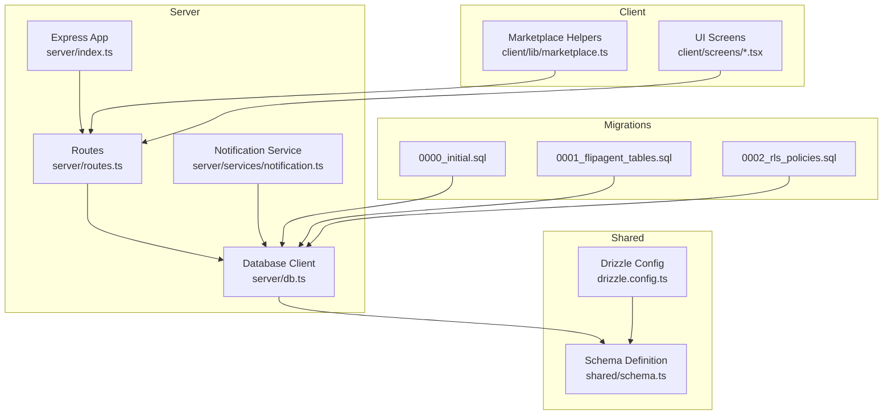

**Diagram sources**
- [server/index.ts](file://server/index.ts#L1-L262)
- [server/routes.ts](file://server/routes.ts#L70-L107)
- [server/db.ts](file://server/db.ts#L1-L19)
- [server/services/notification.ts](file://server/services/notification.ts#L1-L321)
- [shared/schema.ts](file://shared/schema.ts#L1-L344)
- [drizzle.config.ts](file://drizzle.config.ts#L1-L19)
- [migrations/0000_sticky_night_thrasher.sql](file://migrations/0000_sticky_night_thrasher.sql#L1-L82)
- [migrations/0001_flipagent_tables.sql](file://migrations/0001_flipagent_tables.sql#L1-L117)
- [migrations/0002_rls_policies.sql](file://migrations/0002_rls_policies.sql#L1-L66)
- [client/lib/marketplace.ts](file://client/lib/marketplace.ts#L73-L115)
- [client/screens/ItemDetailsScreen.tsx](file://client/screens/ItemDetailsScreen.tsx#L104-L148)

**Section sources**
- [drizzle.config.ts](file://drizzle.config.ts#L1-L19)
- [server/db.ts](file://server/db.ts#L1-L19)
- [shared/schema.ts](file://shared/schema.ts#L1-L344)
- [migrations/0000_sticky_night_thrasher.sql](file://migrations/0000_sticky_night_thrasher.sql#L1-L82)
- [migrations/0001_flipagent_tables.sql](file://migrations/0001_flipagent_tables.sql#L1-L117)
- [migrations/0002_rls_policies.sql](file://migrations/0002_rls_policies.sql#L1-L66)
- [scripts/run-migration.js](file://scripts/run-migration.js#L1-L34)
- [server/index.ts](file://server/index.ts#L1-L262)

## Core Components
- Schema and Validation: Entities and Zod insert schemas are defined centrally and used for validation and type safety.
- Database Client: A drizzle-orm client configured with a PostgreSQL connection pool.
- Migration System: DrizzleKit config and SQL migrations for schema evolution.
- Services and Routes: Business logic and endpoints for CRUD and complex operations.
- Notifications: Push token registration, notification history, and price alerts.

**Section sources**
- [shared/schema.ts](file://shared/schema.ts#L1-L344)
- [server/db.ts](file://server/db.ts#L1-L19)
- [drizzle.config.ts](file://drizzle.config.ts#L1-L19)
- [migrations/0000_sticky_night_thrasher.sql](file://migrations/0000_sticky_night_thrasher.sql#L1-L82)
- [migrations/0001_flipagent_tables.sql](file://migrations/0001_flipagent_tables.sql#L1-L117)
- [migrations/0002_rls_policies.sql](file://migrations/0002_rls_policies.sql#L1-L66)
- [server/services/notification.ts](file://server/services/notification.ts#L1-L321)
- [server/routes.ts](file://server/routes.ts#L70-L107)

## Architecture Overview
The backend uses drizzle-orm to connect to PostgreSQL. Routes orchestrate requests and delegate to services that perform database operations. Migrations evolve the schema; RLS policies secure data at the database level.

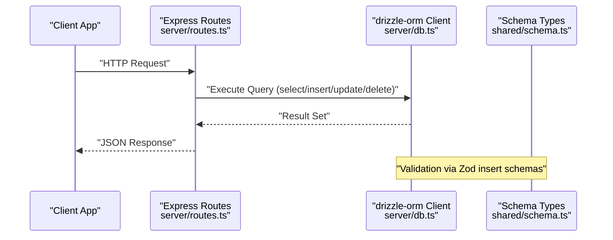

**Diagram sources**
- [server/routes.ts](file://server/routes.ts#L70-L107)
- [server/db.ts](file://server/db.ts#L1-L19)
- [shared/schema.ts](file://shared/schema.ts#L78-L108)

## Detailed Component Analysis

### Users
- Purpose: Authentication identity and profile linkage.
- Key constraints: Username uniqueness; cascading deletes for dependent records.
- Typical operations: Create user, get by ID/username, update settings.
- Validation: Zod insert schema restricts fields during creation.

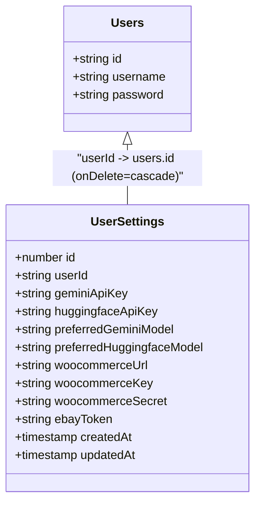

**Diagram sources**
- [shared/schema.ts](file://shared/schema.ts#L6-L12)
- [shared/schema.ts](file://shared/schema.ts#L14-L27)

**Section sources**
- [shared/schema.ts](file://shared/schema.ts#L6-L12)
- [shared/schema.ts](file://shared/schema.ts#L14-L27)
- [shared/schema.ts](file://shared/schema.ts#L78-L87)

### Stash Items
- Purpose: Personal collection items with metadata, SEO, and marketplace publishing flags.
- Key constraints: Cascading deletes; arrays and JSONB fields for flexible data.
- Typical operations: List, get by id, create, update, delete; publish to marketplace endpoints.
- Validation: Zod insert schema omits auto-generated fields.

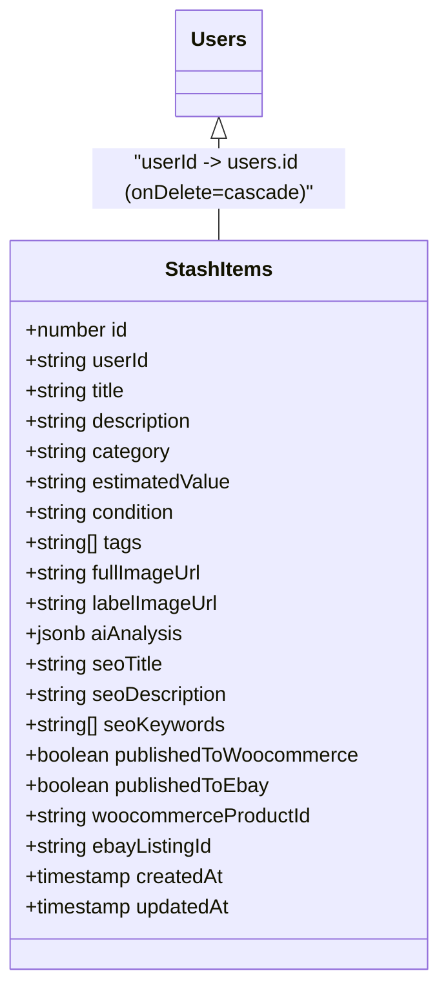

**Diagram sources**
- [shared/schema.ts](file://shared/schema.ts#L29-L50)

**Section sources**
- [shared/schema.ts](file://shared/schema.ts#L29-L50)
- [shared/schema.ts](file://shared/schema.ts#L89-L93)
- [server/routes.ts](file://server/routes.ts#L217-L256)
- [server/routes.ts](file://server/routes.ts#L387-L455)
- [server/routes.ts](file://server/routes.ts#L457-L473)

### Marketplace Data (FlipAgent)
- Sellers: Per-user seller profiles.
- Products: Inventory with SKU, pricing, images, attributes, listings, sync metadata.
- Listings: Per-marketplace listing entries with status and sync info.
- Integrations: OAuth tokens and credentials for external services.
- AI Generations: Audit trail of AI-assisted listing generation.
- Sync Queue: Async job queue for marketplace sync with retries.

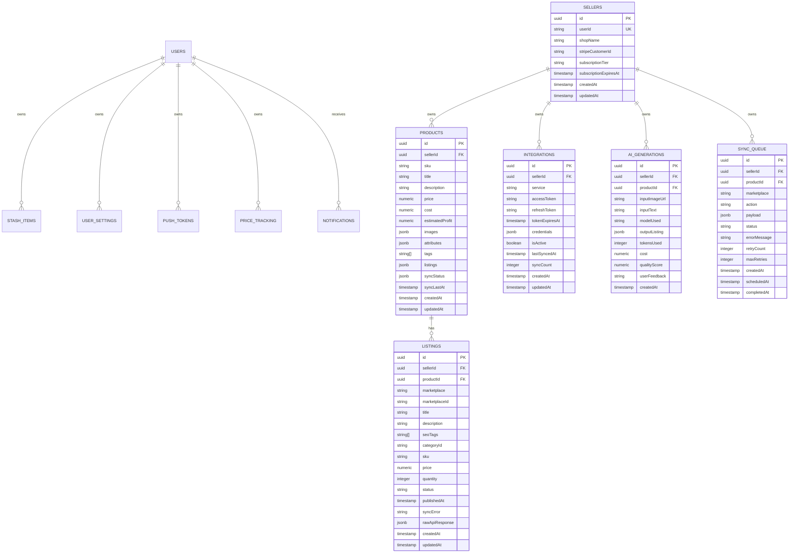

**Diagram sources**
- [shared/schema.ts](file://shared/schema.ts#L115-L126)
- [shared/schema.ts](file://shared/schema.ts#L128-L151)
- [shared/schema.ts](file://shared/schema.ts#L153-L172)
- [shared/schema.ts](file://shared/schema.ts#L205-L220)
- [shared/schema.ts](file://shared/schema.ts#L174-L187)
- [shared/schema.ts](file://shared/schema.ts#L189-L203)

**Section sources**
- [shared/schema.ts](file://shared/schema.ts#L115-L126)
- [shared/schema.ts](file://shared/schema.ts#L128-L151)
- [shared/schema.ts](file://shared/schema.ts#L153-L172)
- [shared/schema.ts](file://shared/schema.ts#L205-L220)
- [shared/schema.ts](file://shared/schema.ts#L174-L187)
- [shared/schema.ts](file://shared/schema.ts#L189-L203)

### Notifications
- Purpose: Push tokens, notification history, and price alerts.
- Operations: Register/unregister tokens, send notifications, fetch history, mark read, unread counts.

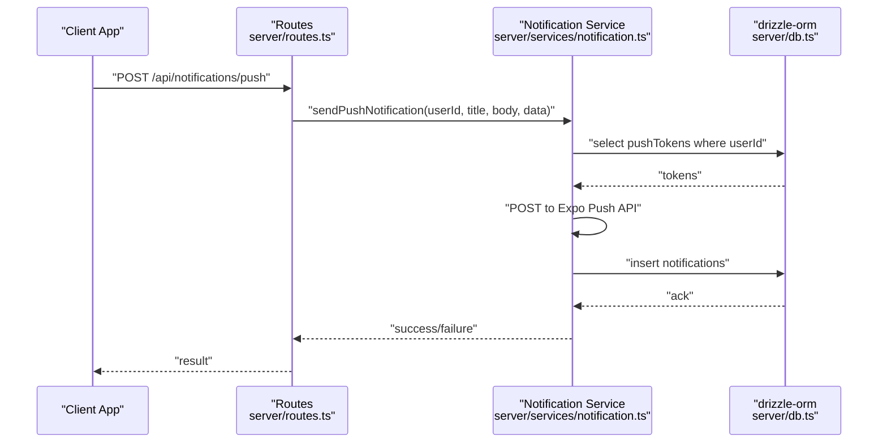

**Diagram sources**
- [server/routes.ts](file://server/routes.ts#L70-L107)
- [server/services/notification.ts](file://server/services/notification.ts#L72-L129)
- [server/db.ts](file://server/db.ts#L1-L19)

**Section sources**
- [shared/schema.ts](file://shared/schema.ts#L258-L293)
- [server/services/notification.ts](file://server/services/notification.ts#L1-L321)
- [server/routes.ts](file://server/routes.ts#L70-L107)

### Articles, Conversations, Messages
- Articles: Content with SEO fields and timestamps.
- Conversations: Chat threads.
- Messages: Individual messages linked to conversations with roles and timestamps.

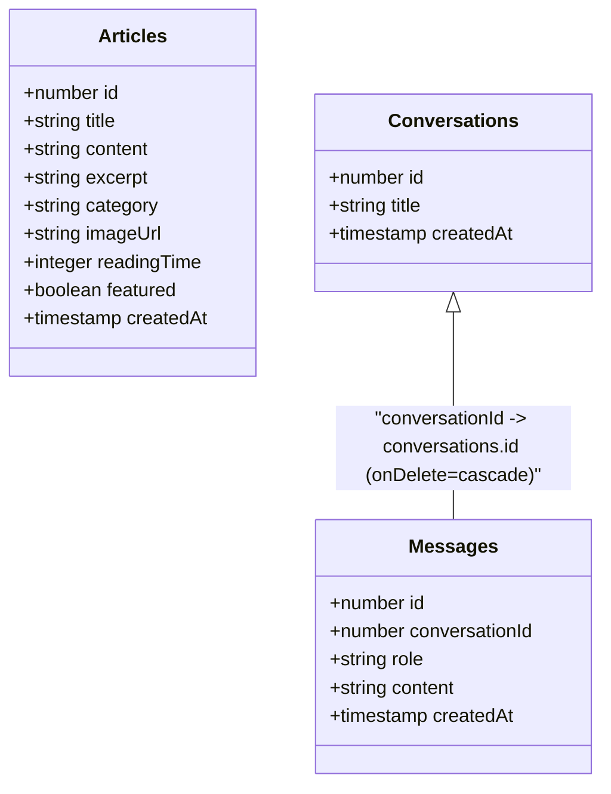

**Diagram sources**
- [shared/schema.ts](file://shared/schema.ts#L52-L62)
- [shared/schema.ts](file://shared/schema.ts#L64-L76)

**Section sources**
- [shared/schema.ts](file://shared/schema.ts#L52-L62)
- [shared/schema.ts](file://shared/schema.ts#L64-L76)

### CRUD Operations and Query Patterns
- Selects: Single record by primary key, paginated lists, counts, and ordered queries.
- Inserts: Zod-insert schemas ensure validated payloads; server-side defaults populate timestamps.
- Updates: Cascade-triggered updates; selective field updates for flags and metadata.
- Deletes: Cascades remove dependent records; explicit deletion endpoints for stash items.

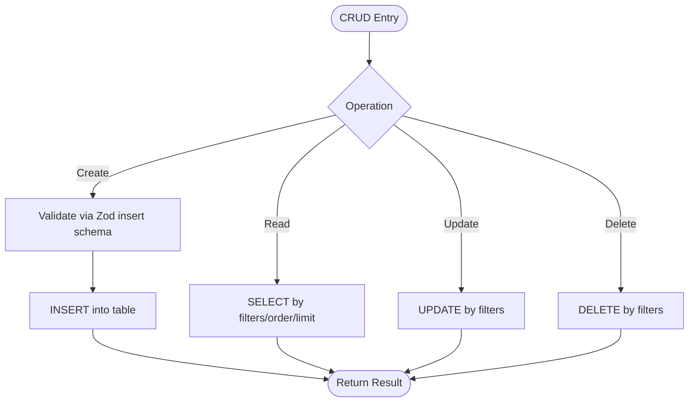

**Diagram sources**
- [shared/schema.ts](file://shared/schema.ts#L78-L108)
- [server/routes.ts](file://server/routes.ts#L217-L256)
- [server/routes.ts](file://server/routes.ts#L387-L455)

**Section sources**
- [shared/schema.ts](file://shared/schema.ts#L78-L108)
- [server/routes.ts](file://server/routes.ts#L217-L256)
- [server/routes.ts](file://server/routes.ts#L387-L455)

### Transactions and Data Integrity
- Foreign Keys: Defined in schema and enforced by PostgreSQL; cascading deletes propagate removals.
- Unique Constraints: Composite unique indexes on seller+sku and seller+service.
- Row-Level Security: Policies restrict access to seller-owned rows via auth.uid().

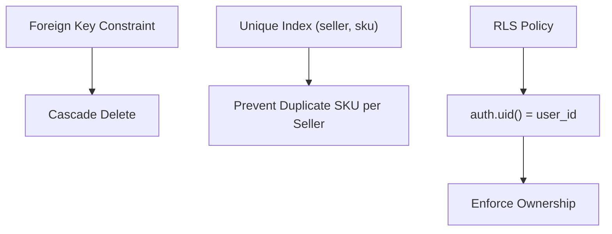

**Diagram sources**
- [shared/schema.ts](file://shared/schema.ts#L149-L151)
- [shared/schema.ts](file://shared/schema.ts#L218-L220)
- [migrations/0002_rls_policies.sql](file://migrations/0002_rls_policies.sql#L13-L29)

**Section sources**
- [shared/schema.ts](file://shared/schema.ts#L149-L151)
- [shared/schema.ts](file://shared/schema.ts#L218-L220)
- [migrations/0002_rls_policies.sql](file://migrations/0002_rls_policies.sql#L1-L66)

### Complex Queries, Joins, and Aggregations
- Join example: Fetch listings with product details and seller info.
- Aggregation example: Count total stash items.
- Filtering and ordering: Use where clauses, orderBy, and limits.

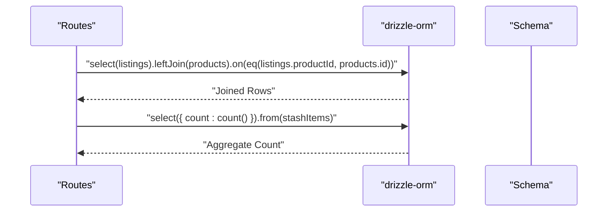

**Diagram sources**
- [server/routes.ts](file://server/routes.ts#L229-L237)
- [shared/schema.ts](file://shared/schema.ts#L153-L172)
- [shared/schema.ts](file://shared/schema.ts#L128-L151)

**Section sources**
- [server/routes.ts](file://server/routes.ts#L229-L237)

### Data Seeding and Bulk Operations
- Manual seed script: Applies specific migration SQL and verifies created tables.
- Bulk inserts: Use array-based insert patterns via drizzle-orm for multiple records.
- Notes: The repository includes a manual runner for initial FlipAgent tables.

**Section sources**
- [scripts/run-migration.js](file://scripts/run-migration.js#L1-L34)
- [migrations/0001_flipagent_tables.sql](file://migrations/0001_flipagent_tables.sql#L1-L117)

### Transaction Handling
- Current usage: Most routes perform single operations; no explicit transaction blocks observed.
- Recommendation: Wrap multi-step writes (e.g., create listing + update product sync status) in a transaction to maintain atomicity.

[No sources needed since this section provides general guidance]

### Data Validation Using drizzle-orm and Zod
- Validation pipeline: Zod insert schemas define allowed fields and types; drizzle-orm handles insertion with automatic defaults.
- Benefits: Prevents invalid data and ensures consistent shapes across the stack.

**Section sources**
- [shared/schema.ts](file://shared/schema.ts#L78-L108)
- [shared/schema.ts](file://shared/schema.ts#L223-L256)

### Migration System (DrizzleKit)
- Configuration: DrizzleKit reads DATABASE_URL, outputs migrations to ./migrations, and uses shared/schema.ts as the source of truth.
- Applying migrations: Use DrizzleKit CLI to generate and apply; alternatively, the manual runner applies specific SQL files.

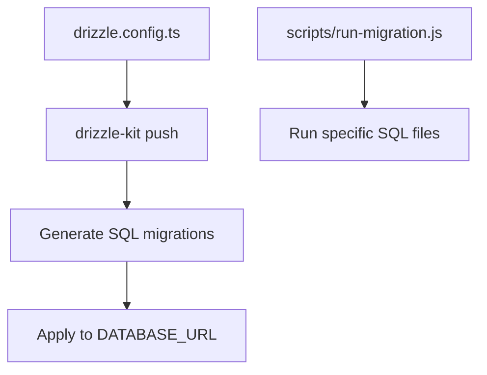

**Diagram sources**
- [drizzle.config.ts](file://drizzle.config.ts#L1-L19)
- [scripts/run-migration.js](file://scripts/run-migration.js#L1-L34)

**Section sources**
- [drizzle.config.ts](file://drizzle.config.ts#L1-L19)
- [scripts/run-migration.js](file://scripts/run-migration.js#L1-L34)

### Backup and Recovery Procedures
- Recommended approach: Use your hosting provider’s managed PostgreSQL backup/restore features.
- Local development: Export schema and data using standard PostgreSQL tools; restore into a new database for testing.

[No sources needed since this section provides general guidance]

### Database Maintenance Tasks
- Vacuum/analyze: Periodically maintain statistics and reclaim space.
- Index review: Monitor slow queries and add missing indexes (e.g., filters on sync_queue status and scheduled_at).
- RLS policy review: Ensure policies remain aligned with application logic.

[No sources needed since this section provides general guidance]

## Dependency Analysis
The server depends on the shared schema for type-safe queries and on drizzle-orm for database access. Routes depend on services for business logic, and services depend on the database client.

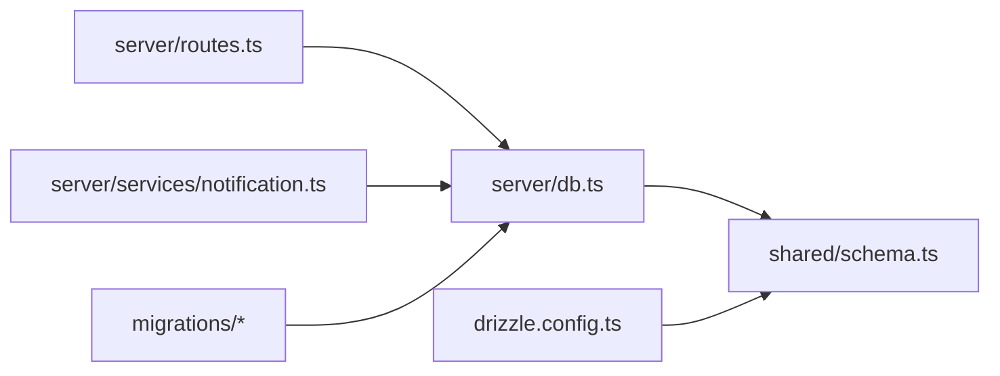

**Diagram sources**
- [server/routes.ts](file://server/routes.ts#L70-L107)
- [server/services/notification.ts](file://server/services/notification.ts#L1-L321)
- [server/db.ts](file://server/db.ts#L1-L19)
- [shared/schema.ts](file://shared/schema.ts#L1-L344)
- [drizzle.config.ts](file://drizzle.config.ts#L1-L19)
- [migrations/0000_sticky_night_thrasher.sql](file://migrations/0000_sticky_night_thrasher.sql#L1-L82)
- [migrations/0001_flipagent_tables.sql](file://migrations/0001_flipagent_tables.sql#L1-L117)
- [migrations/0002_rls_policies.sql](file://migrations/0002_rls_policies.sql#L1-L66)

**Section sources**
- [server/routes.ts](file://server/routes.ts#L70-L107)
- [server/services/notification.ts](file://server/services/notification.ts#L1-L321)
- [server/db.ts](file://server/db.ts#L1-L19)
- [shared/schema.ts](file://shared/schema.ts#L1-L344)
- [drizzle.config.ts](file://drizzle.config.ts#L1-L19)

## Performance Considerations
- Indexes: Existing indexes on seller_id, (seller_id, sku), (seller_id, marketplace), status+scheduled_at, and ai_generations seller+created_at improve targeted queries.
- Query patterns: Prefer filtered selects with order-by and limits; avoid N+1 selects by joining where appropriate.
- Asynchronous jobs: Use the sync queue to offload heavy marketplace operations.

**Section sources**
- [migrations/0001_flipagent_tables.sql](file://migrations/0001_flipagent_tables.sql#L110-L117)

## Troubleshooting Guide
- Connection issues:
  - Ensure DATABASE_URL is set and reachable.
  - Verify SSL settings match your environment.
- Migration failures:
  - Confirm DrizzleKit credentials and schema path.
  - For manual runs, check that the SQL file executes without syntax errors.
- RLS-related access denied:
  - Ensure the authenticated user’s uid matches ownership expectations.
- Notification delivery:
  - Validate push tokens and Expo API responses; check notification history insert.

**Section sources**
- [server/db.ts](file://server/db.ts#L7-L16)
- [drizzle.config.ts](file://drizzle.config.ts#L7-L9)
- [migrations/0002_rls_policies.sql](file://migrations/0002_rls_policies.sql#L1-L66)
- [server/services/notification.ts](file://server/services/notification.ts#L72-L129)

## Conclusion
Hidden-Gem’s data layer is centered on a robust schema, drizzle-orm for type-safe operations, and a pragmatic migration strategy. Integrity is enforced via foreign keys and RLS, while performance benefits from strategic indexes. The routes and services demonstrate practical CRUD and complex operations, with clear extension points for transactions, bulk operations, and advanced analytics.

## Appendices

### API Endpoints Overview
- Notifications:
  - GET /api/notifications
  - GET /api/notifications/unread-count
  - POST /api/notifications/:id/read
- Stash:
  - GET /api/stash
  - GET /api/stash/count
  - GET /api/stash/:id
  - POST /api/stash
  - PUT /api/stash/:id
  - DELETE /api/stash/:id
  - POST /api/stash/:id/publish/woocommerce
  - POST /api/stash/:id/publish/ebay
- Marketplace helpers:
  - publishToWooCommerce(itemId, settings)
  - publishToEbay(itemId, settings)

**Section sources**
- [server/routes.ts](file://server/routes.ts#L70-L107)
- [server/routes.ts](file://server/routes.ts#L217-L256)
- [server/routes.ts](file://server/routes.ts#L387-L473)
- [client/lib/marketplace.ts](file://client/lib/marketplace.ts#L73-L115)