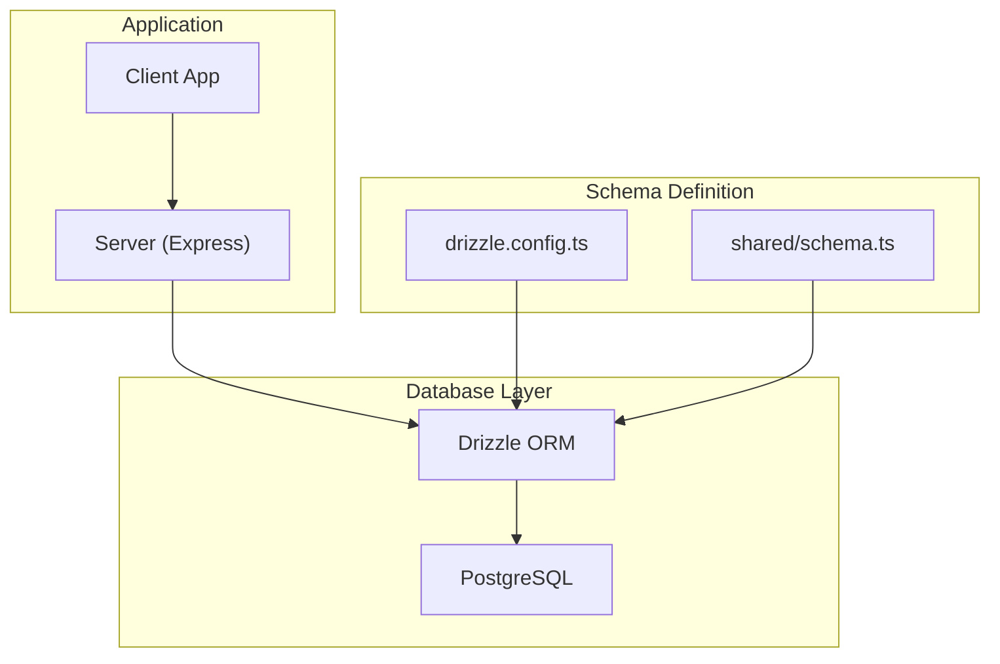
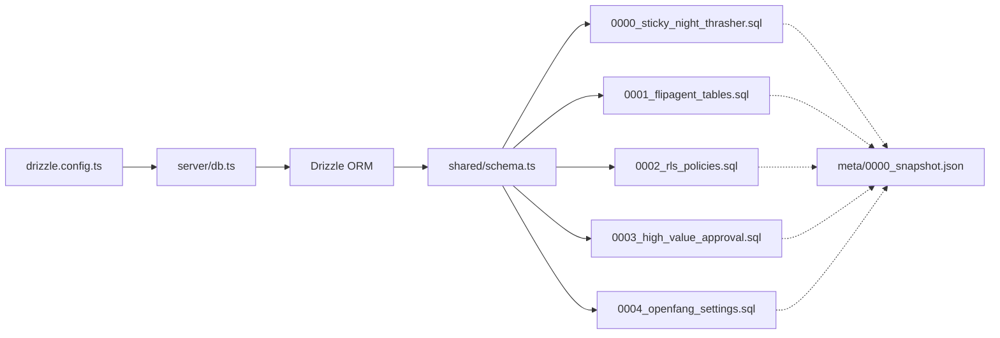

# Database Schema

<cite>
**Referenced Files in This Document**
- [drizzle.config.ts](file://drizzle.config.ts)
- [server/db.ts](file://server/db.ts)
- [shared/schema.ts](file://shared/schema.ts)
- [migrations/0000_sticky_night_thrasher.sql](file://migrations/0000_sticky_night_thrasher.sql)
- [migrations/0001_flipagent_tables.sql](file://migrations/0001_flipagent_tables.sql)
- [migrations/0002_rls_policies.sql](file://migrations/0002_rls_policies.sql)
- [migrations/0003_high_value_approval.sql](file://migrations/0003_high_value_approval.sql)
- [migrations/0004_openfang_settings.sql](file://migrations/0004_openfang_settings.sql)
- [migrations/meta/0000_snapshot.json](file://migrations/meta/0000_snapshot.json)
- [server/services/notification.ts](file://server/services/notification.ts)
- [shared/types.ts](file://shared/types.ts)
- [client/screens/AIProvidersScreen.tsx](file://client/screens/AIProvidersScreen.tsx)
- [server/ai-providers.ts](file://server/ai-providers.ts)
- [client/screens/ItemDetailsScreen.tsx](file://client/screens/ItemDetailsScreen.tsx)
</cite>

## Update Summary
**Changes Made**
- Updated userSettings table documentation to include new OpenFang-specific columns (openfang_api_key, openfang_base_url, preferred_openfang_model)
- Added high_value_threshold column documentation in userSettings table
- Updated stashItems table documentation to include publish_status column
- Enhanced AI provider configuration section to reflect OpenFang integration
- Updated architecture overview to show new high-value approval tracking capabilities
- Added comprehensive documentation for OpenFang AI provider implementation and high-value approval workflows

## Table of Contents
1. [Introduction](#introduction)
2. [Project Structure](#project-structure)
3. [Core Components](#core-components)
4. [Architecture Overview](#architecture-overview)
5. [Detailed Component Analysis](#detailed-component-analysis)
6. [Dependency Analysis](#dependency-analysis)
7. [Performance Considerations](#performance-considerations)
8. [Troubleshooting Guide](#troubleshooting-guide)
9. [Conclusion](#conclusion)
10. [Appendices](#appendices)

## Introduction
This document provides comprehensive data model documentation for Hidden-Gem's PostgreSQL database schema. It covers all entities, including core tables (users, userSettings, stashItems, articles, notifications), marketplace tables (sellers, products, listings, integrations), and auxiliary tables (conversations, messages, pushTokens, priceTracking). For each table, we document fields, data types, primary and foreign keys, indexes, constraints, and referential integrity. We explain the purpose and relationships among tables, focusing on how user data connects to marketplace operations. Business constraints, validation rules, unique indexes, and cascading delete behaviors are included. Composite keys and UUID usage rationale are explained, along with data lifecycle considerations.

**Updated** Added documentation for new high-value approval tracking and OpenFang AI provider integration features. The schema now supports enterprise-grade AI providers with configurable endpoints and enhanced approval workflows for high-value items.

## Project Structure
Hidden-Gem uses Drizzle ORM with a PostgreSQL dialect. The schema is defined in a single TypeScript module and migrated via Drizzle Kit. The server connects to the database using a Node-PG pool and exposes CRUD operations through API routes.



**Diagram sources**
- [drizzle.config.ts:11-18](file://drizzle.config.ts#L11-L18)
- [server/db.ts:1-19](file://server/db.ts#L1-L19)
- [shared/schema.ts:1-50](file://shared/schema.ts#L1-L50)

**Section sources**
- [drizzle.config.ts:1-19](file://drizzle.config.ts#L1-L19)
- [server/db.ts:1-19](file://server/db.ts#L1-L19)
- [shared/schema.ts:1-50](file://shared/schema.ts#L1-L50)

## Core Components
This section summarizes the core relational entities and their roles in the system.

- users: Authentication and identity backbone. UUID primary key; username unique.
- userSettings: Per-user preferences and third-party API keys. Cascades on user deletion. **Updated** Now includes OpenFang AI provider configuration and high-value approval threshold settings.
- stashItems: Personal collection items with AI analysis, SEO metadata, and marketplace publishing flags. Cascades on user deletion. **Updated** Now includes publish_status field for high-value item approval workflows.
- articles: Content hub for educational and informational posts.
- conversations and messages: Chat/history for support or internal use. Cascades on conversation deletion.
- notifications: Audit trail and user-visible alerts. Cascades on user deletion; optional stash item linkage.
- pushTokens: Device push notification registration per user. Cascades on user deletion.

Relationship highlights:
- users → userSettings, stashItems, notifications, pushTokens via user_id FKs with cascade deletes.
- conversations → messages via conversation_id FK with cascade deletes.
- notifications optionally link to stashItems.

**Updated** Enhanced userSettings and stashItems tables now support advanced AI provider configuration and high-value item approval workflows with OpenFang integration.

**Section sources**
- [shared/schema.ts:6-12](file://shared/schema.ts#L6-L12)
- [shared/schema.ts:14-31](file://shared/schema.ts#L14-L31)
- [shared/schema.ts:33-55](file://shared/schema.ts#L33-L55)
- [shared/schema.ts:57-67](file://shared/schema.ts#L57-L67)
- [shared/schema.ts:69-81](file://shared/schema.ts#L69-L81)
- [shared/schema.ts:264-271](file://shared/schema.ts#L264-L271)
- [shared/schema.ts:273-298](file://shared/schema.ts#L273-L298)

## Architecture Overview
The schema supports two major domains:
- Core user domain: identity, settings, personal stash, articles, messaging, and notifications.
- Marketplace domain (FlipAgent): seller profiles, product catalog, marketplace listings, integrations, AI generation logs, and async sync queue.

**Updated** Enhanced with high-value approval tracking and OpenFang AI provider integration capabilities, supporting enterprise-grade AI workflows.

```mermaid
erDiagram
USERS {
varchar id PK
text username UK
text password
}
USER_SETTINGS {
serial id PK
varchar user_id FK
text gemini_api_key
text huggingface_api_key
text preferred_gemini_model
text preferred_huggingface_model
text woocommerce_url
text woocommerce_key
text woocommerce_secret
text ebay_token
text openfang_api_key
text openfang_base_url
text preferred_openfang_model
integer high_value_threshold
timestamp created_at
timestamp updated_at
}
STASH_ITEMS {
serial id PK
varchar user_id FK
text title
text description
text category
text estimated_value
text condition
text[] tags
text full_image_url
text label_image_url
jsonb ai_analysis
text seo_title
text seo_description
text[] seo_keywords
text publish_status
boolean published_to_woocommerce
boolean published_to_ebay
text woocommerce_product_id
text ebay_listing_id
timestamp created_at
timestamp updated_at
}
ARTICLES {
serial id PK
text title
text content
text excerpt
text category
text image_url
int reading_time
boolean featured
timestamp created_at
}
CONVERSATIONS {
serial id PK
text title
timestamp created_at
}
MESSAGES {
serial id PK
int conversation_id FK
text role
text content
timestamp created_at
}
PUSH_TOKENS {
serial id PK
varchar user_id FK
text token
text platform
timestamp created_at
timestamp updated_at
}
NOTIFICATIONS {
serial id PK
varchar user_id FK
int stash_item_id FK
text type
text title
text body
jsonb data
boolean is_read
timestamp sent_at
}
SELLERS {
uuid id PK
varchar user_id UK FK
text shop_name
text shop_description
text avatar_url
text stripe_customer_id
text subscription_tier
timestamp subscription_expires_at
timestamp created_at
timestamp updated_at
}
PRODUCTS {
uuid id PK
uuid seller_id FK
text sku
text title
text description
text brand
text style_name
text category
text condition
decimal price
decimal cost
decimal estimated_profit
jsonb images
jsonb attributes
text[] tags
jsonb listings
jsonb sync_status
timestamp sync_last_at
timestamp created_at
timestamp updated_at
}
LISTINGS {
uuid id PK
uuid seller_id FK
uuid product_id FK
text marketplace
text marketplace_id
text title
text description
text[] seo_tags
text category_id
text sku
decimal price
int quantity
text status
timestamp published_at
text sync_error
jsonb raw_api_response
timestamp created_at
timestamp updated_at
}
INTEGRATIONS {
uuid id PK
uuid seller_id FK
text service
text access_token
text refresh_token
timestamp token_expires_at
jsonb credentials
boolean is_active
timestamp last_synced_at
int sync_count
timestamp created_at
timestamp updated_at
}
AI_GENERATIONS {
uuid id PK
uuid seller_id FK
uuid product_id FK
text input_image_url
text input_text
text model_used
jsonb output_listing
int tokens_used
decimal cost
decimal quality_score
text user_feedback
timestamp created_at
}
SYNC_QUEUE {
uuid id PK
uuid seller_id FK
uuid product_id FK
text marketplace
text action
jsonb payload
text status
text error_message
int retry_count
int max_retries
timestamp created_at
timestamp scheduled_at
timestamp completed_at
}
USERS ||--o{ USER_SETTINGS : "has"
USERS ||--o{ STASH_ITEMS : "owns"
USERS ||--o{ PUSH_TOKENS : "registered"
USERS ||--o{ NOTIFICATIONS : "receives"
CONVERSATIONS ||--o{ MESSAGES : "contains"
STASH_ITEMS ||--o{ NOTIFICATIONS : "linked to"
USERS ||--|| SELLERS : "profile"
SELLERS ||--o{ PRODUCTS : "owns"
SELLERS ||--o{ LISTINGS : "publishes"
SELLERS ||--o{ INTEGRATIONS : "manages"
SELLERS ||--o{ AI_GENERATIONS : "generates"
SELLERS ||--o{ SYNC_QUEUE : "queues"
PRODUCTS ||--o{ LISTINGS : "listed on"
PRODUCTS ||--o{ AI_GENERATIONS : "referenced by"
PRODUCTS ||--o{ SYNC_QUEUE : "queued for"
```

**Diagram sources**
- [shared/schema.ts:6-12](file://shared/schema.ts#L6-L12)
- [shared/schema.ts:14-31](file://shared/schema.ts#L14-L31)
- [shared/schema.ts:33-55](file://shared/schema.ts#L33-L55)
- [shared/schema.ts:57-67](file://shared/schema.ts#L57-L67)
- [shared/schema.ts:69-81](file://shared/schema.ts#L69-L81)
- [shared/schema.ts:264-271](file://shared/schema.ts#L264-L271)
- [shared/schema.ts:273-298](file://shared/schema.ts#L273-L298)
- [shared/schema.ts:120-131](file://shared/schema.ts#L120-L131)
- [shared/schema.ts:133-156](file://shared/schema.ts#L133-L156)
- [shared/schema.ts:158-177](file://shared/schema.ts#L158-L177)
- [shared/schema.ts:210-225](file://shared/schema.ts#L210-L225)

## Detailed Component Analysis

### users
- Purpose: Central identity and authentication record.
- Fields and types:
  - id: varchar, primary key, default generated UUID.
  - username: text, not null, unique.
  - password: text, not null.
- Constraints and indexes:
  - Unique constraint on username.
- Notes:
  - Used as the anchor for userSettings, stashItems, pushTokens, notifications.
  - No explicit indexes beyond the unique constraint in the snapshot; Drizzle may generate additional indexes implicitly.

**Section sources**
- [shared/schema.ts:6-12](file://shared/schema.ts#L6-L12)
- [migrations/meta/0000_snapshot.json:471-510](file://migrations/meta/0000_snapshot.json#L471-L510)

### userSettings
- Purpose: Stores user-specific configuration and third-party API credentials. **Updated** Now includes OpenFang AI provider settings and high-value approval threshold configuration.
- Fields and types:
  - id: serial, primary key.
  - userId: varchar, not null, references users(id) with cascade delete.
  - Provider/API keys and preferences: text fields for Gemini, Hugging Face, OpenAI, Anthropic, and custom endpoints.
  - **New** OpenFang AI provider settings: openfang_api_key, openfang_base_url, preferred_openfang_model.
  - **New** High-value approval threshold: high_value_threshold with default value of 500.
  - E-commerce credentials: woocommerce_url, woocommerce_key, woocommerce_secret, ebay_token.
  - Timestamps: created_at, updated_at.
- Constraints and indexes:
  - Foreign key to users(id) with cascade delete.
- Validation rules:
  - Not-null constraints on userId and timestamps.
- Typical usage:
  - Per-user preference overrides and integration credentials.
  - **New** High-value item approval workflows and OpenFang AI provider configuration.

**Updated** Added comprehensive OpenFang AI provider integration and high-value approval tracking capabilities.

**Section sources**
- [shared/schema.ts:14-31](file://shared/schema.ts#L14-L31)
- [migrations/0003_high_value_approval.sql:1-3](file://migrations/0003_high_value_approval.sql#L1-L3)
- [migrations/0004_openfang_settings.sql:1-4](file://migrations/0004_openfang_settings.sql#L1-L4)
- [migrations/meta/0000_snapshot.json:318-448](file://migrations/meta/0000_snapshot.json#L318-L448)

### stashItems
- Purpose: Personal collection of items with AI analysis, SEO metadata, and marketplace publishing flags. **Updated** Now includes publish_status field for high-value item approval workflows.
- Fields and types:
  - id: serial, primary key.
  - userId: varchar, not null, references users(id) with cascade delete.
  - Title/description/category/condition: text fields.
  - Tags: text array.
  - Image URLs: full and label image URLs.
  - aiAnalysis: jsonb for structured AI insights.
  - SEO fields: seoTitle, seoDescription, seoKeywords array.
  - **New** publishStatus: text field with default 'draft' for high-value item approval tracking.
  - Publishing flags and identifiers for Woocommerce and eBay.
  - Timestamps: created_at, updated_at.
- Constraints and indexes:
  - Foreign key to users(id) with cascade delete.
- Validation rules:
  - Not-null on title and timestamps.
- Typical usage:
  - Items tracked for resale value and potential marketplace publication.
  - **New** High-value items can be flagged for manual approval before publication.

**Updated** Enhanced with publish_status field to support high-value approval workflows.

**Section sources**
- [shared/schema.ts:33-55](file://shared/schema.ts#L33-L55)
- [migrations/0003_high_value_approval.sql:1-2](file://migrations/0003_high_value_approval.sql#L1-L2)
- [migrations/meta/0000_snapshot.json:167-295](file://migrations/meta/0000_snapshot.json#L167-L295)

### articles
- Purpose: Curated content for education and engagement.
- Fields and types:
  - id: serial, primary key.
  - title, content, excerpt, category, image_url: text fields.
  - readingTime: integer, default 5.
  - featured: boolean, default false.
  - created_at: timestamp, default current timestamp.
- Constraints and indexes:
  - None explicitly defined in schema or snapshot.
- Validation rules:
  - Not-null on title, content, category, and created_at.

**Section sources**
- [shared/schema.ts:57-67](file://shared/schema.ts#L57-L67)
- [migrations/0000_sticky_night_thrasher.sql:1-11](file://migrations/0000_sticky_night_thrasher.sql#L1-L11)
- [migrations/meta/0000_snapshot.json:7-68](file://migrations/meta/0000_snapshot.json#L7-L68)

### conversations and messages
- Purpose: Messaging/history container and message records.
- Fields and types:
  - conversations: id, title, created_at.
  - messages: id, conversationId (FK to conversations), role, content, created_at.
- Constraints and indexes:
  - Foreign key from messages to conversations with cascade delete.
- Validation rules:
  - Not-null on conversationId, role, content, and timestamps.
- Typical usage:
  - Support or internal chat; cascade ensures cleanup on conversation deletion.

**Section sources**
- [shared/schema.ts:69-81](file://shared/schema.ts#L69-L81)
- [migrations/0000_sticky_night_thrasher.sql:13-25](file://migrations/0000_sticky_night_thrasher.sql#L13-L25)
- [migrations/0000_sticky_night_thrasher.sql:80-82](file://migrations/0000_sticky_night_thrasher.sql#L80-L82)
- [migrations/meta/0000_snapshot.json:109-166](file://migrations/meta/0000_snapshot.json#L109-L166)

### pushTokens
- Purpose: Device push notification registration per user.
- Fields and types:
  - id: serial, primary key.
  - userId: varchar, not null, references users(id) with cascade delete.
  - token: text, not null.
  - platform: text, not null ('ios', 'android', 'web').
  - created_at, updated_at: timestamps.
- Constraints and indexes:
  - Foreign key to users(id) with cascade delete.
- Validation rules:
  - Not-null on userId, token, platform, and timestamps.

**Section sources**
- [shared/schema.ts:264-271](file://shared/schema.ts#L264-L271)
- [migrations/meta/0000_snapshot.json:259-280](file://migrations/meta/0000_snapshot.json#L259-L280)

### notifications
- Purpose: Persistent notification history linked to users and optional stash items.
- Fields and types:
  - id: serial, primary key.
  - userId: varchar, not null, references users(id) with cascade delete.
  - stashItemId: integer, references stashItems(id) with cascade delete.
  - type: text, not null ('price_drop', 'price_increase', 'market_update').
  - title, body: text, not null.
  - data: jsonb for additional payload.
  - isRead: boolean, default false.
  - sentAt: timestamp, default current timestamp.
- Constraints and indexes:
  - Foreign keys to users(id) and stashItems(id) with cascade delete.
- Validation rules:
  - Not-null on userId, type, title, body, and sentAt.

**Section sources**
- [shared/schema.ts:288-298](file://shared/schema.ts#L288-L298)
- [migrations/meta/0000_snapshot.json:283-293](file://migrations/meta/0000_snapshot.json#L283-L293)

### priceTracking
- Purpose: Track price changes for stash items and emit alerts based on thresholds.
- Fields and types:
  - id: serial, primary key.
  - stashItemId: integer, not null, references stashItems(id) with cascade delete.
  - userId: varchar, not null, references users(id) with cascade delete.
  - isActive: boolean, default true.
  - lastPrice: integer.
  - lastCheckedAt, nextCheckAt: timestamps.
  - alertThreshold: integer (percentage).
  - created_at, updated_at: timestamps.
- Constraints and indexes:
  - Foreign keys to users(id) and stashItems(id) with cascade delete.
- Validation rules:
  - Not-null on userId, stashItemId, alertThreshold, and timestamps.
- Lifecycle:
  - Controlled by server-side service; scheduled checks update lastPrice and nextCheckAt.

**Section sources**
- [shared/schema.ts:273-285](file://shared/schema.ts#L273-L285)
- [server/services/notification.ts:162-223](file://server/services/notification.ts#L162-L223)
- [server/services/notification.ts:332-413](file://server/services/notification.ts#L332-L413)
- [migrations/meta/0000_snapshot.json:269-280](file://migrations/meta/0000_snapshot.json#L269-L280)

### sellers
- Purpose: Marketplace profile for users who become sellers.
- Fields and types:
  - id: uuid, primary key, default generated UUID.
  - userId: varchar, not null, unique, references users(id) with cascade delete.
  - Shop info: shopName, shopDescription, avatarUrl.
  - Stripe customer ID and subscription fields.
  - created_at, updated_at: timestamps.
- Constraints and indexes:
  - Unique constraint on userId; FK to users(id) with cascade delete.
- Validation rules:
  - Not-null on shopName and timestamps.

**Section sources**
- [shared/schema.ts:120-131](file://shared/schema.ts#L120-L131)
- [migrations/0001_flipagent_tables.sql:5-16](file://migrations/0001_flipagent_tables.sql#L5-L16)
- [migrations/meta/0000_snapshot.json:115-126](file://migrations/meta/0000_snapshot.json#L115-L126)

### products
- Purpose: Product catalog with SKU, pricing, and marketplace listings metadata.
- Fields and types:
  - id: uuid, primary key, default generated UUID.
  - sellerId: uuid, not null, references sellers(id) with cascade delete.
  - sku: text, not null.
  - Title/description/brand/styleName/category/condition: text fields.
  - price, cost, estimatedProfit: numeric(10,2).
  - images, attributes: jsonb defaults.
  - tags: text array default empty array.
  - listings, sync_status: jsonb defaults.
  - syncLastAt: timestamp.
  - created_at, updated_at: timestamps.
- Constraints and indexes:
  - FK to sellers(id) with cascade delete.
  - Composite unique index on (sellerId, sku).
- Validation rules:
  - Not-null on sellerId, sku, and timestamps.
- Rationale for composite key:
  - Ensures SKU uniqueness per seller, preventing duplicates across stores.

**Section sources**
- [shared/schema.ts:133-156](file://shared/schema.ts#L133-L156)
- [migrations/0001_flipagent_tables.sql:18-40](file://migrations/0001_flipagent_tables.sql#L18-L40)
- [migrations/0001_flipagent_tables.sql:112-112](file://migrations/0001_flipagent_tables.sql#L112-L112)
- [migrations/meta/0000_snapshot.json:128-151](file://migrations/meta/0000_snapshot.json#L128-L151)

### listings
- Purpose: Per-marketplace listing representation with status and metadata.
- Fields and types:
  - id: uuid, primary key, default generated UUID.
  - sellerId: uuid, not null, references sellers(id) with cascade delete.
  - productId: uuid, not null, references products(id) with cascade delete.
  - marketplace: text, not null.
  - marketplaceId, title, description, categoryId, sku: text fields.
  - price: numeric(10,2).
  - quantity: integer, default 1.
  - status: text, default 'draft'.
  - publishedAt: timestamp.
  - syncError: text.
  - rawApiResponse: jsonb.
  - created_at, updated_at: timestamps.
- Constraints and indexes:
  - FKs to sellers(id) and products(id) with cascade delete.
- Validation rules:
  - Not-null on sellerId, productId, marketplace, title, description, and timestamps.

**Section sources**
- [shared/schema.ts:158-177](file://shared/schema.ts#L158-L177)
- [migrations/0001_flipagent_tables.sql:42-61](file://migrations/0001_flipagent_tables.sql#L42-L61)
- [migrations/meta/0000_snapshot.json:153-172](file://migrations/meta/0000_snapshot.json#L153-L172)

### integrations
- Purpose: Third-party service integrations (e.g., eBay, WooCommerce) with token management.
- Fields and types:
  - id: uuid, primary key, default generated UUID.
  - sellerId: uuid, not null, references sellers(id) with cascade delete.
  - service: text, not null.
  - access_token, refresh_token: text.
  - tokenExpiresAt: timestamp.
  - credentials: jsonb default empty object.
  - isActive: boolean, default true.
  - lastSyncedAt: timestamp.
  - syncCount: integer, default 0.
  - created_at, updated_at: timestamps.
- Constraints and indexes:
  - FK to sellers(id) with cascade delete.
  - Composite unique index on (sellerId, service).
- Validation rules:
  - Not-null on sellerId, service, access_token, and timestamps.
- Rationale for composite key:
  - Ensures one integration per service per seller.

**Section sources**
- [shared/schema.ts:210-225](file://shared/schema.ts#L210-L225)
- [migrations/0001_flipagent_tables.sql:63-77](file://migrations/0001_flipagent_tables.sql#L63-L77)
- [migrations/0001_flipagent_tables.sql:116-116](file://migrations/0001_flipagent_tables.sql#L116-L116)
- [migrations/meta/0000_snapshot.json:205-220](file://migrations/meta/0000_snapshot.json#L205-L220)

### aiGenerations
- Purpose: Audit trail of AI-generated listings with metrics and feedback.
- Fields and types:
  - id: uuid, primary key, default generated UUID.
  - sellerId: uuid, not null, references sellers(id) with cascade delete.
  - productId: uuid, references products(id) with set null on delete.
  - Input/output fields: inputImageUrl, inputText, modelUsed, outputListing (jsonb), tokensUsed, cost, qualityScore, userFeedback.
  - created_at: timestamp.
- Constraints and indexes:
  - FK to sellers(id) with cascade delete; FK to products(id) with set null on delete.
- Validation rules:
  - Not-null on sellerId, modelUsed, outputListing, and created_at.

**Section sources**
- [shared/schema.ts:179-192](file://shared/schema.ts#L179-L192)
- [migrations/0001_flipagent_tables.sql:79-92](file://migrations/0001_flipagent_tables.sql#L79-L92)
- [migrations/meta/0000_snapshot.json:174-187](file://migrations/meta/0000_snapshot.json#L174-L187)

### syncQueue
- Purpose: Async queue for marketplace synchronization jobs with retry logic.
- Fields and types:
  - id: uuid, primary key, default generated UUID.
  - sellerId: uuid, not null, references sellers(id) with cascade delete.
  - productId: uuid, not null, references products(id) with cascade delete.
  - marketplace: text, not null.
  - action: text, not null.
  - payload: jsonb.
  - status: text, default 'pending'.
  - errorMessage: text.
  - retryCount, maxRetries: integers.
  - created_at, scheduledAt, completedAt: timestamps.
- Constraints and indexes:
  - FKs to sellers(id) and products(id) with cascade delete.
- Validation rules:
  - Not-null on sellerId, productId, marketplace, action, and timestamps.

**Section sources**
- [shared/schema.ts:194-208](file://shared/schema.ts#L194-L208)
- [migrations/0001_flipagent_tables.sql:94-108](file://migrations/0001_flipagent_tables.sql#L94-L108)
- [migrations/meta/0000_snapshot.json:189-203](file://migrations/meta/0000_snapshot.json#L189-L203)

## Dependency Analysis
- Drizzle configuration and runtime:
  - drizzle.config.ts defines the schema path and PostgreSQL dialect and loads DATABASE_URL from environment.
  - server/db.ts creates a Node-PG pool and initializes Drizzle ORM with the schema.
- Migration-driven evolution:
  - Initial tables (users, userSettings, stashItems, articles, conversations, messages) were created in the first migration.
  - FlipAgent tables (sellers, products, listings, integrations, aiGenerations, syncQueue) were added in a subsequent migration.
  - **New** High-value approval tracking was added in migration 0003.
  - **New** OpenFang AI provider settings were added in migration 0004.
  - Row-Level Security (RLS) policies were applied to FlipAgent tables in a third migration.
  - Snapshot metadata:
  - migrations/meta/0000_snapshot.json captures the initial schema state, including columns, foreign keys, unique constraints, and default values.

**Updated** Added documentation for new migration files that introduced high-value approval tracking and OpenFang AI provider integration.



**Diagram sources**
- [drizzle.config.ts:11-18](file://drizzle.config.ts#L11-L18)
- [server/db.ts:1-19](file://server/db.ts#L1-L19)
- [shared/schema.ts:1-50](file://shared/schema.ts#L1-L50)
- [migrations/0000_sticky_night_thrasher.sql:1-82](file://migrations/0000_sticky_night_thrasher.sql#L1-L82)
- [migrations/0001_flipagent_tables.sql:1-117](file://migrations/0001_flipagent_tables.sql#L1-L117)
- [migrations/0002_rls_policies.sql:1-66](file://migrations/0002_rls_policies.sql#L1-L66)
- [migrations/0003_high_value_approval.sql:1-3](file://migrations/0003_high_value_approval.sql#L1-L3)
- [migrations/0004_openfang_settings.sql:1-4](file://migrations/0004_openfang_settings.sql#L1-L4)
- [migrations/meta/0000_snapshot.json:1-523](file://migrations/meta/0000_snapshot.json#L1-L523)

**Section sources**
- [drizzle.config.ts:1-19](file://drizzle.config.ts#L1-L19)
- [server/db.ts:1-19](file://server/db.ts#L1-L19)
- [migrations/0000_sticky_night_thrasher.sql:1-82](file://migrations/0000_sticky_night_thrasher.sql#L1-L82)
- [migrations/0001_flipagent_tables.sql:1-117](file://migrations/0001_flipagent_tables.sql#L1-L117)
- [migrations/0002_rls_policies.sql:1-66](file://migrations/0002_rls_policies.sql#L1-L66)
- [migrations/0003_high_value_approval.sql:1-3](file://migrations/0003_high_value_approval.sql#L1-L3)
- [migrations/0004_openfang_settings.sql:1-4](file://migrations/0004_openfang_settings.sql#L1-L4)
- [migrations/meta/0000_snapshot.json:1-523](file://migrations/meta/0000_snapshot.json#L1-L523)

## Performance Considerations
- Indexes:
  - products: seller_id, (seller_id, sku) unique.
  - listings: seller_id, marketplace; composite (seller_id, marketplace).
  - integrations: seller_id.
  - sync_queue: status, scheduled_at.
  - ai_generations: seller_id, created_at desc.
- Recommendations:
  - Add selective indexes on frequently filtered columns (e.g., products.category, listings.status, priceTracking fields).
  - Monitor slow queries and adjust indexes accordingly.
  - Use connection pooling and consider read replicas for reporting-heavy workloads.

## Troubleshooting Guide
- Common issues and resolutions:
  - Missing DATABASE_URL: Ensure environment variable is set; Drizzle config and server db.ts require it.
  - Cascade delete behavior: Deleting a user removes related settings, stash items, push tokens, and notifications. Deleting a conversation removes messages. Deleting a seller removes products, listings, integrations, AI generations, and sync queue entries.
  - RLS policies: FlipAgent tables enforce row-level security; ensure auth.uid() is available in the session for Supabase Auth.
  - Unique constraints:
    - users.username is unique.
    - sellers.user_id is unique.
    - products (sellerId, sku) is unique.
    - integrations (sellerId, service) is unique.
  - **New** High-value approval tracking: Items with value above high_value_threshold require manual approval before publication.
  - **New** OpenFang AI provider: Ensure proper API key configuration and base URL settings for OpenFang integration.
- Operational tips:
  - Use Drizzle select/update/delete helpers to maintain referential integrity.
  - For price tracking, ensure scheduled jobs update lastPrice and nextCheckAt consistently.
  - **New** Configure high_value_threshold in userSettings to control approval workflows.
  - **New** Test OpenFang API connectivity before enabling OpenFang as an AI provider.

**Updated** Added troubleshooting guidance for new high-value approval tracking and OpenFang AI provider features.

**Section sources**
- [drizzle.config.ts:7-9](file://drizzle.config.ts#L7-L9)
- [server/db.ts:7-9](file://server/db.ts#L7-L9)
- [shared/schema.ts:10-12](file://shared/schema.ts#L10-L12)
- [shared/schema.ts:121-121](file://shared/schema.ts#L121-L121)
- [shared/schema.ts:154-156](file://shared/schema.ts#L154-L156)
- [shared/schema.ts:223-223](file://shared/schema.ts#L223-L223)
- [migrations/0002_rls_policies.sql:6-11](file://migrations/0002_rls_policies.sql#L6-L11)

## Conclusion
Hidden-Gem's schema cleanly separates user-centric and marketplace domains while enforcing strong referential integrity and business constraints. UUIDs and composite keys are used strategically to ensure uniqueness and scalability. Cascading deletes simplify lifecycle management, and RLS policies protect sensitive marketplace data. **Updated** The schema now includes advanced features for high-value item approval workflows and OpenFang AI provider integration, providing enhanced control over marketplace operations and AI-powered content generation. The documented relationships and constraints provide a solid foundation for application development and maintenance.

**Updated** Enhanced with comprehensive high-value approval tracking and OpenFang AI provider integration capabilities.

## Appendices

### Field Definitions and Data Types Reference
- Scalar types: varchar, text, integer, boolean, timestamp, numeric(precision,scale), uuid.
- Arrays: text[].
- JSON: jsonb.
- Defaults: gen_random_uuid(), CURRENT_TIMESTAMP, NOW(), arrays and objects default to empty forms.

**Section sources**
- [shared/schema.ts:1-5](file://shared/schema.ts#L1-L5)
- [shared/schema.ts:6-12](file://shared/schema.ts#L6-L12)
- [shared/schema.ts:14-31](file://shared/schema.ts#L14-L31)
- [shared/schema.ts:33-55](file://shared/schema.ts#L33-L55)
- [shared/schema.ts:133-156](file://shared/schema.ts#L133-L156)
- [shared/schema.ts:158-177](file://shared/schema.ts#L158-L177)
- [shared/schema.ts:210-225](file://shared/schema.ts#L210-L225)

### Typical Data Structures
- ProductType (shared/types.ts):
  - Identifiers, SKU, pricing, images, attributes, tags, listings metadata, timestamps.
- ListingType (shared/types.ts):
  - Marketplace-specific listing fields, status, pricing, quantity, timestamps.
- AIGenerationType (shared/types.ts):
  - Input/output fields, tokens, cost, quality score, feedback.
- SellerType (shared/types.ts):
  - Shop profile, subscription tier, timestamps.
- IntegrationType (shared/types.ts):
  - Service, tokens, credentials, activity counters, timestamps.

**Section sources**
- [shared/types.ts:7-32](file://shared/types.ts#L7-L32)
- [shared/types.ts:34-53](file://shared/types.ts#L34-L53)
- [shared/types.ts:55-73](file://shared/types.ts#L55-L73)
- [shared/types.ts:75-85](file://shared/types.ts#L75-L85)
- [shared/types.ts:87-100](file://shared/types.ts#L87-L100)

### Data Lifecycle and Cascade Behaviors
- users → userSettings, stashItems, notifications, pushTokens: cascade delete on user removal.
- conversations → messages: cascade delete on conversation removal.
- sellers → products, listings, integrations, aiGenerations, syncQueue: cascade delete on seller removal.
- products → listings, aiGenerations, syncQueue: cascade delete on product removal.
- priceTracking: cascade delete on user or stash item removal.

**Section sources**
- [shared/schema.ts:16-16](file://shared/schema.ts#L16-L16)
- [shared/schema.ts:36-36](file://shared/schema.ts#L36-L36)
- [shared/schema.ts:135-135](file://shared/schema.ts#L135-L135)
- [shared/schema.ts:161-161](file://shared/schema.ts#L161-L161)
- [shared/schema.ts:121-121](file://shared/schema.ts#L121-L121)
- [shared/schema.ts:136-136](file://shared/schema.ts#L136-L136)
- [shared/schema.ts:276-277](file://shared/schema.ts#L276-L277)

### Validation Rules and Unique Indexes
- Not-null constraints on identity, credentials, and core fields.
- Unique indexes:
  - users.username.
  - sellers.user_id.
  - products (sellerId, sku).
  - integrations (sellerId, service).
- Default values for timestamps, booleans, and numeric precision/scale.

**Section sources**
- [shared/schema.ts:10-10](file://shared/schema.ts#L10-L10)
- [shared/schema.ts:121-121](file://shared/schema.ts#L121-L121)
- [shared/schema.ts:154-156](file://shared/schema.ts#L154-L156)
- [shared/schema.ts:223-223](file://shared/schema.ts#L223-L223)
- [migrations/meta/0000_snapshot.json:499-505](file://migrations/meta/0000_snapshot.json#L499-L505)

### AI Provider Configuration
**New** Hidden-Gem now supports multiple AI providers with configurable settings:

- **Gemini**: Default provider with configurable model selection
- **Hugging Face**: Custom model configuration
- **OpenFang**: Enterprise-grade AI with configurable API endpoint and model selection
- **OpenAI**: Standard OpenAI integration
- **Anthropic**: Claude AI integration
- **Custom/Local**: Ollama, LM Studio, or any OpenAI-compatible API

Configuration includes API keys, base URLs, and model preferences stored in userSettings table. High-value items can be configured to require manual approval before publication based on configurable thresholds.

**Updated** Added comprehensive OpenFang AI provider integration with enterprise-grade features including automatic model routing and vision-first processing.

**Section sources**
- [shared/schema.ts:17-31](file://shared/schema.ts#L17-L31)
- [migrations/0003_high_value_approval.sql:1-3](file://migrations/0003_high_value_approval.sql#L1-L3)
- [migrations/0004_openfang_settings.sql:1-4](file://migrations/0004_openfang_settings.sql#L1-L4)
- [client/screens/AIProvidersScreen.tsx:530-600](file://client/screens/AIProvidersScreen.tsx#L530-L600)
- [server/ai-providers.ts:334-389](file://server/ai-providers.ts#L334-L389)

### High-Value Approval Workflow
**New** The system now includes sophisticated high-value item approval workflows:

- **Threshold Configuration**: Users can set individual approval thresholds in userSettings.high_value_threshold (default: 500)
- **Automatic Flagging**: Items with suggestedListPrice above threshold are automatically flagged with publish_status = 'draft'
- **Manual Review**: Users must manually approve high-value items before publication
- **Approval Interface**: Client-side approval gates provide clear visibility of suggested prices vs. user thresholds
- **Workflow Integration**: Approval status affects marketplace publishing pipeline

**Section sources**
- [shared/schema.ts:48](file://shared/schema.ts#L48)
- [shared/schema.ts:28](file://shared/schema.ts#L28)
- [client/screens/ItemDetailsScreen.tsx:545-589](file://client/screens/ItemDetailsScreen.tsx#L545-L589)
- [server/ai-providers.ts:334-389](file://server/ai-providers.ts#L334-L389)