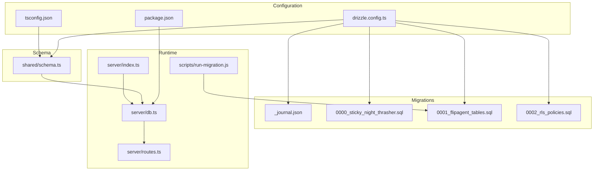
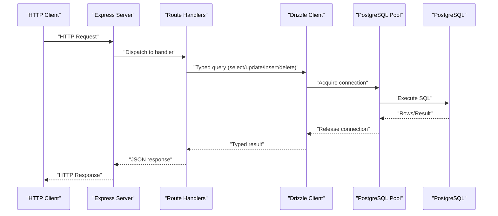
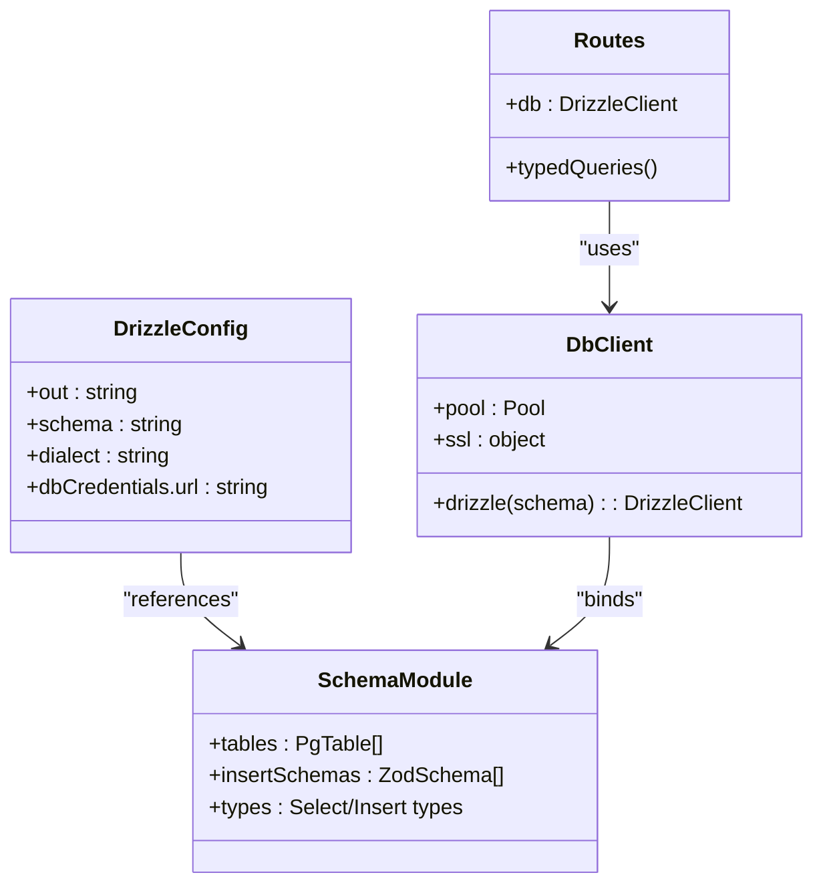
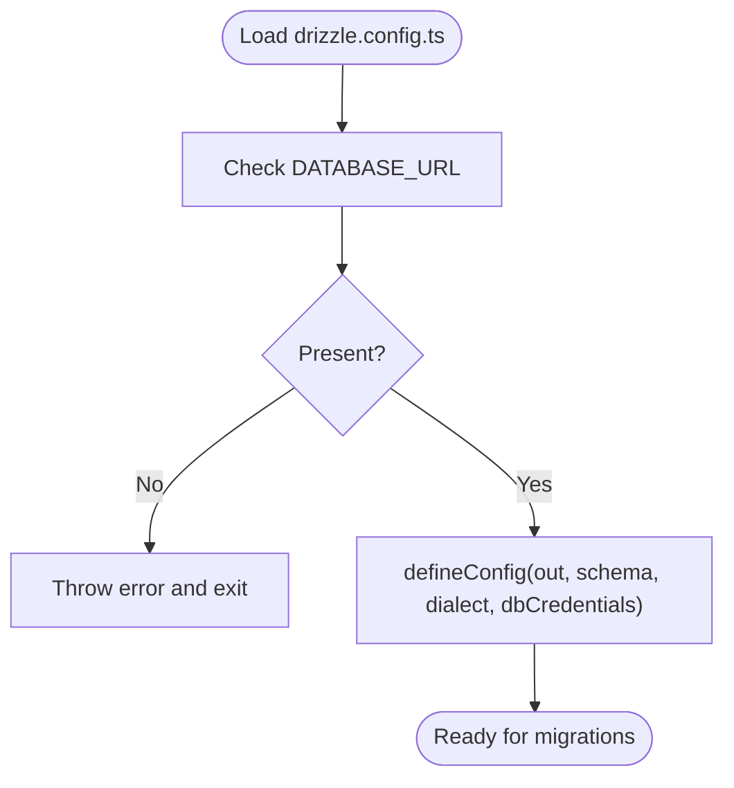
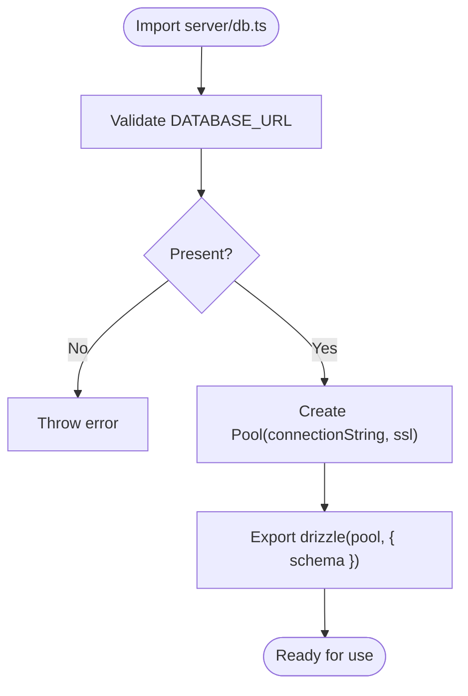
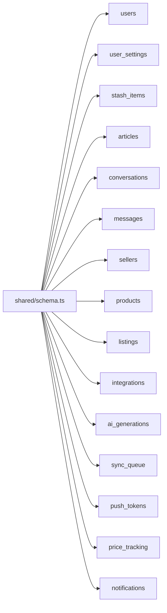
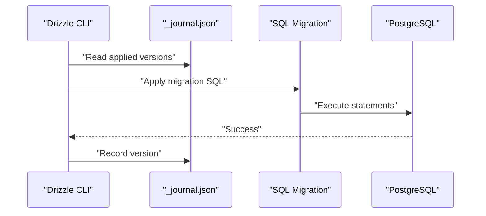
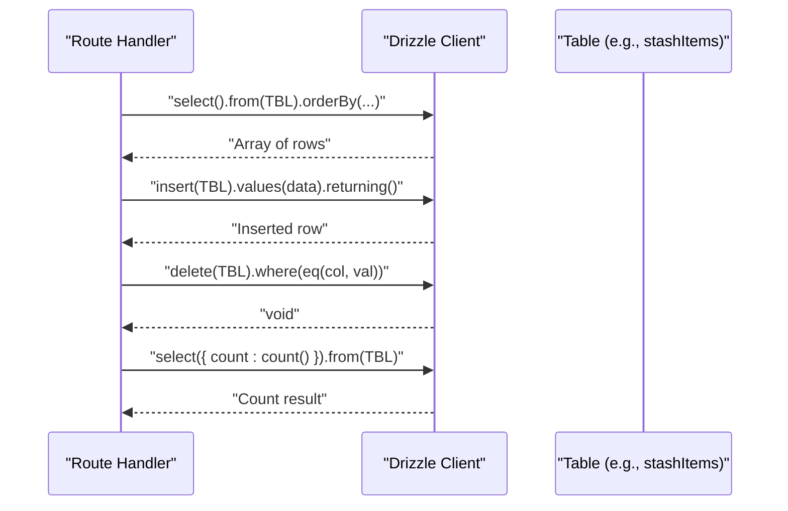
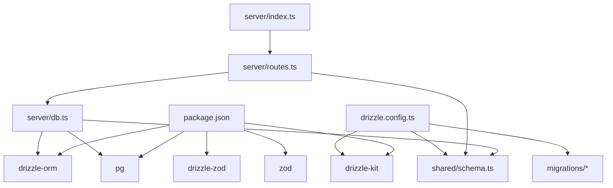

# ORM Configuration

<cite>
**Referenced Files in This Document**
- [drizzle.config.ts](file://drizzle.config.ts)
- [server/db.ts](file://server/db.ts)
- [shared/schema.ts](file://shared/schema.ts)
- [migrations/meta/_journal.json](file://migrations/meta/_journal.json)
- [migrations/0000_sticky_night_thrasher.sql](file://migrations/0000_sticky_night_thrasher.sql)
- [migrations/0001_flipagent_tables.sql](file://migrations/0001_flipagent_tables.sql)
- [migrations/0002_rls_policies.sql](file://migrations/0002_rls_policies.sql)
- [scripts/run-migration.js](file://scripts/run-migration.js)
- [server/index.ts](file://server/index.ts)
- [server/routes.ts](file://server/routes.ts)
- [package.json](file://package.json)
- [ENVIRONMENT.md](file://ENVIRONMENT.md)
- [tsconfig.json](file://tsconfig.json)
</cite>

## Table of Contents
1. [Introduction](#introduction)
2. [Project Structure](#project-structure)
3. [Core Components](#core-components)
4. [Architecture Overview](#architecture-overview)
5. [Detailed Component Analysis](#detailed-component-analysis)
6. [Dependency Analysis](#dependency-analysis)
7. [Performance Considerations](#performance-considerations)
8. [Troubleshooting Guide](#troubleshooting-guide)
9. [Conclusion](#conclusion)
10. [Appendices](#appendices)

## Introduction
This document explains how Drizzle ORM is configured and used in Hidden-Gem. It covers the Drizzle configuration file, database connection initialization, schema organization, migration lifecycle, type generation, and practical usage patterns across the backend. It also provides troubleshooting tips, performance guidance, and production deployment considerations for the database connection.

## Project Structure
Hidden-Gem organizes database-related artifacts as follows:
- Drizzle configuration defines schema and migration output location.
- A shared schema module exports all table definitions and Zod-based insert schemas.
- Migration files represent schema evolution and are applied via Drizzle Kit or ad-hoc scripts.
- The backend initializes a Drizzle client bound to a PostgreSQL connection pool and exposes typed queries through route handlers.

**Diagram sources**
- [drizzle.config.ts](file://drizzle.config.ts#L1-L19)
- [server/db.ts](file://server/db.ts#L1-L19)
- [shared/schema.ts](file://shared/schema.ts#L1-L344)
- [migrations/meta/_journal.json](file://migrations/meta/_journal.json#L1-L13)
- [migrations/0000_sticky_night_thrasher.sql](file://migrations/0000_sticky_night_thrasher.sql#L1-L82)
- [migrations/0001_flipagent_tables.sql](file://migrations/0001_flipagent_tables.sql#L1-L117)
- [migrations/0002_rls_policies.sql](file://migrations/0002_rls_policies.sql#L1-L66)
- [scripts/run-migration.js](file://scripts/run-migration.js#L1-L34)
- [server/index.ts](file://server/index.ts#L1-L262)
- [server/routes.ts](file://server/routes.ts#L1-L929)
- [package.json](file://package.json#L1-L95)
- [tsconfig.json](file://tsconfig.json#L1-L15)

**Section sources**
- [drizzle.config.ts](file://drizzle.config.ts#L1-L19)
- [server/db.ts](file://server/db.ts#L1-L19)
- [shared/schema.ts](file://shared/schema.ts#L1-L344)
- [migrations/meta/_journal.json](file://migrations/meta/_journal.json#L1-L13)
- [migrations/0000_sticky_night_thrasher.sql](file://migrations/0000_sticky_night_thrasher.sql#L1-L82)
- [migrations/0001_flipagent_tables.sql](file://migrations/0001_flipagent_tables.sql#L1-L117)
- [migrations/0002_rls_policies.sql](file://migrations/0002_rls_policies.sql#L1-L66)
- [scripts/run-migration.js](file://scripts/run-migration.js#L1-L34)
- [server/index.ts](file://server/index.ts#L1-L262)
- [server/routes.ts](file://server/routes.ts#L1-L929)
- [package.json](file://package.json#L1-L95)
- [tsconfig.json](file://tsconfig.json#L1-L15)

## Core Components
- Drizzle configuration: Defines migration output directory, schema file, dialect, and credential URL loaded from environment.
- Database client: Initializes a PostgreSQL connection pool with SSL settings and binds it to a Drizzle instance using the shared schema.
- Schema module: Centralizes table definitions and auto-generated insert schemas for type-safe operations.
- Migrations: Managed by Drizzle Kit with a journal tracking applied versions.
- Runtime usage: Routes import the Drizzle client and perform typed queries against tables.

**Section sources**
- [drizzle.config.ts](file://drizzle.config.ts#L1-L19)
- [server/db.ts](file://server/db.ts#L1-L19)
- [shared/schema.ts](file://shared/schema.ts#L1-L344)
- [migrations/meta/_journal.json](file://migrations/meta/_journal.json#L1-L13)
- [server/routes.ts](file://server/routes.ts#L1-L929)

## Architecture Overview
The backend composes a Drizzle client from a PostgreSQL connection pool and exposes it to route handlers. Requests are processed by Express, which delegates database operations to Drizzle using typed tables and insert schemas.

**Diagram sources**
- [server/index.ts](file://server/index.ts#L1-L262)
- [server/routes.ts](file://server/routes.ts#L1-L929)
- [server/db.ts](file://server/db.ts#L1-L19)

## Detailed Component Analysis

### Drizzle Configuration (drizzle.config.ts)
- Purpose: Centralizes Drizzle Kit configuration for generating and applying migrations.
- Key settings:
  - Migration output directory: "./migrations"
  - Schema file: "./shared/schema.ts"
  - Dialect: "postgresql"
  - Credential URL: process.env.DATABASE_URL
- Validation: Requires DATABASE_URL to be present; otherwise throws an error.

Operational implications:
- Drizzle Kit reads the schema file to generate SQL migrations.
- The DATABASE_URL is used for pushing migrations and for runtime connections.

**Section sources**
- [drizzle.config.ts](file://drizzle.config.ts#L1-L19)
- [ENVIRONMENT.md](file://ENVIRONMENT.md#L18-L22)

### Database Connection Initialization (server/db.ts)
- Purpose: Creates a PostgreSQL connection pool and binds it to a Drizzle client.
- Key steps:
  - Validates DATABASE_URL presence.
  - Constructs a Pool with connection string and SSL configuration.
  - Exports a drizzle instance bound to the schema module.

SSL configuration:
- Reject unauthorized certificates is disabled for convenience in development and hosted environments.

Connection pooling:
- Uses the pg.Pool constructor to manage connections efficiently.

**Section sources**
- [server/db.ts](file://server/db.ts#L1-L19)
- [ENVIRONMENT.md](file://ENVIRONMENT.md#L18-L22)

### Schema Import Structure and Organization (shared/schema.ts)
- Purpose: Defines all database tables and Zod-based insert schemas for type-safe operations.
- Organization:
  - Table definitions grouped by domain (core entities, FlipAgent tables, notifications).
  - Each table uses typed columns and constraints.
  - Insert schemas derived via drizzle-zod for validation and TypeScript inference.
- Types:
  - Exported select and insert types for each table to support strongly-typed queries and forms.

Usage pattern:
- Route handlers import tables from @shared/schema and use them with the Drizzle client.

**Section sources**
- [shared/schema.ts](file://shared/schema.ts#L1-L344)

### Migration Lifecycle and Management
- Drizzle Kit manages migrations:
  - Journal tracks applied versions and breakpoints.
  - SQL files represent incremental schema changes.
- Ad-hoc script:
  - A Node script demonstrates connecting to the database and applying a specific migration file programmatically.

Applied migrations:
- Initial tables (users, articles, stash_items, conversations, messages, user_settings).
- FlipAgent tables (sellers, products, listings, integrations, ai_generations, sync_queue).
- Row-level security policies for FlipAgent tables.

**Section sources**
- [migrations/meta/_journal.json](file://migrations/meta/_journal.json#L1-L13)
- [migrations/0000_sticky_night_thrasher.sql](file://migrations/0000_sticky_night_thrasher.sql#L1-L82)
- [migrations/0001_flipagent_tables.sql](file://migrations/0001_flipagent_tables.sql#L1-L117)
- [migrations/0002_rls_policies.sql](file://migrations/0002_rls_policies.sql#L1-L66)
- [scripts/run-migration.js](file://scripts/run-migration.js#L1-L34)

### Type Generation and TypeScript Integration
- Drizzle generates TypeScript types from the schema for:
  - Select and insert operations.
  - Strongly-typed table references and column accessors.
- Path aliases:
  - tsconfig.json maps "@shared/*" to the shared directory, enabling clean imports in server code.

Practical benefits:
- Compile-time safety for queries and inserts.
- Consistent type inference across the backend.

**Section sources**
- [shared/schema.ts](file://shared/schema.ts#L78-L108)
- [shared/schema.ts](file://shared/schema.ts#L223-L256)
- [shared/schema.ts](file://shared/schema.ts#L312-L343)
- [tsconfig.json](file://tsconfig.json#L1-L15)

### Database Client Initialization and Usage Patterns
- Client initialization:
  - server/db.ts exports a drizzle instance bound to the schema.
- Route usage:
  - server/routes.ts imports the drizzle client and performs typed operations against tables.
- Example patterns:
  - Select with ordering and filtering.
  - Insert with returning newly created rows.
  - Delete with where clause.
  - Count aggregation.

Transaction handling:
- Drizzle’s node-postgres adapter supports transactions via drizzle.transaction(...).
- Recommended for multi-statement consistency in write-heavy flows.

**Section sources**
- [server/db.ts](file://server/db.ts#L1-L19)
- [server/routes.ts](file://server/routes.ts#L184-L286)
- [server/routes.ts](file://server/routes.ts#L719-L799)

### Environment Variable Usage
- DATABASE_URL is required for both:
  - Drizzle Kit operations (migration generation/pushing).
  - Runtime database connections.
- Replit auto-provisions and injects database credentials; the environment guide documents expected variables.

**Section sources**
- [drizzle.config.ts](file://drizzle.config.ts#L7-L9)
- [server/db.ts](file://server/db.ts#L7-L9)
- [ENVIRONMENT.md](file://ENVIRONMENT.md#L18-L22)

## Architecture Overview

**Diagram sources**
- [drizzle.config.ts](file://drizzle.config.ts#L11-L18)
- [shared/schema.ts](file://shared/schema.ts#L1-L344)
- [server/db.ts](file://server/db.ts#L1-L19)
- [server/routes.ts](file://server/routes.ts#L1-L929)

## Detailed Component Analysis

### Drizzle Configuration Analysis
- Configuration file sets migration output, schema path, dialect, and credential URL.
- Enforces DATABASE_URL presence at startup to prevent misconfiguration.

**Diagram sources**
- [drizzle.config.ts](file://drizzle.config.ts#L7-L18)

**Section sources**
- [drizzle.config.ts](file://drizzle.config.ts#L1-L19)

### Database Connection Initialization Analysis
- Validates DATABASE_URL.
- Creates a Pool with SSL settings.
- Exports a drizzle client bound to the schema.

**Diagram sources**
- [server/db.ts](file://server/db.ts#L7-L19)

**Section sources**
- [server/db.ts](file://server/db.ts#L1-L19)

### Schema Import Structure Analysis
- Centralized table definitions and insert schemas.
- Generated types enable compile-time safety.

**Diagram sources**
- [shared/schema.ts](file://shared/schema.ts#L6-L343)

**Section sources**
- [shared/schema.ts](file://shared/schema.ts#L1-L344)

### Migration Application Flow
- Drizzle Kit applies migrations from the migrations directory.
- A dedicated script demonstrates programmatic application of a specific migration.

**Diagram sources**
- [migrations/meta/_journal.json](file://migrations/meta/_journal.json#L1-L13)
- [migrations/0001_flipagent_tables.sql](file://migrations/0001_flipagent_tables.sql#L1-L117)
- [scripts/run-migration.js](file://scripts/run-migration.js#L5-L28)

**Section sources**
- [migrations/meta/_journal.json](file://migrations/meta/_journal.json#L1-L13)
- [migrations/0001_flipagent_tables.sql](file://migrations/0001_flipagent_tables.sql#L1-L117)
- [scripts/run-migration.js](file://scripts/run-migration.js#L1-L34)

### Runtime Usage Examples
- Select with ordering and filtering.
- Insert with returning.
- Delete with where clause.
- Count aggregation.

**Diagram sources**
- [server/routes.ts](file://server/routes.ts#L184-L286)
- [server/routes.ts](file://server/routes.ts#L719-L799)

**Section sources**
- [server/routes.ts](file://server/routes.ts#L184-L286)
- [server/routes.ts](file://server/routes.ts#L719-L799)

## Dependency Analysis

**Diagram sources**
- [package.json](file://package.json#L24-L95)
- [server/db.ts](file://server/db.ts#L1-L19)
- [server/routes.ts](file://server/routes.ts#L1-L929)
- [drizzle.config.ts](file://drizzle.config.ts#L1-L19)

**Section sources**
- [package.json](file://package.json#L24-L95)
- [server/db.ts](file://server/db.ts#L1-L19)
- [server/routes.ts](file://server/routes.ts#L1-L929)
- [drizzle.config.ts](file://drizzle.config.ts#L1-L19)

## Performance Considerations
- Connection pooling:
  - Use a single long-lived pool exported from server/db.ts to minimize overhead.
  - Tune pool size and timeouts in production deployments as needed.
- SSL:
  - The current SSL configuration disables certificate verification for convenience; adjust for stricter environments.
- Queries:
  - Prefer selective selects and indexed filters.
  - Use returning to reduce round-trips for insert/update scenarios.
- Transactions:
  - Wrap multi-step writes in drizzle.transaction(...) to maintain consistency and reduce partial updates.
- Indexes:
  - Existing migrations create indexes for common join and filter columns; add additional indexes for high-cardinality filters.

[No sources needed since this section provides general guidance]

## Troubleshooting Guide
Common issues and resolutions:
- Missing DATABASE_URL:
  - Ensure DATABASE_URL is set in the environment; the configuration and runtime both validate this variable.
- Migration failures:
  - Apply migrations using the Drizzle CLI command documented in the environment guide.
  - For ad-hoc runs, use the provided script to apply specific migration files.
- Connection errors:
  - Verify the database is reachable and credentials are correct.
  - Confirm SSL settings match your hosting environment.
- Type errors:
  - Ensure schema changes are reflected in shared/schema.ts and rebuild to regenerate types.

**Section sources**
- [drizzle.config.ts](file://drizzle.config.ts#L7-L9)
- [server/db.ts](file://server/db.ts#L7-L9)
- [ENVIRONMENT.md](file://ENVIRONMENT.md#L91-L113)
- [scripts/run-migration.js](file://scripts/run-migration.js#L5-L28)

## Conclusion
Hidden-Gem’s Drizzle ORM setup is centralized and robust:
- Drizzle Kit configuration points to a shared schema and migration directory.
- A single connection pool exports a typed Drizzle client used across route handlers.
- Migrations are tracked and applied consistently, with additional RLS policies for secure access patterns.
- TypeScript integration ensures type-safe database interactions.

[No sources needed since this section summarizes without analyzing specific files]

## Appendices

### Appendix A: Drizzle Commands
- Push migrations: npm run db:push
- Development server: npm run server:dev

**Section sources**
- [package.json](file://package.json#L14-L14)
- [ENVIRONMENT.md](file://ENVIRONMENT.md#L91-L113)