# Data Models and Schema

<cite>
**Referenced Files in This Document**
- [drizzle.config.ts](file://drizzle.config.ts)
- [server/db.ts](file://server/db.ts)
- [shared/schema.ts](file://shared/schema.ts)
- [server/routes.ts](file://server/routes.ts)
- [shared/models/chat.ts](file://shared/models/chat.ts)
- [client/lib/query-client.ts](file://client/lib/query-client.ts)
- [client/screens/StashScreen.tsx](file://client/screens/StashScreen.tsx)
- [client/screens/ItemDetailsScreen.tsx](file://client/screens/ItemDetailsScreen.tsx)
- [package.json](file://package.json)
</cite>

## Table of Contents
1. [Introduction](#introduction)
2. [Project Structure](#project-structure)
3. [Core Components](#core-components)
4. [Architecture Overview](#architecture-overview)
5. [Detailed Component Analysis](#detailed-component-analysis)
6. [Dependency Analysis](#dependency-analysis)
7. [Performance Considerations](#performance-considerations)
8. [Troubleshooting Guide](#troubleshooting-guide)
9. [Conclusion](#conclusion)
10. [Appendices](#appendices)

## Introduction
This document describes the data models and schema used by Hidden-Gem’s backend and frontend. It covers the PostgreSQL schema defined via Drizzle ORM, the TypeScript interfaces and Zod validation schemas, the data access patterns using Drizzle ORM, and the client-side data fetching and caching. It also documents entity relationships, primary and foreign keys, indexes and constraints, and outlines data lifecycle, security, and migration strategies.

## Project Structure
The data model layer is split between shared schema definitions and server-side database access:
- Shared schema defines tables, columns, constraints, and validation schemas.
- Server initializes a Drizzle connection to PostgreSQL and exposes REST endpoints.
- Client uses React Query to fetch and cache data from the server.

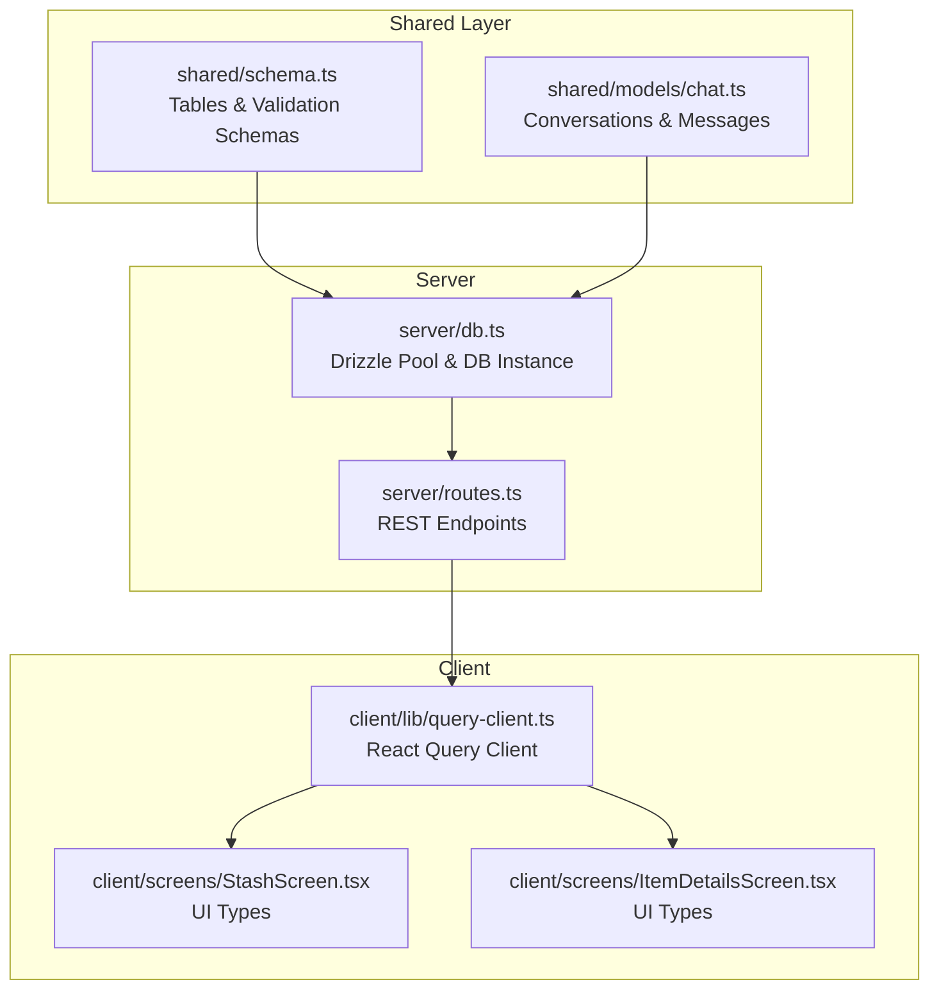

**Diagram sources**
- [shared/schema.ts](file://shared/schema.ts#L1-L122)
- [shared/models/chat.ts](file://shared/models/chat.ts#L1-L35)
- [server/db.ts](file://server/db.ts#L1-L19)
- [server/routes.ts](file://server/routes.ts#L1-L493)
- [client/lib/query-client.ts](file://client/lib/query-client.ts#L1-L80)
- [client/screens/StashScreen.tsx](file://client/screens/StashScreen.tsx#L1-L59)
- [client/screens/ItemDetailsScreen.tsx](file://client/screens/ItemDetailsScreen.tsx#L18-L103)

**Section sources**
- [drizzle.config.ts](file://drizzle.config.ts#L1-L15)
- [server/db.ts](file://server/db.ts#L1-L19)
- [shared/schema.ts](file://shared/schema.ts#L1-L122)
- [server/routes.ts](file://server/routes.ts#L1-L493)
- [client/lib/query-client.ts](file://client/lib/query-client.ts#L1-L80)
- [client/screens/StashScreen.tsx](file://client/screens/StashScreen.tsx#L1-L59)
- [client/screens/ItemDetailsScreen.tsx](file://client/screens/ItemDetailsScreen.tsx#L18-L103)

## Core Components
This section documents the core entities and their fields, constraints, and relationships.

- Users
  - Purpose: Authentication and profile identity.
  - Primary key: id (varchar, UUID, default generated).
  - Unique constraints: username (text).
  - Not-null constraints: username, password.
  - Related tables: user_settings (one-to-one via userId), stash_items (one-to-many via userId).

- User Settings
  - Purpose: Store user integrations and preferences.
  - Primary key: id (serial).
  - Foreign key: user_id -> users.id (onDelete cascade).
  - Optional sensitive fields: gemini_api_key, huggingface_api_key, woocommerce credentials, ebay_token.
  - Defaults: preferred models, timestamps.

- Stash Items
  - Purpose: Inventory of collected items with AI-assisted metadata and marketplace publishing flags.
  - Primary key: id (serial).
  - Foreign key: user_id -> users.id (onDelete cascade).
  - Rich fields: title, description, category, estimated_value, condition, tags array, image URLs, ai_analysis JSONB, SEO fields, marketplace flags and identifiers.
  - Defaults: published flags false, timestamps.

- Articles
  - Purpose: Content articles for discovery.
  - Primary key: id (serial).
  - Not-null: title, content, category.
  - Optional: excerpt, image_url, reading_time default, featured flag.
  - Timestamp: created_at.

- Conversations
  - Purpose: Chat sessions.
  - Primary key: id (serial).
  - Not-null: title.
  - Timestamp: created_at.

- Messages
  - Purpose: Chat messages linked to a conversation.
  - Primary key: id (serial).
  - Foreign key: conversation_id -> conversations.id (onDelete cascade).
  - Not-null: role, content.
  - Timestamp: created_at.

Validation and TypeScript types:
- Validation schemas are auto-generated from tables using drizzle-zod and exported for inserts.
- TypeScript types infer select/update shapes from tables for strong typing on server and client.

**Section sources**
- [shared/schema.ts](file://shared/schema.ts#L6-L12)
- [shared/schema.ts](file://shared/schema.ts#L14-L27)
- [shared/schema.ts](file://shared/schema.ts#L29-L50)
- [shared/schema.ts](file://shared/schema.ts#L52-L62)
- [shared/schema.ts](file://shared/schema.ts#L64-L76)
- [shared/schema.ts](file://shared/schema.ts#L78-L122)
- [shared/models/chat.ts](file://shared/models/chat.ts#L6-L18)
- [shared/models/chat.ts](file://shared/models/chat.ts#L20-L35)

## Architecture Overview
The system follows a layered architecture:
- Shared schema layer defines the canonical data model.
- Server layer connects to PostgreSQL via Drizzle and exposes REST endpoints.
- Client layer consumes endpoints via React Query, with typed interfaces for UI components.

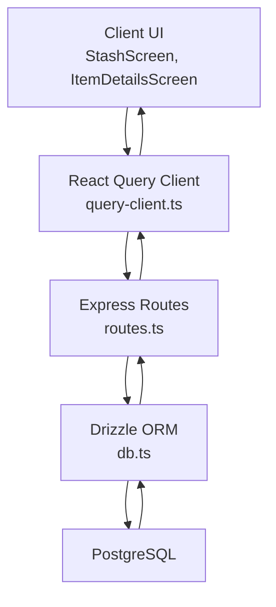

**Diagram sources**
- [client/lib/query-client.ts](file://client/lib/query-client.ts#L1-L80)
- [server/routes.ts](file://server/routes.ts#L1-L493)
- [server/db.ts](file://server/db.ts#L1-L19)
- [shared/schema.ts](file://shared/schema.ts#L1-L122)

## Detailed Component Analysis

### Users and User Settings
- Relationship: One user can have one settings record; deletion of a user cascades to settings.
- Typical operations: Create user (via validation schema), update settings (excluding auto-managed fields).
- Security: Passwords are stored as plain text in the schema; this is a high-risk concern and should be addressed immediately.

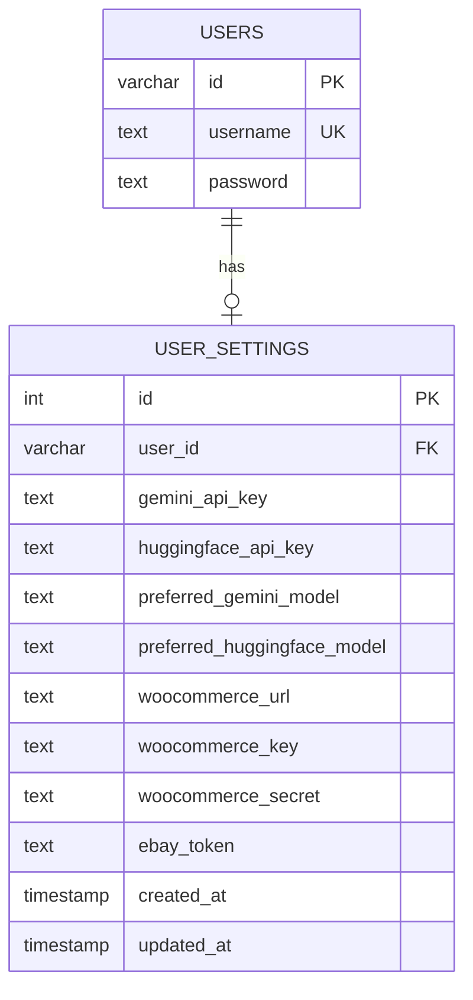

**Diagram sources**
- [shared/schema.ts](file://shared/schema.ts#L6-L12)
- [shared/schema.ts](file://shared/schema.ts#L14-L27)

**Section sources**
- [shared/schema.ts](file://shared/schema.ts#L6-L12)
- [shared/schema.ts](file://shared/schema.ts#L14-L27)

### Stash Items
- Relationship: One user can own many stash items; deletion of a user cascades to items.
- Marketplace flags: publishedToWoocommerce and publishedToEbay track publication state; identifiers store remote IDs.
- AI and SEO: ai_analysis stores structured JSON; SEO fields support marketplace optimization.

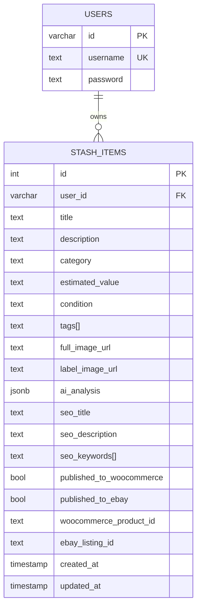

**Diagram sources**
- [shared/schema.ts](file://shared/schema.ts#L29-L50)

**Section sources**
- [shared/schema.ts](file://shared/schema.ts#L29-L50)
- [server/routes.ts](file://server/routes.ts#L57-L138)

### Articles
- Purpose: Curated content for discovery.
- Typical operations: List newest first, fetch by ID, and display excerpts and reading time.

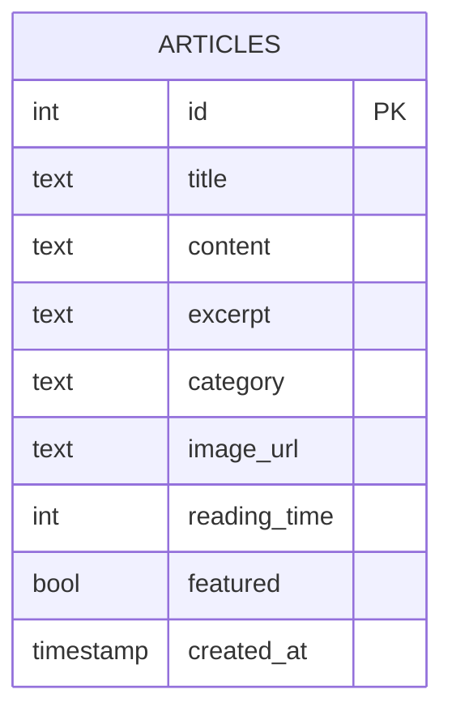

**Diagram sources**
- [shared/schema.ts](file://shared/schema.ts#L52-L62)

**Section sources**
- [shared/schema.ts](file://shared/schema.ts#L52-L62)
- [server/routes.ts](file://server/routes.ts#L25-L55)

### Conversations and Messages
- Relationship: One conversation contains many messages; deleting a conversation deletes messages.
- Typical operations: Create conversation, append messages.

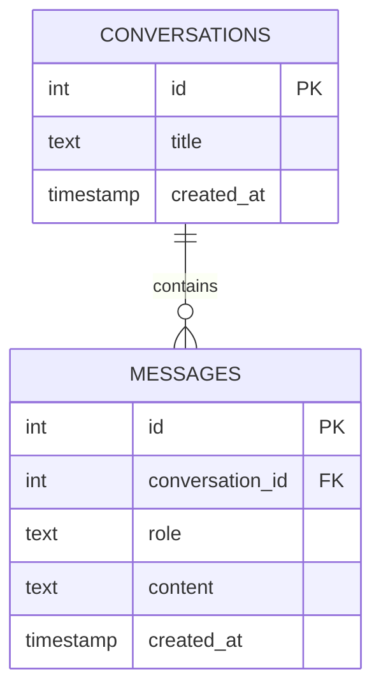

**Diagram sources**
- [shared/models/chat.ts](file://shared/models/chat.ts#L6-L18)

**Section sources**
- [shared/models/chat.ts](file://shared/models/chat.ts#L6-L18)

### Data Access Patterns Using Drizzle ORM
- Connection: A PostgreSQL connection pool is created and wrapped by Drizzle.
- Queries: Routes use select, insert, update, delete with ordering and counts.
- Example patterns:
  - Fetch all stash items ordered by creation date.
  - Count stash items.
  - Insert a new stash item with returning.
  - Delete an item by ID.

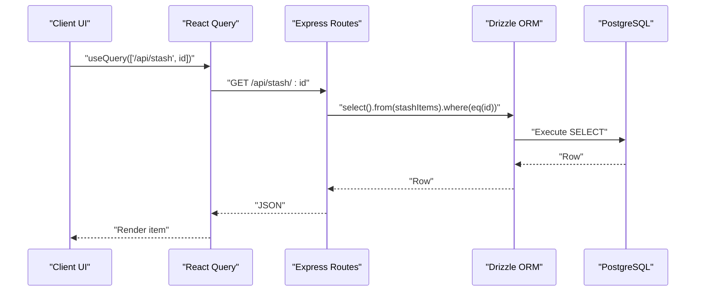

**Diagram sources**
- [client/lib/query-client.ts](file://client/lib/query-client.ts#L46-L79)
- [server/routes.ts](file://server/routes.ts#L80-L97)
- [server/db.ts](file://server/db.ts#L1-L19)
- [shared/schema.ts](file://shared/schema.ts#L29-L50)

**Section sources**
- [server/db.ts](file://server/db.ts#L1-L19)
- [server/routes.ts](file://server/routes.ts#L57-L138)

### Validation and Type Safety
- Validation schemas:
  - Auto-generated per-table insert schemas exclude managed fields (e.g., createdAt, updatedAt, id).
- TypeScript inference:
  - Select and insert types inferred from tables enable compile-time safety.
- Client-side UI types:
  - Stash and item details screens declare local TypeScript interfaces aligned with server shapes.

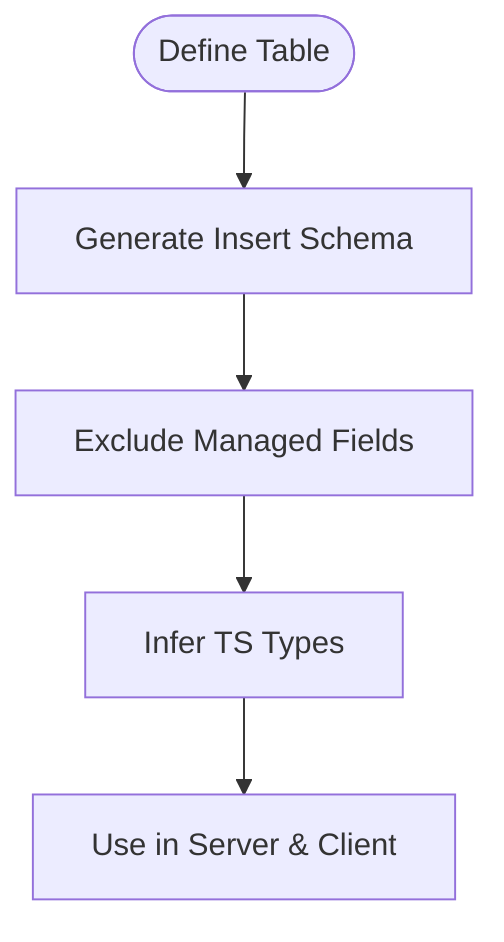

**Diagram sources**
- [shared/schema.ts](file://shared/schema.ts#L78-L122)
- [client/screens/StashScreen.tsx](file://client/screens/StashScreen.tsx#L18-L26)
- [client/screens/ItemDetailsScreen.tsx](file://client/screens/ItemDetailsScreen.tsx#L20-L38)

**Section sources**
- [shared/schema.ts](file://shared/schema.ts#L78-L122)
- [client/screens/StashScreen.tsx](file://client/screens/StashScreen.tsx#L18-L26)
- [client/screens/ItemDetailsScreen.tsx](file://client/screens/ItemDetailsScreen.tsx#L20-L38)

### Marketplace Publishing Workflows
- WooCommerce:
  - Endpoint posts to wc/v3 products using basic auth with provided credentials.
  - Updates stash item with published flag and remote product ID.
- eBay:
  - Exchanges refresh token for access token.
  - Creates inventory item and offer, optionally publishes.
  - Updates stash item with listing identifier and URL.

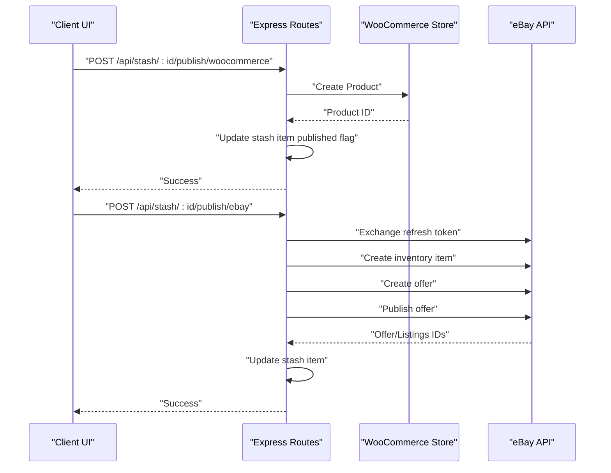

**Diagram sources**
- [server/routes.ts](file://server/routes.ts#L228-L296)
- [server/routes.ts](file://server/routes.ts#L298-L488)

**Section sources**
- [server/routes.ts](file://server/routes.ts#L228-L296)
- [server/routes.ts](file://server/routes.ts#L298-L488)

## Dependency Analysis
- Drizzle ORM and drizzle-zod are used for schema definition, migrations, and runtime validation.
- PostgreSQL driver (pg) is used for the connection pool.
- Express serves the REST API.
- React Query manages client-side caching and data fetching.

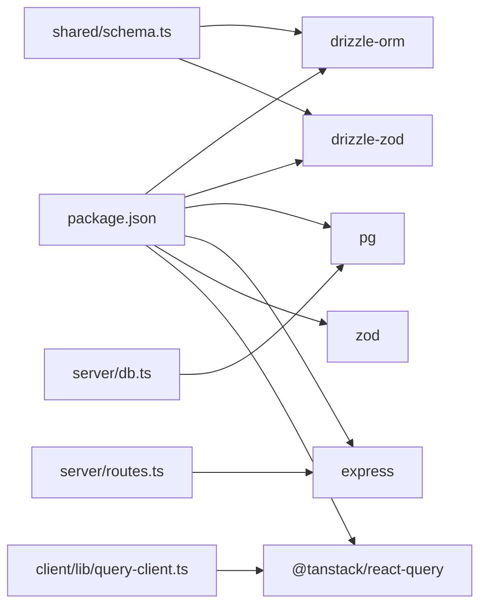

**Diagram sources**
- [package.json](file://package.json#L19-L67)
- [shared/schema.ts](file://shared/schema.ts#L1-L122)
- [server/db.ts](file://server/db.ts#L1-L19)
- [server/routes.ts](file://server/routes.ts#L1-L493)
- [client/lib/query-client.ts](file://client/lib/query-client.ts#L1-L80)

**Section sources**
- [package.json](file://package.json#L19-L67)

## Performance Considerations
- Indexing: No explicit indexes are defined in the schema. Consider adding indexes on frequently filtered or joined columns (e.g., users.username, stash_items.user_id, articles.created_at).
- Query patterns: Sorting by created_at is common; ensure appropriate indexes exist to avoid table scans.
- Batch operations: For marketplace publishing, consider rate limiting and retries to avoid API throttling.
- Caching: React Query is configured with infinite staleTime and disabled refetch on window focus to reduce network load.
- Connection pooling: Drizzle uses a PostgreSQL pool; ensure pool size matches workload expectations.

[No sources needed since this section provides general guidance]

## Troubleshooting Guide
- Database connectivity:
  - Ensure DATABASE_URL is set; otherwise initialization throws an error.
- API errors:
  - Routes return 500 on internal errors; check server logs for stack traces.
  - For marketplace endpoints, inspect error payloads returned by external APIs (WooCommerce/eBay).
- Client errors:
  - apiRequest throws on non-OK responses; verify EXPO_PUBLIC_DOMAIN is set and reachable.
  - React Query default behavior is to throw on 401; adjust on401 behavior if needed.

**Section sources**
- [server/db.ts](file://server/db.ts#L7-L9)
- [server/routes.ts](file://server/routes.ts#L32-L35)
- [client/lib/query-client.ts](file://client/lib/query-client.ts#L19-L24)
- [client/lib/query-client.ts](file://client/lib/query-client.ts#L58-L60)

## Conclusion
Hidden-Gem’s data model centers on users, stash items, articles, and chat entities, with clear foreign key relationships and validation schemas. Drizzle ORM and drizzle-zod provide a robust foundation for schema evolution and type safety. To improve reliability, add indexes, strengthen security (especially around passwords), and refine caching and error handling.

[No sources needed since this section summarizes without analyzing specific files]

## Appendices

### Database Schema Diagram
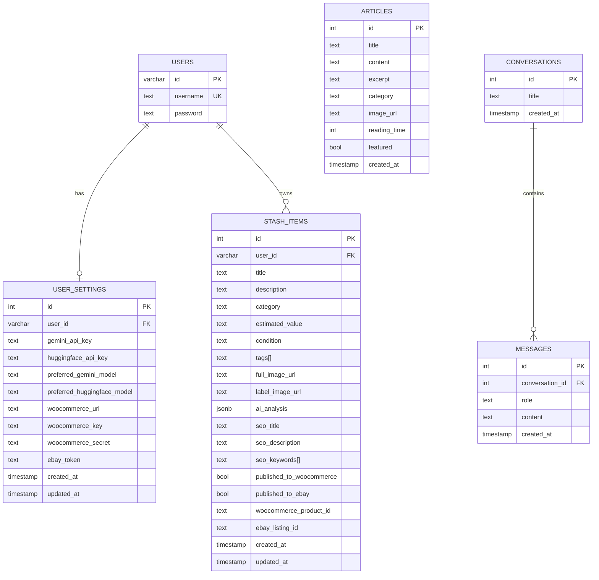

**Diagram sources**
- [shared/schema.ts](file://shared/schema.ts#L6-L12)
- [shared/schema.ts](file://shared/schema.ts#L14-L27)
- [shared/schema.ts](file://shared/schema.ts#L29-L50)
- [shared/schema.ts](file://shared/schema.ts#L52-L62)
- [shared/models/chat.ts](file://shared/models/chat.ts#L6-L18)

### Sample Data Structures
- Stash Item (selected shape):
  - Fields: id, userId, title, description, category, estimatedValue, condition, tags[], fullImageUrl, labelImageUrl, aiAnalysis, seoTitle, seoDescription, seoKeywords[], publishedToWoocommerce, publishedToEbay, woocommerceProductId, ebayListingId, createdAt, updatedAt.
- Article (selected shape):
  - Fields: id, title, content, excerpt, category, imageUrl, readingTime, featured, createdAt.
- Conversation (selected shape):
  - Fields: id, title, createdAt.
- Message (selected shape):
  - Fields: id, conversationId, role, content, createdAt.

**Section sources**
- [shared/schema.ts](file://shared/schema.ts#L29-L62)
- [shared/models/chat.ts](file://shared/models/chat.ts#L6-L18)

### Common Query Patterns
- Get all stash items ordered by newest:
  - select().from(stashItems).orderBy(desc(stashItems.createdAt)).
- Count stash items:
  - select({ count: count() }).from(stashItems).
- Get article by ID:
  - select().from(articles).where(eq(articles.id, id)).

**Section sources**
- [server/routes.ts](file://server/routes.ts#L57-L78)
- [server/routes.ts](file://server/routes.ts#L38-L55)

### Migration and Schema Evolution
- Drizzle Kit configuration points to the shared schema and outputs migrations to ./migrations.
- Use the provided script to push schema changes to the database.

**Section sources**
- [drizzle.config.ts](file://drizzle.config.ts#L1-L15)
- [package.json](file://package.json#L5-L17)

### Data Lifecycle, Retention, and Security
- Lifecycle:
  - Items are inserted with timestamps; updates occur on edits or marketplace publishing.
- Retention:
  - No explicit retention policies are defined in the schema; consider implementing soft-deletion or archival strategies for user data and items.
- Security:
  - Passwords are stored as plaintext; this must be remediated with hashing and secure storage.
  - API keys and tokens are stored in user_settings; treat them as sensitive and consider encryption-at-rest and rotation policies.
  - Marketplace credentials are handled via basic auth and bearer tokens; ensure secure transport and token rotation.

**Section sources**
- [shared/schema.ts](file://shared/schema.ts#L14-L27)
- [server/routes.ts](file://server/routes.ts#L228-L296)
- [server/routes.ts](file://server/routes.ts#L298-L488)