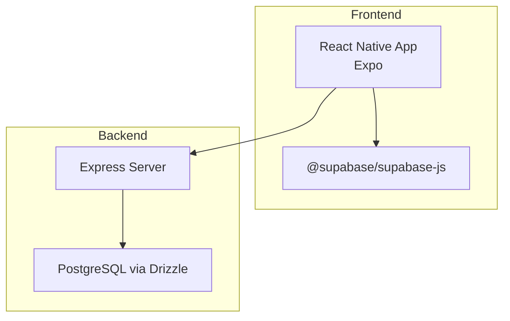
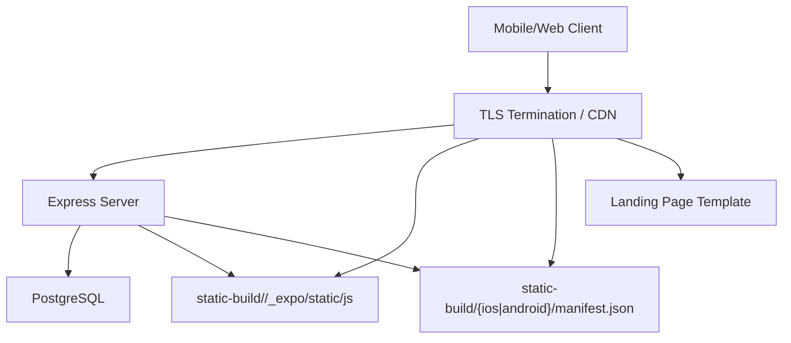
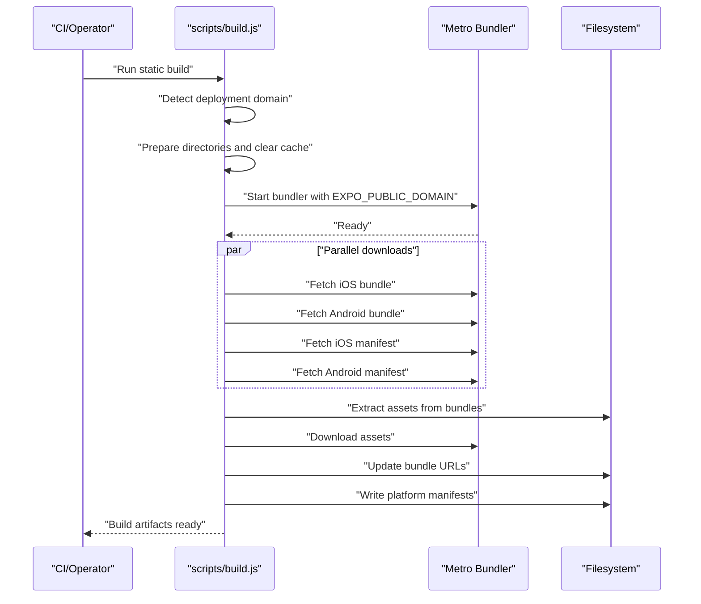
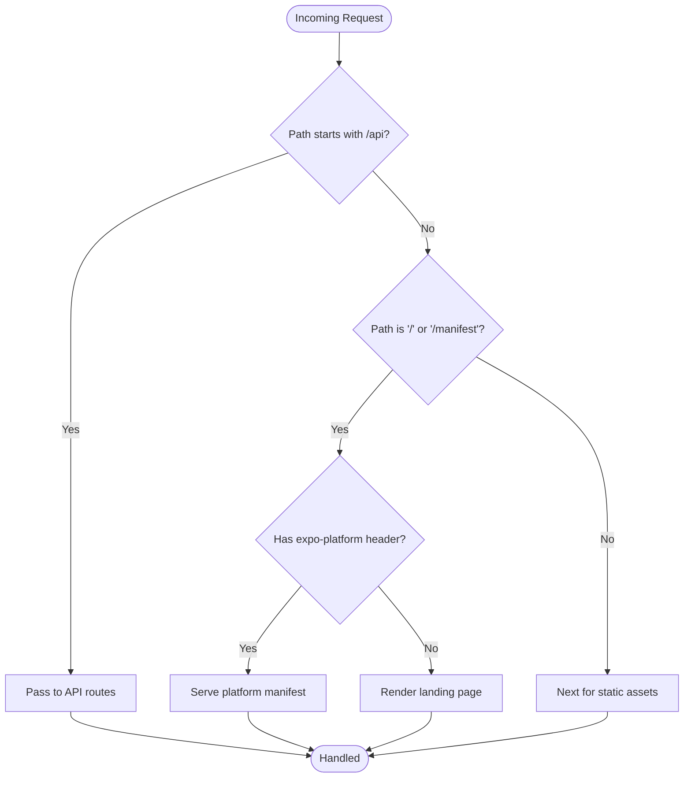
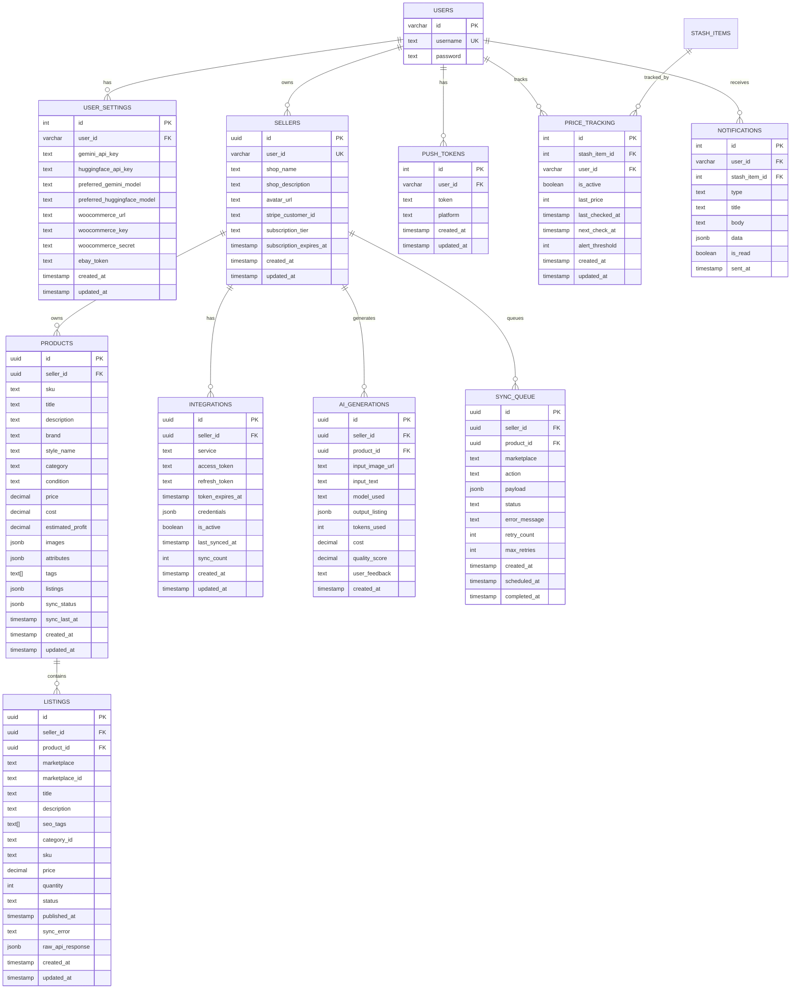
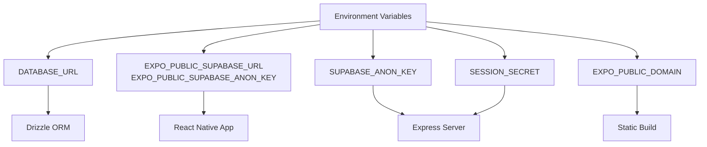
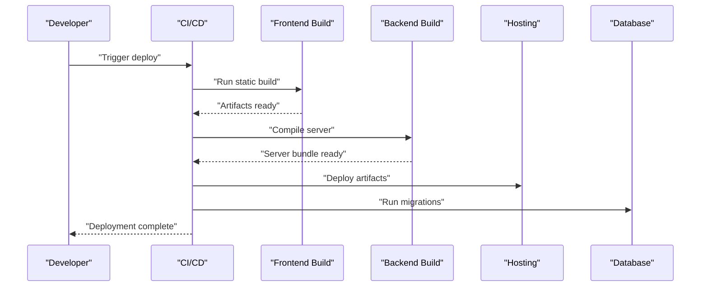
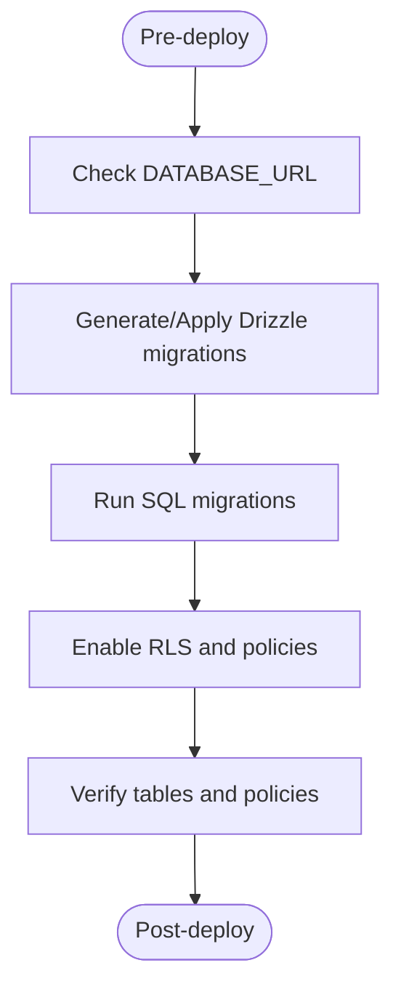
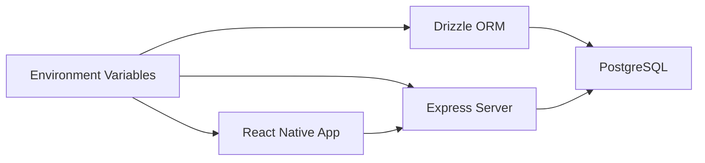

# Deployment

<cite>
**Referenced Files in This Document**
- [package.json](file://package.json)
- [app.json](file://app.json)
- [scripts/build.js](file://scripts/build.js)
- [scripts/run-migration.js](file://scripts/run-migration.js)
- [ENVIRONMENT.md](file://ENVIRONMENT.md)
- [drizzle.config.ts](file://drizzle.config.ts)
- [server/index.ts](file://server/index.ts)
- [server/db.ts](file://server/db.ts)
- [shared/schema.ts](file://shared/schema.ts)
- [migrations/0001_flipagent_tables.sql](file://migrations/0001_flipagent_tables.sql)
- [migrations/0002_rls_policies.sql](file://migrations/0002_rls_policies.sql)
- [client/lib/supabase.ts](file://client/lib/supabase.ts)
- [client/App.tsx](file://client/App.tsx)
- [babel.config.js](file://babel.config.js)
- [tsconfig.json](file://tsconfig.json)
</cite>

## Table of Contents
1. [Introduction](#introduction)
2. [Project Structure](#project-structure)
3. [Core Components](#core-components)
4. [Architecture Overview](#architecture-overview)
5. [Detailed Component Analysis](#detailed-component-analysis)
6. [Dependency Analysis](#dependency-analysis)
7. [Performance Considerations](#performance-considerations)
8. [Troubleshooting Guide](#troubleshooting-guide)
9. [Conclusion](#conclusion)
10. [Appendices](#appendices)

## Introduction
This document describes the production deployment process for Hidden-Gem. It covers building the frontend static assets, bundling for iOS and Android, environment configuration, backend server setup, database migrations and RLS policies, cloud deployment options, monitoring and error tracking, and post-deployment validation. The goal is to enable repeatable, reliable deployments with minimal downtime and strong data integrity.

## Project Structure
Hidden-Gem is a React Native (Expo) frontend with an Express backend and a PostgreSQL-backed schema managed by Drizzle. The deployment pipeline centers around:
- Frontend static build and manifest serving via the Express server
- Backend Express server exposing API routes and serving Expo manifests and assets
- Database schema managed by Drizzle with migrations and Row Level Security (RLS) policies

**Section sources**
- [package.json](file://package.json#L1-L95)
- [server/index.ts](file://server/index.ts#L1-L262)
- [server/db.ts](file://server/db.ts#L1-L19)
- [shared/schema.ts](file://shared/schema.ts#L1-L344)

## Core Components
- Frontend build and static delivery: The static build script orchestrates Metro bundling, downloads platform bundles and manifests, extracts and downloads assets, updates URLs, and writes platform manifests for production hosting.
- Backend server: Serves API routes, exposes landing page and Expo manifests, serves static assets, and applies CORS and logging middleware.
- Database: Drizzle ORM connects to PostgreSQL using DATABASE_URL; migrations define schema and RLS policies.
- Environment configuration: Environment variables are loaded via dotenv and used across client and server.

**Section sources**
- [scripts/build.js](file://scripts/build.js#L1-L562)
- [server/index.ts](file://server/index.ts#L1-L262)
- [server/db.ts](file://server/db.ts#L1-L19)
- [drizzle.config.ts](file://drizzle.config.ts#L1-L19)
- [ENVIRONMENT.md](file://ENVIRONMENT.md#L1-L219)

## Architecture Overview
The production runtime comprises:
- A reverse proxy or CDN that terminates TLS and forwards to the Express server
- The Express server serving:
  - API routes under /api
  - Expo manifests and static assets under static-build
  - A landing page template rendered with BASE_URL and APP_NAME placeholders
- PostgreSQL with schema and RLS policies enforced by the database

**Diagram sources**
- [server/index.ts](file://server/index.ts#L166-L208)
- [server/templates/landing-page.html](file://server/templates/landing-page.html)

**Section sources**
- [server/index.ts](file://server/index.ts#L166-L208)

## Detailed Component Analysis

### Frontend Static Build and Asset Packaging
The static build process:
- Detects a deployment domain from environment variables
- Clears Metro caches
- Starts Metro and waits for readiness
- Downloads iOS and Android bundles and manifests concurrently
- Extracts asset metadata from bundles, downloads assets, and updates bundle URLs
- Writes platform manifests with updated URLs and timestamps

**Diagram sources**
- [scripts/build.js](file://scripts/build.js#L497-L553)

**Section sources**
- [scripts/build.js](file://scripts/build.js#L41-L59)
- [scripts/build.js](file://scripts/build.js#L108-L152)
- [scripts/build.js](file://scripts/build.js#L242-L282)
- [scripts/build.js](file://scripts/build.js#L353-L415)
- [scripts/build.js](file://scripts/build.js#L417-L495)

### Backend Server Configuration and Routing
The Express server:
- Loads environment variables
- Configures CORS for development and production domains
- Parses JSON bodies and captures responses for logging
- Serves Expo manifests based on the expo-platform header
- Serves static assets from static-build and assets
- Renders a landing page using a template and placeholders
- Exposes API routes registered elsewhere
- Includes a global error handler

**Diagram sources**
- [server/index.ts](file://server/index.ts#L166-L208)

**Section sources**
- [server/index.ts](file://server/index.ts#L19-L101)
- [server/index.ts](file://server/index.ts#L166-L208)
- [server/index.ts](file://server/index.ts#L210-L225)

### Database Schema, Migrations, and RLS Policies
Schema and migrations:
- Drizzle config reads DATABASE_URL and generates migrations from shared/schema.ts
- Migration 0001 creates FlipAgent tables (sellers, products, listings, integrations, ai_generations, sync_queue)
- Migration 0002 enables Row Level Security and defines policies scoped to authenticated users

**Diagram sources**
- [shared/schema.ts](file://shared/schema.ts#L6-L344)

**Section sources**
- [drizzle.config.ts](file://drizzle.config.ts#L1-L19)
- [migrations/0001_flipagent_tables.sql](file://migrations/0001_flipagent_tables.sql#L1-L117)
- [migrations/0002_rls_policies.sql](file://migrations/0002_rls_policies.sql#L1-L66)

### Environment Configuration and Secrets
Production environment variables:
- DATABASE_URL: PostgreSQL connection string
- EXPO_PUBLIC_SUPABASE_URL and EXPO_PUBLIC_SUPABASE_ANON_KEY: Supabase frontend configuration
- SUPABASE_ANON_KEY: Backend server key
- SESSION_SECRET: Express session encryption
- Optional Replit AI and DB variables for development integrations

**Diagram sources**
- [ENVIRONMENT.md](file://ENVIRONMENT.md#L18-L67)
- [client/lib/supabase.ts](file://client/lib/supabase.ts#L6-L9)
- [server/db.ts](file://server/db.ts#L7-L9)
- [scripts/build.js](file://scripts/build.js#L41-L59)

**Section sources**
- [ENVIRONMENT.md](file://ENVIRONMENT.md#L12-L67)
- [client/lib/supabase.ts](file://client/lib/supabase.ts#L6-L39)
- [server/db.ts](file://server/db.ts#L7-L19)
- [drizzle.config.ts](file://drizzle.config.ts#L7-L9)

### Deployment Pipeline and Release Management
Recommended pipeline stages:
- Build
  - Frontend: run the static build script to produce platform bundles, manifests, and assets
  - Backend: compile the server bundle for production
- Test
  - Validate manifests and assets are present
  - Smoke test API endpoints
- Release
  - Upload artifacts to hosting (see Cloud Deployment Options)
  - Update DNS/CNAME to point to the new deployment
- Post-deploy
  - Run database migrations
  - Validate Supabase configuration and authentication
  - Monitor logs and health checks

**Diagram sources**
- [scripts/build.js](file://scripts/build.js#L497-L553)
- [package.json](file://package.json#L11-L13)

**Section sources**
- [package.json](file://package.json#L5-L23)
- [scripts/build.js](file://scripts/build.js#L497-L553)

### Database Migration Process and Data Preservation
Migrations:
- Use Drizzle Kit to generate and apply migrations from shared/schema.ts
- Apply SQL migrations from the migrations directory
- RLS policies are additive and safe to enable after schema creation

**Diagram sources**
- [drizzle.config.ts](file://drizzle.config.ts#L11-L18)
- [migrations/0001_flipagent_tables.sql](file://migrations/0001_flipagent_tables.sql#L1-L117)
- [migrations/0002_rls_policies.sql](file://migrations/0002_rls_policies.sql#L1-L66)

**Section sources**
- [drizzle.config.ts](file://drizzle.config.ts#L1-L19)
- [migrations/0001_flipagent_tables.sql](file://migrations/0001_flipagent_tables.sql#L1-L117)
- [migrations/0002_rls_policies.sql](file://migrations/0002_rls_policies.sql#L1-L66)

### Cloud Deployment Options and Hosting Considerations
- Static hosting: Serve static-build artifacts from a CDN or static host; ensure HTTPS and correct origin handling for manifests and assets
- Domain configuration: Configure EXPO_PUBLIC_DOMAIN and related environment variables for correct asset URLs
- Reverse proxy: Terminate TLS at the edge and forward to the Express server
- Scaling: Horizontal scale the Express server behind a load balancer; keep database connections pooled

[No sources needed since this section provides general guidance]

### Monitoring, Error Tracking, and Post-Deployment Validation
- Logging: Enable request logging in the Express server and monitor application logs
- Health checks: Add a simple GET endpoint for health checks
- Error tracking: Integrate an error reporting service and ensure the global error handler surfaces errors appropriately
- Post-deploy validation:
  - Confirm manifests are served for both iOS and Android
  - Verify assets resolve and are cached
  - Test Supabase authentication and basic API endpoints
  - Validate database connectivity and RLS behavior

**Section sources**
- [server/index.ts](file://server/index.ts#L70-L101)
- [server/index.ts](file://server/index.ts#L210-L225)

## Dependency Analysis
The deployment relies on:
- Environment variables consumed by client and server
- Drizzle ORM for database connectivity and migrations
- Express server for API and static asset serving
- Static build script for bundling and manifest generation

**Diagram sources**
- [client/lib/supabase.ts](file://client/lib/supabase.ts#L6-L9)
- [server/db.ts](file://server/db.ts#L7-L19)
- [drizzle.config.ts](file://drizzle.config.ts#L7-L9)

**Section sources**
- [client/lib/supabase.ts](file://client/lib/supabase.ts#L6-L39)
- [server/db.ts](file://server/db.ts#L7-L19)
- [drizzle.config.ts](file://drizzle.config.ts#L7-L9)

## Performance Considerations
- Bundle size: Minimize asset sizes and avoid unnecessary dependencies
- Caching: Leverage CDN caching for static assets and manifests
- Database pooling: Tune pool size and timeouts for PostgreSQL
- Compression: Enable gzip/br on the CDN or reverse proxy

[No sources needed since this section provides general guidance]

## Troubleshooting Guide
Common issues and resolutions:
- Missing deployment domain: Ensure EXPO_PUBLIC_DOMAIN is set for the static build
- Metro timeout: Verify local Metro is reachable and not blocked by firewalls
- Supabase configuration: Confirm EXPO_PUBLIC_SUPABASE_URL and keys are set and valid
- Database connectivity: Verify DATABASE_URL and network access to PostgreSQL
- Manifest not found: Ensure platform manifests are generated and served under static-build

**Section sources**
- [scripts/build.js](file://scripts/build.js#L41-L59)
- [scripts/build.js](file://scripts/build.js#L97-L152)
- [client/lib/supabase.ts](file://client/lib/supabase.ts#L20-L34)
- [server/db.ts](file://server/db.ts#L7-L9)

## Conclusion
Hidden-Gem’s production deployment centers on a robust static build for the frontend, a lean Express server for API and asset serving, and a well-defined database migration and RLS strategy. By following the outlined steps—building artifacts, applying migrations, configuring environment variables, and validating post-deploy—you can achieve reliable, scalable deployments.

## Appendices

### Environment Variables Reference
- DATABASE_URL: PostgreSQL connection string
- EXPO_PUBLIC_SUPABASE_URL: Supabase project URL
- EXPO_PUBLIC_SUPABASE_ANON_KEY: Supabase anonymous public key
- SUPABASE_ANON_KEY: Supabase key for server-side use
- SESSION_SECRET: Express session encryption secret
- EXPO_PUBLIC_DOMAIN: Deployment domain for static build

**Section sources**
- [ENVIRONMENT.md](file://ENVIRONMENT.md#L18-L67)

### Build and Deployment Commands
- Frontend static build: see the static build script
- Backend server build: see server build script
- Database migrations: see Drizzle and SQL migration scripts

**Section sources**
- [package.json](file://package.json#L5-L23)
- [scripts/build.js](file://scripts/build.js#L497-L553)
- [drizzle.config.ts](file://drizzle.config.ts#L1-L19)
- [scripts/run-migration.js](file://scripts/run-migration.js#L1-L34)