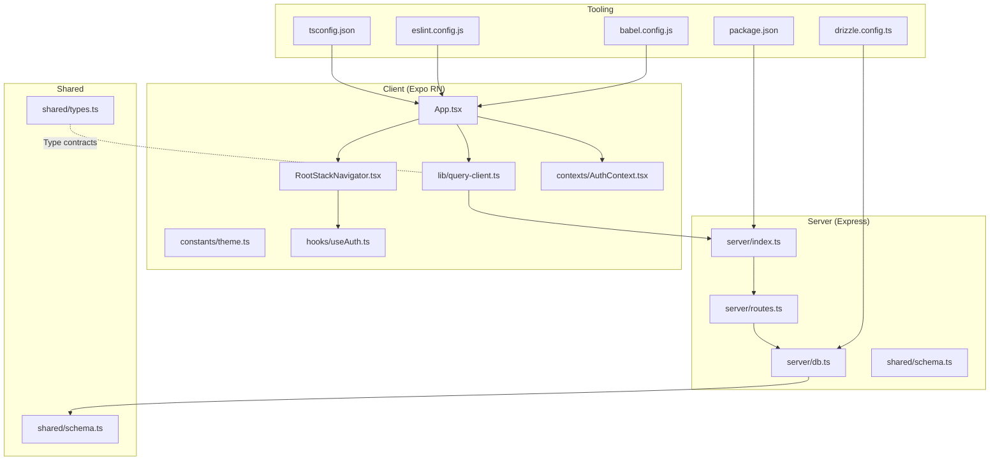
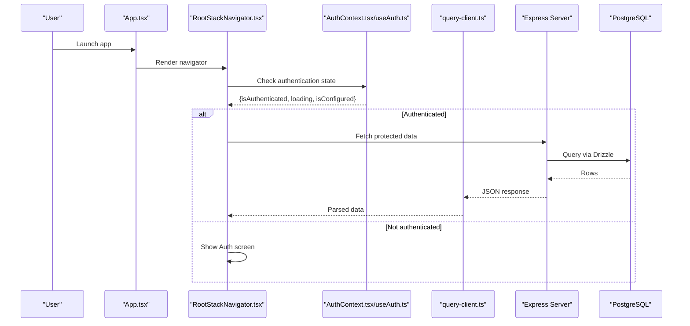
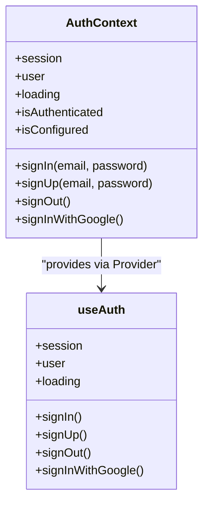
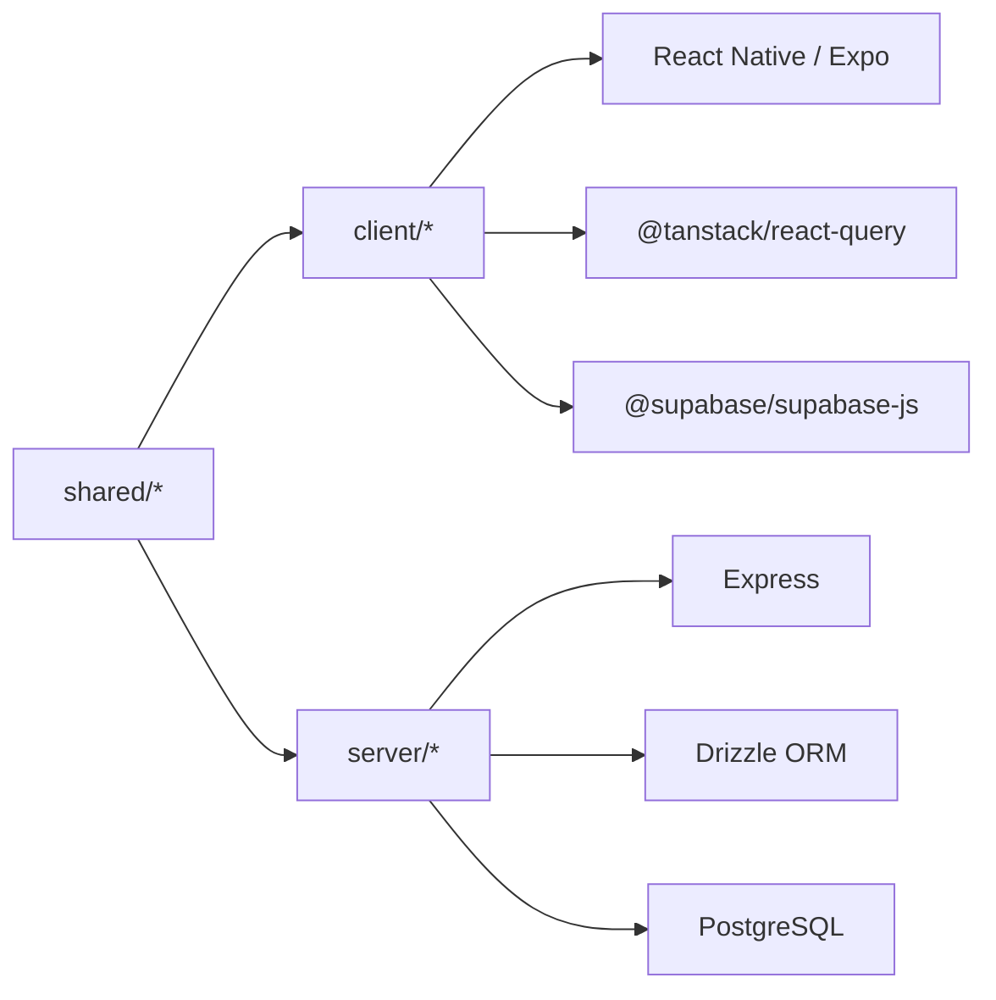

# Development Guidelines

<cite>
**Referenced Files in This Document**
- [tsconfig.json](file://tsconfig.json)
- [eslint.config.js](file://eslint.config.js)
- [package.json](file://package.json)
- [babel.config.js](file://babel.config.js)
- [drizzle.config.ts](file://drizzle.config.ts)
- [ENVIRONMENT.md](file://ENVIRONMENT.md)
- [design_guidelines.md](file://design_guidelines.md)
- [client/App.tsx](file://client/App.tsx)
- [client/constants/theme.ts](file://client/constants/theme.ts)
- [client/lib/query-client.ts](file://client/lib/query-client.ts)
- [client/navigation/RootStackNavigator.tsx](file://client/navigation/RootStackNavigator.tsx)
- [client/contexts/AuthContext.tsx](file://client/contexts/AuthContext.tsx)
- [client/hooks/useAuth.ts](file://client/hooks/useAuth.ts)
- [shared/types.ts](file://shared/types.ts)
- [shared/schema.ts](file://shared/schema.ts)
</cite>

## Table of Contents
1. [Introduction](#introduction)
2. [Project Structure](#project-structure)
3. [Core Components](#core-components)
4. [Architecture Overview](#architecture-overview)
5. [Detailed Component Analysis](#detailed-component-analysis)
6. [Dependency Analysis](#dependency-analysis)
7. [Performance Considerations](#performance-considerations)
8. [Security Best Practices](#security-best-practices)
9. [Accessibility Requirements](#accessibility-requirements)
10. [Contribution Workflow](#contribution-workflow)
11. [Troubleshooting Guide](#troubleshooting-guide)
12. [Conclusion](#conclusion)
13. [Appendices](#appendices)

## Introduction
This document defines Hidden-Gem’s development guidelines and best practices. It consolidates TypeScript configuration, ESLint and Prettier standards, design guidelines, architectural patterns, and contribution workflow. The goal is to ensure consistent code quality, predictable behavior, and a smooth developer experience across the React Native Expo frontend and Express backend.

## Project Structure
The repository follows a dual-platform structure with a clear separation between client, server, shared code, and supporting tooling:
- client: React Native Expo frontend with components, screens, navigation, hooks, contexts, and theme constants
- server: Express API with routes, database integration, and Replit-specific integrations
- shared: Types and database schema shared between client and server
- scripts: Build and migration helpers
- configs: TypeScript, ESLint, Babel, and Drizzle configurations

**Diagram sources**
- [client/App.tsx](file://client/App.tsx#L1-L67)
- [client/navigation/RootStackNavigator.tsx](file://client/navigation/RootStackNavigator.tsx#L1-L133)
- [client/constants/theme.ts](file://client/constants/theme.ts#L1-L167)
- [client/lib/query-client.ts](file://client/lib/query-client.ts#L1-L80)
- [client/contexts/AuthContext.tsx](file://client/contexts/AuthContext.tsx#L1-L31)
- [client/hooks/useAuth.ts](file://client/hooks/useAuth.ts#L1-L151)
- [server/index.ts](file://server/index.ts)
- [server/routes.ts](file://server/routes.ts)
- [server/db.ts](file://server/db.ts)
- [shared/types.ts](file://shared/types.ts#L1-L116)
- [shared/schema.ts](file://shared/schema.ts#L1-L344)
- [tsconfig.json](file://tsconfig.json#L1-L15)
- [eslint.config.js](file://eslint.config.js#L1-L13)
- [babel.config.js](file://babel.config.js#L1-L21)
- [drizzle.config.ts](file://drizzle.config.ts#L1-L19)
- [package.json](file://package.json#L1-L95)

**Section sources**
- [ENVIRONMENT.md](file://ENVIRONMENT.md#L115-L143)
- [package.json](file://package.json#L1-L95)

## Core Components
- TypeScript configuration enforces strictness, path aliases, and type inclusion for Node APIs. See [tsconfig.json](file://tsconfig.json#L1-L15).
- ESLint configuration composes Expo’s flat config with Prettier recommended rules and ignores dist artifacts. See [eslint.config.js](file://eslint.config.js#L1-L13).
- Prettier is integrated via ESLint; formatting checks and writes are exposed through npm scripts. See [package.json](file://package.json#L15-L19).
- Babel sets up Expo preset, module resolver aliases, and react-native-reanimated plugin. See [babel.config.js](file://babel.config.js#L1-L21).
- Drizzle configuration loads environment variables and points to shared schema for migrations. See [drizzle.config.ts](file://drizzle.config.ts#L1-L19).

**Section sources**
- [tsconfig.json](file://tsconfig.json#L1-L15)
- [eslint.config.js](file://eslint.config.js#L1-L13)
- [package.json](file://package.json#L15-L19)
- [babel.config.js](file://babel.config.js#L1-L21)
- [drizzle.config.ts](file://drizzle.config.ts#L1-L19)

## Architecture Overview
Hidden-Gem uses a layered architecture:
- Frontend (client): React Navigation stack with a tab-based root navigator, centralized theme and query client, and Supabase-based authentication context.
- Backend (server): Express routes backed by Drizzle ORM and PostgreSQL, with Replit integrations for AI and storage.
- Shared (shared): Strongly-typed models and database schema used by both client and server.

**Diagram sources**
- [client/App.tsx](file://client/App.tsx#L1-L67)
- [client/navigation/RootStackNavigator.tsx](file://client/navigation/RootStackNavigator.tsx#L1-L133)
- [client/contexts/AuthContext.tsx](file://client/contexts/AuthContext.tsx#L1-L31)
- [client/hooks/useAuth.ts](file://client/hooks/useAuth.ts#L1-L151)
- [client/lib/query-client.ts](file://client/lib/query-client.ts#L1-L80)
- [server/index.ts](file://server/index.ts)
- [shared/schema.ts](file://shared/schema.ts#L1-L344)

## Detailed Component Analysis

### TypeScript Configuration and Type Safety
- Strict mode is enabled for robust type checking.
- Path aliases map "@/*" to client and "@shared/*" to shared for concise imports.
- Node types are included for server-side tooling compatibility.
- Exclusions target test files and build artifacts.

Recommendations:
- Keep strict mode enabled; introduce incremental strictness flags if needed.
- Prefer explicit types for props and API payloads; leverage shared types from [shared/types.ts](file://shared/types.ts#L1-L116).
- Use Zod insert/update schemas from [shared/schema.ts](file://shared/schema.ts#L78-L108) to validate inputs consistently.

**Section sources**
- [tsconfig.json](file://tsconfig.json#L1-L15)
- [shared/types.ts](file://shared/types.ts#L1-L116)
- [shared/schema.ts](file://shared/schema.ts#L78-L108)

### ESLint and Formatting Standards
- ESLint uses Expo’s flat config plus Prettier recommended rules.
- Ignores dist artifacts to avoid linting generated code.
- Formatting is enforced via npm scripts; Prettier is integrated through ESLint.

Guidelines:
- Run lint checks and auto-fixes using npm scripts.
- Avoid disabling rules unless justified; prefer configuring rules in the ESLint config.
- Group imports per Expo’s defaults; keep formatting consistent with Prettier.

**Section sources**
- [eslint.config.js](file://eslint.config.js#L1-L13)
- [package.json](file://package.json#L15-L19)

### Module Resolution and Aliases
- Babel module-resolver maps "@"/"@shared" to client/shared directories with platform-specific extensions.
- TypeScript extends Expo’s base TSConfig and mirrors the same alias mapping.

Best practices:
- Use "@/*" and "@shared/*" aliases for all internal imports to improve readability and maintainability.
- Keep alias roots aligned across Babel and TypeScript configurations.

**Section sources**
- [babel.config.js](file://babel.config.js#L1-L21)
- [tsconfig.json](file://tsconfig.json#L6-L9)

### Theme and Design System
- Centralized theme constants define colors, spacing, typography, fonts, and shadows.
- The app theme merges React Navigation’s DarkTheme with HiddenGem’s palette.

Guidelines:
- Import theme tokens from [client/constants/theme.ts](file://client/constants/theme.ts#L1-L167) for consistent UI.
- Respect spacing and typography scales for accessible and harmonious layouts.

**Section sources**
- [client/constants/theme.ts](file://client/constants/theme.ts#L1-L167)
- [client/App.tsx](file://client/App.tsx#L18-L29)

### Authentication Context and Hooks
- AuthContext encapsulates Supabase session state and exposes sign-in/sign-out/sign-up flows.
- useAuth manages session retrieval, auth state subscription, and OAuth handoffs across platforms.

Guidelines:
- Always consume authentication state via useAuthContext to ensure consistent behavior.
- Handle loading states and configuration checks before rendering protected content.

**Diagram sources**
- [client/contexts/AuthContext.tsx](file://client/contexts/AuthContext.tsx#L1-L31)
- [client/hooks/useAuth.ts](file://client/hooks/useAuth.ts#L1-L151)

**Section sources**
- [client/contexts/AuthContext.tsx](file://client/contexts/AuthContext.tsx#L1-L31)
- [client/hooks/useAuth.ts](file://client/hooks/useAuth.ts#L1-L151)

### Navigation Architecture
- RootStackNavigator orchestrates authentication gating and screen routing.
- Content background color is set via theme constants for consistent dark theme visuals.

Guidelines:
- Define all route params in the stack param list for type safety.
- Use transparent headers and consistent content styling for immersive experiences.

**Section sources**
- [client/navigation/RootStackNavigator.tsx](file://client/navigation/RootStackNavigator.tsx#L18-L30)
- [client/navigation/RootStackNavigator.tsx](file://client/navigation/RootStackNavigator.tsx#L45-L49)

### Data Fetching and Query Client
- query-client centralizes API base URL derivation, request helpers, and React Query defaults.
- Defaults disable refetch on window focus, set infinite staleTime, and disable retries for predictable UX.

Guidelines:
- Use getApiUrl and apiRequest helpers for consistent cross-environment requests.
- Leverage getQueryFn with on401 behavior to handle auth errors gracefully.

**Section sources**
- [client/lib/query-client.ts](file://client/lib/query-client.ts#L7-L17)
- [client/lib/query-client.ts](file://client/lib/query-client.ts#L26-L43)
- [client/lib/query-client.ts](file://client/lib/query-client.ts#L46-L64)
- [client/lib/query-client.ts](file://client/lib/query-client.ts#L66-L79)

### Shared Types and Schema
- shared/types.ts defines canonical types for products, listings, AI generations, sellers, and integrations.
- shared/schema.ts defines database tables and Zod insert/update schemas for runtime validation.

Guidelines:
- Align frontend props and API payloads with shared types.
- Use insert/update schemas to validate data before database writes.

**Section sources**
- [shared/types.ts](file://shared/types.ts#L1-L116)
- [shared/schema.ts](file://shared/schema.ts#L78-L108)
- [shared/schema.ts](file://shared/schema.ts#L223-L256)

### Drizzle Configuration and Migrations
- drizzle.config.ts loads DATABASE_URL from environment and points to shared schema.
- Migrations live under ./migrations and are applied via npm run db:push.

Guidelines:
- Keep schema changes in shared/schema.ts and regenerate migrations accordingly.
- Treat migrations as immutable and idempotent.

**Section sources**
- [drizzle.config.ts](file://drizzle.config.ts#L1-L19)
- [shared/schema.ts](file://shared/schema.ts#L1-L344)

## Dependency Analysis
- Client depends on React Navigation, React Query, Expo ecosystem, and Supabase for auth.
- Server depends on Express, Drizzle ORM, and PostgreSQL; integrates with Replit AI/storage.
- Shared types and schema unify contracts between client and server.

**Diagram sources**
- [package.json](file://package.json#L24-L76)
- [shared/types.ts](file://shared/types.ts#L1-L116)
- [shared/schema.ts](file://shared/schema.ts#L1-L344)

**Section sources**
- [package.json](file://package.json#L24-L76)

## Performance Considerations
- Disable automatic refetch on window focus and set infinite staleTime for long-lived lists to reduce unnecessary network calls. See [client/lib/query-client.ts](file://client/lib/query-client.ts#L66-L74).
- Avoid excessive re-renders by memoizing callbacks and using stable references in hooks. See [client/hooks/useAuth.ts](file://client/hooks/useAuth.ts#L139-L149).
- Use platform-aware font stacks and minimal shadows for smoother animations. See [client/constants/theme.ts](file://client/constants/theme.ts#L110-L135).
- Keep navigation stacks shallow and lazy-load heavy assets to minimize initial bundle size.

[No sources needed since this section provides general guidance]

## Security Best Practices
- Store sensitive environment variables (e.g., Supabase keys, database URL, session secret) in secrets management; do not commit them to version control. See [ENVIRONMENT.md](file://ENVIRONMENT.md#L12-L67).
- Enforce HTTPS for API requests and validate redirects in OAuth flows. See [client/hooks/useAuth.ts](file://client/hooks/useAuth.ts#L77-L136).
- Sanitize user inputs using Zod schemas from [shared/schema.ts](file://shared/schema.ts#L78-L108) before persisting to the database.
- Limit API exposure and enforce RBAC via server-side policies; avoid exposing internal secrets in client bundles.

**Section sources**
- [ENVIRONMENT.md](file://ENVIRONMENT.md#L12-L67)
- [client/hooks/useAuth.ts](file://client/hooks/useAuth.ts#L77-L136)
- [shared/schema.ts](file://shared/schema.ts#L78-L108)

## Accessibility Requirements
- Use semantic components and provide sufficient color contrast against dark backgrounds. See [client/constants/theme.ts](file://client/constants/theme.ts#L3-L40).
- Ensure touch targets meet minimum size requirements and provide feedback on press. See [client/constants/theme.ts](file://client/constants/theme.ts#L146-L146).
- Respect safe areas and keyboard overlays for responsive layouts. See [client/App.tsx](file://client/App.tsx#L36-L46).
- Provide readable typography scales and headings hierarchy. See [client/constants/theme.ts](file://client/constants/theme.ts#L67-L108).

**Section sources**
- [client/constants/theme.ts](file://client/constants/theme.ts#L3-L40)
- [client/constants/theme.ts](file://client/constants/theme.ts#L67-L108)
- [client/constants/theme.ts](file://client/constants/theme.ts#L146-L146)
- [client/App.tsx](file://client/App.tsx#L36-L46)

## Contribution Workflow
- Development setup: Install prerequisites, configure environment variables, and run both frontend and backend servers concurrently. See [ENVIRONMENT.md](file://ENVIRONMENT.md#L69-L113).
- Branching: Use feature branches prefixed with feature/, fix/, or chore/. Keep commits focused and descriptive.
- Pull Requests: Open PRs targeting develop or main with clear descriptions, screenshots for UI changes, and passing CI checks.
- Code Review: Expect reviews on style, correctness, performance, and accessibility. Address comments promptly.
- Linting and Formatting: Run npm run lint and npm run format before committing. See [package.json](file://package.json#L15-L19).
- Type Checking: Ensure tsc passes locally with npm run check:types. See [package.json](file://package.json#L17-L17).

**Section sources**
- [ENVIRONMENT.md](file://ENVIRONMENT.md#L69-L113)
- [package.json](file://package.json#L15-L19)

## Troubleshooting Guide
- Ports in use: Kill processes occupying ports 5000 (backend) and 8081 (frontend) if needed. See [ENVIRONMENT.md](file://ENVIRONMENT.md#L174-L176).
- Database connectivity: Verify DATABASE_URL and test connectivity with psql. See [ENVIRONMENT.md](file://ENVIRONMENT.md#L178-L180).
- Hot reload issues: Restart the Expo dev server or clear cache. See [ENVIRONMENT.md](file://ENVIRONMENT.md#L182-L184).
- Supabase auth failures: Confirm Supabase URLs and keys are set and valid. See [ENVIRONMENT.md](file://ENVIRONMENT.md#L186-L189).
- AI features: Ensure AI integration keys are configured and quotas are available. See [ENVIRONMENT.md](file://ENVIRONMENT.md#L191-L194).

**Section sources**
- [ENVIRONMENT.md](file://ENVIRONMENT.md#L174-L194)

## Conclusion
These guidelines establish a consistent, secure, and scalable foundation for Hidden-Gem development. By adhering to the TypeScript strictness, ESLint/Prettier standards, design system, and contribution workflow, contributors can collaborate effectively and deliver high-quality features across the client and server.

[No sources needed since this section summarizes without analyzing specific files]

## Appendices

### A. TypeScript Compiler Options Reference
- Strict mode enabled for robust type safety.
- Path aliases for modular imports.
- Node types included for tooling.
- Excludes test and build artifacts.

**Section sources**
- [tsconfig.json](file://tsconfig.json#L3-L14)

### B. ESLint Configuration Reference
- Flat config composition with Expo and Prettier recommended rules.
- Ignores dist artifacts.

**Section sources**
- [eslint.config.js](file://eslint.config.js#L6-L11)

### C. Formatting and Linting Commands
- Lint checks and fixes.
- Type checking.
- Formatting verification and write.

**Section sources**
- [package.json](file://package.json#L15-L19)

### D. Module Resolution Aliases
- Babel module-resolver aliases for "@"/"@shared".
- TypeScript path mapping mirrors Babel.

**Section sources**
- [babel.config.js](file://babel.config.js#L7-L16)
- [tsconfig.json](file://tsconfig.json#L6-L9)

### E. Theme Tokens Reference
- Colors, spacing, typography, fonts, and shadows.

**Section sources**
- [client/constants/theme.ts](file://client/constants/theme.ts#L3-L167)

### F. Authentication Flow Reference
- Auth context provider and hook implementation.

**Section sources**
- [client/contexts/AuthContext.tsx](file://client/contexts/AuthContext.tsx#L1-L31)
- [client/hooks/useAuth.ts](file://client/hooks/useAuth.ts#L1-L151)

### G. Navigation Reference
- Root stack navigator with theme and screen options.

**Section sources**
- [client/navigation/RootStackNavigator.tsx](file://client/navigation/RootStackNavigator.tsx#L18-L30)
- [client/navigation/RootStackNavigator.tsx](file://client/navigation/RootStackNavigator.tsx#L45-L49)

### H. Data Fetching Reference
- Query client defaults and API helpers.

**Section sources**
- [client/lib/query-client.ts](file://client/lib/query-client.ts#L66-L79)
- [client/lib/query-client.ts](file://client/lib/query-client.ts#L26-L43)

### I. Shared Contracts Reference
- Types and Zod schemas.

**Section sources**
- [shared/types.ts](file://shared/types.ts#L1-L116)
- [shared/schema.ts](file://shared/schema.ts#L78-L108)

### J. Drizzle Migration Reference
- Drizzle config and shared schema.

**Section sources**
- [drizzle.config.ts](file://drizzle.config.ts#L1-L19)
- [shared/schema.ts](file://shared/schema.ts#L1-L344)