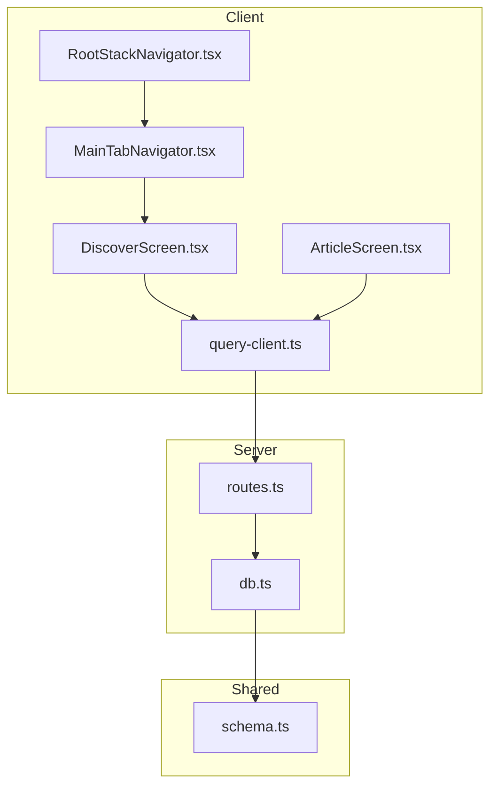
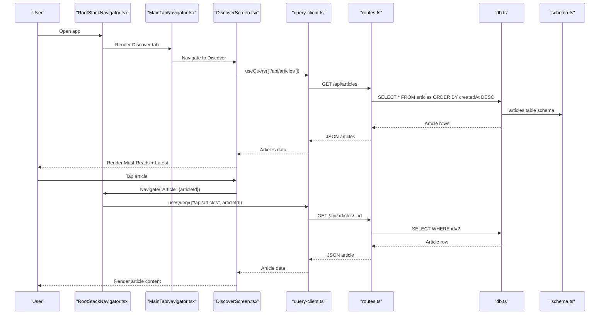
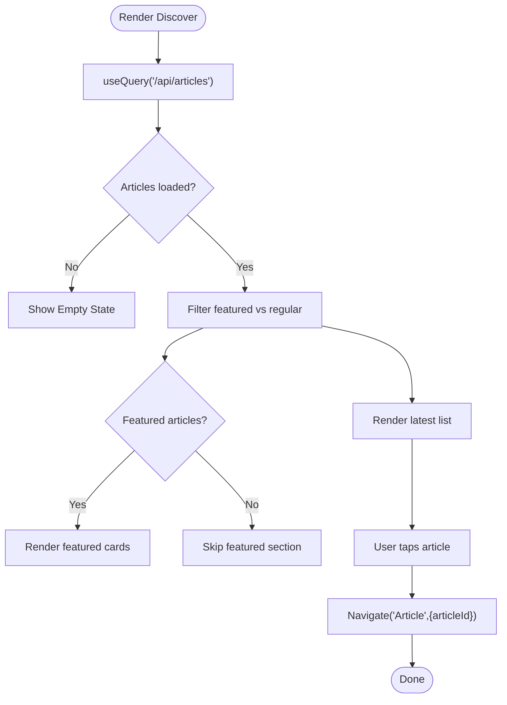
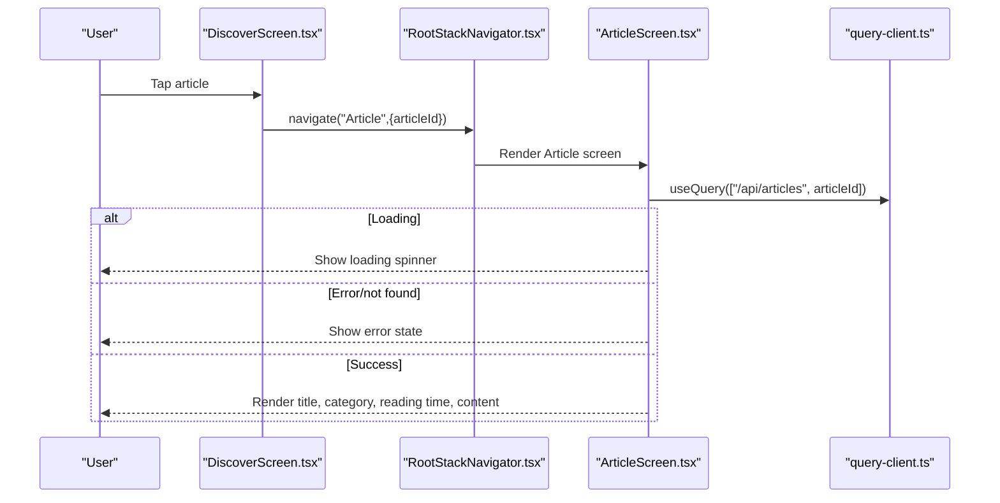
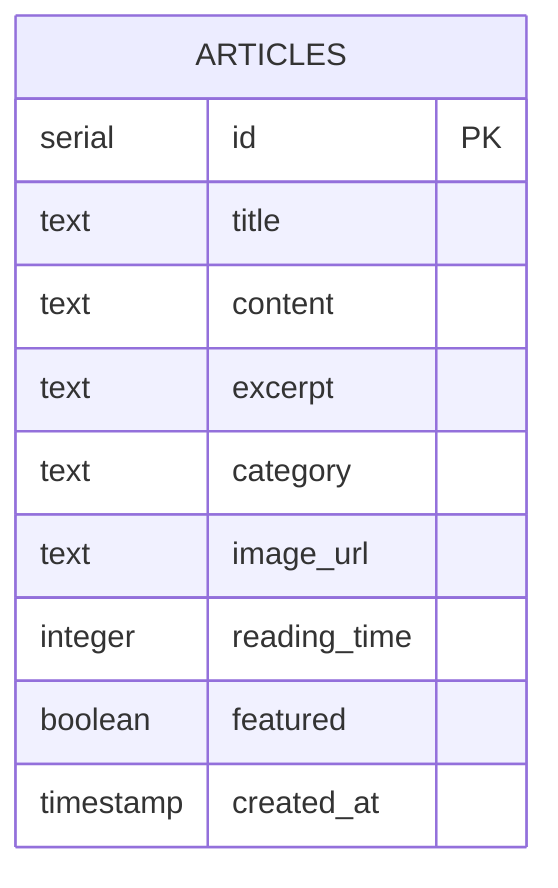
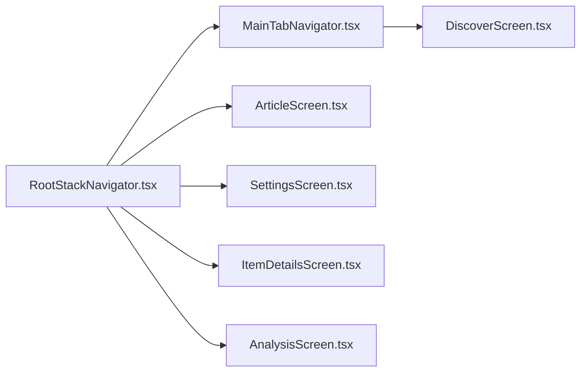
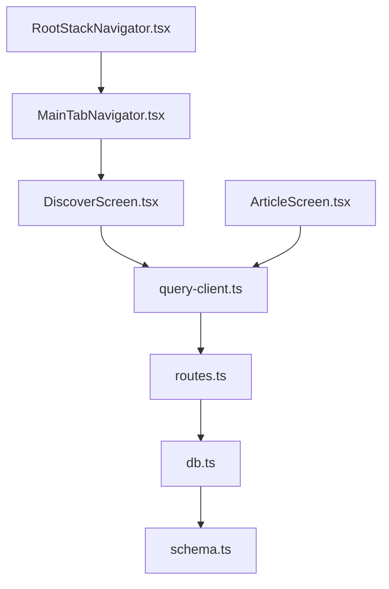

# Educational Content

<cite>
**Referenced Files in This Document**
- [DiscoverScreen.tsx](file://client/screens/DiscoverScreen.tsx)
- [ArticleScreen.tsx](file://client/screens/ArticleScreen.tsx)
- [MainTabNavigator.tsx](file://client/navigation/MainTabNavigator.tsx)
- [RootStackNavigator.tsx](file://client/navigation/RootStackNavigator.tsx)
- [query-client.ts](file://client/lib/query-client.ts)
- [routes.ts](file://server/routes.ts)
- [db.ts](file://server/db.ts)
- [schema.ts](file://shared/schema.ts)
- [design_guidelines.md](file://design_guidelines.md)
</cite>

## Table of Contents
1. [Introduction](#introduction)
2. [Project Structure](#project-structure)
3. [Core Components](#core-components)
4. [Architecture Overview](#architecture-overview)
5. [Detailed Component Analysis](#detailed-component-analysis)
6. [Dependency Analysis](#dependency-analysis)
7. [Performance Considerations](#performance-considerations)
8. [Troubleshooting Guide](#troubleshooting-guide)
9. [Conclusion](#conclusion)
10. [Appendices](#appendices)

## Introduction
This document explains Hidden-Gem’s educational content system for articles and discovery. It covers how articles are managed, curated, and presented; how the Discover screen organizes content by category and prominence; how the Article screen renders content and optimizes reading; and how the backend stores and serves article data. It also outlines content creation and editorial workflows, moderation considerations, accessibility and offline readiness, and user engagement tracking approaches.

## Project Structure
The educational content system spans three layers:
- Client (React Native): Discovery and article presentation, navigation, and caching via React Query.
- Server (Express + Drizzle ORM): Article endpoints and database access.
- Shared (Drizzle schema): Canonical article model and types.

**Diagram sources**
- [DiscoverScreen.tsx](file://client/screens/DiscoverScreen.tsx#L88-L175)
- [ArticleScreen.tsx](file://client/screens/ArticleScreen.tsx#L26-L91)
- [MainTabNavigator.tsx](file://client/navigation/MainTabNavigator.tsx#L64-L144)
- [RootStackNavigator.tsx](file://client/navigation/RootStackNavigator.tsx#L34-L132)
- [query-client.ts](file://client/lib/query-client.ts#L66-L80)
- [routes.ts](file://server/routes.ts#L184-L214)
- [db.ts](file://server/db.ts#L1-L19)
- [schema.ts](file://shared/schema.ts#L52-L62)

**Section sources**
- [DiscoverScreen.tsx](file://client/screens/DiscoverScreen.tsx#L1-L175)
- [ArticleScreen.tsx](file://client/screens/ArticleScreen.tsx#L1-L91)
- [MainTabNavigator.tsx](file://client/navigation/MainTabNavigator.tsx#L1-L144)
- [RootStackNavigator.tsx](file://client/navigation/RootStackNavigator.tsx#L1-L132)
- [query-client.ts](file://client/lib/query-client.ts#L1-L80)
- [routes.ts](file://server/routes.ts#L184-L214)
- [db.ts](file://server/db.ts#L1-L19)
- [schema.ts](file://shared/schema.ts#L52-L62)

## Core Components
- Discover screen: Lists curated articles, separates featured and regular articles, supports pull-to-refresh, and navigates to the article detail.
- Article screen: Loads and renders a single article with category, reading time, and content.
- Navigation: Tabs place Discover prominently; stack routes support Article detail.
- Data layer: Server exposes GET endpoints for articles and individual article retrieval; client caches and refetches via React Query.

Key responsibilities:
- Content management: Articles stored with title, content, excerpt, category, image URL, reading time, and featured flag.
- Presentation: Clean typography, category badges, reading time metadata, and responsive layouts.
- Discovery: Curated “Must-Reads” and “Latest” sections; empty-state illustration for no-content scenarios.

**Section sources**
- [DiscoverScreen.tsx](file://client/screens/DiscoverScreen.tsx#L15-L175)
- [ArticleScreen.tsx](file://client/screens/ArticleScreen.tsx#L15-L91)
- [schema.ts](file://shared/schema.ts#L52-L62)
- [routes.ts](file://server/routes.ts#L184-L214)

## Architecture Overview
The educational content pipeline:
- Client queries article lists and article details via React Query using a shared API base URL.
- Server routes select articles from the database ordered by creation time.
- Shared schema defines the canonical article model used by both client and server.

**Diagram sources**
- [RootStackNavigator.tsx](file://client/navigation/RootStackNavigator.tsx#L86-L92)
- [MainTabNavigator.tsx](file://client/navigation/MainTabNavigator.tsx#L104-L114)
- [DiscoverScreen.tsx](file://client/screens/DiscoverScreen.tsx#L93-L102)
- [query-client.ts](file://client/lib/query-client.ts#L46-L64)
- [routes.ts](file://server/routes.ts#L184-L214)
- [db.ts](file://server/db.ts#L1-L19)
- [schema.ts](file://shared/schema.ts#L52-L62)

## Detailed Component Analysis

### Discover Screen: Content Discovery and Categorization
- Data model: Article interface includes id, title, excerpt, category, imageUrl, readingTime, and featured flag.
- Rendering:
  - Featured section highlights curated content with a large card and gradient overlay.
  - Latest section lists regular articles with compact cards, category badges, and reading time.
- Interaction:
  - Pull-to-refresh triggers refetch of article list.
  - Empty state displays a book illustration and friendly messaging.
- Navigation:
  - Each article card navigates to the Article screen with articleId.

**Diagram sources**
- [DiscoverScreen.tsx](file://client/screens/DiscoverScreen.tsx#L88-L175)

**Section sources**
- [DiscoverScreen.tsx](file://client/screens/DiscoverScreen.tsx#L15-L175)
- [design_guidelines.md](file://design_guidelines.md#L46-L54)

### Article Screen: Content Rendering and Reading Experience
- Data model: Article includes id, title, content, excerpt, category, imageUrl, readingTime, and createdAt.
- Rendering:
  - Category badge, title, and reading time metadata above content.
  - Hero image placeholder with aspect ratio for visual interest.
  - Content area with readable line height and typography sizing.
- Error/loading states:
  - Loading spinner while fetching.
  - Friendly error state if article is missing.
- Navigation:
  - Back via standard header; deep-linkable via stack route.

**Diagram sources**
- [RootStackNavigator.tsx](file://client/navigation/RootStackNavigator.tsx#L86-L92)
- [ArticleScreen.tsx](file://client/screens/ArticleScreen.tsx#L26-L91)
- [query-client.ts](file://client/lib/query-client.ts#L46-L64)

**Section sources**
- [ArticleScreen.tsx](file://client/screens/ArticleScreen.tsx#L15-L91)
- [design_guidelines.md](file://design_guidelines.md#L46-L54)

### Data Model and Backend Integration
- Canonical article schema includes id, title, content, excerpt, category, imageUrl, readingTime, featured, and createdAt.
- Server endpoints:
  - GET /api/articles returns all articles ordered by creation time.
  - GET /api/articles/:id returns a single article by id.
- Client caching:
  - React Query manages cache keys and refetch behavior.
  - Default options disable window focus refetch and set infinite stale time for stability.

**Diagram sources**
- [schema.ts](file://shared/schema.ts#L52-L62)

**Section sources**
- [schema.ts](file://shared/schema.ts#L52-L62)
- [routes.ts](file://server/routes.ts#L184-L214)
- [db.ts](file://server/db.ts#L1-L19)
- [query-client.ts](file://client/lib/query-client.ts#L66-L80)

### Navigation and Routing
- Root stack:
  - Routes include Main (tabs), Settings, ItemDetails, Analysis, Article, and policy screens.
  - Article route accepts articleId param.
- Tabs:
  - Discover tab is primary entry for educational content.
  - Scan and Stash tabs support complementary workflows.

**Diagram sources**
- [RootStackNavigator.tsx](file://client/navigation/RootStackNavigator.tsx#L34-L132)
- [MainTabNavigator.tsx](file://client/navigation/MainTabNavigator.tsx#L64-L144)

**Section sources**
- [RootStackNavigator.tsx](file://client/navigation/RootStackNavigator.tsx#L18-L30)
- [MainTabNavigator.tsx](file://client/navigation/MainTabNavigator.tsx#L104-L114)

## Dependency Analysis
- Client depends on:
  - Navigation stack for routing.
  - React Query for caching and data fetching.
  - Theme and typography constants for consistent UI.
- Server depends on:
  - Drizzle ORM for database access.
  - Shared schema for canonical types and table definitions.
- Coupling:
  - Client and server communicate via REST endpoints keyed by query keys in React Query.
  - No circular dependencies observed among the analyzed files.

**Diagram sources**
- [query-client.ts](file://client/lib/query-client.ts#L46-L64)
- [routes.ts](file://server/routes.ts#L184-L214)
- [db.ts](file://server/db.ts#L1-L19)
- [schema.ts](file://shared/schema.ts#L52-L62)
- [DiscoverScreen.tsx](file://client/screens/DiscoverScreen.tsx#L88-L175)
- [ArticleScreen.tsx](file://client/screens/ArticleScreen.tsx#L26-L91)
- [MainTabNavigator.tsx](file://client/navigation/MainTabNavigator.tsx#L64-L144)
- [RootStackNavigator.tsx](file://client/navigation/RootStackNavigator.tsx#L34-L132)

**Section sources**
- [query-client.ts](file://client/lib/query-client.ts#L46-L64)
- [routes.ts](file://server/routes.ts#L184-L214)
- [db.ts](file://server/db.ts#L1-L19)
- [schema.ts](file://shared/schema.ts#L52-L62)
- [DiscoverScreen.tsx](file://client/screens/DiscoverScreen.tsx#L88-L175)
- [ArticleScreen.tsx](file://client/screens/ArticleScreen.tsx#L26-L91)
- [MainTabNavigator.tsx](file://client/navigation/MainTabNavigator.tsx#L64-L144)
- [RootStackNavigator.tsx](file://client/navigation/RootStackNavigator.tsx#L34-L132)

## Performance Considerations
- Infinite cache with staleTime Infinity reduces redundant network requests for article lists and details.
- Pull-to-refresh ensures users can manually refresh content.
- FlatList rendering for article lists minimizes layout thrash.
- Consider lazy-loading images and deferring hero image rendering for very long articles to improve perceived performance.

[No sources needed since this section provides general guidance]

## Troubleshooting Guide
- Article not found:
  - Server responds with 404 when article id does not exist; client shows an error state with icon and friendly message.
- Network errors:
  - React Query throws on non-OK responses; client surfaces a generic error state.
- Missing API base URL:
  - getApiUrl throws if EXPO_PUBLIC_DOMAIN is not set; ensure environment configuration is present.
- Empty content:
  - Discover screen shows an empty state illustration and helpful messaging until content is available.

**Section sources**
- [routes.ts](file://server/routes.ts#L205-L213)
- [ArticleScreen.tsx](file://client/screens/ArticleScreen.tsx#L46-L58)
- [query-client.ts](file://client/lib/query-client.ts#L7-L17)
- [DiscoverScreen.tsx](file://client/screens/DiscoverScreen.tsx#L123-L131)

## Conclusion
Hidden-Gem’s educational content system centers on a clean, curated Discover screen and a focused Article screen, backed by a robust server API and shared schema. The React Query caching strategy ensures efficient content delivery, while the navigation structure places learning content front-and-center. The design guidelines reinforce a premium reading experience with typography, spacing, and category metadata. Future enhancements can include search, recommendation hooks, and offline-first strategies.

[No sources needed since this section summarizes without analyzing specific files]

## Appendices

### Content Management Workflow
- Creation:
  - Editors create articles with title, content, category, optional excerpt, image URL, and reading time.
  - The server persists articles via the shared schema and exposes GET endpoints for retrieval.
- Curation:
  - Mark articles as featured to elevate them in the Discover feed.
- Moderation:
  - Approve content before publication; monitor categories and reading time metadata for consistency.
- Publishing:
  - Articles are served in reverse chronological order; ensure content freshness by scheduling updates.

**Section sources**
- [schema.ts](file://shared/schema.ts#L52-L62)
- [routes.ts](file://server/routes.ts#L184-L214)

### Accessibility Considerations
- Typography:
  - Use readable sizes and line heights for content readability.
- Contrast:
  - Maintain sufficient contrast between text and background for dark theme.
- Focus and navigation:
  - Ensure article navigation is keyboard-accessible via stack navigation.
- Images:
  - Provide alt text via imageUrl when available; otherwise, use placeholders with descriptive icons.

**Section sources**
- [ArticleScreen.tsx](file://client/screens/ArticleScreen.tsx#L171-L176)
- [design_guidelines.md](file://design_guidelines.md#L118-L154)

### Offline Reading and Synchronization
- Current state:
  - Article lists and details are fetched on-demand; no built-in offline persistence is present.
- Recommendations:
  - Persist article metadata and content locally using a client-side cache or storage library.
  - Sync strategy: Fetch latest articles on first load; merge with local cache; reconcile deletions and updates via incremental sync.

**Section sources**
- [query-client.ts](file://client/lib/query-client.ts#L66-L80)

### User Engagement Tracking
- Suggested metrics:
  - Article views per articleId.
  - Time to first interaction on Discover.
  - Category preference distribution.
- Implementation pattern:
  - Extend React Query mutation or use a dedicated analytics hook to record events when users open articles or interact with cards.

**Section sources**
- [DiscoverScreen.tsx](file://client/screens/DiscoverScreen.tsx#L100-L102)
- [ArticleScreen.tsx](file://client/screens/ArticleScreen.tsx#L32-L34)