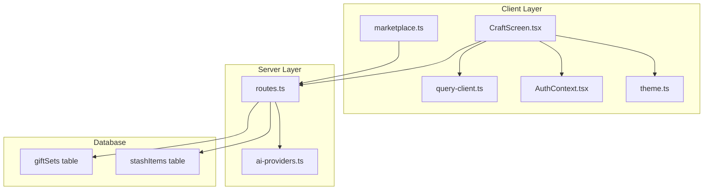
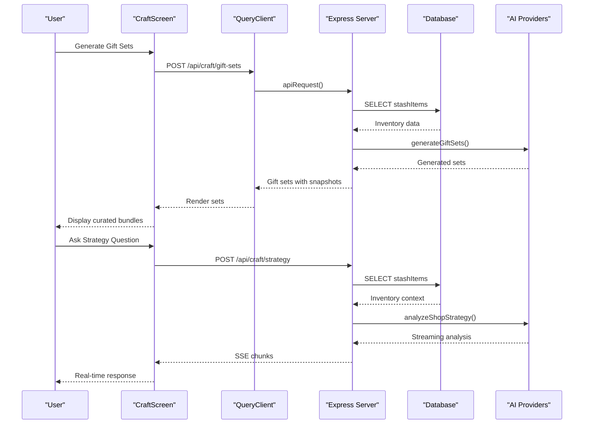
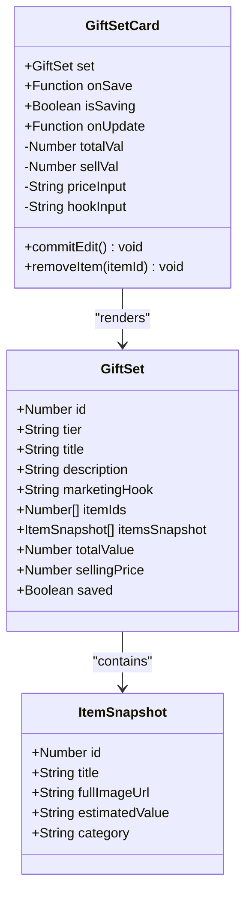
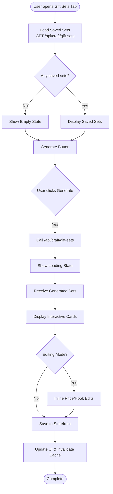
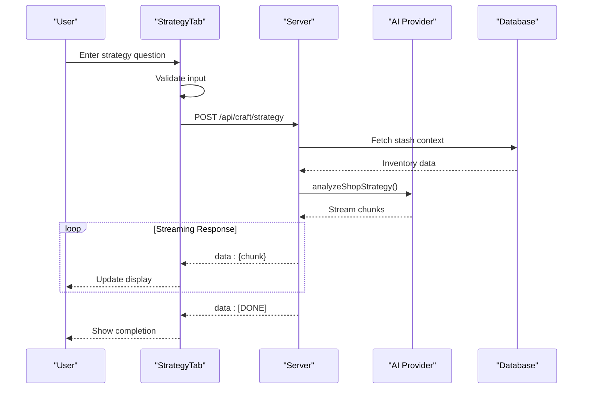
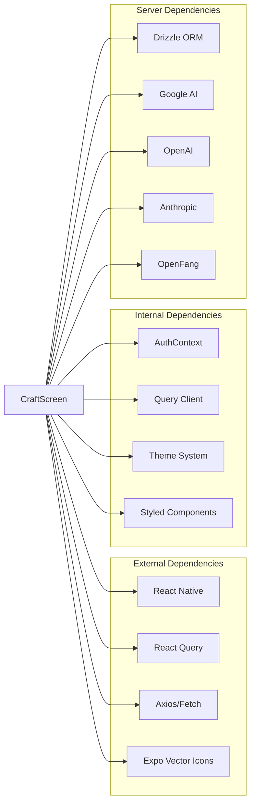

# Craft Screen

<cite>
**Referenced Files in This Document**
- [CraftScreen.tsx](file://client/screens/CraftScreen.tsx)
- [query-client.ts](file://client/lib/query-client.ts)
- [AuthContext.tsx](file://client/contexts/AuthContext.tsx)
- [theme.ts](file://client/constants/theme.ts)
- [routes.ts](file://server/routes.ts)
- [ai-providers.ts](file://server/ai-providers.ts)
- [marketplace.ts](file://client/lib/marketplace.ts)
</cite>

## Table of Contents
1. [Introduction](#introduction)
2. [Project Structure](#project-structure)
3. [Core Components](#core-components)
4. [Architecture Overview](#architecture-overview)
5. [Detailed Component Analysis](#detailed-component-analysis)
6. [Dependency Analysis](#dependency-analysis)
7. [Performance Considerations](#performance-considerations)
8. [Troubleshooting Guide](#troubleshooting-guide)
9. [Conclusion](#conclusion)

## Introduction
The Craft Screen is a dual-tab interface that provides two primary capabilities for sellers: automated gift set creation and AI-powered shop strategy assistance. Built around the "Emma" AI assistant, the screen enables users to generate curated gift bundles from their inventory and receive intelligent recommendations for pricing, marketing, and inventory management decisions. The implementation combines React Native frontend components with server-side AI processing and marketplace integration.

## Project Structure
The Craft Screen is organized as a single cohesive module with supporting infrastructure:



**Diagram sources**
- [CraftScreen.tsx:1-1113](file://client/screens/CraftScreen.tsx#L1-L1113)
- [routes.ts:1236-1549](file://server/routes.ts#L1236-L1549)

**Section sources**
- [CraftScreen.tsx:1-1113](file://client/screens/CraftScreen.tsx#L1-L1113)
- [routes.ts:1236-1549](file://server/routes.ts#L1236-L1549)

## Core Components
The Craft Screen consists of three main architectural layers:

### Gift Sets Tab
The Gift Sets tab provides automated bundling functionality powered by AI analysis of user inventory. It features:
- Real-time gift set generation from stash items
- Interactive editing of suggested prices and marketing hooks
- Visual tier-based categorization (Budget, Starter, Core, Premium, Ultimate)
- Persistent storage of curated sets
- Inline item removal during editing

### Strategy Tab
The Strategy tab offers AI-powered shop analysis through an interactive chat interface:
- Natural language questions about inventory and business strategy
- Streaming AI responses with real-time feedback
- Quick suggestion prompts for common scenarios
- Live inventory context for personalized recommendations

### Shared Infrastructure
Both tabs share common infrastructure:
- Authentication context for secure API access
- Theme system for consistent UI design
- Query client for API communication
- Responsive layout with proper spacing and typography

**Section sources**
- [CraftScreen.tsx:312-466](file://client/screens/CraftScreen.tsx#L312-L466)
- [CraftScreen.tsx:471-690](file://client/screens/CraftScreen.tsx#L471-L690)

## Architecture Overview
The Craft Screen implements a client-server architecture with AI processing capabilities:



**Diagram sources**
- [CraftScreen.tsx:337-349](file://client/screens/CraftScreen.tsx#L337-L349)
- [routes.ts:1277-1318](file://server/routes.ts#L1277-L1318)
- [routes.ts:1427-1460](file://server/routes.ts#L1427-L1460)

The architecture follows these key patterns:
- **Separation of Concerns**: UI logic in client, business logic in server
- **AI Abstraction**: Unified interface for multiple AI providers
- **Streaming Responses**: Real-time user feedback for long-running operations
- **Authentication**: JWT-based access control for all endpoints

## Detailed Component Analysis

### GiftSetCard Component
The GiftSetCard provides an interactive interface for managing curated gift bundles:



**Diagram sources**
- [CraftScreen.tsx:142-307](file://client/screens/CraftScreen.tsx#L142-L307)

Key features:
- **Tier-based Visual Design**: Color-coded badges and borders based on gift set tier
- **Inline Editing**: Direct modification of suggested prices and marketing hooks
- **Item Management**: Visual thumbnails with remove functionality
- **State Management**: Loading states and success feedback

### GiftSetsTab Implementation
The GiftSetsTab orchestrates the gift set workflow:



**Diagram sources**
- [CraftScreen.tsx:312-466](file://client/screens/CraftScreen.tsx#L312-L466)

### StrategyTab Implementation
The StrategyTab provides AI-powered business intelligence:



**Diagram sources**
- [CraftScreen.tsx:471-690](file://client/screens/CraftScreen.tsx#L471-L690)
- [routes.ts:1427-1460](file://server/routes.ts#L1427-L1460)

### Server-Side Gift Set Generation
The server implements sophisticated gift set bundling logic:

```mermaid
flowchart TD
Request[POST /api/craft/gift-sets] --> Validate[Validate User Auth]
Validate --> FetchItems[Fetch User's Stash Items]
FetchItems --> CheckItems{"Any items?"}
CheckItems --> |No| Error[Return 400: No items]
CheckItems --> |Yes| BuildSummary[Build Item Summaries]
BuildSummary --> GenerateSets[generateGiftSets()]
GenerateSets --> AttachSnapshots[Attach Item Snapshots]
AttachSnapshots --> ReturnSets[Return Complete Sets]
subgraph "generateGiftSets Algorithm"
BuildSummary --> GroupByCategory["Group by Category"]
GroupByCategory --> PriceOptimization["Optimize Pricing"]
PriceOptimization --> ValueCalculation["Calculate Total Values"]
ValueCalculation --> TierAssignment["Assign Tiers"]
end
```

**Diagram sources**
- [routes.ts:1277-1318](file://server/routes.ts#L1277-L1318)
- [ai-providers.ts:1-800](file://server/ai-providers.ts#L1-L800)

**Section sources**
- [CraftScreen.tsx:142-307](file://client/screens/CraftScreen.tsx#L142-L307)
- [CraftScreen.tsx:312-466](file://client/screens/CraftScreen.tsx#L312-L466)
- [CraftScreen.tsx:471-690](file://client/screens/CraftScreen.tsx#L471-L690)

## Dependency Analysis
The Craft Screen has well-defined dependencies that support maintainability and scalability:



**Diagram sources**
- [CraftScreen.tsx:1-25](file://client/screens/CraftScreen.tsx#L1-L25)
- [routes.ts:1-29](file://server/routes.ts#L1-L29)

Key dependency characteristics:
- **Minimal External Dependencies**: Only essential libraries for UI and networking
- **Strong Typing**: Full TypeScript implementation with strict type checking
- **Modular Architecture**: Clear separation between UI, business logic, and data access
- **AI Provider Flexibility**: Support for multiple AI backends with unified interface

**Section sources**
- [CraftScreen.tsx:1-25](file://client/screens/CraftScreen.tsx#L1-L25)
- [routes.ts:1-29](file://server/routes.ts#L1-L29)

## Performance Considerations
The Craft Screen implements several performance optimization strategies:

### Client-Side Optimizations
- **React Query Caching**: Automatic caching and invalidation for gift set data
- **Memoized Components**: Efficient rendering of gift set cards
- **Lazy Loading**: Images loaded only when visible
- **Debounced Inputs**: Strategy questions submitted after user stops typing

### Server-Side Optimizations
- **Batch Processing**: Single database query to fetch all user items
- **Efficient Serialization**: Minimal data transfer between client and server
- **Streaming Responses**: Real-time updates without blocking UI
- **AI Provider Fallback**: Automatic failover between multiple AI services

### Memory Management
- **Component Cleanup**: Proper cleanup of event listeners and timers
- **Image Optimization**: Thumbnail generation and lazy loading
- **State Management**: Efficient local state updates without unnecessary re-renders

## Troubleshooting Guide

### Common Issues and Solutions

#### Gift Set Generation Failures
**Symptoms**: "Emma couldn't generate sets" error dialog
**Causes**: 
- Insufficient inventory items
- AI provider unavailability
- Network connectivity issues

**Solutions**:
1. Verify user has items in stash
2. Check AI provider configuration
3. Retry generation after network stabilization

#### Strategy Analysis Errors
**Symptoms**: "Emma couldn't respond" error
**Causes**:
- Empty strategy question
- Server timeout during analysis
- AI provider rate limiting

**Solutions**:
1. Ensure question contains meaningful content
2. Check server logs for AI provider errors
3. Implement exponential backoff for retries

#### Authentication Issues
**Symptoms**: 401 errors on craft endpoints
**Causes**:
- Expired access token
- Missing authorization header
- User session invalidation

**Solutions**:
1. Refresh authentication state
2. Re-authenticate user if necessary
3. Verify token validity in AuthContext

#### Performance Issues
**Symptoms**: Slow gift set loading or strategy responses
**Causes**:
- Large inventory datasets
- Multiple concurrent requests
- Network latency

**Solutions**:
1. Implement pagination for large inventories
2. Debounce rapid successive requests
3. Optimize AI provider selection

**Section sources**
- [CraftScreen.tsx:345-349](file://client/screens/CraftScreen.tsx#L345-L349)
- [CraftScreen.tsx:553-560](file://client/screens/CraftScreen.tsx#L553-L560)

## Conclusion
The Craft Screen represents a sophisticated implementation of AI-powered e-commerce assistance. Its dual-tab architecture effectively balances automated gift set creation with personalized business strategy insights. The modular design, robust error handling, and performance optimizations create a reliable foundation for seller empowerment.

Key strengths include:
- **Unified AI Interface**: Consistent experience across multiple AI providers
- **Interactive Editing**: Flexible customization of AI-generated recommendations
- **Real-time Feedback**: Streaming responses for immediate user engagement
- **Scalable Architecture**: Well-structured codebase supporting future enhancements

The implementation demonstrates best practices in mobile application development, including proper state management, efficient data fetching, and responsive user interfaces. Future enhancements could include advanced filtering options, export capabilities, and integration with additional marketplace platforms.