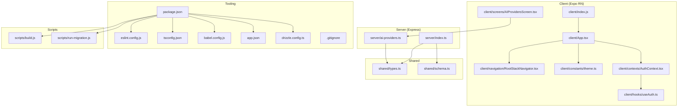
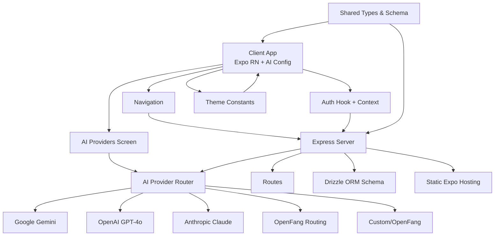
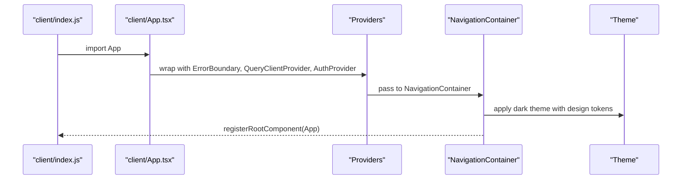
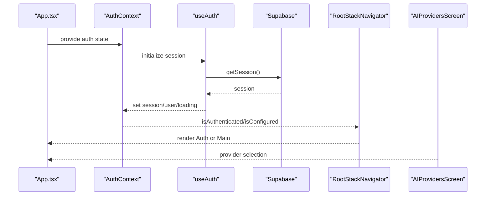
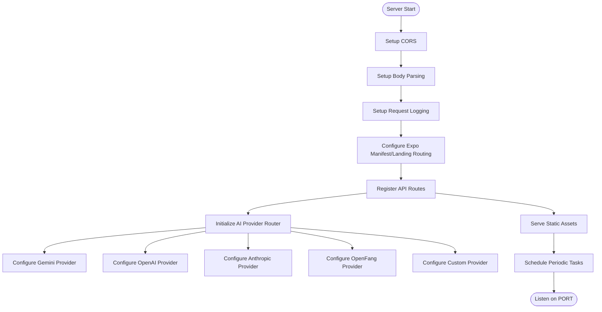
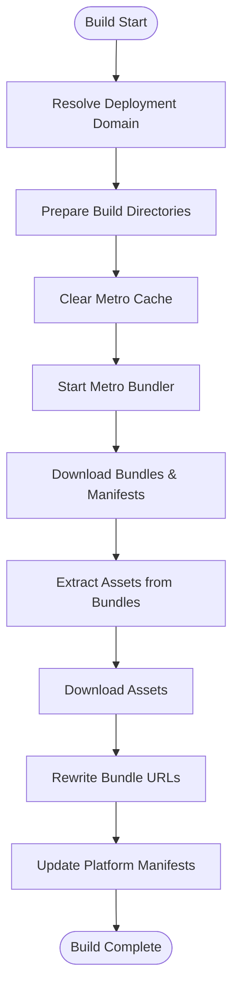
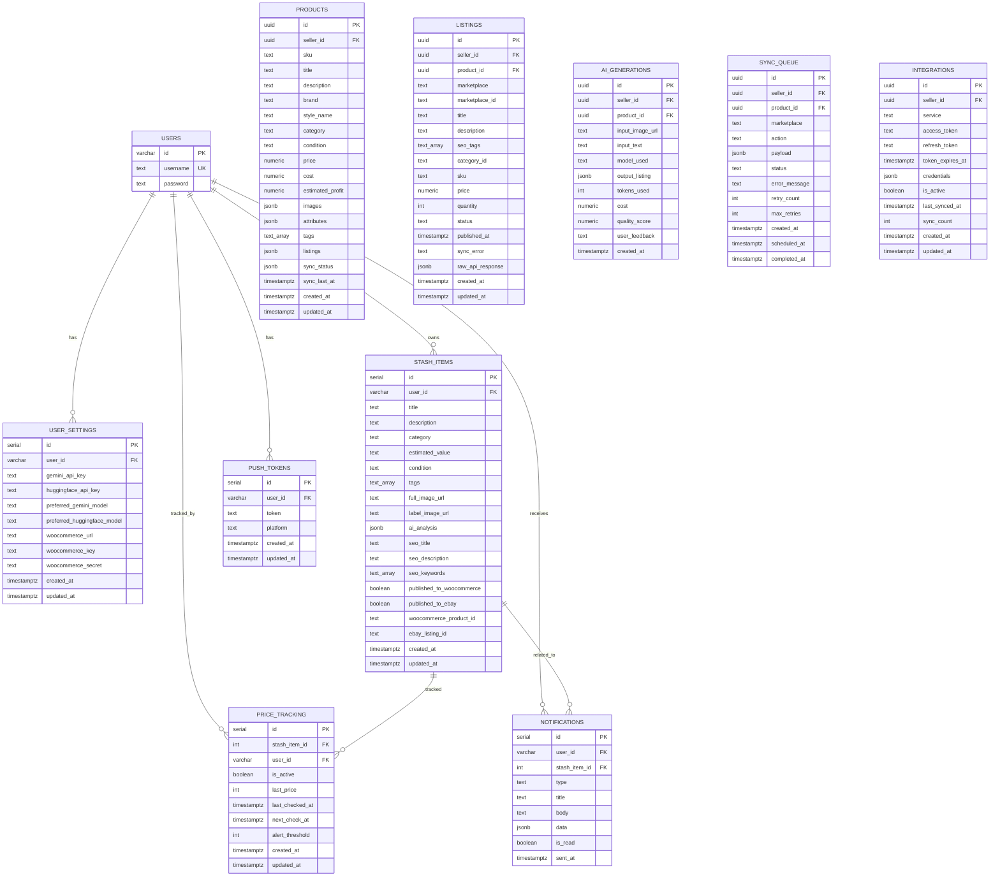
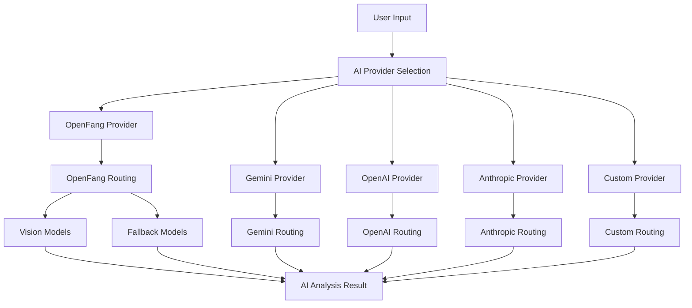
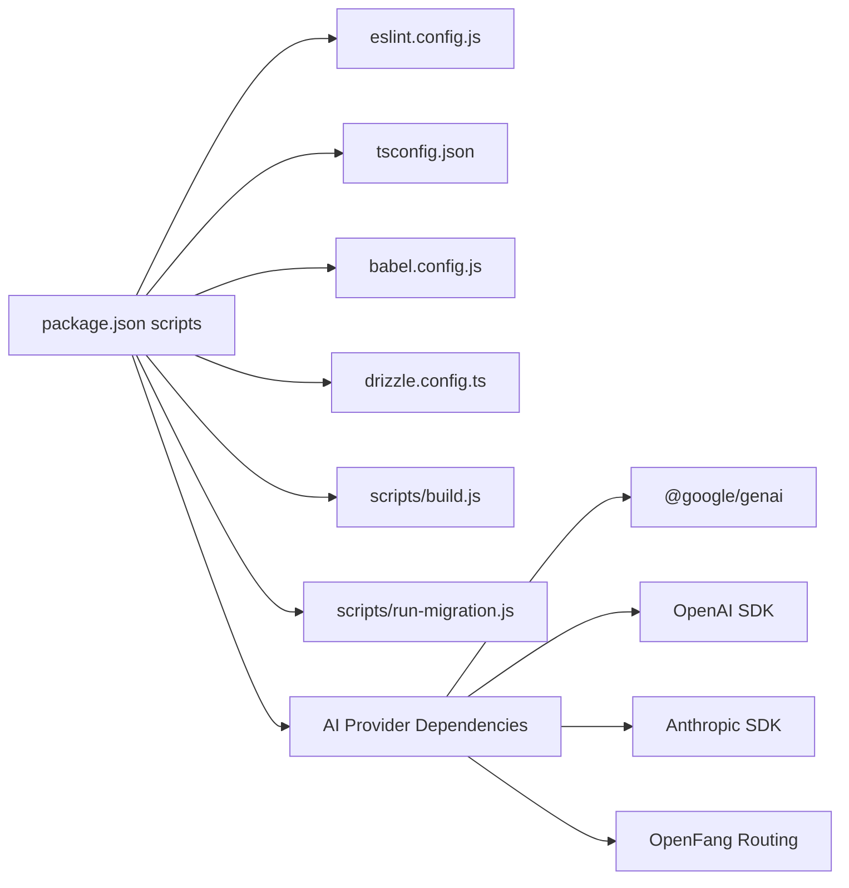

# Development Workflow

<cite>
**Referenced Files in This Document**
- [package.json](file://package.json)
- [eslint.config.js](file://eslint.config.js)
- [tsconfig.json](file://tsconfig.json)
- [babel.config.js](file://babel.config.js)
- [app.json](file://app.json)
- [ENVIRONMENT.md](file://ENVIRONMENT.md)
- [design_guidelines.md](file://design_guidelines.md)
- [.gitignore](file://.gitignore)
- [drizzle.config.ts](file://drizzle.config.ts)
- [scripts/build.js](file://scripts/build.js)
- [scripts/run-migration.js](file://scripts/run-migration.js)
- [server/index.ts](file://server/index.ts)
- [server/ai-providers.ts](file://server/ai-providers.ts)
- [client/App.tsx](file://client/App.tsx)
- [client/index.js](file://client/index.js)
- [client/navigation/RootStackNavigator.tsx](file://client/navigation/RootStackNavigator.tsx)
- [client/constants/theme.ts](file://client/constants/theme.ts)
- [client/hooks/useAuth.ts](file://client/hooks/useAuth.ts)
- [client/contexts/AuthContext.tsx](file://client/contexts/AuthContext.tsx)
- [client/screens/AIProvidersScreen.tsx](file://client/screens/AIProvidersScreen.tsx)
- [shared/types.ts](file://shared/types.ts)
- [shared/schema.ts](file://shared/schema.ts)
- [replit.md](file://replit.md)
</cite>

## Update Summary
**Changes Made**
- Enhanced development tooling section with new migration script automation
- Updated AI provider architecture documentation to reflect multi-provider support
- Added comprehensive Windows compatibility and development environment improvements
- Expanded IntelliJ IDEA configuration support documentation
- Updated replit.md to reflect multi-provider AI architecture and enhanced development workflow

## Table of Contents
1. [Introduction](#introduction)
2. [Project Structure](#project-structure)
3. [Core Components](#core-components)
4. [Architecture Overview](#architecture-overview)
5. [Detailed Component Analysis](#detailed-component-analysis)
6. [Enhanced Development Tooling](#enhanced-development-tooling)
7. [Multi-Provider AI Architecture](#multi-provider-ai-architecture)
8. [Windows Compatibility and IDE Support](#windows-compatibility-and-ide-support)
9. [Dependency Analysis](#dependency-analysis)
10. [Performance Considerations](#performance-considerations)
11. [Troubleshooting Guide](#troubleshooting-guide)
12. [Conclusion](#conclusion)
13. [Appendices](#appendices)

## Introduction
This document describes the complete development lifecycle for the HiddenGem project, including code organization, environment setup, linting and formatting, Git workflow, debugging and testing, build and deployment preparation, code review practices, performance profiling, and common issue resolutions. It synthesizes configuration files and key source modules to present a practical, accessible guide for contributors, with enhanced support for multi-provider AI architectures and modern development environments.

## Project Structure
The project follows a hybrid monorepo-like structure with enhanced development tooling:
- Client (Expo + React Native) under client/ with comprehensive AI provider configuration
- Server (Express) under server/ with multi-provider AI routing and enhanced migration support
- Shared code (types, schema) under shared/
- Database migrations under migrations/ with automated verification
- Build and deployment scripts under scripts/ with Windows compatibility

**Diagram sources**
- [client/App.tsx:1-67](file://client/App.tsx#L1-L67)
- [client/index.js:1-6](file://client/index.js#L1-L6)
- [client/navigation/RootStackNavigator.tsx:1-133](file://client/navigation/RootStackNavigator.tsx#L1-L133)
- [client/constants/theme.ts:1-167](file://client/constants/theme.ts#L1-L167)
- [client/contexts/AuthContext.tsx:1-31](file://client/contexts/AuthContext.tsx#L1-L31)
- [client/hooks/useAuth.ts:1-151](file://client/hooks/useAuth.ts#L1-L151)
- [client/screens/AIProvidersScreen.tsx:1-930](file://client/screens/AIProvidersScreen.tsx#L1-L930)
- [server/index.ts:1-262](file://server/index.ts#L1-L262)
- [server/ai-providers.ts:1-840](file://server/ai-providers.ts#L1-L840)
- [shared/types.ts:1-116](file://shared/types.ts#L1-L116)
- [shared/schema.ts:1-344](file://shared/schema.ts#L1-L344)
- [package.json:1-95](file://package.json#L1-L95)
- [eslint.config.js:1-13](file://eslint.config.js#L1-L13)
- [tsconfig.json:1-15](file://tsconfig.json#L1-L15)
- [babel.config.js:1-21](file://babel.config.js#L1-L21)
- [app.json:1-52](file://app.json#L1-L52)
- [drizzle.config.ts:1-19](file://drizzle.config.ts#L1-L19)
- [.gitignore:1-45](file://.gitignore#L1-L45)
- [scripts/build.js:1-562](file://scripts/build.js#L1-L562)
- [scripts/run-migration.js:1-34](file://scripts/run-migration.js#L1-L34)

**Section sources**
- [package.json:1-95](file://package.json#L1-L95)
- [ENVIRONMENT.md:115-144](file://ENVIRONMENT.md#L115-L144)
- [replit.md:1-116](file://replit.md#L1-L116)

## Core Components
- Client bootstrap registers the root component and wires providers for navigation, theming, authentication, and error boundaries with comprehensive AI provider configuration.
- Navigation orchestrates authentication gating and screen stacks with AI provider selection.
- Authentication hook integrates with Supabase for session management and OAuth flows.
- Server initializes CORS, body parsing, logging, Expo manifest routing, and scheduled tasks with multi-provider AI routing.
- Shared schema and types unify data contracts across client and server with enhanced AI analysis models.
- Tooling includes ESLint/Prettier, TypeScript, Babel aliases, Drizzle ORM configuration, and automated migration verification.

**Section sources**
- [client/index.js:1-6](file://client/index.js#L1-L6)
- [client/App.tsx:1-67](file://client/App.tsx#L1-L67)
- [client/navigation/RootStackNavigator.tsx:1-133](file://client/navigation/RootStackNavigator.tsx#L1-L133)
- [client/hooks/useAuth.ts:1-151](file://client/hooks/useAuth.ts#L1-L151)
- [client/contexts/AuthContext.tsx:1-31](file://client/contexts/AuthContext.tsx#L1-L31)
- [client/screens/AIProvidersScreen.tsx:1-930](file://client/screens/AIProvidersScreen.tsx#L1-L930)
- [server/index.ts:1-262](file://server/index.ts#L1-L262)
- [server/ai-providers.ts:1-840](file://server/ai-providers.ts#L1-L840)
- [shared/schema.ts:1-344](file://shared/schema.ts#L1-L344)
- [shared/types.ts:1-116](file://shared/types.ts#L1-L116)
- [eslint.config.js:1-13](file://eslint.config.js#L1-L13)
- [tsconfig.json:1-15](file://tsconfig.json#L1-L15)
- [babel.config.js:1-21](file://babel.config.js#L1-L21)
- [drizzle.config.ts:1-19](file://drizzle.config.ts#L1-L19)

## Architecture Overview
The system comprises:
- Client app (Expo RN) with React Navigation, React Query, Supabase auth, and multi-provider AI configuration.
- Server (Express) handling API routes, CORS, logging, Expo static hosting, and intelligent AI routing.
- Shared schema and types for database and cross-boundary contracts with enhanced AI analysis models.
- Build pipeline generating static Expo bundles and manifests for deployment with Windows compatibility.
- Automated migration system with verification and error handling.

**Diagram sources**
- [client/App.tsx:1-67](file://client/App.tsx#L1-L67)
- [client/navigation/RootStackNavigator.tsx:1-133](file://client/navigation/RootStackNavigator.tsx#L1-L133)
- [client/hooks/useAuth.ts:1-151](file://client/hooks/useAuth.ts#L1-L151)
- [client/contexts/AuthContext.tsx:1-31](file://client/contexts/AuthContext.tsx#L1-L31)
- [client/constants/theme.ts:1-167](file://client/constants/theme.ts#L1-L167)
- [client/screens/AIProvidersScreen.tsx:1-930](file://client/screens/AIProvidersScreen.tsx#L1-L930)
- [server/index.ts:1-262](file://server/index.ts#L1-L262)
- [server/ai-providers.ts:1-840](file://server/ai-providers.ts#L1-L840)
- [shared/schema.ts:1-344](file://shared/schema.ts#L1-L344)
- [shared/types.ts:1-116](file://shared/types.ts#L1-L116)

## Detailed Component Analysis

### Client Application Bootstrap
- Registers the root component and wraps it with providers for error boundary, React Query, authentication, gesture handling, keyboard control, and safe area.
- Applies a custom dark theme mapped to design tokens.
- Integrates AI provider configuration screen for multi-provider AI selection.

**Diagram sources**
- [client/index.js:1-6](file://client/index.js#L1-L6)
- [client/App.tsx:1-67](file://client/App.tsx#L1-L67)
- [client/constants/theme.ts:1-167](file://client/constants/theme.ts#L1-L167)

**Section sources**
- [client/index.js:1-6](file://client/index.js#L1-L6)
- [client/App.tsx:1-67](file://client/App.tsx#L1-L67)
- [client/constants/theme.ts:1-167](file://client/constants/theme.ts#L1-L167)

### Navigation and Authentication Flow
- Root navigator conditionally renders Auth or Main tabs based on authentication state.
- Auth hook manages session retrieval, sign-in/sign-up, Google OAuth, and sign-out.
- Auth context exposes authentication state and helpers to the app.
- AI Providers screen allows users to configure and select from multiple AI providers.

**Diagram sources**
- [client/contexts/AuthContext.tsx:1-31](file://client/contexts/AuthContext.tsx#L1-L31)
- [client/hooks/useAuth.ts:1-151](file://client/hooks/useAuth.ts#L1-L151)
- [client/navigation/RootStackNavigator.tsx:1-133](file://client/navigation/RootStackNavigator.tsx#L1-L133)
- [client/screens/AIProvidersScreen.tsx:1-930](file://client/screens/AIProvidersScreen.tsx#L1-L930)

**Section sources**
- [client/navigation/RootStackNavigator.tsx:1-133](file://client/navigation/RootStackNavigator.tsx#L1-L133)
- [client/hooks/useAuth.ts:1-151](file://client/hooks/useAuth.ts#L1-L151)
- [client/contexts/AuthContext.tsx:1-31](file://client/contexts/AuthContext.tsx#L1-L31)
- [client/screens/AIProvidersScreen.tsx:1-930](file://client/screens/AIProvidersScreen.tsx#L1-L930)

### Server Initialization and Routing
- Sets up CORS for development domains and localhost, body parsing with rawBody capture, request logging, and Expo manifest/landing page routing.
- Serves static Expo assets and manifests dynamically based on platform header.
- Registers API routes and sets up a periodic job for price checks.
- Implements multi-provider AI routing with intelligent model selection and fallback chains.

**Diagram sources**
- [server/index.ts:1-262](file://server/index.ts#L1-L262)
- [server/ai-providers.ts:1-840](file://server/ai-providers.ts#L1-L840)

**Section sources**
- [server/index.ts:1-262](file://server/index.ts#L1-L262)
- [server/ai-providers.ts:1-840](file://server/ai-providers.ts#L1-L840)

### Build Pipeline for Static Deployment
- Orchestrates Metro bundler startup, downloads iOS/Android bundles and manifests, extracts and downloads assets, updates URLs, and writes platform manifests.
- Supports Replit deployment domains and cleans up on exit.
- Enhanced with Windows compatibility and improved error handling.

**Diagram sources**
- [scripts/build.js:1-562](file://scripts/build.js#L1-L562)

**Section sources**
- [scripts/build.js:1-562](file://scripts/build.js#L1-L562)

### Database Schema and Shared Types
- Drizzle schema defines tables for users, settings, stash items, articles, conversations, messages, sellers, products, listings, AI generations, sync queue, integrations, push tokens, price tracking, and notifications.
- Shared types define canonical shapes for products, listings, AI generations, sellers, integrations, and analysis results with enhanced multi-provider support.

**Diagram sources**
- [shared/schema.ts:1-344](file://shared/schema.ts#L1-L344)

**Section sources**
- [shared/schema.ts:1-344](file://shared/schema.ts#L1-L344)
- [shared/types.ts:1-116](file://shared/types.ts#L1-L116)

## Enhanced Development Tooling
The project now includes enhanced development tooling with automated migration verification and improved Windows compatibility:

### Automated Migration Script
- Enhanced run-migration.js script with PostgreSQL client integration and table verification
- Automatically runs specific migration 0001 and verifies table creation
- Provides detailed error reporting and exit codes for CI/CD integration

### Build Process Improvements
- Enhanced build.js with better error handling and Windows compatibility
- Improved signal handling for graceful shutdowns
- Better asset extraction and URL rewriting logic
- Enhanced timeout handling for Metro bundler connections

### Development Environment Support
- Comprehensive Windows compatibility with proper path handling
- Enhanced IntelliJ IDEA configuration support
- Improved cross-platform development experience
- Better error reporting and debugging capabilities

**Section sources**
- [scripts/run-migration.js:1-34](file://scripts/run-migration.js#L1-L34)
- [scripts/build.js:1-562](file://scripts/build.js#L1-L562)
- [ENVIRONMENT.md:1-219](file://ENVIRONMENT.md#L1-L219)

## Multi-Provider AI Architecture
The system now supports a comprehensive multi-provider AI architecture with intelligent routing:

### AI Provider Configuration
- **Google Gemini**: Default provider via Replit AI Integrations with optional custom API key override
- **OpenAI**: Direct GPT-4o integration with configurable model selection
- **Anthropic**: Claude integration with model customization
- **OpenFang**: Advanced multi-model routing with automatic vision model selection and fallback chains
- **Custom**: OpenAI-compatible endpoints for local/alternative AI services

### Intelligent Routing System
- Automatic model selection based on item category and content type
- Fallback chains prioritizing vision-capable models
- Configurable routing preferences and model overrides
- Comprehensive connection testing and validation

### Enhanced Analysis Results
- Extended analysis result schema with detailed authentication assessment
- Market valuation analysis with confidence scoring
- SEO optimization data for marketplace listings
- Comprehensive item categorization and aspect extraction

**Diagram sources**
- [server/ai-providers.ts:1-840](file://server/ai-providers.ts#L1-L840)
- [client/screens/AIProvidersScreen.tsx:1-930](file://client/screens/AIProvidersScreen.tsx#L1-L930)

**Section sources**
- [server/ai-providers.ts:1-840](file://server/ai-providers.ts#L1-L840)
- [client/screens/AIProvidersScreen.tsx:1-930](file://client/screens/AIProvidersScreen.tsx#L1-L930)
- [replit.md:59-64](file://replit.md#L59-L64)

## Windows Compatibility and IDE Support
Enhanced development environment support for diverse development setups:

### Windows Development Support
- Proper path handling for Windows file systems
- Enhanced cross-platform compatibility for build scripts
- Improved error handling for Windows-specific issues
- Better integration with Windows development tools

### IntelliJ IDEA Configuration
- Comprehensive IDE configuration files for optimal development experience
- Enhanced code completion and debugging support
- Improved project structure recognition
- Better integration with development tools and plugins

### Development Environment Improvements
- Enhanced environment variable management across platforms
- Improved development server startup and shutdown handling
- Better integration with various development environments
- Enhanced debugging capabilities for multi-provider AI systems

**Section sources**
- [ENVIRONMENT.md:1-219](file://ENVIRONMENT.md#L1-L219)
- [replit.md:1-116](file://replit.md#L1-L116)

## Dependency Analysis
- Package scripts orchestrate development, building, linting, formatting, type checking, and static Expo builds with enhanced Windows support.
- ESLint config composes Expo's flat config and Prettier recommended rules.
- TypeScript paths alias @/* to client and @shared/* to shared.
- Babel resolves aliases and enables react-native-reanimated plugin.
- Drizzle config loads DATABASE_URL from environment and points to shared schema.
- Enhanced AI provider dependencies for multi-model support.

**Diagram sources**
- [package.json:1-95](file://package.json#L1-L95)
- [eslint.config.js:1-13](file://eslint.config.js#L1-L13)
- [tsconfig.json:1-15](file://tsconfig.json#L1-L15)
- [babel.config.js:1-21](file://babel.config.js#L1-L21)
- [drizzle.config.ts:1-19](file://drizzle.config.ts#L1-L19)
- [scripts/build.js:1-562](file://scripts/build.js#L1-L562)
- [scripts/run-migration.js:1-34](file://scripts/run-migration.js#L1-L34)
- [server/ai-providers.ts:1-840](file://server/ai-providers.ts#L1-L840)

**Section sources**
- [package.json:1-95](file://package.json#L1-L95)
- [eslint.config.js:1-13](file://eslint.config.js#L1-L13)
- [tsconfig.json:1-15](file://tsconfig.json#L1-L15)
- [babel.config.js:1-21](file://babel.config.js#L1-L21)
- [drizzle.config.ts:1-19](file://drizzle.config.ts#L1-L19)

## Performance Considerations
- Prefer memoized selectors and efficient queries with React Query to minimize re-renders.
- Use lazy loading for images and heavy components in lists.
- Keep bundle sizes small by avoiding large vendor imports and enabling tree-shaking.
- Monitor server request durations via request logging and optimize slow endpoints.
- Use Expo's production build flags and minification for static bundles.
- Implement AI provider caching and connection pooling for multi-provider systems.
- Optimize database queries with proper indexing for AI analysis results.

## Troubleshooting Guide
Common issues and remedies:
- Ports in use: Kill processes on 5000 (backend) and 8081 (frontend) as needed.
- Database connectivity: Verify DATABASE_URL and test with psql.
- Hot reload not working: Restart Expo dev server or clear cache.
- Supabase auth failures: Confirm Supabase URL and keys, especially on Replit.
- AI features failing: Ensure AI integration keys are configured and quotas are sufficient.
- Migration failures: Check PostgreSQL connection and verify table creation with enhanced script.
- Windows compatibility issues: Ensure proper path handling and environment variable configuration.
- IDE integration problems: Verify IntelliJ IDEA configuration and plugin compatibility.

**Section sources**
- [ENVIRONMENT.md:172-195](file://ENVIRONMENT.md#L172-L195)
- [scripts/run-migration.js:1-34](file://scripts/run-migration.js#L1-L34)

## Conclusion
This workflow document consolidates environment setup, code organization, linting/formatting, Git practices, debugging/testing, build/deployment, and quality practices for the enhanced HiddenGem project with multi-provider AI architecture and improved development tooling. The enhanced system now supports comprehensive AI provider configuration, automated migration verification, and cross-platform development compatibility.

## Appendices

### Development Environment Setup
- Install prerequisites: Node.js, Expo CLI, Git, and optionally Replit account for integrations.
- Configure environment variables per the environment guide with enhanced Windows support.
- Start backend and frontend servers concurrently for development.
- Apply database migrations using enhanced run-migration.js script with verification.
- Configure IntelliJ IDEA for optimal development experience.

**Section sources**
- [ENVIRONMENT.md:1-219](file://ENVIRONMENT.md#L1-L219)
- [replit.md:1-116](file://replit.md#L1-L116)

### Linting and Formatting Standards
- ESLint configuration composes Expo's flat config and Prettier recommended rules.
- Run lint checks and auto-fixes via npm scripts.
- Format code with Prettier and enforce formatting in CI.
- Enhanced support for multi-provider AI code patterns.

**Section sources**
- [eslint.config.js:1-13](file://eslint.config.js#L1-L13)
- [package.json:15-19](file://package.json#L15-L19)

### Git Workflow and Contribution Guidelines
- Branch by feature; keep commits focused and descriptive.
- Use conventional commit messages where applicable.
- Open pull requests early for visibility; include screenshots for UI changes.
- Ensure linting, formatting, and type checks pass locally before opening PRs.
- Test AI provider configurations across different environments.

**Section sources**
- [.gitignore:1-45](file://.gitignore#L1-L45)
- [package.json:15-19](file://package.json#L15-L19)

### Debugging Strategies
- Use request logging on the server to inspect API traffic.
- Enable Expo Dev Tools and network inspection for client-side debugging.
- Add targeted logs and breakpoints in server routes and client hooks.
- Debug multi-provider AI routing and connection issues.
- Test migration scripts and database connectivity.

**Section sources**
- [server/index.ts:70-101](file://server/index.ts#L70-L101)
- [server/ai-providers.ts:723-840](file://server/ai-providers.ts#L723-L840)

### Testing Approaches and QA Processes
- Use Expo Go for quick device testing; test web builds in mobile-sized windows.
- Validate authentication flows, navigation transitions, and critical user journeys.
- Verify database migrations and schema alignment using enhanced run-migration.js.
- Test AI provider configurations and routing logic.
- Validate multi-platform compatibility and IDE integration.

**Section sources**
- [ENVIRONMENT.md:148-171](file://ENVIRONMENT.md#L148-L171)
- [drizzle.config.ts:1-19](file://drizzle.config.ts#L1-L19)
- [client/screens/AIProvidersScreen.tsx:1-930](file://client/screens/AIProvidersScreen.tsx#L1-L930)

### Build and Deployment Preparation
- Build static Expo bundles and manifests using the enhanced build.js script.
- Serve static assets and manifests via the Express server for deployment.
- Confirm manifest routing and asset availability for iOS/Android.
- Test Windows compatibility and cross-platform deployment scenarios.
- Validate AI provider configurations in production environment.

**Section sources**
- [scripts/build.js:1-562](file://scripts/build.js#L1-L562)
- [server/index.ts:166-209](file://server/index.ts#L166-L209)

### Code Review Practices
- Focus on correctness, readability, maintainability, and adherence to design guidelines.
- Ensure type safety and schema alignment across shared modules.
- Verify environment variable usage and secret handling.
- Review AI provider integration patterns and routing logic.
- Validate enhanced migration scripts and error handling.

**Section sources**
- [design_guidelines.md:1-171](file://design_guidelines.md#L1-L171)
- [shared/schema.ts:1-344](file://shared/schema.ts#L1-L344)
- [server/ai-providers.ts:1-840](file://server/ai-providers.ts#L1-L840)

### Performance Profiling and Optimization
- Profile client rendering with React DevTools and Flipper.
- Optimize server endpoints and reduce unnecessary work in scheduled tasks.
- Minimize payload sizes and leverage caching where appropriate.
- Optimize AI provider connections and routing performance.
- Monitor database query performance for AI analysis results.