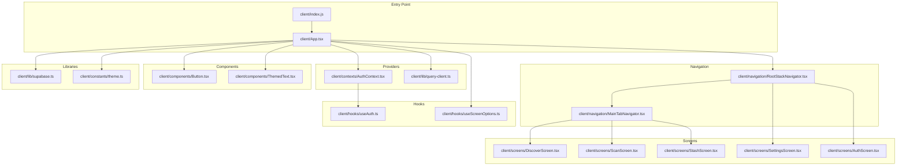
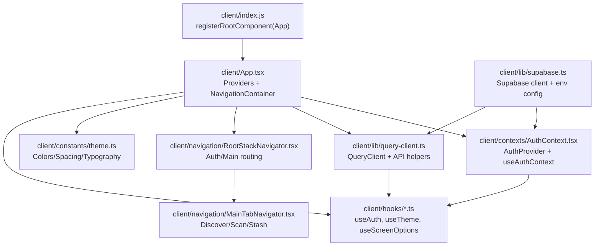
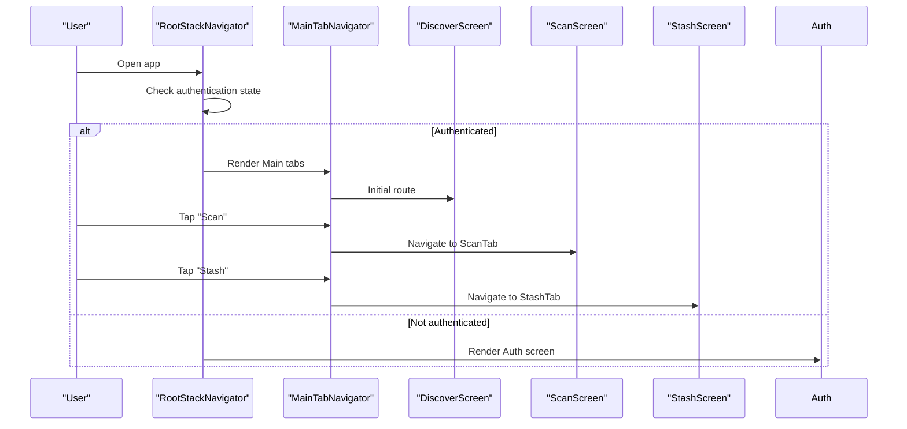
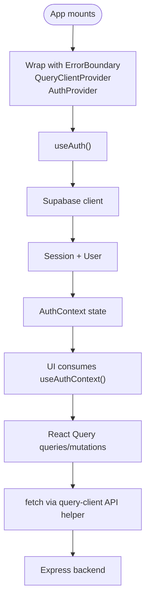
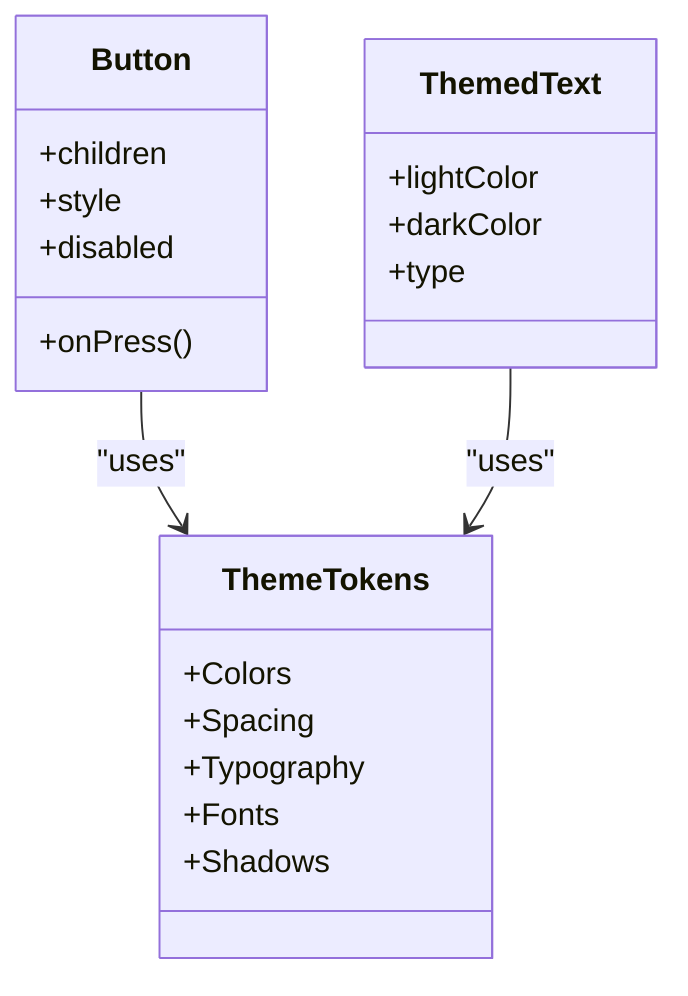
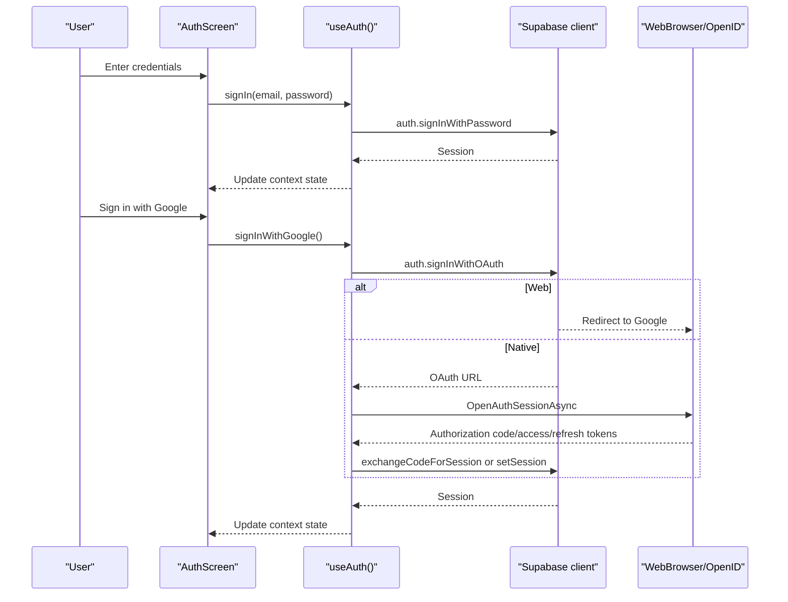
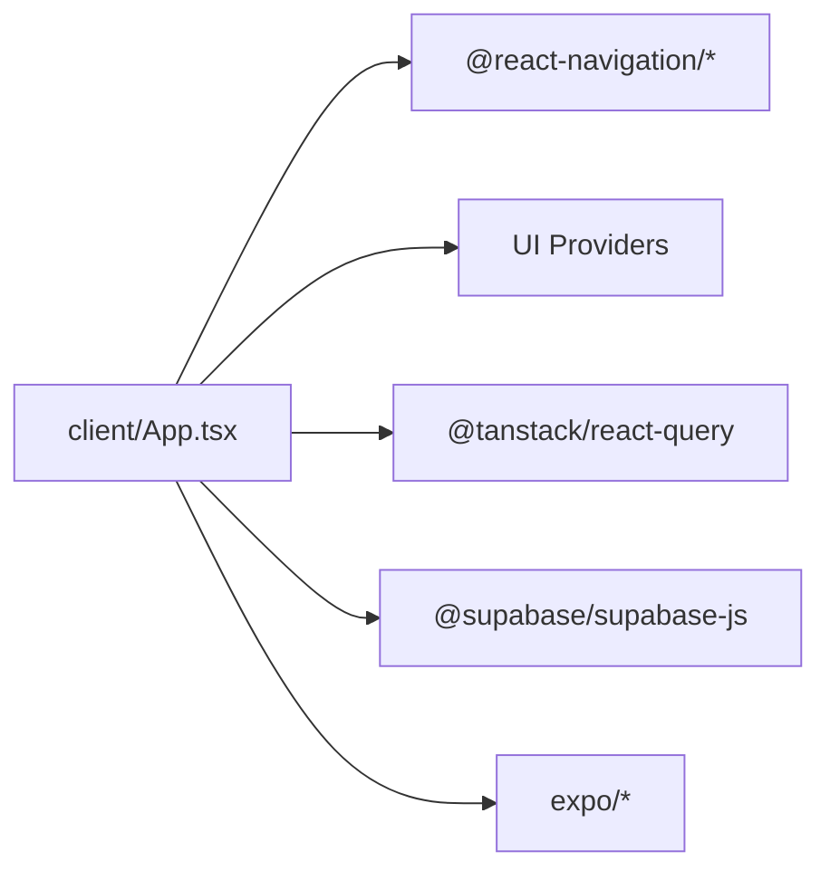

# Frontend Application

<cite>
**Referenced Files in This Document**
- [App.tsx](file://client/App.tsx)
- [index.js](file://client/index.js)
- [package.json](file://package.json)
- [app.json](file://app.json)
- [AuthContext.tsx](file://client/contexts/AuthContext.tsx)
- [RootStackNavigator.tsx](file://client/navigation/RootStackNavigator.tsx)
- [MainTabNavigator.tsx](file://client/navigation/MainTabNavigator.tsx)
- [query-client.ts](file://client/lib/query-client.ts)
- [theme.ts](file://client/constants/theme.ts)
- [useAuth.ts](file://client/hooks/useAuth.ts)
- [Button.tsx](file://client/components/Button.tsx)
- [ThemedText.tsx](file://client/components/ThemedText.tsx)
- [HomeScreen.tsx](file://client/screens/HomeScreen.tsx)
- [supabase.ts](file://client/lib/supabase.ts)
- [useScreenOptions.ts](file://client/hooks/useScreenOptions.ts)
</cite>

## Table of Contents
1. [Introduction](#introduction)
2. [Project Structure](#project-structure)
3. [Core Components](#core-components)
4. [Architecture Overview](#architecture-overview)
5. [Detailed Component Analysis](#detailed-component-analysis)
6. [Dependency Analysis](#dependency-analysis)
7. [Performance Considerations](#performance-considerations)
8. [Troubleshooting Guide](#troubleshooting-guide)
9. [Conclusion](#conclusion)
10. [Appendices](#appendices)

## Introduction
This document provides comprehensive frontend documentation for the React Native application layer. It explains the project structure, navigation system, state management, UI component library, theming, authentication with Supabase, and development workflow using Expo CLI. Practical examples of navigation patterns, state management, and component usage are included via file references and diagrams.

## Project Structure
The frontend is organized into cohesive layers:
- Entry point and providers: App initialization, providers, and global theme setup
- Navigation: Root stack navigator and nested tab navigator
- Screens: Feature-specific views (Discover, Scan, Stash, Settings, Auth, etc.)
- Components: Reusable UI primitives (Button, ThemedText, ThemedView, etc.)
- Hooks: Theme, auth, notifications, and screen options
- State management: React Context for auth and React Query for data fetching
- Libraries: Supabase client and query utilities

**Diagram sources**
- [index.js](file://client/index.js#L1-L6)
- [App.tsx](file://client/App.tsx#L1-L67)
- [AuthContext.tsx](file://client/contexts/AuthContext.tsx#L1-L31)
- [query-client.ts](file://client/lib/query-client.ts#L1-L80)
- [RootStackNavigator.tsx](file://client/navigation/RootStackNavigator.tsx#L1-L133)
- [MainTabNavigator.tsx](file://client/navigation/MainTabNavigator.tsx#L1-L192)
- [Button.tsx](file://client/components/Button.tsx#L1-L93)
- [ThemedText.tsx](file://client/components/ThemedText.tsx#L1-L62)
- [useAuth.ts](file://client/hooks/useAuth.ts#L1-L151)
- [useScreenOptions.ts](file://client/hooks/useScreenOptions.ts#L1-L42)
- [supabase.ts](file://client/lib/supabase.ts#L1-L39)
- [theme.ts](file://client/constants/theme.ts#L1-L167)

**Section sources**
- [index.js](file://client/index.js#L1-L6)
- [App.tsx](file://client/App.tsx#L1-L67)
- [package.json](file://package.json#L1-L95)
- [app.json](file://app.json#L1-L52)

## Core Components
- App bootstrap and providers:
  - Registers the root component and wraps the app with ErrorBoundary, React Query provider, Auth provider, and NavigationContainer
  - Applies a custom dark theme merged with a custom palette
- Navigation:
  - Root stack determines whether to render Auth or Main tabs based on authentication state
  - Main tabs include Discover, Scan (with a prominent floating tab icon), and Stash
- State management:
  - AuthContext provides session, user, loading, and auth actions
  - React Query manages server state with a centralized query client and API helpers
- UI primitives:
  - Button with animated press feedback and themed colors
  - ThemedText supporting typography scales and light/dark overrides
- Theming:
  - Centralized color tokens, spacing, typography, fonts, and shadows
- Authentication:
  - Supabase integration with password and Google OAuth flows, session persistence, and redirect handling

**Section sources**
- [App.tsx](file://client/App.tsx#L1-L67)
- [AuthContext.tsx](file://client/contexts/AuthContext.tsx#L1-L31)
- [RootStackNavigator.tsx](file://client/navigation/RootStackNavigator.tsx#L1-L133)
- [MainTabNavigator.tsx](file://client/navigation/MainTabNavigator.tsx#L1-L192)
- [query-client.ts](file://client/lib/query-client.ts#L1-L80)
- [Button.tsx](file://client/components/Button.tsx#L1-L93)
- [ThemedText.tsx](file://client/components/ThemedText.tsx#L1-L62)
- [theme.ts](file://client/constants/theme.ts#L1-L167)
- [supabase.ts](file://client/lib/supabase.ts#L1-L39)

## Architecture Overview
The frontend follows a layered architecture:
- Entry point registers the app and initializes providers
- Navigation orchestrates screen transitions and parameter passing
- Components consume theme and context hooks
- Data fetching uses React Query with a shared query client
- Authentication integrates with Supabase for session management

**Diagram sources**
- [index.js](file://client/index.js#L1-L6)
- [App.tsx](file://client/App.tsx#L1-L67)
- [RootStackNavigator.tsx](file://client/navigation/RootStackNavigator.tsx#L1-L133)
- [MainTabNavigator.tsx](file://client/navigation/MainTabNavigator.tsx#L1-L192)
- [AuthContext.tsx](file://client/contexts/AuthContext.tsx#L1-L31)
- [query-client.ts](file://client/lib/query-client.ts#L1-L80)
- [supabase.ts](file://client/lib/supabase.ts#L1-L39)
- [theme.ts](file://client/constants/theme.ts#L1-L167)

## Detailed Component Analysis

### Navigation System
- Root stack navigator:
  - Conditionally renders Auth or Main tab navigator based on authentication state
  - Defines typed parameters for modals and deep links (e.g., ItemDetails, Analysis, Article)
  - Applies global screen options and dark theme background
- Main tab navigator:
  - Bottom tabs with custom tab icons and a floating Scan tab
  - Header displays user name and a badge indicating scan count fetched via React Query
  - Settings navigation from header right action
- Parameter passing:
  - Strongly typed params via RootStackParamList and MainTabParamList
  - Example: navigate to ItemDetails with an itemId, or open Analysis as a modal with image URIs

**Diagram sources**
- [RootStackNavigator.tsx](file://client/navigation/RootStackNavigator.tsx#L1-L133)
- [MainTabNavigator.tsx](file://client/navigation/MainTabNavigator.tsx#L1-L192)

**Section sources**
- [RootStackNavigator.tsx](file://client/navigation/RootStackNavigator.tsx#L1-L133)
- [MainTabNavigator.tsx](file://client/navigation/MainTabNavigator.tsx#L1-L192)

### State Management with React Context and React Query
- Auth state:
  - AuthProvider exposes session, user, loading, and auth actions (signIn, signUp, signOut, signInWithGoogle)
  - useAuth encapsulates Supabase session retrieval, auth state change subscriptions, and OAuth flows
- Data fetching:
  - query-client defines a shared QueryClient with default behaviors and an API helper for server requests
  - getQueryFn centralizes error handling and unauthorized behavior
  - MainTabNavigator demonstrates fetching a scan count via React Query and rendering a badge

**Diagram sources**
- [App.tsx](file://client/App.tsx#L1-L67)
- [AuthContext.tsx](file://client/contexts/AuthContext.tsx#L1-L31)
- [useAuth.ts](file://client/hooks/useAuth.ts#L1-L151)
- [query-client.ts](file://client/lib/query-client.ts#L1-L80)
- [supabase.ts](file://client/lib/supabase.ts#L1-L39)

**Section sources**
- [AuthContext.tsx](file://client/contexts/AuthContext.tsx#L1-L31)
- [useAuth.ts](file://client/hooks/useAuth.ts#L1-L151)
- [query-client.ts](file://client/lib/query-client.ts#L1-L80)
- [MainTabNavigator.tsx](file://client/navigation/MainTabNavigator.tsx#L1-L192)

### UI Component Library and Theme System
- Button:
  - Animated press feedback using react-native-reanimated
  - Themed background and text color from current theme
- ThemedText:
  - Supports typography scales (h1–h4, body, small, link)
  - Respects light/dark overrides and theme tokens
- Theme tokens:
  - Colors: light/dark palettes for text, backgrounds, surfaces, borders, and accents
  - Spacing: consistent spacing scale and component heights
  - Typography: font sizes and weights for headings and body text
  - Fonts: platform-aware font stacks (iOS, Android, Web)
  - Shadows: elevation and shadow configurations

**Diagram sources**
- [Button.tsx](file://client/components/Button.tsx#L1-L93)
- [ThemedText.tsx](file://client/components/ThemedText.tsx#L1-L62)
- [theme.ts](file://client/constants/theme.ts#L1-L167)

**Section sources**
- [Button.tsx](file://client/components/Button.tsx#L1-L93)
- [ThemedText.tsx](file://client/components/ThemedText.tsx#L1-L62)
- [theme.ts](file://client/constants/theme.ts#L1-L167)

### Authentication Flow with Supabase
- Initialization:
  - Supabase client creation guarded by environment variables
  - Redirect URL resolution for web vs native platforms
- Auth actions:
  - Password sign-in/sign-up
  - Google OAuth with browser session handling and code/token exchange
- Session persistence:
  - Auto-refresh and persisted sessions
  - Auth state subscription updates UI reactively

**Diagram sources**
- [useAuth.ts](file://client/hooks/useAuth.ts#L1-L151)
- [supabase.ts](file://client/lib/supabase.ts#L1-L39)

**Section sources**
- [useAuth.ts](file://client/hooks/useAuth.ts#L1-L151)
- [supabase.ts](file://client/lib/supabase.ts#L1-L39)

### Responsive Design Considerations
- Safe areas and header/tab bar heights are considered in screen layouts
- Platform-specific header blur and background styles
- Dynamic font stacks tailored per platform and web
- Content container padding adapts to device insets and navigation elements

**Section sources**
- [HomeScreen.tsx](file://client/screens/HomeScreen.tsx#L1-L29)
- [useScreenOptions.ts](file://client/hooks/useScreenOptions.ts#L1-L42)
- [theme.ts](file://client/constants/theme.ts#L1-L167)

## Dependency Analysis
Key runtime dependencies and their roles:
- Navigation: @react-navigation/native, @react-navigation/native-stack, @react-navigation/bottom-tabs
- UI: react-native-safe-area-context, react-native-gesture-handler, react-native-keyboard-controller, expo-blur
- State: @tanstack/react-query, react-native-reanimated
- Auth: @supabase/supabase-js, expo-web-browser, expo-linking
- Platform: expo, react-native, react-native-screens, expo-splash-screen

**Diagram sources**
- [App.tsx](file://client/App.tsx#L1-L67)
- [package.json](file://package.json#L24-L76)

**Section sources**
- [package.json](file://package.json#L1-L95)

## Performance Considerations
- React Query defaults:
  - Infinite cache age (staleTime: Infinity), disabled window focus refetch, and no retries for queries and mutations
  - Credentials include for session-aware endpoints
- Navigation:
  - Full-screen gestures disabled when liquid glass is available; otherwise enabled
  - Transparent headers with blur effect for visual performance
- Animations:
  - Reanimated animations are hardware-accelerated and optimized for press feedback

**Section sources**
- [query-client.ts](file://client/lib/query-client.ts#L66-L80)
- [useScreenOptions.ts](file://client/hooks/useScreenOptions.ts#L34-L40)
- [Button.tsx](file://client/components/Button.tsx#L21-L27)

## Troubleshooting Guide
- Supabase not configured:
  - Symptom: Warning logged and auth actions throw errors
  - Resolution: Set EXPO_PUBLIC_SUPABASE_URL and EXPO_PUBLIC_SUPABASE_ANON_KEY
- API base URL missing:
  - Symptom: Error thrown when constructing API URL
  - Resolution: Set EXPO_PUBLIC_DOMAIN to the backend origin
- Navigation issues:
  - Verify typed params match navigation calls
  - Confirm Auth/Main routing conditions align with authentication state
- Theme inconsistencies:
  - Ensure useTheme is used inside ThemeProvider and tokens are applied consistently

**Section sources**
- [supabase.ts](file://client/lib/supabase.ts#L20-L24)
- [supabase.ts](file://client/lib/supabase.ts#L6-L8)
- [query-client.ts](file://client/lib/query-client.ts#L7-L17)
- [RootStackNavigator.tsx](file://client/navigation/RootStackNavigator.tsx#L38-L42)

## Conclusion
The frontend leverages a clean separation of concerns: providers manage global state, navigation orchestrates user journeys, components encapsulate UI logic, and Supabase handles authentication. React Query streamlines data fetching with centralized configuration. The theme system ensures consistent visuals across platforms, while navigation and parameter typing improve reliability. The documented patterns enable scalable development and maintenance.

## Appendices

### Development Workflow with Expo CLI
- Local development:
  - Run the dev server and Expo client locally
  - Concurrently start the backend server during development
- Static builds:
  - Build static assets and run the production server
- Platform targets:
  - Run on Android or iOS devices/emulators via Expo CLI commands

**Section sources**
- [package.json](file://package.json#L5-L22)

### Build and Deployment Strategies
- Expo configuration:
  - App metadata, orientation, scheme, icons, splash screen, and platform-specific settings
- Environment variables:
  - Supabase URLs and domain for API base URL
- Web support:
  - Single-page web output and favicon configuration

**Section sources**
- [app.json](file://app.json#L1-L52)
- [supabase.ts](file://client/lib/supabase.ts#L6-L7)
- [query-client.ts](file://client/lib/query-client.ts#L7-L17)