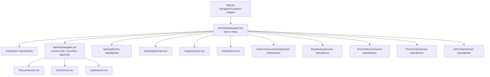
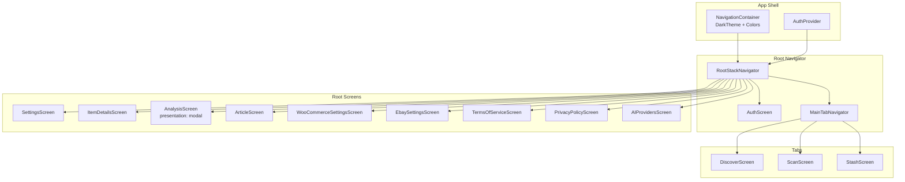
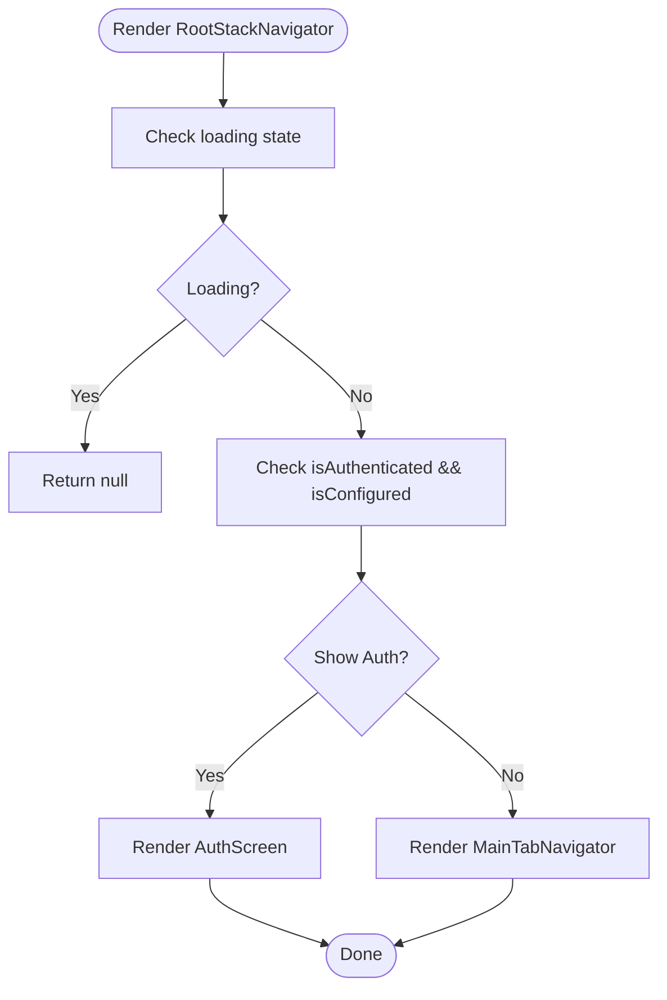
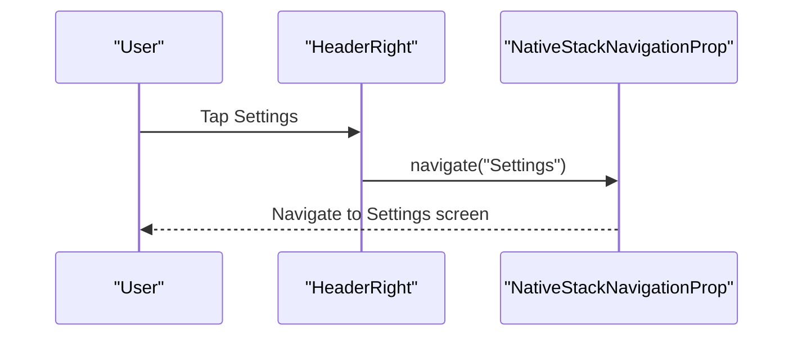
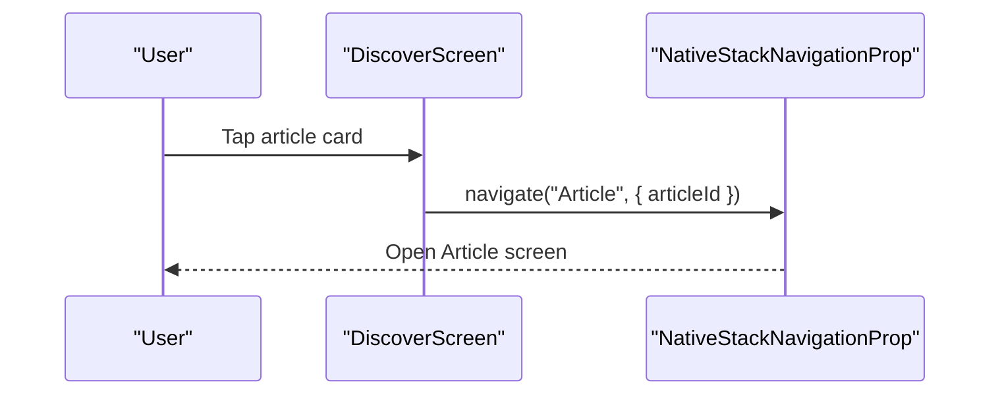
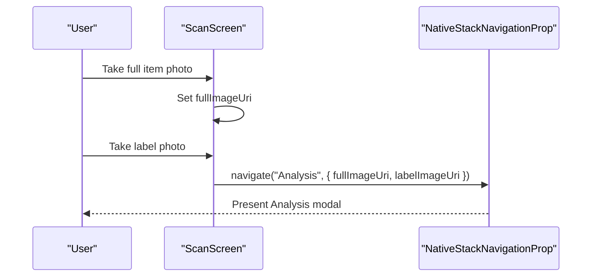
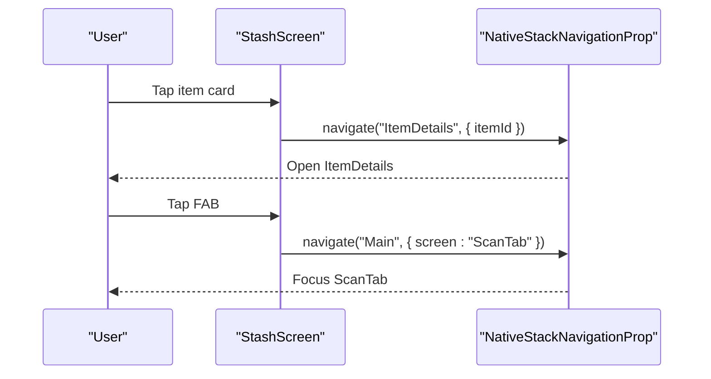
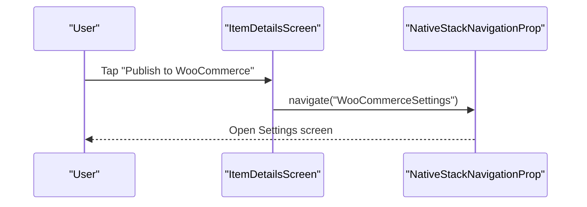
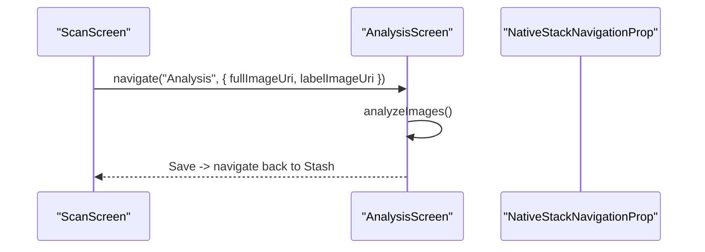
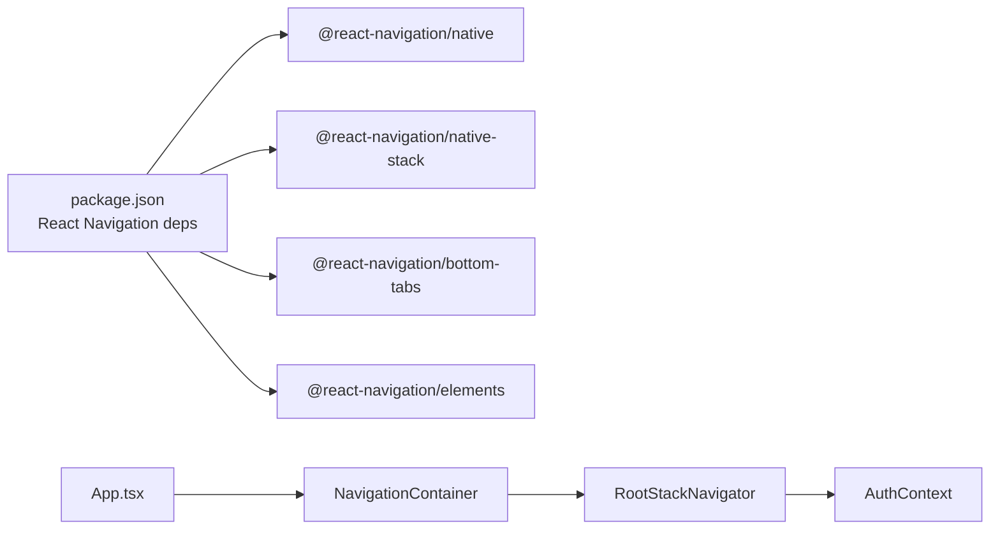

# Navigation System

<cite>
**Referenced Files in This Document**
- [App.tsx](file://client/App.tsx)
- [RootStackNavigator.tsx](file://client/navigation/RootStackNavigator.tsx)
- [MainTabNavigator.tsx](file://client/navigation/MainTabNavigator.tsx)
- [HomeStackNavigator.tsx](file://client/navigation/HomeStackNavigator.tsx)
- [ProfileStackNavigator.tsx](file://client/navigation/ProfileStackNavigator.tsx)
- [MainTabNavigator26.tsx](file://client/navigation/MainTabNavigator26.tsx)
- [useScreenOptions.ts](file://client/hooks/useScreenOptions.ts)
- [AuthContext.tsx](file://client/contexts/AuthContext.tsx)
- [DiscoverScreen.tsx](file://client/screens/DiscoverScreen.tsx)
- [ScanScreen.tsx](file://client/screens/ScanScreen.tsx)
- [StashScreen.tsx](file://client/screens/StashScreen.tsx)
- [ItemDetailsScreen.tsx](file://client/screens/ItemDetailsScreen.tsx)
- [AnalysisScreen.tsx](file://client/screens/AnalysisScreen.tsx)
- [ArticleScreen.tsx](file://client/screens/ArticleScreen.tsx)
- [package.json](file://package.json)
</cite>

## Table of Contents
1. [Introduction](#introduction)
2. [Project Structure](#project-structure)
3. [Core Components](#core-components)
4. [Architecture Overview](#architecture-overview)
5. [Detailed Component Analysis](#detailed-component-analysis)
6. [Dependency Analysis](#dependency-analysis)
7. [Performance Considerations](#performance-considerations)
8. [Troubleshooting Guide](#troubleshooting-guide)
9. [Conclusion](#conclusion)

## Introduction
This document describes the React Navigation implementation for the application. It explains the hierarchical navigation structure, including the RootStackNavigator, MainTabNavigator, and specialized stack navigators for different app sections. It covers screen routing patterns, parameter passing between screens, navigation state management, tab navigation behaviors, stack navigation behaviors, and deep linking configuration. Practical examples illustrate navigation actions, screen transitions, and conditional navigation flows. It also documents navigation ref usage, screen options configuration, and custom header implementations, and addresses performance optimization and memory management considerations.

## Project Structure
The navigation system is organized around a single entry point that wires up the global navigation container and the root navigator. The root navigator conditionally renders either an authentication screen or the main tab-based interface. Tabs host stacks for Discover, Scan, and Stash, while additional standalone screens are available via the root navigator.

**Diagram sources**
- [App.tsx](file://client/App.tsx#L31-L59)
- [RootStackNavigator.tsx](file://client/navigation/RootStackNavigator.tsx#L34-L132)
- [MainTabNavigator.tsx](file://client/navigation/MainTabNavigator.tsx#L64-L144)

**Section sources**
- [App.tsx](file://client/App.tsx#L31-L59)
- [RootStackNavigator.tsx](file://client/navigation/RootStackNavigator.tsx#L34-L132)
- [MainTabNavigator.tsx](file://client/navigation/MainTabNavigator.tsx#L64-L144)

## Core Components
- RootStackNavigator: Defines top-level screens and conditional rendering based on authentication state. Declares typed parameters for modal and deep-linked screens.
- MainTabNavigator: Bottom tab bar hosting Discover, Scan, and Stash tabs with custom header content and tab styling.
- Specialized Stack Navigators: HomeStackNavigator and ProfileStackNavigator encapsulate simple stacks for home and profile screens.
- Screen Options Hook: Centralized configuration for native stack appearance and gestures.
- Auth Context: Provides authentication state used to decide whether to show AuthScreen or MainTabNavigator.

Key responsibilities:
- Root level routing and conditional navigation based on authentication and configuration state.
- Tab-level navigation and custom header content with dynamic counts and navigation actions.
- Parameterized navigation between screens (e.g., passing itemId, articleId, image URIs).
- Unified screen options for consistent header and content styling.

**Section sources**
- [RootStackNavigator.tsx](file://client/navigation/RootStackNavigator.tsx#L18-L30)
- [MainTabNavigator.tsx](file://client/navigation/MainTabNavigator.tsx#L18-L24)
- [HomeStackNavigator.tsx](file://client/navigation/HomeStackNavigator.tsx#L7-L27)
- [ProfileStackNavigator.tsx](file://client/navigation/ProfileStackNavigator.tsx#L7-L27)
- [useScreenOptions.ts](file://client/hooks/useScreenOptions.ts#L11-L41)
- [AuthContext.tsx](file://client/contexts/AuthContext.tsx#L19-L30)

## Architecture Overview
The navigation architecture follows a layered pattern:
- App.tsx wraps the app with providers and sets the NavigationContainer theme.
- RootStackNavigator decides between AuthScreen and MainTabNavigator based on authentication and configuration.
- MainTabNavigator hosts three bottom tabs, each exposing a dedicated screen.
- Additional root-level screens are available as modals or overlays (e.g., Analysis modal, Settings, ItemDetails, Articles, and legal pages).

**Diagram sources**
- [App.tsx](file://client/App.tsx#L31-L59)
- [RootStackNavigator.tsx](file://client/navigation/RootStackNavigator.tsx#L34-L132)
- [MainTabNavigator.tsx](file://client/navigation/MainTabNavigator.tsx#L64-L144)

## Detailed Component Analysis

### RootStackNavigator
- Purpose: Top-level router controlling conditional rendering and global screens.
- Conditional rendering: Shows AuthScreen when not authenticated and configured; otherwise shows MainTabNavigator.
- Global screens:
  - Settings, ItemDetails, Analysis (modal), Article, and legal/provider screens.
- Parameterized routes:
  - ItemDetails expects an itemId.
  - Analysis expects fullImageUri and labelImageUri.
  - Article expects articleId.
- Screen options: Unified contentStyle and header styling via useScreenOptions hook.

**Diagram sources**
- [RootStackNavigator.tsx](file://client/navigation/RootStackNavigator.tsx#L34-L132)

**Section sources**
- [RootStackNavigator.tsx](file://client/navigation/RootStackNavigator.tsx#L18-L30)
- [RootStackNavigator.tsx](file://client/navigation/RootStackNavigator.tsx#L34-L132)

### MainTabNavigator
- Purpose: Hosts Discover, Scan, and Stash tabs with custom header content and tab styling.
- Custom header:
  - Left: user display name and “Hunting” label.
  - Right: live scan count badge and Settings button.
- Tab styling: Active/inactive colors, background blur on iOS, custom layout.
- Scan tab special behavior: Floating camera icon that acts as a central action.

**Diagram sources**
- [MainTabNavigator.tsx](file://client/navigation/MainTabNavigator.tsx#L38-L62)
- [MainTabNavigator.tsx](file://client/navigation/MainTabNavigator.tsx#L64-L144)

**Section sources**
- [MainTabNavigator.tsx](file://client/navigation/MainTabNavigator.tsx#L26-L62)
- [MainTabNavigator.tsx](file://client/navigation/MainTabNavigator.tsx#L64-L144)

### DiscoverScreen
- Purpose: Browse articles and navigate to Article screen with articleId.
- Navigation pattern: Uses useNavigation to navigate to Article with typed parameter.
- Data fetching: Uses React Query to fetch articles and supports refresh.

**Diagram sources**
- [DiscoverScreen.tsx](file://client/screens/DiscoverScreen.tsx#L88-L102)

**Section sources**
- [DiscoverScreen.tsx](file://client/screens/DiscoverScreen.tsx#L88-L102)

### ScanScreen
- Purpose: Two-step scanning flow capturing full item image and label close-up, then navigating to Analysis modal with both URIs.
- Navigation pattern: On second step, navigates to Analysis with fullImageUri and labelImageUri.
- Back navigation: Uses goBack to return to previous screen.

**Diagram sources**
- [ScanScreen.tsx](file://client/screens/ScanScreen.tsx#L26-L62)
- [ScanScreen.tsx](file://client/screens/ScanScreen.tsx#L64-L87)

**Section sources**
- [ScanScreen.tsx](file://client/screens/ScanScreen.tsx#L17-L93)

### StashScreen
- Purpose: Browse stash items and navigate to ItemDetails with itemId.
- Navigation pattern: Uses navigate with itemId parameter.
- Deep link navigation: Navigates to Main tab’s ScanTab via nested navigation.

**Diagram sources**
- [StashScreen.tsx](file://client/screens/StashScreen.tsx#L93-L108)

**Section sources**
- [StashScreen.tsx](file://client/screens/StashScreen.tsx#L93-L108)

### ItemDetailsScreen
- Purpose: Display item details and manage publishing to marketplaces.
- Parameter retrieval: Uses useRoute to extract itemId from route params.
- Navigation actions: Navigates to Settings or Analysis; handles deletion and sharing.

**Diagram sources**
- [ItemDetailsScreen.tsx](file://client/screens/ItemDetailsScreen.tsx#L85-L100)
- [ItemDetailsScreen.tsx](file://client/screens/ItemDetailsScreen.tsx#L148-L193)

**Section sources**
- [ItemDetailsScreen.tsx](file://client/screens/ItemDetailsScreen.tsx#L83-L100)

### AnalysisScreen
- Purpose: Modal screen displaying AI analysis results and allowing edits or retries.
- Parameter retrieval: Uses useRoute to access fullImageUri and labelImageUri.
- Lifecycle: Initiates analysis on mount; supports retry with feedback.

**Diagram sources**
- [AnalysisScreen.tsx](file://client/screens/AnalysisScreen.tsx#L78-L143)

**Section sources**
- [AnalysisScreen.tsx](file://client/screens/AnalysisScreen.tsx#L78-L143)

### ArticleScreen
- Purpose: Display article content fetched by articleId.
- Parameter retrieval: Uses useRoute to extract articleId.
- Behavior: Loads content via React Query and displays structured content.

**Section sources**
- [ArticleScreen.tsx](file://client/screens/ArticleScreen.tsx#L26-L34)

### Specialized Stack Navigators
- HomeStackNavigator: Minimal stack with a custom header title.
- ProfileStackNavigator: Minimal stack with a standard title.

**Section sources**
- [HomeStackNavigator.tsx](file://client/navigation/HomeStackNavigator.tsx#L13-L27)
- [ProfileStackNavigator.tsx](file://client/navigation/ProfileStackNavigator.tsx#L13-L27)

### Alternative Tab Navigator (MainTabNavigator26)
- Purpose: Demonstrates an alternate tab setup using unstable native bottom tab navigator with SF Symbols.
- Behavior: Hosts HomeStackNavigator and ProfileStackNavigator as tab screens.

**Section sources**
- [MainTabNavigator26.tsx](file://client/navigation/MainTabNavigator26.tsx#L14-L50)

## Dependency Analysis
- Navigation libraries:
  - @react-navigation/native, @react-navigation/native-stack, @react-navigation/bottom-tabs, @react-navigation/elements.
- Theme and styling:
  - Custom theme applied via NavigationContainer and centralized screen options.
- Authentication:
  - AuthContext controls conditional rendering of AuthScreen vs MainTabNavigator.
- Deep linking:
  - Expo Linking is present in dependencies; however, no explicit linking configuration is defined in the provided files.

**Diagram sources**
- [package.json](file://package.json#L24-L75)
- [App.tsx](file://client/App.tsx#L31-L59)
- [RootStackNavigator.tsx](file://client/navigation/RootStackNavigator.tsx#L34-L132)
- [AuthContext.tsx](file://client/contexts/AuthContext.tsx#L19-L30)

**Section sources**
- [package.json](file://package.json#L24-L75)
- [App.tsx](file://client/App.tsx#L31-L59)

## Performance Considerations
- Screen options optimization:
  - useScreenOptions centralizes header and content styling, reducing per-screen duplication and ensuring consistent performance.
  - Gesture and full-screen options are configured once and reused across screens.
- Conditional rendering:
  - RootStackNavigator defers rendering until authentication state is resolved, preventing unnecessary work during loading.
- Modal presentation:
  - Analysis uses a modal presentation, which can improve perceived performance by isolating heavy content.
- Memory management:
  - Prefer lazy screen components and avoid heavy initialization in constructors.
  - Use React Query cache effectively; invalidate queries after mutations to prevent stale data.
  - Avoid retaining large images in memory beyond their lifecycle; pass URIs instead of base64 where possible.
- Tab navigation:
  - Keep tab screens lightweight; defer heavy operations to background threads or lazy-loaded modules.
- Gesture handling:
  - Ensure gestureEnabled and fullScreenGestureEnabled are tuned to device capabilities to avoid jank.

[No sources needed since this section provides general guidance]

## Troubleshooting Guide
- Authentication-driven navigation not working:
  - Verify AuthContext exposes isAuthenticated and isConfigured correctly and that RootStackNavigator reads them.
- Parameters not received:
  - Ensure route param types match RootStackParamList and that useRoute is used to extract parameters.
- Header customization issues:
  - Confirm useScreenOptions returns expected header styles and that screen options are applied at the navigator level.
- Modal navigation problems:
  - Verify the modal presentation option is set on the target screen and that navigation.navigate is called with correct parameters.
- Tab header content not updating:
  - Check that the headerLeft/headerRight components re-render based on query updates and navigation prop changes.

**Section sources**
- [AuthContext.tsx](file://client/contexts/AuthContext.tsx#L19-L30)
- [RootStackNavigator.tsx](file://client/navigation/RootStackNavigator.tsx#L18-L30)
- [useScreenOptions.ts](file://client/hooks/useScreenOptions.ts#L11-L41)
- [MainTabNavigator.tsx](file://client/navigation/MainTabNavigator.tsx#L64-L144)

## Conclusion
The navigation system is structured around a clean hierarchy: a global NavigationContainer, a root navigator that conditionally switches between authentication and main views, and a bottom-tabbed interface for primary sections. Parameterized navigation enables robust inter-screen communication, while centralized screen options ensure consistent styling and gestures. The implementation supports modal presentations for specialized flows and provides clear patterns for deep linking and nested navigation. Following the best practices outlined here will help maintain performance and reliability as the app evolves.