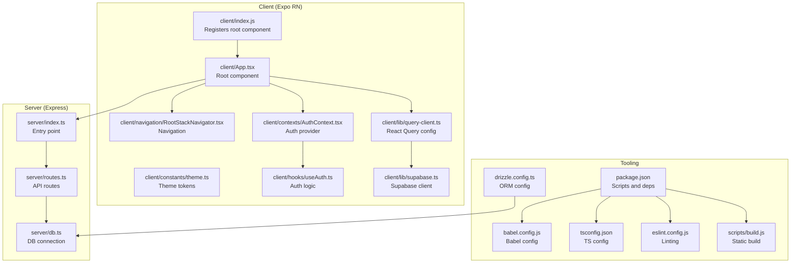
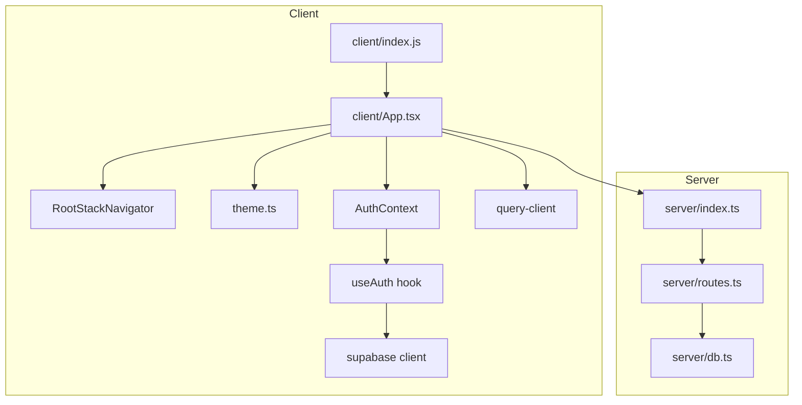
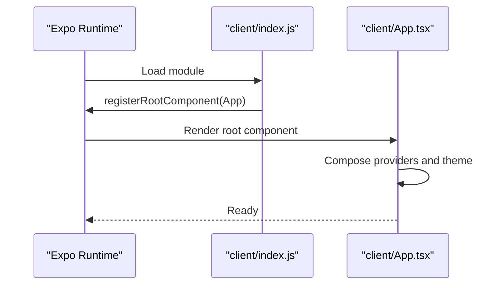
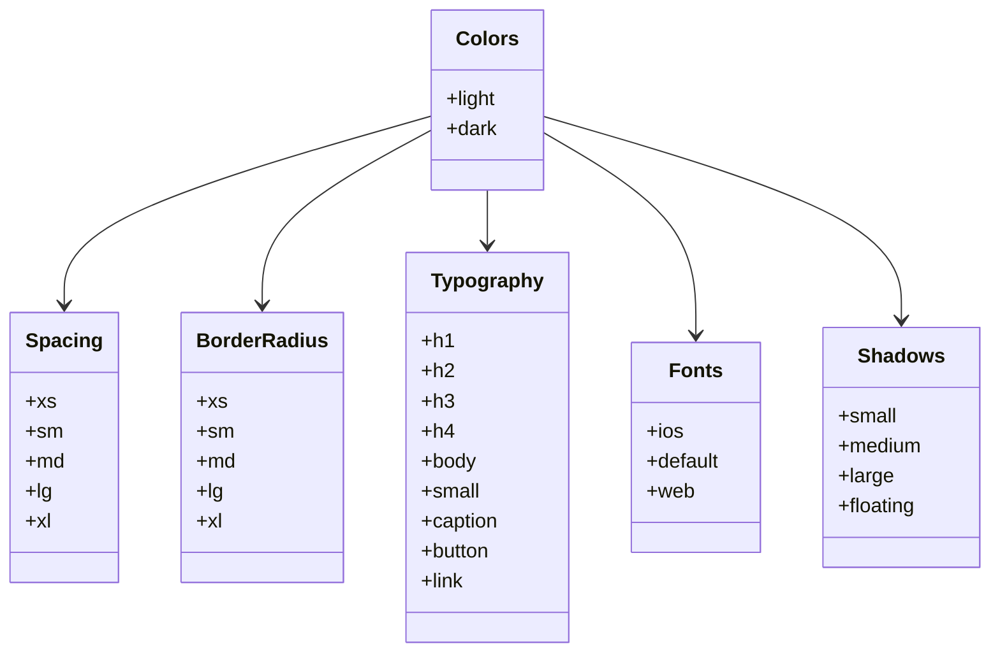
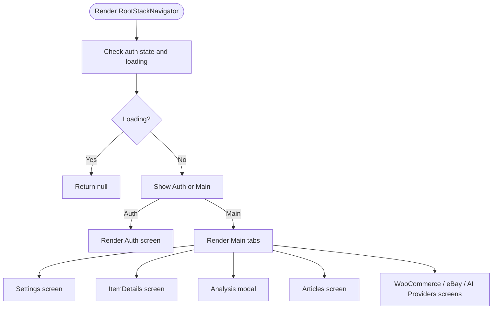
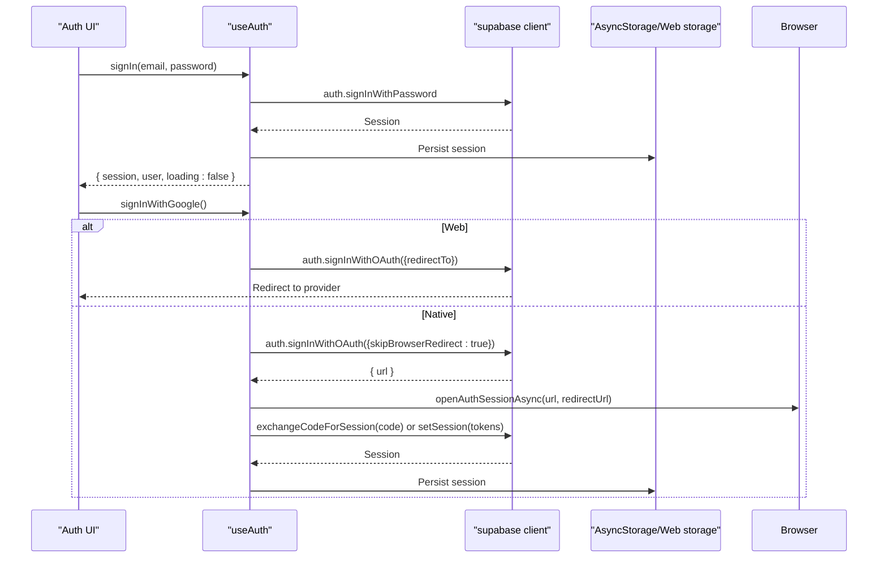
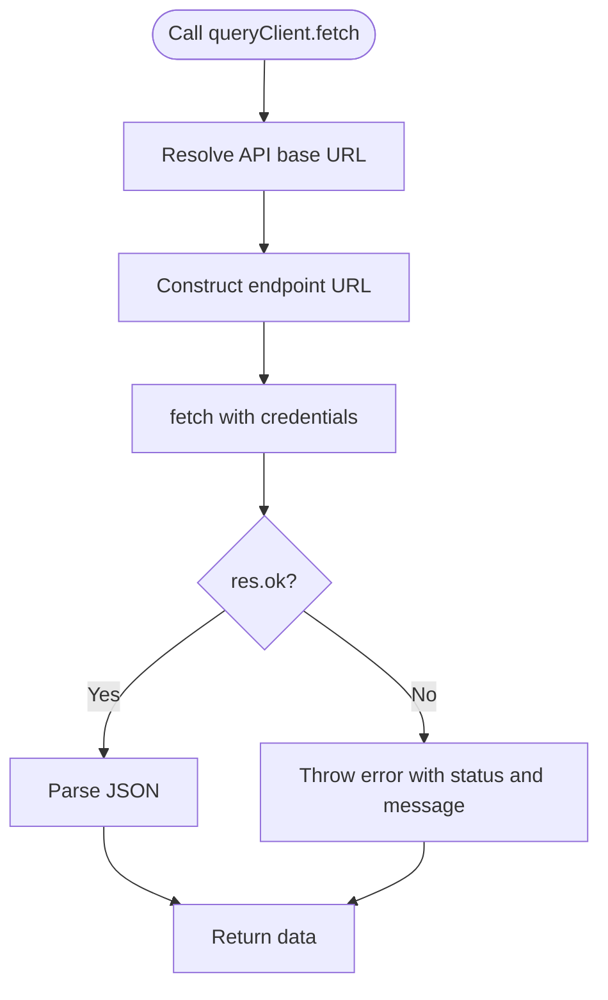
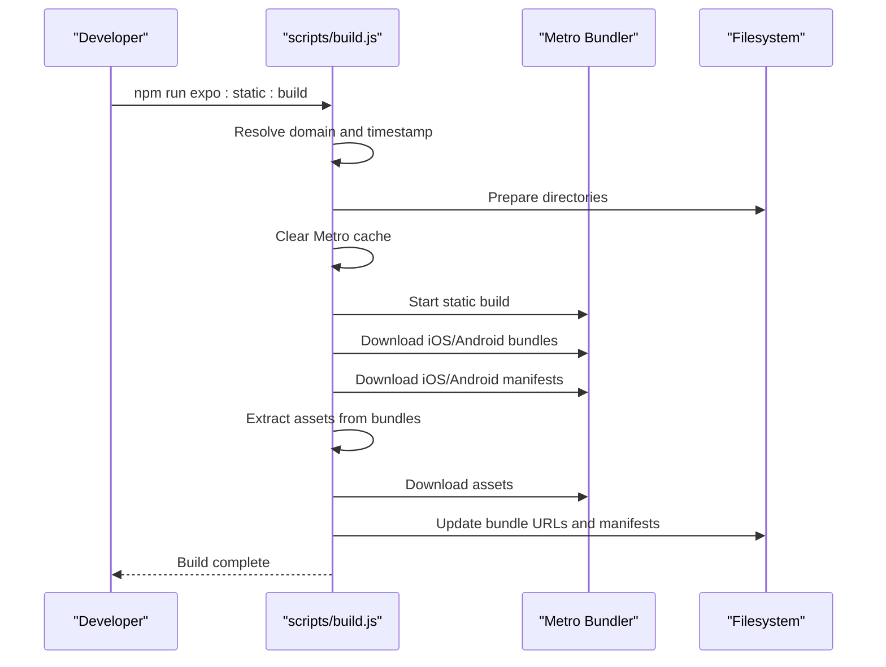
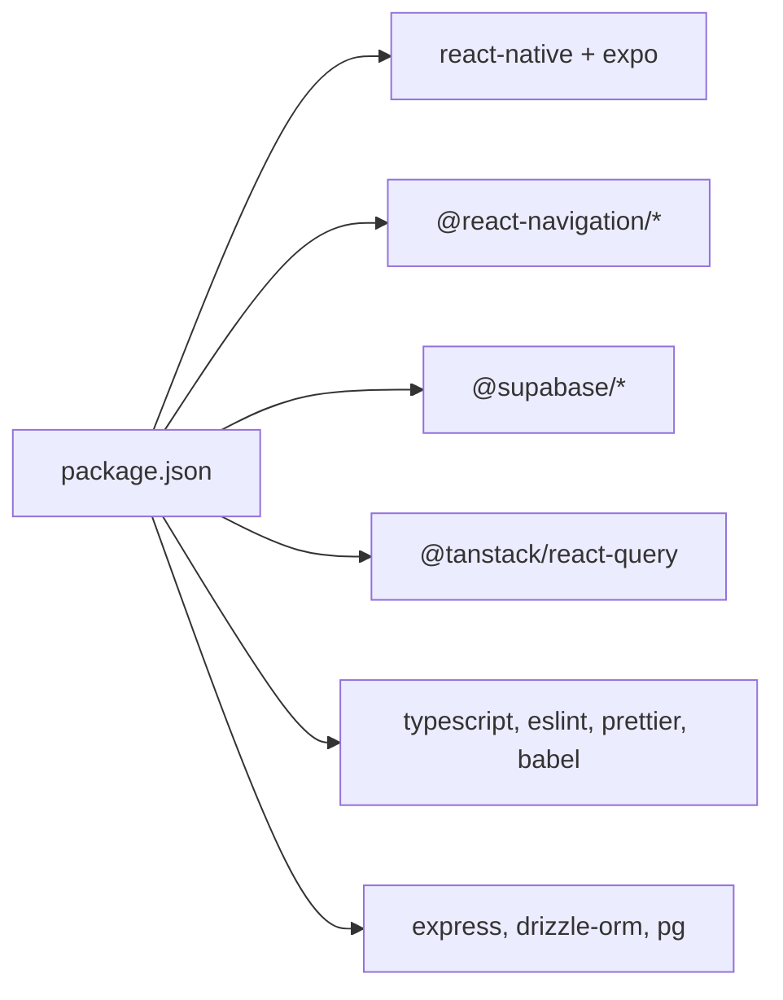

# React Native Setup

<cite>
**Referenced Files in This Document**
- [package.json](file://package.json)
- [app.json](file://app.json)
- [babel.config.js](file://babel.config.js)
- [tsconfig.json](file://tsconfig.json)
- [client/App.tsx](file://client/App.tsx)
- [client/index.js](file://client/index.js)
- [client/constants/theme.ts](file://client/constants/theme.ts)
- [client/navigation/RootStackNavigator.tsx](file://client/navigation/RootStackNavigator.tsx)
- [client/contexts/AuthContext.tsx](file://client/contexts/AuthContext.tsx)
- [client/hooks/useTheme.ts](file://client/hooks/useTheme.ts)
- [client/lib/query-client.ts](file://client/lib/query-client.ts)
- [client/hooks/useAuth.ts](file://client/hooks/useAuth.ts)
- [client/lib/supabase.ts](file://client/lib/supabase.ts)
- [scripts/build.js](file://scripts/build.js)
- [eslint.config.js](file://eslint.config.js)
- [ENVIRONMENT.md](file://ENVIRONMENT.md)
- [drizzle.config.ts](file://drizzle.config.ts)
- [scripts/run-migration.js](file://scripts/run-migration.js)
</cite>

## Table of Contents
1. [Introduction](#introduction)
2. [Project Structure](#project-structure)
3. [Core Components](#core-components)
4. [Architecture Overview](#architecture-overview)
5. [Detailed Component Analysis](#detailed-component-analysis)
6. [Dependency Analysis](#dependency-analysis)
7. [Performance Considerations](#performance-considerations)
8. [Troubleshooting Guide](#troubleshooting-guide)
9. [Conclusion](#conclusion)
10. [Appendices](#appendices)

## Introduction
This document provides comprehensive setup guidance for the React Native (Expo) project. It covers project initialization, development environment configuration, build processes, Expo CLI workflow, TypeScript integration, Babel configuration, application entry points, theme configuration, development server startup, hot reloading, debugging workflows, platform-specific considerations for iOS and Android, asset management, bundle optimization, production builds, and troubleshooting common issues.

## Project Structure
The project follows a modular structure with a clear separation between the client (React Native/Expo), server (Express), shared code, and build scripts. The client entry point registers the root component, while the server exposes APIs consumed by the client. TypeScript and ESLint configurations support type safety and code quality.

**Diagram sources**
- [client/index.js](file://client/index.js#L1-L6)
- [client/App.tsx](file://client/App.tsx#L1-L67)
- [client/navigation/RootStackNavigator.tsx](file://client/navigation/RootStackNavigator.tsx#L1-L133)
- [client/constants/theme.ts](file://client/constants/theme.ts#L1-L167)
- [client/contexts/AuthContext.tsx](file://client/contexts/AuthContext.tsx#L1-L31)
- [client/hooks/useAuth.ts](file://client/hooks/useAuth.ts#L1-L151)
- [client/lib/query-client.ts](file://client/lib/query-client.ts#L1-L80)
- [client/lib/supabase.ts](file://client/lib/supabase.ts#L1-L39)
- [server/index.ts](file://server/index.ts)
- [server/routes.ts](file://server/routes.ts)
- [server/db.ts](file://server/db.ts)
- [package.json](file://package.json#L1-L95)
- [babel.config.js](file://babel.config.js#L1-L21)
- [tsconfig.json](file://tsconfig.json#L1-L15)
- [eslint.config.js](file://eslint.config.js#L1-L13)
- [scripts/build.js](file://scripts/build.js#L1-L562)
- [drizzle.config.ts](file://drizzle.config.ts#L1-L19)

**Section sources**
- [package.json](file://package.json#L1-L95)
- [app.json](file://app.json#L1-L52)
- [babel.config.js](file://babel.config.js#L1-L21)
- [tsconfig.json](file://tsconfig.json#L1-L15)
- [client/index.js](file://client/index.js#L1-L6)
- [client/App.tsx](file://client/App.tsx#L1-L67)
- [client/constants/theme.ts](file://client/constants/theme.ts#L1-L167)
- [client/navigation/RootStackNavigator.tsx](file://client/navigation/RootStackNavigator.tsx#L1-L133)
- [client/contexts/AuthContext.tsx](file://client/contexts/AuthContext.tsx#L1-L31)
- [client/hooks/useAuth.ts](file://client/hooks/useAuth.ts#L1-L151)
- [client/lib/query-client.ts](file://client/lib/query-client.ts#L1-L80)
- [client/lib/supabase.ts](file://client/lib/supabase.ts#L1-L39)
- [scripts/build.js](file://scripts/build.js#L1-L562)
- [eslint.config.js](file://eslint.config.js#L1-L13)
- [ENVIRONMENT.md](file://ENVIRONMENT.md#L1-L219)
- [drizzle.config.ts](file://drizzle.config.ts#L1-L19)

## Core Components
- Application entry point: The client registers the root component via the Expo registration API.
- Root component: Wraps the app with providers for navigation, theme, authentication, error boundary, and React Query.
- Navigation: Centralized stack navigator with dynamic routing based on authentication state.
- Theme: Strongly typed theme tokens for light/dark modes, typography, spacing, borders, fonts, and shadows.
- Authentication: Supabase-based authentication with OAuth support and session persistence.
- Data fetching: React Query client configured with centralized API URL resolution and error handling.
- Tooling: TypeScript, ESLint, Babel module resolver, and a static build script for production.

**Section sources**
- [client/index.js](file://client/index.js#L1-L6)
- [client/App.tsx](file://client/App.tsx#L1-L67)
- [client/navigation/RootStackNavigator.tsx](file://client/navigation/RootStackNavigator.tsx#L1-L133)
- [client/constants/theme.ts](file://client/constants/theme.ts#L1-L167)
- [client/contexts/AuthContext.tsx](file://client/contexts/AuthContext.tsx#L1-L31)
- [client/hooks/useAuth.ts](file://client/hooks/useAuth.ts#L1-L151)
- [client/lib/query-client.ts](file://client/lib/query-client.ts#L1-L80)
- [client/lib/supabase.ts](file://client/lib/supabase.ts#L1-L39)

## Architecture Overview
The app uses Expo for cross-platform development, React Navigation for routing, Supabase for authentication and session management, and React Query for data fetching. The server exposes REST endpoints consumed by the client. The static build script generates platform-specific bundles and manifests for distribution.

**Diagram sources**
- [client/index.js](file://client/index.js#L1-L6)
- [client/App.tsx](file://client/App.tsx#L1-L67)
- [client/navigation/RootStackNavigator.tsx](file://client/navigation/RootStackNavigator.tsx#L1-L133)
- [client/constants/theme.ts](file://client/constants/theme.ts#L1-L167)
- [client/contexts/AuthContext.tsx](file://client/contexts/AuthContext.tsx#L1-L31)
- [client/hooks/useAuth.ts](file://client/hooks/useAuth.ts#L1-L151)
- [client/lib/query-client.ts](file://client/lib/query-client.ts#L1-L80)
- [client/lib/supabase.ts](file://client/lib/supabase.ts#L1-L39)
- [server/index.ts](file://server/index.ts)
- [server/routes.ts](file://server/routes.ts)
- [server/db.ts](file://server/db.ts)

## Detailed Component Analysis

### Application Entry Point and Root Component
- Entry point: Registers the root component with Expo’s registration API.
- Root component: Composes providers for navigation, safe areas, gesture handling, keyboard handling, status bar, error boundary, React Query, and authentication. Applies a custom theme derived from the dark theme with brand colors.

**Diagram sources**
- [client/index.js](file://client/index.js#L1-L6)
- [client/App.tsx](file://client/App.tsx#L1-L67)

**Section sources**
- [client/index.js](file://client/index.js#L1-L6)
- [client/App.tsx](file://client/App.tsx#L1-L67)

### Theme Configuration
- Color palette: Separate tokens for light and dark themes, including primary, backgrounds, borders, and surfaces.
- Typography: Hierarchical font sizes and weights.
- Spacing and borders: Consistent spacing and border radius scales.
- Fonts: Platform-aware font stacks with web-specific families.
- Shadows: Cross-platform shadow and elevation definitions.

**Diagram sources**
- [client/constants/theme.ts](file://client/constants/theme.ts#L1-L167)

**Section sources**
- [client/constants/theme.ts](file://client/constants/theme.ts#L1-L167)

### Navigation and Routing
- Centralized stack navigator with dynamic screens based on authentication state.
- Screen options applied globally, including background color from theme.
- Named routes for settings, item details, analysis modal, articles, and integrations.

**Diagram sources**
- [client/navigation/RootStackNavigator.tsx](file://client/navigation/RootStackNavigator.tsx#L1-L133)

**Section sources**
- [client/navigation/RootStackNavigator.tsx](file://client/navigation/RootStackNavigator.tsx#L1-L133)

### Authentication and Session Management
- Provider pattern: Exposes session, user, loading state, and actions (sign in, sign up, sign out, Google OAuth).
- Supabase client: Created conditionally based on environment variables; persists sessions using AsyncStorage on native platforms.
- OAuth flow: Supports web and native flows with redirect handling and token exchange.

**Diagram sources**
- [client/hooks/useAuth.ts](file://client/hooks/useAuth.ts#L1-L151)
- [client/lib/supabase.ts](file://client/lib/supabase.ts#L1-L39)

**Section sources**
- [client/contexts/AuthContext.tsx](file://client/contexts/AuthContext.tsx#L1-L31)
- [client/hooks/useAuth.ts](file://client/hooks/useAuth.ts#L1-L151)
- [client/lib/supabase.ts](file://client/lib/supabase.ts#L1-L39)

### Data Fetching with React Query
- API URL resolution: Reads the domain from the public environment variable and constructs absolute URLs.
- Request helper: Performs fetch with credentials and validates responses.
- Query function: Centralized query function with 401 handling and retry policy.
- Default client options: Infinite stale time, disabled refetch on window focus, and no retries.

**Diagram sources**
- [client/lib/query-client.ts](file://client/lib/query-client.ts#L1-L80)

**Section sources**
- [client/lib/query-client.ts](file://client/lib/query-client.ts#L1-L80)

### Static Build and Asset Download
- Build orchestration: Starts Metro, clears caches, downloads platform bundles and manifests, extracts assets, downloads assets, updates bundle URLs, and writes updated manifests.
- Domain resolution: Supports Replit deployment domains and explicit public domain.
- Bundle and manifest processing: Rewrites asset locations and debug hosts for distribution.

**Diagram sources**
- [scripts/build.js](file://scripts/build.js#L1-L562)

**Section sources**
- [scripts/build.js](file://scripts/build.js#L1-L562)

### TypeScript and Babel Configuration
- TypeScript: Extends Expo TS base, enables strict mode, sets path aliases, and includes TS/TSX files.
- Babel: Uses Expo preset, module resolver with aliases, and Reanimated plugin.

**Section sources**
- [tsconfig.json](file://tsconfig.json#L1-L15)
- [babel.config.js](file://babel.config.js#L1-L21)

### Environment and Scripts
- Scripts: Development servers, static build, server build, linting, type checking, and platform commands.
- Environment variables: Supabase credentials, session secret, AI integrations, and database URL.

**Section sources**
- [package.json](file://package.json#L1-L95)
- [ENVIRONMENT.md](file://ENVIRONMENT.md#L1-L219)

## Dependency Analysis
- Client dependencies: Expo, React Navigation, Supabase, React Query, Reanimated, Gesture Handler, Safe Area Context, Keyboard Controller, Status Bar, and related plugins.
- Server dependencies: Express, Drizzle ORM, Postgres driver, and related utilities.
- Tooling: TypeScript, ESLint with Expo config, Prettier, and Babel with module resolver.

**Diagram sources**
- [package.json](file://package.json#L1-L95)

**Section sources**
- [package.json](file://package.json#L1-L95)

## Performance Considerations
- Static builds: Use the static build script to pre-bundle and optimize assets for production distribution.
- Bundle minification: The static build disables dev mode and enables minification.
- Asset extraction: The build script identifies and downloads only unique assets referenced by bundles.
- Network policies: React Query disables retries and refetch on window focus to reduce network overhead during production.

[No sources needed since this section provides general guidance]

## Troubleshooting Guide
- Ports in use: Kill processes using ports 5000 (backend) and 8081 (Expo dev server) if needed.
- Database connectivity: Verify DATABASE_URL and test connectivity with psql.
- Hot reload issues: Restart the Expo dev server or clear the Metro cache.
- Supabase authentication failures: Confirm EXPO_PUBLIC_SUPABASE_URL and keys are set and valid.
- AI features: Ensure AI integration keys are configured and quotas are sufficient.
- Static build failures: Check domain configuration and Metro health; review build logs for timeouts or asset errors.

**Section sources**
- [ENVIRONMENT.md](file://ENVIRONMENT.md#L172-L219)

## Conclusion
This setup integrates Expo, React Navigation, Supabase, and React Query to deliver a robust cross-platform application. The configuration supports efficient development with hot reloading, structured theming, and a reliable static build process for production. Following the environment and troubleshooting guidance ensures smooth local and deployment workflows.

[No sources needed since this section summarizes without analyzing specific files]

## Appendices

### Development Environment Setup
- Install prerequisites: Node.js, Git, and Expo CLI.
- Configure environment variables for Supabase, session secret, AI integrations, and database URL.
- Start backend and frontend servers concurrently for development.
- Use the static build script for production deployments.

**Section sources**
- [ENVIRONMENT.md](file://ENVIRONMENT.md#L69-L113)
- [package.json](file://package.json#L5-L23)

### Platform-Specific Considerations
- iOS: Camera and photo library usage descriptions are configured in app.json. Edge-to-edge and predictive back gesture settings are defined for Android.
- Android: Adaptive icon and edge-to-edge behavior are configured in app.json.
- Web: The app can be tested in a browser with platform-specific differences noted.

**Section sources**
- [app.json](file://app.json#L11-L31)

### Asset Management and Bundle Optimization
- Static build downloads platform bundles and manifests, extracts referenced assets, and rewrites URLs for distribution.
- Bundle minification and caching are handled by the build script and Metro.

**Section sources**
- [scripts/build.js](file://scripts/build.js#L189-L282)

### Database Migrations
- Drizzle configuration defines migration output and schema path.
- Migration scripts can be executed manually or via provided scripts.

**Section sources**
- [drizzle.config.ts](file://drizzle.config.ts#L1-L19)
- [scripts/run-migration.js](file://scripts/run-migration.js#L1-L34)