# State Management

<cite>
**Referenced Files in This Document**
- [ThemeContext.tsx](file://client/contexts/ThemeContext.tsx)
- [AuthContext.tsx](file://client/contexts/AuthContext.tsx)
- [useAuth.ts](file://client/hooks/useAuth.ts)
- [useTheme.ts](file://client/hooks/useTheme.ts)
- [useColorScheme.ts](file://client/hooks/useColorScheme.ts)
- [useColorScheme.web.ts](file://client/hooks/useColorScheme.web.ts)
- [theme.ts](file://client/constants/theme.ts)
- [supabase.ts](file://client/lib/supabase.ts)
- [query-client.ts](file://client/lib/query-client.ts)
- [useNotifications.ts](file://client/hooks/useNotifications.ts)
- [useScreenOptions.ts](file://client/hooks/useScreenOptions.ts)
- [ErrorBoundary.tsx](file://client/components/ErrorBoundary.tsx)
- [ErrorFallback.tsx](file://client/components/ErrorFallback.tsx)
- [App.tsx](file://client/App.tsx)
- [RootStackNavigator.tsx](file://client/navigation/RootStackNavigator.tsx)
- [HomeStackNavigator.tsx](file://client/navigation/HomeStackNavigator.tsx)
- [AuthScreen.tsx](file://client/screens/AuthScreen.tsx)
- [HomeScreen.tsx](file://client/screens/HomeScreen.tsx)
- [SettingsScreen.tsx](file://client/screens/SettingsScreen.tsx)
</cite>

## Update Summary
**Changes Made**
- Added comprehensive ThemeContext implementation with dark/light mode support
- Enhanced navigation styling with dynamic theme-based NavigationContainer configuration
- Improved theme persistence using AsyncStorage for user preference retention
- Updated theme integration patterns across components and screens
- Enhanced error handling for server communication failures with better fallback mechanisms

## Table of Contents
1. [Introduction](#introduction)
2. [Project Structure](#project-structure)
3. [Core Components](#core-components)
4. [Architecture Overview](#architecture-overview)
5. [Detailed Component Analysis](#detailed-component-analysis)
6. [Dependency Analysis](#dependency-analysis)
7. [Performance Considerations](#performance-considerations)
8. [Troubleshooting Guide](#troubleshooting-guide)
9. [Conclusion](#conclusion)

## Introduction
This document explains the state management architecture of the client application, focusing on React Context providers, custom hooks, and React Query integration. It covers authentication context implementation, user session management, theme and screen options management, notifications, and navigation-driven state. The architecture now includes a comprehensive ThemeContext for global theme management with persistent dark/light mode support, enhanced navigation styling, and improved error handling for server communication failures.

## Project Structure
The state management spans several layers with enhanced theme integration:
- Context providers encapsulate global state (authentication and theming).
- Custom hooks encapsulate domain-specific state and side effects (theme, notifications, screen options, color scheme).
- React Query manages server state with a centralized client and default caching policies.
- Navigation orchestrates state-driven routing and screen options with theme-aware styling.
- Error boundaries provide robust failure handling with enhanced fallback mechanisms.

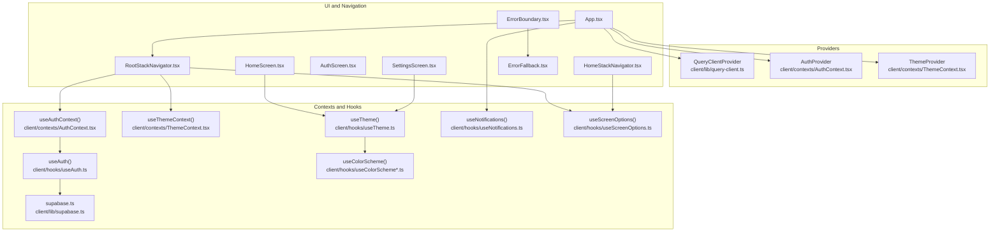

**Diagram sources**
- [App.tsx:15-16](file://client/App.tsx#L15-L16)
- [ThemeContext.tsx:15-51](file://client/contexts/ThemeContext.tsx#L15-L51)
- [AuthContext.tsx:19-30](file://client/contexts/AuthContext.tsx#L19-L30)
- [useAuth.ts:12-151](file://client/hooks/useAuth.ts#L12-L151)
- [supabase.ts:1-39](file://client/lib/supabase.ts#L1-L39)
- [query-client.ts:66-80](file://client/lib/query-client.ts#L66-L80)
- [useTheme.ts:1-14](file://client/hooks/useTheme.ts#L1-L14)
- [useColorScheme.ts:1-2](file://client/hooks/useColorScheme.ts#L1-L2)
- [useColorScheme.web.ts:1-22](file://client/hooks/useColorScheme.web.ts#L1-L22)
- [useNotifications.ts:51-137](file://client/hooks/useNotifications.ts#L51-L137)
- [useScreenOptions.ts:11-42](file://client/hooks/useScreenOptions.ts#L11-L42)
- [RootStackNavigator.tsx:34-133](file://client/navigation/RootStackNavigator.tsx#L34-L133)
- [HomeStackNavigator.tsx:13-28](file://client/navigation/HomeStackNavigator.tsx#L13-L28)
- [AuthScreen.tsx:13-239](file://client/screens/AuthScreen.tsx#L13-L239)
- [HomeScreen.tsx:9-29](file://client/screens/HomeScreen.tsx#L9-L29)
- [SettingsScreen.tsx:133-272](file://client/screens/SettingsScreen.tsx#L133-L272)
- [ErrorBoundary.tsx:16-55](file://client/components/ErrorBoundary.tsx#L16-L55)
- [ErrorFallback.tsx:22-144](file://client/components/ErrorFallback.tsx#L22-L144)

**Section sources**
- [App.tsx:1-76](file://client/App.tsx#L1-L76)
- [ThemeContext.tsx:1-61](file://client/contexts/ThemeContext.tsx#L1-L61)
- [AuthContext.tsx:1-31](file://client/contexts/AuthContext.tsx#L1-L31)
- [useAuth.ts:1-151](file://client/hooks/useAuth.ts#L1-L151)
- [supabase.ts:1-39](file://client/lib/supabase.ts#L1-L39)
- [query-client.ts:1-80](file://client/lib/query-client.ts#L1-L80)
- [useTheme.ts:1-14](file://client/hooks/useTheme.ts#L1-L14)
- [useColorScheme.ts:1-2](file://client/hooks/useColorScheme.ts#L1-L2)
- [useColorScheme.web.ts:1-22](file://client/hooks/useColorScheme.web.ts#L1-L22)
- [useNotifications.ts:1-143](file://client/hooks/useNotifications.ts#L1-L143)
- [useScreenOptions.ts:1-42](file://client/hooks/useScreenOptions.ts#L1-L42)
- [RootStackNavigator.tsx:1-246](file://client/navigation/RootStackNavigator.tsx#L1-L246)
- [HomeStackNavigator.tsx:1-28](file://client/navigation/HomeStackNavigator.tsx#L1-L28)
- [AuthScreen.tsx:1-435](file://client/screens/AuthScreen.tsx#L1-L435)
- [HomeScreen.tsx:1-29](file://client/screens/HomeScreen.tsx#L1-L29)
- [SettingsScreen.tsx:1-481](file://client/screens/SettingsScreen.tsx#L1-L481)
- [ErrorBoundary.tsx:1-55](file://client/components/ErrorBoundary.tsx#L1-L55)
- [ErrorFallback.tsx:1-247](file://client/components/ErrorFallback.tsx#L1-L247)

## Core Components
- Authentication Context Provider: Wraps children with a provider that exposes session, user, loading, and auth actions via a custom hook.
- Theme Context Provider: Manages global theme state with dark/light mode support, persistence, and toggle functionality.
- Authentication Hook: Manages Supabase session retrieval, subscription to auth state changes, and auth actions (sign in, sign up, sign out, Google OAuth).
- Supabase Client: Centralized client with environment-based configuration, session persistence, and redirect URL handling.
- React Query Client: Centralized client with default query and mutation policies, and a typed query function factory.
- Theme and Color Scheme: Theme composition and color scheme detection with SSR/web hydration support and persistent user preferences.
- Notifications Hook: Optional push notification registration and lifecycle management gated by authentication and preferences.
- Screen Options Hook: Navigation screen options derived from theme and platform capabilities.
- Error Boundary: Class-based error boundary with fallback UI and developer diagnostics.

**Section sources**
- [ThemeContext.tsx:1-61](file://client/contexts/ThemeContext.tsx#L1-L61)
- [AuthContext.tsx:5-30](file://client/contexts/AuthContext.tsx#L5-L30)
- [useAuth.ts:12-151](file://client/hooks/useAuth.ts#L12-L151)
- [supabase.ts:6-39](file://client/lib/supabase.ts#L6-L39)
- [query-client.ts:66-80](file://client/lib/query-client.ts#L66-L80)
- [useTheme.ts:1-14](file://client/hooks/useTheme.ts#L1-L14)
- [useColorScheme.ts:1-2](file://client/hooks/useColorScheme.ts#L1-L2)
- [useColorScheme.web.ts:7-22](file://client/hooks/useColorScheme.web.ts#L7-L22)
- [useNotifications.ts:51-137](file://client/hooks/useNotifications.ts#L51-L137)
- [useScreenOptions.ts:11-42](file://client/hooks/useScreenOptions.ts#L11-L42)
- [ErrorBoundary.tsx:16-55](file://client/components/ErrorBoundary.tsx#L16-L55)

## Architecture Overview
The app composes providers at the root, then consumes state in navigators and screens. Authentication and theme drive navigation decisions, while React Query centralizes server state. Theme and screen options are computed per component with persistent user preferences. Error boundaries wrap the entire tree to gracefully handle rendering errors and provide enhanced fallback mechanisms.

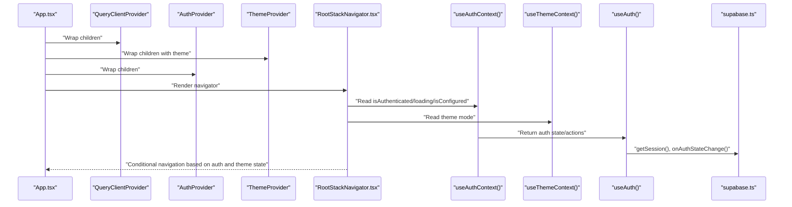

**Diagram sources**
- [App.tsx:57-69](file://client/App.tsx#L57-L69)
- [ThemeContext.tsx:15-51](file://client/contexts/ThemeContext.tsx#L15-L51)
- [AuthContext.tsx:19-30](file://client/contexts/AuthContext.tsx#L19-L30)
- [RootStackNavigator.tsx:34-133](file://client/navigation/RootStackNavigator.tsx#L34-L133)
- [useAuth.ts:17-38](file://client/hooks/useAuth.ts#L17-L38)
- [supabase.ts:20-34](file://client/lib/supabase.ts#L20-L34)

## Detailed Component Analysis

### Enhanced Theme Context and Hook
- Purpose: Provide global theme state management with persistent dark/light mode support.
- Key behaviors:
  - Initialize theme from device color scheme with fallback to dark mode.
  - Load saved theme preference from AsyncStorage on app startup.
  - Expose toggleTheme and setTheme functions for programmatic theme switching.
  - Persist theme preferences across app sessions.
- Persistence handling: Uses AsyncStorage to maintain user's theme choice.
- Error handling: Graceful fallbacks when AsyncStorage operations fail.

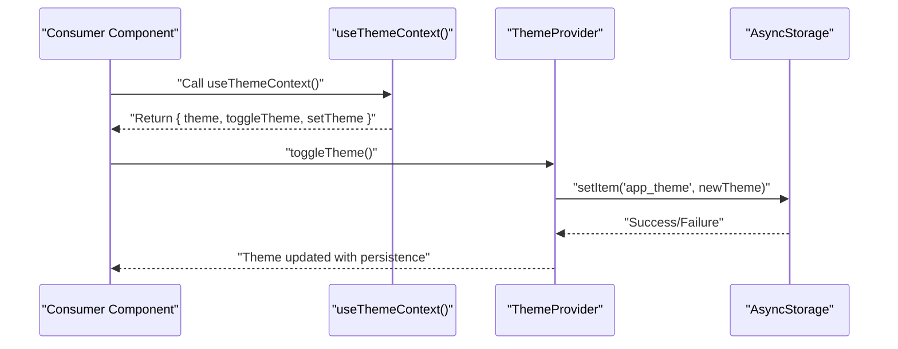

**Diagram sources**
- [ThemeContext.tsx:15-51](file://client/contexts/ThemeContext.tsx#L15-L51)
- [useTheme.ts:4-12](file://client/hooks/useTheme.ts#L4-L12)

**Section sources**
- [ThemeContext.tsx:1-61](file://client/contexts/ThemeContext.tsx#L1-L61)
- [useTheme.ts:1-14](file://client/hooks/useTheme.ts#L1-L14)

### Authentication Context and Hook
- Purpose: Provide session, user, loading, and auth action callbacks to consumers.
- Key behaviors:
  - Initialize session from Supabase and subscribe to auth state changes.
  - Expose sign in/sign up/sign out and Google OAuth flows.
  - Compute authentication flags (authenticated, configured).
- Subscription handling: Subscribes on mount and unsubscribes on unmount to prevent leaks.
- Error handling: Throws when Supabase is not configured; callers display user-friendly messages.

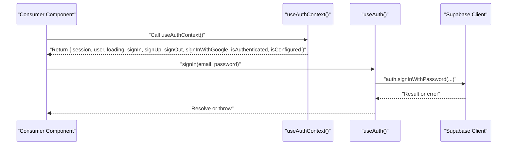

**Diagram sources**
- [AuthContext.tsx:19-30](file://client/contexts/AuthContext.tsx#L19-L30)
- [useAuth.ts:40-70](file://client/hooks/useAuth.ts#L40-L70)
- [supabase.ts:26-33](file://client/lib/supabase.ts#L26-L33)

**Section sources**
- [AuthContext.tsx:5-30](file://client/contexts/AuthContext.tsx#L5-L30)
- [useAuth.ts:12-151](file://client/hooks/useAuth.ts#L12-L151)
- [supabase.ts:6-39](file://client/lib/supabase.ts#L6-L39)

### Supabase Client and Session Persistence
- Configuration: Reads environment variables for URL and anonymous key; guards against missing config.
- Redirect handling: Computes redirect URL based on platform.
- Persistence: Uses AsyncStorage on native and browser storage on web; enables auto-refresh and session persistence.
- Session lifecycle: Retrieves initial session and subscribes to auth events.

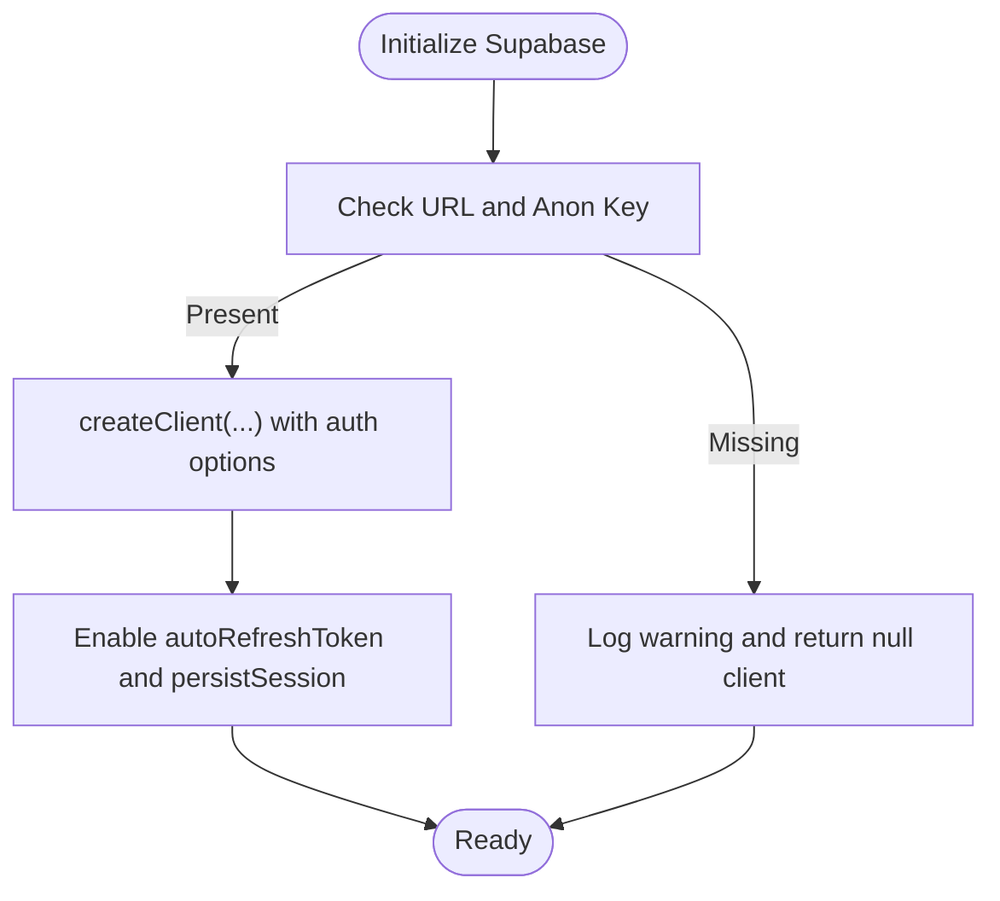

**Diagram sources**
- [supabase.ts:6-39](file://client/lib/supabase.ts#L6-L39)

**Section sources**
- [supabase.ts:6-39](file://client/lib/supabase.ts#L6-L39)

### React Query Client and Enhanced Error Handling
- Centralized client: Created once and passed to QueryClientProvider at the root.
- Default policies:
  - Queries: Infinite staleTime, no refetch on window focus, no retry, credentials included.
  - Mutations: No retry.
- Query function factory: Accepts an unauthorized behavior option to either throw or return null on 401.
- API request helper: Builds URLs from environment variable and performs fetch with credentials.
- Enhanced error handling: Improved fallback mechanisms for server communication failures.

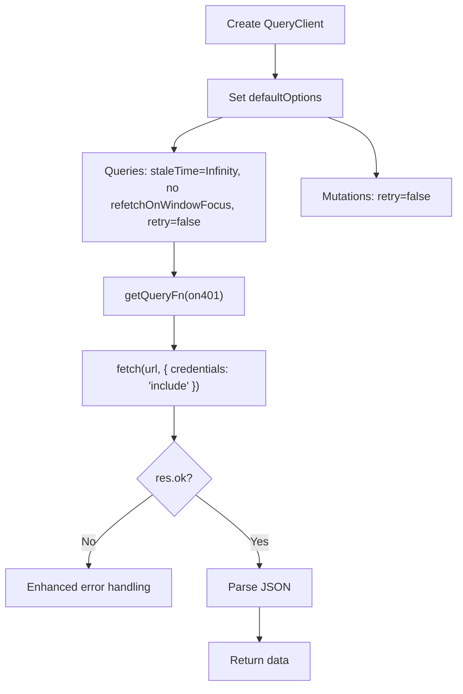

**Diagram sources**
- [query-client.ts:66-80](file://client/lib/query-client.ts#L66-L80)
- [query-client.ts:46-64](file://client/lib/query-client.ts#L46-L64)
- [query-client.ts:26-43](file://client/lib/query-client.ts#L26-L43)

**Section sources**
- [query-client.ts:1-80](file://client/lib/query-client.ts#L1-L80)

### Enhanced Theme and Color Scheme Management
- Color scheme detection:
  - On native: useColorScheme from react-native.
  - On web: hydrate on client to support SSR and return "light" until hydrated.
- Theme composition: Selects Colors by scheme and exposes theme and isDark flag.
- Typography, spacing, border radius, fonts, and shadows are centrally defined.
- Theme persistence: ThemeContext manages persistent theme preferences via AsyncStorage.

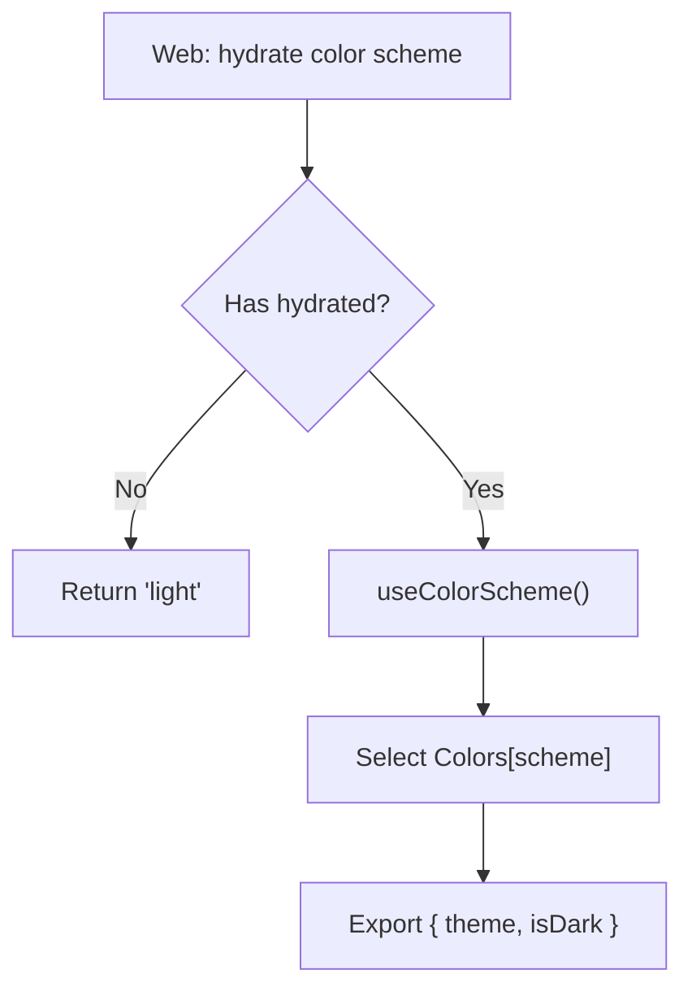

**Diagram sources**
- [useColorScheme.web.ts:7-22](file://client/hooks/useColorScheme.web.ts#L7-L22)
- [useColorScheme.ts:1-2](file://client/hooks/useColorScheme.ts#L1-L2)
- [useTheme.ts:1-14](file://client/hooks/useTheme.ts#L1-L14)
- [theme.ts:3-40](file://client/constants/theme.ts#L3-L40)

**Section sources**
- [ThemeContext.tsx:1-61](file://client/contexts/ThemeContext.tsx#L1-L61)
- [useColorScheme.web.ts:1-22](file://client/hooks/useColorScheme.web.ts#L1-L22)
- [useColorScheme.ts:1-2](file://client/hooks/useColorScheme.ts#L1-L2)
- [useTheme.ts:1-14](file://client/hooks/useTheme.ts#L1-L14)
- [theme.ts:1-168](file://client/constants/theme.ts#L1-L168)

### Notifications Hook and State Synchronization
- Purpose: Register and manage Expo push tokens when authenticated and permissions are granted.
- Behavior:
  - Gate setup by authentication and stored preference.
  - Load notifications module conditionally (non-web).
  - Request and store permissions; get Expo push token; register/unregister with backend.
  - Add/remove notification listeners on mount/unmount.
- Optional failures: Silent catches to avoid blocking the app.

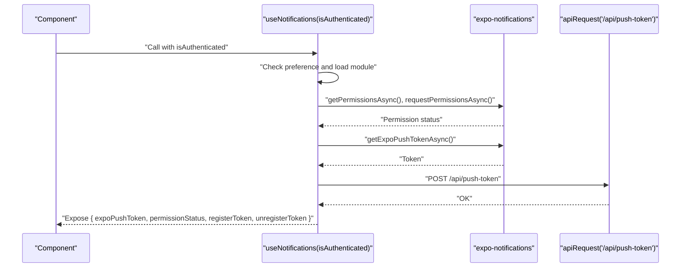

**Diagram sources**
- [useNotifications.ts:51-137](file://client/hooks/useNotifications.ts#L51-L137)
- [query-client.ts:26-43](file://client/lib/query-client.ts#L26-L43)

**Section sources**
- [useNotifications.ts:1-143](file://client/hooks/useNotifications.ts#L1-L143)
- [query-client.ts:26-43](file://client/lib/query-client.ts#L26-L43)

### Enhanced Screen Options and Navigation Integration
- useScreenOptions returns navigation options derived from theme and platform capabilities.
- Root navigator conditionally renders Auth or Main stacks based on authentication and configuration state.
- Home navigator applies screen options globally with theme-aware styling.
- NavigationContainer receives dynamic theme configuration based on current theme mode.

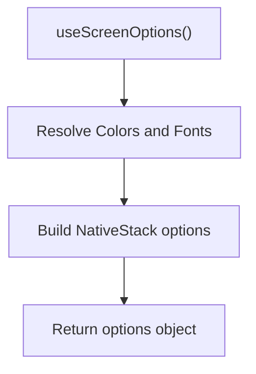

**Diagram sources**
- [useScreenOptions.ts:11-42](file://client/hooks/useScreenOptions.ts#L11-L42)
- [RootStackNavigator.tsx:34-133](file://client/navigation/RootStackNavigator.tsx#L34-L133)
- [HomeStackNavigator.tsx:13-28](file://client/navigation/HomeStackNavigator.tsx#L13-L28)

**Section sources**
- [useScreenOptions.ts:1-42](file://client/hooks/useScreenOptions.ts#L1-L42)
- [RootStackNavigator.tsx:34-133](file://client/navigation/RootStackNavigator.tsx#L34-L133)
- [HomeStackNavigator.tsx:13-28](file://client/navigation/HomeStackNavigator.tsx#L13-L28)
- [App.tsx:25-40](file://client/App.tsx#L25-L40)

### Enhanced Error Boundaries and Fallback UI
- ErrorBoundary is a class component that captures rendering errors and renders a fallback.
- ErrorFallback provides a user-facing UI to reload the app and optionally shows detailed error information in development.
- Enhanced error handling includes better fallback mechanisms for server communication failures.

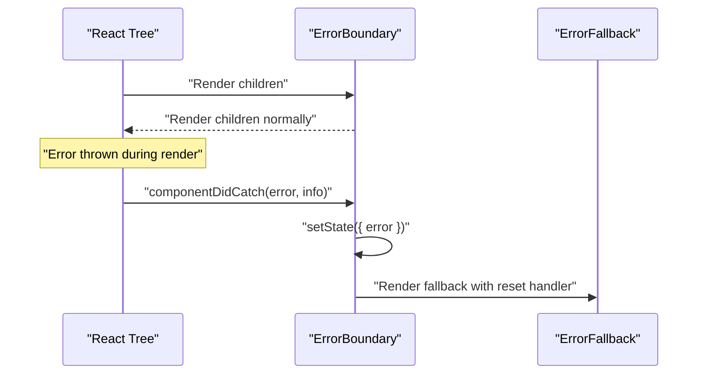

**Diagram sources**
- [ErrorBoundary.tsx:16-55](file://client/components/ErrorBoundary.tsx#L16-L55)
- [ErrorFallback.tsx:22-144](file://client/components/ErrorFallback.tsx#L22-L144)

**Section sources**
- [ErrorBoundary.tsx:1-55](file://client/components/ErrorBoundary.tsx#L1-L55)
- [ErrorFallback.tsx:1-247](file://client/components/ErrorFallback.tsx#L1-L247)

### Practical Examples of Enhanced State Consumption

- Theme integration in App.tsx:
  - Consumes useThemeContext to dynamically configure NavigationContainer theme.
  - Applies theme colors to root view and StatusBar.
  - Creates HiddenGemTheme by combining base theme with custom colors.
  - Example path: [App.tsx:20-55](file://client/App.tsx#L20-L55)

- Authentication in AuthScreen:
  - Consumes useAuthContext to drive sign-in/sign-up and Google sign-in flows.
  - Manages local loading and error states while delegating network operations to the hook.
  - Example path: [AuthScreen.tsx:13-239](file://client/screens/AuthScreen.tsx#L13-L239)

- Navigation-driven state in RootStackNavigator:
  - Uses useAuthContext to decide whether to show Auth or Main stacks.
  - Uses useScreenOptions to apply consistent screen options.
  - Integrates theme-aware styling for content backgrounds.
  - Example path: [RootStackNavigator.tsx:34-133](file://client/navigation/RootStackNavigator.tsx#L34-L133)

- Theme usage in HomeScreen:
  - Uses useTheme to style content areas and layout with persistent theme support.
  - Example path: [HomeScreen.tsx:9-29](file://client/screens/HomeScreen.tsx#L9-L29)

- Theme usage in SettingsScreen:
  - Uses useTheme for consistent theming across settings interface.
  - Implements theme-aware styling for settings sections and rows.
  - Example path: [SettingsScreen.tsx:133-272](file://client/screens/SettingsScreen.tsx#L133-L272)

- Notifications gating:
  - App initializes notifications only when authenticated.
  - Example path: [App.tsx:21-23](file://client/App.tsx#L21-L23), [useNotifications.ts:51-137](file://client/hooks/useNotifications.ts#L51-L137)

## Dependency Analysis
- Context-to-hook coupling: AuthProvider depends on useAuth; ThemeProvider depends on useThemeContext; useAuth depends on supabase.ts.
- Navigation-to-context coupling: Root and Home navigators depend on useAuthContext, useThemeContext, and useScreenOptions.
- Theme-to-color-scheme coupling: useTheme depends on useThemeContext, useColorScheme, and theme.ts.
- Notifications-to-api coupling: useNotifications depends on query-client.ts for API requests.
- Error boundary-to-fallback coupling: ErrorBoundary renders ErrorFallback.
- Theme persistence coupling: ThemeContext uses AsyncStorage for theme preference storage.

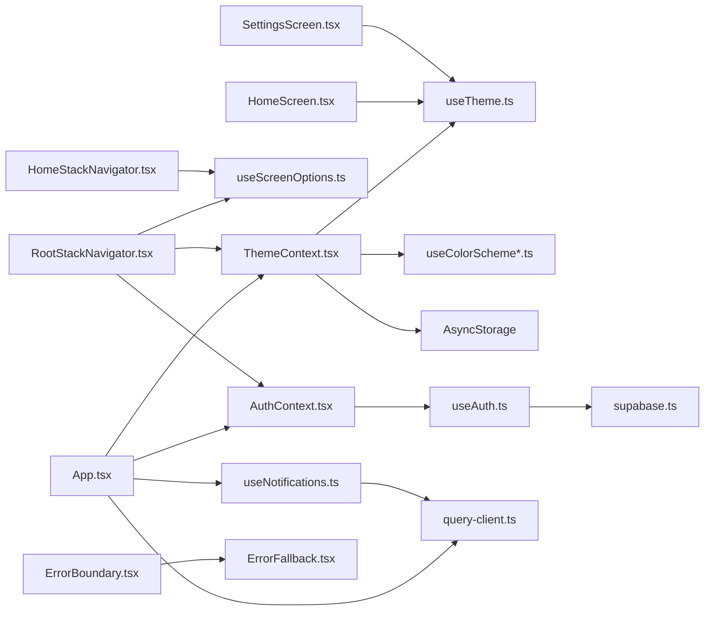

**Diagram sources**
- [ThemeContext.tsx:1-61](file://client/contexts/ThemeContext.tsx#L1-L61)
- [useTheme.ts:1-14](file://client/hooks/useTheme.ts#L1-L14)
- [useColorScheme.ts:1-2](file://client/hooks/useColorScheme.ts#L1-L2)
- [useColorScheme.web.ts:1-22](file://client/hooks/useColorScheme.web.ts#L1-L22)
- [AuthContext.tsx:19-30](file://client/contexts/AuthContext.tsx#L19-L30)
- [useAuth.ts:12-151](file://client/hooks/useAuth.ts#L12-L151)
- [supabase.ts:1-39](file://client/lib/supabase.ts#L1-L39)
- [App.tsx:57-69](file://client/App.tsx#L57-L69)
- [RootStackNavigator.tsx:34-133](file://client/navigation/RootStackNavigator.tsx#L34-L133)
- [HomeStackNavigator.tsx:13-28](file://client/navigation/HomeStackNavigator.tsx#L13-L28)
- [useScreenOptions.ts:11-42](file://client/hooks/useScreenOptions.ts#L11-L42)
- [HomeScreen.tsx:9-29](file://client/screens/HomeScreen.tsx#L9-L29)
- [SettingsScreen.tsx:133-272](file://client/screens/SettingsScreen.tsx#L133-L272)
- [useNotifications.ts:51-137](file://client/hooks/useNotifications.ts#L51-L137)
- [query-client.ts:26-43](file://client/lib/query-client.ts#L26-L43)
- [ErrorBoundary.tsx:16-55](file://client/components/ErrorBoundary.tsx#L16-L55)
- [ErrorFallback.tsx:22-144](file://client/components/ErrorFallback.tsx#L22-L144)

**Section sources**
- [App.tsx:1-76](file://client/App.tsx#L1-L76)
- [RootStackNavigator.tsx:1-246](file://client/navigation/RootStackNavigator.tsx#L1-L246)
- [HomeStackNavigator.tsx:1-28](file://client/navigation/HomeStackNavigator.tsx#L1-L28)
- [ThemeContext.tsx:1-61](file://client/contexts/ThemeContext.tsx#L1-L61)
- [AuthContext.tsx:1-31](file://client/contexts/AuthContext.tsx#L1-L31)
- [useAuth.ts:1-151](file://client/hooks/useAuth.ts#L1-L151)
- [supabase.ts:1-39](file://client/lib/supabase.ts#L1-L39)
- [useTheme.ts:1-14](file://client/hooks/useTheme.ts#L1-L14)
- [useColorScheme.ts:1-2](file://client/hooks/useColorScheme.ts#L1-L2)
- [useColorScheme.web.ts:1-22](file://client/hooks/useColorScheme.web.ts#L1-L22)
- [theme.ts:1-168](file://client/constants/theme.ts#L1-L168)
- [useNotifications.ts:1-143](file://client/hooks/useNotifications.ts#L1-L143)
- [useScreenOptions.ts:1-42](file://client/hooks/useScreenOptions.ts#L1-L42)
- [query-client.ts:1-80](file://client/lib/query-client.ts#L1-L80)
- [ErrorBoundary.tsx:1-55](file://client/components/ErrorBoundary.tsx#L1-L55)
- [ErrorFallback.tsx:1-247](file://client/components/ErrorFallback.tsx#L1-L247)

## Performance Considerations
- Infinite cache for queries: Prevents unnecessary refetches but requires explicit invalidation when data changes.
- No refetch on window focus: Reduces background activity; rely on explicit refetch triggers.
- No retry: Keeps error boundaries responsible for recovery; avoid retry storms.
- Subscription cleanup: useAuth unsubscribes on unmount; ensure similar cleanup in other long-lived subscriptions.
- Conditional module loading: Notifications module is loaded lazily on native platforms to avoid overhead on web.
- Hydration guard: useColorScheme.web.ts prevents SSR mismatches by deferring to client-side detection.
- Theme persistence: AsyncStorage operations are optimized with try-catch blocks to prevent app crashes.
- Theme caching: ThemeContext loads saved theme once on startup to minimize storage operations.

## Troubleshooting Guide
- Authentication not configured:
  - Symptom: Loading remains false, actions throw.
  - Cause: Missing Supabase URL or anonymous key.
  - Resolution: Set environment variables and ensure isSupabaseConfigured is true.
  - Section sources
    - [supabase.ts:6-9](file://client/lib/supabase.ts#L6-L9)
    - [useAuth.ts:18-21](file://client/hooks/useAuth.ts#L18-L21)

- Auth state changes not reflected:
  - Symptom: UI does not update after login/logout.
  - Cause: Missing subscription or unsubscription.
  - Resolution: Verify onAuthStateChange subscription and cleanup in useAuth.
  - Section sources
    - [useAuth.ts:31-37](file://client/hooks/useAuth.ts#L31-L37)

- Navigation stuck on Auth:
  - Symptom: Auth screen shown when already authenticated.
  - Cause: loading flag not handled or isConfigured false.
  - Resolution: Ensure loading is considered before deciding to show Auth.
  - Section sources
    - [RootStackNavigator.tsx:38-42](file://client/navigation/RootStackNavigator.tsx#L38-L42)

- Theme not persisting:
  - Symptom: Theme resets after app restart.
  - Cause: AsyncStorage operations failing or not implemented.
  - Resolution: Check AsyncStorage.setItem/getItem calls in ThemeContext.
  - Section sources
    - [ThemeContext.tsx:20-31](file://client/contexts/ThemeContext.tsx#L20-L31)
    - [ThemeContext.tsx:33-45](file://client/contexts/ThemeContext.tsx#L33-L45)

- Theme toggle not working:
  - Symptom: toggleTheme function called but theme doesn't change.
  - Cause: State not updating or AsyncStorage write failure.
  - Resolution: Verify setThemeState and AsyncStorage.setItem calls.
  - Section sources
    - [ThemeContext.tsx:42-45](file://client/contexts/ThemeContext.tsx#L42-L45)

- Notifications not registering:
  - Symptom: No push token registered.
  - Cause: Permissions denied or module unavailable.
  - Resolution: Check permission status and module availability; ensure authenticated gating.
  - Section sources
    - [useNotifications.ts:77-128](file://client/hooks/useNotifications.ts#L77-L128)

- Error boundary not catching:
  - Symptom: Crashes still crash the app.
  - Cause: Functional components cannot act as error boundaries.
  - Resolution: Wrap root with ErrorBoundary and use ErrorFallback for recovery.
  - Section sources
    - [ErrorBoundary.tsx:16-55](file://client/components/ErrorBoundary.tsx#L16-L55)
    - [ErrorFallback.tsx:22-144](file://client/components/ErrorFallback.tsx#L22-L144)

## Conclusion
The application's state management combines a clean Context provider pattern with enhanced theme management, platform-aware custom hooks, and a strongly configured React Query client. The new ThemeContext provides comprehensive dark/light mode support with persistent user preferences, while authentication state continues to drive navigation. Enhanced error boundaries provide resilience with improved fallback mechanisms, and careful subscription and hydration practices ensure correctness across platforms. The integration of theme-aware navigation styling creates a cohesive user experience with consistent visual design.