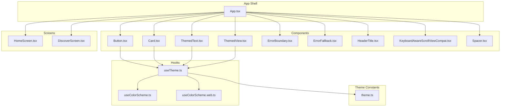
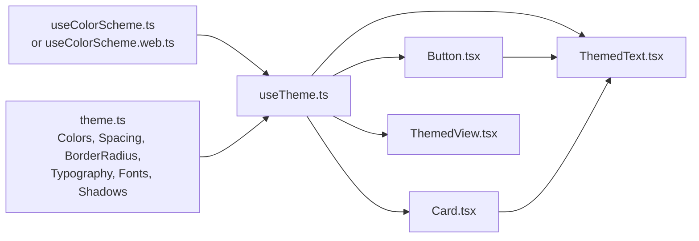
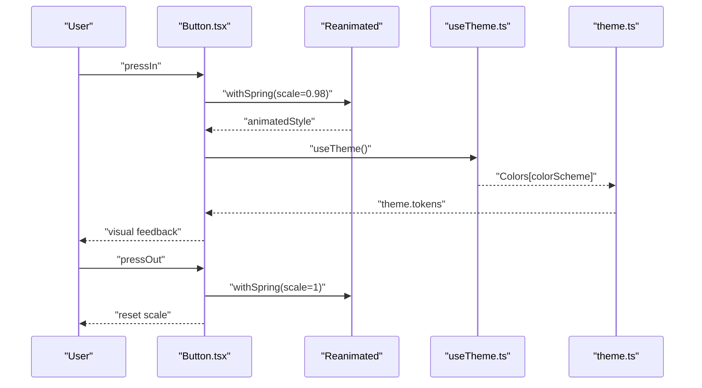
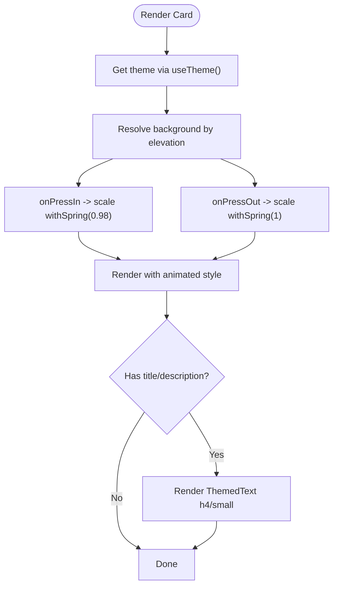
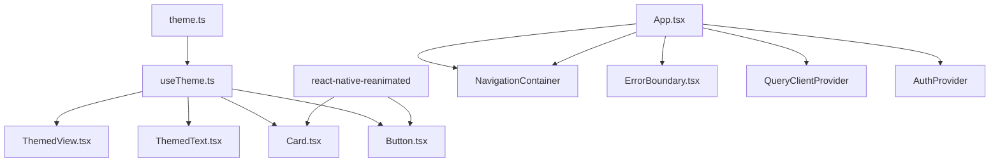

# UI Components

<cite>
**Referenced Files in This Document**
- [Button.tsx](file://client/components/Button.tsx)
- [Card.tsx](file://client/components/Card.tsx)
- [ThemedText.tsx](file://client/components/ThemedText.tsx)
- [ThemedView.tsx](file://client/components/ThemedView.tsx)
- [theme.ts](file://client/constants/theme.ts)
- [useTheme.ts](file://client/hooks/useTheme.ts)
- [useColorScheme.ts](file://client/hooks/useColorScheme.ts)
- [useColorScheme.web.ts](file://client/hooks/useColorScheme.web.ts)
- [ErrorBoundary.tsx](file://client/components/ErrorBoundary.tsx)
- [ErrorFallback.tsx](file://client/components/ErrorFallback.tsx)
- [HeaderTitle.tsx](file://client/components/HeaderTitle.tsx)
- [KeyboardAwareScrollViewCompat.tsx](file://client/components/KeyboardAwareScrollViewCompat.tsx)
- [Spacer.tsx](file://client/components/Spacer.tsx)
- [HomeScreen.tsx](file://client/screens/HomeScreen.tsx)
- [DiscoverScreen.tsx](file://client/screens/DiscoverScreen.tsx)
- [App.tsx](file://client/App.tsx)
</cite>

## Table of Contents
1. [Introduction](#introduction)
2. [Project Structure](#project-structure)
3. [Core Components](#core-components)
4. [Architecture Overview](#architecture-overview)
5. [Detailed Component Analysis](#detailed-component-analysis)
6. [Dependency Analysis](#dependency-analysis)
7. [Performance Considerations](#performance-considerations)
8. [Accessibility Considerations](#accessibility-considerations)
9. [Responsive Design Patterns](#responsive-design-patterns)
10. [Cross-Platform Compatibility](#cross-platform-compatibility)
11. [Testing Strategies](#testing-strategies)
12. [Customization Guidelines](#customization-guidelines)
13. [Practical Usage Examples](#practical-usage-examples)
14. [Troubleshooting Guide](#troubleshooting-guide)
15. [Conclusion](#conclusion)

## Introduction
This document describes the custom UI component library and theme system used across the application. It focuses on reusable components (Button, Card, ThemedText, ThemedView), the theme system supporting light/dark modes, color schemes, and typography scaling, and how these integrate with hooks and screens. It also covers composition patterns, TypeScript integration, accessibility, responsiveness, cross-platform compatibility, testing strategies, performance optimizations, and customization guidelines.

## Project Structure
The UI layer is organized around:
- Components: Reusable building blocks under client/components
- Theme constants: Centralized design tokens under client/constants/theme.ts
- Hooks: Theme and color scheme logic under client/hooks
- Screens: Feature screens that compose components under client/screens
- Application shell: App.tsx wires providers, navigation, and error boundaries

**Diagram sources**
- [App.tsx](file://client/App.tsx#L1-L67)
- [useTheme.ts](file://client/hooks/useTheme.ts#L1-L14)
- [useColorScheme.ts](file://client/hooks/useColorScheme.ts#L1-L2)
- [useColorScheme.web.ts](file://client/hooks/useColorScheme.web.ts#L1-L22)
- [theme.ts](file://client/constants/theme.ts#L1-L167)
- [Button.tsx](file://client/components/Button.tsx#L1-L93)
- [Card.tsx](file://client/components/Card.tsx#L1-L115)
- [ThemedText.tsx](file://client/components/ThemedText.tsx#L1-L62)
- [ThemedView.tsx](file://client/components/ThemedView.tsx#L1-L27)
- [ErrorBoundary.tsx](file://client/components/ErrorBoundary.tsx#L1-L55)
- [ErrorFallback.tsx](file://client/components/ErrorFallback.tsx#L1-L247)
- [HeaderTitle.tsx](file://client/components/HeaderTitle.tsx#L1-L40)
- [KeyboardAwareScrollViewCompat.tsx](file://client/components/KeyboardAwareScrollViewCompat.tsx#L1-L38)
- [Spacer.tsx](file://client/components/Spacer.tsx#L1-L21)
- [HomeScreen.tsx](file://client/screens/HomeScreen.tsx#L1-L29)
- [DiscoverScreen.tsx](file://client/screens/DiscoverScreen.tsx#L1-L340)

**Section sources**
- [App.tsx](file://client/App.tsx#L1-L67)
- [theme.ts](file://client/constants/theme.ts#L1-L167)

## Core Components
This section documents the four primary themed components and their props, styling options, and usage patterns.

- Button
  - Purpose: Interactive pressable element with animated feedback and themed colors
  - Key props:
    - onPress: Callback invoked on press
    - children: Rendered content (typically ThemedText)
    - style: Additional styles applied to the button container
    - disabled: Disables interaction and adjusts opacity
  - Styling options:
    - Uses theme.link for background and theme.buttonText for label color
    - Fixed height and full-radius pill shape via Spacing and BorderRadius
    - Animated scale transform on press
  - Composition pattern:
    - Wraps ThemedText with type "body" for label
    - Integrates with useTheme for dynamic colors
  - Accessibility:
    - Inherits Pressable semantics; ensure sufficient touch target size
  - Cross-platform:
    - Uses react-native-reanimated for animations; tested on native platforms

- Card
  - Purpose: Touchable container with layered backgrounds and optional title/description
  - Key props:
    - elevation: Background variant selection (1–3+ default)
    - title: Optional headline text
    - description: Optional secondary text
    - children: Content inside the card
    - onPress: Callback invoked on press
    - style: Additional styles applied to the card container
  - Styling options:
    - Background determined by elevation mapping to theme tokens
    - Padding and large border radius
    - Optional title and description rendered via ThemedText
  - Composition pattern:
    - Animated pressable with spring scale effect
    - Uses theme tokens for background and text colors
  - Accessibility:
    - Pressable targets should meet minimum 44dp touch target guidelines

- ThemedText
  - Purpose: Text component that adapts color and typography to the current theme
  - Key props:
    - lightColor/darkColor: Override color per scheme
    - type: One of "h1"|"h2"|"h3"|"h4"|"body"|"small"|"link"
    - ...TextProps: Pass-through to underlying Text
  - Styling options:
    - Color: Respects isDark and explicit overrides
    - Typography: Mapped from Typography scale
  - Composition pattern:
    - Used inside Button and Card for labels and metadata
    - Supports link-specific styling

- ThemedView
  - Purpose: View component that adapts background color to the current theme
  - Key props:
    - lightColor/darkColor: Override background per scheme
    - ...ViewProps: Pass-through to underlying View
  - Styling options:
    - Background: Respects isDark and explicit overrides; defaults to theme.backgroundRoot
  - Composition pattern:
    - Used as screen containers and layout wrappers

**Section sources**
- [Button.tsx](file://client/components/Button.tsx#L1-L93)
- [Card.tsx](file://client/components/Card.tsx#L1-L115)
- [ThemedText.tsx](file://client/components/ThemedText.tsx#L1-L62)
- [ThemedView.tsx](file://client/components/ThemedView.tsx#L1-L27)

## Architecture Overview
The theme system is driven by a hook that selects the appropriate palette based on the current color scheme, and exposes theme tokens for colors, spacing, borders, typography, fonts, and shadows. Components consume these tokens via useTheme.

**Diagram sources**
- [useColorScheme.ts](file://client/hooks/useColorScheme.ts#L1-L2)
- [useColorScheme.web.ts](file://client/hooks/useColorScheme.web.ts#L1-L22)
- [useTheme.ts](file://client/hooks/useTheme.ts#L1-L14)
- [theme.ts](file://client/constants/theme.ts#L1-L167)
- [Button.tsx](file://client/components/Button.tsx#L1-L93)
- [Card.tsx](file://client/components/Card.tsx#L1-L115)
- [ThemedText.tsx](file://client/components/ThemedText.tsx#L1-L62)
- [ThemedView.tsx](file://client/components/ThemedView.tsx#L1-L27)

## Detailed Component Analysis

### Button
- Props interface:
  - onPress?: () => void
  - children: ReactNode
  - style?: StyleProp<ViewStyle>
  - disabled?: boolean
- Behavior:
  - Animated press-in/out scaling using react-native-reanimated
  - Disabled state reduces opacity and prevents callbacks
  - Background color and label color derived from theme tokens
- Styling:
  - Fixed height and full-radius pill shape
  - Centered content alignment
- Composition:
  - Renders ThemedText with type "body" for label
  - Integrates with useTheme and theme constants

**Diagram sources**
- [Button.tsx](file://client/components/Button.tsx#L31-L80)
- [useTheme.ts](file://client/hooks/useTheme.ts#L1-L14)
- [theme.ts](file://client/constants/theme.ts#L1-L167)

**Section sources**
- [Button.tsx](file://client/components/Button.tsx#L1-L93)

### Card
- Props interface:
  - elevation?: number
  - title?: string
  - description?: string
  - children?: React.ReactNode
  - onPress?: () => void
  - style?: ViewStyle
- Behavior:
  - Animated pressable with spring scale
  - Elevation maps to background variants
  - Optional title and description rendered via ThemedText
- Styling:
  - Padding and large border radius
  - Background determined by elevation mapping

**Diagram sources**
- [Card.tsx](file://client/components/Card.tsx#L49-L101)
- [useTheme.ts](file://client/hooks/useTheme.ts#L1-L14)
- [theme.ts](file://client/constants/theme.ts#L1-L167)

**Section sources**
- [Card.tsx](file://client/components/Card.tsx#L1-L115)

### ThemedText
- Props interface:
  - lightColor?: string
  - darkColor?: string
  - type?: "h1"|"h2"|"h3"|"h4"|"body"|"small"|"link"
  - ...TextProps
- Behavior:
  - Selects color based on isDark and explicit overrides
  - Applies typography mapping from Typography scale
- Styling:
  - Color and font metrics derived from theme tokens

**Section sources**
- [ThemedText.tsx](file://client/components/ThemedText.tsx#L1-L62)
- [theme.ts](file://client/constants/theme.ts#L67-L108)

### ThemedView
- Props interface:
  - lightColor?: string
  - darkColor?: string
  - ...ViewProps
- Behavior:
  - Chooses background color based on isDark and overrides
  - Defaults to theme.backgroundRoot
- Styling:
  - Background color applied via style override

**Section sources**
- [ThemedView.tsx](file://client/components/ThemedView.tsx#L1-L27)
- [theme.ts](file://client/constants/theme.ts#L1-L167)

### Supporting Components
- ErrorBoundary and ErrorFallback
  - ErrorBoundary is a class component implementing error capture lifecycles
  - ErrorFallback renders a friendly UI with a restart action and optional dev error details modal
  - Both components use ThemedText and ThemedView for consistent theming
- HeaderTitle
  - Composes an icon and themed title for headers
- KeyboardAwareScrollViewCompat
  - Provides platform-aware keyboard-aware scrolling with fallback on web
- Spacer
  - Minimal spacer utility component

**Section sources**
- [ErrorBoundary.tsx](file://client/components/ErrorBoundary.tsx#L1-L55)
- [ErrorFallback.tsx](file://client/components/ErrorFallback.tsx#L1-L247)
- [HeaderTitle.tsx](file://client/components/HeaderTitle.tsx#L1-L40)
- [KeyboardAwareScrollViewCompat.tsx](file://client/components/KeyboardAwareScrollViewCompat.tsx#L1-L38)
- [Spacer.tsx](file://client/components/Spacer.tsx#L1-L21)

## Dependency Analysis
- Components depend on:
  - useTheme for theme tokens
  - theme.ts for Colors, Spacing, BorderRadius, Typography, Fonts, Shadows
  - react-native-reanimated for Button/Card animations
- Screens depend on:
  - ThemedView/ThemedText for content
  - Navigation and safe area utilities for layout
- App.tsx composes:
  - Providers (QueryClient, Auth, ErrorBoundary)
  - NavigationContainer with a custom theme based on theme.ts

**Diagram sources**
- [theme.ts](file://client/constants/theme.ts#L1-L167)
- [useTheme.ts](file://client/hooks/useTheme.ts#L1-L14)
- [Button.tsx](file://client/components/Button.tsx#L1-L93)
- [Card.tsx](file://client/components/Card.tsx#L1-L115)
- [ThemedText.tsx](file://client/components/ThemedText.tsx#L1-L62)
- [ThemedView.tsx](file://client/components/ThemedView.tsx#L1-L27)
- [App.tsx](file://client/App.tsx#L1-L67)

**Section sources**
- [App.tsx](file://client/App.tsx#L1-L67)
- [theme.ts](file://client/constants/theme.ts#L1-L167)

## Performance Considerations
- Prefer Animated components for interactive feedback to keep layout off the main thread
- Use StyleSheet.create for component-level styles to avoid repeated allocations
- Keep animated transforms minimal (scale) to reduce layout thrashing
- Avoid unnecessary re-renders by passing memoized callbacks and stable props
- Use FlatList/ListHeaderComponent to efficiently render large lists
- Leverage theme tokens to minimize inline style computations

## Accessibility Considerations
- Touch target sizing:
  - Button height is standardized; ensure additional padding does not shrink targets below recommended sizes
- Color contrast:
  - Theme tokens provide sufficient contrast for text and backgrounds; verify custom overrides maintain WCAG contrast ratios
- Semantic roles:
  - Use Pressable for actionable elements; pair with accessibility labels where needed
- Dynamic type scaling:
  - Typography scale supports readable sizing; avoid hardcoding font sizes outside the theme
- Focus and navigation:
  - Combine with focus handlers and navigation semantics as needed

## Responsive Design Patterns
- Use Spacing and BorderRadius scales for consistent padding and corner radii across devices
- Prefer percentage-based layouts and flexible containers (e.g., ThemedView wrapping content)
- Apply safe area insets and header/tab bar heights from navigation utilities to prevent overlap
- Use platform-specific font stacks via Fonts for optimal readability

## Cross-Platform Compatibility
- Web support:
  - useColorScheme.web.ts hydrates color scheme on the client to avoid SSR mismatches
  - KeyboardAwareScrollViewCompat falls back to ScrollView on web
- Native vs web:
  - Animations rely on react-native-reanimated; ensure platform availability
  - Navigation and provider libraries are configured in App.tsx for consistent behavior

**Section sources**
- [useColorScheme.web.ts](file://client/hooks/useColorScheme.web.ts#L1-L22)
- [KeyboardAwareScrollViewCompat.tsx](file://client/components/KeyboardAwareScrollViewCompat.tsx#L1-L38)
- [App.tsx](file://client/App.tsx#L1-L67)

## Testing Strategies
- Unit tests for components:
  - Mock useTheme to assert color and typography rendering
  - Test disabled state and press handlers for Button/Card
- Snapshot tests:
  - Capture themed renders across light/dark modes
- Integration tests:
  - Verify composition patterns (e.g., Button wrapping ThemedText)
- Accessibility tests:
  - Validate contrast and semantic roles
- Cross-platform tests:
  - Run web-specific logic (e.g., hydration of color scheme) in e2e scenarios

## Customization Guidelines
- Colors:
  - Extend Colors.light/dark with new semantic tokens; update theme.ts and consume via useTheme
- Typography:
  - Add new keys to Typography; reference from components via type prop
- Spacing and borders:
  - Use existing Spacing and BorderRadius scales; define new sizes sparingly
- Fonts:
  - Add platform-specific font families in Fonts; apply via theme tokens
- Shadows:
  - Use Shadows for consistent elevation effects; avoid duplicating shadow props across components

## Practical Usage Examples
- HomeScreen demonstrates:
  - Using ThemedView as a root container with theme.backgroundRoot
  - Applying safe area insets and navigation heights for content padding
- DiscoverScreen demonstrates:
  - Composing Card and ThemedText for article listings
  - Using ThemedView and ThemedText for section headers and metadata
  - Applying Colors and Typography tokens directly for quick theming
  - Using Icons and layout primitives for visual hierarchy

**Section sources**
- [HomeScreen.tsx](file://client/screens/HomeScreen.tsx#L1-L29)
- [DiscoverScreen.tsx](file://client/screens/DiscoverScreen.tsx#L1-L340)

## Troubleshooting Guide
- Theme mismatch on web:
  - Ensure useColorScheme.web.ts hydrates before rendering
- Animation issues:
  - Confirm react-native-reanimated is properly initialized and platform supported
- Error handling:
  - Wrap the app with ErrorBoundary and customize ErrorFallback for development diagnostics
- Layout overlaps:
  - Use safe area and navigation height utilities; verify insets and tab bar heights

**Section sources**
- [useColorScheme.web.ts](file://client/hooks/useColorScheme.web.ts#L1-L22)
- [ErrorBoundary.tsx](file://client/components/ErrorBoundary.tsx#L1-L55)
- [ErrorFallback.tsx](file://client/components/ErrorFallback.tsx#L1-L247)
- [HomeScreen.tsx](file://client/screens/HomeScreen.tsx#L1-L29)

## Conclusion
The UI component library centers on four core themed components (Button, Card, ThemedText, ThemedView) that consistently consume a unified theme system. The theme system supports light/dark modes, scalable typography, and cross-platform considerations. By composing these components and leveraging the theme tokens, developers can build accessible, responsive, and maintainable interfaces across platforms.