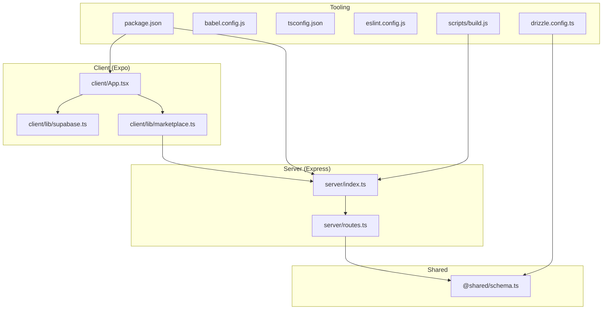

# Getting Started

<cite>
**Referenced Files in This Document**
- [package.json](file://package.json)
- [app.json](file://app.json)
- [ENVIRONMENT.md](file://ENVIRONMENT.md)
- [server/index.ts](file://server/index.ts)
- [server/routes.ts](file://server/routes.ts)
- [client/App.tsx](file://client/App.tsx)
- [client/lib/supabase.ts](file://client/lib/supabase.ts)
- [client/lib/marketplace.ts](file://client/lib/marketplace.ts)
- [scripts/build.js](file://scripts/build.js)
- [drizzle.config.ts](file://drizzle.config.ts)
- [babel.config.js](file://babel.config.js)
- [tsconfig.json](file://tsconfig.json)
- [eslint.config.js](file://eslint.config.js)
- [replit.md](file://replit.md)
</cite>

## Table of Contents
1. [Introduction](#introduction)
2. [Project Structure](#project-structure)
3. [Prerequisites](#prerequisites)
4. [Installation](#installation)
5. [Environment Variables](#environment-variables)
6. [Development Workflow](#development-workflow)
7. [Build and Deployment](#build-and-deployment)
8. [IDE and Debugging Setup](#ide-and-debugging-setup)
9. [Verification and First Run](#verification-and-first-run)
10. [Troubleshooting](#troubleshooting)
11. [Conclusion](#conclusion)

## Introduction
Hidden-Gem is a professional inventory management app for resellers built with React Native and Expo for the frontend and Express.js with TypeScript for the backend. It integrates AI-powered item analysis, Supabase authentication, and marketplace publishing to WooCommerce and eBay. This guide walks you through setting up the development environment, configuring environment variables, starting the development servers, building for production, and verifying your setup.

## Project Structure
The project is organized into a monorepo-like structure with a client (Expo app), server (Express API), shared schema, and supporting scripts and configurations.

**Diagram sources**
- [client/App.tsx](file://client/App.tsx#L1-L57)
- [client/lib/supabase.ts](file://client/lib/supabase.ts#L1-L39)
- [client/lib/marketplace.ts](file://client/lib/marketplace.ts#L1-L129)
- [server/index.ts](file://server/index.ts#L1-L247)
- [server/routes.ts](file://server/routes.ts#L1-L493)
- [drizzle.config.ts](file://drizzle.config.ts#L1-L15)
- [scripts/build.js](file://scripts/build.js#L1-L562)
- [package.json](file://package.json#L1-L85)
- [babel.config.js](file://babel.config.js#L1-L21)
- [tsconfig.json](file://tsconfig.json#L1-L15)
- [eslint.config.js](file://eslint.config.js#L1-L13)

**Section sources**
- [replit.md](file://replit.md#L13-L50)
- [ENVIRONMENT.md](file://ENVIRONMENT.md#L115-L147)

## Prerequisites
Before starting, ensure your machine satisfies the following requirements:
- Node.js: Version 18 or higher
- Git: For version control
- Expo CLI: Install globally or use npx
- Platform-specific tools:
  - iOS: Xcode and iOS Simulator
  - Android: Android Studio and an emulator or a physical device
- Optional but recommended: A modern code editor with TypeScript and ESLint support

Note: The project integrates with Replit services for AI and database. While you can develop locally, certain integrations rely on Replit’s environment variables and hosted services.

**Section sources**
- [ENVIRONMENT.md](file://ENVIRONMENT.md#L5-L11)
- [replit.md](file://replit.md#L51-L81)

## Installation
Follow these steps to install dependencies and prepare your environment:

1. Install dependencies
   - Use your preferred package manager to install dependencies defined in the project.
   - The scripts section defines commands for development and build tasks.

2. Initialize the database schema
   - Apply migrations using the provided script to set up tables and schema.

3. Configure aliases and tooling
   - Path aliases are configured for TypeScript and Babel to resolve imports from client and shared directories.

**Section sources**
- [package.json](file://package.json#L5-L17)
- [drizzle.config.ts](file://drizzle.config.ts#L1-L15)
- [babel.config.js](file://babel.config.js#L1-L21)
- [tsconfig.json](file://tsconfig.json#L1-L15)

## Environment Variables
Configure the required environment variables for Supabase, database, sessions, and optional marketplace credentials. These variables are essential for authentication, AI features, and marketplace publishing.

- Database
  - DATABASE_URL: PostgreSQL connection string (auto-configured on Replit)

- Supabase Authentication
  - EXPO_PUBLIC_SUPABASE_URL: Supabase project URL
  - EXPO_PUBLIC_SUPABASE_ANON_KEY: Supabase anonymous public key
  - SUPABASE_ANON_KEY: Supabase key for server-side use

- Session Management
  - SESSION_SECRET: Express session encryption secret

- Replit AI Integrations (Google Gemini)
  - AI_INTEGRATIONS_GEMINI_API_KEY: Google Gemini API key
  - AI_INTEGRATIONS_GEMINI_BASE_URL: Gemini API base URL

- Replit PostgreSQL
  - PGHOST, PGPORT, PGUSER, PGPASSWORD, PGDATABASE

- Marketplace Credentials (stored locally via SecureStore)
  - WooCommerce: Store URL, Consumer Key, Consumer Secret
  - eBay: Client ID, Client Secret, Refresh Token, Environment (sandbox or production)

Notes:
- On Replit, secrets are managed in the Secrets panel.
- Some variables are auto-configured by Replit integrations.

**Section sources**
- [ENVIRONMENT.md](file://ENVIRONMENT.md#L12-L68)
- [client/lib/supabase.ts](file://client/lib/supabase.ts#L6-L9)
- [client/lib/marketplace.ts](file://client/lib/marketplace.ts#L6-L79)

## Development Workflow
The project requires two development servers running concurrently:
- Backend (Express server) on port 5000
- Frontend (Expo app) on port 8081

Start the servers in separate terminals:

- Backend
  - Command: see scripts section
  - Purpose: handles API requests, database operations, and AI integrations
  - Hot-reload: enabled via tsx

- Frontend
  - Command: see scripts section
  - Purpose: dev server with QR code for mobile testing and hot module replacement

Optional third terminal:
- Database migrations
  - Command: see scripts section
  - Purpose: apply schema changes using Drizzle ORM

Testing on devices:
- Expo Go: Scan the QR code from the terminal to run on iOS/Android
- Web: Use the web option in the Expo dev menu
- Replit physical device: Use the “Open in Expo Go” button from the Replit URL bar

**Section sources**
- [ENVIRONMENT.md](file://ENVIRONMENT.md#L69-L114)
- [server/index.ts](file://server/index.ts#L224-L246)

## Build and Deployment
Static asset generation and production builds are handled by a dedicated script that communicates with the Metro bundler to produce platform-specific bundles and manifests.

- Build process overview
  - Determine deployment domain from environment variables
  - Prepare build directories and clear caches
  - Start Metro bundler and wait for readiness
  - Download platform bundles and manifests
  - Extract and download assets
  - Update bundle URLs and manifests
  - Produce platform manifests under static-build

- Commands
  - Static build: see scripts section
  - Server build: see scripts section
  - Lint and format: see scripts section

- Static build specifics
  - The script spawns the Metro bundler and waits for health checks
  - Downloads iOS and Android bundles and manifests
  - Extracts asset hashes from bundles and downloads assets
  - Rewrites bundle URLs and updates manifests for deployment

- Production server
  - The server listens on port 5000 and serves static Expo assets when configured

**Section sources**
- [scripts/build.js](file://scripts/build.js#L497-L553)
- [package.json](file://package.json#L9-L11)
- [server/index.ts](file://server/index.ts#L163-L205)

## IDE and Debugging Setup
Configure your IDE for optimal development:

- TypeScript
  - Path aliases configured for client and shared directories
  - Strict mode enabled for type safety

- ESLint and Prettier
  - Flat config with Expo and Prettier recommended rules
  - Formatting and linting scripts included

- Babel
  - Module resolver alias for client and shared folders
  - React Native Reanimated plugin enabled

- Debugging tips
  - Use Expo dev menu for reload, profiler, and inspect element
  - Enable remote JS debugging in the Expo client for React Native
  - For backend debugging, use your IDE’s Node.js debugger with the development script

**Section sources**
- [tsconfig.json](file://tsconfig.json#L1-L15)
- [eslint.config.js](file://eslint.config.js#L1-L13)
- [babel.config.js](file://babel.config.js#L1-L21)
- [package.json](file://package.json#L13-L17)

## Verification and First Run
After installing dependencies and configuring environment variables, verify your setup with the following steps:

- Confirm backend server starts
  - Run the backend script and ensure it binds to port 5000

- Confirm frontend dev server starts
  - Run the frontend script and verify the QR code appears in the terminal

- Test database connectivity
  - Run the migration command to apply schema changes

- Basic functionality checks
  - Open the app in Expo Go and navigate to key screens
  - Attempt to connect marketplace integrations (WooCommerce/eBay) using saved credentials
  - Verify Supabase authentication flow

- Quick commands
  - Backend: see scripts section
  - Frontend: see scripts section
  - Database: see scripts section
  - Lint/format: see scripts section

**Section sources**
- [ENVIRONMENT.md](file://ENVIRONMENT.md#L69-L114)
- [client/lib/supabase.ts](file://client/lib/supabase.ts#L20-L34)
- [client/lib/marketplace.ts](file://client/lib/marketplace.ts#L19-L79)

## Troubleshooting
Common issues and resolutions:

- Ports already in use
  - Backend (5000): Kill the process occupying the port
  - Frontend (8081): Kill the process occupying the port

- Database connection issues
  - Verify DATABASE_URL is set
  - Test connectivity using psql with the DATABASE_URL

- Hot reload not working
  - Restart the Expo dev server
  - Clear the cache using the dev server clear option

- Supabase authentication fails
  - Verify EXPO_PUBLIC_SUPABASE_URL and keys are set
  - Ensure the Supabase project is active and keys are valid
  - On Replit, confirm secrets are configured in the Secrets panel

- AI features not working
  - Verify AI_INTEGRATIONS_GEMINI_API_KEY is configured via Replit AI Integrations
  - Check server logs for errors
  - Ensure your Gemini API quota has not been exhausted

- Build failures
  - Ensure deployment domain variables are set
  - Check Metro bundler logs for timeouts or missing assets
  - Retry after clearing caches

**Section sources**
- [ENVIRONMENT.md](file://ENVIRONMENT.md#L172-L195)
- [scripts/build.js](file://scripts/build.js#L50-L59)

## Conclusion
You now have the essentials to set up and run the Hidden-Gem development environment. Start both the backend and frontend servers, configure environment variables, and use the provided scripts for linting, formatting, and building. Refer to the troubleshooting section for common issues and consult the environment guide for platform-specific details.