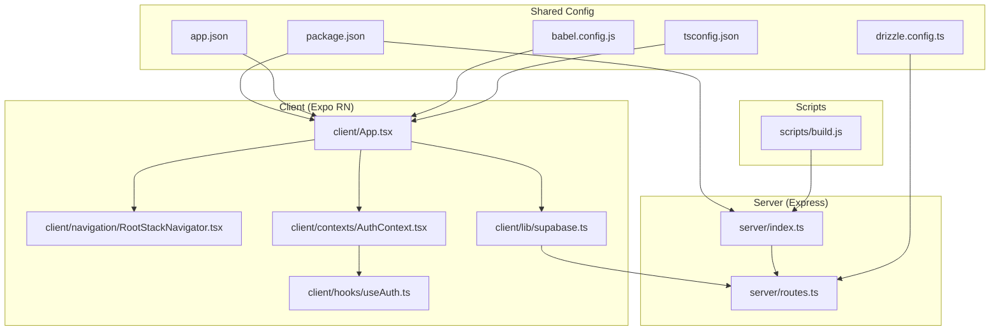
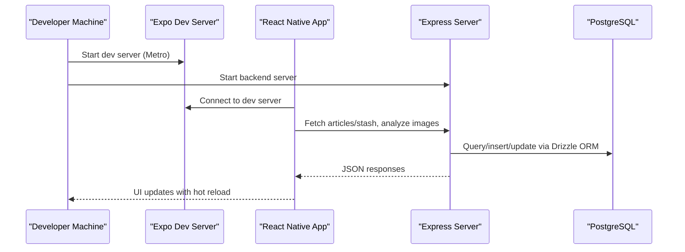
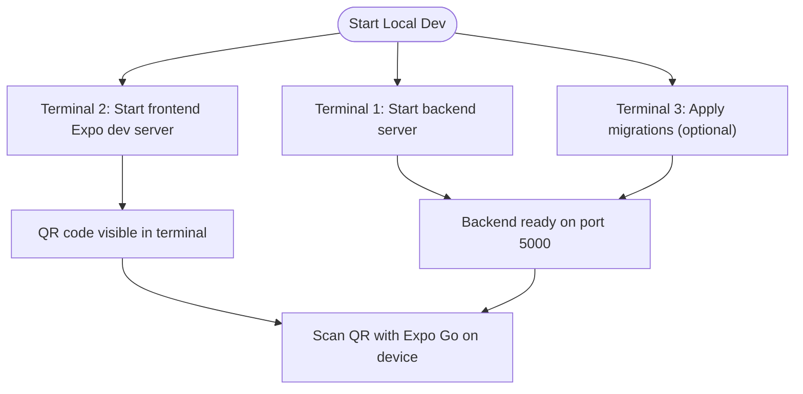
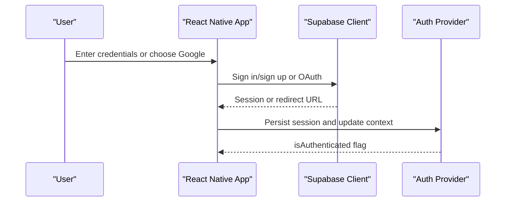
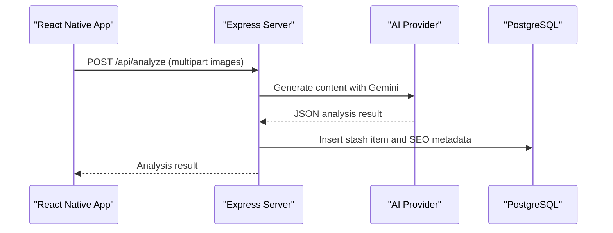
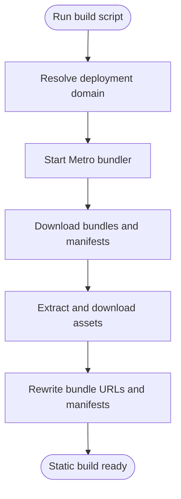
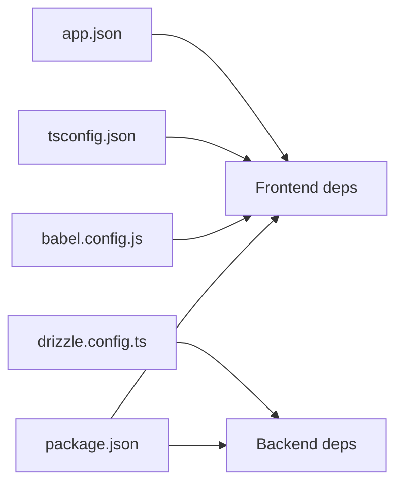

# Getting Started

<cite>
**Referenced Files in This Document**
- [package.json](file://package.json)
- [app.json](file://app.json)
- [ENVIRONMENT.md](file://ENVIRONMENT.md)
- [replit.md](file://replit.md)
- [babel.config.js](file://babel.config.js)
- [tsconfig.json](file://tsconfig.json)
- [server/index.ts](file://server/index.ts)
- [server/routes.ts](file://server/routes.ts)
- [client/App.tsx](file://client/App.tsx)
- [client/navigation/RootStackNavigator.tsx](file://client/navigation/RootStackNavigator.tsx)
- [client/lib/supabase.ts](file://client/lib/supabase.ts)
- [client/contexts/AuthContext.tsx](file://client/contexts/AuthContext.tsx)
- [client/hooks/useAuth.ts](file://client/hooks/useAuth.ts)
- [scripts/build.js](file://scripts/build.js)
- [drizzle.config.ts](file://drizzle.config.ts)
</cite>

## Table of Contents
1. [Introduction](#introduction)
2. [Project Structure](#project-structure)
3. [Core Components](#core-components)
4. [Architecture Overview](#architecture-overview)
5. [Detailed Component Analysis](#detailed-component-analysis)
6. [Dependency Analysis](#dependency-analysis)
7. [Performance Considerations](#performance-considerations)
8. [Troubleshooting Guide](#troubleshooting-guide)
9. [Conclusion](#conclusion)
10. [Appendices](#appendices)

## Introduction
This guide helps you set up a complete development environment for Hidden-Gem, a React Native + Expo frontend paired with an Express backend. You will install prerequisites, configure environment variables, install dependencies, run both servers, connect devices, and resolve common setup issues. It also covers optional cloud-based development via Replit and provides verification steps to ensure everything is working.

## Project Structure
Hidden-Gem is organized into a frontend (client) and a backend (server), with shared configuration and scripts supporting development and production builds.

**Diagram sources**
- [client/App.tsx](file://client/App.tsx#L1-L67)
- [client/navigation/RootStackNavigator.tsx](file://client/navigation/RootStackNavigator.tsx#L1-L133)
- [client/lib/supabase.ts](file://client/lib/supabase.ts#L1-L39)
- [client/contexts/AuthContext.tsx](file://client/contexts/AuthContext.tsx#L1-L31)
- [client/hooks/useAuth.ts](file://client/hooks/useAuth.ts#L1-L151)
- [server/index.ts](file://server/index.ts#L1-L262)
- [server/routes.ts](file://server/routes.ts#L1-L929)
- [package.json](file://package.json#L1-L95)
- [app.json](file://app.json#L1-L52)
- [babel.config.js](file://babel.config.js#L1-L21)
- [tsconfig.json](file://tsconfig.json#L1-L15)
- [drizzle.config.ts](file://drizzle.config.ts#L1-L19)
- [scripts/build.js](file://scripts/build.js#L1-L562)

**Section sources**
- [package.json](file://package.json#L1-L95)
- [app.json](file://app.json#L1-L52)
- [ENVIRONMENT.md](file://ENVIRONMENT.md#L115-L144)

## Core Components
- Frontend (Expo + React Native)
  - Entry point initializes providers, theme, and navigation.
  - Authentication uses Supabase with secure storage and OAuth flows.
- Backend (Express)
  - CORS, logging, and request parsing middleware.
  - Routes expose APIs for articles, stash inventory, AI analysis, marketplace publishing, and notifications.
- Shared configuration
  - Babel aliases for modular imports.
  - TypeScript path mapping aligned with Expo’s base config.
  - Drizzle ORM configuration for PostgreSQL migrations.

**Section sources**
- [client/App.tsx](file://client/App.tsx#L1-L67)
- [client/contexts/AuthContext.tsx](file://client/contexts/AuthContext.tsx#L1-L31)
- [client/hooks/useAuth.ts](file://client/hooks/useAuth.ts#L1-L151)
- [server/index.ts](file://server/index.ts#L1-L262)
- [server/routes.ts](file://server/routes.ts#L1-L929)
- [babel.config.js](file://babel.config.js#L1-L21)
- [tsconfig.json](file://tsconfig.json#L1-L15)
- [drizzle.config.ts](file://drizzle.config.ts#L1-L19)

## Architecture Overview
Hidden-Gem uses a dual-server architecture:
- Frontend runs via Expo Dev Server (Metro) and communicates with the backend API.
- Backend serves API routes, integrates AI providers, and manages PostgreSQL via Drizzle ORM.
- Supabase handles authentication and session persistence.

**Diagram sources**
- [server/index.ts](file://server/index.ts#L227-L261)
- [server/routes.ts](file://server/routes.ts#L184-L286)
- [client/App.tsx](file://client/App.tsx#L1-L67)

## Detailed Component Analysis

### Environment Setup and Prerequisites
- Node.js: v18 or higher.
- Expo CLI: Install globally or use npx.
- Git: For version control.
- Optional: Replit account for integrated services (PostgreSQL, AI, secrets management).

Install dependencies:
- Use your preferred package manager to install dependencies from the project root.

Configure environment variables:
- Required for database, Supabase, session management, and AI integrations.
- On Replit, secrets are managed in the Secrets panel; others are auto-configured.

Start development servers:
- Backend: Runs on port 5000.
- Frontend: Runs on port 8081 and exposes a QR code for device testing.

Database setup:
- Apply migrations using the provided script.

Verification:
- Confirm both servers are reachable and the app loads with hot reloading.

**Section sources**
- [ENVIRONMENT.md](file://ENVIRONMENT.md#L5-L11)
- [ENVIRONMENT.md](file://ENVIRONMENT.md#L69-L114)
- [ENVIRONMENT.md](file://ENVIRONMENT.md#L91-L99)

### Running the Development Servers Locally
- Terminal 1: Start the backend server.
- Terminal 2: Start the frontend Expo dev server.
- Terminal 3 (optional): Apply database migrations.

**Diagram sources**
- [ENVIRONMENT.md](file://ENVIRONMENT.md#L75-L113)

**Section sources**
- [ENVIRONMENT.md](file://ENVIRONMENT.md#L75-L113)

### Connecting Devices and Using Expo Go
- Start the frontend dev server.
- On iOS: open the device camera and scan the QR code shown in the terminal.
- On Android: open the Expo Go app and scan the QR code.
- The app opens with hot reloading enabled.

**Section sources**
- [ENVIRONMENT.md](file://ENVIRONMENT.md#L150-L158)

### Cloud-Based Development with Replit
- Use the integrated Replit environment for seamless backend and database services.
- Secrets are managed in the Replit dashboard.
- The backend supports dynamic origins and localhost for web development.

**Section sources**
- [ENVIRONMENT.md](file://ENVIRONMENT.md#L1-L3)
- [ENVIRONMENT.md](file://ENVIRONMENT.md#L159-L164)
- [server/index.ts](file://server/index.ts#L19-L56)

### Authentication Flow (Supabase)
The app initializes a Supabase client using public keys and manages sessions via AsyncStorage on native platforms. OAuth with Google is supported across platforms.

**Diagram sources**
- [client/lib/supabase.ts](file://client/lib/supabase.ts#L1-L39)
- [client/hooks/useAuth.ts](file://client/hooks/useAuth.ts#L12-L151)
- [client/contexts/AuthContext.tsx](file://client/contexts/AuthContext.tsx#L1-L31)

**Section sources**
- [client/lib/supabase.ts](file://client/lib/supabase.ts#L1-L39)
- [client/hooks/useAuth.ts](file://client/hooks/useAuth.ts#L1-L151)
- [client/contexts/AuthContext.tsx](file://client/contexts/AuthContext.tsx#L1-L31)

### Backend API and Data Access
The backend exposes routes for:
- Articles and stash inventory
- Image analysis via AI providers
- Publishing to marketplace APIs (WooCommerce, eBay)
- Notifications and push token management

**Diagram sources**
- [server/routes.ts](file://server/routes.ts#L299-L385)
- [server/routes.ts](file://server/routes.ts#L387-L455)
- [server/routes.ts](file://server/routes.ts#L457-L647)

**Section sources**
- [server/routes.ts](file://server/routes.ts#L184-L286)
- [server/routes.ts](file://server/routes.ts#L299-L385)
- [server/routes.ts](file://server/routes.ts#L387-L455)
- [server/routes.ts](file://server/routes.ts#L457-L647)

### Build and Static Deployment Script
The build script prepares a static bundle for Expo Go deployment, downloading manifests and assets, updating URLs, and cleaning up.

**Diagram sources**
- [scripts/build.js](file://scripts/build.js#L497-L553)

**Section sources**
- [scripts/build.js](file://scripts/build.js#L1-L562)

## Dependency Analysis
- Frontend dependencies include Expo SDK, React Navigation, Supabase client, React Query, and platform-specific modules.
- Backend depends on Express, Drizzle ORM, Multer for uploads, and Google GenAI integration.
- Shared configuration aligns Babel and TypeScript path aliases to client and shared directories.

**Diagram sources**
- [package.json](file://package.json#L24-L76)
- [babel.config.js](file://babel.config.js#L1-L21)
- [tsconfig.json](file://tsconfig.json#L1-L15)
- [drizzle.config.ts](file://drizzle.config.ts#L1-L19)
- [app.json](file://app.json#L1-L52)

**Section sources**
- [package.json](file://package.json#L24-L76)
- [babel.config.js](file://babel.config.js#L1-L21)
- [tsconfig.json](file://tsconfig.json#L1-L15)
- [drizzle.config.ts](file://drizzle.config.ts#L1-L19)
- [app.json](file://app.json#L1-L52)

## Performance Considerations
- Keep Metro cache clean if builds stall during static builds.
- Limit image sizes for uploads to reduce latency.
- Use production builds for performance profiling and reduced overhead.

[No sources needed since this section provides general guidance]

## Troubleshooting Guide
Common issues and resolutions:
- Ports already in use
  - Backend (5000): terminate the process occupying the port.
  - Frontend (8081): terminate the process occupying the port.
- Database connection issues
  - Verify DATABASE_URL is set and PostgreSQL is reachable.
- Hot reload not working
  - Restart the Expo dev server.
  - Clear caches and restart.
- Supabase authentication fails
  - Verify EXPO_PUBLIC_SUPABASE_URL and keys are set.
  - On Replit, confirm secrets are configured.
- AI features not working
  - Ensure AI_INTEGRATIONS_GEMINI_API_KEY and base URL are configured.
  - Check quotas and server logs.

**Section sources**
- [ENVIRONMENT.md](file://ENVIRONMENT.md#L172-L195)

## Conclusion
You now have a complete understanding of how to set up Hidden-Gem locally and in the cloud, how to run both servers, connect devices, and troubleshoot common issues. Use the verification steps to confirm your environment is ready, and refer to the environment guide for ongoing maintenance and development workflows.

[No sources needed since this section summarizes without analyzing specific files]

## Appendices

### Environment Variable Reference
- Database
  - DATABASE_URL: PostgreSQL connection string
- Supabase Authentication
  - EXPO_PUBLIC_SUPABASE_URL: Supabase project URL
  - EXPO_PUBLIC_SUPABASE_ANON_KEY: Supabase anonymous public key
  - SUPABASE_ANON_KEY: Supabase key for server-side use
- Session Management
  - SESSION_SECRET: Express session encryption secret
- Replit AI Integrations (Google Gemini)
  - AI_INTEGRATIONS_GEMINI_API_KEY: Gemini API key
  - AI_INTEGRATIONS_GEMINI_BASE_URL: Gemini API base URL
- Replit PostgreSQL (auto-configured)
  - PGHOST, PGPORT, PGUSER, PGPASSWORD, PGDATABASE

**Section sources**
- [ENVIRONMENT.md](file://ENVIRONMENT.md#L12-L68)

### Platform-Specific Notes
- iOS
  - Camera and photo library permissions are declared in app configuration.
  - Use the device camera to scan the Expo QR code.
- Android
  - Use the Expo Go app to scan the QR code.
- Web
  - The app can be tested on web with limited native capabilities.

**Section sources**
- [app.json](file://app.json#L11-L27)
- [ENVIRONMENT.md](file://ENVIRONMENT.md#L148-L171)