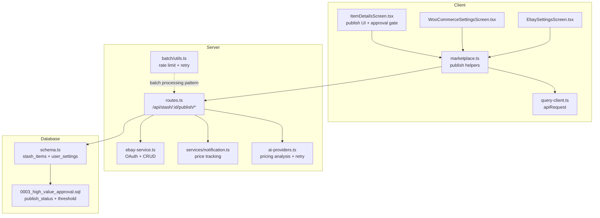
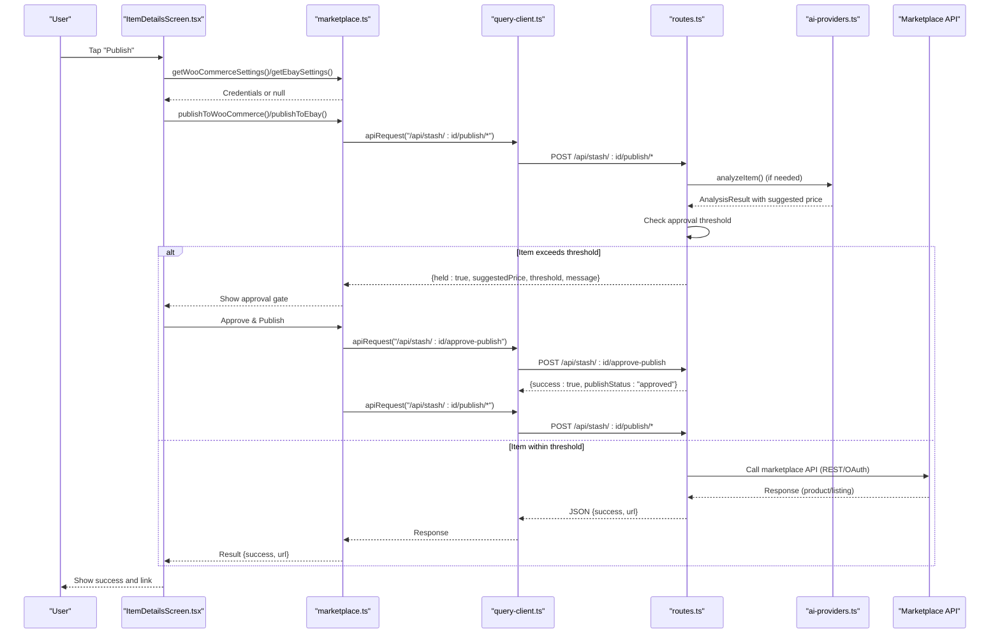
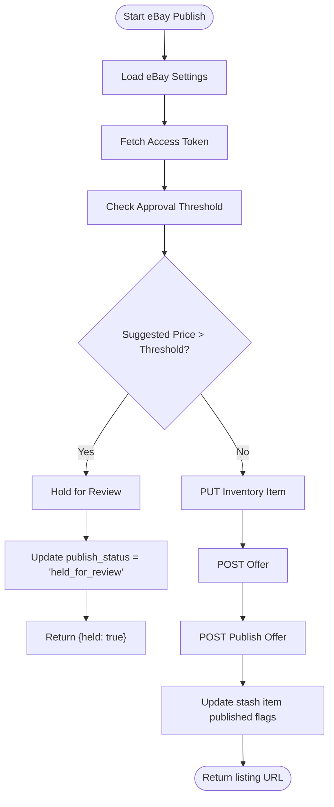
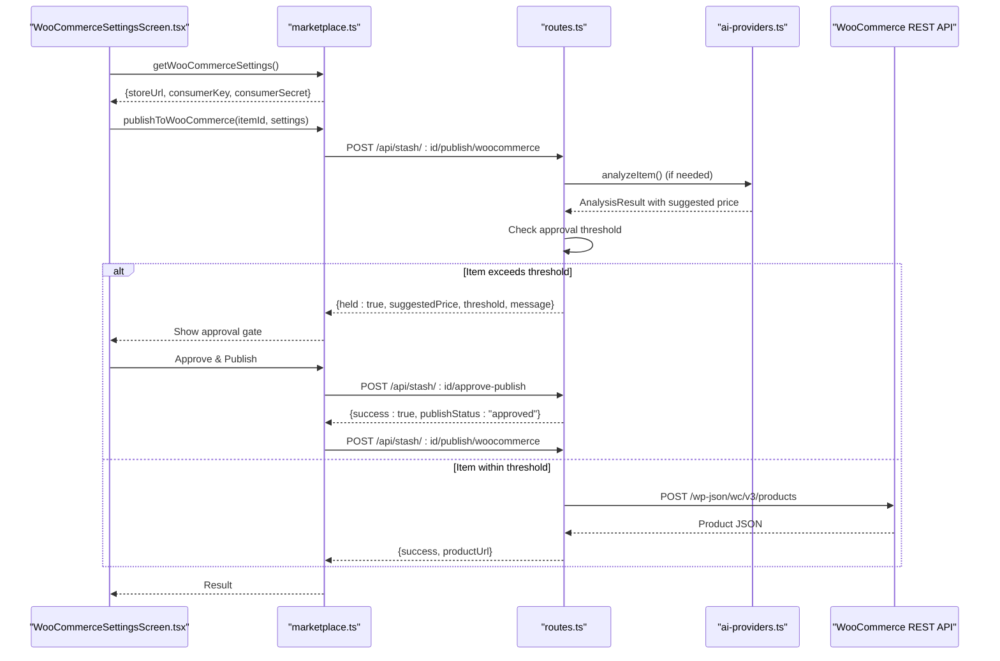
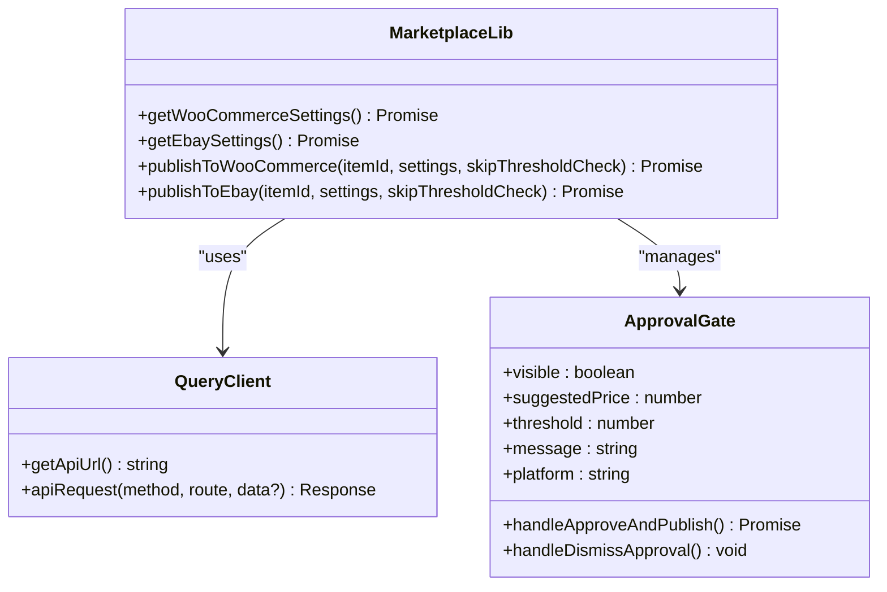
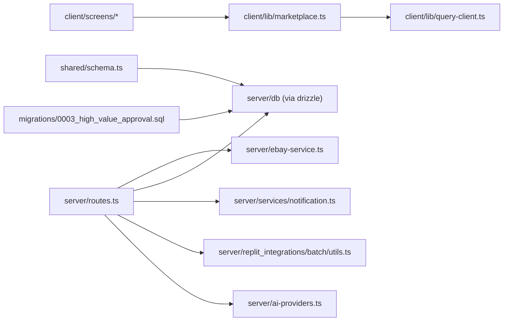

# Marketplace Integration

<cite>
**Referenced Files in This Document**
- [marketplace.ts](file://client/lib/marketplace.ts)
- [WooCommerceSettingsScreen.tsx](file://client/screens/WooCommerceSettingsScreen.tsx)
- [EbaySettingsScreen.tsx](file://client/screens/EbaySettingsScreen.tsx)
- [ItemDetailsScreen.tsx](file://client/screens/ItemDetailsScreen.tsx)
- [query-client.ts](file://client/lib/query-client.ts)
- [ebay-service.ts](file://server/ebay-service.ts)
- [routes.ts](file://server/routes.ts)
- [notification.ts](file://server/services/notification.ts)
- [batch/utils.ts](file://server/replit_integrations/batch/utils.ts)
- [ai-providers.ts](file://server/ai-providers.ts)
- [schema.ts](file://shared/schema.ts)
- [0003_high_value_approval.sql](file://migrations/0003_high_value_approval.sql)
- [ENVIRONMENT.md](file://ENVIRONMENT.md)
- [package.json](file://package.json)
- [ebay_settings_flow.yml](file://.maestro/ebay_settings_flow.yml)
- [woocommerce_settings_flow.yml](file://.maestro/woocommerce_settings_flow.yml)
</cite>

## Update Summary
**Changes Made**
- Enhanced marketplace publishing workflows with high-value approval gate integration
- Improved conditional approval checks with user-configurable thresholds
- Added detailed feedback system for items held for review
- Integrated AI analysis for suggested pricing with comprehensive valuation data
- Implemented approval gate UI with detailed price comparison and user controls
- Added publish status tracking for draft, held_for_review, and approved states

## Table of Contents
1. [Introduction](#introduction)
2. [Project Structure](#project-structure)
3. [Core Components](#core-components)
4. [Architecture Overview](#architecture-overview)
5. [Detailed Component Analysis](#detailed-component-analysis)
6. [Enhanced Approval Gate System](#enhanced-approval-gate-system)
7. [AI Analysis Integration](#ai-analysis-integration)
8. [Dependency Analysis](#dependency-analysis)
9. [Performance Considerations](#performance-considerations)
10. [Troubleshooting Guide](#troubleshooting-guide)
11. [Conclusion](#conclusion)
12. [Appendices](#appendices)

## Introduction
This document explains the marketplace integration for eBay and WooCommerce within the HiddenGem application. It covers how the client app connects to these marketplaces, how the backend orchestrates API calls, and how the unified marketplace interface enables multi-platform publishing. The system now features an enhanced approval gate mechanism for high-value items, AI-powered pricing analysis, and comprehensive approval workflows. It also documents settings management, security considerations, error handling, rate limiting, and retry mechanisms, along with price tracking and automated workflows.

## Project Structure
The marketplace integration spans three primary areas:
- Client library for marketplace operations and settings retrieval
- Screens for configuring marketplace credentials and testing connections
- Server routes that proxy marketplace APIs and manage publishing workflows
- AI analysis engine for pricing suggestions and item authentication
- Approval gate system for high-value item oversight
- Supporting services for notifications and batch processing

**Diagram sources**
- [marketplace.ts:1-139](file://client/lib/marketplace.ts#L1-L139)
- [query-client.ts:1-80](file://client/lib/query-client.ts#L1-L80)
- [WooCommerceSettingsScreen.tsx:1-512](file://client/screens/WooCommerceSettingsScreen.tsx#L1-L512)
- [EbaySettingsScreen.tsx:1-568](file://client/screens/EbaySettingsScreen.tsx#L1-L568)
- [ItemDetailsScreen.tsx:539-600](file://client/screens/ItemDetailsScreen.tsx#L539-L600)
- [routes.ts:456-760](file://server/routes.ts#L456-L760)
- [ebay-service.ts:1-474](file://server/ebay-service.ts#L1-L474)
- [notification.ts:162-366](file://server/services/notification.ts#L162-L366)
- [batch/utils.ts:1-160](file://server/replit_integrations/batch/utils.ts#L1-L160)
- [ai-providers.ts:1-840](file://server/ai-providers.ts#L1-L840)
- [schema.ts:14-55](file://shared/schema.ts#L14-L55)
- [0003_high_value_approval.sql:1-3](file://migrations/0003_high_value_approval.sql#L1-L3)

**Section sources**
- [marketplace.ts:1-139](file://client/lib/marketplace.ts#L1-L139)
- [WooCommerceSettingsScreen.tsx:1-512](file://client/screens/WooCommerceSettingsScreen.tsx#L1-L512)
- [EbaySettingsScreen.tsx:1-568](file://client/screens/EbaySettingsScreen.tsx#L1-L568)
- [ItemDetailsScreen.tsx:539-600](file://client/screens/ItemDetailsScreen.tsx#L539-L600)
- [routes.ts:456-760](file://server/routes.ts#L456-L760)
- [ebay-service.ts:1-474](file://server/ebay-service.ts#L1-L474)
- [notification.ts:162-366](file://server/services/notification.ts#L162-L366)
- [batch/utils.ts:1-160](file://server/replit_integrations/batch/utils.ts#L1-L160)
- [ai-providers.ts:1-840](file://server/ai-providers.ts#L1-L840)
- [schema.ts:14-55](file://shared/schema.ts#L14-L55)
- [0003_high_value_approval.sql:1-3](file://migrations/0003_high_value_approval.sql#L1-L3)

## Core Components
- Unified marketplace interface in the client:
  - Retrieves stored credentials for eBay and WooCommerce
  - Publishes items to selected platforms via the backend
  - Handles approval gate workflows for high-value items
- Enhanced approval gate system:
  - Configurable high-value thresholds per user
  - Automatic item hold for items exceeding suggested price thresholds
  - Detailed feedback and approval UI for manual review
- AI-powered pricing analysis:
  - Comprehensive item authentication and valuation
  - Suggested listing prices with confidence scores
  - Market analysis and authentication guidance
- Settings screens:
  - Securely stores credentials using platform-specific secure storage on native devices
  - Tests connectivity against marketplace APIs
  - Manages approval threshold configuration
- Server-side orchestration:
  - Validates item state and credentials
  - Calls marketplace APIs (WooCommerce REST and eBay APIs)
  - Persists publication metadata and returns URLs
  - Implements approval gate logic with conditional checks
- eBay service utilities:
  - Handles OAuth token acquisition and refresh
  - Implements inventory and listing CRUD operations
- Notifications and price tracking:
  - Enables/disables price tracking and schedules periodic checks
- Batch processing utilities:
  - Provides concurrency control and exponential backoff for rate-limited operations

**Section sources**
- [marketplace.ts:1-139](file://client/lib/marketplace.ts#L1-L139)
- [WooCommerceSettingsScreen.tsx:1-512](file://client/screens/WooCommerceSettingsScreen.tsx#L1-L512)
- [EbaySettingsScreen.tsx:1-568](file://client/screens/EbaySettingsScreen.tsx#L1-L568)
- [routes.ts:456-760](file://server/routes.ts#L456-L760)
- [ebay-service.ts:1-474](file://server/ebay-service.ts#L1-L474)
- [notification.ts:162-366](file://server/services/notification.ts#L162-L366)
- [batch/utils.ts:1-160](file://server/replit_integrations/batch/utils.ts#L1-L160)
- [ai-providers.ts:1-840](file://server/ai-providers.ts#L1-L840)
- [schema.ts:14-55](file://shared/schema.ts#L14-L55)

## Architecture Overview
The client app exposes a unified publishing interface with enhanced approval gate functionality. When a user chooses a platform, the client retrieves stored credentials and posts to the backend's publish endpoint. The backend validates the request, performs AI analysis if needed, checks approval thresholds, and either publishes immediately or holds the item for review. The approval gate system provides detailed feedback and manual approval controls.

**Diagram sources**
- [ItemDetailsScreen.tsx:274-291](file://client/screens/ItemDetailsScreen.tsx#L274-L291)
- [marketplace.ts:81-139](file://client/lib/marketplace.ts#L81-L139)
- [query-client.ts:26-43](file://client/lib/query-client.ts#L26-L43)
- [routes.ts:456-760](file://server/routes.ts#L456-L760)
- [ebay-service.ts:42-62](file://server/ebay-service.ts#L42-L62)
- [ai-providers.ts:437-455](file://server/ai-providers.ts#L437-L455)

## Detailed Component Analysis

### eBay Integration
- OAuth and token management:
  - Access tokens are fetched using a refresh token against eBay identity endpoints
  - A dedicated refresh utility returns updated tokens and expiry timestamps
- Listing lifecycle:
  - Inventory item creation via PUT to inventory_item SKU endpoint
  - Offer creation via POST to offer endpoint
  - Listing publication via POST to offer publish endpoint
  - Listing deletion and updates supported
- Category mapping:
  - Application categories are mapped to eBay category IDs for listings
- Client-side integration:
  - Credentials are retrieved from secure storage
  - Publishing posts to backend with environment and refresh token
  - Backend returns listing URL and identifiers
- Enhanced approval gate integration:
  - Automatic approval threshold checking during publishing
  - Items exceeding suggested price thresholds are held for review
  - Manual approval required for high-value items

**Diagram sources**
- [routes.ts:548-760](file://server/routes.ts#L548-L760)
- [ebay-service.ts:42-62](file://server/ebay-service.ts#L42-L62)
- [ebay-service.ts:534-642](file://server/ebay-service.ts#L534-L642)

**Section sources**
- [ebay-service.ts:1-474](file://server/ebay-service.ts#L1-L474)
- [routes.ts:548-760](file://server/routes.ts#L548-L760)
- [marketplace.ts:110-139](file://client/lib/marketplace.ts#L110-L139)
- [EbaySettingsScreen.tsx:1-568](file://client/screens/EbaySettingsScreen.tsx#L1-L568)

### WooCommerce Integration
- REST API configuration:
  - Consumer key and secret are validated against the store's system status endpoint
  - Store URL is normalized and persisted
- Product publishing:
  - Backend constructs a product payload using stash item data
  - Posts to the WooCommerce products endpoint
  - Updates stash item with published flag and product permalink
- Enhanced approval gate integration:
  - Automatic approval threshold checking during publishing
  - Items exceeding suggested price thresholds are held for review
  - Manual approval required for high-value items
- Client-side integration:
  - Settings screen saves credentials securely
  - Publishing triggers backend endpoint and displays product URL

**Diagram sources**
- [WooCommerceSettingsScreen.tsx:1-512](file://client/screens/WooCommerceSettingsScreen.tsx#L1-L512)
- [marketplace.ts:81-108](file://client/lib/marketplace.ts#L81-L108)
- [routes.ts:456-546](file://server/routes.ts#L456-L546)
- [ai-providers.ts:437-455](file://server/ai-providers.ts#L437-L455)

**Section sources**
- [routes.ts:456-546](file://server/routes.ts#L456-L546)
- [WooCommerceSettingsScreen.tsx:1-512](file://client/screens/WooCommerceSettingsScreen.tsx#L1-L512)
- [marketplace.ts:19-44](file://client/lib/marketplace.ts#L19-L44)

### Unified Marketplace Interface
- Settings retrieval:
  - Platform-aware secure storage for credentials
  - Status flags indicate whether a platform is connected
- Enhanced publishing workflow:
  - UI gates publishing based on connection status
  - Calls platform-specific publish helpers with approval gate integration
  - Displays success with product/listing URL
  - Handles approval gate UI for high-value items
- Approval gate integration:
  - Automatic detection of items requiring manual approval
  - Detailed price comparison and threshold display
  - Manual approval controls with cancel and confirm actions

**Diagram sources**
- [marketplace.ts:1-139](file://client/lib/marketplace.ts#L1-L139)
- [query-client.ts:1-80](file://client/lib/query-client.ts#L1-L80)
- [ItemDetailsScreen.tsx:274-291](file://client/screens/ItemDetailsScreen.tsx#L274-L291)

**Section sources**
- [marketplace.ts:1-139](file://client/lib/marketplace.ts#L1-L139)
- [query-client.ts:1-80](file://client/lib/query-client.ts#L1-L80)
- [ItemDetailsScreen.tsx:562-600](file://client/screens/ItemDetailsScreen.tsx#L562-L600)

### Settings Management and Security
- Credential storage:
  - Native devices use secure storage; web uses AsyncStorage
  - Status flags prevent accidental publishing without credentials
- Enhanced approval threshold management:
  - User-configurable high-value approval thresholds
  - Default threshold of $500 for new users
  - Per-user threshold settings stored in database
- Environment separation:
  - eBay supports sandbox and production environments
- Testing connections:
  - Direct API calls validate credentials before saving
- Environment variables:
  - Marketplace credentials are stored locally per device, not in environment variables

**Section sources**
- [WooCommerceSettingsScreen.tsx:1-512](file://client/screens/WooCommerceSettingsScreen.tsx#L1-L512)
- [EbaySettingsScreen.tsx:1-568](file://client/screens/EbaySettingsScreen.tsx#L1-L568)
- [routes.ts:387-420](file://server/routes.ts#L387-L420)
- [ENVIRONMENT.md:54-68](file://ENVIRONMENT.md#L54-L68)

### Order Management and Real-Time Updates
- Notification service:
  - Enables price tracking for stash items
  - Schedules periodic checks and emits alerts on threshold breaches
  - Integrates with approval gate system for high-value item notifications
- Real-time updates:
  - Push token registration endpoints support real-time notifications
  - Price tracking integrates with notifications for user alerts

**Section sources**
- [notification.ts:162-366](file://server/services/notification.ts#L162-L366)
- [routes.ts:44-129](file://server/routes.ts#L44-L129)

### Listing Synchronization and Automated Workflows
- Enhanced stash item state:
  - Backend tracks publication flags and marketplace identifiers
  - New publish_status field manages draft, held_for_review, and approved states
  - Ensures deduplication and prevents re-publishing
  - Approval gate integration prevents unauthorized high-value publishing
- Automated publishing:
  - UI triggers backend endpoints upon user action
  - Backend performs marketplace-specific steps and persists outcomes
  - Approval gate workflow ensures manual oversight for high-value items
- Approval gate workflow:
  - Automatic detection of items exceeding suggested price thresholds
  - Manual approval required for items held for review
  - Detailed feedback and price comparison for user decision-making

**Section sources**
- [routes.ts:456-760](file://server/routes.ts#L456-L760)
- [ItemDetailsScreen.tsx:539-600](file://client/screens/ItemDetailsScreen.tsx#L539-L600)
- [schema.ts:33-55](file://shared/schema.ts#L33-L55)

## Enhanced Approval Gate System

### Approval Threshold Configuration
The system now features configurable approval thresholds per user, allowing sellers to set their own high-value limits for automatic approval gating.

**Section sources**
- [routes.ts:387-420](file://server/routes.ts#L387-L420)
- [schema.ts:14-31](file://shared/schema.ts#L14-L31)

### Automatic Approval Gate Detection
Items are automatically evaluated against the user's approval threshold during the publishing process. If the suggested listing price exceeds the threshold, the item is held for manual review.

**Section sources**
- [routes.ts:474-494](file://server/routes.ts#L474-L494)
- [routes.ts:572-592](file://server/routes.ts#L572-L592)

### Approval Gate User Interface
The client displays a comprehensive approval gate interface when items exceed the threshold, showing detailed pricing information and requiring explicit user approval.

**Section sources**
- [ItemDetailsScreen.tsx:562-600](file://client/screens/ItemDetailsScreen.tsx#L562-L600)
- [ItemDetailsScreen.tsx:274-291](file://client/screens/ItemDetailsScreen.tsx#L274-L291)

### Approval Gate Workflow
The approval gate workflow provides a structured process for handling high-value items, including detailed feedback, price comparison, and manual approval controls.

**Section sources**
- [ItemDetailsScreen.tsx:274-291](file://client/screens/ItemDetailsScreen.tsx#L274-L291)
- [routes.ts:439-454](file://server/routes.ts#L439-L454)

## AI Analysis Integration

### Comprehensive Pricing Analysis
The AI analysis system provides detailed pricing suggestions, authentication assessments, and market analysis for each item, enabling informed decision-making and optimal pricing strategies.

**Section sources**
- [ai-providers.ts:12-41](file://server/ai-providers.ts#L12-L41)
- [routes.ts:299-385](file://server/routes.ts#L299-L385)

### Enhanced Item Authentication
Advanced authentication analysis helps sellers verify item authenticity and provides guidance for authentication verification, reducing risk and improving buyer confidence.

**Section sources**
- [ai-providers.ts:48-99](file://server/ai-providers.ts#L48-L99)
- [ai-providers.ts:131-180](file://server/ai-providers.ts#L131-L180)

### Retry Analysis System
The system includes a sophisticated retry mechanism that allows sellers to refine AI analysis based on feedback, improving accuracy and providing multiple analysis iterations.

**Section sources**
- [ai-providers.ts:477-503](file://server/ai-providers.ts#L477-L503)
- [routes.ts:785-840](file://server/routes.ts#L785-L840)

### Suggested Pricing Integration
The AI analysis provides comprehensive suggested pricing data, including low/high estimates, confidence scores, and market analysis, directly integrated into the approval gate system.

**Section sources**
- [ai-providers.ts:12-41](file://server/ai-providers.ts#L12-L41)
- [routes.ts:474-494](file://server/routes.ts#L474-L494)
- [routes.ts:572-592](file://server/routes.ts#L572-L592)

## Dependency Analysis
- Client depends on:
  - React Query for API requests and caching
  - Expo SecureStore for native secure storage
  - Platform-specific storage for web compatibility
  - Enhanced approval gate UI components
- Server depends on:
  - Express for routing
  - Drizzle ORM for database operations
  - eBay service utilities for marketplace operations
  - AI providers for pricing analysis and authentication
  - Batch utilities for rate-limited processing patterns
- Database schema includes:
  - New publish_status field for approval gate tracking
  - High-value threshold configuration per user
  - Enhanced stash items table with approval state

**Diagram sources**
- [marketplace.ts:1-139](file://client/lib/marketplace.ts#L1-L139)
- [query-client.ts:1-80](file://client/lib/query-client.ts#L1-L80)
- [routes.ts:1-30](file://server/routes.ts#L1-L30)
- [ebay-service.ts:1-474](file://server/ebay-service.ts#L1-L474)
- [notification.ts:162-366](file://server/services/notification.ts#L162-L366)
- [batch/utils.ts:1-160](file://server/replit_integrations/batch/utils.ts#L1-L160)
- [ai-providers.ts:1-840](file://server/ai-providers.ts#L1-L840)
- [schema.ts:14-55](file://shared/schema.ts#L14-L55)
- [0003_high_value_approval.sql:1-3](file://migrations/0003_high_value_approval.sql#L1-L3)

**Section sources**
- [package.json:24-76](file://package.json#L24-L76)
- [routes.ts:1-30](file://server/routes.ts#L1-L30)
- [ebay-service.ts:1-474](file://server/ebay-service.ts#L1-L474)
- [schema.ts:14-55](file://shared/schema.ts#L14-L55)

## Performance Considerations
- Rate limiting and retries:
  - Batch utilities provide concurrency control and exponential backoff
  - Detects rate limit errors and retries with capped delays
- Query caching:
  - React Query defaults avoid unnecessary network calls
- Network timeouts:
  - Fetch calls rely on platform defaults; consider adding timeout wrappers for reliability
- AI analysis optimization:
  - Retry mechanism reduces failed analysis attempts
  - Configurable provider selection optimizes performance
- Approval gate efficiency:
  - Conditional approval checks prevent unnecessary processing
  - Cached user threshold settings reduce database queries

**Section sources**
- [batch/utils.ts:35-109](file://server/replit_integrations/batch/utils.ts#L35-L109)
- [query-client.ts:66-80](file://client/lib/query-client.ts#L66-L80)
- [ai-providers.ts:723-840](file://server/ai-providers.ts#L723-L840)

## Troubleshooting Guide
- eBay
  - Missing refresh token: Backend requires a refresh token for user OAuth
  - Business policies: Offers may fail if shipping/payment/return policies are not configured in Seller Hub
  - Token errors: Validate Client ID/Secret and environment selection
  - Approval gate issues: Check user threshold settings and approval status
- WooCommerce
  - Authentication failures: Confirm consumer key/secret and REST API enablement
  - URL normalization: Ensure protocol and trailing slash handling
  - Approval gate issues: Verify AI analysis completion and threshold configuration
- AI Analysis
  - Provider connectivity: Test AI provider connections before analysis
  - Retry failures: Check feedback quality and provider configuration
  - Pricing accuracy: Review suggested price vs. user expectations
- General
  - API connectivity: Use settings screens' "Test Connection" buttons
  - Environment variables: Confirm EXPO_PUBLIC_DOMAIN is set for the client API base URL
  - CORS: Server sets CORS dynamically for development domains
  - Approval gate: Check publish_status field and user threshold settings

**Section sources**
- [routes.ts:548-760](file://server/routes.ts#L548-L760)
- [WooCommerceSettingsScreen.tsx:108-146](file://client/screens/WooCommerceSettingsScreen.tsx#L108-L146)
- [EbaySettingsScreen.tsx:112-150](file://client/screens/EbaySettingsScreen.tsx#L112-L150)
- [query-client.ts:7-17](file://client/lib/query-client.ts#L7-L17)
- [ENVIRONMENT.md:12-68](file://ENVIRONMENT.md#L12-L68)
- [ai-providers.ts:723-840](file://server/ai-providers.ts#L723-L840)

## Conclusion
The enhanced marketplace integration provides a comprehensive, secure, and intelligent solution for publishing items to eBay and WooCommerce. The new approval gate system with configurable thresholds ensures proper oversight of high-value items, while AI-powered pricing analysis provides accurate market insights and authentication guidance. The unified interface seamlessly integrates these features with existing marketplace workflows, offering sellers both automation and control. Robust error handling, optional retries, secure storage, and comprehensive approval workflows ensure reliable operation across platforms.

## Appendices

### API Usage Patterns
- Client publish calls:
  - [publishToWooCommerce:81-108](file://client/lib/marketplace.ts#L81-L108)
  - [publishToEbay:110-139](file://client/lib/marketplace.ts#L110-L139)
- Backend endpoints:
  - [POST /api/stash/:id/publish/woocommerce:456-546](file://server/routes.ts#L456-L546)
  - [POST /api/stash/:id/publish/ebay:548-760](file://server/routes.ts#L548-L760)
  - [POST /api/stash/:id/hold-for-review:422-437](file://server/routes.ts#L422-L437)
  - [POST /api/stash/:id/approve-publish:439-454](file://server/routes.ts#L439-L454)
  - [GET /api/settings/threshold:387-420](file://server/routes.ts#L387-L420)

### Security Considerations
- Credential storage:
  - Native: SecureStore; Web: AsyncStorage
  - Status flags prevent publishing without credentials
- Enhanced approval security:
  - User-specific approval thresholds prevent unauthorized high-value publishing
  - Approval gate requires explicit user confirmation
  - Publish status tracking prevents unauthorized re-publishing
- Environment isolation:
  - eBay supports sandbox/production modes
- API base URL:
  - Client enforces EXPO_PUBLIC_DOMAIN presence

**Section sources**
- [marketplace.ts:19-79](file://client/lib/marketplace.ts#L19-L79)
- [ENVIRONMENT.md:54-68](file://ENVIRONMENT.md#L54-L68)
- [query-client.ts:7-17](file://client/lib/query-client.ts#L7-L17)

### Testing and Automation
- Maestro flows:
  - [ebay_settings_flow.yml:1-45](file://.maestro/ebay_settings_flow.yml#L1-L45)
  - [woocommerce_settings_flow.yml:1-45](file://.maestro/woocommerce_settings_flow.yml#L1-L45)
- Batch processing:
  - [batch/utils.ts:1-160](file://server/replit_integrations/batch/utils.ts#L1-L160)
- AI provider testing:
  - [testProviderConnection:723-840](file://server/ai-providers.ts#L723-L840)

**Section sources**
- [.maestro/ebay_settings_flow.yml:1-45](file://.maestro/ebay_settings_flow.yml#L1-L45)
- [.maestro/woocommerce_settings_flow.yml:1-45](file://.maestro/woocommerce_settings_flow.yml#L1-L45)
- [batch/utils.ts:1-160](file://server/replit_integrations/batch/utils.ts#L1-L160)
- [ai-providers.ts:723-840](file://server/ai-providers.ts#L723-L840)

### Database Schema Changes
- [publish_status](file://shared/schema.ts#L48) field added to stash_items table
- [high_value_threshold](file://shared/schema.ts#L28) field added to user_settings table
- Migration script [0003_high_value_approval.sql:1-3](file://migrations/0003_high_value_approval.sql#L1-L3) creates new columns

**Section sources**
- [schema.ts:14-55](file://shared/schema.ts#L14-L55)
- [0003_high_value_approval.sql:1-3](file://migrations/0003_high_value_approval.sql#L1-L3)