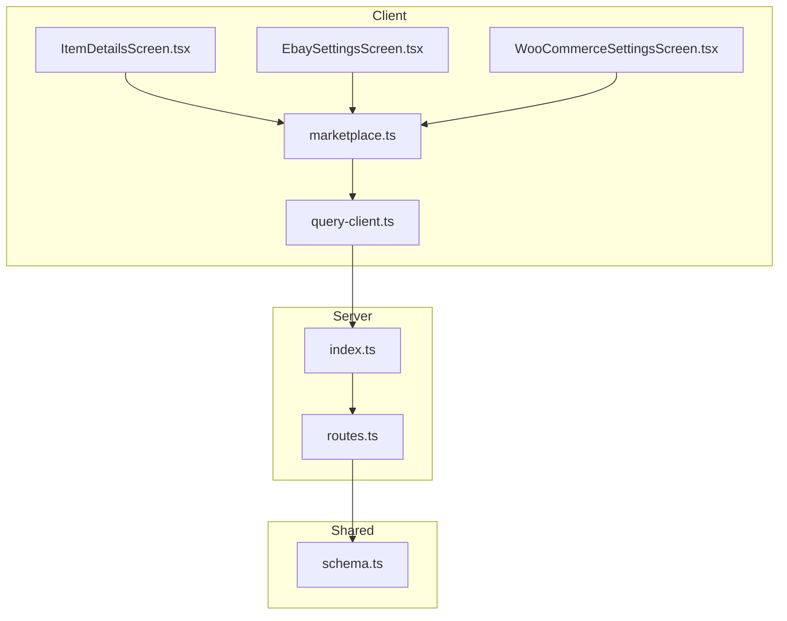
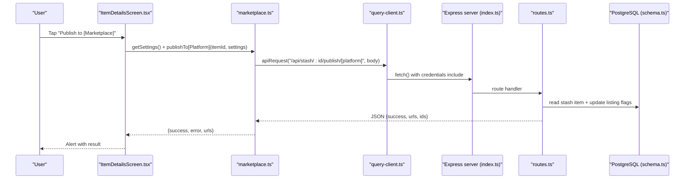
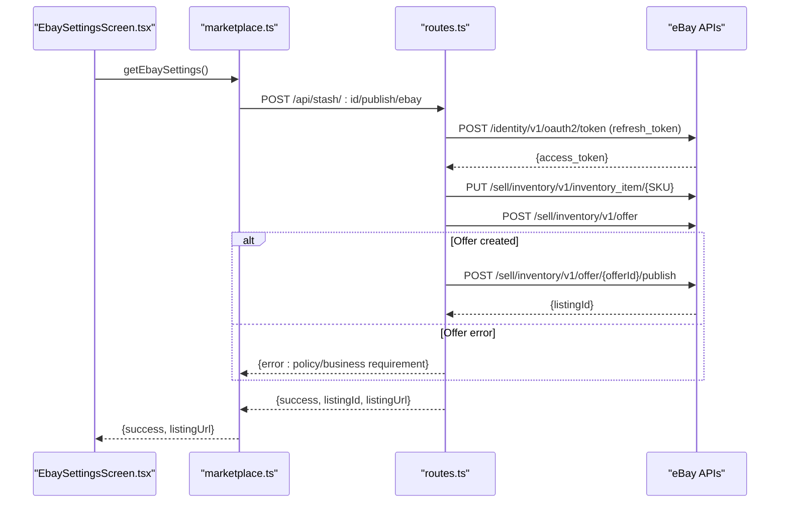
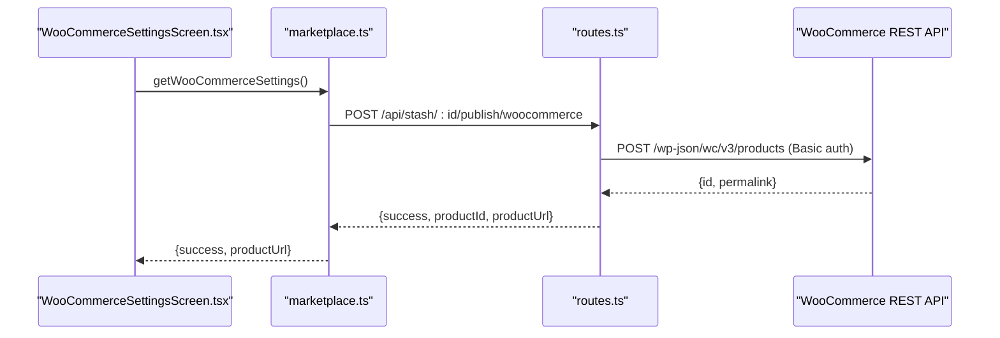
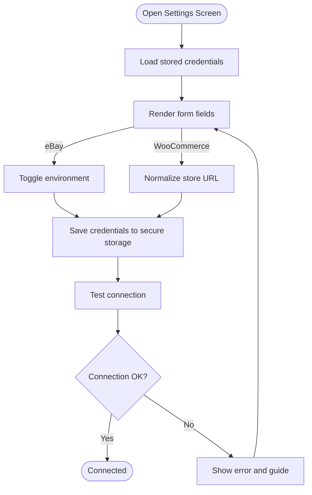
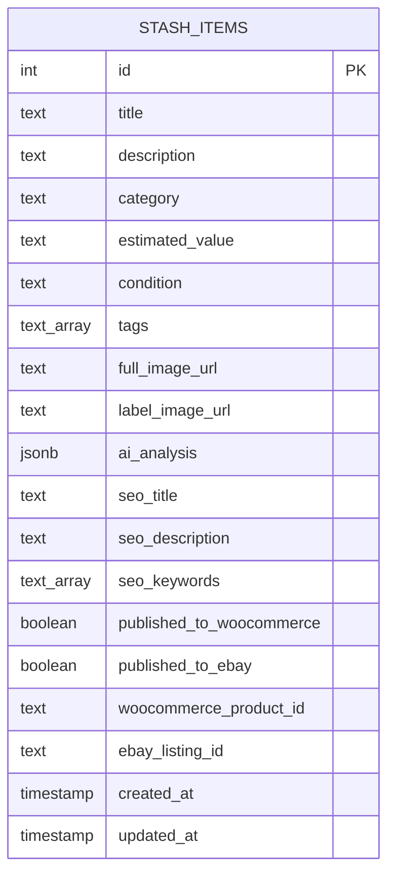
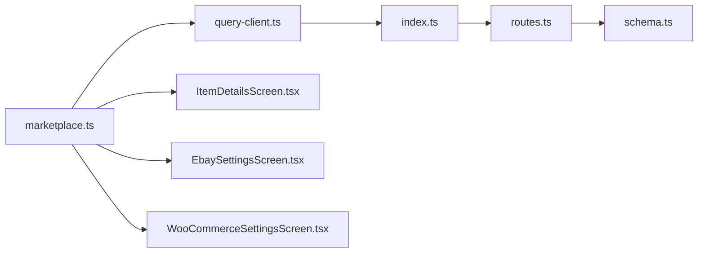

# Marketplace Integration

<cite>
**Referenced Files in This Document**
- [marketplace.ts](file://client/lib/marketplace.ts)
- [query-client.ts](file://client/lib/query-client.ts)
- [EbaySettingsScreen.tsx](file://client/screens/EbaySettingsScreen.tsx)
- [WooCommerceSettingsScreen.tsx](file://client/screens/WooCommerceSettingsScreen.tsx)
- [ItemDetailsScreen.tsx](file://client/screens/ItemDetailsScreen.tsx)
- [routes.ts](file://server/routes.ts)
- [index.ts](file://server/index.ts)
- [schema.ts](file://shared/schema.ts)
- [ebay_settings_flow.yml](file://.maestro/ebay_settings_flow.yml)
- [woocommerce_settings_flow.yml](file://.maestro/woocommerce_settings_flow.yml)
</cite>

## Table of Contents
1. [Introduction](#introduction)
2. [Project Structure](#project-structure)
3. [Core Components](#core-components)
4. [Architecture Overview](#architecture-overview)
5. [Detailed Component Analysis](#detailed-component-analysis)
6. [Dependency Analysis](#dependency-analysis)
7. [Performance Considerations](#performance-considerations)
8. [Troubleshooting Guide](#troubleshooting-guide)
9. [Conclusion](#conclusion)
10. [Appendices](#appendices)

## Introduction
This document explains the marketplace integration for eBay and WooCommerce within the application. It covers OAuth and REST API flows, credential management, listing creation and publishing, inventory synchronization, error handling, and settings management. Practical examples and troubleshooting guidance are included to help developers and operators deploy reliable marketplace listings.

## Project Structure
The marketplace integration spans three layers:
- Client-side UI and helpers for credential entry, local storage, and publishing triggers
- Shared schema for persisted item and listing state
- Server-side routes that proxy marketplace APIs, manage credentials, and update persistence

**Diagram sources**
- [ItemDetailsScreen.tsx](file://client/screens/ItemDetailsScreen.tsx#L105-L197)
- [EbaySettingsScreen.tsx](file://client/screens/EbaySettingsScreen.tsx#L75-L110)
- [WooCommerceSettingsScreen.tsx](file://client/screens/WooCommerceSettingsScreen.tsx#L68-L106)
- [marketplace.ts](file://client/lib/marketplace.ts#L81-L128)
- [query-client.ts](file://client/lib/query-client.ts#L26-L43)
- [routes.ts](file://server/routes.ts#L228-L488)
- [index.ts](file://server/index.ts#L24-L53)
- [schema.ts](file://shared/schema.ts#L29-L50)

**Section sources**
- [marketplace.ts](file://client/lib/marketplace.ts#L1-L129)
- [query-client.ts](file://client/lib/query-client.ts#L1-L80)
- [routes.ts](file://server/routes.ts#L228-L488)
- [schema.ts](file://shared/schema.ts#L29-L50)

## Core Components
- Credential storage and retrieval:
  - Local secure storage for credentials and environment selection
  - Platform-aware storage (device secure store vs. async storage)
- Publishing clients:
  - Publish to WooCommerce via REST API
  - Publish to eBay via OAuth token exchange and inventory/offer APIs
- Settings screens:
  - eBay: environment toggle, optional refresh token, connection test
  - WooCommerce: store URL, consumer key/secret, connection test
- Persistence:
  - Item state and listing identifiers stored in shared schema

**Section sources**
- [marketplace.ts](file://client/lib/marketplace.ts#L19-L79)
- [EbaySettingsScreen.tsx](file://client/screens/EbaySettingsScreen.tsx#L75-L150)
- [WooCommerceSettingsScreen.tsx](file://client/screens/WooCommerceSettingsScreen.tsx#L68-L146)
- [schema.ts](file://shared/schema.ts#L29-L50)

## Architecture Overview
End-to-end publishing flow from the client to marketplace APIs:

**Diagram sources**
- [ItemDetailsScreen.tsx](file://client/screens/ItemDetailsScreen.tsx#L105-L197)
- [marketplace.ts](file://client/lib/marketplace.ts#L81-L128)
- [query-client.ts](file://client/lib/query-client.ts#L26-L43)
- [routes.ts](file://server/routes.ts#L228-L488)
- [schema.ts](file://shared/schema.ts#L29-L50)

## Detailed Component Analysis

### eBay Integration
- OAuth and token exchange:
  - Uses refresh token to obtain access token from identity endpoint
  - Environment switch between sandbox and production
- Inventory and listing creation:
  - Creates inventory item with SKU, condition, and product metadata
  - Posts offer with pricing, policies placeholder, and merchant location
  - Publishes offer to create listing; resolves listing URL
- Settings management:
  - Environment toggle, optional refresh token, connection test
  - Secure storage of client credentials and refresh token

**Diagram sources**
- [EbaySettingsScreen.tsx](file://client/screens/EbaySettingsScreen.tsx#L112-L150)
- [marketplace.ts](file://client/lib/marketplace.ts#L105-L128)
- [routes.ts](file://server/routes.ts#L298-L488)

**Section sources**
- [EbaySettingsScreen.tsx](file://client/screens/EbaySettingsScreen.tsx#L27-L187)
- [marketplace.ts](file://client/lib/marketplace.ts#L46-L79)
- [routes.ts](file://server/routes.ts#L298-L488)

### WooCommerce Integration
- REST API publishing:
  - Validates credentials and item existence
  - Prevents duplicate publishing
  - Sends product payload with title, price, description, and image
  - Updates item with product ID and permalink
- Settings management:
  - Store URL normalization and secure storage
  - Consumer key/secret with connection test

**Diagram sources**
- [WooCommerceSettingsScreen.tsx](file://client/screens/WooCommerceSettingsScreen.tsx#L108-L146)
- [marketplace.ts](file://client/lib/marketplace.ts#L81-L103)
- [routes.ts](file://server/routes.ts#L228-L296)

**Section sources**
- [WooCommerceSettingsScreen.tsx](file://client/screens/WooCommerceSettingsScreen.tsx#L26-L180)
- [marketplace.ts](file://client/lib/marketplace.ts#L19-L44)
- [routes.ts](file://server/routes.ts#L228-L296)

### Settings Screens and Credential Management
- eBay:
  - Environment toggle (sandbox/production)
  - Optional refresh token for user OAuth
  - Connection test against identity endpoint
- WooCommerce:
  - Store URL normalization
  - Consumer key/secret
  - Connection test against system status endpoint

**Diagram sources**
- [EbaySettingsScreen.tsx](file://client/screens/EbaySettingsScreen.tsx#L44-L110)
- [WooCommerceSettingsScreen.tsx](file://client/screens/WooCommerceSettingsScreen.tsx#L43-L106)

**Section sources**
- [EbaySettingsScreen.tsx](file://client/screens/EbaySettingsScreen.tsx#L44-L187)
- [WooCommerceSettingsScreen.tsx](file://client/screens/WooCommerceSettingsScreen.tsx#L43-L180)

### Data Models and Persistence
- Stash items track publishing state and listing identifiers for both marketplaces
- Server updates item records after successful publishes

**Diagram sources**
- [schema.ts](file://shared/schema.ts#L29-L50)

**Section sources**
- [schema.ts](file://shared/schema.ts#L29-L50)
- [routes.ts](file://server/routes.ts#L279-L285)
- [routes.ts](file://server/routes.ts#L464-L470)

## Dependency Analysis
- Client depends on:
  - Local secure storage for credentials
  - Query client for API requests
  - Settings screens for configuration
- Server depends on:
  - Marketplace APIs for publishing
  - Database for persistence
  - CORS and logging middleware

**Diagram sources**
- [marketplace.ts](file://client/lib/marketplace.ts#L1-L129)
- [query-client.ts](file://client/lib/query-client.ts#L1-L80)
- [index.ts](file://server/index.ts#L24-L53)
- [routes.ts](file://server/routes.ts#L228-L488)
- [schema.ts](file://shared/schema.ts#L29-L50)

**Section sources**
- [marketplace.ts](file://client/lib/marketplace.ts#L1-L129)
- [query-client.ts](file://client/lib/query-client.ts#L1-L80)
- [routes.ts](file://server/routes.ts#L228-L488)
- [index.ts](file://server/index.ts#L24-L53)

## Performance Considerations
- Network latency dominates marketplace publishing; avoid unnecessary retries in client
- Server-side deduplication prevents duplicate listings
- Use environment toggles to minimize sandbox/prod traffic during development
- Keep payload minimal (title, price, image) to reduce request sizes

## Troubleshooting Guide
Common issues and resolutions:
- eBay business policies required:
  - Symptom: Offer creation fails with policy-related errors
  - Resolution: Configure shipping, payment, and return policies in eBay Seller Hub
- Missing refresh token:
  - Symptom: Authentication failure when publishing
  - Resolution: Generate and store a refresh token in eBay settings
- WooCommerce authentication:
  - Symptom: 401 during test or publish
  - Resolution: Verify consumer key/secret and ensure REST API is enabled
- Duplicate publish attempts:
  - Symptom: Server rejects subsequent publishes
  - Resolution: UI prevents re-publishing; check item state and reset if needed
- Environment mismatch:
  - Symptom: Sandbox vs production confusion
  - Resolution: Confirm environment setting in eBay settings

**Section sources**
- [routes.ts](file://server/routes.ts#L449-L462)
- [routes.ts](file://server/routes.ts#L307-L311)
- [WooCommerceSettingsScreen.tsx](file://client/screens/WooCommerceSettingsScreen.tsx#L136-L140)
- [routes.ts](file://server/routes.ts#L242-L244)
- [EbaySettingsScreen.tsx](file://client/screens/EbaySettingsScreen.tsx#L232-L252)

## Conclusion
The marketplace integration provides secure, platform-specific publishing flows for eBay and WooCommerce. Credentials are stored locally with platform-appropriate security, and server routes encapsulate marketplace API interactions while persisting listing state. The UI enforces environment correctness and prevents duplicates, while error handling surfaces actionable guidance to users.

## Appendices

### Practical Examples
- Publish to eBay:
  - Trigger from item details screen
  - Uses stored eBay settings and refresh token
  - Returns listing URL upon success
- Publish to WooCommerce:
  - Trigger from item details screen
  - Uses stored store URL and consumer credentials
  - Returns product URL upon success

**Section sources**
- [ItemDetailsScreen.tsx](file://client/screens/ItemDetailsScreen.tsx#L105-L197)
- [marketplace.ts](file://client/lib/marketplace.ts#L81-L128)

### Testing and Validation
- Maestro flows validate UI interactions for settings screens:
  - eBay settings flow
  - WooCommerce settings flow

**Section sources**
- [.maestro/ebay_settings_flow.yml](file://.maestro/ebay_settings_flow.yml#L1-L45)
- [.maestro/woocommerce_settings_flow.yml](file://.maestro/woocommerce_settings_flow.yml#L1-L45)