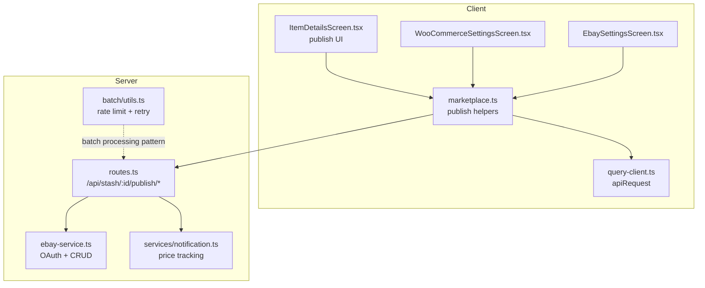
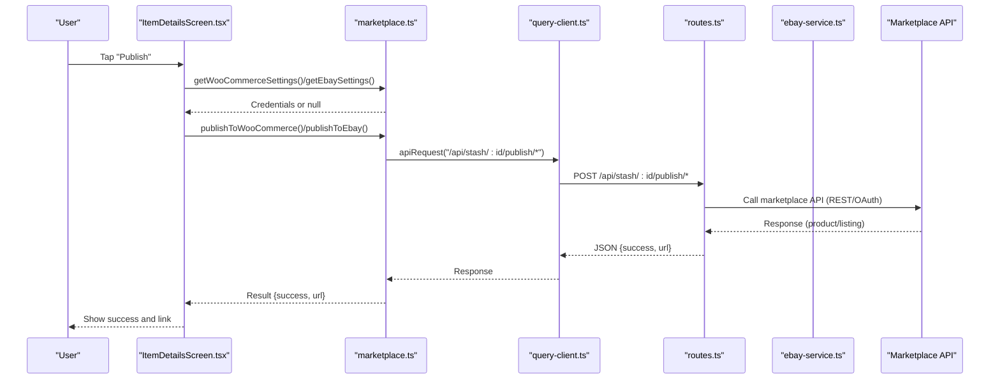
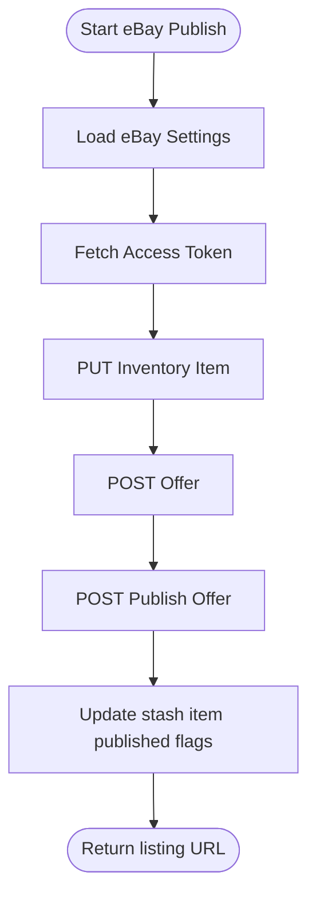
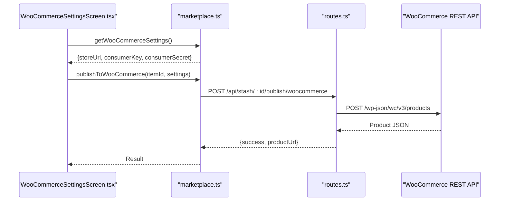
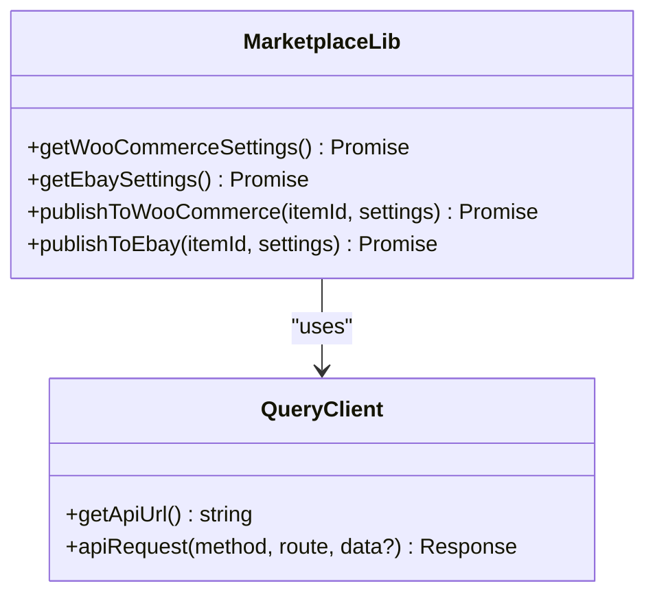
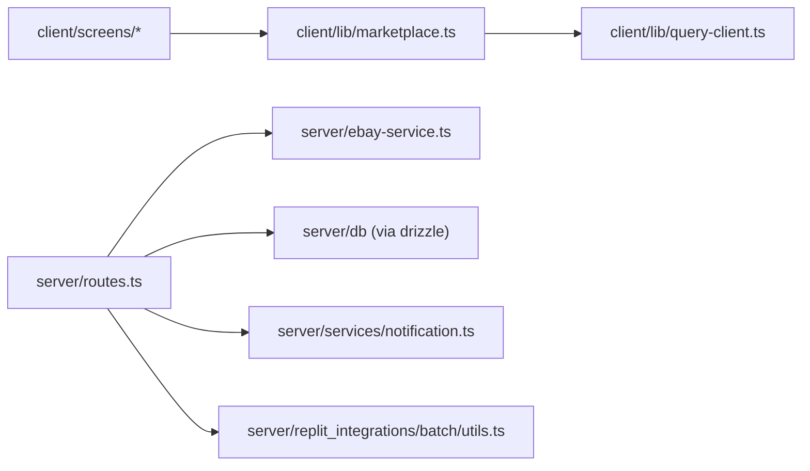

# Marketplace Integration

<cite>
**Referenced Files in This Document**
- [marketplace.ts](file://client/lib/marketplace.ts)
- [WooCommerceSettingsScreen.tsx](file://client/screens/WooCommerceSettingsScreen.tsx)
- [EbaySettingsScreen.tsx](file://client/screens/EbaySettingsScreen.tsx)
- [ItemDetailsScreen.tsx](file://client/screens/ItemDetailsScreen.tsx)
- [query-client.ts](file://client/lib/query-client.ts)
- [ebay-service.ts](file://server/ebay-service.ts)
- [routes.ts](file://server/routes.ts)
- [notification.ts](file://server/services/notification.ts)
- [batch/utils.ts](file://server/replit_integrations/batch/utils.ts)
- [ENVIRONMENT.md](file://ENVIRONMENT.md)
- [package.json](file://package.json)
- [ebay_settings_flow.yml](file://.maestro/ebay_settings_flow.yml)
- [woocommerce_settings_flow.yml](file://.maestro/woocommerce_settings_flow.yml)
</cite>

## Table of Contents
1. [Introduction](#introduction)
2. [Project Structure](#project-structure)
3. [Core Components](#core-components)
4. [Architecture Overview](#architecture-overview)
5. [Detailed Component Analysis](#detailed-component-analysis)
6. [Dependency Analysis](#dependency-analysis)
7. [Performance Considerations](#performance-considerations)
8. [Troubleshooting Guide](#troubleshooting-guide)
9. [Conclusion](#conclusion)
10. [Appendices](#appendices)

## Introduction
This document explains the marketplace integration for eBay and WooCommerce within the HiddenGem application. It covers how the client app connects to these marketplaces, how the backend orchestrates API calls, and how the unified marketplace interface enables multi-platform publishing. It also documents settings management, security considerations, error handling, rate limiting, and retry mechanisms, along with price tracking and automated workflows.

## Project Structure
The marketplace integration spans three primary areas:
- Client library for marketplace operations and settings retrieval
- Screens for configuring marketplace credentials and testing connections
- Server routes that proxy marketplace APIs and manage publishing workflows
- Supporting services for notifications and batch processing

**Diagram sources**
- [marketplace.ts](file://client/lib/marketplace.ts#L1-L129)
- [query-client.ts](file://client/lib/query-client.ts#L1-L80)
- [WooCommerceSettingsScreen.tsx](file://client/screens/WooCommerceSettingsScreen.tsx#L1-L512)
- [EbaySettingsScreen.tsx](file://client/screens/EbaySettingsScreen.tsx#L1-L568)
- [ItemDetailsScreen.tsx](file://client/screens/ItemDetailsScreen.tsx#L143-L515)
- [routes.ts](file://server/routes.ts#L387-L647)
- [ebay-service.ts](file://server/ebay-service.ts#L1-L474)
- [notification.ts](file://server/services/notification.ts#L162-L366)
- [batch/utils.ts](file://server/replit_integrations/batch/utils.ts#L1-L160)

**Section sources**
- [marketplace.ts](file://client/lib/marketplace.ts#L1-L129)
- [WooCommerceSettingsScreen.tsx](file://client/screens/WooCommerceSettingsScreen.tsx#L1-L512)
- [EbaySettingsScreen.tsx](file://client/screens/EbaySettingsScreen.tsx#L1-L568)
- [ItemDetailsScreen.tsx](file://client/screens/ItemDetailsScreen.tsx#L143-L515)
- [routes.ts](file://server/routes.ts#L387-L647)
- [ebay-service.ts](file://server/ebay-service.ts#L1-L474)
- [notification.ts](file://server/services/notification.ts#L162-L366)
- [batch/utils.ts](file://server/replit_integrations/batch/utils.ts#L1-L160)

## Core Components
- Unified marketplace interface in the client:
  - Retrieves stored credentials for eBay and WooCommerce
  - Publishes items to selected platforms via the backend
- Settings screens:
  - Securely stores credentials using platform-specific secure storage on native devices
  - Tests connectivity against marketplace APIs
- Server-side orchestration:
  - Validates item state and credentials
  - Calls marketplace APIs (WooCommerce REST and eBay APIs)
  - Persists publication metadata and returns URLs
- eBay service utilities:
  - Handles OAuth token acquisition and refresh
  - Implements inventory and listing CRUD operations
- Notifications and price tracking:
  - Enables/disables price tracking and schedules periodic checks
- Batch processing utilities:
  - Provides concurrency control and exponential backoff for rate-limited operations

**Section sources**
- [marketplace.ts](file://client/lib/marketplace.ts#L1-L129)
- [WooCommerceSettingsScreen.tsx](file://client/screens/WooCommerceSettingsScreen.tsx#L1-L512)
- [EbaySettingsScreen.tsx](file://client/screens/EbaySettingsScreen.tsx#L1-L568)
- [routes.ts](file://server/routes.ts#L387-L647)
- [ebay-service.ts](file://server/ebay-service.ts#L1-L474)
- [notification.ts](file://server/services/notification.ts#L162-L366)
- [batch/utils.ts](file://server/replit_integrations/batch/utils.ts#L1-L160)

## Architecture Overview
The client app exposes a unified publishing interface. When a user chooses a platform, the client retrieves stored credentials and posts to the backend’s publish endpoint. The backend validates the request, interacts with the marketplace API, persists state, and returns a success result with a product/listing URL.

**Diagram sources**
- [ItemDetailsScreen.tsx](file://client/screens/ItemDetailsScreen.tsx#L143-L515)
- [marketplace.ts](file://client/lib/marketplace.ts#L81-L128)
- [query-client.ts](file://client/lib/query-client.ts#L26-L43)
- [routes.ts](file://server/routes.ts#L387-L647)
- [ebay-service.ts](file://server/ebay-service.ts#L42-L62)

## Detailed Component Analysis

### eBay Integration
- OAuth and token management:
  - Access tokens are fetched using a refresh token against eBay identity endpoints
  - A dedicated refresh utility returns updated tokens and expiry timestamps
- Listing lifecycle:
  - Inventory item creation via PUT to inventory_item SKU endpoint
  - Offer creation via POST to offer endpoint
  - Listing publication via POST to offer publish endpoint
  - Listing deletion and updates supported
- Category mapping:
  - Application categories are mapped to eBay category IDs for listings
- Client-side integration:
  - Credentials are retrieved from secure storage
  - Publishing posts to backend with environment and refresh token
  - Backend returns listing URL and identifiers

**Diagram sources**
- [routes.ts](file://server/routes.ts#L457-L647)
- [ebay-service.ts](file://server/ebay-service.ts#L42-L62)
- [ebay-service.ts](file://server/ebay-service.ts#L534-L642)

**Section sources**
- [ebay-service.ts](file://server/ebay-service.ts#L1-L474)
- [routes.ts](file://server/routes.ts#L457-L647)
- [marketplace.ts](file://client/lib/marketplace.ts#L105-L128)
- [EbaySettingsScreen.tsx](file://client/screens/EbaySettingsScreen.tsx#L1-L568)

### WooCommerce Integration
- REST API configuration:
  - Consumer key and secret are validated against the store’s system status endpoint
  - Store URL is normalized and persisted
- Product publishing:
  - Backend constructs a product payload using stash item data
  - Posts to the WooCommerce products endpoint
  - Updates stash item with published flag and product permalink
- Client-side integration:
  - Settings screen saves credentials securely
  - Publishing triggers backend endpoint and displays product URL

**Diagram sources**
- [WooCommerceSettingsScreen.tsx](file://client/screens/WooCommerceSettingsScreen.tsx#L1-L512)
- [marketplace.ts](file://client/lib/marketplace.ts#L81-L103)
- [routes.ts](file://server/routes.ts#L387-L455)

**Section sources**
- [routes.ts](file://server/routes.ts#L387-L455)
- [WooCommerceSettingsScreen.tsx](file://client/screens/WooCommerceSettingsScreen.tsx#L1-L512)
- [marketplace.ts](file://client/lib/marketplace.ts#L19-L44)

### Unified Marketplace Interface
- Settings retrieval:
  - Platform-aware secure storage for credentials
  - Status flags indicate whether a platform is connected
- Publishing workflow:
  - UI gates publishing based on connection status
  - Calls platform-specific publish helpers
  - Displays success with product/listing URL

**Diagram sources**
- [marketplace.ts](file://client/lib/marketplace.ts#L1-L129)
- [query-client.ts](file://client/lib/query-client.ts#L1-L80)

**Section sources**
- [marketplace.ts](file://client/lib/marketplace.ts#L1-L129)
- [query-client.ts](file://client/lib/query-client.ts#L1-L80)
- [ItemDetailsScreen.tsx](file://client/screens/ItemDetailsScreen.tsx#L143-L515)

### Settings Management and Security
- Credential storage:
  - Native devices use secure storage; web uses AsyncStorage
  - Status flags prevent accidental publishing without credentials
- Environment separation:
  - eBay supports sandbox and production environments
- Testing connections:
  - Direct API calls validate credentials before saving
- Environment variables:
  - Marketplace credentials are stored locally per device, not in environment variables

**Section sources**
- [WooCommerceSettingsScreen.tsx](file://client/screens/WooCommerceSettingsScreen.tsx#L1-L512)
- [EbaySettingsScreen.tsx](file://client/screens/EbaySettingsScreen.tsx#L1-L568)
- [ENVIRONMENT.md](file://ENVIRONMENT.md#L54-L68)

### Order Management and Real-Time Updates
- Notification service:
  - Enables price tracking for stash items
  - Schedules periodic checks and emits alerts on threshold breaches
- Real-time updates:
  - Push token registration endpoints support real-time notifications
  - Price tracking integrates with notifications for user alerts

**Section sources**
- [notification.ts](file://server/services/notification.ts#L162-L366)
- [routes.ts](file://server/routes.ts#L44-L129)

### Listing Synchronization and Automated Workflows
- Stash item state:
  - Backend tracks publication flags and marketplace identifiers
  - Ensures deduplication and prevents re-publishing
- Automated publishing:
  - UI triggers backend endpoints upon user action
  - Backend performs marketplace-specific steps and persists outcomes

**Section sources**
- [routes.ts](file://server/routes.ts#L387-L647)
- [ItemDetailsScreen.tsx](file://client/screens/ItemDetailsScreen.tsx#L143-L515)

## Dependency Analysis
- Client depends on:
  - React Query for API requests and caching
  - Expo SecureStore for native secure storage
  - Platform-specific storage for web compatibility
- Server depends on:
  - Express for routing
  - Drizzle ORM for database operations
  - eBay service utilities for marketplace operations
  - Batch utilities for rate-limited processing patterns

**Diagram sources**
- [marketplace.ts](file://client/lib/marketplace.ts#L1-L129)
- [query-client.ts](file://client/lib/query-client.ts#L1-L80)
- [routes.ts](file://server/routes.ts#L1-L30)
- [ebay-service.ts](file://server/ebay-service.ts#L1-L474)
- [notification.ts](file://server/services/notification.ts#L162-L366)
- [batch/utils.ts](file://server/replit_integrations/batch/utils.ts#L1-L160)

**Section sources**
- [package.json](file://package.json#L24-L76)
- [routes.ts](file://server/routes.ts#L1-L30)
- [ebay-service.ts](file://server/ebay-service.ts#L1-L474)

## Performance Considerations
- Rate limiting and retries:
  - Batch utilities provide concurrency control and exponential backoff
  - Detects rate limit errors and retries with capped delays
- Query caching:
  - React Query defaults avoid unnecessary network calls
- Network timeouts:
  - Fetch calls rely on platform defaults; consider adding timeout wrappers for reliability

**Section sources**
- [batch/utils.ts](file://server/replit_integrations/batch/utils.ts#L35-L109)
- [query-client.ts](file://client/lib/query-client.ts#L66-L80)

## Troubleshooting Guide
- eBay
  - Missing refresh token: Backend requires a refresh token for user OAuth
  - Business policies: Offers may fail if shipping/payment/return policies are not configured in Seller Hub
  - Token errors: Validate Client ID/Secret and environment selection
- WooCommerce
  - Authentication failures: Confirm consumer key/secret and REST API enablement
  - URL normalization: Ensure protocol and trailing slash handling
- General
  - API connectivity: Use settings screens’ “Test Connection” buttons
  - Environment variables: Confirm EXPO_PUBLIC_DOMAIN is set for the client API base URL
  - CORS: Server sets CORS dynamically for development domains

**Section sources**
- [routes.ts](file://server/routes.ts#L457-L647)
- [WooCommerceSettingsScreen.tsx](file://client/screens/WooCommerceSettingsScreen.tsx#L108-L146)
- [EbaySettingsScreen.tsx](file://client/screens/EbaySettingsScreen.tsx#L112-L150)
- [query-client.ts](file://client/lib/query-client.ts#L7-L17)
- [ENVIRONMENT.md](file://ENVIRONMENT.md#L12-L68)

## Conclusion
The marketplace integration provides a unified, secure, and extensible way to publish items to eBay and WooCommerce. The client handles credential management and user workflows, while the server manages marketplace-specific API interactions, state persistence, and automated features like price tracking. Robust error handling, optional retries, and secure storage ensure reliable operation across platforms.

## Appendices

### API Usage Patterns
- Client publish calls:
  - [publishToWooCommerce](file://client/lib/marketplace.ts#L81-L103)
  - [publishToEbay](file://client/lib/marketplace.ts#L105-L128)
- Backend endpoints:
  - [POST /api/stash/:id/publish/woocommerce](file://server/routes.ts#L387-L455)
  - [POST /api/stash/:id/publish/ebay](file://server/routes.ts#L457-L647)

### Security Considerations
- Credential storage:
  - Native: SecureStore; Web: AsyncStorage
  - Status flags prevent publishing without credentials
- Environment isolation:
  - eBay supports sandbox/production modes
- API base URL:
  - Client enforces EXPO_PUBLIC_DOMAIN presence

**Section sources**
- [marketplace.ts](file://client/lib/marketplace.ts#L19-L79)
- [ENVIRONMENT.md](file://ENVIRONMENT.md#L54-L68)
- [query-client.ts](file://client/lib/query-client.ts#L7-L17)

### Testing and Automation
- Maestro flows:
  - [ebay_settings_flow.yml](file://.maestro/ebay_settings_flow.yml#L1-L45)
  - [woocommerce_settings_flow.yml](file://.maestro/woocommerce_settings_flow.yml#L1-L45)
- Batch processing:
  - [batch/utils.ts](file://server/replit_integrations/batch/utils.ts#L1-L160)

**Section sources**
- [.maestro/ebay_settings_flow.yml](file://.maestro/ebay_settings_flow.yml#L1-L45)
- [.maestro/woocommerce_settings_flow.yml](file://.maestro/woocommerce_settings_flow.yml#L1-L45)
- [batch/utils.ts](file://server/replit_integrations/batch/utils.ts#L1-L160)