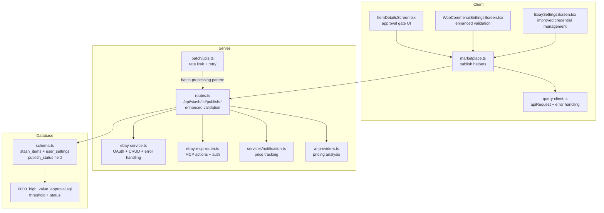
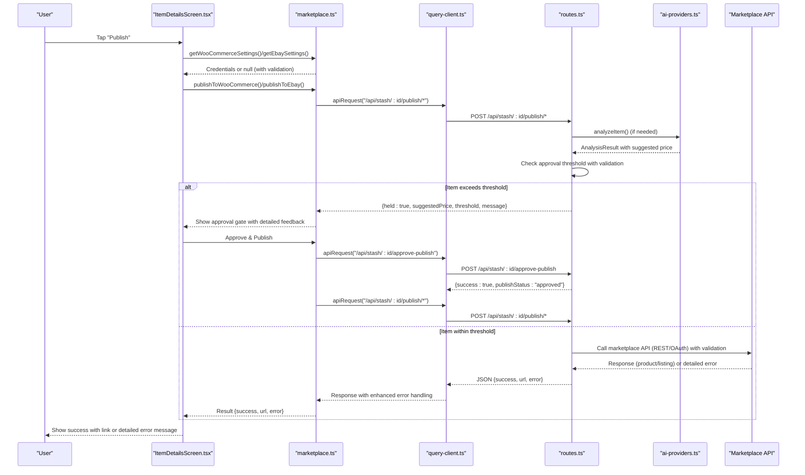
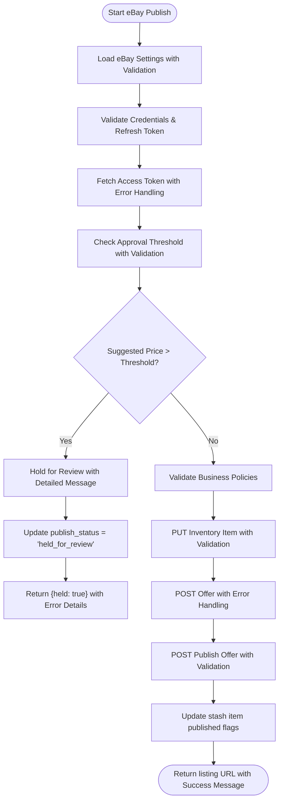
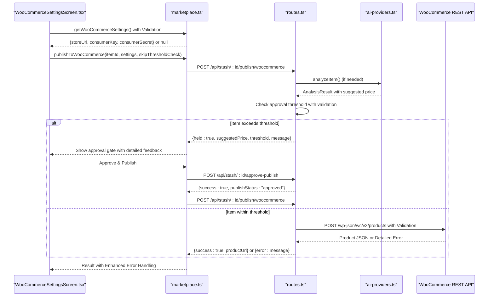
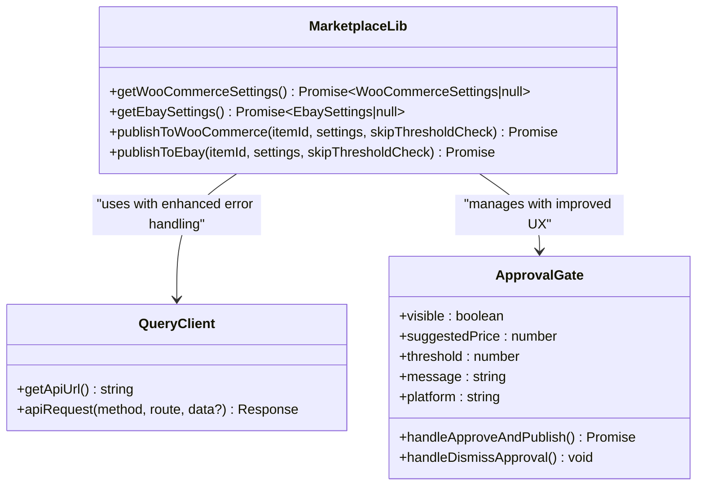
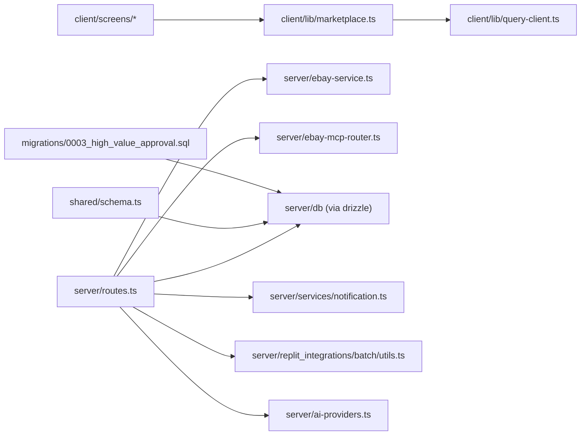

# Marketplace Integration

<cite>
**Referenced Files in This Document**
- [marketplace.ts](file://client/lib/marketplace.ts)
- [WooCommerceSettingsScreen.tsx](file://client/screens/WooCommerceSettingsScreen.tsx)
- [EbaySettingsScreen.tsx](file://client/screens/EbaySettingsScreen.tsx)
- [ItemDetailsScreen.tsx](file://client/screens/ItemDetailsScreen.tsx)
- [query-client.ts](file://client/lib/query-client.ts)
- [ebay-service.ts](file://server/ebay-service.ts)
- [ebay-mcp-router.ts](file://server/ebay-mcp-router.ts)
- [routes.ts](file://server/routes.ts)
- [notification.ts](file://server/services/notification.ts)
- [batch/utils.ts](file://server/replit_integrations/batch/utils.ts)
- [ai-providers.ts](file://server/ai-providers.ts)
- [schema.ts](file://shared/schema.ts)
- [0003_high_value_approval.sql](file://migrations/0003_high_value_approval.sql)
- [ENVIRONMENT.md](file://ENVIRONMENT.md)
- [package.json](file://package.json)
- [ebay_settings_flow.yml](file://.maestro/ebay_settings_flow.yml)
- [woocommerce_settings_flow.yml](file://.maestro/woocommerce_settings_flow.yml)
</cite>

## Update Summary
**Changes Made**
- Enhanced error handling and validation across marketplace integration endpoints
- Improved credential management with better validation and user guidance
- Strengthened approval gate system with enhanced error reporting
- Refined eBay MCP router with improved authentication and error handling
- Enhanced WooCommerce and eBay settings screens with better user feedback
- Improved API request handling with comprehensive error propagation

## Table of Contents
1. [Introduction](#introduction)
2. [Project Structure](#project-structure)
3. [Core Components](#core-components)
4. [Architecture Overview](#architecture-overview)
5. [Detailed Component Analysis](#detailed-component-analysis)
6. [Enhanced Approval Gate System](#enhanced-approval-gate-system)
7. [AI Analysis Integration](#ai-analysis-integration)
8. [eBay MCP Router](#ebay-mcp-router)
9. [Enhanced Error Handling and Validation](#enhanced-error-handling-and-validation)
10. [Dependency Analysis](#dependency-analysis)
11. [Performance Considerations](#performance-considerations)
12. [Troubleshooting Guide](#troubleshooting-guide)
13. [Conclusion](#conclusion)
14. [Appendices](#appendices)

## Introduction
This document explains the marketplace integration for eBay and WooCommerce within the HiddenGem application. It covers how the client app connects to these marketplaces, how the backend orchestrates API calls, and how the unified marketplace interface enables multi-platform publishing. The system now features enhanced error handling and validation, improved credential management, sophisticated approval gating system with configurable high-value thresholds, AI-powered pricing analysis, and comprehensive approval workflows. It also documents settings management, security considerations, error handling, rate limiting, and retry mechanisms, along with price tracking and automated workflows.

## Project Structure
The marketplace integration spans three primary areas:
- Client library for marketplace operations and settings retrieval
- Screens for configuring marketplace credentials and testing connections
- Server routes that proxy marketplace APIs and manage publishing workflows
- AI analysis engine for pricing suggestions and item authentication
- Approval gate system for high-value item oversight
- eBay MCP router for advanced marketplace control panel actions
- Supporting services for notifications and batch processing

**Diagram sources**
- [marketplace.ts:1-183](file://client/lib/marketplace.ts#L1-L183)
- [query-client.ts:1-80](file://client/lib/query-client.ts#L1-L80)
- [WooCommerceSettingsScreen.tsx:1-626](file://client/screens/WooCommerceSettingsScreen.tsx#L1-L626)
- [EbaySettingsScreen.tsx:1-693](file://client/screens/EbaySettingsScreen.tsx#L1-L693)
- [ItemDetailsScreen.tsx:539-937](file://client/screens/ItemDetailsScreen.tsx#L539-L937)
- [routes.ts:1-1389](file://server/routes.ts#L1-L1389)
- [ebay-service.ts:1-678](file://server/ebay-service.ts#L1-L678)
- [ebay-mcp-router.ts:1-181](file://server/ebay-mcp-router.ts#L1-L181)
- [notification.ts:162-366](file://server/services/notification.ts#L162-L366)
- [batch/utils.ts:1-160](file://server/replit_integrations/batch/utils.ts#L1-L160)
- [ai-providers.ts:1-840](file://server/ai-providers.ts#L1-L840)
- [schema.ts:14-55](file://shared/schema.ts#L14-L55)
- [0003_high_value_approval.sql:1-3](file://migrations/0003_high_value_approval.sql#L1-L3)

**Section sources**
- [marketplace.ts:1-183](file://client/lib/marketplace.ts#L1-L183)
- [WooCommerceSettingsScreen.tsx:1-626](file://client/screens/WooCommerceSettingsScreen.tsx#L1-L626)
- [EbaySettingsScreen.tsx:1-693](file://client/screens/EbaySettingsScreen.tsx#L1-L693)
- [ItemDetailsScreen.tsx:539-937](file://client/screens/ItemDetailsScreen.tsx#L539-L937)
- [routes.ts:1-1389](file://server/routes.ts#L1-L1389)
- [ebay-service.ts:1-678](file://server/ebay-service.ts#L1-L678)
- [ebay-mcp-router.ts:1-181](file://server/ebay-mcp-router.ts#L1-L181)
- [notification.ts:162-366](file://server/services/notification.ts#L162-L366)
- [batch/utils.ts:1-160](file://server/replit_integrations/batch/utils.ts#L1-L160)
- [ai-providers.ts:1-840](file://server/ai-providers.ts#L1-L840)
- [schema.ts:14-55](file://shared/schema.ts#L14-L55)
- [0003_high_value_approval.sql:1-3](file://migrations/0003_high_value_approval.sql#L1-L3)

## Core Components
- Unified marketplace interface in the client:
  - Retrieves stored credentials for eBay and WooCommerce with enhanced validation
  - Publishes items to selected platforms via the backend with improved error handling
  - Handles approval gate workflows for high-value items with detailed feedback
- Enhanced approval gate system:
  - Configurable high-value thresholds per user with database persistence
  - Automatic item hold for items exceeding suggested price thresholds with clear messaging
  - Detailed feedback and approval UI for manual review with enhanced user guidance
- AI-powered pricing analysis:
  - Comprehensive item authentication and valuation with confidence scoring
  - Suggested listing prices with detailed market analysis and authentication tips
  - Market analysis and authentication guidance with actionable recommendations
- Settings screens with improved validation:
  - Securely stores credentials using platform-specific secure storage on native devices
  - Enhanced connectivity testing with detailed error messages and user guidance
  - Manages approval threshold configuration with validation and feedback
- Server-side orchestration with strengthened validation:
  - Validates item state, credentials, and approval thresholds with comprehensive error handling
  - Calls marketplace APIs (WooCommerce REST and eBay APIs) with improved error reporting
  - Persists publication metadata and returns URLs with enhanced validation
  - Implements approval gate logic with conditional checks and detailed error messages
- eBay MCP router with enhanced security:
  - Advanced marketplace control panel actions with robust authentication
  - Supports publish, update, offer, and reprice operations with improved error handling
  - Enhanced security with API key authentication and comprehensive error reporting
- eBay service utilities with improved error handling:
  - Handles OAuth token acquisition and refresh with detailed error messages
  - Implements inventory and listing CRUD operations with comprehensive validation
- Notifications and price tracking:
  - Enables/disables price tracking and schedules periodic checks with enhanced monitoring
- Batch processing utilities:
  - Provides concurrency control and exponential backoff for rate-limited operations

**Section sources**
- [marketplace.ts:1-183](file://client/lib/marketplace.ts#L1-L183)
- [WooCommerceSettingsScreen.tsx:1-626](file://client/screens/WooCommerceSettingsScreen.tsx#L1-L626)
- [EbaySettingsScreen.tsx:1-693](file://client/screens/EbaySettingsScreen.tsx#L1-L693)
- [routes.ts:1-1389](file://server/routes.ts#L1-L1389)
- [ebay-service.ts:1-678](file://server/ebay-service.ts#L1-L678)
- [ebay-mcp-router.ts:1-181](file://server/ebay-mcp-router.ts#L1-L181)
- [notification.ts:162-366](file://server/services/notification.ts#L162-L366)
- [batch/utils.ts:1-160](file://server/replit_integrations/batch/utils.ts#L1-L160)
- [ai-providers.ts:1-840](file://server/ai-providers.ts#L1-L840)
- [schema.ts:14-55](file://shared/schema.ts#L14-L55)

## Architecture Overview
The client app exposes a unified publishing interface with enhanced approval gate functionality and improved error handling. When a user chooses a platform, the client retrieves stored credentials with validation and posts to the backend's publish endpoint. The backend validates the request, performs AI analysis if needed, checks approval thresholds, and either publishes immediately or holds the item for review. The approval gate system provides detailed feedback and manual approval controls with enhanced user guidance.

**Diagram sources**
- [ItemDetailsScreen.tsx:274-291](file://client/screens/ItemDetailsScreen.tsx#L274-L291)
- [marketplace.ts:81-183](file://client/lib/marketplace.ts#L81-L183)
- [query-client.ts:26-43](file://client/lib/query-client.ts#L26-L43)
- [routes.ts:456-760](file://server/routes.ts#L456-L760)
- [ebay-service.ts:42-62](file://server/ebay-service.ts#L42-L62)
- [ai-providers.ts:437-455](file://server/ai-providers.ts#L437-L455)

## Detailed Component Analysis

### eBay Integration
- OAuth and token management with enhanced validation:
  - Access tokens are fetched using a refresh token against eBay identity endpoints
  - A dedicated refresh utility returns updated tokens and expiry timestamps
  - Enhanced error handling with detailed error messages for authentication failures
- Listing lifecycle with improved validation:
  - Inventory item creation via PUT to inventory_item SKU endpoint with validation
  - Offer creation via POST to offer endpoint with comprehensive error handling
  - Listing publication via POST to offer publish endpoint with detailed error reporting
  - Listing deletion and updates with robust error handling and validation
- Category mapping with enhanced validation:
  - Application categories are mapped to eBay category IDs for listings
  - Improved fallback mechanisms for category mapping failures
- Client-side integration with enhanced error handling:
  - Credentials are retrieved from secure storage with validation
  - Publishing posts to backend with environment and refresh token validation
  - Backend returns listing URL and identifiers with enhanced error reporting
- Enhanced approval gate integration:
  - Automatic approval threshold checking during publishing with detailed messaging
  - Items exceeding suggested price thresholds are held for review with clear guidance
  - Manual approval required for high-value items with comprehensive feedback

**Diagram sources**
- [routes.ts:548-760](file://server/routes.ts#L548-L760)
- [ebay-service.ts:42-62](file://server/ebay-service.ts#L42-L62)
- [ebay-service.ts:534-642](file://server/ebay-service.ts#L534-L642)

**Section sources**
- [ebay-service.ts:1-678](file://server/ebay-service.ts#L1-L678)
- [routes.ts:548-760](file://server/routes.ts#L548-L760)
- [marketplace.ts:110-183](file://client/lib/marketplace.ts#L110-L183)
- [EbaySettingsScreen.tsx:1-693](file://client/screens/EbaySettingsScreen.tsx#L1-L693)

### WooCommerce Integration
- REST API configuration with enhanced validation:
  - Consumer key and secret are validated against the store's system status endpoint
  - Store URL validation with protocol normalization and trailing slash handling
  - Enhanced error handling for authentication failures and connectivity issues
- Product publishing with improved validation:
  - Backend constructs a product payload using stash item data with validation
  - Posts to the WooCommerce products endpoint with comprehensive error handling
  - Updates stash item with published flag and product permalink with validation
- Enhanced approval gate integration:
  - Automatic approval threshold checking during publishing with detailed messaging
  - Items exceeding suggested price thresholds are held for review with clear guidance
  - Manual approval required for high-value items with comprehensive feedback
- Client-side integration with improved user experience:
  - Settings screen saves credentials securely with validation
  - Enhanced publishing triggers backend endpoint with detailed error reporting
  - Clear success/failure feedback with actionable error messages

**Diagram sources**
- [WooCommerceSettingsScreen.tsx:1-626](file://client/screens/WooCommerceSettingsScreen.tsx#L1-L626)
- [marketplace.ts:81-108](file://client/lib/marketplace.ts#L81-L108)
- [routes.ts:456-546](file://server/routes.ts#L456-L546)
- [ai-providers.ts:437-455](file://server/ai-providers.ts#L437-L455)

**Section sources**
- [routes.ts:456-546](file://server/routes.ts#L456-L546)
- [WooCommerceSettingsScreen.tsx:1-626](file://client/screens/WooCommerceSettingsScreen.tsx#L1-L626)
- [marketplace.ts:19-44](file://client/lib/marketplace.ts#L19-L44)

### Unified Marketplace Interface
- Settings retrieval with enhanced validation:
  - Platform-aware secure storage for credentials with validation
  - Status flags indicate whether a platform is connected with improved reliability
- Enhanced publishing workflow with improved error handling:
  - UI gates publishing based on connection status with validation
  - Calls platform-specific publish helpers with approval gate integration
  - Displays success with product/listing URL or detailed error messages
  - Handles approval gate UI for high-value items with comprehensive feedback
- Approval gate integration with enhanced user experience:
  - Automatic detection of items requiring manual approval with validation
  - Detailed price comparison and threshold display with clear messaging
  - Manual approval controls with cancel and confirm actions and enhanced feedback

**Diagram sources**
- [marketplace.ts:1-183](file://client/lib/marketplace.ts#L1-L183)
- [query-client.ts:1-80](file://client/lib/query-client.ts#L1-L80)
- [ItemDetailsScreen.tsx:274-291](file://client/screens/ItemDetailsScreen.tsx#L274-L291)

**Section sources**
- [marketplace.ts:1-183](file://client/lib/marketplace.ts#L1-L183)
- [query-client.ts:1-80](file://client/lib/query-client.ts#L1-L80)
- [ItemDetailsScreen.tsx:562-600](file://client/screens/ItemDetailsScreen.tsx#L562-L600)

### Settings Management and Security
- Credential storage with enhanced validation:
  - Native devices use secure storage; web uses AsyncStorage with validation
  - Status flags prevent accidental publishing without credentials with improved reliability
- Enhanced approval threshold management:
  - User-configurable high-value approval thresholds with database persistence
  - Default threshold of $500 for new users with validation
  - Per-user threshold settings stored in database with enhanced security
- Environment separation with improved validation:
  - eBay supports sandbox and production environments with validation
- Testing connections with enhanced user guidance:
  - Direct API calls validate credentials before saving with detailed error messages
  - Enhanced user feedback for connection failures and validation errors
- Environment variables with improved security:
  - Marketplace credentials are stored locally per device, not in environment variables
  - Enhanced validation for environment variable configuration

**Section sources**
- [WooCommerceSettingsScreen.tsx:1-626](file://client/screens/WooCommerceSettingsScreen.tsx#L1-L626)
- [EbaySettingsScreen.tsx:1-693](file://client/screens/EbaySettingsScreen.tsx#L1-L693)
- [routes.ts:387-420](file://server/routes.ts#L387-L420)
- [ENVIRONMENT.md:54-68](file://ENVIRONMENT.md#L54-L68)

### Order Management and Real-Time Updates
- Notification service with enhanced monitoring:
  - Enables price tracking for stash items with comprehensive monitoring
  - Schedules periodic checks and emits alerts on threshold breaches
  - Integrates with approval gate system for high-value item notifications
- Real-time updates with improved reliability:
  - Push token registration endpoints support real-time notifications
  - Price tracking integrates with notifications for user alerts with enhanced monitoring

**Section sources**
- [notification.ts:162-366](file://server/services/notification.ts#L162-L366)
- [routes.ts:44-129](file://server/routes.ts#L44-L129)

### Listing Synchronization and Automated Workflows
- Enhanced stash item state with improved validation:
  - Backend tracks publication flags and marketplace identifiers with validation
  - New publish_status field manages draft, held_for_review, and approved states
  - Ensures deduplication and prevents re-publishing with enhanced validation
  - Approval gate integration prevents unauthorized high-value publishing with clear messaging
- Automated publishing with enhanced error handling:
  - UI triggers backend endpoints upon user action with validation
  - Backend performs marketplace-specific steps and persists outcomes with comprehensive error handling
  - Approval gate workflow ensures manual oversight for high-value items with detailed feedback
- Approval gate workflow with improved user experience:
  - Automatic detection of items exceeding suggested price thresholds with validation
  - Manual approval required for items held for review with comprehensive feedback
  - Detailed feedback and price comparison for user decision-making with enhanced guidance

**Section sources**
- [routes.ts:456-760](file://server/routes.ts#L456-L760)
- [ItemDetailsScreen.tsx:539-600](file://client/screens/ItemDetailsScreen.tsx#L539-L600)
- [schema.ts:33-55](file://shared/schema.ts#L33-L55)

## Enhanced Approval Gate System

### Approval Threshold Configuration
The system now features configurable approval thresholds per user with enhanced validation, allowing sellers to set their own high-value limits for automatic approval gating with comprehensive database persistence.

**Section sources**
- [routes.ts:387-420](file://server/routes.ts#L387-L420)
- [schema.ts:14-31](file://shared/schema.ts#L14-L31)

### Automatic Approval Gate Detection
Items are automatically evaluated against the user's approval threshold during the publishing process with enhanced validation. If the suggested listing price exceeds the threshold, the item is held for manual review with detailed messaging and guidance.

**Section sources**
- [routes.ts:474-494](file://server/routes.ts#L474-L494)
- [routes.ts:572-592](file://server/routes.ts#L572-L592)

### Approval Gate User Interface
The client displays a comprehensive approval gate interface when items exceed the threshold, showing detailed pricing information and requiring explicit user approval with enhanced user experience and clear guidance.

**Section sources**
- [ItemDetailsScreen.tsx:562-600](file://client/screens/ItemDetailsScreen.tsx#L562-L600)
- [ItemDetailsScreen.tsx:274-291](file://client/screens/ItemDetailsScreen.tsx#L274-L291)

### Approval Gate Workflow
The approval gate workflow provides a structured process for handling high-value items, including detailed feedback, price comparison, and manual approval controls with comprehensive user guidance and enhanced error handling.

**Section sources**
- [ItemDetailsScreen.tsx:274-291](file://client/screens/ItemDetailsScreen.tsx#L274-L291)
- [routes.ts:439-454](file://server/routes.ts#L439-L454)

## AI Analysis Integration

### Comprehensive Pricing Analysis
The AI analysis system provides detailed pricing suggestions, authentication assessments, and market analysis for each item, enabling informed decision-making and optimal pricing strategies with enhanced confidence scoring and detailed market insights.

**Section sources**
- [ai-providers.ts:12-41](file://server/ai-providers.ts#L12-L41)
- [routes.ts:299-385](file://server/routes.ts#L299-L385)

### Enhanced Item Authentication
Advanced authentication analysis helps sellers verify item authenticity and provides guidance for authentication verification, reducing risk and improving buyer confidence with actionable recommendations and detailed tips.

**Section sources**
- [ai-providers.ts:48-99](file://server/ai-providers.ts#L48-L99)
- [ai-providers.ts:131-180](file://server/ai-providers.ts#L131-L180)

### Retry Analysis System
The system includes a sophisticated retry mechanism that allows sellers to refine AI analysis based on feedback, improving accuracy and providing multiple analysis iterations with enhanced error handling and user guidance.

**Section sources**
- [ai-providers.ts:477-503](file://server/ai-providers.ts#L477-L503)
- [routes.ts:785-840](file://server/routes.ts#L785-L840)

### Suggested Pricing Integration
The AI analysis provides comprehensive suggested pricing data, including low/high estimates, confidence scores, and market analysis, directly integrated into the approval gate system with enhanced validation and detailed feedback.

**Section sources**
- [ai-providers.ts:12-41](file://server/ai-providers.ts#L12-L41)
- [routes.ts:474-494](file://server/routes.ts#L474-L494)
- [routes.ts:572-592](file://server/routes.ts#L572-L592)

## eBay MCP Router

### Advanced Marketplace Control Panel
The eBay MCP (Marketplace Control Panel) router provides enhanced control over eBay marketplace operations with sophisticated action handling, robust security features, and comprehensive error handling.

**Section sources**
- [ebay-mcp-router.ts:1-181](file://server/ebay-mcp-router.ts#L1-L181)

### MCP Action Types
The router supports four primary action types with enhanced validation and error handling:
- **publish**: Creates inventory items, offers, and publishes listings with comprehensive validation
- **update**: Updates existing eBay listings with patch data and robust error handling
- **offer**: Makes purchase offers on existing listings with detailed validation
- **reprice**: Updates listing prices programmatically with enhanced error reporting

**Section sources**
- [ebay-mcp-router.ts:65-162](file://server/ebay-mcp-router.ts#L65-L162)

### Security and Authentication
The MCP router implements robust security measures with enhanced validation:
- API key-based authentication with Bearer token validation and comprehensive error handling
- Context-based credential extraction from environment or request payload with validation
- Marketplace ID and content language configuration support with enhanced validation

**Section sources**
- [ebay-mcp-router.ts:15-27](file://server/ebay-mcp-router.ts#L15-L27)
- [ebay-mcp-router.ts:29-42](file://server/ebay-mcp-router.ts#L29-L42)

### Error Handling and Response Management
Comprehensive error handling ensures reliable operation with enhanced user feedback:
- Structured error responses with standardized status codes and detailed error messages
- Detailed error messages for debugging and user feedback with actionable guidance
- Graceful handling of API failures and edge cases with comprehensive validation

**Section sources**
- [ebay-mcp-router.ts:169-177](file://server/ebay-mcp-router.ts#L169-L177)

## Enhanced Error Handling and Validation

### Client-Side Error Handling
The client now features enhanced error handling with comprehensive validation and user feedback:
- Improved error propagation from API calls with detailed error messages
- Enhanced validation of marketplace credentials before publishing
- Better user feedback for connection failures and validation errors
- Comprehensive error handling for approval gate workflows

**Section sources**
- [marketplace.ts:128-182](file://client/lib/marketplace.ts#L128-L182)
- [query-client.ts:19-43](file://client/lib/query-client.ts#L19-L43)

### Server-Side Validation
The server now implements comprehensive validation and error handling:
- Enhanced validation of marketplace credentials and item data
- Detailed error messages for authentication failures and policy violations
- Comprehensive error handling for marketplace API calls with validation
- Improved error reporting for approval gate workflows

**Section sources**
- [routes.ts:456-760](file://server/routes.ts#L456-L760)
- [ebay-service.ts:42-662](file://server/ebay-service.ts#L42-L662)

### Settings Screen Enhancements
Both settings screens now feature improved validation and user guidance:
- Enhanced validation of store URLs and credentials with detailed error messages
- Better user feedback for connection testing and validation failures
- Improved credential storage with enhanced security and validation
- Comprehensive error handling for settings management operations

**Section sources**
- [WooCommerceSettingsScreen.tsx:134-192](file://client/screens/WooCommerceSettingsScreen.tsx#L134-L192)
- [EbaySettingsScreen.tsx:135-186](file://client/screens/EbaySettingsScreen.tsx#L135-L186)

## Dependency Analysis
- Client depends on:
  - React Query for API requests and caching with enhanced error handling
  - Expo SecureStore for native secure storage with validation
  - Platform-specific storage for web compatibility with enhanced validation
  - Enhanced approval gate UI components with improved user experience
- Server depends on:
  - Express for routing with comprehensive error handling
  - Drizzle ORM for database operations with enhanced validation
  - eBay service utilities for marketplace operations with improved error handling
  - AI providers for pricing analysis and authentication with enhanced validation
  - Batch utilities for rate-limited processing patterns with comprehensive error handling
- Database schema includes:
  - New publish_status field for approval gate tracking with validation
  - High-value threshold configuration per user with enhanced security
  - Enhanced stash items table with approval state and comprehensive validation

**Diagram sources**
- [marketplace.ts:1-183](file://client/lib/marketplace.ts#L1-L183)
- [query-client.ts:1-80](file://client/lib/query-client.ts#L1-L80)
- [routes.ts:1-30](file://server/routes.ts#L1-L30)
- [ebay-service.ts:1-678](file://server/ebay-service.ts#L1-L678)
- [ebay-mcp-router.ts:1-181](file://server/ebay-mcp-router.ts#L1-L181)
- [notification.ts:162-366](file://server/services/notification.ts#L162-L366)
- [batch/utils.ts:1-160](file://server/replit_integrations/batch/utils.ts#L1-L160)
- [ai-providers.ts:1-840](file://server/ai-providers.ts#L1-L840)
- [schema.ts:14-55](file://shared/schema.ts#L14-L55)
- [0003_high_value_approval.sql:1-3](file://migrations/0003_high_value_approval.sql#L1-L3)

**Section sources**
- [package.json:24-76](file://package.json#L24-L76)
- [routes.ts:1-30](file://server/routes.ts#L1-L30)
- [ebay-service.ts:1-678](file://server/ebay-service.ts#L1-L678)
- [ebay-mcp-router.ts:1-181](file://server/ebay-mcp-router.ts#L1-L181)
- [schema.ts:14-55](file://shared/schema.ts#L14-L55)

## Performance Considerations
- Rate limiting and retries with enhanced validation:
  - Batch utilities provide concurrency control and exponential backoff
  - Detects rate limit errors and retries with capped delays
  - Enhanced validation prevents unnecessary retries and improves performance
- Query caching with improved error handling:
  - React Query defaults avoid unnecessary network calls
  - Enhanced error handling prevents cache pollution and improves reliability
- Network timeouts with comprehensive validation:
  - Fetch calls rely on platform defaults with enhanced error handling
  - Consider adding timeout wrappers for reliability with validation
- AI analysis optimization with enhanced validation:
  - Retry mechanism reduces failed analysis attempts
  - Configurable provider selection optimizes performance
  - Enhanced validation improves analysis accuracy and performance
- Approval gate efficiency with improved validation:
  - Conditional approval checks prevent unnecessary processing
  - Cached user threshold settings reduce database queries
  - Enhanced validation improves approval gate performance
- eBay MCP Router performance with enhanced security:
  - Context-based credential extraction reduces redundant API calls
  - Structured error handling prevents cascading failures
  - Enhanced validation improves MCP router performance

**Section sources**
- [batch/utils.ts:35-109](file://server/replit_integrations/batch/utils.ts#L35-L109)
- [query-client.ts:66-80](file://client/lib/query-client.ts#L66-L80)
- [ai-providers.ts:723-840](file://server/ai-providers.ts#L723-L840)
- [ebay-mcp-router.ts:1-181](file://server/ebay-mcp-router.ts#L1-L181)

## Troubleshooting Guide
- eBay
  - Missing refresh token: Backend requires a refresh token for user OAuth with enhanced validation
  - Business policies: Offers may fail if shipping/payment/return policies are not configured in Seller Hub with detailed guidance
  - Token errors: Validate Client ID/Secret and environment selection with comprehensive error messages
  - Approval gate issues: Check user threshold settings and approval status with enhanced validation
  - MCP router errors: Verify API key authentication and action parameters with detailed error reporting
- WooCommerce
  - Authentication failures: Confirm consumer key/secret and REST API enablement with enhanced validation
  - URL normalization: Ensure protocol and trailing slash handling with comprehensive validation
  - Approval gate issues: Verify AI analysis completion and threshold configuration with enhanced validation
- AI Analysis
  - Provider connectivity: Test AI provider connections before analysis with enhanced validation
  - Retry failures: Check feedback quality and provider configuration with comprehensive error handling
  - Pricing accuracy: Review suggested price vs. user expectations with enhanced validation
- General
  - API connectivity: Use settings screens' "Test Connection" buttons with enhanced user feedback
  - Environment variables: Confirm EXPO_PUBLIC_DOMAIN is set for the client API base URL with validation
  - CORS: Server sets CORS dynamically for development domains with enhanced validation
  - Approval gate: Check publish_status field and user threshold settings with comprehensive validation

**Section sources**
- [routes.ts:548-760](file://server/routes.ts#L548-L760)
- [WooCommerceSettingsScreen.tsx:108-146](file://client/screens/WooCommerceSettingsScreen.tsx#L108-L146)
- [EbaySettingsScreen.tsx:112-150](file://client/screens/EbaySettingsScreen.tsx#L112-L150)
- [query-client.ts:7-17](file://client/lib/query-client.ts#L7-L17)
- [ENVIRONMENT.md:12-68](file://ENVIRONMENT.md#L12-L68)
- [ai-providers.ts:723-840](file://server/ai-providers.ts#L723-L840)
- [ebay-mcp-router.ts:15-27](file://server/ebay-mcp-router.ts#L15-L27)

## Conclusion
The enhanced marketplace integration provides a comprehensive, secure, and intelligent solution for publishing items to eBay and WooCommerce. The new approval gate system with configurable thresholds ensures proper oversight of high-value items, while AI-powered pricing analysis provides accurate market insights and authentication guidance. The unified interface seamlessly integrates these features with existing marketplace workflows, offering sellers both automation and control. Robust error handling, enhanced validation, optional retries, secure storage, and comprehensive approval workflows ensure reliable operation across platforms. The addition of the eBay MCP router further enhances marketplace control and automation capabilities with improved security and comprehensive error handling.

## Appendices

### API Usage Patterns
- Client publish calls:
  - [publishToWooCommerce:81-108](file://client/lib/marketplace.ts#L81-L108)
  - [publishToEbay:110-183](file://client/lib/marketplace.ts#L110-L183)
- Backend endpoints with enhanced validation:
  - [POST /api/stash/:id/publish/woocommerce:456-546](file://server/routes.ts#L456-L546)
  - [POST /api/stash/:id/publish/ebay:548-760](file://server/routes.ts#L548-L760)
  - [POST /api/stash/:id/hold-for-review:422-437](file://server/routes.ts#L422-L437)
  - [POST /api/stash/:id/approve-publish:439-454](file://server/routes.ts#L439-L454)
  - [GET /api/settings/threshold:387-420](file://server/routes.ts#L387-L420)
- eBay MCP Router actions with enhanced security:
  - [POST /actions/publish:65-112](file://server/ebay-mcp-router.ts#L65-L112)
  - [POST /actions/update:114-124](file://server/ebay-mcp-router.ts#L114-L124)
  - [POST /actions/offer:126-144](file://server/ebay-mcp-router.ts#L126-L144)
  - [POST /actions/reprice:146-162](file://server/ebay-mcp-router.ts#L146-L162)

### Security Considerations
- Credential storage with enhanced validation:
  - Native: SecureStore; Web: AsyncStorage with validation
  - Status flags prevent publishing without credentials with improved reliability
- Enhanced approval security:
  - User-specific approval thresholds prevent unauthorized high-value publishing
  - Approval gate requires explicit user confirmation with comprehensive validation
  - Publish status tracking prevents unauthorized re-publishing with enhanced security
- Environment isolation with validation:
  - eBay supports sandbox/production modes with enhanced validation
- API base URL with validation:
  - Client enforces EXPO_PUBLIC_DOMAIN presence with comprehensive error handling
- eBay MCP Router security with enhanced validation:
  - API key authentication with Bearer token validation and comprehensive error handling
  - Context-based credential extraction for flexibility with enhanced validation

**Section sources**
- [marketplace.ts:19-79](file://client/lib/marketplace.ts#L19-L79)
- [ENVIRONMENT.md:54-68](file://ENVIRONMENT.md#L54-L68)
- [query-client.ts:7-17](file://client/lib/query-client.ts#L7-L17)
- [ebay-mcp-router.ts:15-27](file://server/ebay-mcp-router.ts#L15-L27)

### Testing and Automation
- Maestro flows with enhanced validation:
  - [ebay_settings_flow.yml:1-45](file://.maestro/ebay_settings_flow.yml#L1-L45)
  - [woocommerce_settings_flow.yml:1-45](file://.maestro/woocommerce_settings_flow.yml#L1-L45)
- Batch processing with comprehensive validation:
  - [batch/utils.ts:1-160](file://server/replit_integrations/batch/utils.ts#L1-L160)
- AI provider testing with enhanced validation:
  - [testProviderConnection:723-840](file://server/ai-providers.ts#L723-L840)

**Section sources**
- [.maestro/ebay_settings_flow.yml:1-45](file://.maestro/ebay_settings_flow.yml#L1-L45)
- [.maestro/woocommerce_settings_flow.yml:1-45](file://.maestro/woocommerce_settings_flow.yml#L1-L45)
- [batch/utils.ts:1-160](file://server/replit_integrations/batch/utils.ts#L1-L160)
- [ai-providers.ts:723-840](file://server/ai-providers.ts#L723-L840)

### Database Schema Changes
- [publish_status](file://shared/schema.ts#L70) field added to stash_items table with validation
- [high_value_threshold](file://shared/schema.ts#L44) field added to user_settings table with enhanced security
- Migration script [0003_high_value_approval.sql:1-3](file://migrations/0003_high_value_approval.sql#L1-L3) creates new columns with validation

**Section sources**
- [schema.ts:14-55](file://shared/schema.ts#L14-L55)
- [0003_high_value_approval.sql:1-3](file://migrations/0003_high_value_approval.sql#L1-L3)