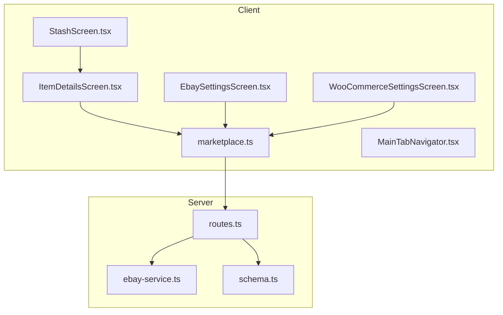
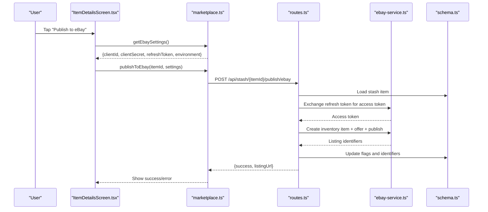
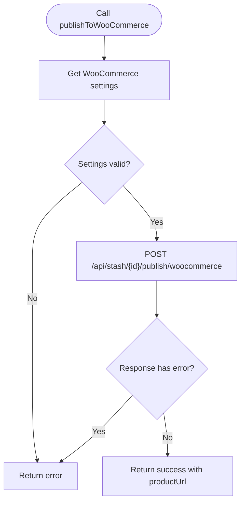
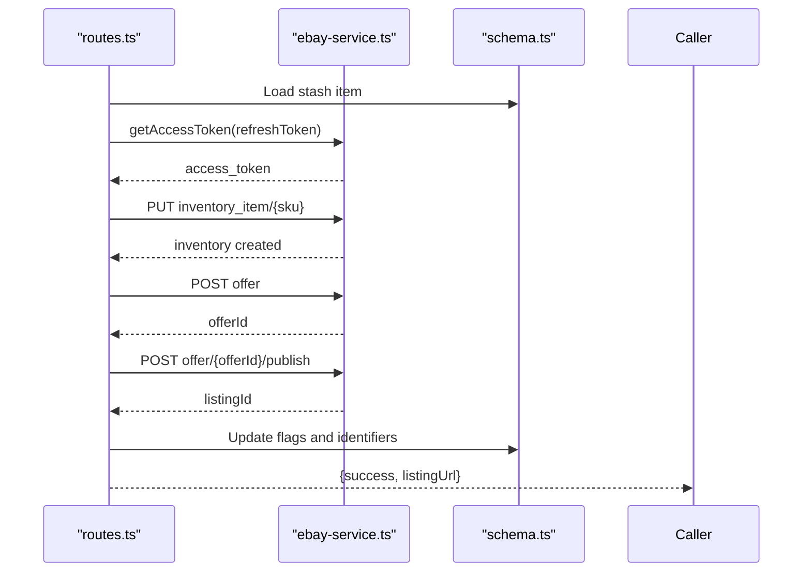
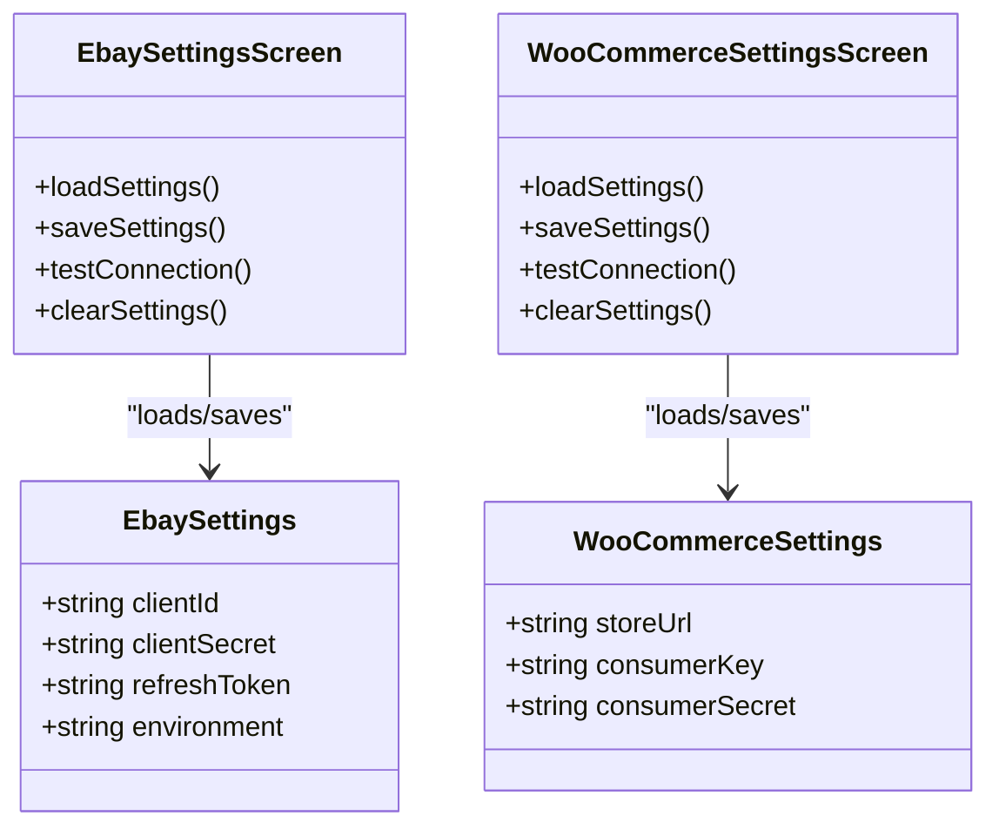
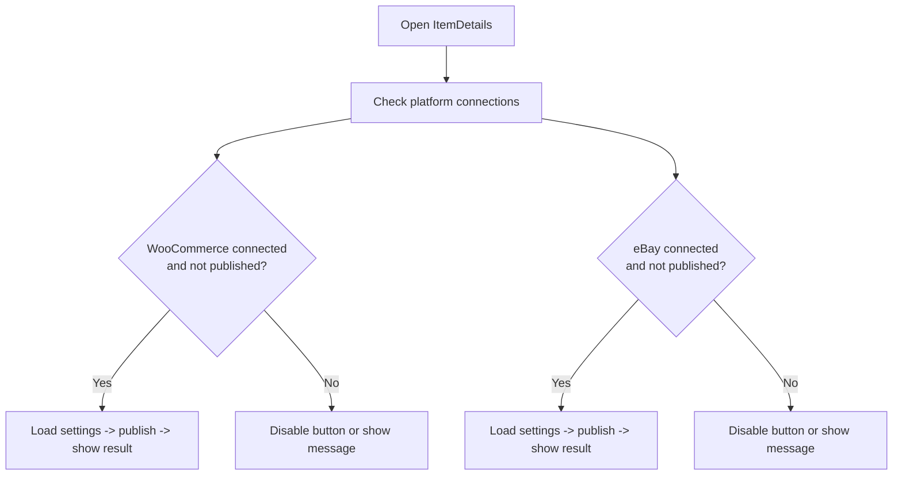
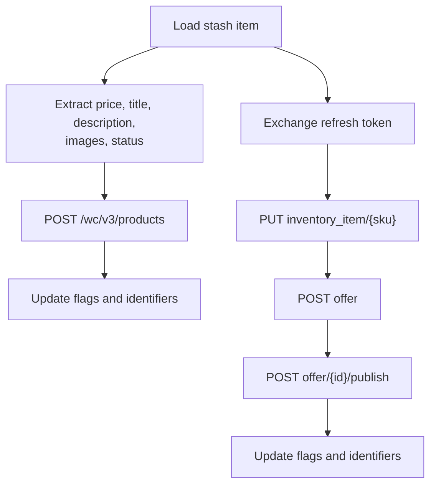
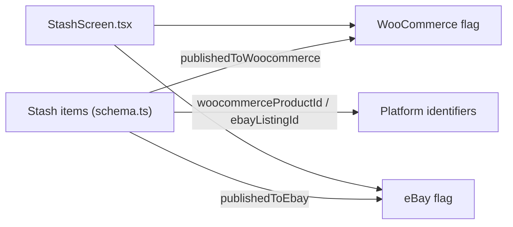
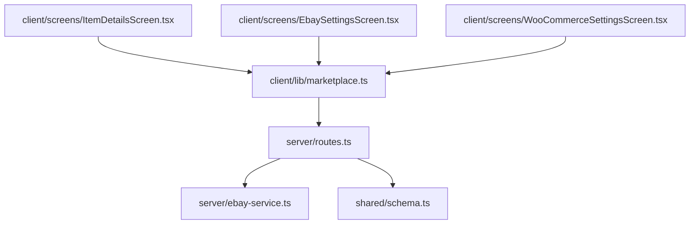
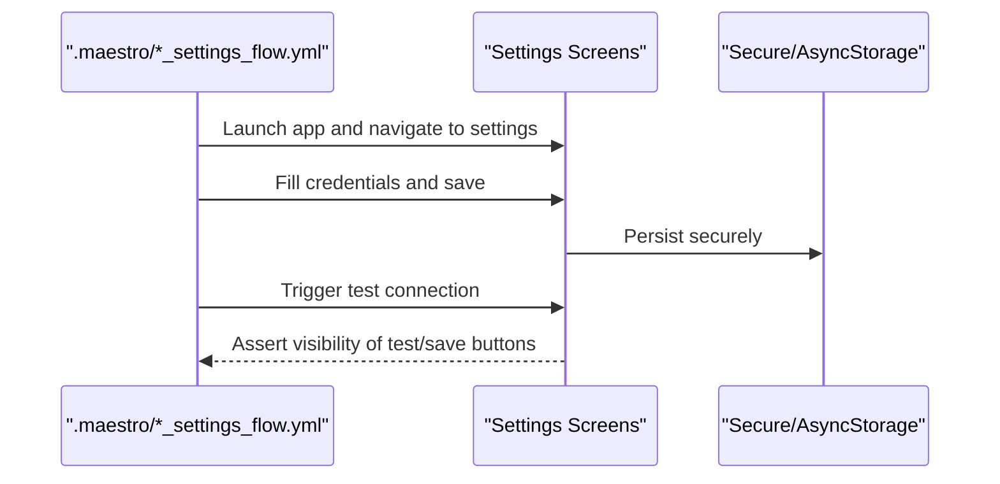

# Multi-Platform Publishing

<cite>
**Referenced Files in This Document**
- [marketplace.ts](file://client/lib/marketplace.ts)
- [routes.ts](file://server/routes.ts)
- [ebay-service.ts](file://server/ebay-service.ts)
- [ItemDetailsScreen.tsx](file://client/screens/ItemDetailsScreen.tsx)
- [StashScreen.tsx](file://client/screens/StashScreen.tsx)
- [EbaySettingsScreen.tsx](file://client/screens/EbaySettingsScreen.tsx)
- [WooCommerceSettingsScreen.tsx](file://client/screens/WooCommerceSettingsScreen.tsx)
- [schema.ts](file://shared/schema.ts)
- [MainTabNavigator.tsx](file://client/navigation/MainTabNavigator.tsx)
- [ebay_settings_flow.yml](file://.maestro/ebay_settings_flow.yml)
- [woocommerce_settings_flow.yml](file://.maestro/woocommerce_settings_flow.yml)
</cite>

## Table of Contents
1. [Introduction](#introduction)
2. [Project Structure](#project-structure)
3. [Core Components](#core-components)
4. [Architecture Overview](#architecture-overview)
5. [Detailed Component Analysis](#detailed-component-analysis)
6. [Dependency Analysis](#dependency-analysis)
7. [Performance Considerations](#performance-considerations)
8. [Troubleshooting Guide](#troubleshooting-guide)
9. [Conclusion](#conclusion)
10. [Appendices](#appendices)

## Introduction
This document explains the multi-platform marketplace publishing capabilities of the application, focusing on the unified marketplace interface that enables simultaneous publishing to eBay and WooCommerce. It covers the publishing workflow orchestration, platform selection, data transformation for each platform, settings management for multiple marketplace accounts, the publishing queue system, error handling, conflict resolution strategies, platform-specific data mapping requirements, and the user interface components for managing multi-platform listings, bulk operations, and cross-platform analytics. Best practices for coordinating listings across platforms, avoiding duplicate content issues, and maintaining consistent pricing and inventory levels are also included.

## Project Structure
The multi-platform publishing feature spans three primary layers:
- Client-side UI and orchestration: handles user interactions, settings retrieval, and publishing initiation.
- Server-side API and platform adapters: validates credentials, transforms data, and invokes external marketplace APIs.
- Shared data models: define persisted stash items and marketplace-specific flags.

**Diagram sources**
- [ItemDetailsScreen.tsx](file://client/screens/ItemDetailsScreen.tsx#L148-L240)
- [StashScreen.tsx](file://client/screens/StashScreen.tsx#L93-L163)
- [EbaySettingsScreen.tsx](file://client/screens/EbaySettingsScreen.tsx#L27-L370)
- [WooCommerceSettingsScreen.tsx](file://client/screens/WooCommerceSettingsScreen.tsx#L26-L340)
- [marketplace.ts](file://client/lib/marketplace.ts#L81-L128)
- [routes.ts](file://server/routes.ts#L387-L647)
- [ebay-service.ts](file://server/ebay-service.ts#L1-L474)
- [schema.ts](file://shared/schema.ts#L29-L50)

**Section sources**
- [marketplace.ts](file://client/lib/marketplace.ts#L1-L129)
- [routes.ts](file://server/routes.ts#L387-L647)
- [ebay-service.ts](file://server/ebay-service.ts#L1-L474)
- [schema.ts](file://shared/schema.ts#L29-L50)

## Core Components
- Unified marketplace library: Provides typed settings retrieval and platform publishing functions for both eBay and WooCommerce.
- Server routes: Expose endpoints to publish stash items to each marketplace, validating credentials and transforming data.
- eBay service module: Encapsulates eBay API access, token refresh, and listing operations.
- Client screens: Settings screens for secure credential storage and UI for publishing and listing management.
- Shared schema: Defines stash items and marketplace publication flags.

Key responsibilities:
- Settings management: Store and retrieve credentials per platform using secure storage on native platforms and AsyncStorage on web.
- Publishing orchestration: Client triggers server endpoints with transformed data; server validates and calls platform APIs.
- Conflict prevention: Prevents duplicate publications by checking flags on stash items.
- Error handling: Returns structured errors from platform APIs and surfaces actionable messages to users.

**Section sources**
- [marketplace.ts](file://client/lib/marketplace.ts#L19-L79)
- [routes.ts](file://server/routes.ts#L387-L647)
- [ebay-service.ts](file://server/ebay-service.ts#L42-L62)
- [schema.ts](file://shared/schema.ts#L29-L50)

## Architecture Overview
The publishing workflow follows a client-initiated, server-mediated pattern:
- Client detects platform connections and item publication flags.
- Client calls server endpoints with platform credentials.
- Server validates credentials, transforms stash item data, and invokes platform APIs.
- Server updates stash item flags and returns success or error responses.

**Diagram sources**
- [ItemDetailsScreen.tsx](file://client/screens/ItemDetailsScreen.tsx#L195-L240)
- [marketplace.ts](file://client/lib/marketplace.ts#L105-L128)
- [routes.ts](file://server/routes.ts#L457-L647)
- [ebay-service.ts](file://server/ebay-service.ts#L42-L62)
- [schema.ts](file://shared/schema.ts#L29-L50)

## Detailed Component Analysis

### Unified Marketplace Library
The client-side library centralizes platform credentials retrieval and publishing operations:
- Retrieves platform settings from secure storage and AsyncStorage.
- Publishes to platforms via API requests with transformed data.
- Returns structured results with success flags and optional URLs.

**Diagram sources**
- [marketplace.ts](file://client/lib/marketplace.ts#L81-L103)

**Section sources**
- [marketplace.ts](file://client/lib/marketplace.ts#L19-L79)
- [marketplace.ts](file://client/lib/marketplace.ts#L81-L128)

### eBay Publishing Workflow
The server orchestrates eBay publishing with token exchange and listing creation:
- Validates credentials and refresh token presence.
- Exchanges refresh token for access token.
- Creates inventory item, then offer, and publishes the listing.
- Updates stash item with listing identifiers and flags.

**Diagram sources**
- [routes.ts](file://server/routes.ts#L457-L647)
- [ebay-service.ts](file://server/ebay-service.ts#L42-L62)
- [schema.ts](file://shared/schema.ts#L29-L50)

**Section sources**
- [routes.ts](file://server/routes.ts#L457-L647)
- [ebay-service.ts](file://server/ebay-service.ts#L42-L62)

### Settings Management
Settings are stored per platform with environment toggles and optional refresh tokens:
- eBay: Client ID, Client Secret, optional Refresh Token, environment (sandbox/production).
- WooCommerce: Store URL, Consumer Key, Consumer Secret.
- Secure storage: Uses platform-specific secure storage on native; falls back to AsyncStorage on web.

**Diagram sources**
- [EbaySettingsScreen.tsx](file://client/screens/EbaySettingsScreen.tsx#L20-L187)
- [WooCommerceSettingsScreen.tsx](file://client/screens/WooCommerceSettingsScreen.tsx#L20-L184)
- [marketplace.ts](file://client/lib/marketplace.ts#L6-L17)

**Section sources**
- [EbaySettingsScreen.tsx](file://client/screens/EbaySettingsScreen.tsx#L40-L110)
- [WooCommerceSettingsScreen.tsx](file://client/screens/WooCommerceSettingsScreen.tsx#L43-L106)
- [marketplace.ts](file://client/lib/marketplace.ts#L19-L79)

### UI Orchestration for Publishing
The item details screen coordinates platform publishing:
- Detects platform connection status and item publication flags.
- Initiates platform-specific publishing flows with user feedback.
- Invalidates queries to reflect updated publication state.

**Diagram sources**
- [ItemDetailsScreen.tsx](file://client/screens/ItemDetailsScreen.tsx#L98-L107)
- [ItemDetailsScreen.tsx](file://client/screens/ItemDetailsScreen.tsx#L148-L193)
- [ItemDetailsScreen.tsx](file://client/screens/ItemDetailsScreen.tsx#L195-L240)

**Section sources**
- [ItemDetailsScreen.tsx](file://client/screens/ItemDetailsScreen.tsx#L98-L107)
- [ItemDetailsScreen.tsx](file://client/screens/ItemDetailsScreen.tsx#L148-L193)
- [ItemDetailsScreen.tsx](file://client/screens/ItemDetailsScreen.tsx#L195-L240)

### Data Transformation and Mapping
Platform-specific transformations and mappings:
- eBay:
  - Token exchange using refresh token.
  - Inventory item creation with product metadata and images.
  - Offer creation with pricing, quantity, and marketplace settings.
  - Category mapping via internal map for normalized categories.
- WooCommerce:
  - REST API call with Basic auth using consumer key/secret.
  - Product creation with transformed pricing and SEO-friendly descriptions.

**Diagram sources**
- [routes.ts](file://server/routes.ts#L409-L450)
- [routes.ts](file://server/routes.ts#L520-L642)
- [ebay-service.ts](file://server/ebay-service.ts#L274-L313)

**Section sources**
- [routes.ts](file://server/routes.ts#L409-L450)
- [routes.ts](file://server/routes.ts#L520-L642)
- [ebay-service.ts](file://server/ebay-service.ts#L274-L313)

### Cross-Platform Analytics and Listing Visibility
- Stash items track publication flags and identifiers for both platforms.
- UI surfaces publication badges and counts to guide bulk operations.
- Navigation integrates with tab-based browsing for scanning and listing management.

**Diagram sources**
- [schema.ts](file://shared/schema.ts#L29-L50)
- [StashScreen.tsx](file://client/screens/StashScreen.tsx#L18-L26)

**Section sources**
- [schema.ts](file://shared/schema.ts#L29-L50)
- [StashScreen.tsx](file://client/screens/StashScreen.tsx#L18-L26)

## Dependency Analysis
The system exhibits clear separation of concerns:
- Client depends on marketplace library and UI screens.
- Marketplace library depends on secure storage and API client.
- Server routes depend on platform services and database schema.
- eBay service encapsulates platform-specific logic.

**Diagram sources**
- [marketplace.ts](file://client/lib/marketplace.ts#L1-L129)
- [routes.ts](file://server/routes.ts#L387-L647)
- [ebay-service.ts](file://server/ebay-service.ts#L1-L474)
- [schema.ts](file://shared/schema.ts#L29-L50)
- [ItemDetailsScreen.tsx](file://client/screens/ItemDetailsScreen.tsx#L148-L240)
- [EbaySettingsScreen.tsx](file://client/screens/EbaySettingsScreen.tsx#L27-L370)
- [WooCommerceSettingsScreen.tsx](file://client/screens/WooCommerceSettingsScreen.tsx#L26-L340)

**Section sources**
- [marketplace.ts](file://client/lib/marketplace.ts#L1-L129)
- [routes.ts](file://server/routes.ts#L387-L647)
- [ebay-service.ts](file://server/ebay-service.ts#L1-L474)
- [schema.ts](file://shared/schema.ts#L29-L50)

## Performance Considerations
- Minimize redundant network calls: cache platform connection status and avoid repeated settings retrieval.
- Batch operations: leverage server endpoints for bulk publishing where available.
- Asynchronous UI updates: invalidate queries after successful publishes to reduce polling overhead.
- Token caching: reuse access tokens until expiration to reduce token exchange frequency.

## Troubleshooting Guide
Common issues and resolutions:
- Missing credentials:
  - Ensure both Client ID/Secret and Refresh Token are present for eBay; Store URL, Consumer Key, and Consumer Secret for WooCommerce.
- Authentication failures:
  - Test connections from settings screens to validate credentials and environment configuration.
- Duplicate publication:
  - Server prevents re-publishing by checking publication flags; UI disables buttons accordingly.
- eBay policy requirements:
  - Business policies (shipping, payment, return) must be configured in the seller hub before listing creation.
- Network errors:
  - Inspect returned error messages from platform APIs and surface actionable alerts to users.

**Section sources**
- [routes.ts](file://server/routes.ts#L466-L470)
- [routes.ts](file://server/routes.ts#L608-L621)
- [ItemDetailsScreen.tsx](file://client/screens/ItemDetailsScreen.tsx#L151-L161)
- [ItemDetailsScreen.tsx](file://client/screens/ItemDetailsScreen.tsx#L198-L208)

## Conclusion
The multi-platform publishing system provides a unified interface for simultaneously listing items on eBay and WooCommerce. It enforces secure credential management, performs robust data transformation, and prevents conflicts through publication flags. The modular architecture supports maintainability and extensibility, while the UI ensures intuitive user control over publishing operations.

## Appendices

### Best Practices for Cross-Platform Coordination
- Avoid duplicate content:
  - Use platform-specific descriptions and titles where necessary; maintain canonical content on one platform.
- Pricing consistency:
  - Derive prices from standardized estimates and apply platform-specific rounding rules.
- Inventory synchronization:
  - Use platform identifiers to reconcile stock levels and prevent overselling.
- Conflict resolution:
  - Prefer manual override for conflicting listings; implement quarantine workflows for duplicates.
- Audit trails:
  - Track publication attempts, errors, and timestamps for diagnostics.

### Testing Automation
Automated flows validate settings entry and connection testing for both platforms.

**Diagram sources**
- [.maestro/ebay_settings_flow.yml](file://.maestro/ebay_settings_flow.yml#L10-L45)
- [.maestro/woocommerce_settings_flow.yml](file://.maestro/woocommerce_settings_flow.yml#L10-L45)