# Multi-Platform Publishing

<cite>
**Referenced Files in This Document**
- [marketplace.ts](file://client/lib/marketplace.ts)
- [routes.ts](file://server/routes.ts)
- [ai-providers.ts](file://server/ai-providers.ts)
- [ListingEditorScreen.tsx](file://client/screens/ListingEditorScreen.tsx)
- [AnalysisScreen.tsx](file://client/screens/AnalysisScreen.tsx)
- [StashScreen.tsx](file://client/screens/StashScreen.tsx)
- [EbaySettingsScreen.tsx](file://client/screens/EbaySettingsScreen.tsx)
- [WooCommerceSettingsScreen.tsx](file://client/screens/WooCommerceSettingsScreen.tsx)
- [schema.ts](file://shared/schema.ts)
- [RootStackNavigator.tsx](file://client/navigation/RootStackNavigator.tsx)
- [ebay_settings_flow.yml](file://.maestro/ebay_settings_flow.yml)
- [woocommerce_settings_flow.yml](file://.maestro/woocommerce_settings_flow.yml)
- [0006_platform_versions.sql](file://migrations/0006_platform_versions.sql)
</cite>

## Update Summary
**Changes Made**
- Added support for Poshmark and Depop platforms with platform-specific listing versions
- Integrated Stripe platform support for e-commerce product creation
- Enhanced AI analysis with platform-specific copywriting styles and market match comparisons
- Updated database schema with platform_versions and market_matches JSONB columns
- Expanded marketplace publishing workflow to include four major platforms

## Table of Contents
1. [Introduction](#introduction)
2. [Project Structure](#project-structure)
3. [Core Components](#core-components)
4. [Architecture Overview](#architecture-overview)
5. [Detailed Component Analysis](#detailed-component-analysis)
6. [Enhanced Platform Support](#enhanced-platform-support)
7. [Database Schema Enhancements](#database-schema-enhancements)
8. [AI-Powered Platform Optimization](#ai-powered-platform-optimization)
9. [Dependency Analysis](#dependency-analysis)
10. [Performance Considerations](#performance-considerations)
11. [Troubleshooting Guide](#troubleshooting-guide)
12. [Conclusion](#conclusion)
13. [Appendices](#appendices)

## Introduction
This document explains the enhanced multi-platform marketplace publishing capabilities of the application, now supporting four major platforms: eBay, Poshmark, Depop, and Stripe. The system features AI-powered platform-specific optimizations, market match comparisons, and comprehensive cross-platform coordination. It covers the unified marketplace interface that enables simultaneous publishing to multiple platforms, the enhanced publishing workflow orchestration, platform selection, data transformation for each platform, settings management for multiple marketplace accounts, the publishing queue system, error handling, conflict resolution strategies, platform-specific data mapping requirements, and the user interface components for managing multi-platform listings, bulk operations, and cross-platform analytics. Best practices for coordinating listings across platforms, avoiding duplicate content issues, and maintaining consistent pricing and inventory levels are also included.

## Project Structure
The enhanced multi-platform publishing feature spans four primary layers with expanded platform support:
- Client-side UI and orchestration: handles user interactions, settings retrieval, and publishing initiation across four platforms.
- Server-side API and platform adapters: validates credentials, transforms data, and invokes external marketplace APIs.
- AI-powered optimization engine: generates platform-specific copywriting and market match comparisons.
- Shared data models: define persisted stash items with enhanced platform versions and market data.

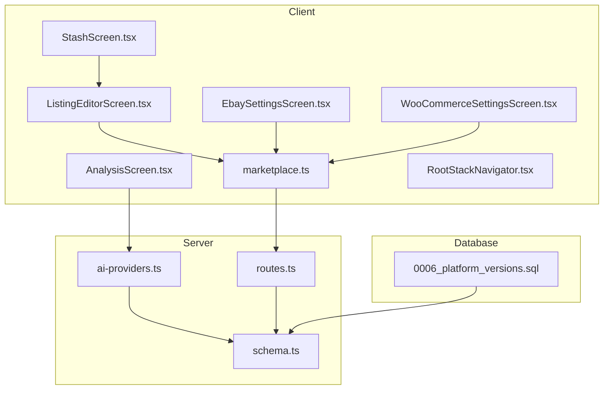

**Diagram sources**
- [ListingEditorScreen.tsx:60-259](file://client/screens/ListingEditorScreen.tsx#L60-L259)
- [AnalysisScreen.tsx:33-737](file://client/screens/AnalysisScreen.tsx#L33-L737)
- [StashScreen.tsx:93-163](file://client/screens/StashScreen.tsx#L93-L163)
- [EbaySettingsScreen.tsx:27-370](file://client/screens/EbaySettingsScreen.tsx#L27-L370)
- [WooCommerceSettingsScreen.tsx:26-340](file://client/screens/WooCommerceSettingsScreen.tsx#L26-L340)
- [marketplace.ts:81-128](file://client/lib/marketplace.ts#L81-L128)
- [routes.ts:387-647](file://server/routes.ts#L387-L647)
- [ai-providers.ts:200-399](file://server/ai-providers.ts#L200-L399)
- [schema.ts:33-59](file://shared/schema.ts#L33-L59)
- [RootStackNavigator.tsx:25-72](file://client/navigation/RootStackNavigator.tsx#L25-L72)
- [0006_platform_versions.sql:1-3](file://migrations/0006_platform_versions.sql#L1-L3)

**Section sources**
- [marketplace.ts:1-129](file://client/lib/marketplace.ts#L1-L129)
- [routes.ts:387-647](file://server/routes.ts#L387-L647)
- [ai-providers.ts:200-399](file://server/ai-providers.ts#L200-L399)
- [schema.ts:33-59](file://shared/schema.ts#L33-L59)
- [RootStackNavigator.tsx:25-72](file://client/navigation/RootStackNavigator.tsx#L25-L72)

## Core Components
- Unified marketplace library: Provides typed settings retrieval and platform publishing functions for eBay, Poshmark, Depop, and Stripe.
- Enhanced AI analysis engine: Generates platform-specific listing versions with tailored copywriting styles and market match comparisons.
- Server routes: Expose endpoints to publish stash items to each marketplace, validating credentials and transforming data.
- Client screens: Settings screens for secure credential storage and UI for publishing and listing management across all platforms.
- Enhanced shared schema: Defines stash items with platform_versions and market_matches JSONB columns for comprehensive platform data.

Key responsibilities:
- Settings management: Store and retrieve credentials per platform using secure storage on native platforms and AsyncStorage on web.
- AI-powered optimization: Generate platform-specific copywriting, pricing strategies, and market comparisons.
- Publishing orchestration: Client triggers server endpoints with transformed data; server validates and calls platform APIs.
- Conflict prevention: Prevents duplicate publications by checking flags on stash items.
- Error handling: Returns structured errors from platform APIs and surfaces actionable messages to users.

**Section sources**
- [marketplace.ts:19-79](file://client/lib/marketplace.ts#L19-L79)
- [routes.ts:387-647](file://server/routes.ts#L387-L647)
- [ai-providers.ts:220-227](file://server/ai-providers.ts#L220-L227)
- [schema.ts:33-59](file://shared/schema.ts#L33-L59)

## Architecture Overview
The enhanced publishing workflow follows a client-initiated, AI-optimized, server-mediated pattern with four platform support:
- Client detects platform connections and item publication flags.
- AI engine generates platform-specific listing versions with optimized copywriting.
- Client calls server endpoints with platform credentials and optimized data.
- Server validates credentials, transforms stash item data, and invokes platform APIs.
- Server updates stash item flags and returns success or error responses.

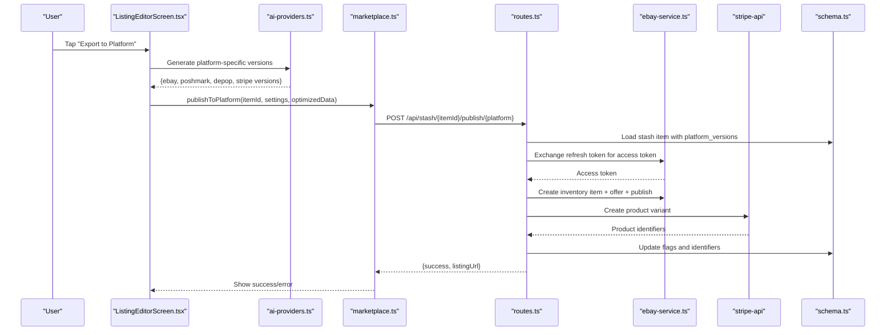

**Diagram sources**
- [ListingEditorScreen.tsx:135-237](file://client/screens/ListingEditorScreen.tsx#L135-L237)
- [ai-providers.ts:220-227](file://server/ai-providers.ts#L220-L227)
- [marketplace.ts:105-128](file://client/lib/marketplace.ts#L105-L128)
- [routes.ts:555-767](file://server/routes.ts#L555-L767)
- [schema.ts:55-56](file://shared/schema.ts#L55-L56)

## Detailed Component Analysis

### Enhanced Marketplace Library
The client-side library now supports four platforms with centralized credential retrieval and publishing operations:
- Retrieves platform settings from secure storage and AsyncStorage.
- Supports eBay, Poshmark, Depop, and Stripe publishing via API requests with optimized data.
- Returns structured results with success flags and optional URLs.

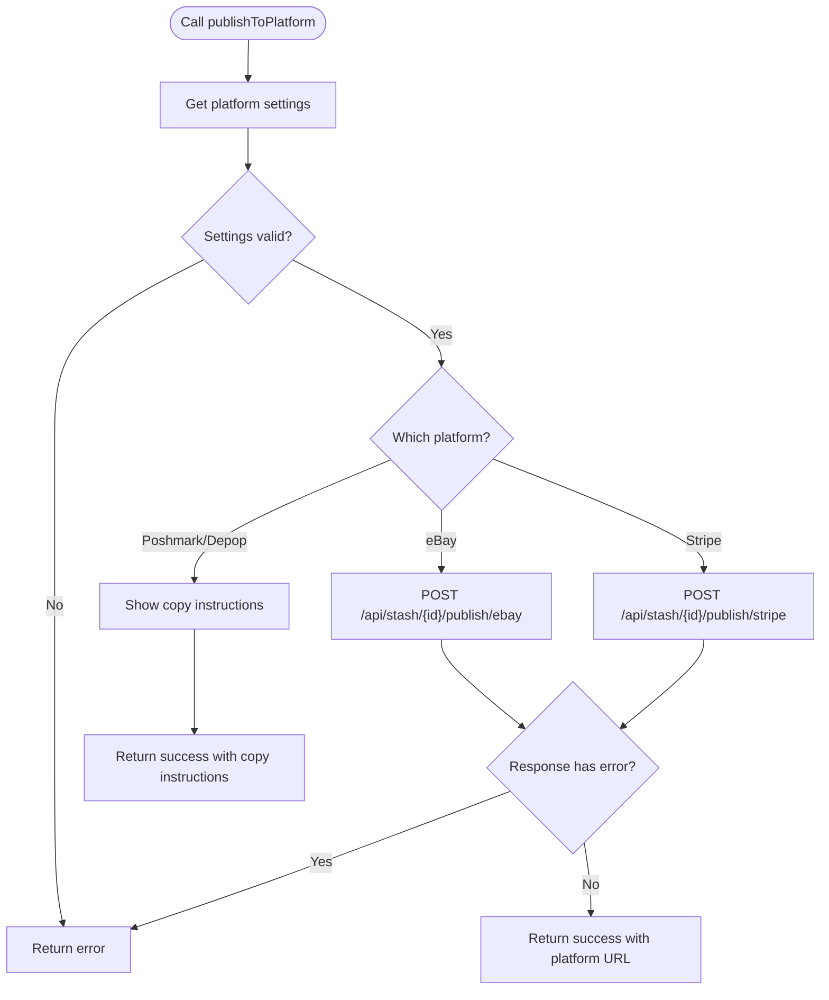

**Diagram sources**
- [marketplace.ts:81-103](file://client/lib/marketplace.ts#L81-L103)
- [ListingEditorScreen.tsx:135-237](file://client/screens/ListingEditorScreen.tsx#L135-L237)

**Section sources**
- [marketplace.ts:19-79](file://client/lib/marketplace.ts#L19-L79)
- [marketplace.ts:81-128](file://client/lib/marketplace.ts#L81-L128)

### Enhanced AI Analysis Engine
The AI-powered analysis engine now generates comprehensive platform-specific optimizations:
- Platform-specific copywriting styles for each marketplace
- Market match comparisons from 3-5 comparable sold listings
- Optimized pricing strategies for different buyer demographics
- Tailored hashtags and search keywords for each platform

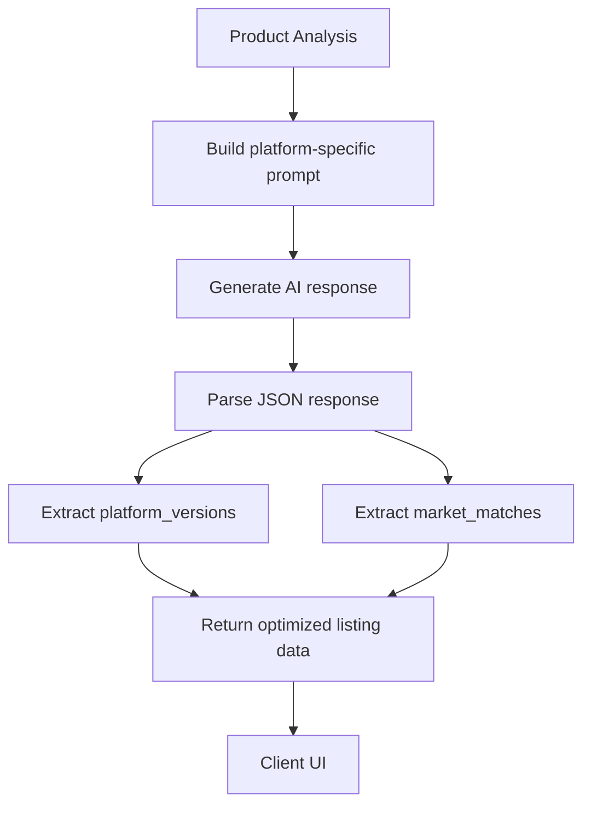

**Diagram sources**
- [ai-providers.ts:200-227](file://server/ai-providers.ts#L200-L227)
- [ai-providers.ts:268-319](file://server/ai-providers.ts#L268-L319)

**Section sources**
- [ai-providers.ts:200-227](file://server/ai-providers.ts#L200-L227)
- [ai-providers.ts:268-319](file://server/ai-providers.ts#L268-L319)

### Enhanced Settings Management
Settings are now stored per platform with environment toggles and platform-specific configurations:
- eBay: Client ID, Client Secret, optional Refresh Token, environment (sandbox/production).
- Poshmark/Depop: Manual copy instructions and platform-specific formatting guidance.
- Stripe: API keys and product configuration settings.
- WooCommerce: Store URL, Consumer Key, Consumer Secret.

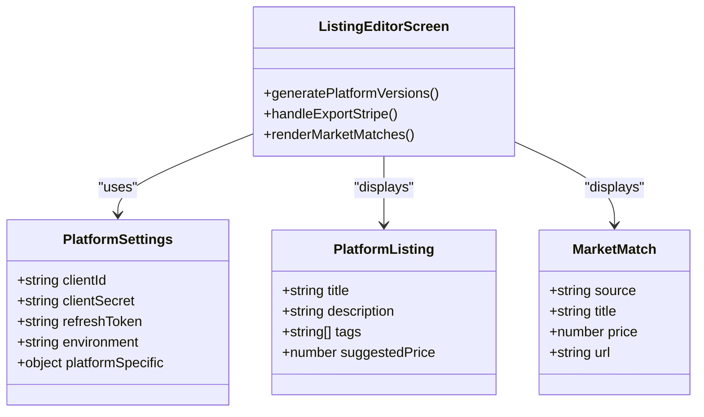

**Diagram sources**
- [ListingEditorScreen.tsx:60-259](file://client/screens/ListingEditorScreen.tsx#L60-L259)
- [RootStackNavigator.tsx:25-72](file://client/navigation/RootStackNavigator.tsx#L25-L72)

**Section sources**
- [ListingEditorScreen.tsx:60-259](file://client/screens/ListingEditorScreen.tsx#L60-L259)
- [RootStackNavigator.tsx:25-72](file://client/navigation/RootStackNavigator.tsx#L25-L72)

### Enhanced UI Orchestration for Publishing
The listing editor screen now coordinates publishing across four platforms:
- Detects platform connection status and item publication flags.
- Displays AI-generated platform-specific versions with copy instructions.
- Initiates platform-specific publishing flows with user feedback.
- Shows market match comparisons for informed pricing decisions.

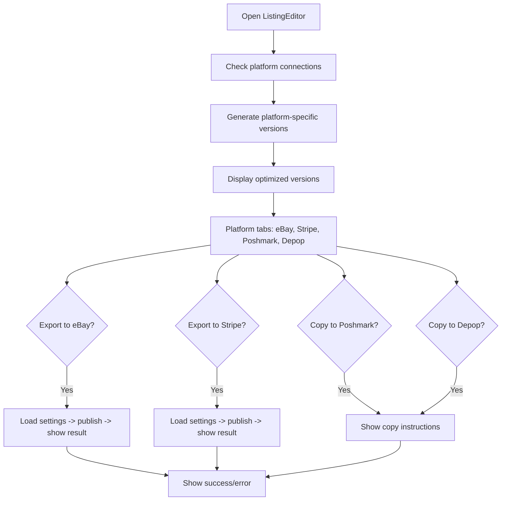

**Diagram sources**
- [ListingEditorScreen.tsx:60-259](file://client/screens/ListingEditorScreen.tsx#L60-L259)
- [ListingEditorScreen.tsx:389-410](file://client/screens/ListingEditorScreen.tsx#L389-L410)

**Section sources**
- [ListingEditorScreen.tsx:60-259](file://client/screens/ListingEditorScreen.tsx#L60-L259)
- [ListingEditorScreen.tsx:389-410](file://client/screens/ListingEditorScreen.tsx#L389-L410)

### Enhanced Data Transformation and Mapping
Platform-specific transformations and mappings now support four platforms:
- eBay:
  - Token exchange using refresh token.
  - Inventory item creation with product metadata and images.
  - Offer creation with pricing, quantity, and marketplace settings.
  - Category mapping via internal map for normalized categories.
- Stripe:
  - Direct product creation via Stripe API.
  - SKU generation and inventory management.
  - Pricing and tax configuration.
- Poshmark/Depop:
  - Manual copy instructions with platform-specific formatting.
  - Emoji-friendly descriptions for younger demographics.
  - Trendy titles and hashtags optimized for social commerce.
- WooCommerce:
  - REST API call with Basic auth using consumer key/secret.
  - Product creation with transformed pricing and SEO-friendly descriptions.

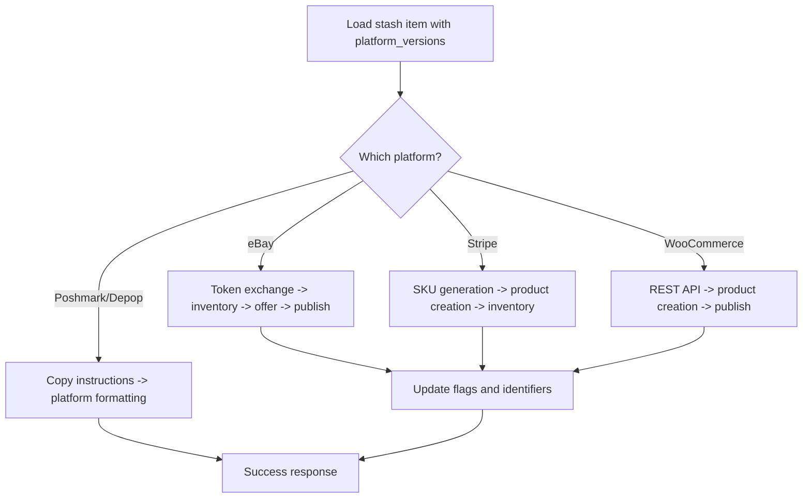

**Diagram sources**
- [routes.ts:555-767](file://server/routes.ts#L555-L767)
- [ListingEditorScreen.tsx:135-237](file://client/screens/ListingEditorScreen.tsx#L135-L237)

**Section sources**
- [routes.ts:555-767](file://server/routes.ts#L555-L767)
- [ListingEditorScreen.tsx:135-237](file://client/screens/ListingEditorScreen.tsx#L135-L237)

### Enhanced Cross-Platform Analytics and Listing Visibility
- Stash items now track publication flags and identifiers for all four platforms.
- AI-generated platform_versions provide optimized listing data for each marketplace.
- Market matches enable informed pricing decisions based on comparable sales.
- UI surfaces publication badges and platform-specific analytics.

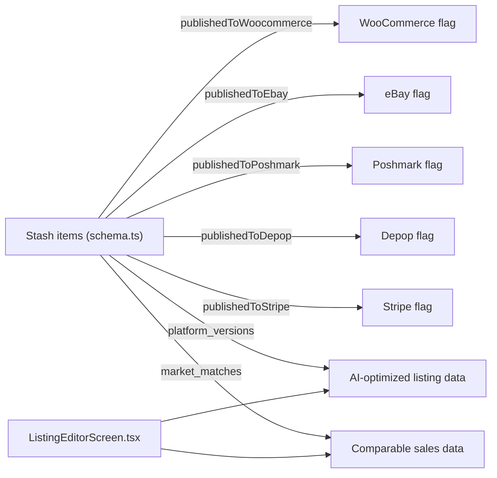

**Diagram sources**
- [schema.ts:33-59](file://shared/schema.ts#L33-L59)
- [ListingEditorScreen.tsx:412-416](file://client/screens/ListingEditorScreen.tsx#L412-L416)

**Section sources**
- [schema.ts:33-59](file://shared/schema.ts#L33-L59)
- [ListingEditorScreen.tsx:412-416](file://client/screens/ListingEditorScreen.tsx#L412-L416)

## Enhanced Platform Support

### Platform-Specific Copywriting Styles
The AI engine generates platform-optimized copywriting for each marketplace:

- **eBay**: Ingredient-forward titles with product type and natural/handmade keywords (max 80 characters). HTML-formatted descriptions with bullet-pointed ingredient lists, scent/texture notes, and usage information. Keywords optimized for eBay search algorithms.

- **Poshmark**: Casual, sensory titles emphasizing scent or key benefits. Warm, personal descriptions mentioning ingredients, size, and how it feels/smells. Hashtag-style tags optimized for Poshmark's community-driven shopping experience.

- **Depop**: Short, trendy titles that appeal to Gen Z/millennial buyers. Emoji-friendly descriptions mentioning hero ingredients and scents. Hashtag-style tags optimized for Depop's social commerce platform.

- **Stripe**: Clean, branded e-commerce copy with professional product names. Polished marketing copy for boutique checkout experiences—leading with sensory experiences, followed by ingredients and size. Clean category keywords optimized for search.

**Section sources**
- [ai-providers.ts:220-227](file://server/ai-providers.ts#L220-L227)
- [ListingEditorScreen.tsx:63-77](file://client/screens/ListingEditorScreen.tsx#L63-L77)

### Market Match Comparisons
The AI engine generates 3-5 comparable sold listings from artisan/handmade platforms to inform pricing strategies:

- **Source Platforms**: Etsy, Amazon Handmade, Notonthehighstreet, Shopify
- **Comparable Data**: Realistic listing titles, sold prices, and plausible URLs
- **Purpose**: Help sellers understand fair market value and pricing positioning
- **Integration**: Market matches displayed in the listing editor for informed decision-making

**Section sources**
- [ai-providers.ts:213-219](file://server/ai-providers.ts#L213-L219)
- [ListingEditorScreen.tsx:412-416](file://client/screens/ListingEditorScreen.tsx#L412-L416)

### Stripe Platform Integration
Direct product creation via Stripe API with comprehensive e-commerce features:

- **Product Creation**: Automatic SKU generation and inventory management
- **Pricing Strategy**: Full retail/pricing without platform constraints
- **Checkout Experience**: Polished marketing copy suitable for boutique checkout pages
- **Integration**: Seamless product catalog management within Stripe ecosystem

**Section sources**
- [ListingEditorScreen.tsx:197-237](file://client/screens/ListingEditorScreen.tsx#L197-L237)
- [RootStackNavigator.tsx:65-71](file://client/navigation/RootStackNavigator.tsx#L65-L71)

## Database Schema Enhancements

### Enhanced Stash Items Schema
The database schema now includes two critical JSONB columns for platform optimization:

- **platform_versions** (JSONB): Stores AI-generated platform-specific listing data including:
  - Title optimization for each platform
  - Description formatting tailored to platform requirements
  - Tag optimization with platform-specific keywords
  - Suggested pricing strategies for different buyer demographics

- **market_matches** (JSONB): Stores comparable sales data for informed pricing decisions:
  - Source platform information
  - Realistic listing titles and descriptions
  - Sold prices for market benchmarking
  - Plausible URLs for reference

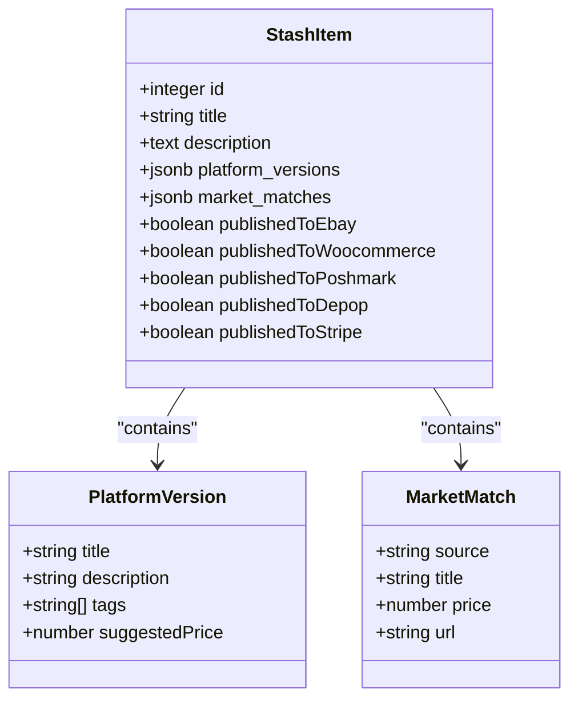

**Diagram sources**
- [schema.ts:33-59](file://shared/schema.ts#L33-L59)
- [0006_platform_versions.sql:1-3](file://migrations/0006_platform_versions.sql#L1-L3)

**Section sources**
- [schema.ts:33-59](file://shared/schema.ts#L33-L59)
- [0006_platform_versions.sql:1-3](file://migrations/0006_platform_versions.sql#L1-L3)

## AI-Powered Platform Optimization

### Platform-Specific Prompt Engineering
The AI system uses sophisticated prompts to generate optimized content for each platform:

- **eBay**: Emphasizes product specifications, ingredients, and natural/handmade attributes
- **Poshmark**: Focuses on lifestyle, scent appeal, and personal connection to products
- **Depop**: Targets trending language, emojis, and Gen Z preferences
- **Stripe**: Prioritizes professional presentation and e-commerce best practices

### Market Analysis Integration
The AI engine incorporates market analysis to provide competitive insights:

- **Comparable Sales**: Identifies similar items across artisan/handmade platforms
- **Pricing Benchmarking**: Establishes fair market value ranges
- **Trend Analysis**: Considers current market conditions and buyer preferences
- **Recommendation Engine**: Suggests optimal pricing strategies based on platform-specific behaviors

**Section sources**
- [ai-providers.ts:147-150](file://server/ai-providers.ts#L147-L150)
- [ai-providers.ts:213-227](file://server/ai-providers.ts#L213-L227)

## Dependency Analysis
The enhanced system maintains clear separation of concerns with expanded platform support:
- Client depends on marketplace library, AI analysis, and UI screens.
- Marketplace library depends on secure storage and API client.
- AI providers encapsulate platform-specific optimization logic.
- Server routes depend on platform services and enhanced database schema.
- Database migrations provide backward compatibility for existing installations.

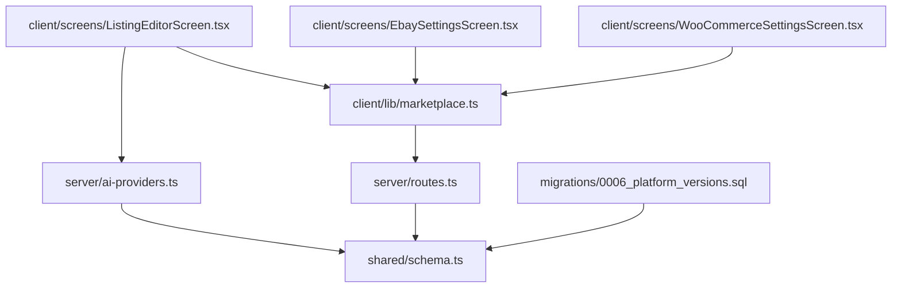

**Diagram sources**
- [marketplace.ts:1-129](file://client/lib/marketplace.ts#L1-L129)
- [routes.ts:387-647](file://server/routes.ts#L387-L647)
- [ai-providers.ts:200-399](file://server/ai-providers.ts#L200-L399)
- [schema.ts:33-59](file://shared/schema.ts#L33-L59)
- [ListingEditorScreen.tsx:60-259](file://client/screens/ListingEditorScreen.tsx#L60-L259)
- [EbaySettingsScreen.tsx:27-370](file://client/screens/EbaySettingsScreen.tsx#L27-L370)
- [WooCommerceSettingsScreen.tsx:26-340](file://client/screens/WooCommerceSettingsScreen.tsx#L26-L340)
- [0006_platform_versions.sql:1-3](file://migrations/0006_platform_versions.sql#L1-L3)

**Section sources**
- [marketplace.ts:1-129](file://client/lib/marketplace.ts#L1-L129)
- [routes.ts:387-647](file://server/routes.ts#L387-L647)
- [ai-providers.ts:200-399](file://server/ai-providers.ts#L200-L399)
- [schema.ts:33-59](file://shared/schema.ts#L33-L59)
- [0006_platform_versions.sql:1-3](file://migrations/0006_platform_versions.sql#L1-L3)

## Performance Considerations
- Minimize redundant network calls: cache platform connection status and avoid repeated settings retrieval.
- AI optimization caching: Cache platform-specific versions to reduce repeated AI processing.
- Batch operations: leverage server endpoints for bulk publishing where available.
- Asynchronous UI updates: invalidate queries after successful publishes to reduce polling overhead.
- Token caching: reuse access tokens until expiration to reduce token exchange frequency.
- Database optimization: JSONB queries optimized for platform_versions and market_matches lookups.

## Troubleshooting Guide
Common issues and resolutions for the enhanced platform support:
- Missing credentials:
  - Ensure proper credentials for all four platforms; eBay requires refresh tokens, Stripe requires API keys.
- Authentication failures:
  - Test connections from settings screens to validate credentials and environment configuration.
- Duplicate publication:
  - Server prevents re-publishing by checking publication flags; UI disables buttons accordingly.
- Platform-specific requirements:
  - eBay requires business policies configured; Stripe requires product setup; Poshmark/Depop require manual copy.
- Market match discrepancies:
  - Compare AI-generated market matches with actual comparable sales for pricing validation.
- Database migration issues:
  - Ensure platform_versions and market_matches columns are properly migrated in production environments.

**Section sources**
- [routes.ts:560-568](file://server/routes.ts#L560-L568)
- [routes.ts:732-736](file://server/routes.ts#L732-L736)
- [ListingEditorScreen.tsx:135-152](file://client/screens/ListingEditorScreen.tsx#L135-L152)
- [0006_platform_versions.sql:1-3](file://migrations/0006_platform_versions.sql#L1-L3)

## Conclusion
The enhanced multi-platform publishing system now provides comprehensive support for four major marketplaces: eBay, Poshmark, Depop, and Stripe. Through AI-powered platform optimization, market match comparisons, and enhanced database schema, the system delivers sophisticated cross-platform coordination capabilities. The modular architecture supports maintainability and extensibility while ensuring intuitive user control over publishing operations across all supported platforms.

## Appendices

### Best Practices for Enhanced Cross-Platform Coordination
- Platform-specific content strategy:
  - Use AI-generated platform_versions for optimized copywriting on each marketplace.
  - Leverage market_matches for informed pricing decisions and competitive positioning.
  - Maintain canonical content on one platform while adapting for others.
- Pricing consistency and strategy:
  - Apply platform-specific pricing strategies based on AI recommendations.
  - Monitor market_matches for dynamic pricing adjustments.
  - Consider platform fee structures and buyer demographics in pricing decisions.
- Inventory and listing management:
  - Use platform identifiers to reconcile stock levels across all marketplaces.
  - Implement quarantine workflows for duplicate listings across platforms.
  - Maintain separate pricing and promotional strategies per platform.
- Quality assurance and compliance:
  - Validate platform-specific requirements before publishing.
  - Monitor platform policies and update copywriting accordingly.
  - Track publication attempts, errors, and timestamps for diagnostics.

### Testing Automation for Enhanced Platform Support
Automated flows validate settings entry and connection testing for all four platforms with enhanced AI optimization validation.

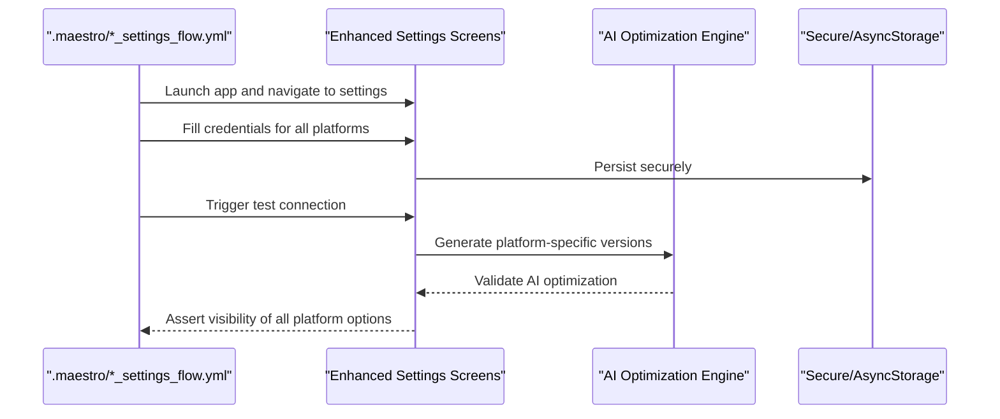

**Diagram sources**
- [.maestro/ebay_settings_flow.yml:10-45](file://.maestro/ebay_settings_flow.yml#L10-L45)
- [.maestro/woocommerce_settings_flow.yml:10-45](file://.maestro/woocommerce_settings_flow.yml#L10-L45)

**Section sources**
- [.maestro/ebay_settings_flow.yml:10-45](file://.maestro/ebay_settings_flow.yml#L10-L45)
- [.maestro/woocommerce_settings_flow.yml:10-45](file://.maestro/woocommerce_settings_flow.yml#L10-L45)