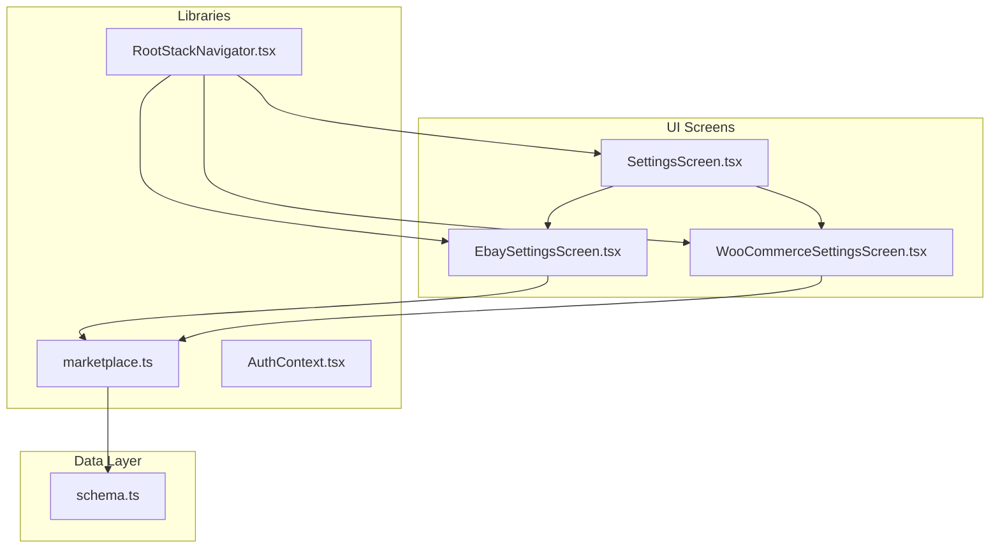
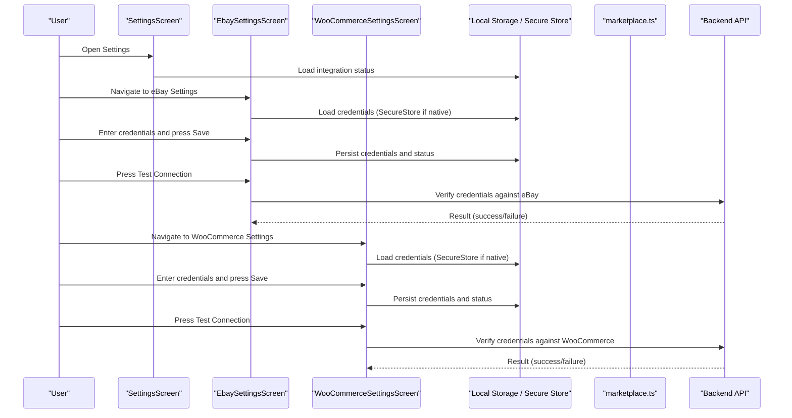
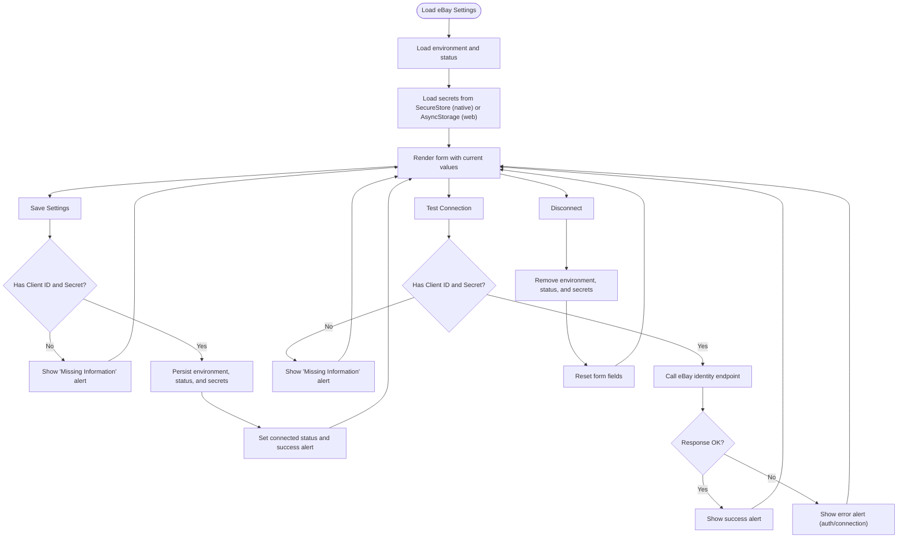
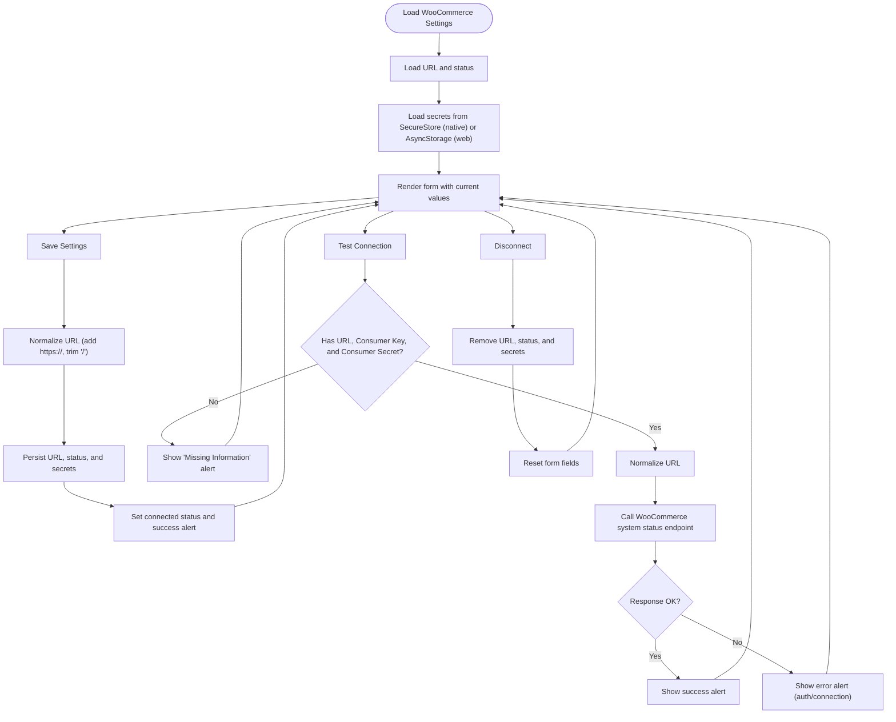
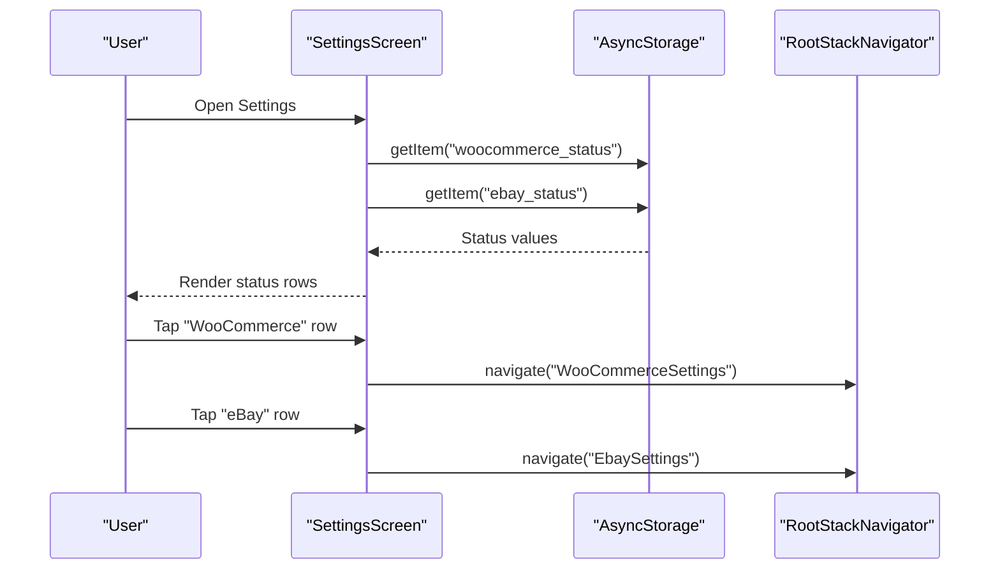
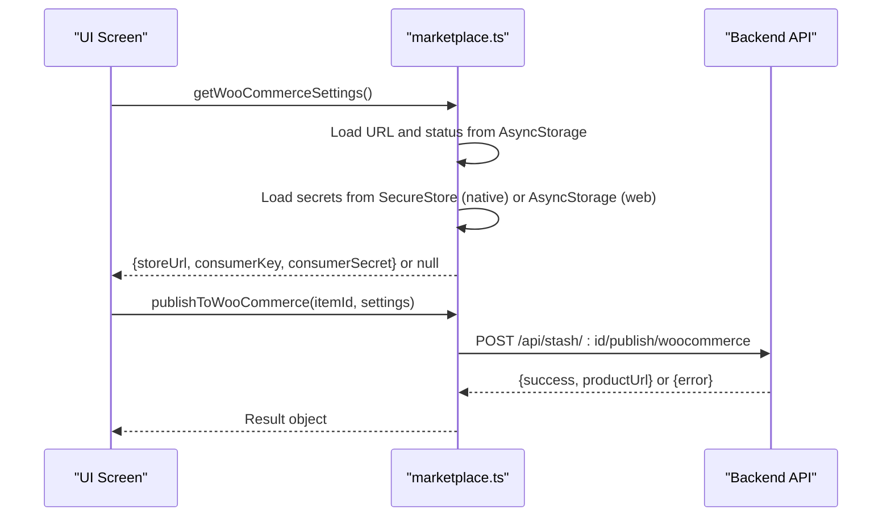
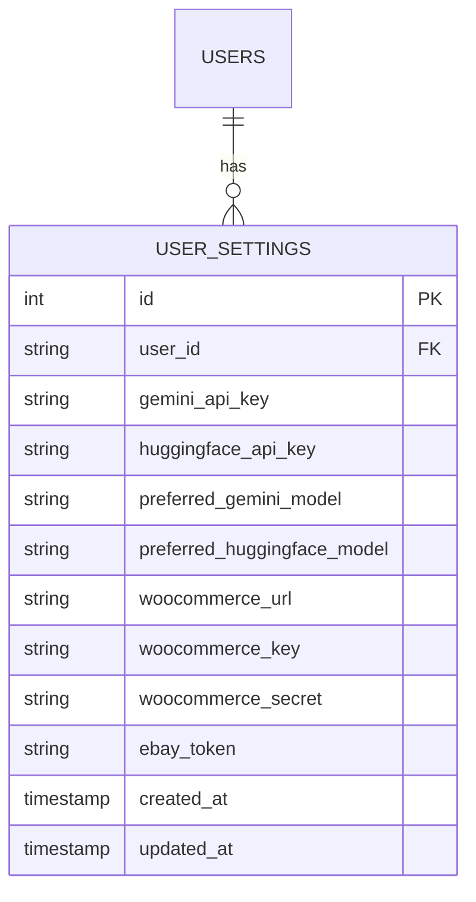
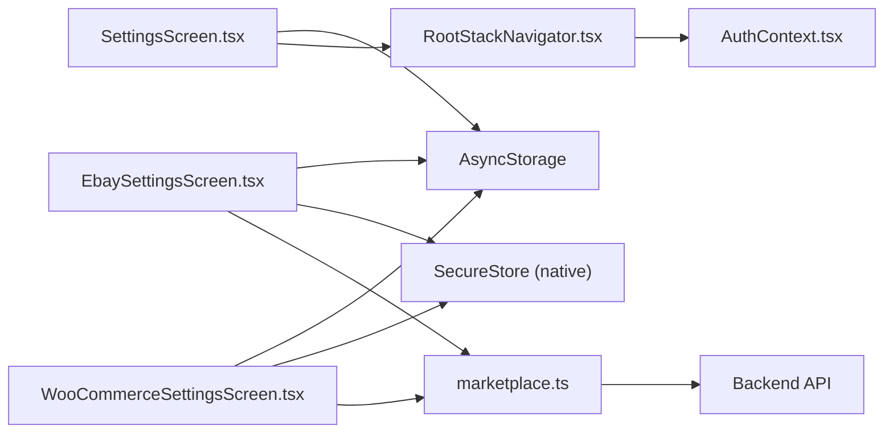

# Settings Management

<cite>
**Referenced Files in This Document**
- [EbaySettingsScreen.tsx](file://client/screens/EbaySettingsScreen.tsx)
- [WooCommerceSettingsScreen.tsx](file://client/screens/WooCommerceSettingsScreen.tsx)
- [SettingsScreen.tsx](file://client/screens/SettingsScreen.tsx)
- [marketplace.ts](file://client/lib/marketplace.ts)
- [RootStackNavigator.tsx](file://client/navigation/RootStackNavigator.tsx)
- [AuthContext.tsx](file://client/contexts/AuthContext.tsx)
- [schema.ts](file://shared/schema.ts)
</cite>

## Table of Contents
1. [Introduction](#introduction)
2. [Project Structure](#project-structure)
3. [Core Components](#core-components)
4. [Architecture Overview](#architecture-overview)
5. [Detailed Component Analysis](#detailed-component-analysis)
6. [Dependency Analysis](#dependency-analysis)
7. [Performance Considerations](#performance-considerations)
8. [Troubleshooting Guide](#troubleshooting-guide)
9. [Conclusion](#conclusion)
10. [Appendices](#appendices)

## Introduction
This document explains the marketplace settings management system for eBay and WooCommerce integrations. It covers how credentials are captured, validated, encrypted, and persisted; how settings are presented in the user interface; how settings are loaded and verified; and how errors are handled. It also documents the data models, storage mechanisms, defaults, migrations, and security practices for managing sensitive API credentials.

## Project Structure
The settings management spans three primary screens and supporting libraries:
- Settings overview screen for global AI keys and marketplace status
- eBay settings screen for client credentials and optional refresh tokens
- WooCommerce settings screen for store URL and consumer credentials
- Shared library for loading and publishing via marketplace APIs
- Navigation stack exposing settings screens
- Authentication context for app state
- Shared database schema for user settings persistence

**Diagram sources**
- [SettingsScreen.tsx](file://client/screens/SettingsScreen.tsx#L76-L284)
- [EbaySettingsScreen.tsx](file://client/screens/EbaySettingsScreen.tsx#L27-L370)
- [WooCommerceSettingsScreen.tsx](file://client/screens/WooCommerceSettingsScreen.tsx#L26-L340)
- [marketplace.ts](file://client/lib/marketplace.ts#L1-L129)
- [RootStackNavigator.tsx](file://client/navigation/RootStackNavigator.tsx#L1-L124)
- [AuthContext.tsx](file://client/contexts/AuthContext.tsx#L1-L31)
- [schema.ts](file://shared/schema.ts#L14-L27)

**Section sources**
- [SettingsScreen.tsx](file://client/screens/SettingsScreen.tsx#L76-L284)
- [EbaySettingsScreen.tsx](file://client/screens/EbaySettingsScreen.tsx#L27-L370)
- [WooCommerceSettingsScreen.tsx](file://client/screens/WooCommerceSettingsScreen.tsx#L26-L340)
- [marketplace.ts](file://client/lib/marketplace.ts#L1-L129)
- [RootStackNavigator.tsx](file://client/navigation/RootStackNavigator.tsx#L1-L124)
- [AuthContext.tsx](file://client/contexts/AuthContext.tsx#L1-L31)
- [schema.ts](file://shared/schema.ts#L14-L27)

## Core Components
- SettingsScreen: Central hub for AI API keys and marketplace status rows. Loads integration statuses from local storage and navigates to marketplace-specific settings.
- EbaySettingsScreen: Form for eBay credentials, environment selection, optional refresh token, save/test/disconnect actions, and platform-aware secure storage.
- WooCommerceSettingsScreen: Form for store URL and consumer credentials, save/test/disconnect actions, and platform-aware secure storage.
- marketplace.ts: Utility module to load marketplace settings and publish items to eBay/WooCommerce using backend APIs.
- RootStackNavigator: Exposes Settings, eBay, and WooCommerce screens and controls navigation.
- AuthContext: Provides authentication state used by navigation logic.
- schema.ts: Defines user settings table with fields for marketplace credentials and AI keys.

**Section sources**
- [SettingsScreen.tsx](file://client/screens/SettingsScreen.tsx#L76-L284)
- [EbaySettingsScreen.tsx](file://client/screens/EbaySettingsScreen.tsx#L27-L370)
- [WooCommerceSettingsScreen.tsx](file://client/screens/WooCommerceSettingsScreen.tsx#L26-L340)
- [marketplace.ts](file://client/lib/marketplace.ts#L1-L129)
- [RootStackNavigator.tsx](file://client/navigation/RootStackNavigator.tsx#L1-L124)
- [AuthContext.tsx](file://client/contexts/AuthContext.tsx#L1-L31)
- [schema.ts](file://shared/schema.ts#L14-L27)

## Architecture Overview
The settings architecture follows a layered pattern:
- UI layer: Screens render forms, manage state, and trigger actions.
- Persistence layer: Local storage for environment/status and secure storage for secrets.
- Integration layer: Utility functions to load settings and publish listings.
- Backend integration: API requests to publish items using marketplace credentials.

**Diagram sources**
- [SettingsScreen.tsx](file://client/screens/SettingsScreen.tsx#L89-L113)
- [EbaySettingsScreen.tsx](file://client/screens/EbaySettingsScreen.tsx#L44-L110)
- [WooCommerceSettingsScreen.tsx](file://client/screens/WooCommerceSettingsScreen.tsx#L43-L106)
- [marketplace.ts](file://client/lib/marketplace.ts#L19-L79)

## Detailed Component Analysis

### eBay Settings Screen
Implements a form with:
- Environment toggle (sandbox/production)
- Client ID and Client Secret inputs with visibility toggle
- Optional Refresh Token input
- Save, Test Connection, and Disconnect actions
- Platform-aware storage: SecureStore on native, AsyncStorage on web
- Status indicator and warning for web usage

Key behaviors:
- Validation: Prevents saving without required credentials.
- Encryption and secure storage: Uses SecureStore on native platforms for secrets.
- Defaults: Environment defaults to sandbox; refresh token is optional.
- Verification: Tests credentials against eBay identity endpoint.
- Error handling: Alerts for missing info, auth failures, and connectivity errors.

**Diagram sources**
- [EbaySettingsScreen.tsx](file://client/screens/EbaySettingsScreen.tsx#L44-L187)

**Section sources**
- [EbaySettingsScreen.tsx](file://client/screens/EbaySettingsScreen.tsx#L27-L370)

### WooCommerce Settings Screen
Implements a form with:
- Store URL input with normalization (adds protocol and trims trailing slash)
- Consumer Key and Consumer Secret inputs with visibility toggle
- Save, Test Connection, and Disconnect actions
- Platform-aware storage: SecureStore on native, AsyncStorage on web
- Status indicator and warning for web usage

Key behaviors:
- Validation: Prevents saving or testing without all fields.
- Encryption and secure storage: Uses SecureStore on native platforms for secrets.
- Defaults: No defaults; all fields required.
- Verification: Tests credentials against WooCommerce system status endpoint.
- Error handling: Alerts for missing info, auth failures, and connectivity errors.

**Diagram sources**
- [WooCommerceSettingsScreen.tsx](file://client/screens/WooCommerceSettingsScreen.tsx#L43-L180)

**Section sources**
- [WooCommerceSettingsScreen.tsx](file://client/screens/WooCommerceSettingsScreen.tsx#L26-L340)

### Settings Overview Screen
Provides:
- AI API key management (Gemini and HuggingFace) with visibility toggle
- Integration status rows for WooCommerce and eBay, reflecting AsyncStorage-backed status
- Navigation to marketplace settings screens
- Sign out action

Key behaviors:
- Loads integration statuses on focus to reflect real-time changes
- Persists AI keys to AsyncStorage
- Navigates to marketplace settings screens via stack navigator

**Diagram sources**
- [SettingsScreen.tsx](file://client/screens/SettingsScreen.tsx#L89-L113)
- [RootStackNavigator.tsx](file://client/navigation/RootStackNavigator.tsx#L92-L104)

**Section sources**
- [SettingsScreen.tsx](file://client/screens/SettingsScreen.tsx#L76-L284)
- [RootStackNavigator.tsx](file://client/navigation/RootStackNavigator.tsx#L92-L104)

### Marketplace Utilities
Utility functions to load marketplace settings and publish items:
- getWooCommerceSettings: Returns normalized settings if status indicates connected and secrets are present; uses SecureStore on native and AsyncStorage on web.
- getEbaySettings: Returns environment-aware settings if status indicates connected and required credentials are present; uses SecureStore on native and AsyncStorage on web.
- publishToWooCommerce: Posts to backend API to publish an item to WooCommerce using provided credentials.
- publishToEbay: Posts to backend API to publish an item to eBay using provided credentials and environment.

**Diagram sources**
- [marketplace.ts](file://client/lib/marketplace.ts#L19-L103)

**Section sources**
- [marketplace.ts](file://client/lib/marketplace.ts#L1-L129)

### Data Models and Persistence
- eBay settings model includes client identifiers, optional refresh token, and environment.
- WooCommerce settings model includes store URL and consumer credentials.
- Settings are persisted locally:
  - Status flags ("connected") indicate whether a marketplace is configured
  - Secrets are stored in SecureStore on native platforms and AsyncStorage on web
  - Optional refresh tokens are supported for eBay
- Backend schema defines a user_settings table with fields for marketplace credentials and AI keys.

**Diagram sources**
- [schema.ts](file://shared/schema.ts#L14-L27)

**Section sources**
- [schema.ts](file://shared/schema.ts#L14-L27)
- [EbaySettingsScreen.tsx](file://client/screens/EbaySettingsScreen.tsx#L20-L25)
- [WooCommerceSettingsScreen.tsx](file://client/screens/WooCommerceSettingsScreen.tsx#L20-L24)
- [marketplace.ts](file://client/lib/marketplace.ts#L6-L17)

## Dependency Analysis
- SettingsScreen depends on AsyncStorage for status flags and navigation to marketplace settings.
- eBay and WooCommerce screens depend on AsyncStorage for environment/status and SecureStore/AsyncStorage for secrets.
- marketplace.ts depends on AsyncStorage for environment/status and SecureStore/AsyncStorage for secrets, and on API utilities for publishing.
- RootStackNavigator exposes settings screens and controls navigation.
- AuthContext provides authentication state used by navigation logic.

**Diagram sources**
- [SettingsScreen.tsx](file://client/screens/SettingsScreen.tsx#L89-L113)
- [EbaySettingsScreen.tsx](file://client/screens/EbaySettingsScreen.tsx#L44-L110)
- [WooCommerceSettingsScreen.tsx](file://client/screens/WooCommerceSettingsScreen.tsx#L43-L106)
- [marketplace.ts](file://client/lib/marketplace.ts#L1-L129)
- [RootStackNavigator.tsx](file://client/navigation/RootStackNavigator.tsx#L34-L35)
- [AuthContext.tsx](file://client/contexts/AuthContext.tsx#L1-L31)

**Section sources**
- [SettingsScreen.tsx](file://client/screens/SettingsScreen.tsx#L76-L284)
- [EbaySettingsScreen.tsx](file://client/screens/EbaySettingsScreen.tsx#L27-L370)
- [WooCommerceSettingsScreen.tsx](file://client/screens/WooCommerceSettingsScreen.tsx#L26-L340)
- [marketplace.ts](file://client/lib/marketplace.ts#L1-L129)
- [RootStackNavigator.tsx](file://client/navigation/RootStackNavigator.tsx#L1-L124)
- [AuthContext.tsx](file://client/contexts/AuthContext.tsx#L1-L31)

## Performance Considerations
- Minimize synchronous disk I/O by batching reads/writes during save operations.
- Debounce or throttle test connections to avoid excessive network calls.
- Use platform-aware storage to leverage native security and performance characteristics.
- Keep UI responsive by performing long-running tasks (network calls) off the main thread.

## Troubleshooting Guide
Common issues and resolutions:
- Missing credentials on save/test:
  - Ensure required fields are filled before saving or testing.
  - For eBay, at minimum Client ID and Client Secret are required; Refresh Token is optional.
  - For WooCommerce, Store URL, Consumer Key, and Consumer Secret are required.
- Authentication failures:
  - Verify credentials in developer portals and ensure correct environment selection for eBay.
  - Confirm the store URL is reachable and the REST API is enabled for WooCommerce.
- Connectivity errors:
  - Check network availability and firewall/proxy settings.
  - For web builds, consider using the native app for enhanced secure storage.
- Status not updating:
  - Re-open the Settings screen to reload integration status from AsyncStorage.
- Disconnection:
  - Use the Disconnect action to remove stored credentials and reset the form.

**Section sources**
- [EbaySettingsScreen.tsx](file://client/screens/EbaySettingsScreen.tsx#L75-L150)
- [WooCommerceSettingsScreen.tsx](file://client/screens/WooCommerceSettingsScreen.tsx#L68-L146)
- [SettingsScreen.tsx](file://client/screens/SettingsScreen.tsx#L89-L113)

## Conclusion
The marketplace settings system provides a secure, user-friendly way to configure eBay and WooCommerce integrations. It enforces validation, leverages platform-specific secure storage, and offers immediate feedback via test connections. The architecture cleanly separates UI, persistence, and integration concerns, enabling maintainability and extensibility.

## Appendices

### Practical Examples
- Configure eBay:
  - Open eBay Settings, select environment, enter Client ID and Client Secret, optionally enter Refresh Token, then Save and Test Connection.
- Configure WooCommerce:
  - Open WooCommerce Settings, enter Store URL and Consumer Credentials, then Save and Test Connection.
- Update credentials:
  - Re-enter updated values and Save; test again to confirm.
- Verify settings:
  - Use Test Connection to validate credentials against respective APIs.

### Security Best Practices
- Prefer native SecureStore for secrets on mobile; use AsyncStorage only on web.
- Never log or persist plaintext secrets beyond the UI lifecycle.
- Use HTTPS and validate URLs for marketplace endpoints.
- Prompt users to disconnect and clear settings when leaving the app unattended.