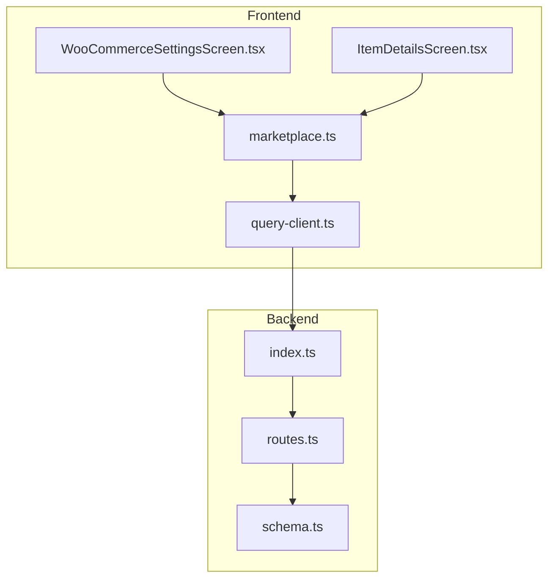
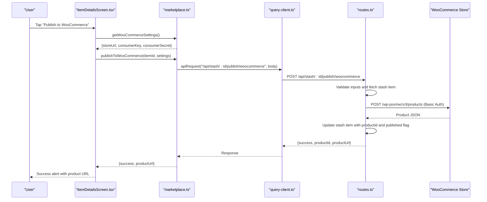
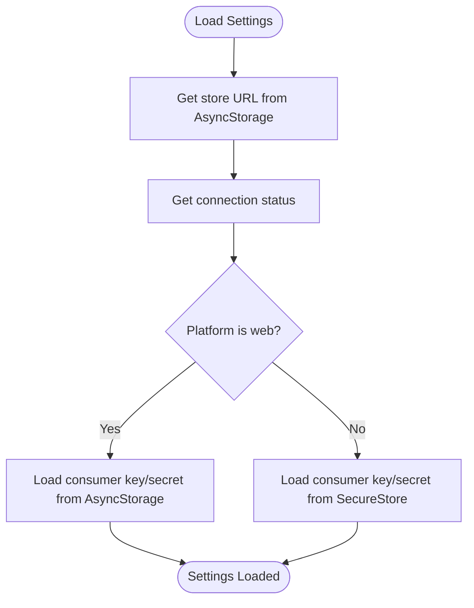
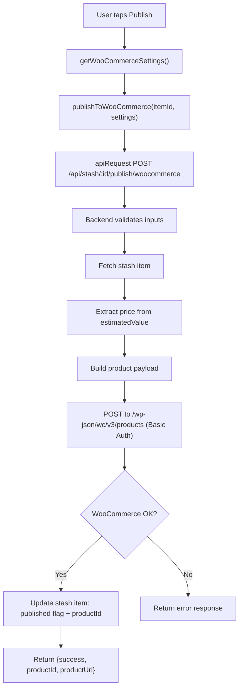
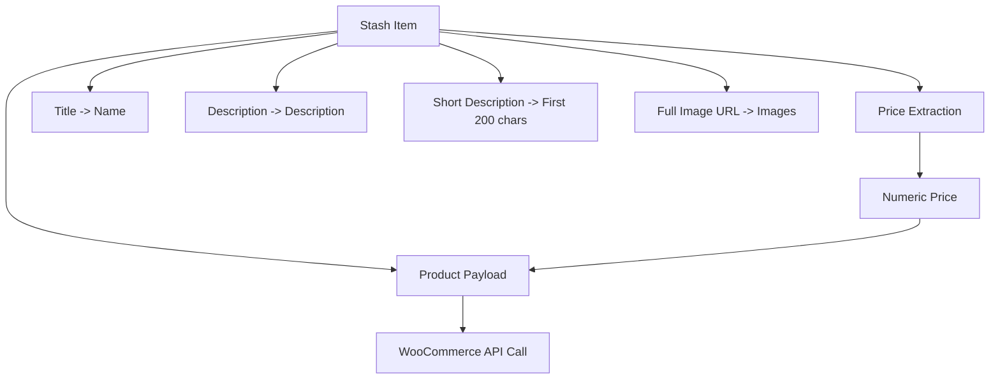
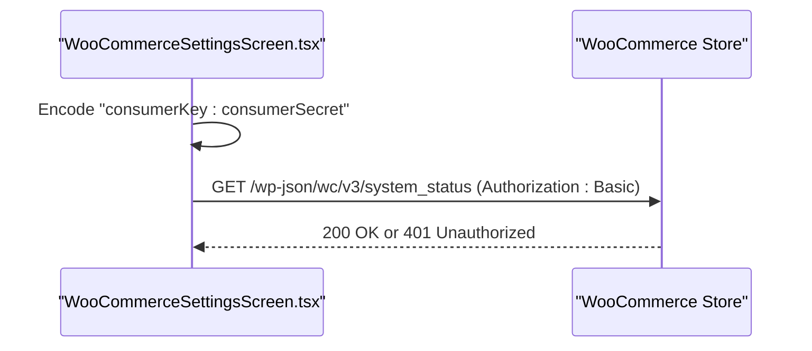
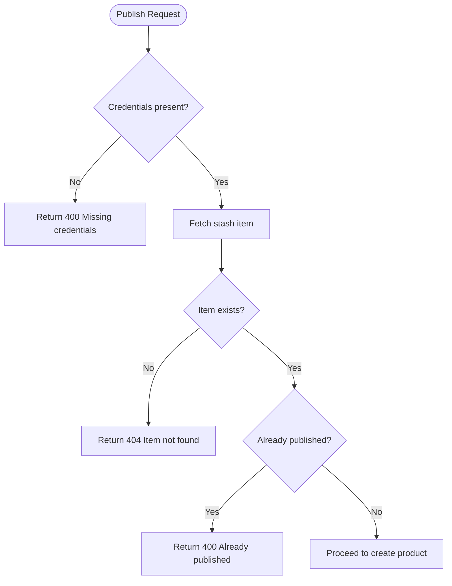
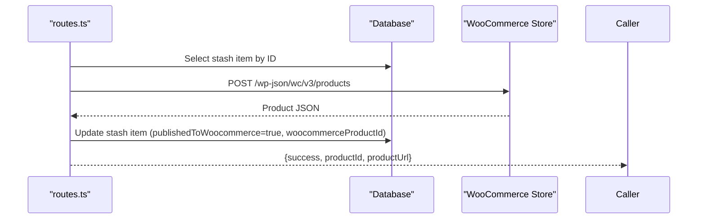
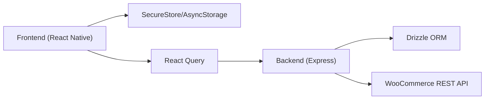

# WooCommerce Integration

<cite>
**Referenced Files in This Document**
- [WooCommerceSettingsScreen.tsx](file://client/screens/WooCommerceSettingsScreen.tsx)
- [marketplace.ts](file://client/lib/marketplace.ts)
- [ItemDetailsScreen.tsx](file://client/screens/ItemDetailsScreen.tsx)
- [query-client.ts](file://client/lib/query-client.ts)
- [routes.ts](file://server/routes.ts)
- [index.ts](file://server/index.ts)
- [schema.ts](file://shared/schema.ts)
- [ENVIRONMENT.md](file://ENVIRONMENT.md)
- [package.json](file://package.json)
</cite>

## Table of Contents
1. [Introduction](#introduction)
2. [Project Structure](#project-structure)
3. [Core Components](#core-components)
4. [Architecture Overview](#architecture-overview)
5. [Detailed Component Analysis](#detailed-component-analysis)
6. [Dependency Analysis](#dependency-analysis)
7. [Performance Considerations](#performance-considerations)
8. [Troubleshooting Guide](#troubleshooting-guide)
9. [Conclusion](#conclusion)

## Introduction
This document explains the WooCommerce marketplace integration for the HiddenGem application. It covers REST API authentication, product publishing workflow, credential management, and practical examples. The integration enables users to connect their WooCommerce store, securely manage credentials, and publish stash items as WooCommerce products with proper data mapping, image handling, and pricing conversion.

## Project Structure
The integration spans three layers:
- Frontend (React Native): Settings screen for credential entry, secure storage, and publishing actions.
- Client library: Centralized helpers for retrieving credentials and invoking backend APIs.
- Backend (Express): Routes that validate inputs, convert stash item data to WooCommerce product fields, and call the WooCommerce REST API.

**Diagram sources**
- [WooCommerceSettingsScreen.tsx](file://client/screens/WooCommerceSettingsScreen.tsx#L1-L512)
- [ItemDetailsScreen.tsx](file://client/screens/ItemDetailsScreen.tsx#L1-L574)
- [marketplace.ts](file://client/lib/marketplace.ts#L1-L129)
- [query-client.ts](file://client/lib/query-client.ts#L1-L80)
- [routes.ts](file://server/routes.ts#L1-L493)
- [index.ts](file://server/index.ts#L1-L247)
- [schema.ts](file://shared/schema.ts#L1-L122)

**Section sources**
- [WooCommerceSettingsScreen.tsx](file://client/screens/WooCommerceSettingsScreen.tsx#L1-L512)
- [marketplace.ts](file://client/lib/marketplace.ts#L1-L129)
- [ItemDetailsScreen.tsx](file://client/screens/ItemDetailsScreen.tsx#L1-L574)
- [query-client.ts](file://client/lib/query-client.ts#L1-L80)
- [routes.ts](file://server/routes.ts#L1-L493)
- [index.ts](file://server/index.ts#L1-L247)
- [schema.ts](file://shared/schema.ts#L1-L122)

## Core Components
- Credential management and storage:
  - Secure local storage for consumer key and secret on native platforms; fallback to AsyncStorage on web.
  - Status flag to indicate connection state.
- Publishing workflow:
  - Frontend triggers a backend endpoint to create a WooCommerce product using stash item data.
  - Backend validates inputs, constructs product payload, authenticates with Basic Auth, and updates the stash item record with published metadata.
- Data mapping:
  - Title, description, short description, price, and image mapping from stash item to WooCommerce product fields.
- Error handling:
  - Frontend displays user-friendly alerts for missing credentials, already-published items, and API errors.
  - Backend returns structured error responses for API failures.

**Section sources**
- [WooCommerceSettingsScreen.tsx](file://client/screens/WooCommerceSettingsScreen.tsx#L15-L184)
- [marketplace.ts](file://client/lib/marketplace.ts#L19-L103)
- [routes.ts](file://server/routes.ts#L228-L296)
- [schema.ts](file://shared/schema.ts#L29-L50)

## Architecture Overview
The integration follows a client-server pattern:
- The frontend collects credentials and item data, then calls the backend.
- The backend validates the request, converts stash item data to WooCommerce product fields, and performs Basic Auth against the WooCommerce REST API.
- On success, the backend persists the published state and product identifiers.

**Diagram sources**
- [ItemDetailsScreen.tsx](file://client/screens/ItemDetailsScreen.tsx#L105-L150)
- [marketplace.ts](file://client/lib/marketplace.ts#L81-L103)
- [query-client.ts](file://client/lib/query-client.ts#L26-L43)
- [routes.ts](file://server/routes.ts#L228-L296)

## Detailed Component Analysis

### Credential Management and Storage
- Keys and status are persisted separately:
  - Store URL and connection status are stored in AsyncStorage.
  - Consumer key and secret are stored in SecureStore on native platforms; AsyncStorage on web.
- The settings screen supports:
  - Loading existing credentials.
  - Saving formatted store URL (ensuring scheme and removing trailing slash).
  - Testing connection using Basic Auth against the WooCommerce system status endpoint.
  - Clearing stored credentials and resetting connection status.

**Diagram sources**
- [WooCommerceSettingsScreen.tsx](file://client/screens/WooCommerceSettingsScreen.tsx#L43-L66)

**Section sources**
- [WooCommerceSettingsScreen.tsx](file://client/screens/WooCommerceSettingsScreen.tsx#L15-L184)
- [marketplace.ts](file://client/lib/marketplace.ts#L19-L44)

### Publishing Workflow
- Frontend flow:
  - Validates connection status and checks if the item was already published.
  - Retrieves credentials via the marketplace helper.
  - Calls the backend publish endpoint with stash item ID and credentials.
- Backend flow:
  - Validates presence of store URL, consumer key, and consumer secret.
  - Fetches the stash item and ensures it hasn't been published yet.
  - Extracts numeric price from the stash item's estimated value.
  - Builds a WooCommerce product payload mapping stash fields to WooCommerce fields.
  - Performs Basic Auth against the WooCommerce REST API to create the product.
  - Updates the stash item with published flag and product ID.
  - Returns success with product ID and URL.

**Diagram sources**
- [ItemDetailsScreen.tsx](file://client/screens/ItemDetailsScreen.tsx#L105-L150)
- [marketplace.ts](file://client/lib/marketplace.ts#L81-L103)
- [routes.ts](file://server/routes.ts#L228-L296)

**Section sources**
- [ItemDetailsScreen.tsx](file://client/screens/ItemDetailsScreen.tsx#L105-L150)
- [marketplace.ts](file://client/lib/marketplace.ts#L81-L103)
- [routes.ts](file://server/routes.ts#L228-L296)

### Data Mapping and Product Creation
- Mapping from stash item to WooCommerce product fields:
  - Name: stash item title
  - Type: simple
  - Regular price: extracted numeric value from estimatedValue
  - Description: seoDescription or description
  - Short description: first 200 characters of description
  - Categories: empty array (can be extended)
  - Images: full image URL if present
  - Status: publish
- Pricing conversion:
  - Extracts the numeric amount from the estimatedValue string (supports dollar sign and commas).
  - Falls back to zero if no match is found.

**Diagram sources**
- [routes.ts](file://server/routes.ts#L246-L259)

**Section sources**
- [routes.ts](file://server/routes.ts#L246-L259)

### Authentication Mechanism
- Basic Auth with consumer credentials:
  - Frontend test connection encodes "consumerKey:consumerSecret" and sends it as an Authorization header to the WooCommerce system status endpoint.
  - Backend creates the same encoding and uses it to POST the product creation request to the WooCommerce REST API.
- Store URL configuration:
  - The settings screen normalizes the URL to HTTPS and removes trailing slashes before saving or testing.

**Diagram sources**
- [WooCommerceSettingsScreen.tsx](file://client/screens/WooCommerceSettingsScreen.tsx#L124-L129)
- [routes.ts](file://server/routes.ts#L264-L267)

**Section sources**
- [WooCommerceSettingsScreen.tsx](file://client/screens/WooCommerceSettingsScreen.tsx#L74-L80)
- [WooCommerceSettingsScreen.tsx](file://client/screens/WooCommerceSettingsScreen.tsx#L124-L129)
- [routes.ts](file://server/routes.ts#L246-L267)

### Error Handling and Validation
- Frontend:
  - Prevents publishing if not connected or if the item is already published.
  - Displays user-friendly alerts for missing information, connection failures, and API errors.
- Backend:
  - Validates presence of credentials and stash item existence.
  - Returns structured error responses for API failures, including HTTP status and message.
  - Guards against duplicate publishing attempts.

**Diagram sources**
- [routes.ts](file://server/routes.ts#L233-L244)

**Section sources**
- [ItemDetailsScreen.tsx](file://client/screens/ItemDetailsScreen.tsx#L108-L123)
- [routes.ts](file://server/routes.ts#L233-L244)

### Product Publishing Workflow Details
- Endpoint: POST /api/stash/:id/publish/woocommerce
- Request body: storeUrl, consumerKey, consumerSecret
- Response: success flag, productId, productUrl
- Post-success actions:
  - Frontend invalidates queries to refresh UI.
  - Backend updates stash item with publishedToWoocommerce flag and woocommerceProductId.

**Diagram sources**
- [routes.ts](file://server/routes.ts#L237-L291)

**Section sources**
- [routes.ts](file://server/routes.ts#L228-L296)
- [schema.ts](file://shared/schema.ts#L44-L47)

## Dependency Analysis
- Frontend dependencies:
  - SecureStore for native secure storage.
  - AsyncStorage for cross-platform credential persistence.
  - React Query for API requests and caching.
- Backend dependencies:
  - Express for routing and HTTP handling.
  - Drizzle ORM for database operations.
  - Multer for file uploads (used elsewhere in the app).
- Environment configuration:
  - EXPO_PUBLIC_DOMAIN drives the API base URL for frontend requests.

**Diagram sources**
- [package.json](file://package.json#L1-L85)
- [query-client.ts](file://client/lib/query-client.ts#L7-L17)
- [routes.ts](file://server/routes.ts#L1-L493)

**Section sources**
- [package.json](file://package.json#L1-L85)
- [query-client.ts](file://client/lib/query-client.ts#L7-L17)
- [routes.ts](file://server/routes.ts#L1-L493)

## Performance Considerations
- Network efficiency:
  - Minimize redundant requests by checking connection status and published state before attempting publish.
  - Use query invalidation to refresh UI efficiently after successful publish.
- Data processing:
  - Price extraction uses a single regex pass; ensure stash item estimatedValue format remains consistent to avoid extra conversions.
- Storage:
  - Prefer SecureStore on native platforms for sensitive credentials to reduce risk and improve trust boundaries.

## Troubleshooting Guide
Common issues and resolutions:
- Authentication failures:
  - Verify consumer key and secret are correct and that the WooCommerce REST API is enabled.
  - Use the "Test Connection" action to confirm credentials and store URL.
- Store URL problems:
  - Ensure the URL starts with a scheme and does not end with a slash.
- Duplicate publishing:
  - Items already marked as published will be rejected by the backend.
- API errors:
  - Inspect returned error messages from the backend for specific failure reasons.
- Environment setup:
  - Confirm EXPO_PUBLIC_DOMAIN is set so the frontend can reach the backend API.

**Section sources**
- [WooCommerceSettingsScreen.tsx](file://client/screens/WooCommerceSettingsScreen.tsx#L131-L142)
- [routes.ts](file://server/routes.ts#L270-L275)
- [ENVIRONMENT.md](file://ENVIRONMENT.md#L69-L113)

## Conclusion
The HiddenGem application integrates with WooCommerce through a secure, user-friendly workflow. Users configure credentials once, and the system handles data mapping, pricing conversion, and product creation with robust error handling. The backend centralizes authentication and validation, while the frontend provides clear feedback and maintains connection state.