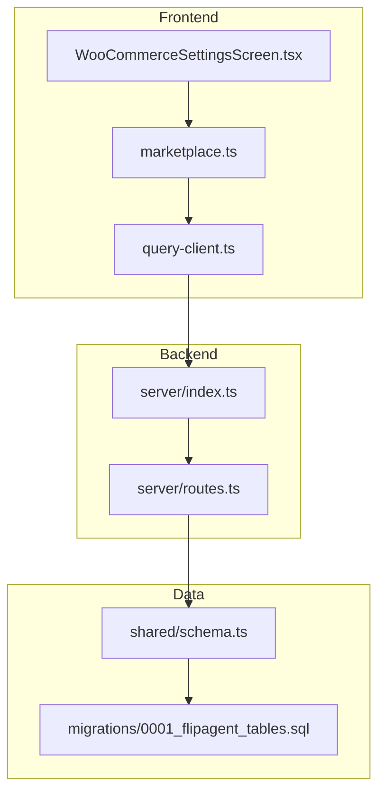
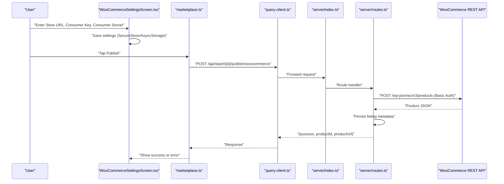
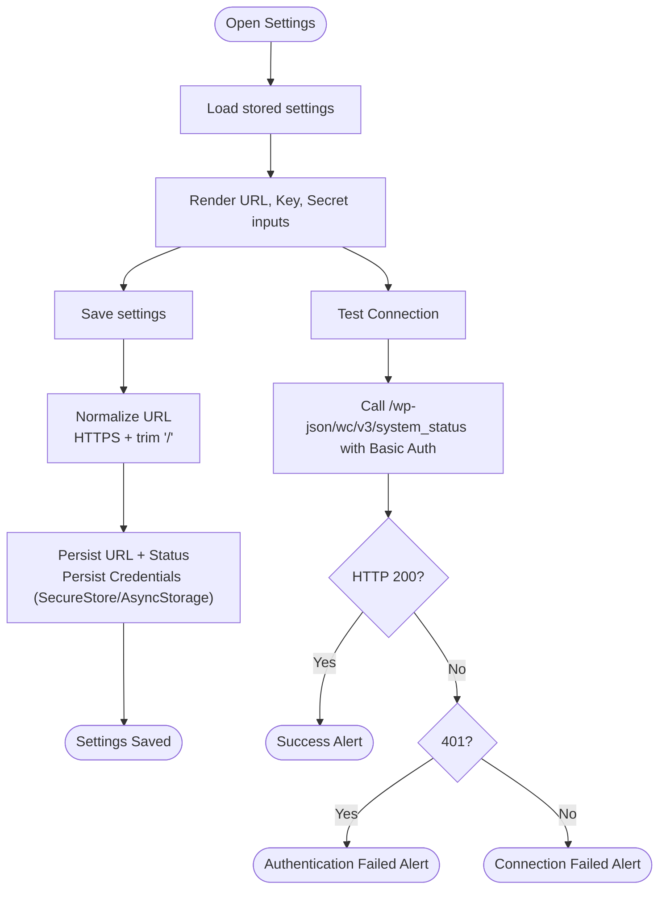
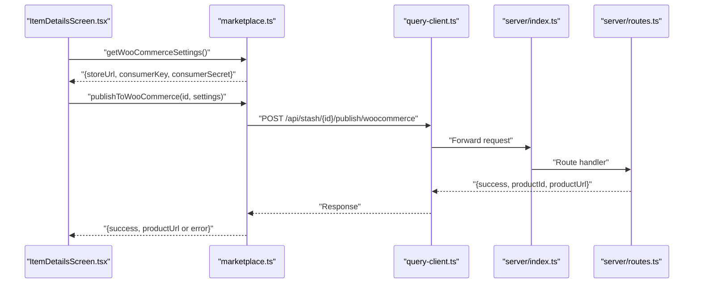
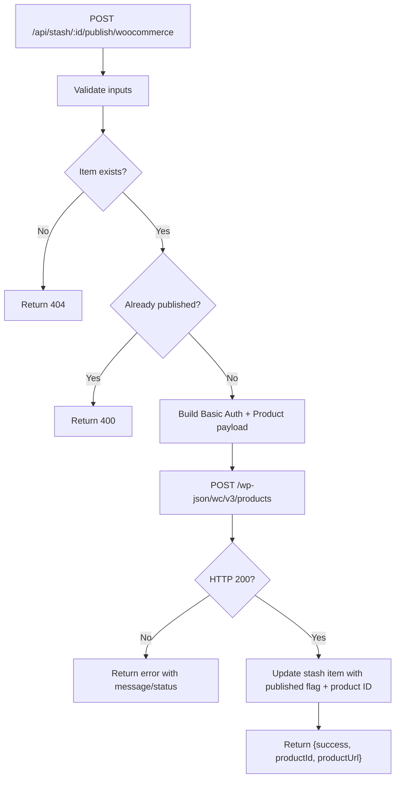
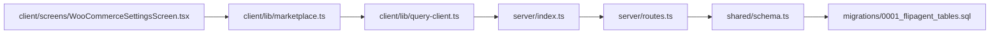

# WooCommerce Integration

<cite>
**Referenced Files in This Document**
- [WooCommerceSettingsScreen.tsx](file://client/screens/WooCommerceSettingsScreen.tsx)
- [marketplace.ts](file://client/lib/marketplace.ts)
- [query-client.ts](file://client/lib/query-client.ts)
- [routes.ts](file://server/routes.ts)
- [index.ts](file://server/index.ts)
- [schema.ts](file://shared/schema.ts)
- [0001_flipagent_tables.sql](file://migrations/0001_flipagent_tables.sql)
- [ItemDetailsScreen.tsx](file://client/screens/ItemDetailsScreen.tsx)
- [woocommerce_settings_flow.yml](file://.maestro/woocommerce_settings_flow.yml)
- [package.json](file://package.json)
</cite>

## Table of Contents
1. [Introduction](#introduction)
2. [Project Structure](#project-structure)
3. [Core Components](#core-components)
4. [Architecture Overview](#architecture-overview)
5. [Detailed Component Analysis](#detailed-component-analysis)
6. [Dependency Analysis](#dependency-analysis)
7. [Performance Considerations](#performance-considerations)
8. [Troubleshooting Guide](#troubleshooting-guide)
9. [Conclusion](#conclusion)
10. [Appendices](#appendices)

## Introduction
This document explains how the application integrates with WooCommerce via a secure, two-tier approach:
- A frontend screen to configure store URL, API credentials, and test connectivity.
- A backend route that validates credentials, publishes a product to WooCommerce using Basic Authentication against the WooCommerce REST API, and records the listing metadata.

It covers REST API configuration, product publishing workflow, order management integration points, marketplace settings screen functionality, error handling, security considerations, and practical troubleshooting.

## Project Structure
The integration spans three primary areas:
- Frontend settings screen and helpers for secure credential storage and API requests
- Backend routes for publishing to WooCommerce and general API orchestration
- Shared schema and migration artifacts for product and listing metadata

**Diagram sources**
- [WooCommerceSettingsScreen.tsx](file://client/screens/WooCommerceSettingsScreen.tsx#L1-L512)
- [marketplace.ts](file://client/lib/marketplace.ts#L1-L129)
- [query-client.ts](file://client/lib/query-client.ts#L1-L51)
- [index.ts](file://server/index.ts#L1-L262)
- [routes.ts](file://server/routes.ts#L387-L455)
- [schema.ts](file://shared/schema.ts#L115-L220)
- [0001_flipagent_tables.sql](file://migrations/0001_flipagent_tables.sql#L35-L75)

**Section sources**
- [WooCommerceSettingsScreen.tsx](file://client/screens/WooCommerceSettingsScreen.tsx#L1-L512)
- [marketplace.ts](file://client/lib/marketplace.ts#L1-L129)
- [query-client.ts](file://client/lib/query-client.ts#L1-L51)
- [index.ts](file://server/index.ts#L1-L262)
- [routes.ts](file://server/routes.ts#L387-L455)
- [schema.ts](file://shared/schema.ts#L115-L220)
- [0001_flipagent_tables.sql](file://migrations/0001_flipagent_tables.sql#L35-L75)

## Core Components
- Marketplace settings screen: Captures store URL, consumer key, and consumer secret; persists securely; tests connectivity; supports removal of credentials.
- Frontend helpers: Retrieve stored credentials and publish to WooCommerce via the backend.
- Backend route: Validates inputs, constructs Basic Auth credentials, posts to the WooCommerce REST API, and writes listing metadata to the database.
- Schema and migrations: Define product and listing tables used by the integration.

**Section sources**
- [WooCommerceSettingsScreen.tsx](file://client/screens/WooCommerceSettingsScreen.tsx#L15-L184)
- [marketplace.ts](file://client/lib/marketplace.ts#L19-L103)
- [routes.ts](file://server/routes.ts#L387-L455)
- [schema.ts](file://shared/schema.ts#L115-L220)
- [0001_flipagent_tables.sql](file://migrations/0001_flipagent_tables.sql#L35-L75)

## Architecture Overview
The integration follows a client-server pattern:
- The frontend collects and stores credentials securely.
- The frontend invokes a backend endpoint to publish.
- The backend authenticates with WooCommerce using Basic Authentication and writes metadata to the database.

**Diagram sources**
- [WooCommerceSettingsScreen.tsx](file://client/screens/WooCommerceSettingsScreen.tsx#L108-L146)
- [marketplace.ts](file://client/lib/marketplace.ts#L81-L103)
- [query-client.ts](file://client/lib/query-client.ts#L26-L43)
- [index.ts](file://server/index.ts#L227-L261)
- [routes.ts](file://server/routes.ts#L387-L455)

## Detailed Component Analysis

### REST API Configuration Screen
- Stores:
  - Store URL in AsyncStorage with a dedicated status flag.
  - Consumer Key and Consumer Secret using SecureStore on native platforms and AsyncStorage on web.
- Behavior:
  - Loads existing settings on mount.
  - Saves normalized URL (HTTPS, no trailing slash).
  - Tests connectivity by calling the WooCommerce system status endpoint with Basic Authentication.
  - Supports clearing credentials and reconnecting.

**Diagram sources**
- [WooCommerceSettingsScreen.tsx](file://client/screens/WooCommerceSettingsScreen.tsx#L39-L146)

**Section sources**
- [WooCommerceSettingsScreen.tsx](file://client/screens/WooCommerceSettingsScreen.tsx#L15-L184)

### Frontend Publishing Helper
- Retrieves stored credentials using platform-aware secure storage.
- Invokes the backend publish endpoint with the item identifier and credentials.
- Handles errors returned by the backend and surfaces user-friendly messages.

**Diagram sources**
- [ItemDetailsScreen.tsx](file://client/screens/ItemDetailsScreen.tsx#L148-L193)
- [marketplace.ts](file://client/lib/marketplace.ts#L81-L103)
- [query-client.ts](file://client/lib/query-client.ts#L26-L43)
- [routes.ts](file://server/routes.ts#L387-L455)

**Section sources**
- [marketplace.ts](file://client/lib/marketplace.ts#L19-L103)
- [ItemDetailsScreen.tsx](file://client/screens/ItemDetailsScreen.tsx#L148-L193)

### Backend Publishing Route
- Validates presence of store URL, consumer key, and consumer secret.
- Fetches the stash item and checks if already published.
- Constructs Basic Authentication credentials and posts to the WooCommerce REST API.
- Persists listing metadata (published flag, remote product ID) upon success.

**Diagram sources**
- [routes.ts](file://server/routes.ts#L387-L455)

**Section sources**
- [routes.ts](file://server/routes.ts#L387-L455)

### Order Management Integration
- Current implementation focuses on product publishing to WooCommerce.
- No backend endpoints are present for fetching orders or updating statuses.
- To integrate orders, implement backend endpoints to:
  - Fetch orders from WooCommerce using the REST API.
  - Update local order records and statuses.
  - Trigger fulfillment actions based on order state.

[No sources needed since this section provides general guidance]

### Marketplace Settings Screen Functionality
- Provides a guided form for entering and validating WooCommerce credentials.
- Uses platform-specific secure storage for credentials.
- Offers a “Test Connection” action to verify REST API accessibility and authentication.

**Section sources**
- [WooCommerceSettingsScreen.tsx](file://client/screens/WooCommerceSettingsScreen.tsx#L182-L184)

### Security Considerations
- Credential storage:
  - Native platforms: SecureStore for consumer key and secret.
  - Web: AsyncStorage fallback; a warning is displayed advising mobile for best security.
- Transport:
  - REST API calls use HTTPS for the store URL and Basic Authentication headers.
- Environment:
  - API base URL is resolved from an environment variable; ensure it resolves to a secure origin.

**Section sources**
- [WooCommerceSettingsScreen.tsx](file://client/screens/WooCommerceSettingsScreen.tsx#L204-L211)
- [marketplace.ts](file://client/lib/marketplace.ts#L29-L35)
- [query-client.ts](file://client/lib/query-client.ts#L7-L17)

### Error Handling
- Frontend:
  - Missing fields, save errors, and connection test failures surface alerts.
  - Network errors are caught and reported.
- Backend:
  - Missing inputs return 400.
  - Item not found returns 404.
  - Authentication failures return 401-like messages.
  - Non-200 responses from WooCommerce propagate error details.

**Section sources**
- [WooCommerceSettingsScreen.tsx](file://client/screens/WooCommerceSettingsScreen.tsx#L108-L146)
- [routes.ts](file://server/routes.ts#L392-L394)
- [routes.ts](file://server/routes.ts#L429-L434)

### Product Publishing Workflow
- Data mapping:
  - Title, description, short description, images, and price are mapped from the stash item to the WooCommerce product payload.
  - Price parsing extracts numeric value from a formatted string.
- Lifecycle:
  - Validate inputs and existence.
  - Authenticate and post product.
  - Persist remote product ID and update published flags.

**Section sources**
- [routes.ts](file://server/routes.ts#L409-L418)
- [routes.ts](file://server/routes.ts#L406-L407)

### Order Management Integration (Planned)
- Fetch orders from WooCommerce REST API endpoints.
- Update local order records and statuses.
- Coordinate fulfillment actions.

[No sources needed since this section provides general guidance]

## Dependency Analysis
- Frontend depends on:
  - SecureStore/AsyncStorage for credentials.
  - React Query client for API requests.
- Backend depends on:
  - Express for routing and CORS.
  - PostgreSQL via Drizzle ORM for persistence.
- Runtime dependencies include Express and related middleware.

**Diagram sources**
- [marketplace.ts](file://client/lib/marketplace.ts#L1-L129)
- [query-client.ts](file://client/lib/query-client.ts#L1-L51)
- [WooCommerceSettingsScreen.tsx](file://client/screens/WooCommerceSettingsScreen.tsx#L1-L512)
- [index.ts](file://server/index.ts#L1-L262)
- [routes.ts](file://server/routes.ts#L387-L455)
- [schema.ts](file://shared/schema.ts#L115-L220)
- [0001_flipagent_tables.sql](file://migrations/0001_flipagent_tables.sql#L35-L75)

**Section sources**
- [package.json](file://package.json#L24-L76)
- [index.ts](file://server/index.ts#L19-L56)

## Performance Considerations
- Avoid repeated network calls by caching validated settings locally.
- Batch publishing operations if scaling to multiple items.
- Monitor backend response times and implement retries with backoff for transient failures.

[No sources needed since this section provides general guidance]

## Troubleshooting Guide
- Connection test fails:
  - Ensure the store URL is reachable and uses HTTPS.
  - Confirm the WooCommerce REST API is enabled and accessible.
  - Verify the consumer key and secret are correct.
- Authentication failures:
  - Check that the consumer key/secret pair matches the store’s credentials.
- Publishing errors:
  - Confirm the item exists and has not already been published.
  - Review the backend error response for specific reasons.
- Web deployment:
  - Prefer native app for secure credential storage; if using web, expect warnings and reduced security.

**Section sources**
- [WooCommerceSettingsScreen.tsx](file://client/screens/WooCommerceSettingsScreen.tsx#L108-L146)
- [routes.ts](file://server/routes.ts#L392-L394)
- [routes.ts](file://server/routes.ts#L429-L434)

## Conclusion
The integration provides a secure, straightforward path to publish products to WooCommerce. It leverages platform-aware secure storage, Basic Authentication, and a clear publish flow. Extending to order management and advanced inventory features would involve adding backend endpoints to synchronize orders and statuses.

[No sources needed since this section summarizes without analyzing specific files]

## Appendices

### API Definitions
- Publish to WooCommerce
  - Method: POST
  - Path: /api/stash/:id/publish/woocommerce
  - Body fields: storeUrl, consumerKey, consumerSecret
  - Success response: { success: true, productId, productUrl }
  - Error responses: 400 (missing inputs or already published), 404 (item not found), 500 (general failure)

**Section sources**
- [routes.ts](file://server/routes.ts#L387-L455)

### Data Model Notes
- Product and listing metadata are persisted in the products and listings tables.
- The stash items table tracks publication flags and remote identifiers.

**Section sources**
- [schema.ts](file://shared/schema.ts#L115-L220)
- [0001_flipagent_tables.sql](file://migrations/0001_flipagent_tables.sql#L35-L75)

### Test Automation
- Maestro flow verifies credential entry and save actions.

**Section sources**
- [.maestro/woocommerce_settings_flow.yml](file://.maestro/woocommerce_settings_flow.yml#L1-L45)