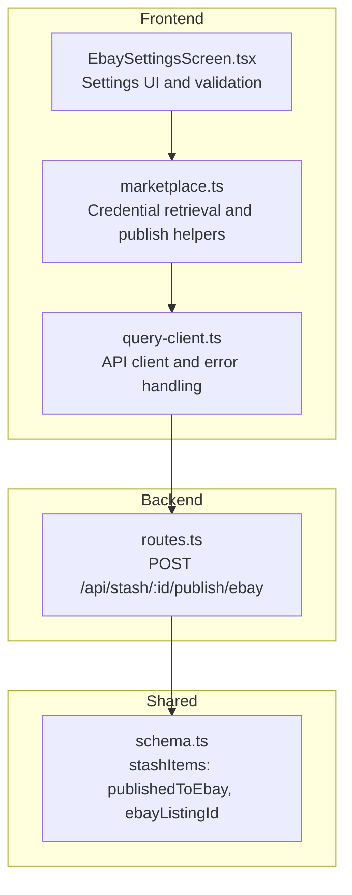
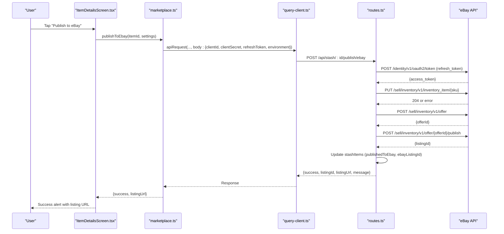
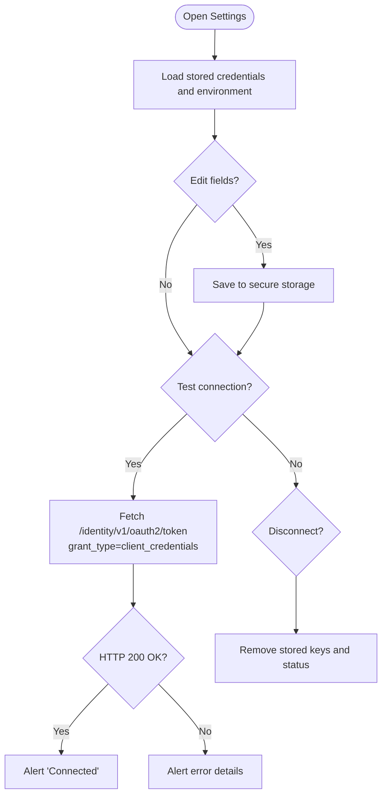
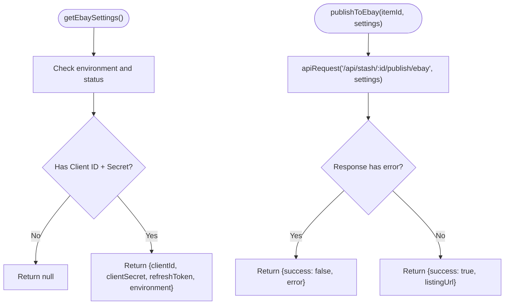
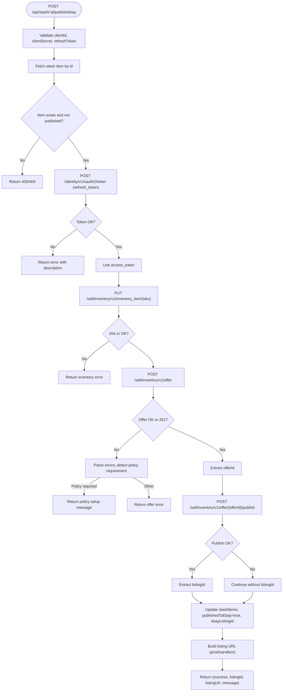
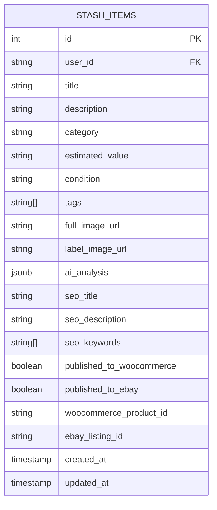
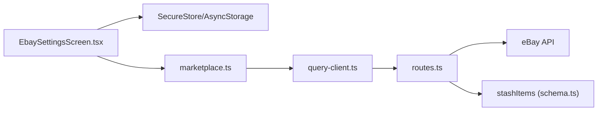

# eBay Integration

<cite>
**Referenced Files in This Document**
- [ENVIRONMENT.md](file://ENVIRONMENT.md)
- [marketplace.ts](file://client/lib/marketplace.ts)
- [EbaySettingsScreen.tsx](file://client/screens/EbaySettingsScreen.tsx)
- [ItemDetailsScreen.tsx](file://client/screens/ItemDetailsScreen.tsx)
- [query-client.ts](file://client/lib/query-client.ts)
- [routes.ts](file://server/routes.ts)
- [schema.ts](file://shared/schema.ts)
</cite>

## Table of Contents
1. [Introduction](#introduction)
2. [Project Structure](#project-structure)
3. [Core Components](#core-components)
4. [Architecture Overview](#architecture-overview)
5. [Detailed Component Analysis](#detailed-component-analysis)
6. [Dependency Analysis](#dependency-analysis)
7. [Performance Considerations](#performance-considerations)
8. [Troubleshooting Guide](#troubleshooting-guide)
9. [Conclusion](#conclusion)

## Introduction
This document explains the eBay marketplace integration in the project, focusing on:
- eBay Developer Portal setup and credential management
- OAuth authentication flow and environment configuration (sandbox vs production)
- API client configuration and secure storage
- Multi-step listing process: inventory item creation, offer creation, and publishing
- eBay API endpoints used, request/response formats, and error handling
- Practical examples, credential validation, and troubleshooting common authentication and policy errors
- Condition mapping, SKU generation, and listing URL construction
- eBay-specific requirements such as business policies and merchant location keys

## Project Structure
The eBay integration spans three layers:
- Frontend (React Native) settings screen and helpers for secure credential storage and API requests
- Backend (Express) routes implementing the eBay publishing pipeline
- Shared schema modeling persisted listing state

**Diagram sources**
- [EbaySettingsScreen.tsx](file://client/screens/EbaySettingsScreen.tsx#L1-L370)
- [marketplace.ts](file://client/lib/marketplace.ts#L1-L129)
- [query-client.ts](file://client/lib/query-client.ts#L1-L80)
- [routes.ts](file://server/routes.ts#L298-L488)
- [schema.ts](file://shared/schema.ts#L29-L50)

**Section sources**
- [ENVIRONMENT.md](file://ENVIRONMENT.md#L63-L67)
- [EbaySettingsScreen.tsx](file://client/screens/EbaySettingsScreen.tsx#L1-L370)
- [marketplace.ts](file://client/lib/marketplace.ts#L1-L129)
- [query-client.ts](file://client/lib/query-client.ts#L1-L80)
- [routes.ts](file://server/routes.ts#L298-L488)
- [schema.ts](file://shared/schema.ts#L29-L50)

## Core Components
- Credential storage and retrieval:
  - Frontend stores Client ID, Client Secret, optional Refresh Token, and environment selection in secure storage (device-specific) and AsyncStorage for web fallback.
  - Backend validates presence of credentials and refresh token before attempting eBay API calls.
- Publishing workflow:
  - Frontend triggers a publish action that calls the backend endpoint with eBay credentials and environment.
  - Backend performs OAuth token exchange, creates inventory item, posts offer, publishes listing, updates database, and returns listing URL.

Key responsibilities:
- [EbaySettingsScreen.tsx](file://client/screens/EbaySettingsScreen.tsx#L40-L110) loads and saves credentials and environment
- [marketplace.ts](file://client/lib/marketplace.ts#L46-L79) retrieves stored credentials
- [marketplace.ts](file://client/lib/marketplace.ts#L105-L128) invokes backend publish endpoint
- [query-client.ts](file://client/lib/query-client.ts#L26-L43) wraps API requests with error handling
- [routes.ts](file://server/routes.ts#L298-L488) implements the eBay publishing pipeline
- [schema.ts](file://shared/schema.ts#L29-L50) persists listing state

**Section sources**
- [EbaySettingsScreen.tsx](file://client/screens/EbaySettingsScreen.tsx#L40-L110)
- [marketplace.ts](file://client/lib/marketplace.ts#L46-L79)
- [marketplace.ts](file://client/lib/marketplace.ts#L105-L128)
- [query-client.ts](file://client/lib/query-client.ts#L26-L43)
- [routes.ts](file://server/routes.ts#L298-L488)
- [schema.ts](file://shared/schema.ts#L29-L50)

## Architecture Overview
End-to-end eBay publishing flow from UI to eBay APIs:

**Diagram sources**
- [ItemDetailsScreen.tsx](file://client/screens/ItemDetailsScreen.tsx#L170-L197)
- [marketplace.ts](file://client/lib/marketplace.ts#L105-L128)
- [query-client.ts](file://client/lib/query-client.ts#L26-L43)
- [routes.ts](file://server/routes.ts#L298-L488)

## Detailed Component Analysis

### eBay Settings Screen (Frontend)
- Purpose: Collect and validate eBay credentials, environment, and optional refresh token; test connection against eBay identity endpoint.
- Secure storage:
  - Stores Client ID, Client Secret, optional Refresh Token, environment, and connection status in platform-specific secure storage or AsyncStorage for web.
- Validation and UX:
  - Tests OAuth client credentials against the appropriate eBay API base URL (sandbox or production).
  - Alerts on success, invalid credentials (401), or other errors.

**Diagram sources**
- [EbaySettingsScreen.tsx](file://client/screens/EbaySettingsScreen.tsx#L40-L110)
- [EbaySettingsScreen.tsx](file://client/screens/EbaySettingsScreen.tsx#L118-L150)

**Section sources**
- [EbaySettingsScreen.tsx](file://client/screens/EbaySettingsScreen.tsx#L40-L110)
- [EbaySettingsScreen.tsx](file://client/screens/EbaySettingsScreen.tsx#L118-L150)

### Credential Retrieval and Publish Helpers (Frontend)
- Retrieves stored eBay settings (environment, credentials) and invokes backend publish endpoint.
- Returns structured results with success flag, optional listing URL, and error message.

**Diagram sources**
- [marketplace.ts](file://client/lib/marketplace.ts#L46-L79)
- [marketplace.ts](file://client/lib/marketplace.ts#L105-L128)
- [query-client.ts](file://client/lib/query-client.ts#L26-L43)

**Section sources**
- [marketplace.ts](file://client/lib/marketplace.ts#L46-L79)
- [marketplace.ts](file://client/lib/marketplace.ts#L105-L128)
- [query-client.ts](file://client/lib/query-client.ts#L26-L43)

### eBay Publishing Pipeline (Backend)
- Validates credentials and refresh token; prevents duplicate listings.
- Exchanges refresh token for access token using eBay identity endpoint.
- Creates inventory item with mapped condition and product metadata.
- Posts offer with pricing, policies placeholders, and merchant location key.
- Publishes offer and records listing ID; constructs listing URL based on environment.

**Diagram sources**
- [routes.ts](file://server/routes.ts#L298-L488)

**Section sources**
- [routes.ts](file://server/routes.ts#L298-L488)

### Data Model and State Persistence
- The stash items table tracks whether an item has been published to eBay and stores the eBay listing identifier.

**Diagram sources**
- [schema.ts](file://shared/schema.ts#L29-L50)

**Section sources**
- [schema.ts](file://shared/schema.ts#L29-L50)

## Dependency Analysis
- Frontend depends on:
  - Secure storage for credentials
  - API client for backend communication
  - eBay identity and inventory endpoints
- Backend depends on:
  - eBay identity and inventory endpoints
  - Database to persist listing state
- Environment configuration:
  - Sandbox vs production base URLs selected by environment setting

**Diagram sources**
- [EbaySettingsScreen.tsx](file://client/screens/EbaySettingsScreen.tsx#L1-L370)
- [marketplace.ts](file://client/lib/marketplace.ts#L1-L129)
- [query-client.ts](file://client/lib/query-client.ts#L1-L80)
- [routes.ts](file://server/routes.ts#L298-L488)
- [schema.ts](file://shared/schema.ts#L29-L50)

**Section sources**
- [EbaySettingsScreen.tsx](file://client/screens/EbaySettingsScreen.tsx#L1-L370)
- [marketplace.ts](file://client/lib/marketplace.ts#L1-L129)
- [query-client.ts](file://client/lib/query-client.ts#L1-L80)
- [routes.ts](file://server/routes.ts#L298-L488)
- [schema.ts](file://shared/schema.ts#L29-L50)

## Performance Considerations
- Network retries: The API client disables retries by default; handle transient failures gracefully in UI.
- Token reuse: Access tokens are requested per publish operation; avoid unnecessary repeated calls.
- Image handling: Ensure images are optimized to reduce payload sizes for inventory item creation.
- Environment selection: Prefer sandbox during development to minimize API usage and risk.

[No sources needed since this section provides general guidance]

## Troubleshooting Guide

Common authentication errors:
- Missing credentials: Ensure Client ID and Client Secret are present before testing or publishing.
- Invalid credentials: The identity endpoint returns 401 when Client ID/Secret are wrong; verify in the eBay Developer Portal.
- Refresh token required: Publishing requires a user OAuth refresh token; without it, the backend returns a clear error instructing to generate one.

Business policies configuration:
- If the offer creation fails with policy-related errors, configure shipping, payment, and return policies in your eBay Seller Hub before listing.

Environment configuration:
- Toggle between sandbox and production in the settings screen; the base URLs change accordingly.

Credential validation tips:
- Use the “Test Connection” button to validate Client ID and Client Secret against the selected environment.
- On web, credentials are stored in AsyncStorage; for best security, use the mobile app.

Error handling in code:
- Frontend helpers return structured error messages; display them to the user.
- Backend routes return descriptive errors for token failures, inventory errors, offer errors, and policy requirements.

Practical checks:
- Confirm the item exists and has not already been published.
- Verify eBay listing conditions and pricing derived from item metadata.
- Ensure the merchant location key is set appropriately if required by your account configuration.

**Section sources**
- [EbaySettingsScreen.tsx](file://client/screens/EbaySettingsScreen.tsx#L118-L150)
- [routes.ts](file://server/routes.ts#L303-L311)
- [routes.ts](file://server/routes.ts#L449-L462)
- [routes.ts](file://server/routes.ts#L453-L457)
- [ItemDetailsScreen.tsx](file://client/screens/ItemDetailsScreen.tsx#L189-L191)

## Conclusion
The eBay integration provides a secure, end-to-end publishing pipeline:
- Credentials are stored securely and validated before use.
- The backend orchestrates OAuth, inventory creation, offer posting, and publishing.
- The UI surfaces environment selection, credential management, and publishing feedback.
- Robust error handling and environment-aware endpoints support both development and production workflows.

[No sources needed since this section summarizes without analyzing specific files]