# eBay Integration

<cite>
**Referenced Files in This Document**
- [ebay-mcp-router.ts](file://server/ebay-mcp-router.ts)
- [ebay-service.ts](file://server/ebay-service.ts)
- [routes.ts](file://server/routes.ts)
- [EbaySettingsScreen.tsx](file://client/screens/EbaySettingsScreen.tsx)
- [marketplace.ts](file://client/lib/marketplace.ts)
- [query-client.ts](file://client/lib/query-client.ts)
- [ENVIRONMENT.md](file://ENVIRONMENT.md)
- [index.ts](file://server/index.ts)
</cite>

## Update Summary
**Changes Made**
- Added comprehensive eBay MCP (Marketplace Control Protocol) router documentation
- Updated architecture overview to include MCP actions: publish, update, offer, and reprice
- Enhanced marketplace automation workflows section
- Added new MCP action processing capabilities
- Updated security and authentication flows to include API key protection
- Expanded error handling and response normalization documentation

## Table of Contents
1. [Introduction](#introduction)
2. [Project Structure](#project-structure)
3. [Core Components](#core-components)
4. [Architecture Overview](#architecture-overview)
5. [Detailed Component Analysis](#detailed-component-analysis)
6. [Dependency Analysis](#dependency-analysis)
7. [Performance Considerations](#performance-considerations)
8. [Troubleshooting Guide](#troubleshooting-guide)
9. [Conclusion](#conclusion)
10. [Appendices](#appendices)

## Introduction
This document explains the eBay marketplace integration for the HiddenGem project. It covers OAuth2 authentication, refresh token management, access token generation, listing retrieval, inventory management, and CRUD operations for eBay offers and inventory items. The integration now includes a comprehensive eBay MCP (Marketplace Control Protocol) router with advanced automation capabilities including listing creation, inventory management, offer processing, and price adjustments. It also documents the category mapping system, listing creation workflow, price and quantity updates, listing termination, error handling, rate limiting considerations, API response parsing, security best practices, and practical usage patterns.

## Project Structure
The eBay integration spans three layers with enhanced MCP capabilities:
- Frontend (React Native): Settings screen and marketplace utilities for credential storage and API calls
- Backend (Express): Routes that proxy eBay APIs, manage token refresh, and provide MCP action processing
- Shared service library: Reusable eBay API client functions with comprehensive MCP support

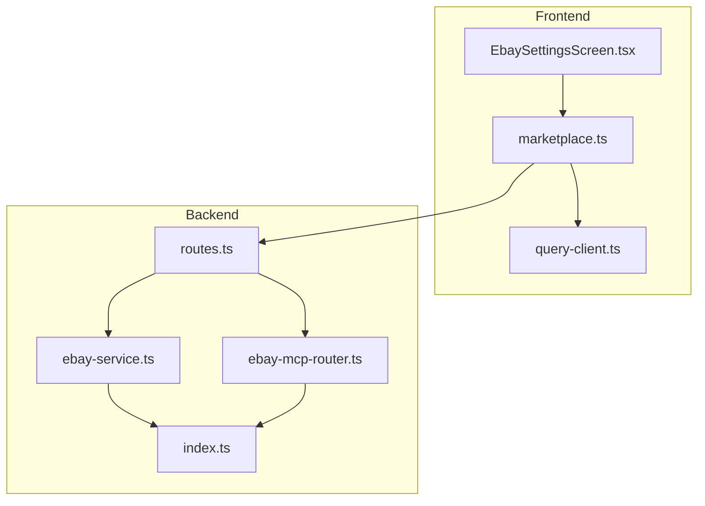

**Diagram sources**
- [EbaySettingsScreen.tsx:1-693](file://client/screens/EbaySettingsScreen.tsx#L1-L693)
- [marketplace.ts:1-183](file://client/lib/marketplace.ts#L1-L183)
- [query-client.ts:1-80](file://client/lib/query-client.ts#L1-L80)
- [routes.ts:1385-1385](file://server/routes.ts#L1385-L1385)
- [ebay-service.ts:1-678](file://server/ebay-service.ts#L1-L678)
- [ebay-mcp-router.ts:1-181](file://server/ebay-mcp-router.ts#L1-L181)
- [index.ts:1-262](file://server/index.ts#L1-L262)

**Section sources**
- [EbaySettingsScreen.tsx:1-693](file://client/screens/EbaySettingsScreen.tsx#L1-L693)
- [marketplace.ts:1-183](file://client/lib/marketplace.ts#L1-L183)
- [routes.ts:1385-1385](file://server/routes.ts#L1385-L1385)
- [ebay-service.ts:1-678](file://server/ebay-service.ts#L1-L678)
- [ebay-mcp-router.ts:1-181](file://server/ebay-mcp-router.ts#L1-L181)
- [index.ts:1-262](file://server/index.ts#L1-L262)

## Core Components
- eBay credentials management and environment selection in the frontend settings screen
- Frontend marketplace utilities to publish items to eBay and retrieve settings
- Backend routes to handle eBay publishing, listing updates/deletes, token refresh, and MCP action processing
- Shared eBay service library for token acquisition, listing retrieval, inventory operations, category mapping, and MCP action execution
- **New**: eBay MCP (Marketplace Control Protocol) router for automated marketplace operations

Key responsibilities:
- OAuth2 token acquisition and refresh
- Listing retrieval (active listings and inventory items)
- Inventory item updates (price, quantity, metadata)
- Offer lifecycle management (create, publish, update, delete)
- Category mapping for automatic eBay category assignment
- **New**: MCP action processing (publish, update, offer, reprice)
- **New**: Automated marketplace workflow orchestration

**Section sources**
- [EbaySettingsScreen.tsx:29-34](file://client/screens/EbaySettingsScreen.tsx#L29-L34)
- [marketplace.ts:50-85](file://client/lib/marketplace.ts#L50-L85)
- [routes.ts:634-902](file://server/routes.ts#L634-L902)
- [ebay-service.ts:42-66](file://server/ebay-service.ts#L42-L66)
- [ebay-service.ts:68-114](file://server/ebay-service.ts#L68-L114)
- [ebay-service.ts:406-449](file://server/ebay-service.ts#L406-L449)
- [ebay-service.ts:454-491](file://server/ebay-service.ts#L454-L491)
- [ebay-service.ts:290-332](file://server/ebay-service.ts#L290-L332)
- [ebay-mcp-router.ts:44-178](file://server/ebay-mcp-router.ts#L44-L178)

## Architecture Overview
The integration follows a proxy pattern with enhanced MCP capabilities: the frontend calls backend routes or MCP endpoints, which authenticate with eBay and perform operations against the eBay APIs. Tokens are refreshed as needed, and responses are normalized for the frontend. The MCP router provides standardized action processing for marketplace automation.

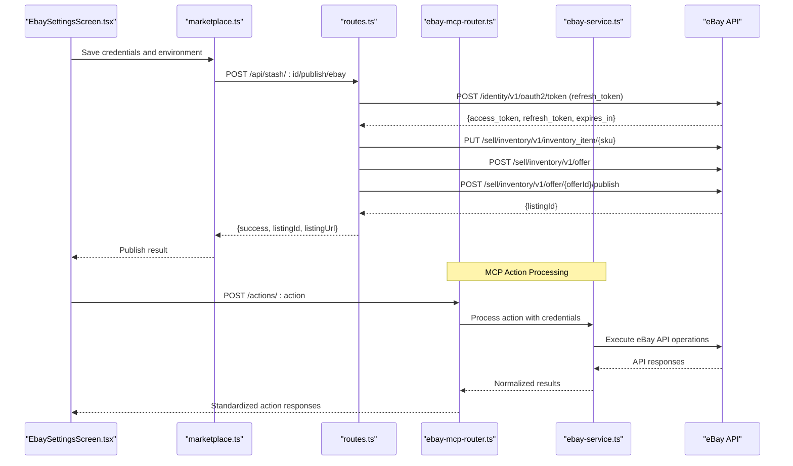

**Diagram sources**
- [EbaySettingsScreen.tsx:86-133](file://client/screens/EbaySettingsScreen.tsx#L86-L133)
- [marketplace.ts:137-182](file://client/lib/marketplace.ts#L137-L182)
- [routes.ts:634-902](file://server/routes.ts#L634-L902)
- [ebay-mcp-router.ts:44-178](file://server/ebay-mcp-router.ts#L44-L178)
- [ebay-service.ts:42-66](file://server/ebay-service.ts#L42-L66)

## Detailed Component Analysis

### OAuth2 Authentication Flow
- Client credentials setup: Client ID and Client Secret are stored securely in the frontend and passed to backend routes for token refresh.
- Refresh token management: The backend performs a refresh grant to obtain an access token and optionally a new refresh token with expiry timestamp.
- Access token generation: The eBay service acquires an access token using the refresh token and environment (sandbox/production).

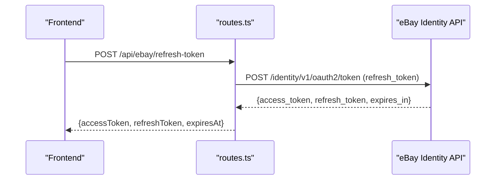

**Diagram sources**
- [routes.ts:1232-1250](file://server/routes.ts#L1232-L1250)
- [ebay-service.ts:348-384](file://server/ebay-service.ts#L348-L384)

**Section sources**
- [EbaySettingsScreen.tsx:29-34](file://client/screens/EbaySettingsScreen.tsx#L29-L34)
- [routes.ts:1232-1250](file://server/routes.ts#L1232-L1250)
- [ebay-service.ts:348-384](file://server/ebay-service.ts#L348-L384)

### eBay MCP (Marketplace Control Protocol) Router
**New**: The MCP router provides standardized action processing for marketplace automation with four core actions:

- **Publish Action**: Creates inventory items, offers, and publishes listings in a single workflow
- **Update Action**: Updates existing eBay listings with flexible patch operations
- **Offer Action**: Submits buyer offers to specific listings
- **Reprice Action**: Adjusts listing prices programmatically

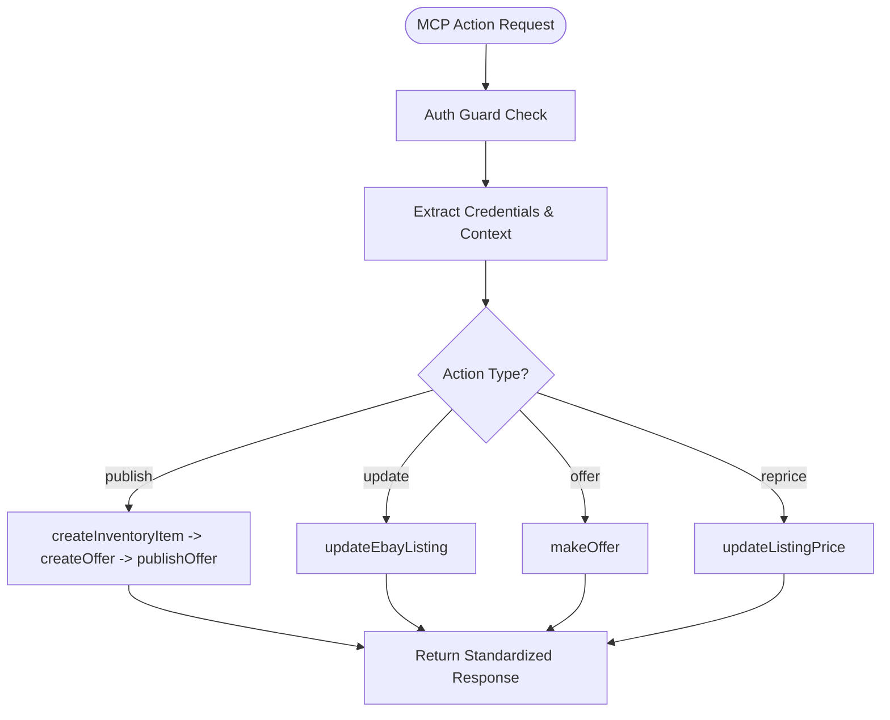

**Diagram sources**
- [ebay-mcp-router.ts:44-178](file://server/ebay-mcp-router.ts#L44-L178)

**Section sources**
- [ebay-mcp-router.ts:1-181](file://server/ebay-mcp-router.ts#L1-L181)
- [ebay-service.ts:520-561](file://server/ebay-service.ts#L520-L561)
- [ebay-service.ts:567-609](file://server/ebay-service.ts#L567-L609)
- [ebay-service.ts:611-638](file://server/ebay-service.ts#L611-L638)
- [ebay-service.ts:640-677](file://server/ebay-service.ts#L640-L677)

### Listing Retrieval
- Active listings: Fetches offers with pagination support and constructs listing summaries with URLs.
- Inventory items: Retrieves inventory items and maps product details and availability.

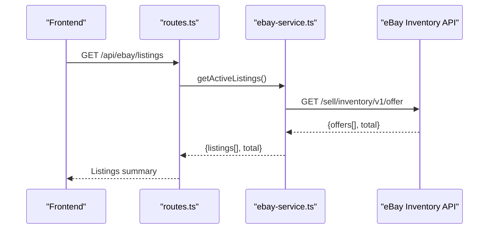

**Diagram sources**
- [routes.ts:64-109](file://server/routes.ts#L64-L109)
- [ebay-service.ts:68-114](file://server/ebay-service.ts#L68-L114)

**Section sources**
- [routes.ts:64-109](file://server/routes.ts#L64-L109)
- [ebay-service.ts:68-114](file://server/ebay-service.ts#L68-L114)

### Inventory Management and CRUD Operations
- Update inventory item: PUT to update product details and availability.
- Update listing price: Retrieve current offer, modify pricing, and PUT back.
- Update listing quantity: Retrieve inventory item, modify availability, and PUT back.
- Delete listing: DELETE offer by offerId.
- Delete inventory item: DELETE inventory item by SKU.

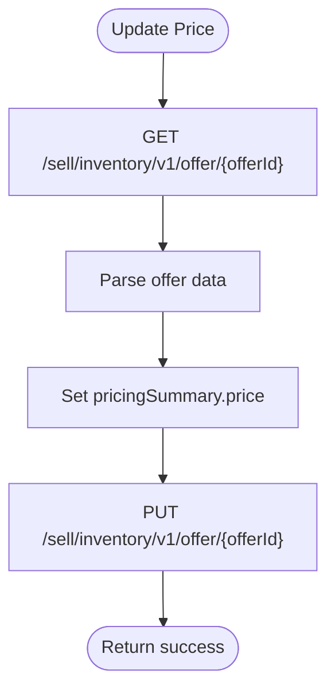

**Diagram sources**
- [ebay-service.ts:187-237](file://server/ebay-service.ts#L187-L237)

**Section sources**
- [ebay-service.ts:187-237](file://server/ebay-service.ts#L187-L237)
- [ebay-service.ts:239-288](file://server/ebay-service.ts#L239-L288)
- [ebay-service.ts:160-185](file://server/ebay-service.ts#L160-L185)
- [ebay-service.ts:406-449](file://server/ebay-service.ts#L406-L449)
- [ebay-service.ts:454-491](file://server/ebay-service.ts#L454-L491)

### Category Mapping System
Automatic category assignment based on item types:
- A category map defines app category names to eBay category IDs.
- A mapping function normalizes input and finds the best match, falling back to a generic category if none found.

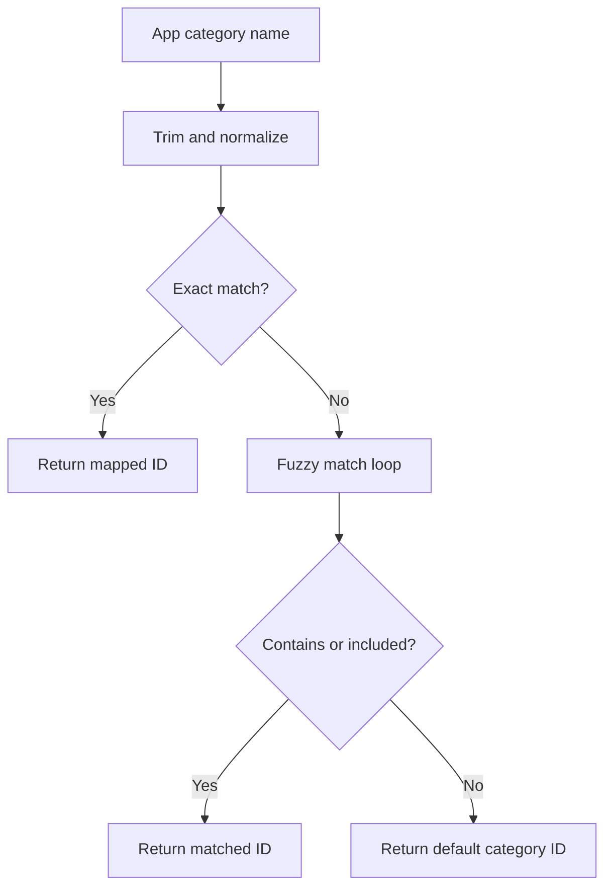

**Diagram sources**
- [ebay-service.ts:313-332](file://server/ebay-service.ts#L313-L332)

**Section sources**
- [ebay-service.ts:290-332](file://server/ebay-service.ts#L290-L332)

### Listing Creation Workflow
End-to-end listing creation:
- Publish endpoint validates credentials and refresh token, obtains an access token, creates inventory item, creates offer, publishes offer, and persists listing metadata.

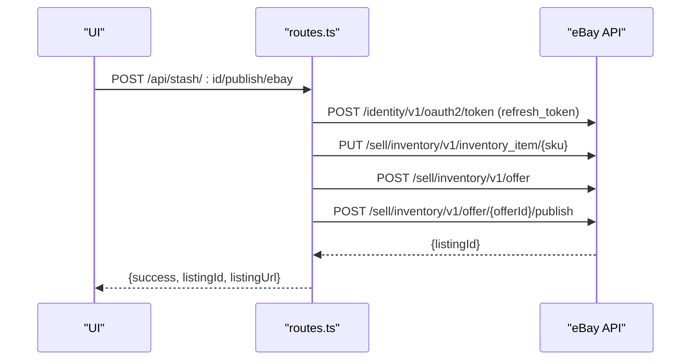

**Diagram sources**
- [routes.ts:634-902](file://server/routes.ts#L634-L902)

**Section sources**
- [routes.ts:634-902](file://server/routes.ts#L634-L902)

### Frontend Credential Management and Publishing
- Secure storage: Client ID, Client Secret, and Refresh Token are stored using platform-appropriate secure stores.
- Environment toggle: Supports sandbox and production modes.
- Publishing: The marketplace utility posts to backend routes with eBay credentials and triggers listing creation.

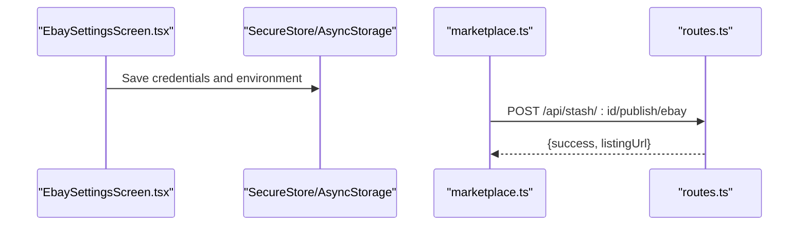

**Diagram sources**
- [EbaySettingsScreen.tsx:86-133](file://client/screens/EbaySettingsScreen.tsx#L86-L133)
- [marketplace.ts:137-182](file://client/lib/marketplace.ts#L137-L182)

**Section sources**
- [EbaySettingsScreen.tsx:29-85](file://client/screens/EbaySettingsScreen.tsx#L29-L85)
- [marketplace.ts:50-85](file://client/lib/marketplace.ts#L50-L85)
- [marketplace.ts:137-182](file://client/lib/marketplace.ts#L137-L182)

### Enhanced Marketplace Automation Workflows
**New**: The MCP router enables sophisticated automation workflows:

- **Standardized Action Processing**: All eBay operations follow consistent request/response patterns
- **Context-Aware Operations**: Actions can utilize marketplaceId, contentLanguage, and other context parameters
- **Comprehensive Error Handling**: Unified error responses with standardized status codes
- **Security Integration**: Optional API key protection for MCP endpoints

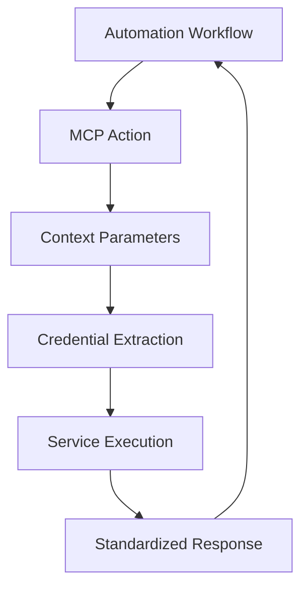

**Diagram sources**
- [ebay-mcp-router.ts:29-63](file://server/ebay-mcp-router.ts#L29-L63)

**Section sources**
- [ebay-mcp-router.ts:15-27](file://server/ebay-mcp-router.ts#L15-L27)
- [ebay-mcp-router.ts:29-63](file://server/ebay-mcp-router.ts#L29-L63)
- [ebay-mcp-router.ts:164-178](file://server/ebay-mcp-router.ts#L164-L178)

## Dependency Analysis
- Frontend depends on:
  - Secure storage for credentials
  - Query client for API communication
  - Backend routes for eBay operations
  - **New**: MCP router for standardized action processing
- Backend depends on:
  - eBay service library for API interactions
  - Environment configuration for base URLs
  - Database for persistence of listing metadata
  - **New**: MCP router integration for automation workflows

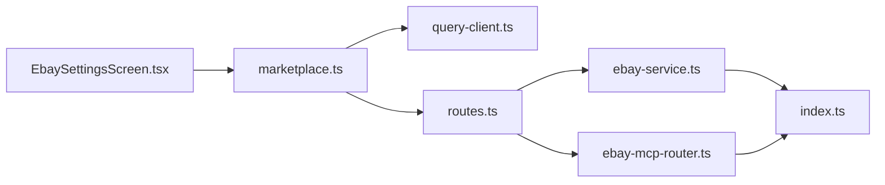

**Diagram sources**
- [EbaySettingsScreen.tsx:1-693](file://client/screens/EbaySettingsScreen.tsx#L1-L693)
- [marketplace.ts:1-183](file://client/lib/marketplace.ts#L1-L183)
- [query-client.ts:1-80](file://client/lib/query-client.ts#L1-L80)
- [routes.ts:1385-1385](file://server/routes.ts#L1385-L1385)
- [ebay-service.ts:1-678](file://server/ebay-service.ts#L1-L678)
- [ebay-mcp-router.ts:1-181](file://server/ebay-mcp-router.ts#L1-L181)
- [index.ts:1-262](file://server/index.ts#L1-L262)

**Section sources**
- [routes.ts:1385-1385](file://server/routes.ts#L1385-L1385)
- [ebay-service.ts:1-678](file://server/ebay-service.ts#L1-L678)
- [ebay-mcp-router.ts:1-181](file://server/ebay-mcp-router.ts#L1-L181)
- [index.ts:1-262](file://server/index.ts#L1-L262)

## Performance Considerations
- Pagination: Listing retrieval supports limit and offset to avoid large payloads.
- Token reuse: Access tokens are acquired per operation; consider caching with expiry checks to reduce redundant refresh calls.
- Network efficiency: Batch operations where feasible; minimize round trips by combining updates when eBay allows.
- Rate limiting: Respect eBay API rate limits; implement retries with exponential backoff and circuit breaker patterns.
- **New**: MCP action optimization: Standardized action processing reduces API call overhead through unified request/response patterns.

## Troubleshooting Guide
Common issues and resolutions:
- Authentication failures:
  - Verify Client ID and Client Secret; test connection from the settings screen.
  - Ensure refresh token is present for listing operations.
- Business policies required:
  - eBay requires configured shipping, payment, and return policies; the backend detects policy errors and returns actionable messages.
- API errors:
  - Inspect error bodies for detailed messages; handle non-2xx responses gracefully.
- Environment mismatch:
  - Confirm environment selection (sandbox vs production) aligns with credentials and expected behavior.
- **New**: MCP action failures:
  - Verify action parameter is one of: publish, update, offer, reprice
  - Check MCP API key authentication if enabled
  - Review standardized error responses for specific action failure details

**Section sources**
- [EbaySettingsScreen.tsx:135-186](file://client/screens/EbaySettingsScreen.tsx#L135-L186)
- [routes.ts:634-902](file://server/routes.ts#L634-L902)
- [routes.ts:854-870](file://server/routes.ts#L854-L870)
- [ebay-mcp-router.ts:164-178](file://server/ebay-mcp-router.ts#L164-L178)

## Conclusion
The eBay integration provides a robust foundation for listing management, inventory operations, and seamless authentication with refresh token handling. The introduction of the eBay MCP (Marketplace Control Protocol) router enhances the system with comprehensive automation capabilities, standardized action processing, and improved marketplace workflow orchestration. By leveraging secure credential storage, backend proxies, structured error handling, and unified MCP interfaces, the system supports reliable marketplace operations across sandbox and production environments.

## Appendices

### Security Best Practices
- Store credentials securely:
  - Use platform-specific secure storage for Client ID, Client Secret, and Refresh Token.
- Environment configuration:
  - Toggle between sandbox and production environments as needed.
- Token rotation:
  - Persist updated refresh tokens and expiry timestamps after successful refresh.
- Least privilege:
  - Use appropriate OAuth scopes and restrict permissions to required endpoints.
- **New**: MCP API security:
  - Configure EBAY_MCP_API_KEY environment variable for MCP endpoint protection
  - Implement proper authorization headers for MCP actions

**Section sources**
- [EbaySettingsScreen.tsx:29-34](file://client/screens/EbaySettingsScreen.tsx#L29-L34)
- [ENVIRONMENT.md:63-68](file://ENVIRONMENT.md#L63-L68)
- [ebay-service.ts:348-384](file://server/ebay-service.ts#L348-L384)
- [ebay-mcp-router.ts:15-27](file://server/ebay-mcp-router.ts#L15-L27)

### Practical Usage Patterns
- Publish to eBay:
  - Retrieve settings via marketplace utilities and post to the backend publish endpoint.
- Update listing:
  - Use backend routes to update price or quantity; the eBay service handles token acquisition and API calls.
- Terminate listing:
  - Call the delete endpoint to remove offers and inventory items.
- **New**: MCP automation:
  - Use standardized MCP actions for programmatic marketplace operations
  - Leverage context parameters for marketplace-specific configurations
  - Implement automated workflows using publish, update, offer, and reprice actions

**Section sources**
- [marketplace.ts:137-182](file://client/lib/marketplace.ts#L137-L182)
- [routes.ts:1188-1230](file://server/routes.ts#L1188-L1230)
- [ebay-service.ts:406-449](file://server/ebay-service.ts#L406-L449)
- [ebay-service.ts:454-491](file://server/ebay-service.ts#L454-L491)
- [ebay-mcp-router.ts:44-178](file://server/ebay-mcp-router.ts#L44-L178)

### MCP Action Reference
**New**: Comprehensive MCP action documentation:

- **Publish Action**: Creates complete listing workflow (inventory item → offer → publish)
- **Update Action**: Flexible patch updates to existing listings
- **Offer Action**: Submit buyer offers to specific listings
- **Reprice Action**: Programmatic price adjustments

Each action follows standardized request/response patterns with consistent error handling and status reporting.

**Section sources**
- [ebay-mcp-router.ts:44-178](file://server/ebay-mcp-router.ts#L44-L178)
- [ebay-service.ts:520-561](file://server/ebay-service.ts#L520-L561)
- [ebay-service.ts:567-609](file://server/ebay-service.ts#L567-L609)
- [ebay-service.ts:611-638](file://server/ebay-service.ts#L611-L638)
- [ebay-service.ts:640-677](file://server/ebay-service.ts#L640-L677)