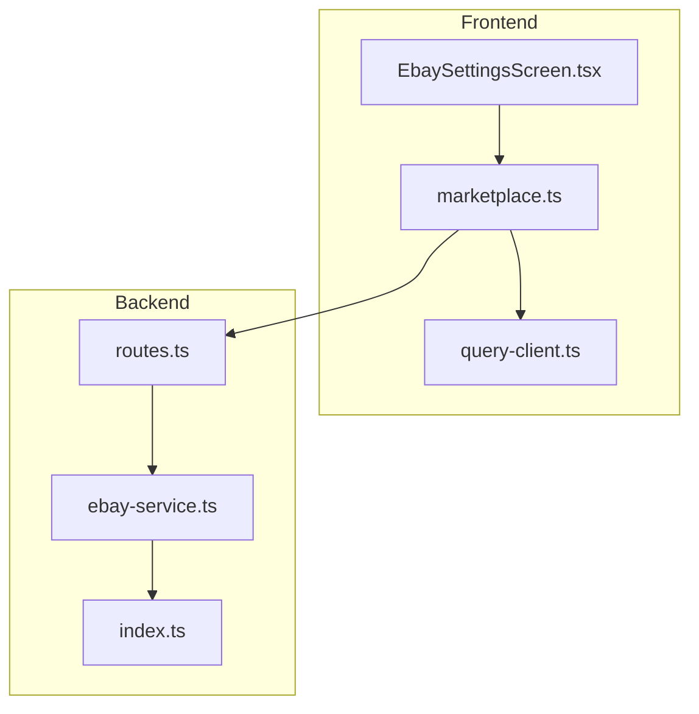
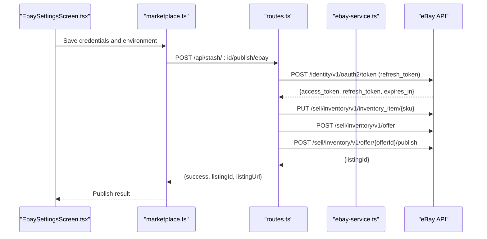
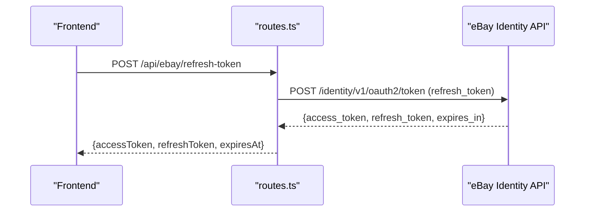
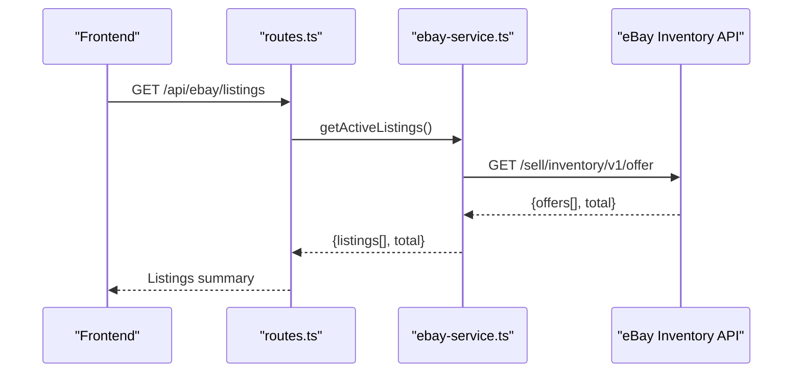
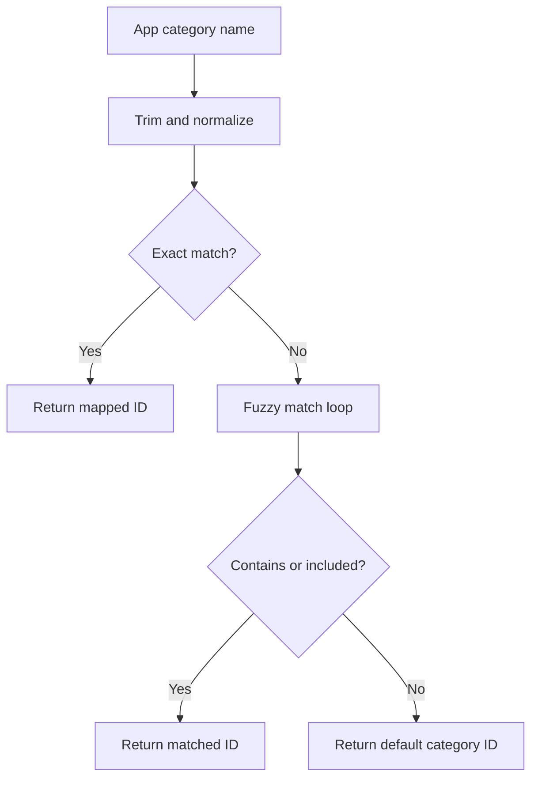
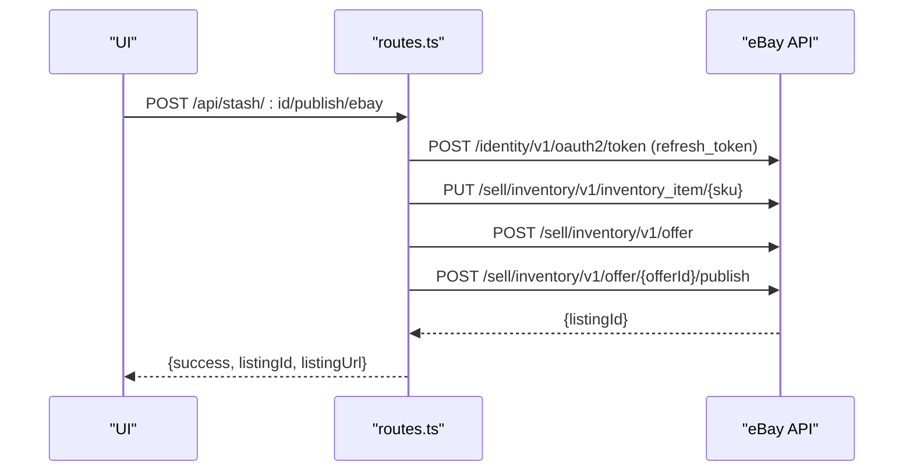
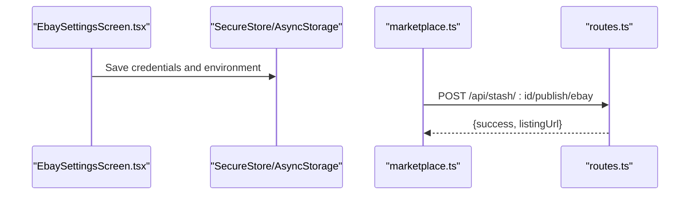
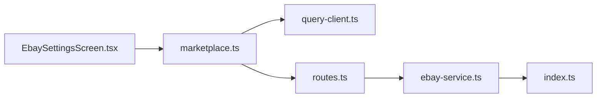

# eBay Integration

<cite>
**Referenced Files in This Document**
- [ebay-service.ts](file://server/ebay-service.ts)
- [routes.ts](file://server/routes.ts)
- [EbaySettingsScreen.tsx](file://client/screens/EbaySettingsScreen.tsx)
- [marketplace.ts](file://client/lib/marketplace.ts)
- [query-client.ts](file://client/lib/query-client.ts)
- [ENVIRONMENT.md](file://ENVIRONMENT.md)
- [index.ts](file://server/index.ts)
</cite>

## Table of Contents
1. [Introduction](#introduction)
2. [Project Structure](#project-structure)
3. [Core Components](#core-components)
4. [Architecture Overview](#architecture-overview)
5. [Detailed Component Analysis](#detailed-component-analysis)
6. [Dependency Analysis](#dependency-analysis)
7. [Performance Considerations](#performance-considerations)
8. [Troubleshooting Guide](#troubleshooting-guide)
9. [Conclusion](#conclusion)
10. [Appendices](#appendices)

## Introduction
This document explains the eBay marketplace integration for the HiddenGem project. It covers OAuth2 authentication, refresh token management, access token generation, listing retrieval, inventory management, and CRUD operations for eBay offers and inventory items. It also documents the category mapping system, listing creation workflow, price and quantity updates, listing termination, error handling, rate limiting considerations, API response parsing, security best practices, and practical usage patterns.

## Project Structure
The eBay integration spans three layers:
- Frontend (React Native): Settings screen and marketplace utilities for credential storage and API calls
- Backend (Express): Routes that proxy eBay APIs and manage token refresh
- Shared service library: Reusable eBay API client functions

**Diagram sources**
- [EbaySettingsScreen.tsx](file://client/screens/EbaySettingsScreen.tsx#L1-L568)
- [marketplace.ts](file://client/lib/marketplace.ts#L1-L129)
- [query-client.ts](file://client/lib/query-client.ts#L1-L80)
- [routes.ts](file://server/routes.ts#L44-L929)
- [ebay-service.ts](file://server/ebay-service.ts#L1-L474)
- [index.ts](file://server/index.ts#L1-L262)

**Section sources**
- [EbaySettingsScreen.tsx](file://client/screens/EbaySettingsScreen.tsx#L1-L568)
- [marketplace.ts](file://client/lib/marketplace.ts#L1-L129)
- [routes.ts](file://server/routes.ts#L44-L929)
- [ebay-service.ts](file://server/ebay-service.ts#L1-L474)
- [index.ts](file://server/index.ts#L1-L262)

## Core Components
- eBay credentials management and environment selection in the frontend settings screen
- Frontend marketplace utilities to publish items to eBay and retrieve settings
- Backend routes to handle eBay publishing, listing updates/deletes, and token refresh
- Shared eBay service library for token acquisition, listing retrieval, inventory operations, and category mapping

Key responsibilities:
- OAuth2 token acquisition and refresh
- Listing retrieval (active listings and inventory items)
- Inventory item updates (price, quantity, metadata)
- Offer lifecycle management (create, publish, update, delete)
- Category mapping for automatic eBay category assignment

**Section sources**
- [EbaySettingsScreen.tsx](file://client/screens/EbaySettingsScreen.tsx#L14-L187)
- [marketplace.ts](file://client/lib/marketplace.ts#L46-L79)
- [routes.ts](file://server/routes.ts#L457-L647)
- [ebay-service.ts](file://server/ebay-service.ts#L42-L62)
- [ebay-service.ts](file://server/ebay-service.ts#L111-L150)
- [ebay-service.ts](file://server/ebay-service.ts#L386-L430)
- [ebay-service.ts](file://server/ebay-service.ts#L435-L473)
- [ebay-service.ts](file://server/ebay-service.ts#L274-L313)

## Architecture Overview
The integration follows a proxy pattern: the frontend calls backend routes, which authenticate with eBay and perform operations against the eBay APIs. Tokens are refreshed as needed, and responses are normalized for the frontend.

**Diagram sources**
- [EbaySettingsScreen.tsx](file://client/screens/EbaySettingsScreen.tsx#L75-L110)
- [marketplace.ts](file://client/lib/marketplace.ts#L105-L128)
- [routes.ts](file://server/routes.ts#L457-L647)
- [ebay-service.ts](file://server/ebay-service.ts#L42-L62)

## Detailed Component Analysis

### OAuth2 Authentication Flow
- Client credentials setup: Client ID and Client Secret are stored securely in the frontend and passed to backend routes for token refresh.
- Refresh token management: The backend performs a refresh grant to obtain an access token and optionally a new refresh token with expiry timestamp.
- Access token generation: The eBay service acquires an access token using the refresh token and environment (sandbox/production).

**Diagram sources**
- [routes.ts](file://server/routes.ts#L893-L906)
- [ebay-service.ts](file://server/ebay-service.ts#L329-L364)

**Section sources**
- [EbaySettingsScreen.tsx](file://client/screens/EbaySettingsScreen.tsx#L14-L18)
- [routes.ts](file://server/routes.ts#L893-L906)
- [ebay-service.ts](file://server/ebay-service.ts#L319-L364)

### Listing Retrieval
- Active listings: Fetches offers with pagination support and constructs listing summaries with URLs.
- Inventory items: Retrieves inventory items and maps product details and availability.

**Diagram sources**
- [routes.ts](file://server/routes.ts#L64-L109)
- [ebay-service.ts](file://server/ebay-service.ts#L64-L109)

**Section sources**
- [routes.ts](file://server/routes.ts#L64-L109)
- [ebay-service.ts](file://server/ebay-service.ts#L8-L28)
- [ebay-service.ts](file://server/ebay-service.ts#L64-L109)

### Inventory Management and CRUD Operations
- Update inventory item: PUT to update product details and availability.
- Update listing price: Retrieve current offer, modify pricing, and PUT back.
- Update listing quantity: Retrieve inventory item, modify availability, and PUT back.
- Delete listing: DELETE offer by offerId.
- Delete inventory item: DELETE inventory item by SKU.

**Diagram sources**
- [ebay-service.ts](file://server/ebay-service.ts#L177-L224)

**Section sources**
- [ebay-service.ts](file://server/ebay-service.ts#L177-L224)
- [ebay-service.ts](file://server/ebay-service.ts#L226-L272)
- [ebay-service.ts](file://server/ebay-service.ts#L152-L175)
- [ebay-service.ts](file://server/ebay-service.ts#L386-L430)
- [ebay-service.ts](file://server/ebay-service.ts#L435-L473)

### Category Mapping System
Automatic category assignment based on item types:
- A category map defines app category names to eBay category IDs.
- A mapping function normalizes input and finds the best match, falling back to a generic category if none found.

**Diagram sources**
- [ebay-service.ts](file://server/ebay-service.ts#L274-L313)

**Section sources**
- [ebay-service.ts](file://server/ebay-service.ts#L274-L313)

### Listing Creation Workflow
End-to-end listing creation:
- Publish endpoint validates credentials and refresh token, obtains an access token, creates inventory item, creates offer, publishes offer, and persists listing metadata.

**Diagram sources**
- [routes.ts](file://server/routes.ts#L457-L647)

**Section sources**
- [routes.ts](file://server/routes.ts#L457-L647)

### Frontend Credential Management and Publishing
- Secure storage: Client ID, Client Secret, and Refresh Token are stored using platform-appropriate secure stores.
- Environment toggle: Supports sandbox and production modes.
- Publishing: The marketplace utility posts to backend routes with eBay credentials and triggers listing creation.

**Diagram sources**
- [EbaySettingsScreen.tsx](file://client/screens/EbaySettingsScreen.tsx#L75-L110)
- [marketplace.ts](file://client/lib/marketplace.ts#L105-L128)

**Section sources**
- [EbaySettingsScreen.tsx](file://client/screens/EbaySettingsScreen.tsx#L14-L187)
- [marketplace.ts](file://client/lib/marketplace.ts#L46-L79)
- [marketplace.ts](file://client/lib/marketplace.ts#L105-L128)

## Dependency Analysis
- Frontend depends on:
  - Secure storage for credentials
  - Query client for API communication
  - Backend routes for eBay operations
- Backend depends on:
  - eBay service library for API interactions
  - Environment configuration for base URLs
  - Database for persistence of listing metadata

**Diagram sources**
- [EbaySettingsScreen.tsx](file://client/screens/EbaySettingsScreen.tsx#L1-L568)
- [marketplace.ts](file://client/lib/marketplace.ts#L1-L129)
- [query-client.ts](file://client/lib/query-client.ts#L1-L80)
- [routes.ts](file://server/routes.ts#L44-L929)
- [ebay-service.ts](file://server/ebay-service.ts#L1-L474)
- [index.ts](file://server/index.ts#L1-L262)

**Section sources**
- [routes.ts](file://server/routes.ts#L44-L929)
- [ebay-service.ts](file://server/ebay-service.ts#L1-L474)
- [index.ts](file://server/index.ts#L1-L262)

## Performance Considerations
- Pagination: Listing retrieval supports limit and offset to avoid large payloads.
- Token reuse: Access tokens are acquired per operation; consider caching with expiry checks to reduce redundant refresh calls.
- Network efficiency: Batch operations where feasible; minimize round trips by combining updates when eBay allows.
- Rate limiting: Respect eBay API rate limits; implement retries with exponential backoff and circuit breaker patterns.

[No sources needed since this section provides general guidance]

## Troubleshooting Guide
Common issues and resolutions:
- Authentication failures:
  - Verify Client ID and Client Secret; test connection from the settings screen.
  - Ensure refresh token is present for listing operations.
- Business policies required:
  - eBay requires configured shipping, payment, and return policies; the backend detects policy errors and returns actionable messages.
- API errors:
  - Inspect error bodies for detailed messages; handle non-2xx responses gracefully.
- Environment mismatch:
  - Confirm environment selection (sandbox vs production) aligns with credentials and expected behavior.

**Section sources**
- [EbaySettingsScreen.tsx](file://client/screens/EbaySettingsScreen.tsx#L112-L150)
- [routes.ts](file://server/routes.ts#L457-L647)
- [routes.ts](file://server/routes.ts#L608-L621)

## Conclusion
The eBay integration provides a robust foundation for listing management, inventory operations, and seamless authentication with refresh token handling. By leveraging secure credential storage, backend proxies, and structured error handling, the system supports reliable marketplace operations across sandbox and production environments.

[No sources needed since this section summarizes without analyzing specific files]

## Appendices

### Security Best Practices
- Store credentials securely:
  - Use platform-specific secure storage for Client ID, Client Secret, and Refresh Token.
- Environment configuration:
  - Toggle between sandbox and production environments as needed.
- Token rotation:
  - Persist updated refresh tokens and expiry timestamps after successful refresh.
- Least privilege:
  - Use appropriate OAuth scopes and restrict permissions to required endpoints.

**Section sources**
- [EbaySettingsScreen.tsx](file://client/screens/EbaySettingsScreen.tsx#L14-L18)
- [ENVIRONMENT.md](file://ENVIRONMENT.md#L63-L68)
- [ebay-service.ts](file://server/ebay-service.ts#L319-L364)

### Practical Usage Patterns
- Publish to eBay:
  - Retrieve settings via marketplace utilities and post to the backend publish endpoint.
- Update listing:
  - Use backend routes to update price or quantity; the eBay service handles token acquisition and API calls.
- Terminate listing:
  - Call the delete endpoint to remove offers and inventory items.

**Section sources**
- [marketplace.ts](file://client/lib/marketplace.ts#L105-L128)
- [routes.ts](file://server/routes.ts#L863-L891)
- [ebay-service.ts](file://server/ebay-service.ts#L152-L175)
- [ebay-service.ts](file://server/ebay-service.ts#L435-L473)