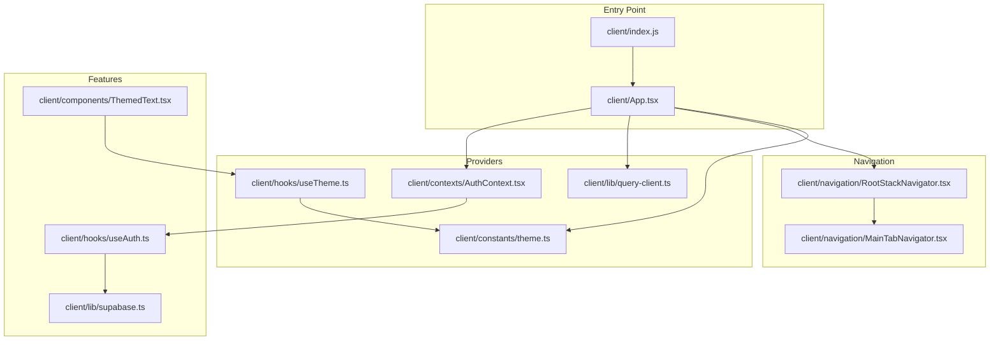
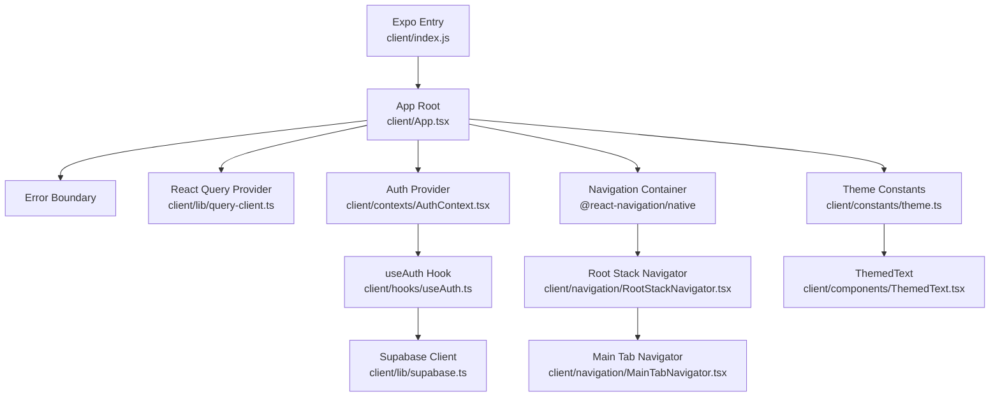
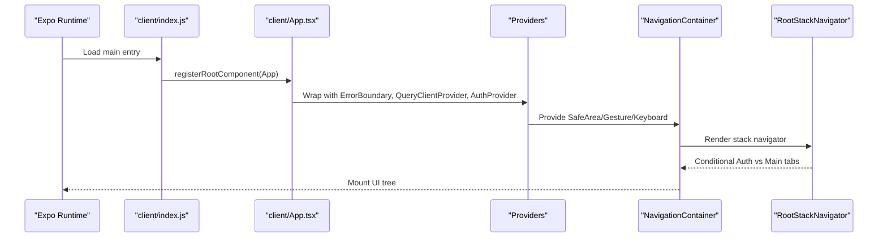
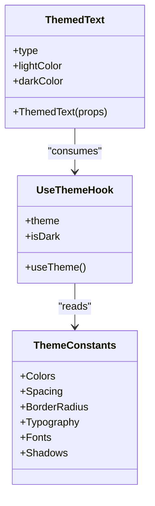
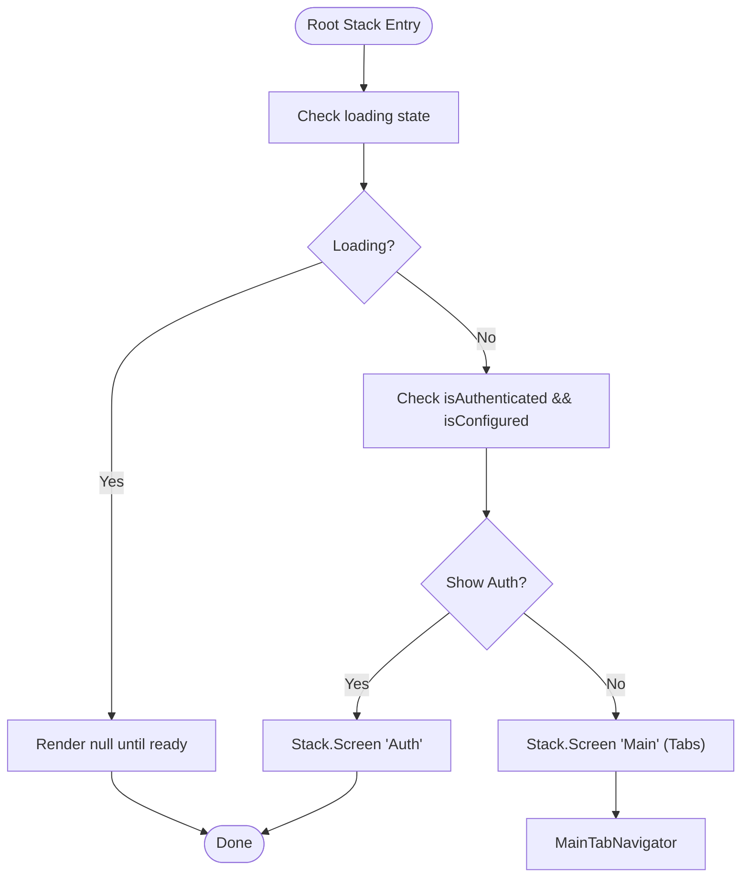
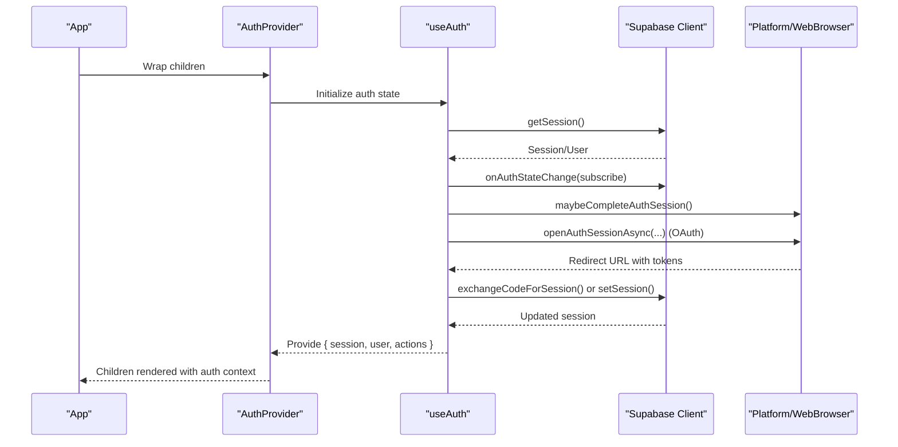
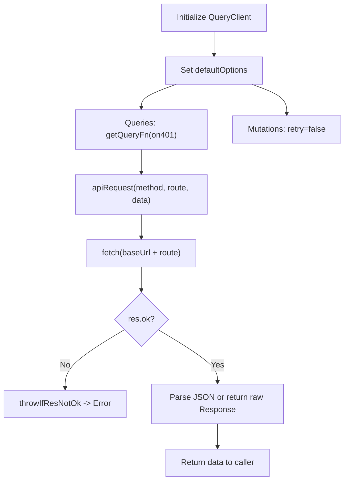
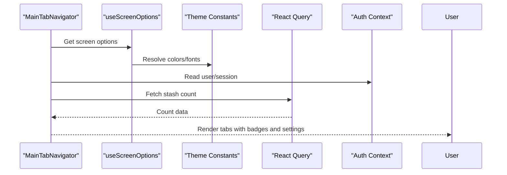
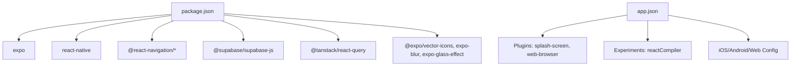

# Application Architecture

<cite>
**Referenced Files in This Document**
- [client/App.tsx](file://client/App.tsx)
- [client/index.js](file://client/index.js)
- [app.json](file://app.json)
- [package.json](file://package.json)
- [client/constants/theme.ts](file://client/constants/theme.ts)
- [client/hooks/useTheme.ts](file://client/hooks/useTheme.ts)
- [client/hooks/useColorScheme.ts](file://client/hooks/useColorScheme.ts)
- [client/components/ThemedText.tsx](file://client/components/ThemedText.tsx)
- [client/navigation/RootStackNavigator.tsx](file://client/navigation/RootStackNavigator.tsx)
- [client/navigation/MainTabNavigator.tsx](file://client/navigation/MainTabNavigator.tsx)
- [client/contexts/AuthContext.tsx](file://client/contexts/AuthContext.tsx)
- [client/hooks/useAuth.ts](file://client/hooks/useAuth.ts)
- [client/lib/supabase.ts](file://client/lib/supabase.ts)
- [client/lib/query-client.ts](file://client/lib/query-client.ts)
</cite>

## Table of Contents
1. [Introduction](#introduction)
2. [Project Structure](#project-structure)
3. [Core Components](#core-components)
4. [Architecture Overview](#architecture-overview)
5. [Detailed Component Analysis](#detailed-component-analysis)
6. [Dependency Analysis](#dependency-analysis)
7. [Performance Considerations](#performance-considerations)
8. [Troubleshooting Guide](#troubleshooting-guide)
9. [Conclusion](#conclusion)
10. [Appendices](#appendices)

## Introduction
This document explains the React Native application architecture with a focus on the app entry point, initialization sequence, provider hierarchy, navigation structure, and design system. It covers how the app integrates with Expo, manages authentication via Supabase, orchestrates theme and typography, and composes components across platforms. Practical examples demonstrate provider usage, component composition patterns, and architectural decisions.

## Project Structure
The application follows a feature-based structure under the client directory, with clear separation of concerns:
- Entry point registers the root component with Expo.
- Providers wrap the app to supply global state and services.
- Navigation defines stacks and tabs for routing.
- Theme and design tokens live in a centralized constants module.
- Authentication logic is encapsulated in a dedicated hook and context.
- Data fetching is managed via React Query with a typed query client.

**Diagram sources**
- [client/index.js](file://client/index.js#L1-L6)
- [client/App.tsx](file://client/App.tsx#L1-L57)
- [client/contexts/AuthContext.tsx](file://client/contexts/AuthContext.tsx#L1-L31)
- [client/lib/query-client.ts](file://client/lib/query-client.ts#L1-L80)
- [client/navigation/RootStackNavigator.tsx](file://client/navigation/RootStackNavigator.tsx#L1-L124)
- [client/navigation/MainTabNavigator.tsx](file://client/navigation/MainTabNavigator.tsx#L1-L192)
- [client/hooks/useAuth.ts](file://client/hooks/useAuth.ts#L1-L151)
- [client/lib/supabase.ts](file://client/lib/supabase.ts#L1-L39)
- [client/constants/theme.ts](file://client/constants/theme.ts#L1-L167)
- [client/hooks/useTheme.ts](file://client/hooks/useTheme.ts#L1-L14)
- [client/components/ThemedText.tsx](file://client/components/ThemedText.tsx#L1-L62)

**Section sources**
- [client/index.js](file://client/index.js#L1-L6)
- [client/App.tsx](file://client/App.tsx#L1-L57)
- [app.json](file://app.json#L1-L52)
- [package.json](file://package.json#L1-L85)

## Core Components
- App root component initializes providers, theme, and navigation stack.
- Provider hierarchy: Error boundary, React Query, Auth, Safe Area, Gesture Handler, Keyboard Provider, Navigation Container, and StatusBar.
- Theme system defines colors, spacing, typography, fonts, and shadows for light/dark modes and platforms.
- Navigation stack determines whether to render authentication or main tabs.
- Authentication hook manages session state, callbacks, and OAuth flows across platforms.
- Supabase client handles configuration, persistence, and redirect URLs.
- Query client centralizes API requests and error handling.

**Section sources**
- [client/App.tsx](file://client/App.tsx#L1-L57)
- [client/constants/theme.ts](file://client/constants/theme.ts#L1-L167)
- [client/navigation/RootStackNavigator.tsx](file://client/navigation/RootStackNavigator.tsx#L1-L124)
- [client/hooks/useAuth.ts](file://client/hooks/useAuth.ts#L1-L151)
- [client/lib/supabase.ts](file://client/lib/supabase.ts#L1-L39)
- [client/lib/query-client.ts](file://client/lib/query-client.ts#L1-L80)

## Architecture Overview
The app uses a layered architecture:
- Entry layer: Expo root registration and app bootstrap.
- Provider layer: Global state and services (authentication, data fetching).
- Navigation layer: Stack and tab navigators orchestrate screens.
- Feature layer: Screens, components, and hooks implement domain logic.
- Infrastructure layer: Supabase and React Query integrate external services.

**Diagram sources**
- [client/index.js](file://client/index.js#L1-L6)
- [client/App.tsx](file://client/App.tsx#L1-L57)
- [client/lib/query-client.ts](file://client/lib/query-client.ts#L1-L80)
- [client/contexts/AuthContext.tsx](file://client/contexts/AuthContext.tsx#L1-L31)
- [client/navigation/RootStackNavigator.tsx](file://client/navigation/RootStackNavigator.tsx#L1-L124)
- [client/navigation/MainTabNavigator.tsx](file://client/navigation/MainTabNavigator.tsx#L1-L192)
- [client/hooks/useAuth.ts](file://client/hooks/useAuth.ts#L1-L151)
- [client/lib/supabase.ts](file://client/lib/supabase.ts#L1-L39)
- [client/constants/theme.ts](file://client/constants/theme.ts#L1-L167)
- [client/components/ThemedText.tsx](file://client/components/ThemedText.tsx#L1-L62)

## Detailed Component Analysis

### App Root and Provider Hierarchy
The root component composes providers in a specific order to ensure proper initialization and context availability. It applies a custom dark theme merged with brand colors and sets up safe area, gestures, keyboard handling, and navigation container.

**Diagram sources**
- [client/index.js](file://client/index.js#L1-L6)
- [client/App.tsx](file://client/App.tsx#L1-L57)
- [client/navigation/RootStackNavigator.tsx](file://client/navigation/RootStackNavigator.tsx#L1-L124)

**Section sources**
- [client/App.tsx](file://client/App.tsx#L1-L57)

### Theme Management and Design System
The design system consolidates colors, spacing, typography, fonts, and shadows. A theme hook selects the appropriate palette based on the OS color scheme, while themed components consume typography scales and color tokens.

**Diagram sources**
- [client/constants/theme.ts](file://client/constants/theme.ts#L1-L167)
- [client/hooks/useTheme.ts](file://client/hooks/useTheme.ts#L1-L14)
- [client/components/ThemedText.tsx](file://client/components/ThemedText.tsx#L1-L62)

**Section sources**
- [client/constants/theme.ts](file://client/constants/theme.ts#L1-L167)
- [client/hooks/useTheme.ts](file://client/hooks/useTheme.ts#L1-L14)
- [client/components/ThemedText.tsx](file://client/components/ThemedText.tsx#L1-L62)

### Navigation Flow and Conditional Rendering
The root stack decides between rendering the authentication screen or the main tab navigator based on authentication state and configuration. Screen options apply consistent styling and platform-specific behaviors.

**Diagram sources**
- [client/navigation/RootStackNavigator.tsx](file://client/navigation/RootStackNavigator.tsx#L1-L124)

**Section sources**
- [client/navigation/RootStackNavigator.tsx](file://client/navigation/RootStackNavigator.tsx#L1-L124)

### Authentication Provider and Hook
The AuthContext exposes session, user, and auth actions. The useAuth hook initializes Supabase sessions, subscribes to auth state changes, and implements sign-in/sign-up/sign-out and Google OAuth flows. Platform-specific handling ensures correct redirect URLs and browser session completion.

**Diagram sources**
- [client/contexts/AuthContext.tsx](file://client/contexts/AuthContext.tsx#L1-L31)
- [client/hooks/useAuth.ts](file://client/hooks/useAuth.ts#L1-L151)
- [client/lib/supabase.ts](file://client/lib/supabase.ts#L1-L39)

**Section sources**
- [client/contexts/AuthContext.tsx](file://client/contexts/AuthContext.tsx#L1-L31)
- [client/hooks/useAuth.ts](file://client/hooks/useAuth.ts#L1-L151)
- [client/lib/supabase.ts](file://client/lib/supabase.ts#L1-L39)

### Data Fetching with React Query
The query client centralizes API base URL resolution, request construction, and error handling. It enforces consistent defaults for queries and mutations and integrates with the app’s backend via environment variables.

**Diagram sources**
- [client/lib/query-client.ts](file://client/lib/query-client.ts#L1-L80)

**Section sources**
- [client/lib/query-client.ts](file://client/lib/query-client.ts#L1-L80)

### Tab Navigation Composition
The main tab navigator configures tab bar appearance, header content, and platform-specific styling. It integrates with the theme system and uses React Query to display dynamic counts.

**Diagram sources**
- [client/navigation/MainTabNavigator.tsx](file://client/navigation/MainTabNavigator.tsx#L1-L192)
- [client/hooks/useScreenOptions.ts](file://client/hooks/useScreenOptions.ts#L1-L42)
- [client/constants/theme.ts](file://client/constants/theme.ts#L1-L167)

**Section sources**
- [client/navigation/MainTabNavigator.tsx](file://client/navigation/MainTabNavigator.tsx#L1-L192)
- [client/hooks/useScreenOptions.ts](file://client/hooks/useScreenOptions.ts#L1-L42)

## Dependency Analysis
The app relies on Expo-managed dependencies and third-party libraries for navigation, authentication, data fetching, and UI. Build configuration is defined in app.json, including platform capabilities, plugins, and experiments.

**Diagram sources**
- [package.json](file://package.json#L1-L85)
- [app.json](file://app.json#L1-L52)

**Section sources**
- [package.json](file://package.json#L1-L85)
- [app.json](file://app.json#L1-L52)

## Performance Considerations
- Navigation and gesture handlers are initialized at the root to minimize re-renders and ensure smooth transitions.
- React Query defaults disable automatic refetching and retries to reduce network overhead; leverage manual invalidation and selective updates.
- Platform-specific UI choices (e.g., blur effects) are gated behind capability checks to avoid unnecessary work on unsupported platforms.
- Theme and typography are resolved statically at render time; keep component props minimal to reduce recomputation.

## Troubleshooting Guide
- Authentication not persisting on native:
  - Verify Supabase client initialization and AsyncStorage usage for non-web platforms.
  - Confirm redirect URL generation matches the app scheme.
- OAuth flow failures:
  - Ensure environment variables for Supabase URL and anonymous key are present.
  - On native, confirm WebBrowser auth session completion and successful token exchange.
- Navigation glitches:
  - Check screen options transparency and blur effect compatibility per platform.
  - Validate tab bar background and header styling for iOS vs Android.
- API errors:
  - Confirm EXPO_PUBLIC_DOMAIN is set and resolves to the backend origin.
  - Inspect thrown errors from response validation and handle appropriately in screens.

**Section sources**
- [client/lib/supabase.ts](file://client/lib/supabase.ts#L1-L39)
- [client/hooks/useAuth.ts](file://client/hooks/useAuth.ts#L1-L151)
- [client/lib/query-client.ts](file://client/lib/query-client.ts#L1-L80)
- [client/navigation/RootStackNavigator.tsx](file://client/navigation/RootStackNavigator.tsx#L1-L124)

## Conclusion
The application employs a clean, layered architecture with a strong emphasis on provider composition, centralized theme management, and robust authentication and data-fetching integrations. The Expo-first configuration enables cross-platform development with platform-specific enhancements, while the navigation and component layers promote maintainability and scalability.

## Appendices
- Practical examples:
  - Provider usage: Wrap the app with ErrorBoundary, QueryClientProvider, AuthProvider, SafeAreaProvider, GestureHandlerRootView, KeyboardProvider, and NavigationContainer.
  - Component composition: Use ThemedText with type variants and platform-aware colors; compose headers with dynamic counts and settings navigation.
  - Architectural patterns: Context-based auth state, hook-based data fetching, and theme-driven component styling.