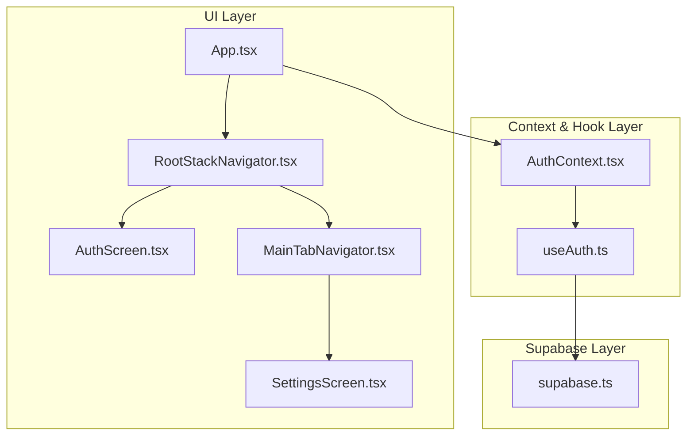
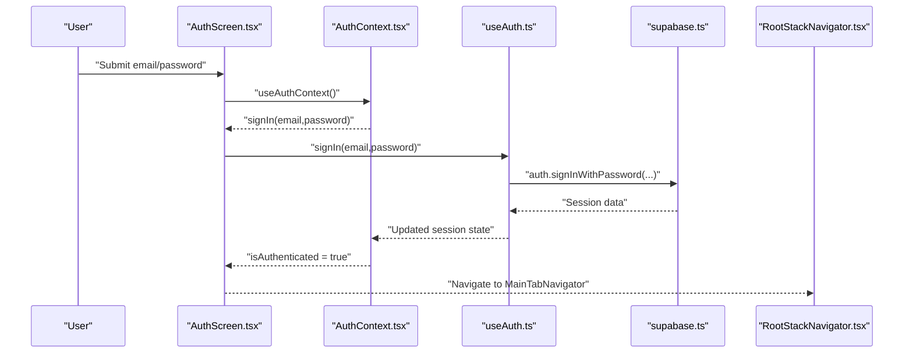
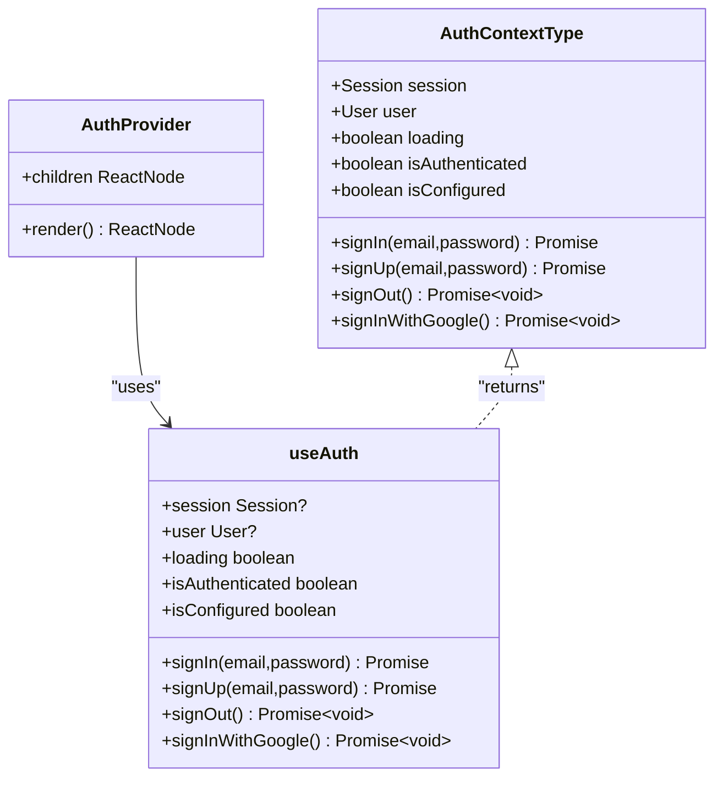
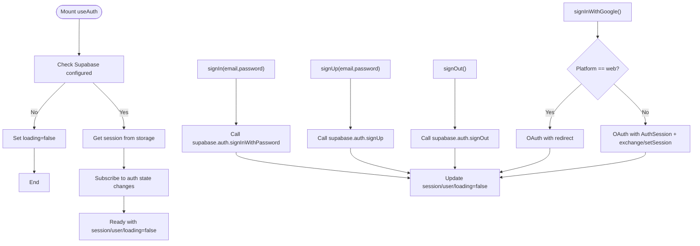
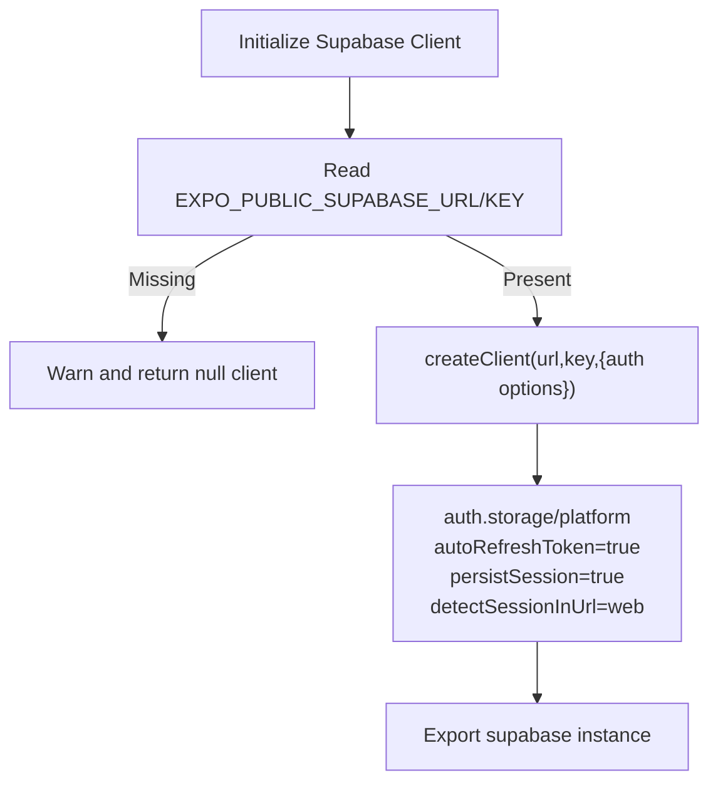
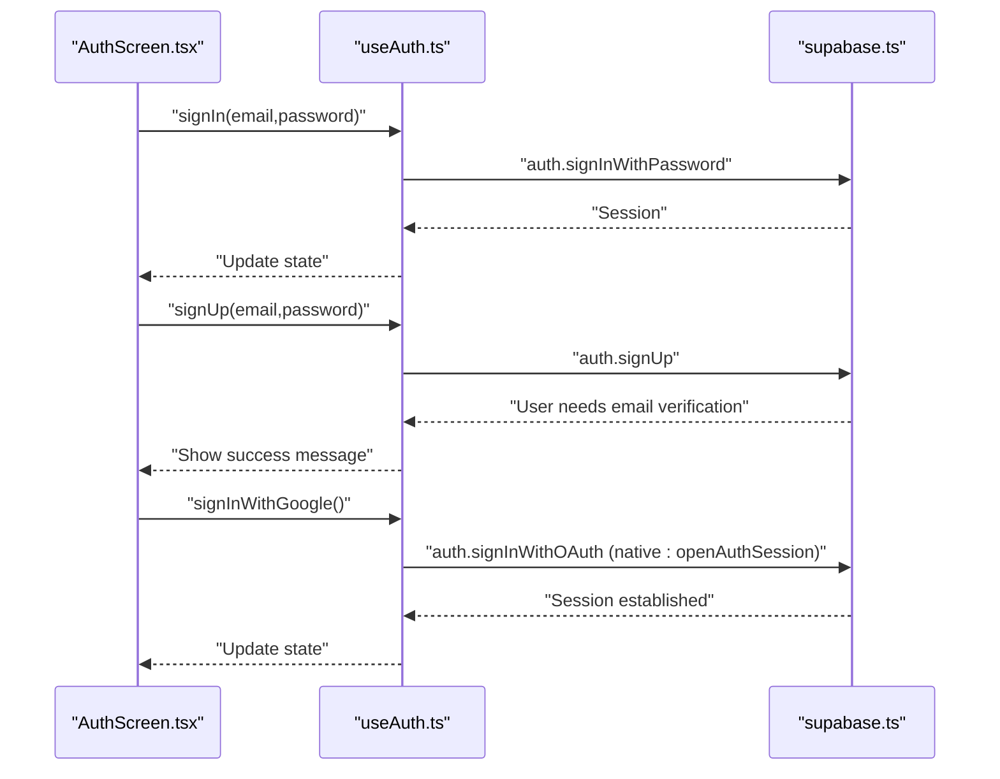
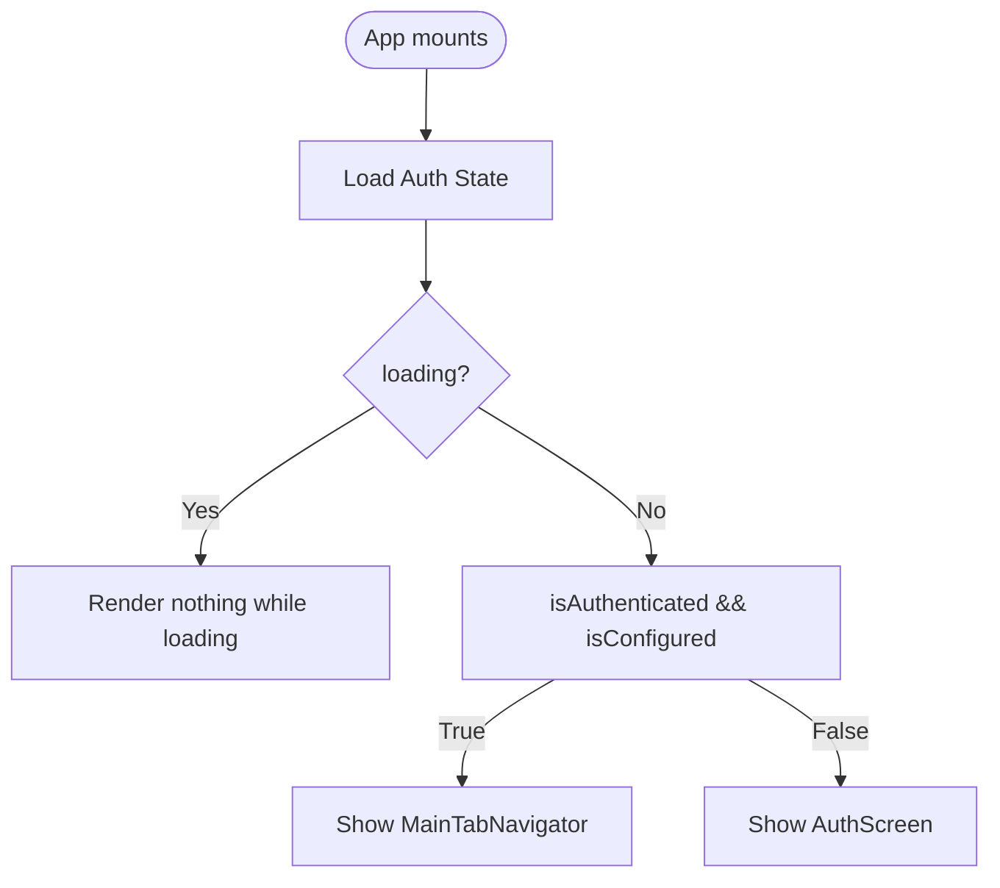
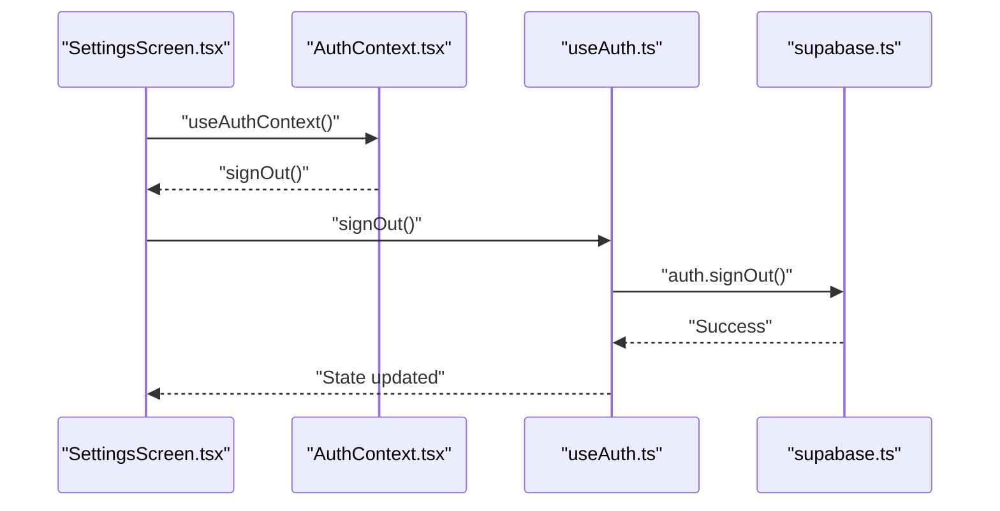
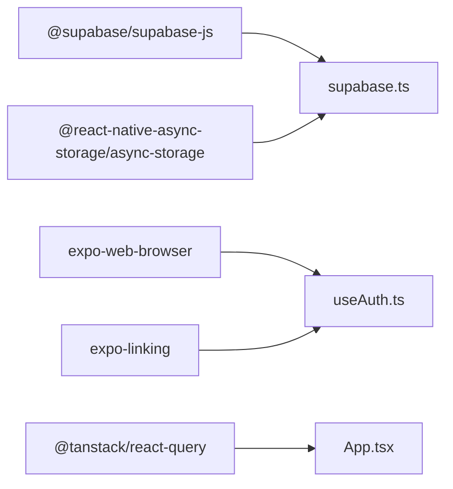

# Authentication System

<cite>
**Referenced Files in This Document**
- [AuthContext.tsx](file://client/contexts/AuthContext.tsx)
- [useAuth.ts](file://client/hooks/useAuth.ts)
- [supabase.ts](file://client/lib/supabase.ts)
- [AuthScreen.tsx](file://client/screens/AuthScreen.tsx)
- [App.tsx](file://client/App.tsx)
- [RootStackNavigator.tsx](file://client/navigation/RootStackNavigator.tsx)
- [MainTabNavigator.tsx](file://client/navigation/MainTabNavigator.tsx)
- [SettingsScreen.tsx](file://client/screens/SettingsScreen.tsx)
- [ENVIRONMENT.md](file://ENVIRONMENT.md)
- [package.json](file://package.json)
</cite>

## Table of Contents
1. [Introduction](#introduction)
2. [Project Structure](#project-structure)
3. [Core Components](#core-components)
4. [Architecture Overview](#architecture-overview)
5. [Detailed Component Analysis](#detailed-component-analysis)
6. [Dependency Analysis](#dependency-analysis)
7. [Performance Considerations](#performance-considerations)
8. [Troubleshooting Guide](#troubleshooting-guide)
9. [Conclusion](#conclusion)

## Introduction
This document explains the authentication system for the HiddenGem application, focusing on Supabase integration, authentication context provider, and user session management. It covers the complete authentication flow from login/signup to protected route access, session persistence, and token management. It also documents the AuthContext provider implementation, custom hooks for authentication state, integration with the Supabase client, user registration and login/logout workflows, email verification processes, authentication guards for protected routes, error handling strategies, and security considerations. Practical examples of authentication usage throughout the application and the relationship between authentication state and API requests are included.

## Project Structure
The authentication system is organized around three core areas:
- Context and hook layer: Provides centralized authentication state and actions
- Supabase client layer: Handles Supabase initialization, session persistence, and OAuth redirects
- UI layer: Presents authentication screens and integrates with navigation for route protection

**Diagram sources**
- [App.tsx](file://client/App.tsx#L30-L49)
- [AuthContext.tsx](file://client/contexts/AuthContext.tsx#L19-L30)
- [useAuth.ts](file://client/hooks/useAuth.ts#L12-L38)
- [supabase.ts](file://client/lib/supabase.ts#L20-L38)
- [RootStackNavigator.tsx](file://client/navigation/RootStackNavigator.tsx#L32-L123)
- [AuthScreen.tsx](file://client/screens/AuthScreen.tsx#L13-L239)
- [MainTabNavigator.tsx](file://client/navigation/MainTabNavigator.tsx#L64-L144)
- [SettingsScreen.tsx](file://client/screens/SettingsScreen.tsx#L76-L164)

**Section sources**
- [App.tsx](file://client/App.tsx#L30-L49)
- [AuthContext.tsx](file://client/contexts/AuthContext.tsx#L1-L31)
- [useAuth.ts](file://client/hooks/useAuth.ts#L1-L151)
- [supabase.ts](file://client/lib/supabase.ts#L1-L39)
- [RootStackNavigator.tsx](file://client/navigation/RootStackNavigator.tsx#L32-L123)
- [AuthScreen.tsx](file://client/screens/AuthScreen.tsx#L13-L239)
- [MainTabNavigator.tsx](file://client/navigation/MainTabNavigator.tsx#L64-L144)
- [SettingsScreen.tsx](file://client/screens/SettingsScreen.tsx#L76-L164)

## Core Components
- AuthContext Provider: Exposes authentication state and actions to the entire app via a React Context
- useAuth Hook: Centralizes session retrieval, real-time auth state updates, and authentication actions (login, signup, logout, Google OAuth)
- Supabase Client: Initializes Supabase with platform-aware session persistence and auto-refresh behavior
- Auth Screen: Implements user registration and login UI with error/success messaging
- Navigation Guards: Route protection logic that conditionally renders Auth or Main navigators based on authentication state

Key responsibilities:
- Session lifecycle management (restore, subscribe, update, persist)
- OAuth with Google across web and native platforms
- Email verification flow (via Supabase)
- Protected route access control

**Section sources**
- [AuthContext.tsx](file://client/contexts/AuthContext.tsx#L5-L30)
- [useAuth.ts](file://client/hooks/useAuth.ts#L12-L150)
- [supabase.ts](file://client/lib/supabase.ts#L20-L38)
- [AuthScreen.tsx](file://client/screens/AuthScreen.tsx#L25-L79)
- [RootStackNavigator.tsx](file://client/navigation/RootStackNavigator.tsx#L34-L41)

## Architecture Overview
The authentication architecture follows a layered pattern:
- UI components consume authentication state via AuthContext
- useAuth encapsulates Supabase interactions and exposes normalized actions
- Supabase client manages session persistence and token refresh
- Navigation decides whether to show Auth or Main views based on authentication state

**Diagram sources**
- [AuthScreen.tsx](file://client/screens/AuthScreen.tsx#L25-L58)
- [AuthContext.tsx](file://client/contexts/AuthContext.tsx#L19-L30)
- [useAuth.ts](file://client/hooks/useAuth.ts#L40-L50)
- [supabase.ts](file://client/lib/supabase.ts#L26-L33)
- [RootStackNavigator.tsx](file://client/navigation/RootStackNavigator.tsx#L34-L41)

## Detailed Component Analysis

### AuthContext Provider
AuthContext provides a typed context with:
- session: current Supabase session or null
- user: current user or null
- loading: indicates initialization state
- signIn, signUp, signOut, signInWithGoogle: action functions
- isAuthenticated and isConfigured: convenience booleans

Implementation highlights:
- Provider wraps the app tree and injects the useAuth hook result
- useAuthContext enforces proper usage within the provider boundary

**Diagram sources**
- [AuthContext.tsx](file://client/contexts/AuthContext.tsx#L5-L30)
- [useAuth.ts](file://client/hooks/useAuth.ts#L12-L150)

**Section sources**
- [AuthContext.tsx](file://client/contexts/AuthContext.tsx#L5-L30)

### useAuth Hook: Session Lifecycle and Actions
Responsibilities:
- Initialize and subscribe to auth state changes
- Retrieve initial session on app start
- Provide signIn, signUp, signOut, and signInWithGoogle functions
- Handle platform-specific OAuth flows (web vs native)

Key behaviors:
- Subscribes to Supabase auth state changes and updates local state
- Restores session on mount and sets loading to false after completion
- Throws errors surfaced by Supabase operations
- Supports Google OAuth with PKCE-like flows on native platforms

**Diagram sources**
- [useAuth.ts](file://client/hooks/useAuth.ts#L17-L38)
- [useAuth.ts](file://client/hooks/useAuth.ts#L40-L70)
- [useAuth.ts](file://client/hooks/useAuth.ts#L72-L137)

**Section sources**
- [useAuth.ts](file://client/hooks/useAuth.ts#L12-L150)

### Supabase Client Initialization and Session Persistence
The Supabase client is initialized with:
- Platform-aware storage: AsyncStorage on native, browser storage on web
- Auto-refresh tokens enabled
- Session persistence enabled
- Redirect URL detection for OAuth flows

Behavior:
- Creates a single Supabase client instance
- Exposes isSupabaseConfigured flag and getRedirectUrl helper
- Handles detectSessionInUrl on web for OAuth callbacks

**Diagram sources**
- [supabase.ts](file://client/lib/supabase.ts#L6-L38)

**Section sources**
- [supabase.ts](file://client/lib/supabase.ts#L1-L39)

### Authentication Screens and Workflows
AuthScreen implements:
- Toggle between login and signup modes
- Form validation and submission
- Error and success messaging
- Google OAuth initiation
- Platform-specific feedback

Workflows:
- Login: Validates inputs, calls signIn, handles errors, shows success message
- Signup: Calls signUp, shows email verification prompt
- Google: Calls signInWithGoogle, handles OAuth callback and session establishment

**Diagram sources**
- [AuthScreen.tsx](file://client/screens/AuthScreen.tsx#L25-L79)
- [useAuth.ts](file://client/hooks/useAuth.ts#L40-L137)
- [supabase.ts](file://client/lib/supabase.ts#L26-L33)

**Section sources**
- [AuthScreen.tsx](file://client/screens/AuthScreen.tsx#L13-L239)
- [useAuth.ts](file://client/hooks/useAuth.ts#L40-L137)

### Navigation Guards and Protected Routes
RootStackNavigator controls route visibility:
- Renders AuthScreen when not authenticated and Supabase is configured
- Renders MainTabNavigator when authenticated
- Loading state prevents rendering until session is determined

**Diagram sources**
- [RootStackNavigator.tsx](file://client/navigation/RootStackNavigator.tsx#L34-L41)
- [App.tsx](file://client/App.tsx#L34-L45)

**Section sources**
- [RootStackNavigator.tsx](file://client/navigation/RootStackNavigator.tsx#L32-L123)
- [App.tsx](file://client/App.tsx#L30-L49)

### Logout and Settings Integration
SettingsScreen demonstrates:
- Access to user and signOut via AuthContext
- Confirmation dialog for logout
- Platform-specific haptic feedback

**Diagram sources**
- [SettingsScreen.tsx](file://client/screens/SettingsScreen.tsx#L146-L164)
- [AuthContext.tsx](file://client/contexts/AuthContext.tsx#L19-L30)
- [useAuth.ts](file://client/hooks/useAuth.ts#L64-L70)
- [supabase.ts](file://client/lib/supabase.ts#L26-L33)

**Section sources**
- [SettingsScreen.tsx](file://client/screens/SettingsScreen.tsx#L76-L164)
- [AuthContext.tsx](file://client/contexts/AuthContext.tsx#L19-L30)
- [useAuth.ts](file://client/hooks/useAuth.ts#L64-L70)

## Dependency Analysis
External dependencies relevant to authentication:
- @supabase/supabase-js: Core Supabase client and auth operations
- expo-web-browser: Native OAuth browser session handling
- expo-linking: Universal deep linking for OAuth redirects
- @react-native-async-storage/async-storage: Persistent session storage on native
- @tanstack/react-query: Query client used by the app (unrelated to auth but part of the app shell)

**Diagram sources**
- [package.json](file://package.json#L27-L47)
- [supabase.ts](file://client/lib/supabase.ts#L1-L5)
- [useAuth.ts](file://client/hooks/useAuth.ts#L3-L5)
- [App.tsx](file://client/App.tsx#L9-L10)

**Section sources**
- [package.json](file://package.json#L19-L67)
- [supabase.ts](file://client/lib/supabase.ts#L1-L5)
- [useAuth.ts](file://client/hooks/useAuth.ts#L3-L5)
- [App.tsx](file://client/App.tsx#L9-L10)

## Performance Considerations
- Session restoration occurs once on mount; avoid unnecessary re-renders by consuming only required fields from the context
- Auth state subscriptions are cleaned up on hook unmount to prevent memory leaks
- OAuth flows on native platforms use a single browser session; reuse the same redirect URL to minimize overhead
- Auto-refresh tokens reduce manual refresh logic but may increase network calls; monitor token refresh frequency in production

## Troubleshooting Guide
Common issues and resolutions:
- Supabase credentials missing: The app warns and returns a null client; ensure EXPO_PUBLIC_SUPABASE_URL and EXPO_PUBLIC_SUPABASE_ANON_KEY are configured
- OAuth failures on native: Verify redirect URL and that the browser session completes successfully; check for PKCE code exchange or access/refresh token handling
- Auth screen not appearing: Confirm loading state resolves and isAuthenticated is false when Supabase is configured
- Logout not working: Ensure signOut is called from a component that consumes AuthContext and that Supabase signOut succeeds

Environment configuration references:
- Supabase environment variables and troubleshooting steps are documented in the environment guide

**Section sources**
- [supabase.ts](file://client/lib/supabase.ts#L21-L24)
- [ENVIRONMENT.md](file://ENVIRONMENT.md#L186-L189)

## Conclusion
The HiddenGem authentication system leverages Supabase for robust session management and OAuth integration. The AuthContext and useAuth hook centralize authentication logic, while the Supabase client handles platform-specific session persistence and token refresh. The navigation guards provide seamless route protection, and the UI components deliver clear feedback during authentication workflows. The system is designed for scalability, maintainability, and security, with clear separation of concerns across layers.