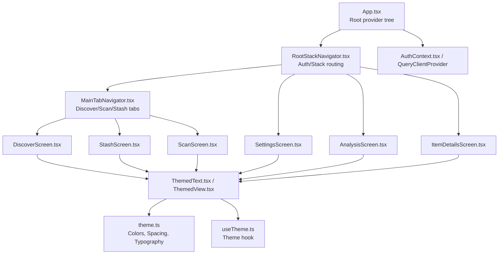
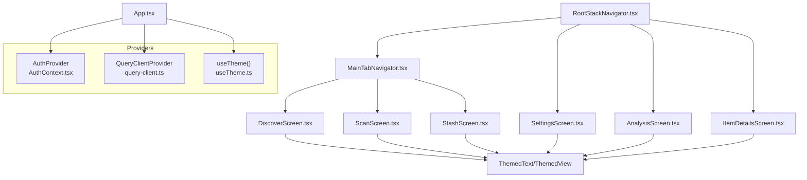
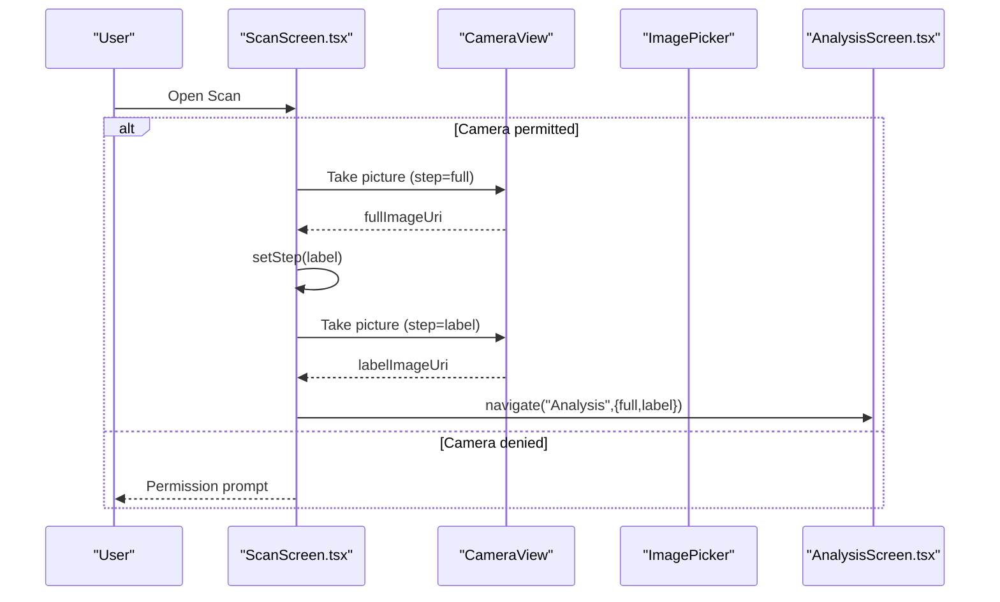
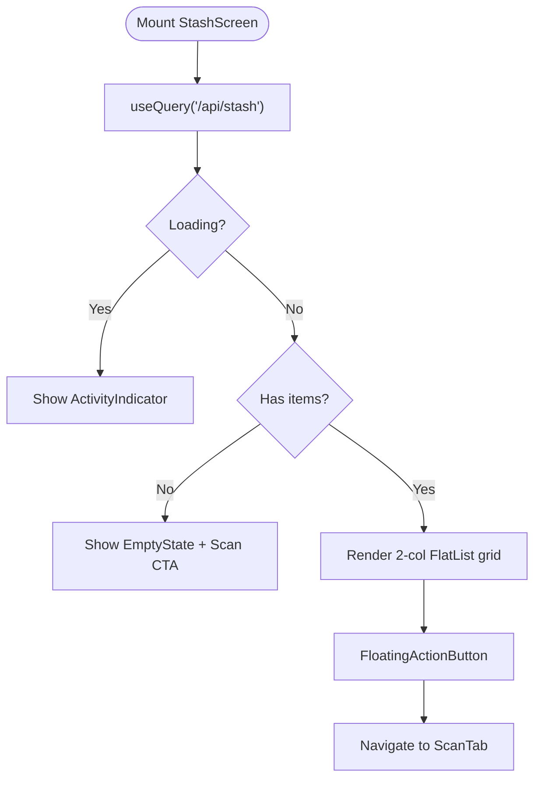
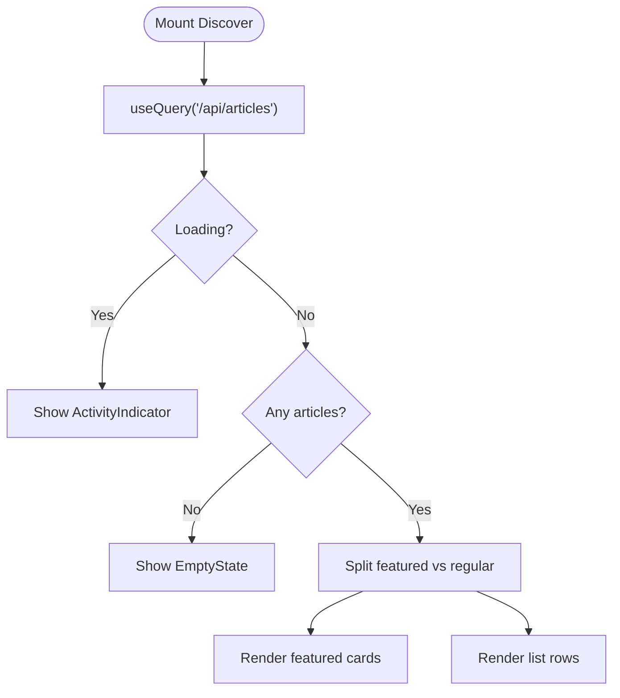
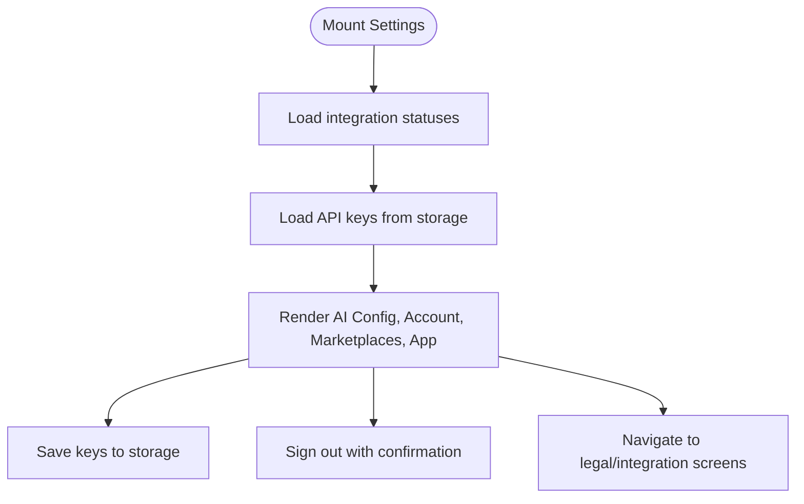
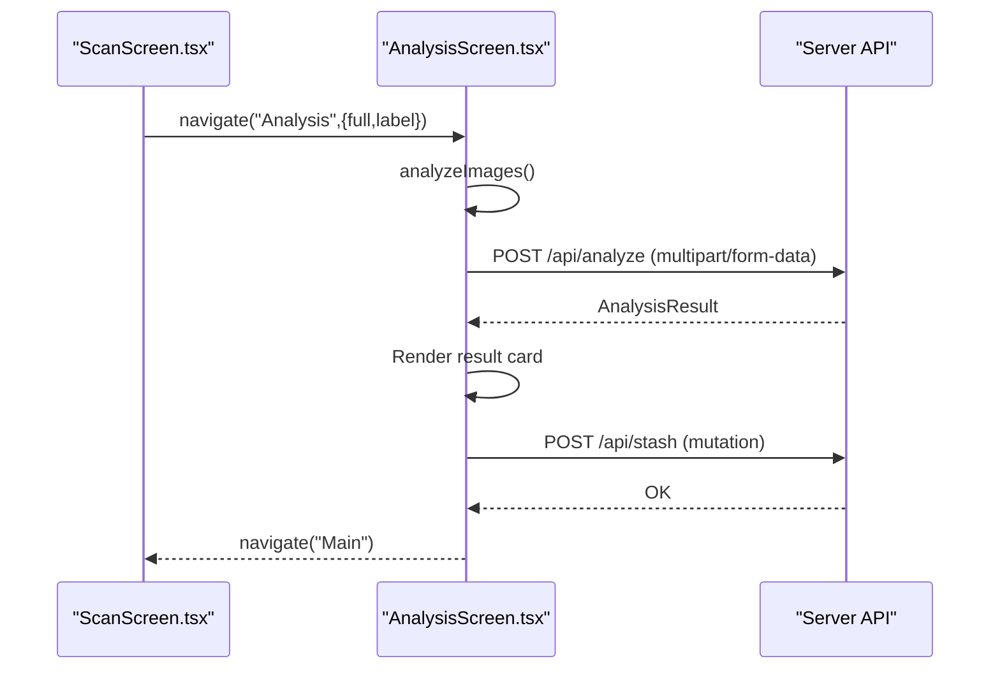
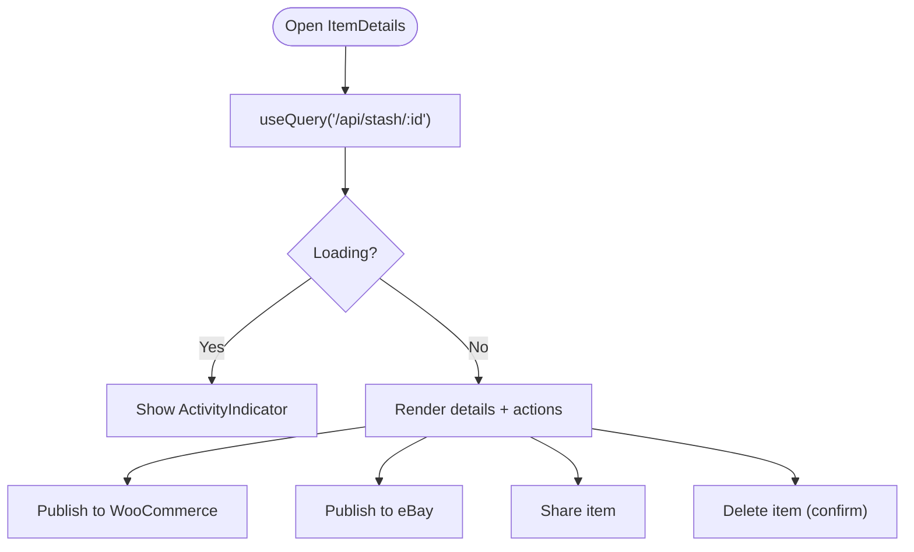
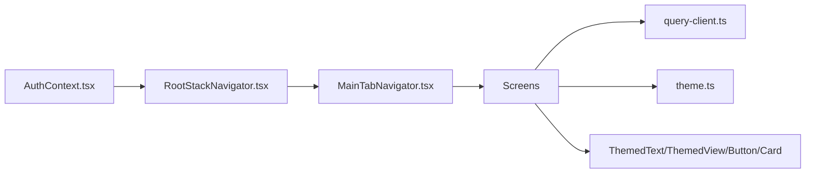

# Core Screens and Components

<cite>
**Referenced Files in This Document**
- [App.tsx](file://client/App.tsx)
- [RootStackNavigator.tsx](file://client/navigation/RootStackNavigator.tsx)
- [MainTabNavigator.tsx](file://client/navigation/MainTabNavigator.tsx)
- [ScanScreen.tsx](file://client/screens/ScanScreen.tsx)
- [StashScreen.tsx](file://client/screens/StashScreen.tsx)
- [DiscoverScreen.tsx](file://client/screens/DiscoverScreen.tsx)
- [SettingsScreen.tsx](file://client/screens/SettingsScreen.tsx)
- [AnalysisScreen.tsx](file://client/screens/AnalysisScreen.tsx)
- [ItemDetailsScreen.tsx](file://client/screens/ItemDetailsScreen.tsx)
- [Button.tsx](file://client/components/Button.tsx)
- [Card.tsx](file://client/components/Card.tsx)
- [ThemedText.tsx](file://client/components/ThemedText.tsx)
- [ThemedView.tsx](file://client/components/ThemedView.tsx)
- [theme.ts](file://client/constants/theme.ts)
- [AuthContext.tsx](file://client/contexts/AuthContext.tsx)
- [useTheme.ts](file://client/hooks/useTheme.ts)
- [query-client.ts](file://client/lib/query-client.ts)
</cite>

## Table of Contents
1. [Introduction](#introduction)
2. [Project Structure](#project-structure)
3. [Core Components](#core-components)
4. [Architecture Overview](#architecture-overview)
5. [Detailed Component Analysis](#detailed-component-analysis)
6. [Dependency Analysis](#dependency-analysis)
7. [Performance Considerations](#performance-considerations)
8. [Troubleshooting Guide](#troubleshooting-guide)
9. [Conclusion](#conclusion)

## Introduction
This document explains the core screens and reusable UI components that define the application’s feature-specific flows and shared design system. It focuses on:
- Feature-specific screens: Scan, Stash, Discover, Settings, Analysis, and Item Details
- Reusable components: Button, Card, ThemedText, and ThemedView
- Navigation integration, data binding via TanStack Query, and component composition
- Responsive design, accessibility, and cross-platform compatibility
- Practical usage patterns and state management integration

## Project Structure
The application is structured around a navigation-driven architecture with a dark-themed design system. Screens are organized under feature-focused folders, while reusable UI components live in a dedicated components directory. Theme constants and context hooks centralize design tokens and theme-aware rendering.

**Diagram sources**
- [App.tsx](file://client/App.tsx#L1-L57)
- [RootStackNavigator.tsx](file://client/navigation/RootStackNavigator.tsx#L1-L124)
- [MainTabNavigator.tsx](file://client/navigation/MainTabNavigator.tsx#L1-L192)
- [DiscoverScreen.tsx](file://client/screens/DiscoverScreen.tsx#L1-L340)
- [ScanScreen.tsx](file://client/screens/ScanScreen.tsx#L1-L394)
- [StashScreen.tsx](file://client/screens/StashScreen.tsx#L1-L290)
- [SettingsScreen.tsx](file://client/screens/SettingsScreen.tsx#L1-L492)
- [AnalysisScreen.tsx](file://client/screens/AnalysisScreen.tsx#L1-L484)
- [ItemDetailsScreen.tsx](file://client/screens/ItemDetailsScreen.tsx#L1-L574)
- [ThemedText.tsx](file://client/components/ThemedText.tsx#L1-L62)
- [ThemedView.tsx](file://client/components/ThemedView.tsx#L1-L27)
- [theme.ts](file://client/constants/theme.ts#L1-L167)
- [useTheme.ts](file://client/hooks/useTheme.ts#L1-L14)
- [AuthContext.tsx](file://client/contexts/AuthContext.tsx#L1-L31)

**Section sources**
- [App.tsx](file://client/App.tsx#L1-L57)
- [RootStackNavigator.tsx](file://client/navigation/RootStackNavigator.tsx#L1-L124)
- [MainTabNavigator.tsx](file://client/navigation/MainTabNavigator.tsx#L1-L192)

## Core Components
Reusable UI components form the foundation of the design system:
- ThemedText: A themed text primitive supporting multiple typographic scales and light/dark overrides
- ThemedView: A themed container for backgrounds and layout primitives
- Button: An animated pressable with spring-based feedback and themed colors
- Card: A themed, animated pressable card with elevation-aware background

These components consume theme tokens from theme.ts and expose a consistent API for props like style, disabled, and content.

**Section sources**
- [ThemedText.tsx](file://client/components/ThemedText.tsx#L1-L62)
- [ThemedView.tsx](file://client/components/ThemedView.tsx#L1-L27)
- [Button.tsx](file://client/components/Button.tsx#L1-L93)
- [Card.tsx](file://client/components/Card.tsx#L1-L115)
- [theme.ts](file://client/constants/theme.ts#L1-L167)
- [useTheme.ts](file://client/hooks/useTheme.ts#L1-L14)

## Architecture Overview
The app initializes providers for navigation, theming, authentication, and data fetching. The RootStackNavigator decides whether to show the Auth screen or the Main tabs. The MainTabNavigator hosts three primary tabs: Discover, Scan, and Stash. Additional screens (Settings, Analysis, Item Details) are presented modally or navigated to from within the stack.

**Diagram sources**
- [App.tsx](file://client/App.tsx#L1-L57)
- [RootStackNavigator.tsx](file://client/navigation/RootStackNavigator.tsx#L1-L124)
- [MainTabNavigator.tsx](file://client/navigation/MainTabNavigator.tsx#L1-L192)
- [AuthContext.tsx](file://client/contexts/AuthContext.tsx#L1-L31)
- [query-client.ts](file://client/lib/query-client.ts#L1-L80)
- [useTheme.ts](file://client/hooks/useTheme.ts#L1-L14)

## Detailed Component Analysis

### Scan Screen
Implements a two-step scanning flow:
- Step “full”: capture the full item
- Step “label”: capture a close-up of the label/tag
- Uses CameraView for live capture and ImagePicker for gallery selection
- Navigates to Analysis with both images after capturing the label

**Diagram sources**
- [ScanScreen.tsx](file://client/screens/ScanScreen.tsx#L1-L394)
- [AnalysisScreen.tsx](file://client/screens/AnalysisScreen.tsx#L1-L484)

**Section sources**
- [ScanScreen.tsx](file://client/screens/ScanScreen.tsx#L1-L394)

### Stash Screen
Displays a grid of stash items, supports pull-to-refresh, and provides a floating action button to scan. Integrates with TanStack Query for data fetching and invalidation.

**Diagram sources**
- [StashScreen.tsx](file://client/screens/StashScreen.tsx#L1-L290)

**Section sources**
- [StashScreen.tsx](file://client/screens/StashScreen.tsx#L1-L290)

### Discover Screen
Lists articles in a mixed layout: featured cards and a list of regular articles. Supports refresh and empty states.

**Diagram sources**
- [DiscoverScreen.tsx](file://client/screens/DiscoverScreen.tsx#L1-L340)

**Section sources**
- [DiscoverScreen.tsx](file://client/screens/DiscoverScreen.tsx#L1-L340)

### Settings Screen
Central hub for configuration:
- AI API keys (Gemini/HuggingFace) with secure storage
- Account header and sign out
- Connected marketplace integrations (WooCommerce/eBay) with status badges
- Navigation to legal screens

**Diagram sources**
- [SettingsScreen.tsx](file://client/screens/SettingsScreen.tsx#L1-L492)

**Section sources**
- [SettingsScreen.tsx](file://client/screens/SettingsScreen.tsx#L1-L492)

### Analysis Screen
Performs AI-powered item analysis by sending two images to the backend and renders a summary card with actions to save or rescan.

**Diagram sources**
- [AnalysisScreen.tsx](file://client/screens/AnalysisScreen.tsx#L1-L484)
- [ScanScreen.tsx](file://client/screens/ScanScreen.tsx#L1-L394)

**Section sources**
- [AnalysisScreen.tsx](file://client/screens/AnalysisScreen.tsx#L1-L484)

### Item Details Screen
Shows detailed item information, allows sharing, deletion, and publishing to marketplaces. Checks connection status and handles errors gracefully.

**Diagram sources**
- [ItemDetailsScreen.tsx](file://client/screens/ItemDetailsScreen.tsx#L1-L574)

**Section sources**
- [ItemDetailsScreen.tsx](file://client/screens/ItemDetailsScreen.tsx#L1-L574)

### Reusable Components

#### ThemedText
- Props: lightColor, darkColor, type ("h1"..."link"), plus standard Text props
- Behavior: selects color based on current theme and type; applies typography scale

**Section sources**
- [ThemedText.tsx](file://client/components/ThemedText.tsx#L1-L62)
- [theme.ts](file://client/constants/theme.ts#L67-L108)

#### ThemedView
- Props: lightColor, darkColor, plus standard View props
- Behavior: sets background based on theme mode and overrides

**Section sources**
- [ThemedView.tsx](file://client/components/ThemedView.tsx#L1-L27)
- [theme.ts](file://client/constants/theme.ts#L3-L40)

#### Button
- Props: onPress, children, style, disabled
- Behavior: animated press feedback with spring scaling; themed background/text colors

**Section sources**
- [Button.tsx](file://client/components/Button.tsx#L1-L93)
- [useTheme.ts](file://client/hooks/useTheme.ts#L1-L14)
- [theme.ts](file://client/constants/theme.ts#L3-L40)

#### Card
- Props: elevation (1..3), title, description, children, onPress, style
- Behavior: animated press feedback; background color mapped to elevation level

**Section sources**
- [Card.tsx](file://client/components/Card.tsx#L1-L115)
- [useTheme.ts](file://client/hooks/useTheme.ts#L1-L14)
- [theme.ts](file://client/constants/theme.ts#L3-L40)

## Dependency Analysis
The screens depend on:
- Navigation: Root and Tab navigators orchestrate routing and deep links
- Authentication: AuthContext determines whether to show Auth or Main
- Data: TanStack Query for caching, invalidation, and optimistic updates
- Theming: theme.ts and useTheme.ts unify design tokens and theme-aware rendering
- UI primitives: ThemedText/ThemedView/Button/Card compose consistently across screens

**Diagram sources**
- [AuthContext.tsx](file://client/contexts/AuthContext.tsx#L1-L31)
- [RootStackNavigator.tsx](file://client/navigation/RootStackNavigator.tsx#L1-L124)
- [MainTabNavigator.tsx](file://client/navigation/MainTabNavigator.tsx#L1-L192)
- [query-client.ts](file://client/lib/query-client.ts#L1-L80)
- [theme.ts](file://client/constants/theme.ts#L1-L167)
- [ThemedText.tsx](file://client/components/ThemedText.tsx#L1-L62)
- [ThemedView.tsx](file://client/components/ThemedView.tsx#L1-L27)
- [Button.tsx](file://client/components/Button.tsx#L1-L93)
- [Card.tsx](file://client/components/Card.tsx#L1-L115)

**Section sources**
- [RootStackNavigator.tsx](file://client/navigation/RootStackNavigator.tsx#L1-L124)
- [MainTabNavigator.tsx](file://client/navigation/MainTabNavigator.tsx#L1-L192)
- [AuthContext.tsx](file://client/contexts/AuthContext.tsx#L1-L31)
- [query-client.ts](file://client/lib/query-client.ts#L1-L80)
- [theme.ts](file://client/constants/theme.ts#L1-L167)

## Performance Considerations
- Lazy navigation: Root navigator conditionally renders Auth or Main to avoid unnecessary initialization
- FlatList grids: Efficient virtualized rendering with column wrappers for Stash and Discover
- Query caching: Infinite staleTime and manual invalidation minimize redundant network calls
- Animated primitives: Reanimated springs provide smooth feedback without layout thrashing
- Safe area and tab bar awareness: Dynamic paddings prevent content overlap on various devices

[No sources needed since this section provides general guidance]

## Troubleshooting Guide
Common issues and resolutions:
- Camera permission denied: Prompt user to grant permission; fallback UI shown until granted
- Network errors: Queries throw on non-OK responses; use error boundaries and alerts
- API key persistence: Keys stored via AsyncStorage; ensure environment variable EXPO_PUBLIC_DOMAIN is set
- Publishing failures: Marketplaces require prior connection; check status and guide users to settings

**Section sources**
- [ScanScreen.tsx](file://client/screens/ScanScreen.tsx#L99-L132)
- [query-client.ts](file://client/lib/query-client.ts#L19-L43)
- [SettingsScreen.tsx](file://client/screens/SettingsScreen.tsx#L115-L144)
- [ItemDetailsScreen.tsx](file://client/screens/ItemDetailsScreen.tsx#L105-L197)

## Conclusion
The application’s architecture centers on a cohesive design system and predictable navigation flow. Feature screens leverage shared components and state management to deliver responsive, accessible experiences across platforms. The modular structure enables easy extension and maintenance, while theme and query abstractions keep styling and data logic consistent.