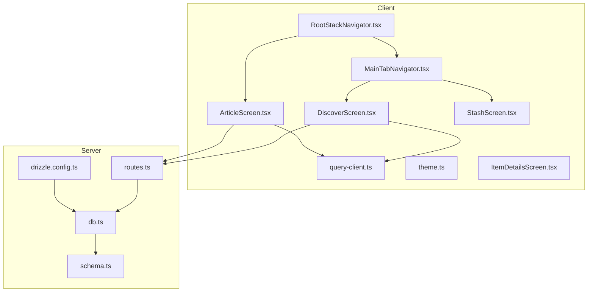
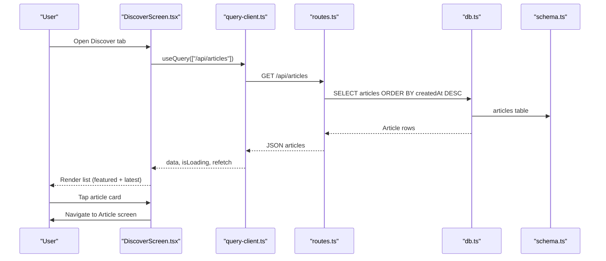
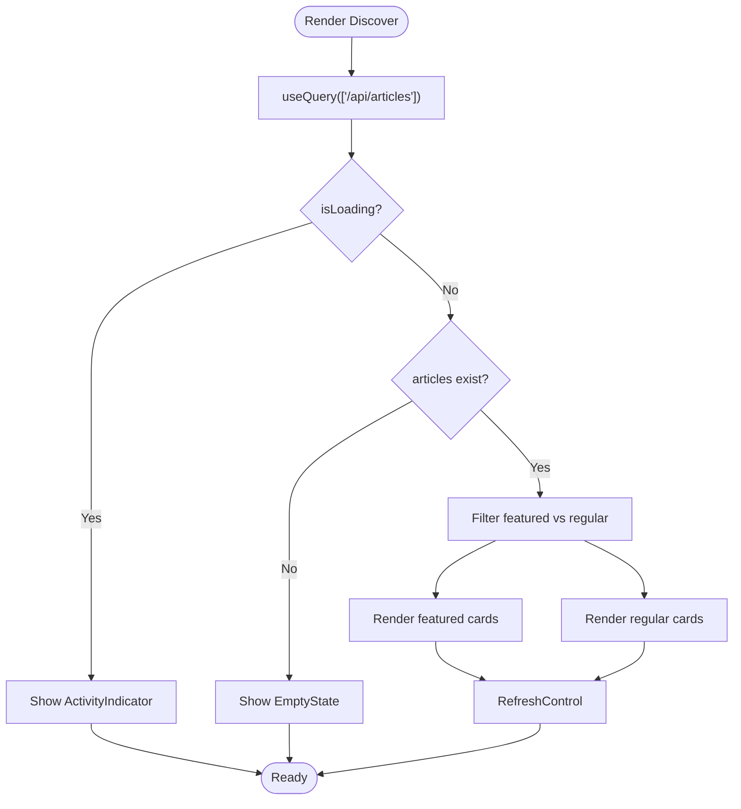
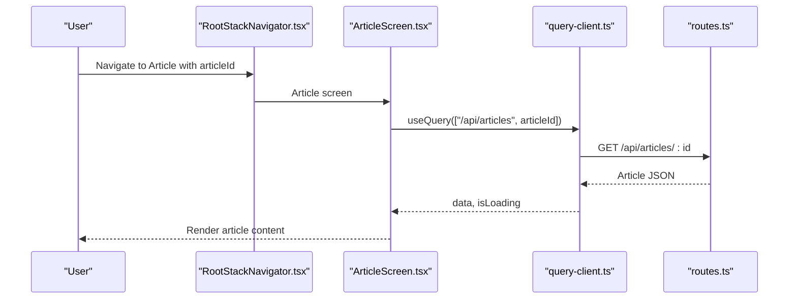
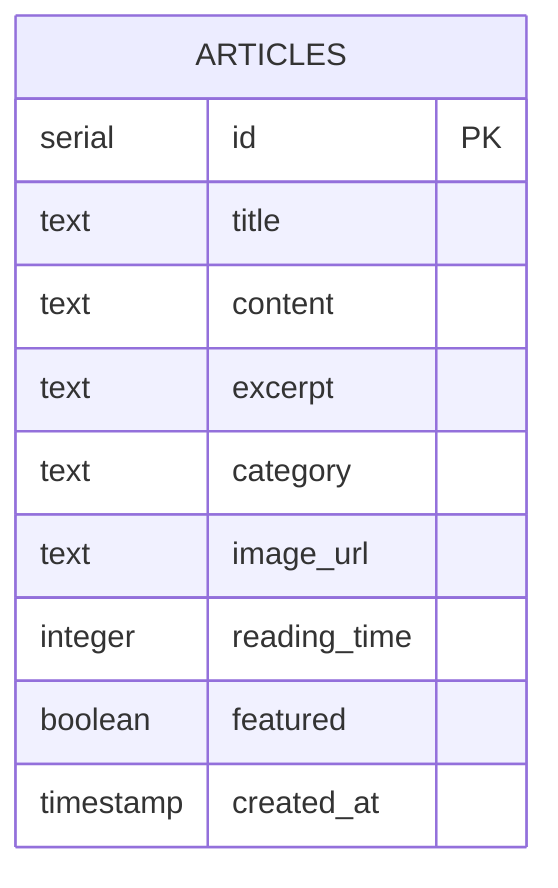
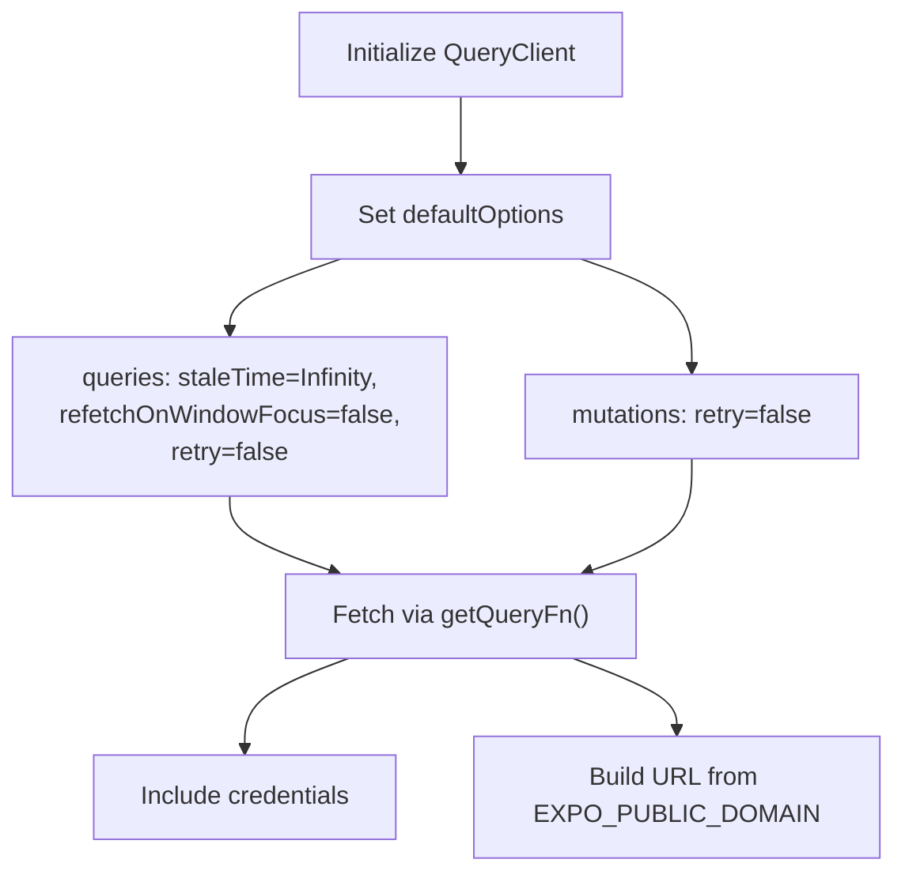
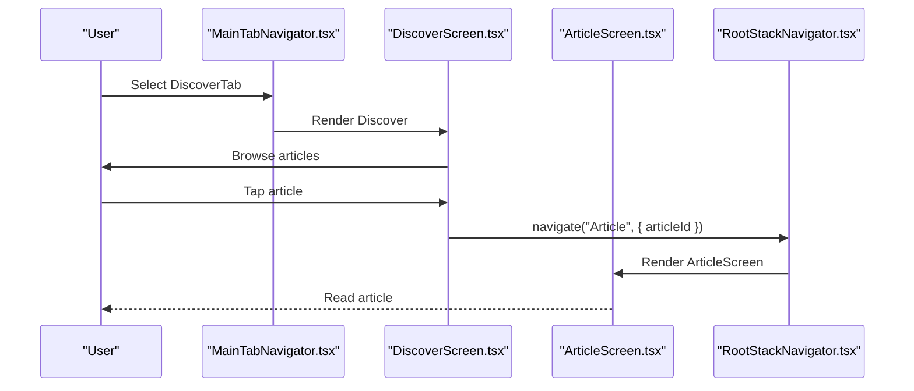
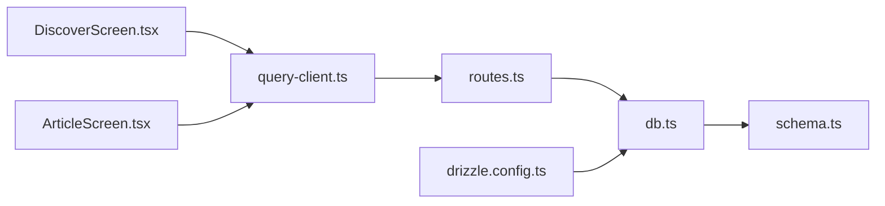

# Discover and Content

<cite>
**Referenced Files in This Document**
- [DiscoverScreen.tsx](file://client/screens/DiscoverScreen.tsx)
- [ArticleScreen.tsx](file://client/screens/ArticleScreen.tsx)
- [MainTabNavigator.tsx](file://client/navigation/MainTabNavigator.tsx)
- [RootStackNavigator.tsx](file://client/navigation/RootStackNavigator.tsx)
- [query-client.ts](file://client/lib/query-client.ts)
- [theme.ts](file://client/constants/theme.ts)
- [routes.ts](file://server/routes.ts)
- [schema.ts](file://shared/schema.ts)
- [db.ts](file://server/db.ts)
- [drizzle.config.ts](file://drizzle.config.ts)
- [StashScreen.tsx](file://client/screens/StashScreen.tsx)
- [ItemDetailsScreen.tsx](file://client/screens/ItemDetailsScreen.tsx)
- [SettingsScreen.tsx](file://client/screens/SettingsScreen.tsx)
</cite>

## Table of Contents
1. [Introduction](#introduction)
2. [Project Structure](#project-structure)
3. [Core Components](#core-components)
4. [Architecture Overview](#architecture-overview)
5. [Detailed Component Analysis](#detailed-component-analysis)
6. [Dependency Analysis](#dependency-analysis)
7. [Performance Considerations](#performance-considerations)
8. [Troubleshooting Guide](#troubleshooting-guide)
9. [Conclusion](#conclusion)

## Introduction
This document explains the discover and content management system for educational resources and article consumption. It covers the discover screen for browsing articles, article previews, and user engagement affordances; the article screen for detailed reading; content API integration; article data models; caching and query strategies; and user preferences. It also outlines content categorization, search functionality, bookmarking, and social sharing capabilities, with examples of content rendering, user progress tracking, and integration with the overall user experience flow.

## Project Structure
The system comprises:
- Client-side screens for Discover and Article reading
- Navigation stack integrating tabs and nested navigators
- Query client and theme constants
- Server-side API routes for articles and stash
- Shared schema defining data models
- Database configuration via Drizzle ORM

**Diagram sources**
- [DiscoverScreen.tsx](file://client/screens/DiscoverScreen.tsx#L88-L175)
- [ArticleScreen.tsx](file://client/screens/ArticleScreen.tsx#L26-L91)
- [MainTabNavigator.tsx](file://client/navigation/MainTabNavigator.tsx#L64-L144)
- [RootStackNavigator.tsx](file://client/navigation/RootStackNavigator.tsx#L32-L122)
- [query-client.ts](file://client/lib/query-client.ts#L66-L80)
- [routes.ts](file://server/routes.ts#L24-L55)
- [db.ts](file://server/db.ts#L11-L18)
- [schema.ts](file://shared/schema.ts#L52-L62)
- [drizzle.config.ts](file://drizzle.config.ts#L7-L14)

**Section sources**
- [DiscoverScreen.tsx](file://client/screens/DiscoverScreen.tsx#L1-L175)
- [ArticleScreen.tsx](file://client/screens/ArticleScreen.tsx#L1-L91)
- [MainTabNavigator.tsx](file://client/navigation/MainTabNavigator.tsx#L1-L144)
- [RootStackNavigator.tsx](file://client/navigation/RootStackNavigator.tsx#L1-L122)
- [query-client.ts](file://client/lib/query-client.ts#L1-L80)
- [routes.ts](file://server/routes.ts#L24-L55)
- [schema.ts](file://shared/schema.ts#L52-L62)
- [db.ts](file://server/db.ts#L1-L18)
- [drizzle.config.ts](file://drizzle.config.ts#L1-L14)

## Core Components
- Discover Screen: Lists articles, separates featured and regular items, supports pull-to-refresh, and navigates to the article detail screen.
- Article Screen: Loads and renders article content with metadata and hero placeholder.
- Navigation: Tabs integrate Discover, Scan, and Stash; nested stack manages Auth, Settings, and Article detail.
- Query Client: Centralized API requests and caching behavior via React Query.
- Server Routes: Articles endpoints for listing and fetching individual articles; stash endpoints for inventory management.
- Schema: Defines article and stash item models with fields for categorization, reading time, and publishing flags.

**Section sources**
- [DiscoverScreen.tsx](file://client/screens/DiscoverScreen.tsx#L88-L175)
- [ArticleScreen.tsx](file://client/screens/ArticleScreen.tsx#L26-L91)
- [MainTabNavigator.tsx](file://client/navigation/MainTabNavigator.tsx#L64-L144)
- [RootStackNavigator.tsx](file://client/navigation/RootStackNavigator.tsx#L32-L122)
- [query-client.ts](file://client/lib/query-client.ts#L46-L80)
- [routes.ts](file://server/routes.ts#L24-L55)
- [schema.ts](file://shared/schema.ts#L52-L62)

## Architecture Overview
The discover and content system integrates client-side screens with server-side APIs and a PostgreSQL database via Drizzle ORM. React Query handles data fetching and caching, while navigation orchestrates user flows across screens.

**Diagram sources**
- [DiscoverScreen.tsx](file://client/screens/DiscoverScreen.tsx#L93-L102)
- [query-client.ts](file://client/lib/query-client.ts#L46-L64)
- [routes.ts](file://server/routes.ts#L24-L36)
- [db.ts](file://server/db.ts#L11-L18)
- [schema.ts](file://shared/schema.ts#L52-L62)

## Detailed Component Analysis

### Discover Screen Implementation
The Discover screen fetches articles, separates featured and regular items, and renders them in a flat list. It supports:
- Featured article cards with overlay badges and reading time
- Regular article cards with category badges and compact layout
- Pull-to-refresh via RefreshControl
- Empty state handling
- Navigation to the Article screen on selection

**Diagram sources**
- [DiscoverScreen.tsx](file://client/screens/DiscoverScreen.tsx#L88-L175)

**Section sources**
- [DiscoverScreen.tsx](file://client/screens/DiscoverScreen.tsx#L88-L175)

### Article Screen for Detailed Content Reading
The Article screen loads a single article by ID and renders:
- Category badge and title
- Reading time metadata
- Hero image placeholder
- Content text area

**Diagram sources**
- [RootStackNavigator.tsx](file://client/navigation/RootStackNavigator.tsx#L84-L90)
- [ArticleScreen.tsx](file://client/screens/ArticleScreen.tsx#L26-L91)
- [query-client.ts](file://client/lib/query-client.ts#L46-L64)
- [routes.ts](file://server/routes.ts#L38-L55)

**Section sources**
- [ArticleScreen.tsx](file://client/screens/ArticleScreen.tsx#L26-L91)
- [RootStackNavigator.tsx](file://client/navigation/RootStackNavigator.tsx#L84-L90)

### Content API Integration and Data Models
- Client query keys: ["/api/articles"] and ["/api/articles", articleId]
- Server endpoints:
  - GET /api/articles → returns all articles ordered by creation date
  - GET /api/articles/:id → returns a single article or 404
- Data models:
  - Article: id, title, content, excerpt, category, imageUrl, readingTime, featured, createdAt
  - StashItem: used for inventory and publishing integrations (not covered in Discover/Article screens)

**Diagram sources**
- [schema.ts](file://shared/schema.ts#L52-L62)
- [routes.ts](file://server/routes.ts#L24-L55)

**Section sources**
- [query-client.ts](file://client/lib/query-client.ts#L46-L64)
- [routes.ts](file://server/routes.ts#L24-L55)
- [schema.ts](file://shared/schema.ts#L52-L62)

### Caching Strategies and User Preferences
- React Query default behavior:
  - staleTime: Infinity
  - refetchOnWindowFocus: false
  - refetchInterval: false
  - retry: false
- Credentials included in requests: credentials: "include"
- Environment-driven base URL via EXPO_PUBLIC_DOMAIN

**Diagram sources**
- [query-client.ts](file://client/lib/query-client.ts#L66-L80)

**Section sources**
- [query-client.ts](file://client/lib/query-client.ts#L66-L80)

### Content Categorization, Search, and Bookmarking
- Categorization:
  - Articles include category and optional excerpt fields for discovery grouping.
- Search:
  - No client-side search endpoint is exposed in the current routes; search would require adding a new endpoint and UI controls.
- Bookmarking:
  - No bookmarking feature exists in the current screens; adding a bookmark flag to the Article model and a user preference table would enable persistence.

**Section sources**
- [schema.ts](file://shared/schema.ts#L52-L62)
- [routes.ts](file://server/routes.ts#L24-L55)

### Social Sharing Capabilities
- Stash item details support sharing via the platform’s Share API, including title, description, and estimated value.
- Article screen does not currently expose a share action; adding a share button aligned with platform guidelines would improve engagement.

**Section sources**
- [ItemDetailsScreen.tsx](file://client/screens/ItemDetailsScreen.tsx#L83-L92)

### User Progress Tracking and Experience Flow
- Discover screen integrates with the main tab navigator and exposes a “Must-Reads” section and “Latest” grouping.
- The tab bar displays a scan count badge fetched via a separate endpoint, reinforcing user progress awareness.
- Navigation stack manages transitions between Auth, Main tabs, Settings, and Article detail.

**Diagram sources**
- [MainTabNavigator.tsx](file://client/navigation/MainTabNavigator.tsx#L64-L144)
- [DiscoverScreen.tsx](file://client/screens/DiscoverScreen.tsx#L100-L102)
- [RootStackNavigator.tsx](file://client/navigation/RootStackNavigator.tsx#L84-L90)

**Section sources**
- [MainTabNavigator.tsx](file://client/navigation/MainTabNavigator.tsx#L64-L144)
- [RootStackNavigator.tsx](file://client/navigation/RootStackNavigator.tsx#L32-L122)

## Dependency Analysis
- Client depends on:
  - React Query for caching and data fetching
  - Navigation for screen orchestration
  - Theme constants for styling
- Server depends on:
  - Drizzle ORM for database operations
  - PostgreSQL via connection pool
  - Shared schema for type safety

**Diagram sources**
- [query-client.ts](file://client/lib/query-client.ts#L46-L64)
- [routes.ts](file://server/routes.ts#L24-L55)
- [db.ts](file://server/db.ts#L11-L18)
- [schema.ts](file://shared/schema.ts#L52-L62)
- [drizzle.config.ts](file://drizzle.config.ts#L7-L14)

**Section sources**
- [query-client.ts](file://client/lib/query-client.ts#L46-L80)
- [routes.ts](file://server/routes.ts#L24-L55)
- [db.ts](file://server/db.ts#L11-L18)
- [schema.ts](file://shared/schema.ts#L52-L62)
- [drizzle.config.ts](file://drizzle.config.ts#L7-L14)

## Performance Considerations
- Infinite stale time avoids unnecessary refetches but may lead to outdated UI if content updates frequently; consider a short refetch interval or targeted invalidation for breaking news.
- Pull-to-refresh is efficient but can be heavy with large lists; virtualized lists and image placeholders help maintain responsiveness.
- Network errors are surfaced via throwIfResNotOk; ensure robust error boundaries and user feedback.

[No sources needed since this section provides general guidance]

## Troubleshooting Guide
- Missing domain environment variable:
  - The API base URL requires EXPO_PUBLIC_DOMAIN; if unset, an error is thrown during URL construction.
- API errors:
  - Non-OK responses raise errors with status and text; verify server endpoints and database connectivity.
- Authentication:
  - Requests include credentials; ensure session cookies are present for protected routes.
- Database configuration:
  - DATABASE_URL must be set; otherwise, the pool initialization fails.

**Section sources**
- [query-client.ts](file://client/lib/query-client.ts#L7-L17)
- [query-client.ts](file://client/lib/query-client.ts#L19-L24)
- [db.ts](file://server/db.ts#L7-L9)

## Conclusion
The discover and content system provides a clean, efficient foundation for browsing and reading articles with strong separation of concerns between client and server. The current implementation focuses on listing, filtering, and reading experiences, with clear extension points for search, bookmarking, and social sharing. The schema and server routes support future enhancements such as user preferences, progress tracking, and richer engagement features.