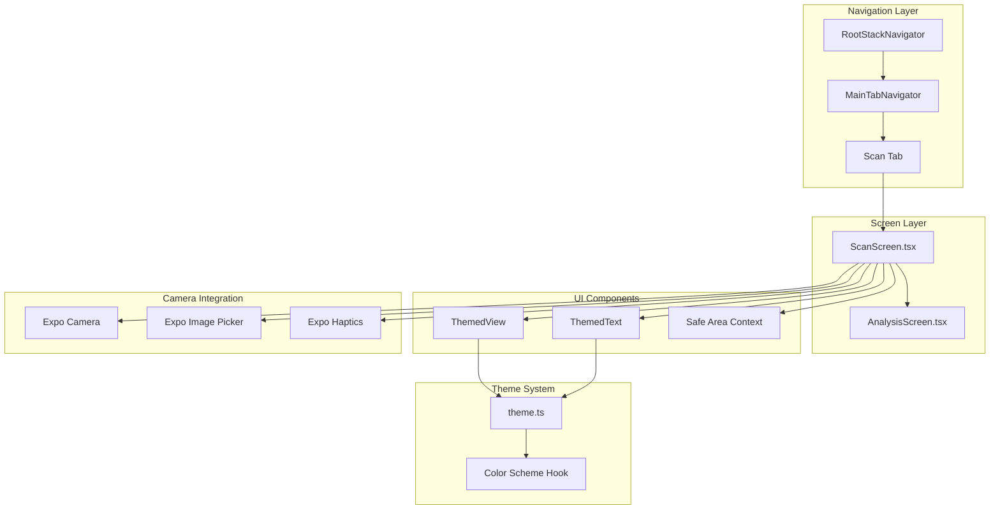
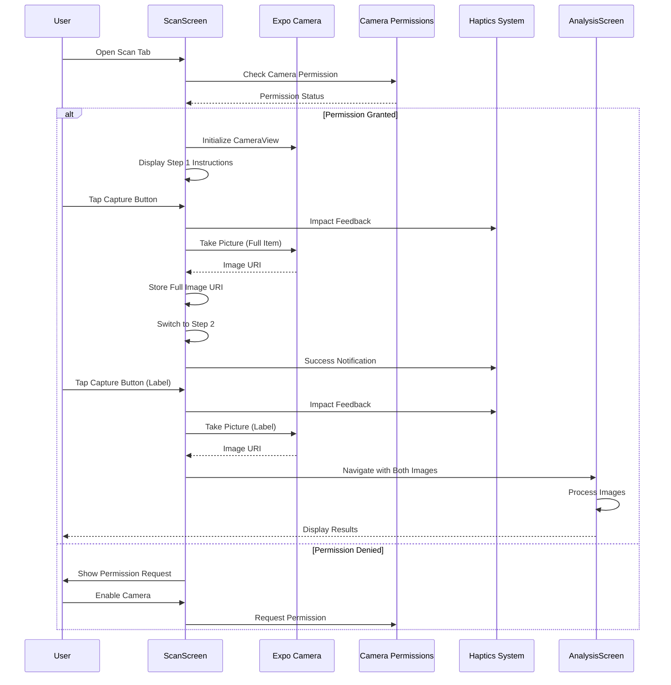
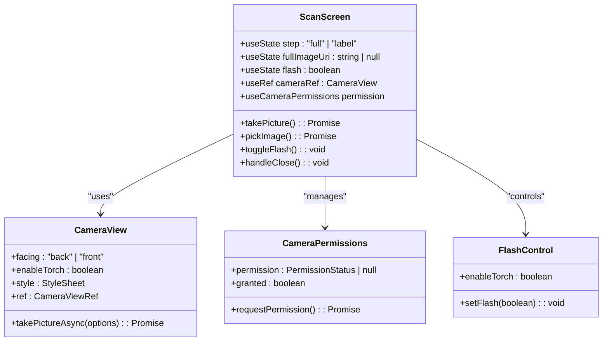
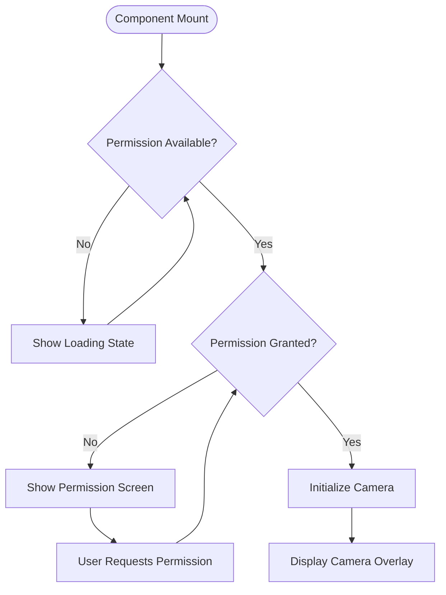

# Scan Screen

<cite>
**Referenced Files in This Document**
- [ScanScreen.tsx](file://client/screens/ScanScreen.tsx)
- [AnalysisScreen.tsx](file://client/screens/AnalysisScreen.tsx)
- [RootStackNavigator.tsx](file://client/navigation/RootStackNavigator.tsx)
- [theme.ts](file://client/constants/theme.ts)
- [ThemedText.tsx](file://client/components/ThemedText.tsx)
- [ThemedView.tsx](file://client/components/ThemedView.tsx)
- [app.json](file://app.json)
- [design_guidelines.md](file://design_guidelines.md)
</cite>

## Table of Contents
1. [Introduction](#introduction)
2. [Project Structure](#project-structure)
3. [Core Components](#core-components)
4. [Architecture Overview](#architecture-overview)
5. [Detailed Component Analysis](#detailed-component-analysis)
6. [Dependency Analysis](#dependency-analysis)
7. [Performance Considerations](#performance-considerations)
8. [Troubleshooting Guide](#troubleshooting-guide)
9. [Conclusion](#conclusion)

## Introduction

The Scan Screen is a sophisticated two-step image capture workflow designed for item scanning and analysis. This component implements a dual-image capture process where users first capture a full-item photo and then a close-up label photo. The implementation integrates seamlessly with Expo Camera for live camera capture, Expo Image Picker for gallery selection, and provides comprehensive haptic feedback integration for enhanced user experience.

The component follows a structured approach to camera permissions, implements responsive design with safe area handling, and provides cross-platform compatibility across iOS, Android, and web platforms. The dual-image capture workflow ensures optimal AI analysis results by providing both contextual and detailed information about scanned items.

## Project Structure

The Scan Screen is part of the client-side navigation stack and integrates with several key architectural components:



**Diagram sources**
- [ScanScreen.tsx](file://client/screens/ScanScreen.tsx#L1-L394)
- [RootStackNavigator.tsx](file://client/navigation/RootStackNavigator.tsx#L1-L124)
- [theme.ts](file://client/constants/theme.ts#L1-L166)

**Section sources**
- [ScanScreen.tsx](file://client/screens/ScanScreen.tsx#L1-L394)
- [RootStackNavigator.tsx](file://client/navigation/RootStackNavigator.tsx#L1-L124)

## Core Components

The Scan Screen implements several core components that work together to provide a seamless scanning experience:

### Camera Integration Component
The component uses Expo Camera's `CameraView` for live camera capture with torch support and configurable facing direction.

### Permission Management System
Built-in camera permission handling with user-friendly permission request interface and fallback handling.

### Dual-Step Capture Workflow
Implements a state machine with "full" and "label" steps, managing image capture progression and user feedback.

### UI Overlay System
Comprehensive overlay system with step indicators, instruction cards, and control buttons positioned using safe area insets.

### Haptic Feedback Integration
Multi-level haptic feedback system providing tactile responses for capture, success, and error states.

**Section sources**
- [ScanScreen.tsx](file://client/screens/ScanScreen.tsx#L17-L97)
- [theme.ts](file://client/constants/theme.ts#L22-L39)

## Architecture Overview

The Scan Screen follows a modular architecture with clear separation of concerns:



**Diagram sources**
- [ScanScreen.tsx](file://client/screens/ScanScreen.tsx#L26-L87)
- [AnalysisScreen.tsx](file://client/screens/AnalysisScreen.tsx#L62-L112)

## Detailed Component Analysis

### Camera View Configuration

The camera implementation utilizes Expo Camera's modern CameraView component with specific configuration parameters:



**Diagram sources**
- [ScanScreen.tsx](file://client/screens/ScanScreen.tsx#L17-L97)

The camera configuration includes:
- **Facing Direction**: Back camera for optimal item scanning
- **Torch Control**: Dynamic flash toggle with visual feedback
- **Quality Settings**: 80% quality for balanced file size and clarity
- **Base64 Disabled**: Optimized for performance and reduced memory usage

### Dual-Image Capture Workflow

The implementation manages a sophisticated two-step capture process:

#### Step 1: Full Item Capture
- **Instruction**: "Snap Full Item" with guidance to capture entire item
- **Preview**: Thumbnail display of captured full item
- **Validation**: Ensures image capture success before proceeding

#### Step 2: Label Close-Up Capture
- **Instruction**: "Snap Label Close-Up" for detailed text identification
- **Progression**: Automatic navigation to analysis upon successful capture
- **State Management**: Reset to initial state after completion

### Permission Handling System

The component implements robust camera permission management:



**Diagram sources**
- [ScanScreen.tsx](file://client/screens/ScanScreen.tsx#L99-L132)

The permission system handles:
- **Loading States**: Graceful handling while permissions initialize
- **User Guidance**: Clear instructions for enabling camera access
- **Platform Differences**: Different handling for web vs native platforms
- **Permission Requests**: Direct integration with Expo's permission system

### UI Overlay Components

The overlay system provides comprehensive user interface elements:

#### Top Row Controls
- **Close Button**: X icon for exiting scan session
- **Step Indicator**: Visual progress indication with active state highlighting
- **Help Button**: Contextual assistance access

#### Center Area Preview
- **Thumbnail Display**: Shows captured full item during label capture
- **Success Indicators**: Checkmark overlays for completed steps

#### Bottom Area Controls
- **Instruction Cards**: Step-specific guidance with clear messaging
- **Control Buttons**: Flash toggle, capture button, and gallery access
- **Responsive Layout**: Adapts to different screen sizes and orientations

### Haptic Feedback Integration

The component provides multi-level haptic feedback for enhanced user experience:

#### Capture Feedback
- **Medium Impact**: Occurs before image capture for tactile confirmation
- **Platform Detection**: Excludes haptic feedback on web platform

#### Success Notifications
- **Success Notification**: Positive feedback after successful captures
- **Error Handling**: Error notifications for failed operations

#### Interaction Feedback
- **Button Presses**: Subtle feedback for all interactive elements
- **Scale Animation**: Visual feedback for capture button press

**Section sources**
- [ScanScreen.tsx](file://client/screens/ScanScreen.tsx#L26-L97)
- [theme.ts](file://client/constants/theme.ts#L22-L39)

## Dependency Analysis

The Scan Screen has well-defined dependencies that contribute to its functionality:

```mermaid
graph LR
subgraph "External Dependencies"
ExpoCamera[expo-camera]
ExpoImagePicker[expo-image-picker]
ExpoHaptics[expo-haptics]
ExpoVectorIcons[@expo/vector-icons]
ReactNavigation[@react-navigation/native]
SafeAreaContext[react-native-safe-area-context]
end
subgraph "Internal Dependencies"
ThemedComponents[Themed Components]
ThemeSystem[Theme System]
Navigation[Navigation Stack]
end
ScanScreen --> ExpoCamera
ScanScreen --> ExpoImagePicker
ScanScreen --> ExpoHaptics
ScanScreen --> ExpoVectorIcons
ScanScreen --> ReactNavigation
ScanScreen --> SafeAreaContext
ScanScreen --> ThemedComponents
ScanScreen --> ThemeSystem
ScanScreen --> Navigation
```

**Diagram sources**
- [ScanScreen.tsx](file://client/screens/ScanScreen.tsx#L1-L13)
- [RootStackNavigator.tsx](file://client/navigation/RootStackNavigator.tsx#L1-L15)

### Cross-Platform Compatibility

The implementation ensures compatibility across multiple platforms:

#### Platform-Specific Handling
- **Web Platform**: Excludes haptic feedback and adjusts permission handling
- **iOS/Android**: Full haptic feedback and native camera integration
- **Responsive Design**: Adapts to different screen sizes and orientations

#### Safe Area Integration
- **Top Insets**: Respects device-specific safe areas
- **Bottom Insets**: Handles home indicator areas on modern devices
- **Dynamic Positioning**: Adjusts overlay elements based on device capabilities

**Section sources**
- [ScanScreen.tsx](file://client/screens/ScanScreen.tsx#L18-L21)
- [app.json](file://app.json#L11-L27)

## Performance Considerations

The Scan Screen implements several performance optimizations:

### Memory Management
- **Image Quality**: Balanced 80% quality setting reduces memory footprint
- **Base64 Disabled**: Prevents unnecessary data conversion overhead
- **State Cleanup**: Proper cleanup of image URIs after analysis completion

### Camera Optimization
- **Lazy Initialization**: Camera only initialized when permissions granted
- **Efficient State Updates**: Minimal re-renders through proper state management
- **Resource Cleanup**: Proper camera resource management on component unmount

### User Experience Optimization
- **Immediate Feedback**: Quick haptic responses for user interactions
- **Progressive Enhancement**: Graceful degradation when permissions unavailable
- **Error Recovery**: Comprehensive error handling with user-friendly messages

## Troubleshooting Guide

Common issues and their solutions:

### Camera Permission Issues
**Problem**: Camera permission dialog not appearing
**Solution**: Verify camera permissions in app.json and ensure proper user interaction

**Problem**: Permission denied state persists
**Solution**: Check device settings and request permission again through the component

### Image Capture Failures
**Problem**: Images not capturing properly
**Solution**: Verify camera initialization and check for proper permission grants

**Problem**: Low-quality captured images
**Solution**: Adjust lighting conditions and ensure adequate flash usage

### Navigation Issues
**Problem**: Unable to navigate to Analysis screen
**Solution**: Verify navigation parameters and ensure both image URIs are present

### Haptic Feedback Problems
**Problem**: No haptic feedback on device
**Solution**: Check device haptic settings and platform compatibility

**Section sources**
- [ScanScreen.tsx](file://client/screens/ScanScreen.tsx#L39-L61)
- [AnalysisScreen.tsx](file://client/screens/AnalysisScreen.tsx#L93-L112)

## Conclusion

The Scan Screen component represents a comprehensive solution for dual-image capture workflows in mobile applications. Its implementation demonstrates best practices in camera integration, permission handling, responsive design, and user experience optimization.

Key strengths of the implementation include:
- **Robust Permission Management**: Comprehensive handling of camera permissions across platforms
- **Intuitive User Interface**: Clear step-by-step guidance with visual feedback
- **Cross-Platform Compatibility**: Seamless operation across iOS, Android, and web platforms
- **Performance Optimization**: Efficient resource management and memory usage
- **Enhanced User Experience**: Multi-level haptic feedback and responsive interactions

The component serves as an excellent foundation for AI-powered item analysis applications, providing a solid architectural base for future enhancements and feature additions. The modular design allows for easy extension while maintaining code clarity and maintainability.