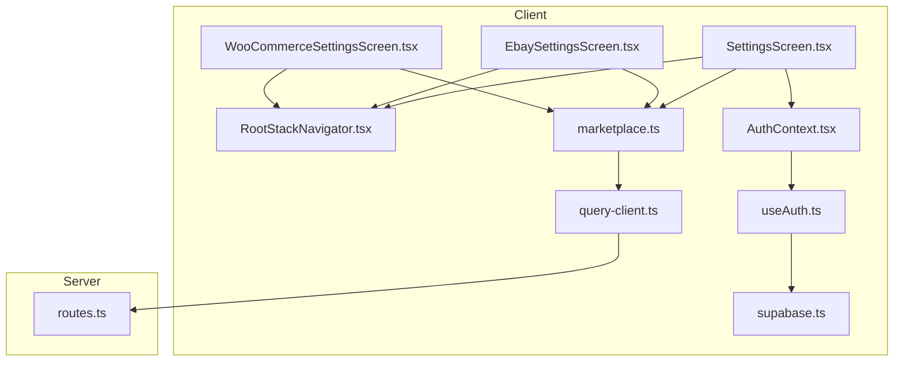
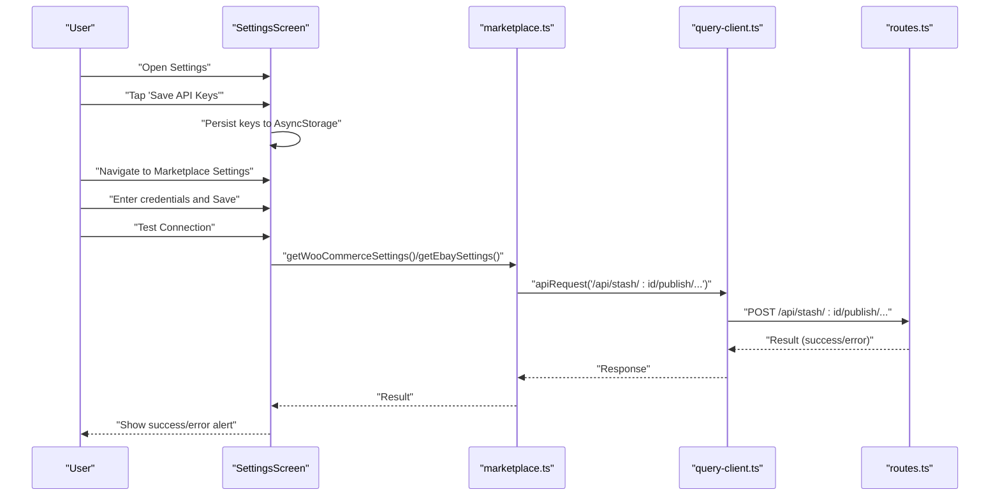
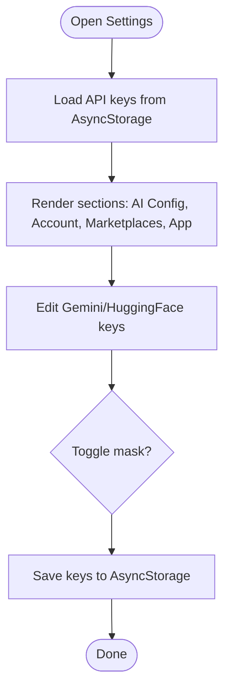
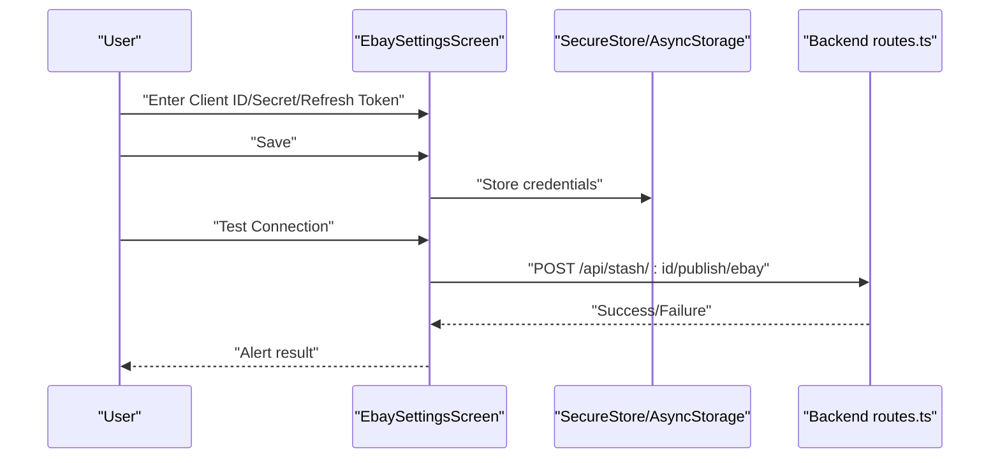
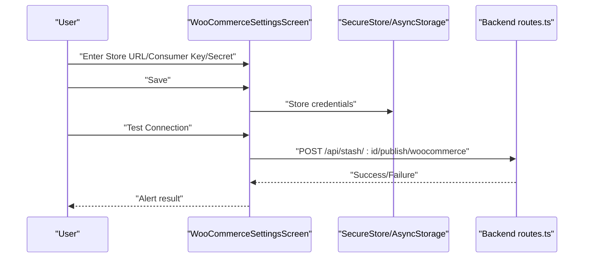
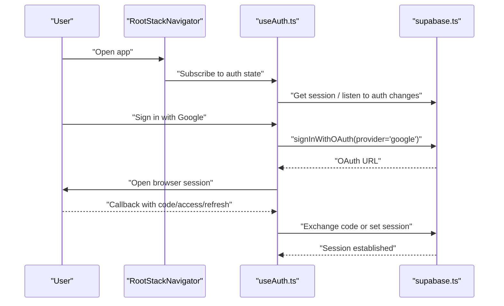
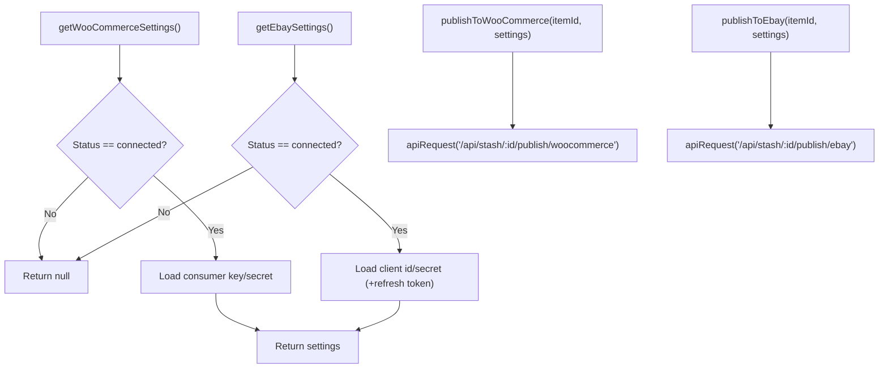
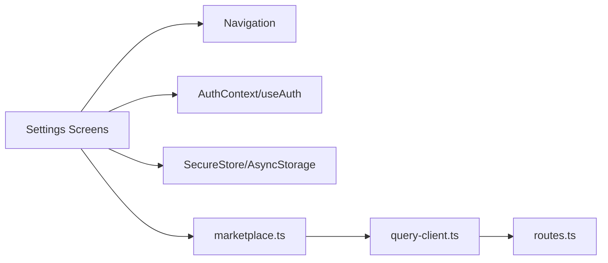

# Settings and Configuration

<cite>
**Referenced Files in This Document**
- [SettingsScreen.tsx](file://client/screens/SettingsScreen.tsx)
- [EbaySettingsScreen.tsx](file://client/screens/EbaySettingsScreen.tsx)
- [WooCommerceSettingsScreen.tsx](file://client/screens/WooCommerceSettingsScreen.tsx)
- [marketplace.ts](file://client/lib/marketplace.ts)
- [RootStackNavigator.tsx](file://client/navigation/RootStackNavigator.tsx)
- [AuthContext.tsx](file://client/contexts/AuthContext.tsx)
- [useAuth.ts](file://client/hooks/useAuth.ts)
- [supabase.ts](file://client/lib/supabase.ts)
- [query-client.ts](file://client/lib/query-client.ts)
- [routes.ts](file://server/routes.ts)
- [settings_flow.yml](file://.maestro/settings_flow.yml)
- [ebay_settings_flow.yml](file://.maestro/ebay_settings_flow.yml)
- [woocommerce_settings_flow.yml](file://.maestro/woocommerce_settings_flow.yml)
- [package.json](file://package.json)
</cite>

## Table of Contents
1. [Introduction](#introduction)
2. [Project Structure](#project-structure)
3. [Core Components](#core-components)
4. [Architecture Overview](#architecture-overview)
5. [Detailed Component Analysis](#detailed-component-analysis)
6. [Dependency Analysis](#dependency-analysis)
7. [Performance Considerations](#performance-considerations)
8. [Troubleshooting Guide](#troubleshooting-guide)
9. [Conclusion](#conclusion)

## Introduction
This document explains the settings and configuration system for user preferences, API key management, and marketplace integrations. It covers:
- The main settings screen with account management, notification preferences, and application configuration
- Marketplace-specific settings screens for eBay and WooCommerce, including OAuth flows, credential management, and API key configuration
- Authentication settings, security configurations, and user data management
- Marketplace-specific workflows, credential validation, and integration status monitoring
- Examples of settings data models, form validation, and integration with external services

## Project Structure
The settings system spans the client UI, navigation, authentication, and backend APIs:
- Settings screens live under client/screens
- Navigation is defined in client/navigation
- Authentication and session management are handled via Supabase in client/lib and client/hooks
- Marketplace integration utilities live in client/lib
- Backend endpoints for publishing to marketplaces are in server/routes.ts

**Diagram sources**
- [SettingsScreen.tsx](file://client/screens/SettingsScreen.tsx#L76-L284)
- [EbaySettingsScreen.tsx](file://client/screens/EbaySettingsScreen.tsx#L27-L370)
- [WooCommerceSettingsScreen.tsx](file://client/screens/WooCommerceSettingsScreen.tsx#L26-L340)
- [RootStackNavigator.tsx](file://client/navigation/RootStackNavigator.tsx#L32-L123)
- [AuthContext.tsx](file://client/contexts/AuthContext.tsx#L1-L31)
- [useAuth.ts](file://client/hooks/useAuth.ts#L12-L151)
- [supabase.ts](file://client/lib/supabase.ts#L1-L39)
- [marketplace.ts](file://client/lib/marketplace.ts#L1-L129)
- [query-client.ts](file://client/lib/query-client.ts#L1-L80)
- [routes.ts](file://server/routes.ts#L228-L488)

**Section sources**
- [SettingsScreen.tsx](file://client/screens/SettingsScreen.tsx#L1-L492)
- [RootStackNavigator.tsx](file://client/navigation/RootStackNavigator.tsx#L1-L124)

## Core Components
- SettingsScreen: Central hub for user preferences, API keys, account info, and marketplace connections
- eBay Settings Screen: Environment selection, credentials, optional refresh token, connection testing, and disconnection
- WooCommerce Settings Screen: Store URL, consumer key/secret, connection testing, and disconnection
- Auth and Navigation: Supabase-based authentication, OAuth flows, and routing to settings screens
- Marketplace Utilities: Loading stored credentials and publishing endpoints
- Backend Routes: Validation, token exchange, and marketplace publishing

**Section sources**
- [SettingsScreen.tsx](file://client/screens/SettingsScreen.tsx#L76-L284)
- [EbaySettingsScreen.tsx](file://client/screens/EbaySettingsScreen.tsx#L27-L370)
- [WooCommerceSettingsScreen.tsx](file://client/screens/WooCommerceSettingsScreen.tsx#L26-L340)
- [marketplace.ts](file://client/lib/marketplace.ts#L1-L129)
- [routes.ts](file://server/routes.ts#L228-L488)

## Architecture Overview
The settings system integrates UI, local storage, secure storage, and backend APIs:
- UI captures user inputs and displays statuses
- Local storage persists non-sensitive state (e.g., environment flags)
- Secure storage stores sensitive credentials (per platform)
- Frontend utilities call backend endpoints to validate and publish
- Backend validates inputs, exchanges tokens, and interacts with marketplace APIs

**Diagram sources**
- [SettingsScreen.tsx](file://client/screens/SettingsScreen.tsx#L119-L144)
- [EbaySettingsScreen.tsx](file://client/screens/EbaySettingsScreen.tsx#L112-L150)
- [WooCommerceSettingsScreen.tsx](file://client/screens/WooCommerceSettingsScreen.tsx#L108-L146)
- [marketplace.ts](file://client/lib/marketplace.ts#L81-L128)
- [query-client.ts](file://client/lib/query-client.ts#L26-L43)
- [routes.ts](file://server/routes.ts#L228-L488)

## Detailed Component Analysis

### SettingsScreen: User Preferences and Account Management
- Displays account header with avatar and sign-out action
- Manages AI API keys (Google Gemini and HuggingFace) with secure text entry and save action
- Shows connected marketplace status and navigates to respective settings screens
- Provides links to legal documents (Terms of Service, Privacy Policy)

**Diagram sources**
- [SettingsScreen.tsx](file://client/screens/SettingsScreen.tsx#L119-L144)

**Section sources**
- [SettingsScreen.tsx](file://client/screens/SettingsScreen.tsx#L76-L284)

### eBay Settings Screen: OAuth and Credentials
- Environment toggle between sandbox and production
- Fields for Client ID, Client Secret, optional Refresh Token
- Secure storage on native platforms; AsyncStorage fallback on web
- Connection test endpoint validates credentials against eBay Identity API
- Clear/disconnect removes stored credentials and status

**Diagram sources**
- [EbaySettingsScreen.tsx](file://client/screens/EbaySettingsScreen.tsx#L75-L150)
- [routes.ts](file://server/routes.ts#L298-L488)

**Section sources**
- [EbaySettingsScreen.tsx](file://client/screens/EbaySettingsScreen.tsx#L27-L370)
- [routes.ts](file://server/routes.ts#L298-L488)

### WooCommerce Settings Screen: REST API Credentials
- Store URL, Consumer Key, Consumer Secret inputs with secure text entry
- Normalizes URL (adds protocol and trims trailing slash)
- Connection test validates against WooCommerce REST API system status endpoint
- Clear/disconnect removes stored credentials and status

**Diagram sources**
- [WooCommerceSettingsScreen.tsx](file://client/screens/WooCommerceSettingsScreen.tsx#L68-L146)
- [routes.ts](file://server/routes.ts#L228-L296)

**Section sources**
- [WooCommerceSettingsScreen.tsx](file://client/screens/WooCommerceSettingsScreen.tsx#L26-L340)
- [routes.ts](file://server/routes.ts#L228-L296)

### Authentication and Security Configuration
- Supabase integration for authentication state and OAuth
- Google OAuth with browser session handling on native and redirect-to-app handling on web
- Session persistence and auto-refresh configured per platform
- Environment variables for Supabase client initialization

**Diagram sources**
- [RootStackNavigator.tsx](file://client/navigation/RootStackNavigator.tsx#L32-L123)
- [useAuth.ts](file://client/hooks/useAuth.ts#L72-L137)
- [supabase.ts](file://client/lib/supabase.ts#L11-L39)

**Section sources**
- [AuthContext.tsx](file://client/contexts/AuthContext.tsx#L1-L31)
- [useAuth.ts](file://client/hooks/useAuth.ts#L12-L151)
- [supabase.ts](file://client/lib/supabase.ts#L1-L39)
- [RootStackNavigator.tsx](file://client/navigation/RootStackNavigator.tsx#L32-L123)

### Marketplace Utilities and Publishing
- Utility functions to retrieve stored marketplace settings
- Publishing helpers that call backend endpoints with validated settings
- Backend routes validate inputs, exchange tokens, and interact with external APIs

**Diagram sources**
- [marketplace.ts](file://client/lib/marketplace.ts#L19-L79)
- [marketplace.ts](file://client/lib/marketplace.ts#L81-L128)
- [query-client.ts](file://client/lib/query-client.ts#L26-L43)
- [routes.ts](file://server/routes.ts#L228-L488)

**Section sources**
- [marketplace.ts](file://client/lib/marketplace.ts#L1-L129)
- [query-client.ts](file://client/lib/query-client.ts#L1-L80)
- [routes.ts](file://server/routes.ts#L228-L488)

## Dependency Analysis
- UI depends on navigation stack and authentication context
- Settings screens depend on secure/local storage for credentials
- Publishing relies on marketplace utilities and backend routes
- Backend routes depend on marketplace APIs and database state

**Diagram sources**
- [SettingsScreen.tsx](file://client/screens/SettingsScreen.tsx#L76-L284)
- [EbaySettingsScreen.tsx](file://client/screens/EbaySettingsScreen.tsx#L27-L370)
- [WooCommerceSettingsScreen.tsx](file://client/screens/WooCommerceSettingsScreen.tsx#L26-L340)
- [RootStackNavigator.tsx](file://client/navigation/RootStackNavigator.tsx#L32-L123)
- [AuthContext.tsx](file://client/contexts/AuthContext.tsx#L1-L31)
- [useAuth.ts](file://client/hooks/useAuth.ts#L12-L151)
- [marketplace.ts](file://client/lib/marketplace.ts#L1-L129)
- [query-client.ts](file://client/lib/query-client.ts#L1-L80)
- [routes.ts](file://server/routes.ts#L228-L488)

**Section sources**
- [package.json](file://package.json#L19-L84)

## Performance Considerations
- Minimize synchronous disk writes by batching saves and deferring UI updates
- Use secure storage only when necessary; prefer AsyncStorage for non-sensitive flags
- Debounce test connection actions to avoid excessive network calls
- Cache integration status locally to reduce repeated reads during navigation

## Troubleshooting Guide
Common issues and resolutions:
- Supabase not configured: Ensure environment variables for Supabase are set; the app warns if missing
- OAuth failures: Verify redirect URLs and browser session handling on native vs web
- eBay refresh token required: The backend requires a refresh token to create listings; ensure it is provided in settings
- WooCommerce URL normalization: The frontend normalizes URLs; ensure the store URL is reachable and REST API is enabled
- Connection alerts: Use platform-specific feedback and clear error messages for authentication and connectivity failures

**Section sources**
- [supabase.ts](file://client/lib/supabase.ts#L20-L39)
- [useAuth.ts](file://client/hooks/useAuth.ts#L72-L137)
- [routes.ts](file://server/routes.ts#L298-L488)
- [WooCommerceSettingsScreen.tsx](file://client/screens/WooCommerceSettingsScreen.tsx#L68-L146)
- [EbaySettingsScreen.tsx](file://client/screens/EbaySettingsScreen.tsx#L112-L150)

## Conclusion
The settings and configuration system provides a robust foundation for managing user preferences, API keys, and marketplace integrations. It balances security (secure storage for credentials), usability (form validation and status indicators), and reliability (backend validation and error handling). The modular design allows for straightforward extension to additional marketplaces and services.