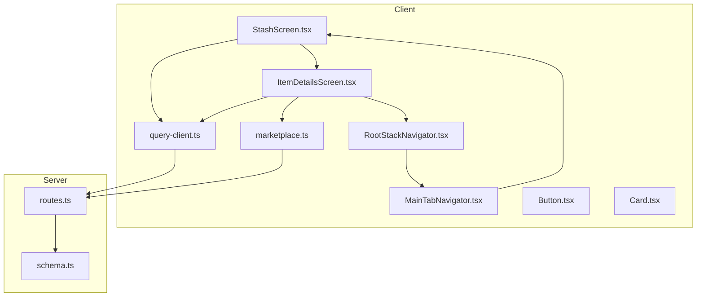
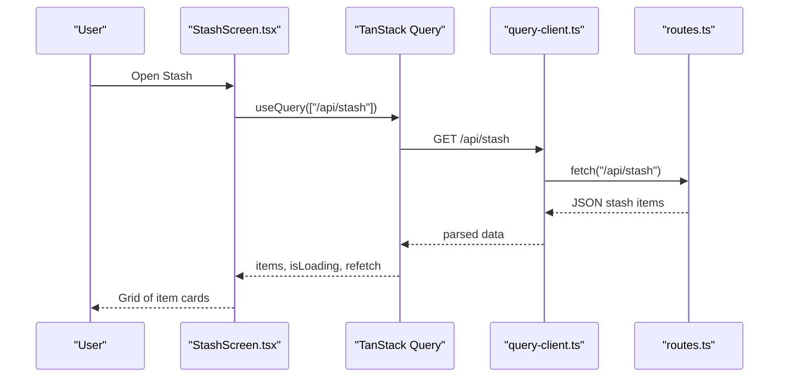
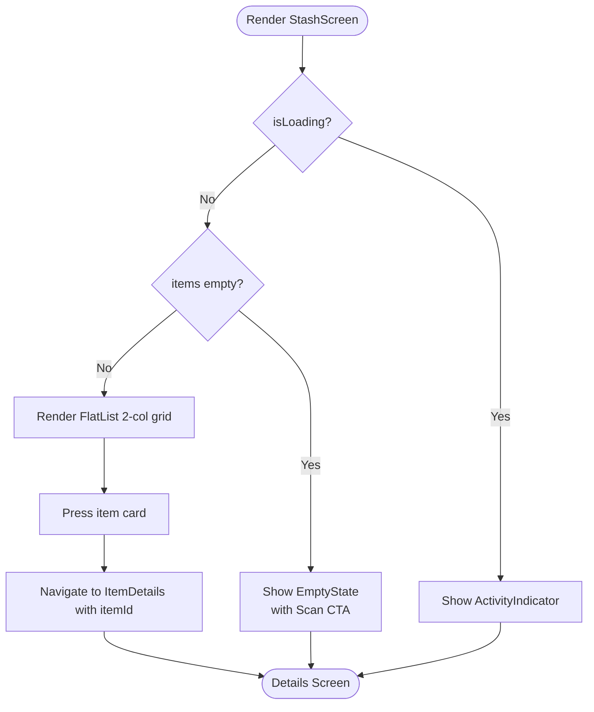
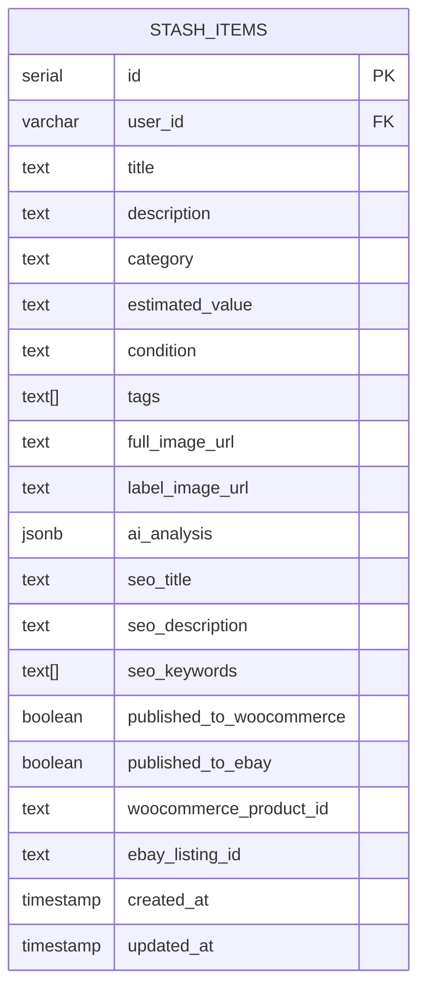
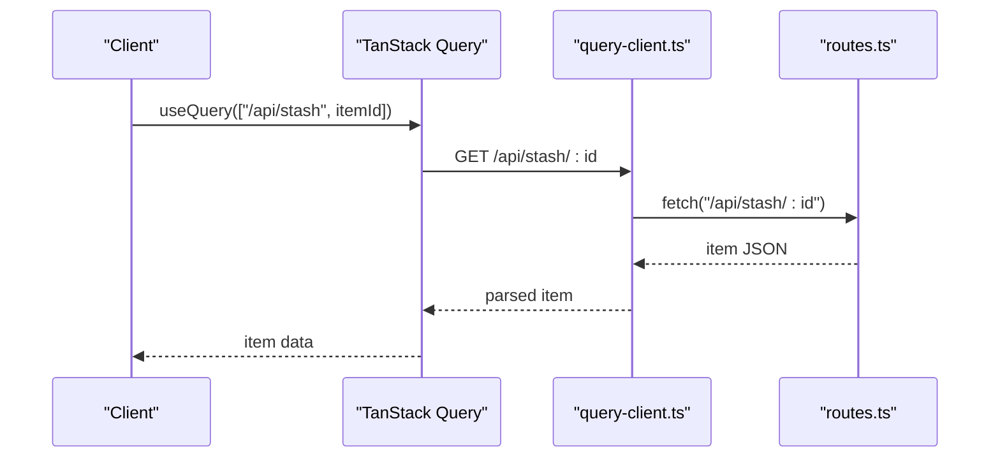
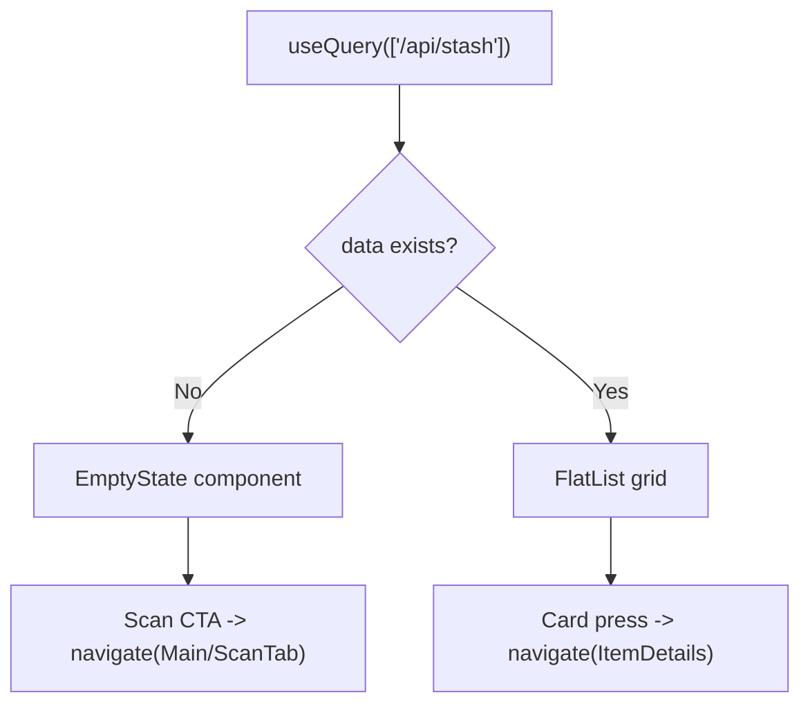
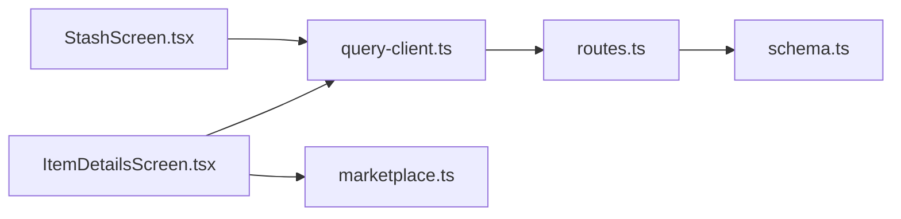

# Stash Management

<cite>
**Referenced Files in This Document**
- [StashScreen.tsx](file://client/screens/StashScreen.tsx)
- [ItemDetailsScreen.tsx](file://client/screens/ItemDetailsScreen.tsx)
- [marketplace.ts](file://client/lib/marketplace.ts)
- [query-client.ts](file://client/lib/query-client.ts)
- [routes.ts](file://server/routes.ts)
- [schema.ts](file://shared/schema.ts)
- [RootStackNavigator.tsx](file://client/navigation/RootStackNavigator.tsx)
- [MainTabNavigator.tsx](file://client/navigation/MainTabNavigator.tsx)
- [Button.tsx](file://client/components/Button.tsx)
- [Card.tsx](file://client/components/Card.tsx)
- [stash_flow.yml](file://.maestro/stash_flow.yml)
</cite>

## Table of Contents
1. [Introduction](#introduction)
2. [Project Structure](#project-structure)
3. [Core Components](#core-components)
4. [Architecture Overview](#architecture-overview)
5. [Detailed Component Analysis](#detailed-component-analysis)
6. [Dependency Analysis](#dependency-analysis)
7. [Performance Considerations](#performance-considerations)
8. [Troubleshooting Guide](#troubleshooting-guide)
9. [Conclusion](#conclusion)
10. [Appendices](#appendices)

## Introduction
This document explains the stash management system that powers inventory collection display and item management. It covers:
- The stash screen with grid layout, item cards, and collection organization
- The item details screen for viewing, editing, and publishing items
- API integration for stash CRUD operations and marketplace publishing
- Data loading states, empty state handling, and user interactions
- Item categorization, filtering/search, and publication status tracking
- Stash data models and UI state management
- Integration with the marketplace publishing workflow

## Project Structure
The stash system spans client screens, navigation, UI components, and server routes:
- Client screens: Stash listing and item details
- Navigation: Stack and tab navigators
- UI components: Reusable themed components
- API layer: TanStack Query client and marketplace helpers
- Backend: Express routes implementing stash CRUD and marketplace publishing



**Diagram sources**
- [StashScreen.tsx](file://client/screens/StashScreen.tsx#L1-L290)
- [ItemDetailsScreen.tsx](file://client/screens/ItemDetailsScreen.tsx#L1-L574)
- [RootStackNavigator.tsx](file://client/navigation/RootStackNavigator.tsx#L1-L124)
- [MainTabNavigator.tsx](file://client/navigation/MainTabNavigator.tsx#L1-L192)
- [query-client.ts](file://client/lib/query-client.ts#L1-L80)
- [marketplace.ts](file://client/lib/marketplace.ts#L1-L129)
- [routes.ts](file://server/routes.ts#L1-L493)
- [schema.ts](file://shared/schema.ts#L1-L122)

**Section sources**
- [StashScreen.tsx](file://client/screens/StashScreen.tsx#L1-L290)
- [ItemDetailsScreen.tsx](file://client/screens/ItemDetailsScreen.tsx#L1-L574)
- [RootStackNavigator.tsx](file://client/navigation/RootStackNavigator.tsx#L1-L124)
- [MainTabNavigator.tsx](file://client/navigation/MainTabNavigator.tsx#L1-L192)
- [query-client.ts](file://client/lib/query-client.ts#L1-L80)
- [marketplace.ts](file://client/lib/marketplace.ts#L1-L129)
- [routes.ts](file://server/routes.ts#L1-L493)
- [schema.ts](file://shared/schema.ts#L1-L122)

## Core Components
- StashScreen: Displays a grid of stash items, handles loading and empty states, pull-to-refresh, and navigation to item details.
- ItemDetailsScreen: Shows item details, actions (share, delete), and marketplace publishing controls for WooCommerce and eBay.
- Marketplace helpers: Retrieve stored credentials and publish items to external marketplaces via the backend.
- Query client: Centralized API requests and TanStack Query configuration.
- Server routes: CRUD endpoints for stash items and marketplace publishing endpoints.

**Section sources**
- [StashScreen.tsx](file://client/screens/StashScreen.tsx#L93-L163)
- [ItemDetailsScreen.tsx](file://client/screens/ItemDetailsScreen.tsx#L42-L383)
- [marketplace.ts](file://client/lib/marketplace.ts#L1-L129)
- [query-client.ts](file://client/lib/query-client.ts#L1-L80)
- [routes.ts](file://server/routes.ts#L57-L138)

## Architecture Overview
The stash system follows a clear separation of concerns:
- UI layer: Screens and components render data and capture user interactions
- State layer: TanStack Query manages caching, invalidation, and refetching
- API layer: Client-side query client constructs URLs and performs fetches
- Backend layer: Express routes implement stash CRUD and marketplace publishing



**Diagram sources**
- [StashScreen.tsx](file://client/screens/StashScreen.tsx#L98-L100)
- [query-client.ts](file://client/lib/query-client.ts#L46-L64)
- [routes.ts](file://server/routes.ts#L57-L68)

**Section sources**
- [StashScreen.tsx](file://client/screens/StashScreen.tsx#L93-L163)
- [query-client.ts](file://client/lib/query-client.ts#L1-L80)
- [routes.ts](file://server/routes.ts#L57-L68)

## Detailed Component Analysis

### Stash Screen: Grid Layout and Item Cards
- Grid layout: Uses a two-column FlatList with dynamic card width based on screen width and spacing constants.
- Item cards: Display image placeholder or full image, title, estimated value, and a small badge indicating publication status on marketplace(s).
- Empty state: Renders an illustration, headline, subtitle, and a primary CTA to initiate scanning.
- Floating Action Button: Navigates to the scanning tab.
- Pull-to-refresh: Uses RefreshControl to refetch stash items.



**Diagram sources**
- [StashScreen.tsx](file://client/screens/StashScreen.tsx#L93-L163)

**Section sources**
- [StashScreen.tsx](file://client/screens/StashScreen.tsx#L18-L91)
- [StashScreen.tsx](file://client/screens/StashScreen.tsx#L93-L163)

### Item Details Screen: Viewing, Editing, and Publishing
- Data loading and error states: Shows loader while fetching, error UI if item not found.
- Image display: Full image or placeholder; share action uses platform Share API.
- Delete action: Confirmation dialog followed by mutation and cache invalidation.
- Marketplace publishing:
  - Checks connection status from secure storage and settings screens
  - Publish to WooCommerce: Validates credentials, posts to backend endpoint, updates local cache, and shows success/error alerts
  - Publish to eBay: Similar flow with credentials and environment handling
- Publication badges: Visual indicators for already published items
- Responsive UI: Uses themed components and safe area insets

```mermaid
sequenceDiagram
participant User as "User"
participant Details as "ItemDetailsScreen.tsx"
participant Market as "marketplace.ts"
participant API as "query-client.ts"
participant Server as "routes.ts"
User->>Details : Tap "Publish to WooCommerce"
Details->>Market : getWooCommerceSettings()
Market-->>Details : {storeUrl, consumerKey, consumerSecret}
Details->>API : POST /api/stash/{id}/publish/woocommerce
API->>Server : forward to external WC API
Server-->>API : {success/productUrl}
API-->>Details : result
Details->>Details : invalidateQueries(["/api/stash", id], ["/api/stash"])
Details-->>User : Success alert + badge update
```

**Diagram sources**
- [ItemDetailsScreen.tsx](file://client/screens/ItemDetailsScreen.tsx#L105-L150)
- [marketplace.ts](file://client/lib/marketplace.ts#L81-L103)
- [query-client.ts](file://client/lib/query-client.ts#L26-L43)
- [routes.ts](file://server/routes.ts#L228-L296)

**Section sources**
- [ItemDetailsScreen.tsx](file://client/screens/ItemDetailsScreen.tsx#L42-L383)
- [marketplace.ts](file://client/lib/marketplace.ts#L1-L129)
- [routes.ts](file://server/routes.ts#L228-L296)

### Data Models and Schema
- Stash item fields include identifiers, metadata, media URLs, AI analysis, SEO fields, and marketplace publication flags.
- The schema defines arrays for tags and SEO keywords, booleans for publication flags, and timestamps for creation/update.



**Diagram sources**
- [schema.ts](file://shared/schema.ts#L29-L50)

**Section sources**
- [schema.ts](file://shared/schema.ts#L29-L50)

### API Integration and Endpoints
- Listing and retrieval:
  - GET /api/stash: returns all stash items ordered by creation date
  - GET /api/stash/:id: returns a single item
  - GET /api/stash/count: returns total item count
- Creation and deletion:
  - POST /api/stash: inserts a new stash item
  - DELETE /api/stash/:id: removes an item
- Publishing:
  - POST /api/stash/:id/publish/woocommerce: publishes to WooCommerce and updates flags
  - POST /api/stash/:id/publish/ebay: publishes to eBay and updates flags



**Diagram sources**
- [ItemDetailsScreen.tsx](file://client/screens/ItemDetailsScreen.tsx#L66-L68)
- [query-client.ts](file://client/lib/query-client.ts#L46-L64)
- [routes.ts](file://server/routes.ts#L80-L97)

**Section sources**
- [routes.ts](file://server/routes.ts#L57-L138)
- [query-client.ts](file://client/lib/query-client.ts#L1-L80)

### UI State Management and Interactions
- Loading and error states: Centralized via TanStack Query and conditional rendering
- Empty state: Dedicated component with a primary call-to-action to scan
- Navigation: Stack navigator routes to ItemDetails and settings screens
- Tab bar integration: Stash tab displays item count badge via a separate query
- Marketplace publishing: Controlled via Async storage flags and settings screens



**Diagram sources**
- [StashScreen.tsx](file://client/screens/StashScreen.tsx#L98-L104)
- [MainTabNavigator.tsx](file://client/navigation/MainTabNavigator.tsx#L41-L43)

**Section sources**
- [StashScreen.tsx](file://client/screens/StashScreen.tsx#L93-L163)
- [MainTabNavigator.tsx](file://client/navigation/MainTabNavigator.tsx#L41-L43)

### Filtering, Search, and Publication Status Tracking
- Filtering and search: No explicit filters or search UI is implemented in the current stash screens. Items are presented as a flat list ordered by creation date.
- Publication status tracking: Each item includes flags for WooCommerce and eBay publication, and UI badges reflect current status.

**Section sources**
- [StashScreen.tsx](file://client/screens/StashScreen.tsx#L18-L26)
- [ItemDetailsScreen.tsx](file://client/screens/ItemDetailsScreen.tsx#L20-L38)

### Marketplace Publishing Workflow Integration
- Credentials retrieval: Secure storage and AsyncStorage are used to persist and retrieve marketplace credentials.
- Publishing flows: Separate endpoints for WooCommerce and eBay, each validating credentials and updating stash item flags upon success.
- UI feedback: Loading indicators during publish operations and alerts for success/error.

**Section sources**
- [marketplace.ts](file://client/lib/marketplace.ts#L1-L129)
- [routes.ts](file://server/routes.ts#L228-L488)

## Dependency Analysis
- Client-side dependencies:
  - StashScreen depends on TanStack Query for data fetching and navigation for routing
  - ItemDetailsScreen depends on TanStack Query for item data, marketplace helpers for credentials, and API client for publishing
  - UI components (Button, Card) provide reusable, themed interactions
- Server-side dependencies:
  - Routes depend on Drizzle ORM for database operations and external APIs for marketplace publishing



**Diagram sources**
- [StashScreen.tsx](file://client/screens/StashScreen.tsx#L1-L20)
- [ItemDetailsScreen.tsx](file://client/screens/ItemDetailsScreen.tsx#L1-L20)
- [query-client.ts](file://client/lib/query-client.ts#L1-L20)
- [routes.ts](file://server/routes.ts#L1-L10)
- [schema.ts](file://shared/schema.ts#L1-L10)

**Section sources**
- [StashScreen.tsx](file://client/screens/StashScreen.tsx#L1-L20)
- [ItemDetailsScreen.tsx](file://client/screens/ItemDetailsScreen.tsx#L1-L20)
- [query-client.ts](file://client/lib/query-client.ts#L1-L20)
- [routes.ts](file://server/routes.ts#L1-L10)
- [schema.ts](file://shared/schema.ts#L1-L10)

## Performance Considerations
- Infinite stale time for queries avoids unnecessary refetches; ensure cache invalidation is triggered after mutations (as implemented)
- Two-column grid layout uses fixed card width; consider responsive breakpoints for tablets
- Image loading: Prefer caching and appropriate sizing to minimize layout thrashing
- Publishing operations: Debounce or disable buttons during long-running requests to prevent duplicate submissions

[No sources needed since this section provides general guidance]

## Troubleshooting Guide
- Empty stash:
  - Verify that the backend returns items and the client query resolves
  - Confirm navigation to the scan flow from the empty state
- Item not found:
  - Ensure the item ID exists in the database and the route handler responds with 404 when missing
- Publishing failures:
  - Check marketplace credentials retrieval and environment selection
  - Review backend error responses for marketplace APIs and surface actionable messages
- Network errors:
  - Confirm EXPO_PUBLIC_DOMAIN is set and API base URL resolution works
  - Inspect query client error handling for non-OK responses

**Section sources**
- [StashScreen.tsx](file://client/screens/StashScreen.tsx#L120-L128)
- [ItemDetailsScreen.tsx](file://client/screens/ItemDetailsScreen.tsx#L199-L221)
- [routes.ts](file://server/routes.ts#L88-L96)
- [query-client.ts](file://client/lib/query-client.ts#L19-L24)

## Conclusion
The stash management system provides a robust foundation for inventory display and item lifecycle management. It leverages TanStack Query for efficient data fetching, a clean separation between UI and API logic, and seamless integration with marketplace publishing workflows. While filtering and search are not currently implemented, the existing architecture supports incremental enhancements to improve discoverability and user productivity.

[No sources needed since this section summarizes without analyzing specific files]

## Appendices

### UI Component Reference
- Button: Animated pressable with spring scaling and themed colors
- Card: Animated pressable with elevation-based backgrounds and optional title/description

**Section sources**
- [Button.tsx](file://client/components/Button.tsx#L1-L93)
- [Card.tsx](file://client/components/Card.tsx#L1-L115)

### Test Coverage
- Maestro flow validates stash tab presence, empty state visibility, item card presence, and floating action button.

**Section sources**
- [.maestro/stash_flow.yml](file://.maestro/stash_flow.yml#L1-L28)