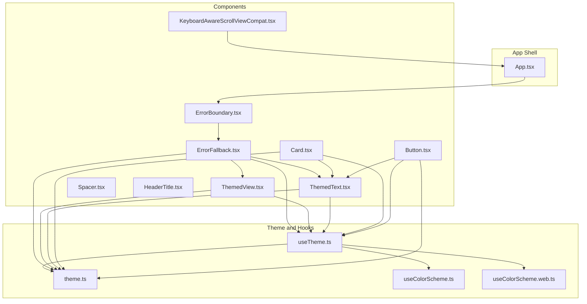
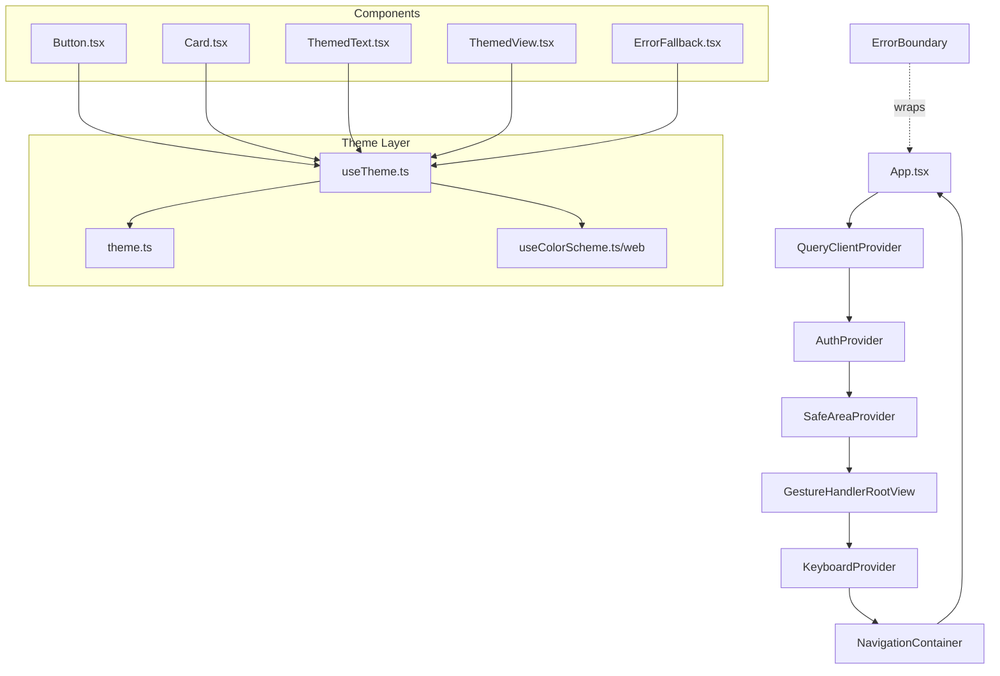
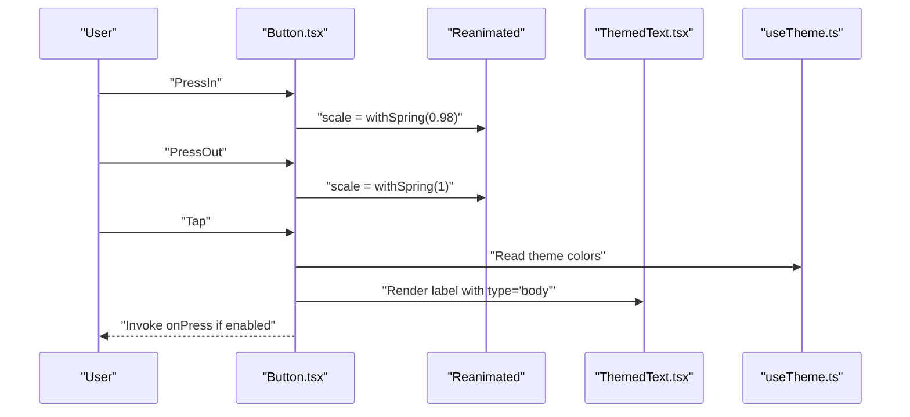
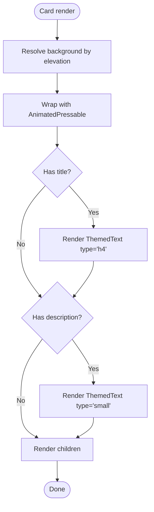
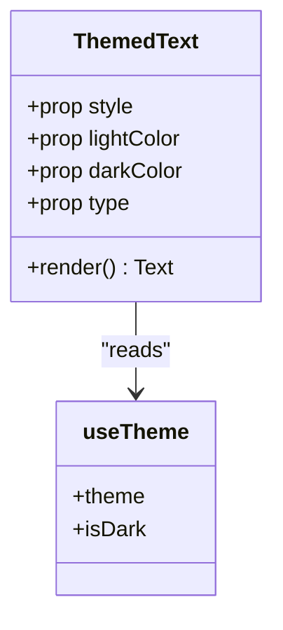
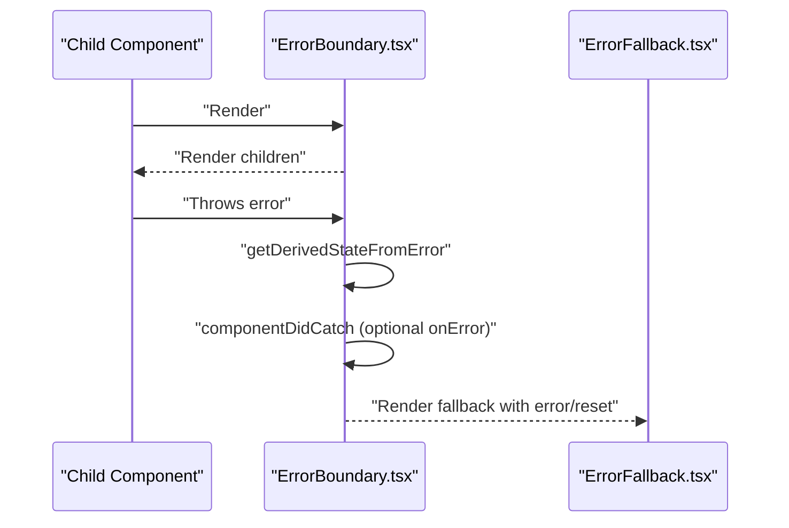
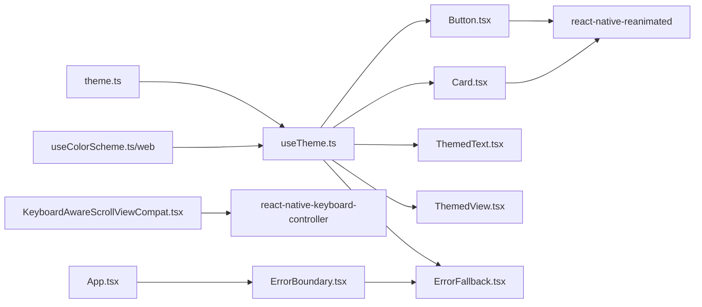

# UI Components Library

<cite>
**Referenced Files in This Document**
- [Button.tsx](file://client/components/Button.tsx)
- [Card.tsx](file://client/components/Card.tsx)
- [ThemedText.tsx](file://client/components/ThemedText.tsx)
- [ThemedView.tsx](file://client/components/ThemedView.tsx)
- [Spacer.tsx](file://client/components/Spacer.tsx)
- [ErrorBoundary.tsx](file://client/components/ErrorBoundary.tsx)
- [ErrorFallback.tsx](file://client/components/ErrorFallback.tsx)
- [HeaderTitle.tsx](file://client/components/HeaderTitle.tsx)
- [KeyboardAwareScrollViewCompat.tsx](file://client/components/KeyboardAwareScrollViewCompat.tsx)
- [theme.ts](file://client/constants/theme.ts)
- [useTheme.ts](file://client/hooks/useTheme.ts)
- [useColorScheme.ts](file://client/hooks/useColorScheme.ts)
- [useColorScheme.web.ts](file://client/hooks/useColorScheme.web.ts)
- [App.tsx](file://client/App.tsx)
- [package.json](file://package.json)
</cite>

## Table of Contents
1. [Introduction](#introduction)
2. [Project Structure](#project-structure)
3. [Core Components](#core-components)
4. [Architecture Overview](#architecture-overview)
5. [Detailed Component Analysis](#detailed-component-analysis)
6. [Dependency Analysis](#dependency-analysis)
7. [Performance Considerations](#performance-considerations)
8. [Accessibility Features](#accessibility-features)
9. [Responsive Design Considerations](#responsive-design-considerations)
10. [Customization and Theming](#customization-and-theming)
11. [Cross-Platform Compatibility](#cross-platform-compatibility)
12. [Usage Examples and Best Practices](#usage-examples-and-best-practices)
13. [Troubleshooting Guide](#troubleshooting-guide)
14. [Conclusion](#conclusion)

## Introduction
This document describes the reusable UI component library used across the application. It focuses on shared components that provide consistent styling, behavior, and accessibility. The library emphasizes a unified theming system, cross-platform compatibility, and composability. Covered components include Button, Card, ThemedText, ThemedView, Spacer, ErrorBoundary, ErrorFallback, HeaderTitle, and KeyboardAwareScrollViewCompat. The guide explains component props, styling options, theming integration, composition strategies, prop validation, accessibility features, and responsive design considerations. It also provides practical usage patterns, customization guidelines, and best practices for extending the component library.

## Project Structure
The UI components live under the client/components directory and integrate with theme constants, hooks, and the main application shell. The theme system defines colors, spacing, typography, fonts, and shadows. Hooks manage theme selection and color scheme detection, including a web-specific hydration strategy. The main App component wires providers and navigation while wrapping the entire app in an ErrorBoundary.

**Diagram sources**
- [Button.tsx](file://client/components/Button.tsx#L1-L93)
- [Card.tsx](file://client/components/Card.tsx#L1-L115)
- [ThemedText.tsx](file://client/components/ThemedText.tsx#L1-L62)
- [ThemedView.tsx](file://client/components/ThemedView.tsx#L1-L27)
- [ErrorBoundary.tsx](file://client/components/ErrorBoundary.tsx#L1-L55)
- [ErrorFallback.tsx](file://client/components/ErrorFallback.tsx#L1-L247)
- [HeaderTitle.tsx](file://client/components/HeaderTitle.tsx#L1-L40)
- [KeyboardAwareScrollViewCompat.tsx](file://client/components/KeyboardAwareScrollViewCompat.tsx#L1-L38)
- [theme.ts](file://client/constants/theme.ts#L1-L167)
- [useTheme.ts](file://client/hooks/useTheme.ts#L1-L14)
- [useColorScheme.ts](file://client/hooks/useColorScheme.ts#L1-L2)
- [useColorScheme.web.ts](file://client/hooks/useColorScheme.web.ts#L1-L22)
- [App.tsx](file://client/App.tsx#L1-L57)

**Section sources**
- [App.tsx](file://client/App.tsx#L1-L57)
- [theme.ts](file://client/constants/theme.ts#L1-L167)
- [useTheme.ts](file://client/hooks/useTheme.ts#L1-L14)
- [useColorScheme.ts](file://client/hooks/useColorScheme.ts#L1-L2)
- [useColorScheme.web.ts](file://client/hooks/useColorScheme.web.ts#L1-L22)

## Core Components
This section summarizes each component’s purpose, props, styling, and integration points.

- Button
  - Purpose: Interactive pressable element with animated feedback and themed colors.
  - Key props: onPress, children, style, disabled.
  - Styling: Uses theme colors for background and text, fixed height and rounded corners, animated scaling on press.
  - Integration: Depends on ThemedText for label, useTheme for colors, and theme constants for sizing and radius.

- Card
  - Purpose: Container with optional title and description, themed background by elevation level, pressable with subtle animation.
  - Key props: elevation, title, description, children, onPress, style.
  - Styling: Background color mapped to elevation levels via theme, padding and border radius from theme.
  - Integration: Uses ThemedText for title and description, useTheme for colors, theme constants for spacing and radius.

- ThemedText
  - Purpose: Text component that adapts color and typography based on theme and type.
  - Key props: lightColor, darkColor, type, plus all TextProps.
  - Styling: Applies color based on theme mode and overrides; selects typography variant from theme.
  - Integration: useTheme for theme and mode, theme constants for typography scales.

- ThemedView
  - Purpose: View component that applies themed background color with optional light/dark overrides.
  - Key props: lightColor, darkColor, plus all ViewProps.
  - Styling: Chooses background color based on theme mode and overrides.
  - Integration: useTheme for theme and mode.

- Spacer
  - Purpose: Minimal layout spacer with configurable width and height.
  - Key props: width, height.
  - Styling: Renders a View with explicit dimensions.

- ErrorBoundary
  - Purpose: Class-based error boundary catching rendering errors and delegating to a fallback.
  - Key props: FallbackComponent, onError, children.
  - Behavior: Uses static methods to capture errors and renders fallback when present.

- ErrorFallback
  - Purpose: Friendly error UI with restart action and optional developer details modal.
  - Key props: error, resetError.
  - Styling: Uses theme colors and spacing; includes modal with scrollable error details in development.

- HeaderTitle
  - Purpose: Header title component combining an icon and text.
  - Key props: title.
  - Styling: Horizontal layout with icon and themed text.

- KeyboardAwareScrollViewCompat
  - Purpose: Cross-platform scroll view that uses a keyboard-aware component on native and falls back to ScrollView on web.
  - Key props: keyboardShouldPersistTaps, plus ScrollView props.
  - Behavior: Conditionally renders KeyboardAwareScrollView on non-web platforms and ScrollView on web.

**Section sources**
- [Button.tsx](file://client/components/Button.tsx#L1-L93)
- [Card.tsx](file://client/components/Card.tsx#L1-L115)
- [ThemedText.tsx](file://client/components/ThemedText.tsx#L1-L62)
- [ThemedView.tsx](file://client/components/ThemedView.tsx#L1-L27)
- [Spacer.tsx](file://client/components/Spacer.tsx#L1-L21)
- [ErrorBoundary.tsx](file://client/components/ErrorBoundary.tsx#L1-L55)
- [ErrorFallback.tsx](file://client/components/ErrorFallback.tsx#L1-L247)
- [HeaderTitle.tsx](file://client/components/HeaderTitle.tsx#L1-L40)
- [KeyboardAwareScrollViewCompat.tsx](file://client/components/KeyboardAwareScrollViewCompat.tsx#L1-L38)

## Architecture Overview
The component library relies on a centralized theme system and a lightweight hook to select the appropriate theme and mode. Providers in the main App component supply the global context and error handling. Components consume theme tokens and react-native primitives, ensuring consistent visuals and behavior across platforms.

**Diagram sources**
- [App.tsx](file://client/App.tsx#L1-L57)
- [useTheme.ts](file://client/hooks/useTheme.ts#L1-L14)
- [theme.ts](file://client/constants/theme.ts#L1-L167)
- [useColorScheme.ts](file://client/hooks/useColorScheme.ts#L1-L2)
- [useColorScheme.web.ts](file://client/hooks/useColorScheme.web.ts#L1-L22)
- [Button.tsx](file://client/components/Button.tsx#L1-L93)
- [Card.tsx](file://client/components/Card.tsx#L1-L115)
- [ThemedText.tsx](file://client/components/ThemedText.tsx#L1-L62)
- [ThemedView.tsx](file://client/components/ThemedView.tsx#L1-L27)
- [ErrorFallback.tsx](file://client/components/ErrorFallback.tsx#L1-L247)

## Detailed Component Analysis

### Button Component
- Implementation highlights
  - Uses Animated.createAnimatedComponent with reanimated for press animations.
  - Spring-based scaling effect on press in/out with a shared value and animated style.
  - Integrates with ThemedText for label and theme colors for background and text.
  - Consumes theme constants for height and border radius.
- Props
  - onPress: Optional callback invoked on press.
  - children: Rendered inside the button.
  - style: Additional styles applied alongside defaults.
  - disabled: Controls interactivity and visual opacity.
- Styling and theming
  - Background color from theme.link.
  - Text color from theme.buttonText.
  - Fixed height and full-radius pill shape.
- Accessibility and UX
  - Press events trigger visual feedback; disabled state reduces opacity.
- Composition
  - Can wrap icons or text; supports custom styles for layout adjustments.

**Diagram sources**
- [Button.tsx](file://client/components/Button.tsx#L31-L80)
- [ThemedText.tsx](file://client/components/ThemedText.tsx#L12-L61)
- [useTheme.ts](file://client/hooks/useTheme.ts#L4-L12)

**Section sources**
- [Button.tsx](file://client/components/Button.tsx#L1-L93)
- [ThemedText.tsx](file://client/components/ThemedText.tsx#L1-L62)
- [useTheme.ts](file://client/hooks/useTheme.ts#L1-L14)
- [theme.ts](file://client/constants/theme.ts#L42-L65)

### Card Component
- Implementation highlights
  - Animated pressable with spring scaling.
  - Background color determined by elevation level mapped to theme palettes.
  - Optional title and description rendered via ThemedText.
- Props
  - elevation: Number determining background palette.
  - title, description: Optional text fields.
  - children: Content inside the card.
  - onPress: Optional handler for card press.
  - style: Additional styles.
- Styling and theming
  - Background derived from theme.backgroundDefault/Secondary/Tertiary/root depending on elevation.
  - Padding and border radius from theme constants.
- Composition
  - Suitable for lists, feature blocks, and content containers; supports nested components.

**Diagram sources**
- [Card.tsx](file://client/components/Card.tsx#L31-L101)
- [ThemedText.tsx](file://client/components/ThemedText.tsx#L12-L61)
- [theme.ts](file://client/constants/theme.ts#L3-L40)

**Section sources**
- [Card.tsx](file://client/components/Card.tsx#L1-L115)
- [ThemedText.tsx](file://client/components/ThemedText.tsx#L1-L62)
- [theme.ts](file://client/constants/theme.ts#L3-L40)

### ThemedText Component
- Implementation highlights
  - Selects color based on current theme mode and optional overrides.
  - Applies typography variant from theme constants.
- Props
  - lightColor, darkColor: Override colors per mode.
  - type: One of h1/h2/h3/h4/body/small/link.
  - Inherits all TextProps.
- Styling and theming
  - Defaults to theme.text; link type uses theme.link.
  - Typography scales from theme.Typography.

**Diagram sources**
- [ThemedText.tsx](file://client/components/ThemedText.tsx#L6-L61)
- [useTheme.ts](file://client/hooks/useTheme.ts#L4-L12)
- [theme.ts](file://client/constants/theme.ts#L67-L108)

**Section sources**
- [ThemedText.tsx](file://client/components/ThemedText.tsx#L1-L62)
- [useTheme.ts](file://client/hooks/useTheme.ts#L1-L14)
- [theme.ts](file://client/constants/theme.ts#L67-L108)

### ThemedView Component
- Implementation highlights
  - Applies background color based on theme mode and optional overrides.
- Props
  - lightColor, darkColor: Overrides.
  - Inherits all ViewProps.
- Styling and theming
  - Defaults to theme.backgroundRoot.

**Section sources**
- [ThemedView.tsx](file://client/components/ThemedView.tsx#L1-L27)
- [useTheme.ts](file://client/hooks/useTheme.ts#L1-L14)
- [theme.ts](file://client/constants/theme.ts#L3-L40)

### Spacer Component
- Implementation highlights
  - Minimal component rendering a sized View.
- Props
  - width, height: Defaults to 1 if unspecified.

**Section sources**
- [Spacer.tsx](file://client/components/Spacer.tsx#L1-L21)

### ErrorBoundary Component
- Implementation highlights
  - Class component implementing static error boundary methods.
  - Renders fallback component when an error is caught.
- Props
  - FallbackComponent: Custom fallback; defaults to ErrorFallback.
  - onError: Optional callback receiving error and stack trace.
  - children: Wrapped subtree.

**Diagram sources**
- [ErrorBoundary.tsx](file://client/components/ErrorBoundary.tsx#L16-L54)
- [ErrorFallback.tsx](file://client/components/ErrorFallback.tsx#L22-L144)

**Section sources**
- [ErrorBoundary.tsx](file://client/components/ErrorBoundary.tsx#L1-L55)
- [ErrorFallback.tsx](file://client/components/ErrorFallback.tsx#L1-L247)

### ErrorFallback Component
- Implementation highlights
  - Developer-friendly error UI with restart action.
  - Optional modal displaying formatted error details in development.
- Props
  - error, resetError.
- Styling and UX
  - Centered layout with themed colors and spacing; modal with scrollable details.

**Section sources**
- [ErrorFallback.tsx](file://client/components/ErrorFallback.tsx#L1-L247)
- [theme.ts](file://client/constants/theme.ts#L42-L54)

### HeaderTitle Component
- Implementation highlights
  - Combines an icon asset with themed text for consistent header branding.
- Props
  - title: Text to display next to the icon.
- Styling
  - Horizontal layout with icon sizing and spacing from theme.

**Section sources**
- [HeaderTitle.tsx](file://client/components/HeaderTitle.tsx#L1-L40)
- [theme.ts](file://client/constants/theme.ts#L42-L54)

### KeyboardAwareScrollViewCompat Component
- Implementation highlights
  - Cross-platform wrapper around KeyboardAwareScrollView on native and ScrollView on web.
- Props
  - keyboardShouldPersistTaps and all ScrollView props.
- Behavior
  - On web, falls back to ScrollView; otherwise uses KeyboardAwareScrollView.

**Section sources**
- [KeyboardAwareScrollViewCompat.tsx](file://client/components/KeyboardAwareScrollViewCompat.tsx#L1-L38)
- [package.json](file://package.json#L58-L58)

## Dependency Analysis
The components depend on:
- Theme constants for colors, spacing, typography, fonts, and shadows.
- useTheme hook for theme and mode.
- Reanimated for animations in Button and Card.
- Keyboard-aware scroll provider for input-friendly scrolling on native.
- Navigation and providers in the main App component.

**Diagram sources**
- [theme.ts](file://client/constants/theme.ts#L1-L167)
- [useTheme.ts](file://client/hooks/useTheme.ts#L1-L14)
- [useColorScheme.ts](file://client/hooks/useColorScheme.ts#L1-L2)
- [useColorScheme.web.ts](file://client/hooks/useColorScheme.web.ts#L1-L22)
- [Button.tsx](file://client/components/Button.tsx#L3-L8)
- [Card.tsx](file://client/components/Card.tsx#L3-L8)
- [KeyboardAwareScrollViewCompat.tsx](file://client/components/KeyboardAwareScrollViewCompat.tsx#L1-L5)
- [App.tsx](file://client/App.tsx#L1-L57)
- [ErrorBoundary.tsx](file://client/components/ErrorBoundary.tsx#L1-L7)
- [ErrorFallback.tsx](file://client/components/ErrorFallback.tsx#L1-L15)

**Section sources**
- [Button.tsx](file://client/components/Button.tsx#L1-L93)
- [Card.tsx](file://client/components/Card.tsx#L1-L115)
- [ThemedText.tsx](file://client/components/ThemedText.tsx#L1-L62)
- [ThemedView.tsx](file://client/components/ThemedView.tsx#L1-L27)
- [ErrorFallback.tsx](file://client/components/ErrorFallback.tsx#L1-L247)
- [KeyboardAwareScrollViewCompat.tsx](file://client/components/KeyboardAwareScrollViewCompat.tsx#L1-L38)
- [theme.ts](file://client/constants/theme.ts#L1-L167)
- [useTheme.ts](file://client/hooks/useTheme.ts#L1-L14)
- [useColorScheme.ts](file://client/hooks/useColorScheme.ts#L1-L2)
- [useColorScheme.web.ts](file://client/hooks/useColorScheme.web.ts#L1-L22)
- [App.tsx](file://client/App.tsx#L1-L57)
- [ErrorBoundary.tsx](file://client/components/ErrorBoundary.tsx#L1-L55)
- [package.json](file://package.json#L58-L58)

## Performance Considerations
- Animations
  - Reanimated animations are efficient and offload work to the UI thread; keep animation configs minimal and avoid unnecessary re-renders.
- Rendering
  - Prefer memoization for frequently re-rendered components; pass stable callbacks to child components.
- Theme reads
  - useTheme is lightweight; avoid deep nesting of theme-dependent components to reduce re-renders.
- Scroll views
  - Use KeyboardAwareScrollViewCompat for forms to prevent layout thrashing on native; on web, ScrollView is sufficient.

## Accessibility Features
- Color contrast
  - Components use theme colors designed for light and dark modes; ensure sufficient contrast for text and interactive elements.
- Touch targets
  - Button and Card meet minimum touch sizes via theme-defined heights and paddings.
- Focus and gestures
  - Reanimated animations enhance feedback without relying on focus styles; ensure logical tab order in layouts.
- Readability
  - Typography scales from theme.Typography improve readability across devices.

## Responsive Design Considerations
- Spacing and sizing
  - Theme spacing tokens (xs to 5xl) and fixed input/button heights provide consistent scaling across devices.
- Typography
  - Font family choices vary by platform and web; ensure readable weights and sizes across form factors.
- Layout
  - Components rely on flexbox and padding; test on small screens and adjust container widths as needed.

## Customization and Theming
- Extending themes
  - Add new color tokens, spacing units, or typography variants in theme.ts; update useTheme consumers accordingly.
- Component overrides
  - Pass style props to Button, Card, and ThemedView to customize appearance while preserving theme colors.
- Type safety
  - Keep component prop types aligned with theme enums and constants to maintain type safety.

**Section sources**
- [theme.ts](file://client/constants/theme.ts#L3-L167)
- [useTheme.ts](file://client/hooks/useTheme.ts#L1-L14)
- [Button.tsx](file://client/components/Button.tsx#L14-L19)
- [Card.tsx](file://client/components/Card.tsx#L14-L21)
- [ThemedView.tsx](file://client/components/ThemedView.tsx#L5-L8)

## Cross-Platform Compatibility
- Web support
  - useColorScheme.web.ts hydrates the color scheme on the client for static rendering; ensure assets and fonts are available.
- Native vs web scroll
  - KeyboardAwareScrollViewCompat switches behavior based on Platform.OS; on web, ScrollView is used to avoid unsupported features.
- Provider setup
  - App.tsx configures providers for navigation, queries, auth, safe areas, gesture handling, and keyboard control.

**Section sources**
- [useColorScheme.web.ts](file://client/hooks/useColorScheme.web.ts#L1-L22)
- [KeyboardAwareScrollViewCompat.tsx](file://client/components/KeyboardAwareScrollViewCompat.tsx#L1-L38)
- [App.tsx](file://client/App.tsx#L1-L57)

## Usage Examples and Best Practices
- Composing Button and ThemedText
  - Wrap text or icons inside Button; apply style to override alignment or padding.
- Using Card for content blocks
  - Combine title and description with children for feature cards; attach onPress for navigation.
- Theming text consistently
  - Use ThemedText with type variants for headings and body copy; override colors sparingly.
- Error handling
  - Wrap top-level screens or navigators with ErrorBoundary; provide custom FallbackComponent if needed.
- Forms and input
  - Use KeyboardAwareScrollViewCompat for screens with text inputs; set keyboardShouldPersistTaps appropriately.

## Troubleshooting Guide
- Button not responding
  - Verify disabled prop is not set; confirm onPress is passed and not null.
- Colors appear incorrect
  - Check useColorScheme hydration on web; ensure theme tokens exist in theme.ts.
- Error boundary not triggering
  - Confirm component causing error is rendered within ErrorBoundary; verify static methods are not overridden.
- Keyboard overlaps input on mobile
  - Ensure KeyboardAwareScrollViewCompat is used for input-heavy screens; avoid web fallback on native.

**Section sources**
- [Button.tsx](file://client/components/Button.tsx#L31-L80)
- [ErrorBoundary.tsx](file://client/components/ErrorBoundary.tsx#L16-L54)
- [ErrorFallback.tsx](file://client/components/ErrorFallback.tsx#L22-L144)
- [useColorScheme.web.ts](file://client/hooks/useColorScheme.web.ts#L7-L21)
- [KeyboardAwareScrollViewCompat.tsx](file://client/components/KeyboardAwareScrollViewCompat.tsx#L13-L37)

## Conclusion
The UI component library provides a cohesive, theme-driven foundation for building consistent and accessible user interfaces. By centralizing theme tokens and leveraging lightweight hooks, components remain flexible yet predictable. The error boundary and fallback system improves resilience, while cross-platform wrappers ensure reliable behavior across environments. Following the composition strategies, customization guidelines, and best practices outlined here will help maintain quality and scalability as the component library evolves.