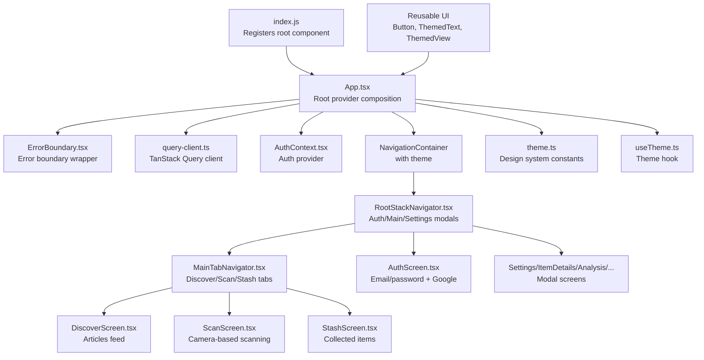
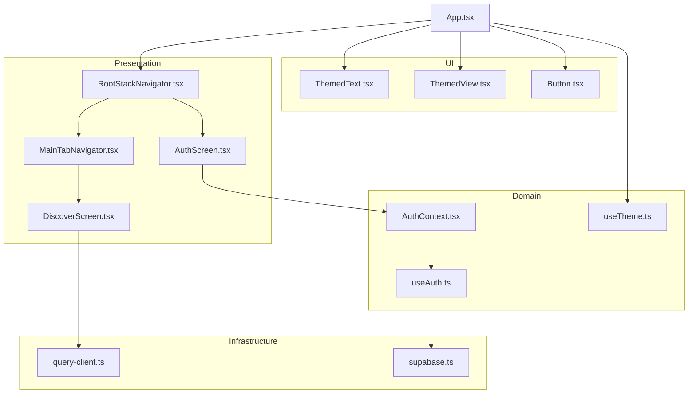
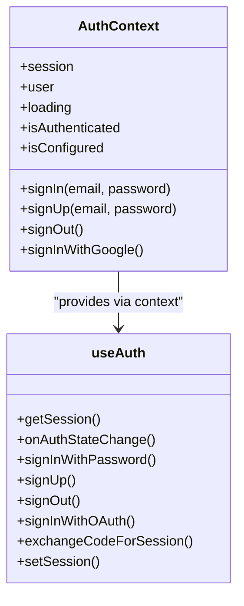
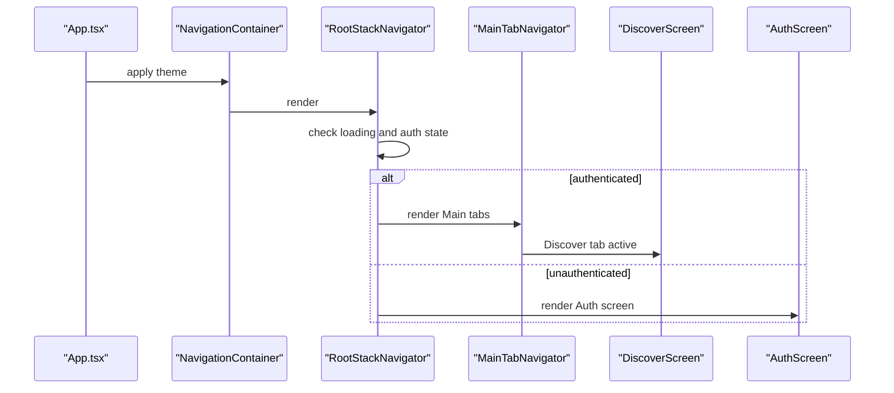
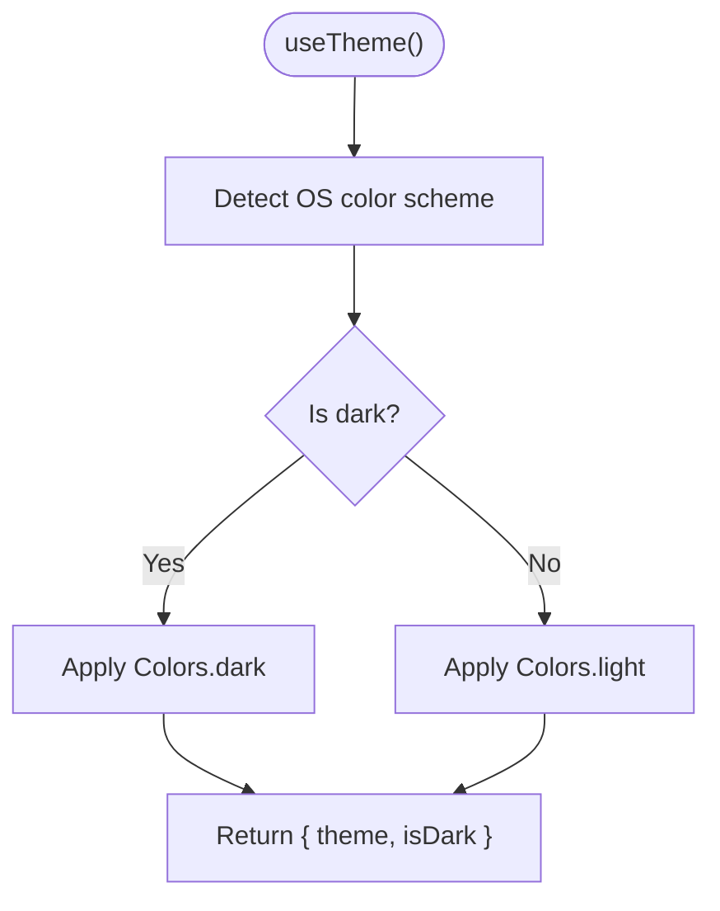
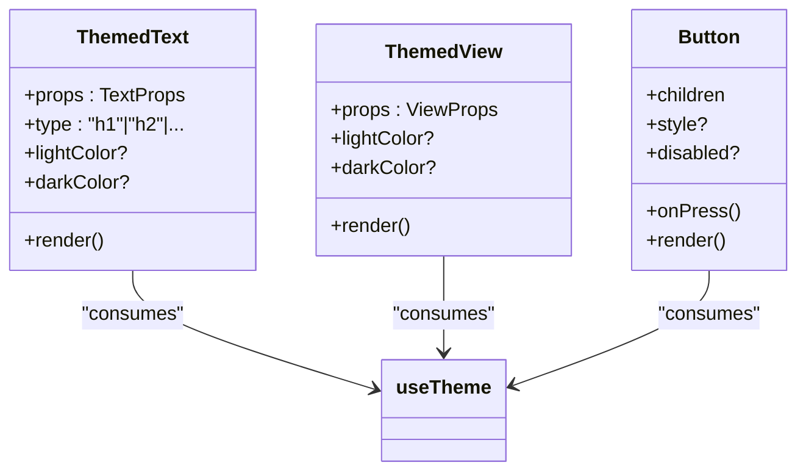
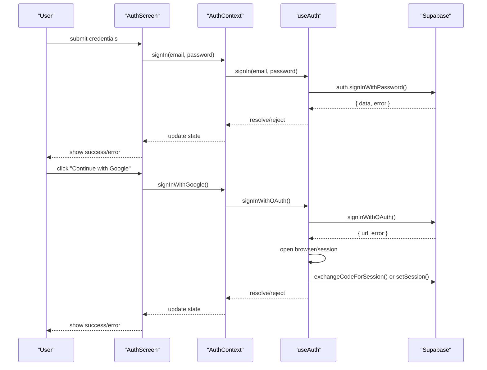
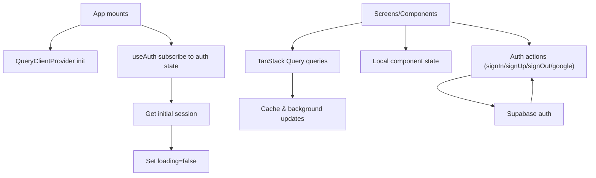
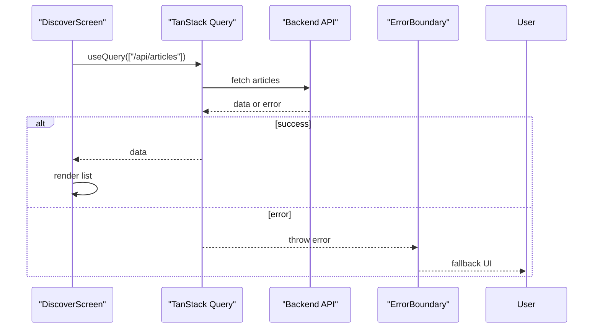
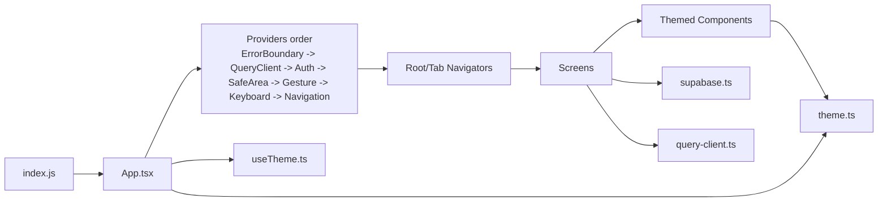

# Mobile Application (Client)

<cite>
**Referenced Files in This Document**
- [App.tsx](file://client/App.tsx)
- [index.js](file://client/index.js)
- [RootStackNavigator.tsx](file://client/navigation/RootStackNavigator.tsx)
- [MainTabNavigator.tsx](file://client/navigation/MainTabNavigator.tsx)
- [HomeStackNavigator.tsx](file://client/navigation/HomeStackNavigator.tsx)
- [ProfileStackNavigator.tsx](file://client/navigation/ProfileStackNavigator.tsx)
- [AuthContext.tsx](file://client/contexts/AuthContext.tsx)
- [useAuth.ts](file://client/hooks/useAuth.ts)
- [useTheme.ts](file://client/hooks/useTheme.ts)
- [theme.ts](file://client/constants/theme.ts)
- [Button.tsx](file://client/components/Button.tsx)
- [ThemedText.tsx](file://client/components/ThemedText.tsx)
- [ThemedView.tsx](file://client/components/ThemedView.tsx)
- [AuthScreen.tsx](file://client/screens/AuthScreen.tsx)
- [DiscoverScreen.tsx](file://client/screens/DiscoverScreen.tsx)
- [supabase.ts](file://client/lib/supabase.ts)
- [query-client.ts](file://client/lib/query-client.ts)
- [ErrorBoundary.tsx](file://client/components/ErrorBoundary.tsx)
</cite>

## Table of Contents
1. [Introduction](#introduction)
2. [Project Structure](#project-structure)
3. [Core Components](#core-components)
4. [Architecture Overview](#architecture-overview)
5. [Detailed Component Analysis](#detailed-component-analysis)
6. [Dependency Analysis](#dependency-analysis)
7. [Performance Considerations](#performance-considerations)
8. [Troubleshooting Guide](#troubleshooting-guide)
9. [Conclusion](#conclusion)
10. [Appendices](#appendices)

## Introduction
This document describes the React Native mobile application’s client-side architecture and user interface implementation. It covers the application entry point, navigation system (tab-based and stack-based routing), theme management with dark mode support, component architecture patterns, authentication context provider, state management strategies, and integration with external services. It also documents the overall app structure, component hierarchy, design system implementation, responsive design considerations, platform-specific adaptations, and user experience patterns. Practical examples of component usage, navigation patterns, and state management approaches are included, along with the relationship between client components and backend services, API integration patterns, and error handling strategies.

## Project Structure
The client application follows a feature-based and layer-based organization:
- Entry point registers the root component with Expo.
- App wraps the entire app with providers for navigation, keyboard handling, safe areas, error boundaries, React Query, and authentication.
- Navigation is composed of nested stacks and tabs.
- Screens implement UI and integrate with backend via Supabase and TanStack Query.
- Components are theme-aware and reusable.
- Hooks encapsulate cross-cutting concerns like authentication and theming.
- Constants define a comprehensive design system (colors, spacing, typography, fonts, shadows).

**Diagram sources**
- [index.js](file://client/index.js#L1-L6)
- [App.tsx](file://client/App.tsx#L1-L57)
- [RootStackNavigator.tsx](file://client/navigation/RootStackNavigator.tsx#L1-L124)
- [MainTabNavigator.tsx](file://client/navigation/MainTabNavigator.tsx#L1-L192)
- [AuthScreen.tsx](file://client/screens/AuthScreen.tsx#L1-L435)
- [DiscoverScreen.tsx](file://client/screens/DiscoverScreen.tsx#L1-L340)
- [theme.ts](file://client/constants/theme.ts#L1-L167)
- [useTheme.ts](file://client/hooks/useTheme.ts#L1-L14)
- [Button.tsx](file://client/components/Button.tsx#L1-L93)
- [ThemedText.tsx](file://client/components/ThemedText.tsx#L1-L62)
- [ThemedView.tsx](file://client/components/ThemedView.tsx#L1-L27)

**Section sources**
- [index.js](file://client/index.js#L1-L6)
- [App.tsx](file://client/App.tsx#L1-L57)
- [theme.ts](file://client/constants/theme.ts#L1-L167)

## Core Components
- App entry and provider composition:
  - Wraps the app with ErrorBoundary, QueryClientProvider, AuthProvider, SafeAreaProvider, GestureHandlerRootView, KeyboardProvider, and NavigationContainer.
  - Applies a custom dark theme with brand colors mapped from the design system.
- Authentication context:
  - Provides session, user, loading state, and auth actions (sign-in, sign-up, sign-out, Google OAuth).
  - Exposes a hook to consume auth state and actions.
- Theme system:
  - Centralized design tokens (colors, spacing, typography, fonts, shadows).
  - Hook selects current theme based on OS preference and exposes theme and isDark flag.
- Reusable UI components:
  - ThemedText and ThemedView adapt color and typography to the active theme.
  - Button integrates animated feedback and theme-aware styling.
- Navigation:
  - Root stack determines whether to show Auth or Main tabs.
  - Main tabs include Discover, Scan, and Stash with custom header and badge.
- Screens:
  - AuthScreen implements email/password and Google OAuth flows with feedback and error handling.
  - DiscoverScreen renders an articles feed with featured highlights and pull-to-refresh.

**Section sources**
- [App.tsx](file://client/App.tsx#L1-L57)
- [AuthContext.tsx](file://client/contexts/AuthContext.tsx#L1-L31)
- [useAuth.ts](file://client/hooks/useAuth.ts#L1-L151)
- [useTheme.ts](file://client/hooks/useTheme.ts#L1-L14)
- [theme.ts](file://client/constants/theme.ts#L1-L167)
- [ThemedText.tsx](file://client/components/ThemedText.tsx#L1-L62)
- [ThemedView.tsx](file://client/components/ThemedView.tsx#L1-L27)
- [Button.tsx](file://client/components/Button.tsx#L1-L93)
- [RootStackNavigator.tsx](file://client/navigation/RootStackNavigator.tsx#L1-L124)
- [MainTabNavigator.tsx](file://client/navigation/MainTabNavigator.tsx#L1-L192)
- [AuthScreen.tsx](file://client/screens/AuthScreen.tsx#L1-L435)
- [DiscoverScreen.tsx](file://client/screens/DiscoverScreen.tsx#L1-L340)

## Architecture Overview
The app uses a layered architecture:
- Presentation layer: Screens and navigators.
- UI layer: Reusable themed components.
- Domain layer: Hooks for auth and theme.
- Infrastructure layer: Supabase for auth and external API queries via TanStack Query.

**Diagram sources**
- [App.tsx](file://client/App.tsx#L1-L57)
- [RootStackNavigator.tsx](file://client/navigation/RootStackNavigator.tsx#L1-L124)
- [MainTabNavigator.tsx](file://client/navigation/MainTabNavigator.tsx#L1-L192)
- [AuthScreen.tsx](file://client/screens/AuthScreen.tsx#L1-L435)
- [DiscoverScreen.tsx](file://client/screens/DiscoverScreen.tsx#L1-L340)
- [AuthContext.tsx](file://client/contexts/AuthContext.tsx#L1-L31)
- [useAuth.ts](file://client/hooks/useAuth.ts#L1-L151)
- [useTheme.ts](file://client/hooks/useTheme.ts#L1-L14)
- [supabase.ts](file://client/lib/supabase.ts)
- [query-client.ts](file://client/lib/query-client.ts)

## Detailed Component Analysis

### Authentication Context Provider
The AuthContext provider exposes a typed context with session, user, loading, and auth action methods. The useAuth hook encapsulates Supabase auth logic, including session initialization, state change subscriptions, email/password sign-in/sign-up, sign-out, and Google OAuth with platform-specific browser handling.

**Diagram sources**
- [AuthContext.tsx](file://client/contexts/AuthContext.tsx#L1-L31)
- [useAuth.ts](file://client/hooks/useAuth.ts#L1-L151)

**Section sources**
- [AuthContext.tsx](file://client/contexts/AuthContext.tsx#L1-L31)
- [useAuth.ts](file://client/hooks/useAuth.ts#L1-L151)

### Navigation System
The navigation stack determines whether to show the Auth screen or the Main tabs. The Main tabs include Discover, Scan, and Stash with custom headers, badges, and a floating Scan button. The Root navigator also defines modal screens for settings and details.

**Diagram sources**
- [App.tsx](file://client/App.tsx#L1-L57)
- [RootStackNavigator.tsx](file://client/navigation/RootStackNavigator.tsx#L1-L124)
- [MainTabNavigator.tsx](file://client/navigation/MainTabNavigator.tsx#L1-L192)
- [DiscoverScreen.tsx](file://client/screens/DiscoverScreen.tsx#L1-L340)
- [AuthScreen.tsx](file://client/screens/AuthScreen.tsx#L1-L435)

**Section sources**
- [RootStackNavigator.tsx](file://client/navigation/RootStackNavigator.tsx#L1-L124)
- [MainTabNavigator.tsx](file://client/navigation/MainTabNavigator.tsx#L1-L192)

### Theme Management and Design System
The design system centralizes colors, spacing, typography, fonts, and shadows. The useTheme hook selects the appropriate palette based on OS preference and exposes theme and isDark. ThemedText and ThemedView adapt to the active theme and optional overrides.

**Diagram sources**
- [useTheme.ts](file://client/hooks/useTheme.ts#L1-L14)
- [theme.ts](file://client/constants/theme.ts#L1-L167)

**Section sources**
- [theme.ts](file://client/constants/theme.ts#L1-L167)
- [useTheme.ts](file://client/hooks/useTheme.ts#L1-L14)
- [ThemedText.tsx](file://client/components/ThemedText.tsx#L1-L62)
- [ThemedView.tsx](file://client/components/ThemedView.tsx#L1-L27)

### Component Architecture Patterns
- Reusability: ThemedText and ThemedView accept optional color props and derive defaults from the active theme.
- Animation: Button integrates react-native-reanimated for press feedback with spring animations.
- Platform awareness: Icons, blur effects, and fonts adapt per platform and web.

**Diagram sources**
- [ThemedText.tsx](file://client/components/ThemedText.tsx#L1-L62)
- [ThemedView.tsx](file://client/components/ThemedView.tsx#L1-L27)
- [Button.tsx](file://client/components/Button.tsx#L1-L93)
- [useTheme.ts](file://client/hooks/useTheme.ts#L1-L14)

**Section sources**
- [ThemedText.tsx](file://client/components/ThemedText.tsx#L1-L62)
- [ThemedView.tsx](file://client/components/ThemedView.tsx#L1-L27)
- [Button.tsx](file://client/components/Button.tsx#L1-L93)

### Authentication Flow
The AuthScreen orchestrates email/password and Google OAuth flows. It validates inputs, manages loading states, displays success/error messages, and triggers haptic feedback. Google OAuth uses platform-specific browser handling and token exchange.

**Diagram sources**
- [AuthScreen.tsx](file://client/screens/AuthScreen.tsx#L1-L435)
- [AuthContext.tsx](file://client/contexts/AuthContext.tsx#L1-L31)
- [useAuth.ts](file://client/hooks/useAuth.ts#L1-L151)
- [supabase.ts](file://client/lib/supabase.ts)

**Section sources**
- [AuthScreen.tsx](file://client/screens/AuthScreen.tsx#L1-L435)
- [AuthContext.tsx](file://client/contexts/AuthContext.tsx#L1-L31)
- [useAuth.ts](file://client/hooks/useAuth.ts#L1-L151)

### State Management Strategies
- Authentication state: Managed by the useAuth hook with Supabase auth state subscription and session persistence.
- UI state: Local component state for forms and toggles (e.g., AuthScreen).
- Remote data: Managed by TanStack Query with automatic caching, refetching, and background updates (e.g., DiscoverScreen fetching articles).

**Diagram sources**
- [App.tsx](file://client/App.tsx#L1-L57)
- [useAuth.ts](file://client/hooks/useAuth.ts#L1-L151)
- [DiscoverScreen.tsx](file://client/screens/DiscoverScreen.tsx#L1-L340)
- [query-client.ts](file://client/lib/query-client.ts)

**Section sources**
- [useAuth.ts](file://client/hooks/useAuth.ts#L1-L151)
- [DiscoverScreen.tsx](file://client/screens/DiscoverScreen.tsx#L1-L340)
- [query-client.ts](file://client/lib/query-client.ts)

### API Integration Patterns and Error Handling
- Supabase integration: Centralized in supabase.ts; useAuth validates configuration and throws descriptive errors when not configured.
- External APIs: TanStack Query is used to fetch articles and other resources; screens leverage useQuery with loading and refetching states.
- Error handling: AuthScreen surfaces user-friendly messages; ErrorBoundary wraps the app to prevent crashes.

**Diagram sources**
- [DiscoverScreen.tsx](file://client/screens/DiscoverScreen.tsx#L1-L340)
- [query-client.ts](file://client/lib/query-client.ts)
- [ErrorBoundary.tsx](file://client/components/ErrorBoundary.tsx)

**Section sources**
- [useAuth.ts](file://client/hooks/useAuth.ts#L1-L151)
- [DiscoverScreen.tsx](file://client/screens/DiscoverScreen.tsx#L1-L340)
- [ErrorBoundary.tsx](file://client/components/ErrorBoundary.tsx)

## Dependency Analysis
The app composes providers and navigators in a strict order to ensure proper initialization and context availability. Providers include ErrorBoundary, QueryClientProvider, AuthProvider, SafeAreaProvider, GestureHandlerRootView, KeyboardProvider, and NavigationContainer. Navigation is composed of Root and Tab navigators. Components depend on theme constants and hooks.

**Diagram sources**
- [index.js](file://client/index.js#L1-L6)
- [App.tsx](file://client/App.tsx#L1-L57)
- [RootStackNavigator.tsx](file://client/navigation/RootStackNavigator.tsx#L1-L124)
- [MainTabNavigator.tsx](file://client/navigation/MainTabNavigator.tsx#L1-L192)
- [theme.ts](file://client/constants/theme.ts#L1-L167)
- [useTheme.ts](file://client/hooks/useTheme.ts#L1-L14)
- [supabase.ts](file://client/lib/supabase.ts)
- [query-client.ts](file://client/lib/query-client.ts)

**Section sources**
- [App.tsx](file://client/App.tsx#L1-L57)
- [RootStackNavigator.tsx](file://client/navigation/RootStackNavigator.tsx#L1-L124)
- [MainTabNavigator.tsx](file://client/navigation/MainTabNavigator.tsx#L1-L192)
- [theme.ts](file://client/constants/theme.ts#L1-L167)
- [useTheme.ts](file://client/hooks/useTheme.ts#L1-L14)

## Performance Considerations
- Lazy loading and minimal re-renders: Keep screens and components pure; avoid unnecessary prop drilling by using context and hooks.
- Virtualization: Use FlatList with keyExtractor and minimal rendering in item renderers.
- Network efficiency: TanStack Query handles caching and deduplication; use enabled flags and stale times appropriately.
- Animations: Prefer native animations and keep animation logic lightweight.
- Platform-specific optimizations: Blur effects and gesture handlers are platform-aware; avoid heavy work on the UI thread.

## Troubleshooting Guide
- Authentication not configured:
  - Symptom: Auth actions throw configuration errors.
  - Resolution: Ensure Supabase keys are present and supabase.ts exports isSupabaseConfigured and supabase instance.
- Google OAuth failures:
  - Symptom: Browser opens but session not established.
  - Resolution: Verify redirect URL, platform-specific browser handling, and token exchange steps.
- Navigation issues:
  - Symptom: Auth/Main tabs not switching or modal not appearing.
  - Resolution: Confirm RootStackNavigator conditions and screen options; ensure header options are applied consistently.
- Theme inconsistencies:
  - Symptom: Colors not adapting to OS preference.
  - Resolution: Verify useTheme hook and theme.ts values; ensure ThemedText/ThemedView receive correct props.

**Section sources**
- [useAuth.ts](file://client/hooks/useAuth.ts#L1-L151)
- [RootStackNavigator.tsx](file://client/navigation/RootStackNavigator.tsx#L1-L124)
- [useTheme.ts](file://client/hooks/useTheme.ts#L1-L14)
- [theme.ts](file://client/constants/theme.ts#L1-L167)

## Conclusion
The client application employs a clean, layered architecture with strong separation of concerns. Providers compose the global state and infrastructure, while navigators and screens implement user flows. The design system ensures consistent theming and responsive UI across platforms. Authentication and data fetching are handled through dedicated hooks and libraries, enabling scalable and maintainable development.

## Appendices
- Practical examples:
  - Navigation: Use RootStackNavigator to conditionally render Auth or Main tabs; navigate to modals like Settings and ItemDetails.
  - State management: Use useAuth for auth state and actions; use TanStack Query for remote data in screens like DiscoverScreen.
  - Theming: Wrap content with ThemedView/ThemedText; optionally override colors via props; rely on useTheme for dynamic palettes.
  - Component usage: Render Button for primary actions; combine ThemedText with typography types for headings and captions.