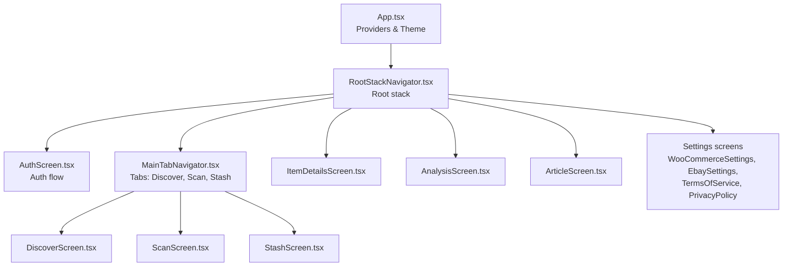
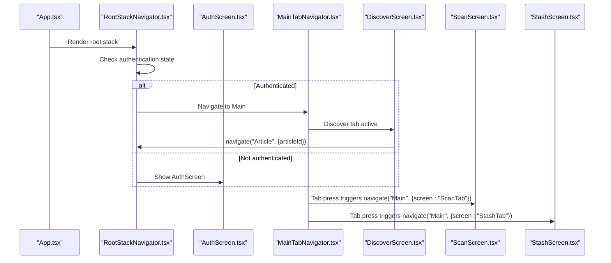
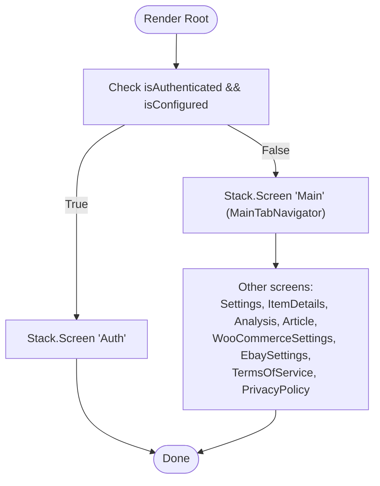
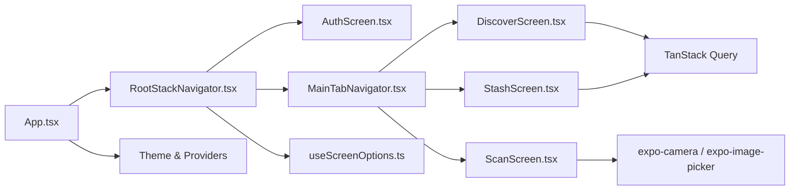

# Navigation and Routing

<cite>
**Referenced Files in This Document**
- [App.tsx](file://client/App.tsx)
- [RootStackNavigator.tsx](file://client/navigation/RootStackNavigator.tsx)
- [MainTabNavigator.tsx](file://client/navigation/MainTabNavigator.tsx)
- [HomeStackNavigator.tsx](file://client/navigation/HomeStackNavigator.tsx)
- [ProfileStackNavigator.tsx](file://client/navigation/ProfileStackNavigator.tsx)
- [MainTabNavigator26.tsx](file://client/navigation/MainTabNavigator26.tsx)
- [AuthScreen.tsx](file://client/screens/AuthScreen.tsx)
- [DiscoverScreen.tsx](file://client/screens/DiscoverScreen.tsx)
- [ScanScreen.tsx](file://client/screens/ScanScreen.tsx)
- [StashScreen.tsx](file://client/screens/StashScreen.tsx)
- [ItemDetailsScreen.tsx](file://client/screens/ItemDetailsScreen.tsx)
- [AnalysisScreen.tsx](file://client/screens/AnalysisScreen.tsx)
- [ArticleScreen.tsx](file://client/screens/ArticleScreen.tsx)
- [AuthContext.tsx](file://client/contexts/AuthContext.tsx)
- [useScreenOptions.ts](file://client/hooks/useScreenOptions.ts)
</cite>

## Table of Contents
1. [Introduction](#introduction)
2. [Project Structure](#project-structure)
3. [Core Components](#core-components)
4. [Architecture Overview](#architecture-overview)
5. [Detailed Component Analysis](#detailed-component-analysis)
6. [Dependency Analysis](#dependency-analysis)
7. [Performance Considerations](#performance-considerations)
8. [Troubleshooting Guide](#troubleshooting-guide)
9. [Conclusion](#conclusion)

## Introduction
This document explains the navigation and routing system built with React Navigation in this React Native/Expo project. It covers the navigation hierarchy, route parameters, navigation state management, authentication guards, screen configurations, transitions, and platform-specific behaviors. It also documents how navigation components relate to screen implementations and outlines patterns for programmatic navigation and state management.

## Project Structure
The navigation system centers around a single entry point that wires the global theme and providers, and composes nested navigators:
- App initializes providers and wraps the root navigator.
- RootStackNavigator decides whether to show AuthScreen or MainTabNavigator based on authentication state.
- MainTabNavigator hosts three tabs: Discover, Scan, and Stash.
- Additional navigators exist for home/profile scenarios, and separate tab navigator variants are present.



**Diagram sources**
- [App.tsx](file://client/App.tsx#L30-L49)
- [RootStackNavigator.tsx](file://client/navigation/RootStackNavigator.tsx#L32-L123)
- [MainTabNavigator.tsx](file://client/navigation/MainTabNavigator.tsx#L64-L144)
- [AuthScreen.tsx](file://client/screens/AuthScreen.tsx#L13-L435)
- [DiscoverScreen.tsx](file://client/screens/DiscoverScreen.tsx#L88-L175)
- [ScanScreen.tsx](file://client/screens/ScanScreen.tsx#L17-L394)
- [StashScreen.tsx](file://client/screens/StashScreen.tsx#L93-L290)
- [ItemDetailsScreen.tsx](file://client/screens/ItemDetailsScreen.tsx#L42-L574)
- [AnalysisScreen.tsx](file://client/screens/AnalysisScreen.tsx#L29-L484)
- [ArticleScreen.tsx](file://client/screens/ArticleScreen.tsx#L26-L177)

**Section sources**
- [App.tsx](file://client/App.tsx#L30-L49)
- [RootStackNavigator.tsx](file://client/navigation/RootStackNavigator.tsx#L32-L123)
- [MainTabNavigator.tsx](file://client/navigation/MainTabNavigator.tsx#L64-L144)

## Core Components
- RootStackNavigator: Declares root-level routes and applies global screen options. It conditionally renders AuthScreen or MainTabNavigator based on authentication and configuration state.
- MainTabNavigator: Bottom-tab navigator hosting Discover, Scan, and Stash tabs with custom header content and tab bar styling.
- Screen components: Implementers of each route, handling navigation to nested destinations and route parameters.

Key route parameters:
- ItemDetails: expects an itemId number.
- Analysis: expects fullImageUri and labelImageUri strings.
- Article: expects an articleId number.

Navigation guards:
- Authentication guard is enforced at the root level via conditional rendering of AuthScreen vs MainTabNavigator.

**Section sources**
- [RootStackNavigator.tsx](file://client/navigation/RootStackNavigator.tsx#L17-L28)
- [RootStackNavigator.tsx](file://client/navigation/RootStackNavigator.tsx#L34-L40)
- [RootStackNavigator.tsx](file://client/navigation/RootStackNavigator.tsx#L42-L121)
- [MainTabNavigator.tsx](file://client/navigation/MainTabNavigator.tsx#L64-L144)
- [AuthContext.tsx](file://client/contexts/AuthContext.tsx#L5-L15)

## Architecture Overview
The navigation architecture follows a layered pattern:
- App.tsx sets up the theme and provider chain.
- RootStackNavigator orchestrates top-level flows.
- MainTabNavigator organizes primary sections.
- Screens coordinate programmatic navigation and route parameter passing.



**Diagram sources**
- [App.tsx](file://client/App.tsx#L30-L49)
- [RootStackNavigator.tsx](file://client/navigation/RootStackNavigator.tsx#L32-L123)
- [MainTabNavigator.tsx](file://client/navigation/MainTabNavigator.tsx#L64-L144)
- [DiscoverScreen.tsx](file://client/screens/DiscoverScreen.tsx#L100-L102)
- [StashScreen.tsx](file://client/screens/StashScreen.tsx#L106-L108)
- [ScanScreen.tsx](file://client/screens/ScanScreen.tsx#L19-L62)

## Detailed Component Analysis

### Root Stack Navigator
- Purpose: Top-level router controlling authentication gating and exposing global screens (Settings, ItemDetails, Analysis, Article, and platform-specific policy screens).
- Route parameters:
  - ItemDetails: itemId
  - Analysis: fullImageUri, labelImageUri
  - Article: articleId
- Authentication guard: Renders AuthScreen when not authenticated and configured; otherwise renders MainTabNavigator.
- Global screen options: Applies themed header options and content background.



**Diagram sources**
- [RootStackNavigator.tsx](file://client/navigation/RootStackNavigator.tsx#L32-L123)

**Section sources**
- [RootStackNavigator.tsx](file://client/navigation/RootStackNavigator.tsx#L17-L28)
- [RootStackNavigator.tsx](file://client/navigation/RootStackNavigator.tsx#L34-L40)
- [RootStackNavigator.tsx](file://client/navigation/RootStackNavigator.tsx#L42-L121)

### Main Tab Navigator
- Purpose: Hosts three primary sections as bottom tabs.
- Tabs:
  - DiscoverTab: Articles feed with pull-to-refresh and navigation to Article.
  - ScanTab: Camera-based scanning flow with dual-step capture and navigation to Analysis.
  - StashTab: Inventory grid with floating action to open scanner and navigation to ItemDetails.
- Custom header: Left displays user name and “Hunting” badge; right shows scan count badge and Settings button.
- Platform-specific styling: iOS uses blurred background; Android uses solid tab bar background.

```mermaid
classDiagram
class MainTabNavigator {
+initialRouteName : "DiscoverTab"
+headerLeft() : JSX
+headerRight() : JSX
+tabBarStyle : Platform-specific
}
class DiscoverTab {
+navigate("Article", {articleId})
}
class ScanTab {
+navigate("Analysis", {fullImageUri, labelImageUri})
}
class StashTab {
+navigate("ItemDetails", {itemId})
+navigate("Main", {screen : "ScanTab"})
}
MainTabNavigator --> DiscoverTab
MainTabNavigator --> ScanTab
MainTabNavigator --> StashTab
```

**Diagram sources**
- [MainTabNavigator.tsx](file://client/navigation/MainTabNavigator.tsx#L64-L144)
- [DiscoverScreen.tsx](file://client/screens/DiscoverScreen.tsx#L100-L102)
- [ScanScreen.tsx](file://client/screens/ScanScreen.tsx#L51-L54)
- [StashScreen.tsx](file://client/screens/StashScreen.tsx#L103-L108)

**Section sources**
- [MainTabNavigator.tsx](file://client/navigation/MainTabNavigator.tsx#L64-L144)
- [DiscoverScreen.tsx](file://client/screens/DiscoverScreen.tsx#L88-L175)
- [ScanScreen.tsx](file://client/screens/ScanScreen.tsx#L17-L394)
- [StashScreen.tsx](file://client/screens/StashScreen.tsx#L93-L290)

### Home and Profile Stack Navigators
- HomeStackNavigator: Single-screen stack exposing Home with a custom header title.
- ProfileStackNavigator: Single-screen stack exposing Profile with a standard title.
- These demonstrate reusable stack patterns for isolated sections.

**Section sources**
- [HomeStackNavigator.tsx](file://client/navigation/HomeStackNavigator.tsx#L13-L27)
- [ProfileStackNavigator.tsx](file://client/navigation/ProfileStackNavigator.tsx#L13-L27)

### Authentication Guard and Context
- AuthContext exposes authentication state and methods.
- RootStackNavigator conditionally renders AuthScreen when the user is not authenticated but the system is configured, enforcing a gate before entering the main app.

**Section sources**
- [AuthContext.tsx](file://client/contexts/AuthContext.tsx#L5-L15)
- [RootStackNavigator.tsx](file://client/navigation/RootStackNavigator.tsx#L34-L40)

### Screen Configurations and Transitions
- Global screen options are centralized in useScreenOptions and applied across stacks:
  - Header alignment, transparency, blur effect, tint, and platform-specific backgrounds.
  - Gesture-enabled navigation with directional gestures and full-screen gesture availability depending on platform capabilities.
- Individual screens override or complement these defaults via their own options.

**Section sources**
- [useScreenOptions.ts](file://client/hooks/useScreenOptions.ts#L11-L41)
- [RootStackNavigator.tsx](file://client/navigation/RootStackNavigator.tsx#L43-L47)
- [MainTabNavigator.tsx](file://client/navigation/MainTabNavigator.tsx#L68-L102)

### Programmatic Navigation Patterns
- From DiscoverScreen: navigate to Article with articleId.
- From ScanScreen: navigate to Analysis with fullImageUri and labelImageUri after capturing two images.
- From StashScreen: navigate to ItemDetails with itemId; also navigate to ScanTab within Main.
- From ItemDetailsScreen: navigate to Settings sub-screens (WooCommerceSettings, EbaySettings) when marketplace connections are missing.

**Section sources**
- [DiscoverScreen.tsx](file://client/screens/DiscoverScreen.tsx#L100-L102)
- [ScanScreen.tsx](file://client/screens/ScanScreen.tsx#L51-L54)
- [StashScreen.tsx](file://client/screens/StashScreen.tsx#L103-L108)
- [ItemDetailsScreen.tsx](file://client/screens/ItemDetailsScreen.tsx#L114-L116)
- [ItemDetailsScreen.tsx](file://client/screens/ItemDetailsScreen.tsx#L161-L163)

### Route Parameters Reference
- RootStackParamList defines the shape of parameters passed across routes:
  - Auth, Main, Settings, WooCommerceSettings, EbaySettings, TermsOfService, PrivacyPolicy: no params.
  - ItemDetails: itemId number.
  - Analysis: fullImageUri and labelImageUri strings.
  - Article: articleId number.

**Section sources**
- [RootStackNavigator.tsx](file://client/navigation/RootStackNavigator.tsx#L17-L28)

### Nested Stack Navigators
- MainTabNavigator nests Discover, Scan, and Stash screens directly.
- Alternative tab navigator (MainTabNavigator26) nests HomeStackNavigator and ProfileStackNavigator, demonstrating a different composition model.
- RootStackNavigator also hosts standalone screens (Settings, ItemDetails, Analysis, Article, and policy screens).

**Section sources**
- [MainTabNavigator.tsx](file://client/navigation/MainTabNavigator.tsx#L104-L142)
- [MainTabNavigator26.tsx](file://client/navigation/MainTabNavigator26.tsx#L14-L50)
- [RootStackNavigator.tsx](file://client/navigation/RootStackNavigator.tsx#L62-L118)

## Dependency Analysis
The navigation layer depends on:
- React Navigation primitives (createNativeStackNavigator, createBottomTabNavigator).
- Expo camera/image picker for scanning.
- TanStack Query for data fetching and caching.
- Theme and screen options hooks for consistent styling.



**Diagram sources**
- [App.tsx](file://client/App.tsx#L30-L49)
- [RootStackNavigator.tsx](file://client/navigation/RootStackNavigator.tsx#L32-L123)
- [MainTabNavigator.tsx](file://client/navigation/MainTabNavigator.tsx#L64-L144)
- [DiscoverScreen.tsx](file://client/screens/DiscoverScreen.tsx#L93-L95)
- [ScanScreen.tsx](file://client/screens/ScanScreen.tsx#L19-L21)
- [StashScreen.tsx](file://client/screens/StashScreen.tsx#L98-L100)
- [useScreenOptions.ts](file://client/hooks/useScreenOptions.ts#L11-L41)

**Section sources**
- [App.tsx](file://client/App.tsx#L30-L49)
- [useScreenOptions.ts](file://client/hooks/useScreenOptions.ts#L11-L41)

## Performance Considerations
- Lazy loading: Screens are rendered on demand; avoid heavy work in constructors.
- Navigation state: Keep route params minimal; pass only identifiers when possible and fetch details inside screens.
- Gesture and transitions: Full-screen gestures are enabled; consider disabling on complex screens if needed.
- Platform differences: iOS blur effects and Android solid backgrounds are handled centrally; ensure assets and images are optimized.

## Troubleshooting Guide
Common issues and resolutions:
- Authentication loop: Verify authentication state and isConfigured flags in RootStackNavigator.
- Navigation errors: Ensure route names match between navigators and screens; confirm param shapes align with RootStackParamList.
- Camera permissions: ScanScreen handles permission prompts; ensure proper handling of denied or unavailable permissions.
- Data fetching: Use TanStack Query keys consistently; invalidate queries after mutations to keep UI in sync.

**Section sources**
- [RootStackNavigator.tsx](file://client/navigation/RootStackNavigator.tsx#L34-L40)
- [ScanScreen.tsx](file://client/screens/ScanScreen.tsx#L99-L132)
- [DiscoverScreen.tsx](file://client/screens/DiscoverScreen.tsx#L93-L95)
- [StashScreen.tsx](file://client/screens/StashScreen.tsx#L98-L100)

## Conclusion
The navigation system employs a clean separation of concerns: a root stack manages authentication gating and global screens, while a bottom-tab navigator organizes primary sections. Centralized screen options ensure consistent theming and transitions. Route parameters are strongly typed, and programmatic navigation is used judiciously to connect related screens. The architecture supports future expansion with additional stacks and screens while maintaining clarity and performance.