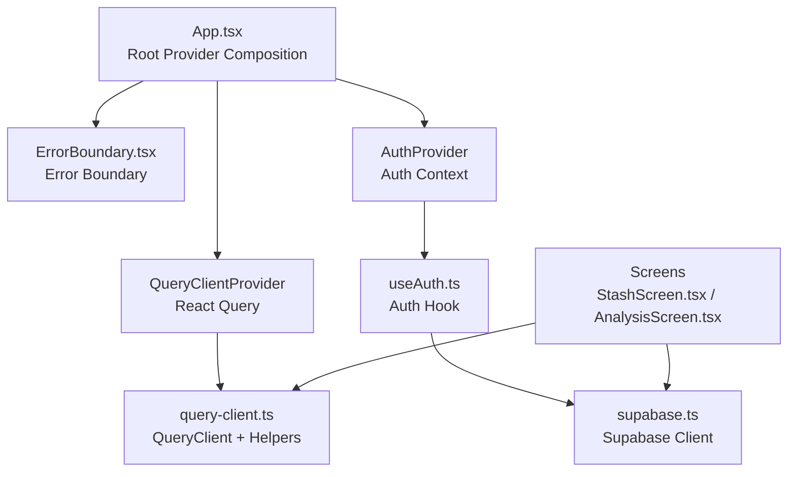
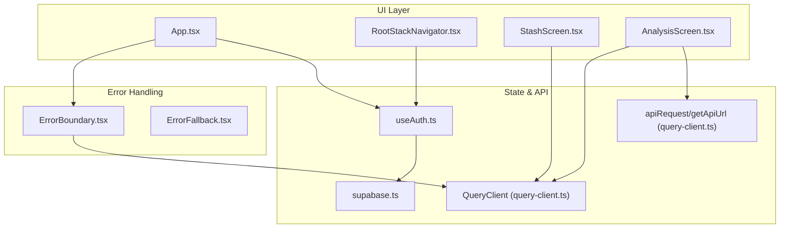
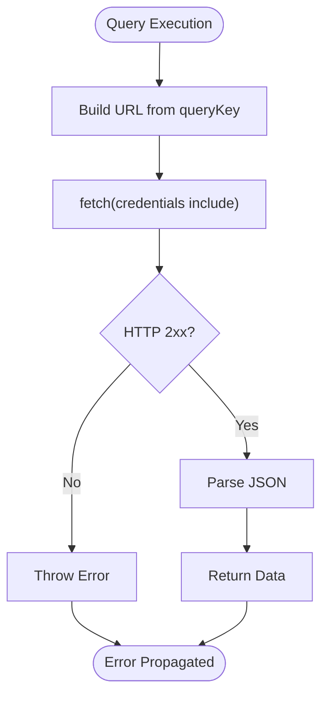
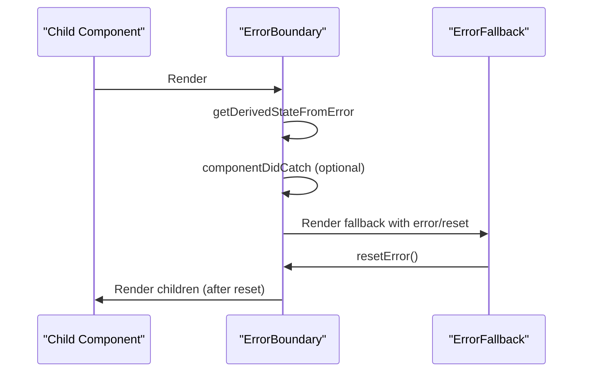
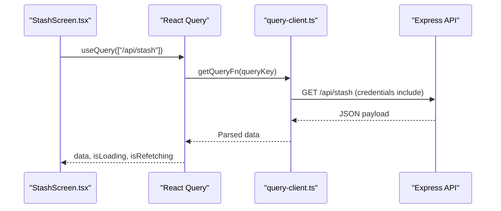
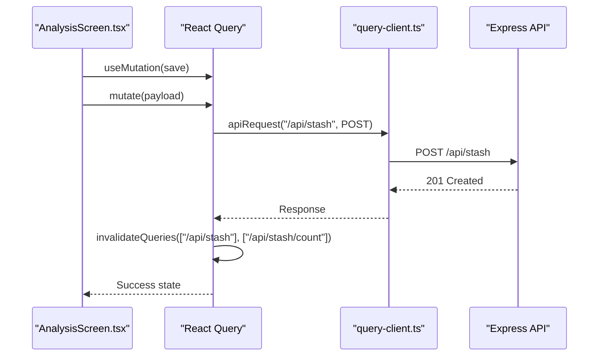
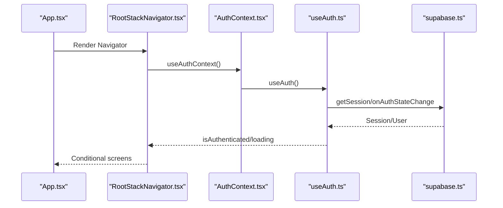
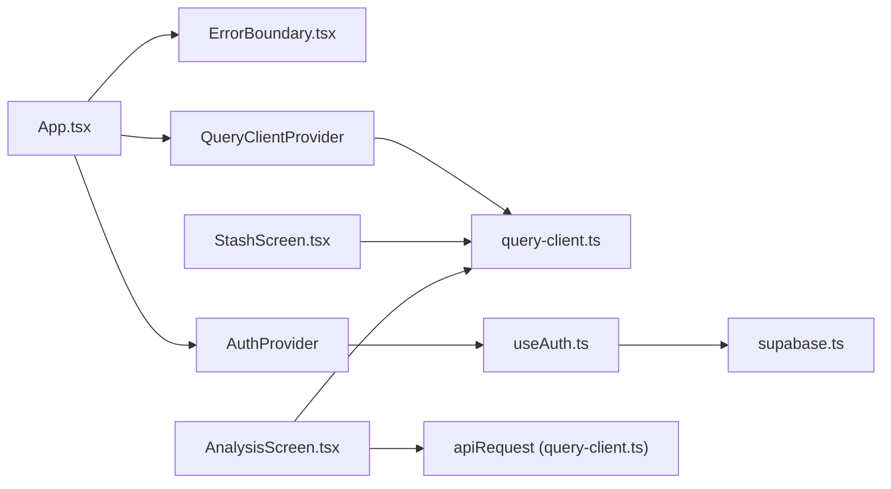

# State Management and API Integration

<cite>
**Referenced Files in This Document**
- [App.tsx](file://client/App.tsx)
- [ErrorBoundary.tsx](file://client/components/ErrorBoundary.tsx)
- [ErrorFallback.tsx](file://client/components/ErrorFallback.tsx)
- [query-client.ts](file://client/lib/query-client.ts)
- [supabase.ts](file://client/lib/supabase.ts)
- [useAuth.ts](file://client/hooks/useAuth.ts)
- [AuthContext.tsx](file://client/contexts/AuthContext.tsx)
- [RootStackNavigator.tsx](file://client/navigation/RootStackNavigator.tsx)
- [StashScreen.tsx](file://client/screens/StashScreen.tsx)
- [AnalysisScreen.tsx](file://client/screens/AnalysisScreen.tsx)
</cite>

## Table of Contents
1. [Introduction](#introduction)
2. [Project Structure](#project-structure)
3. [Core Components](#core-components)
4. [Architecture Overview](#architecture-overview)
5. [Detailed Component Analysis](#detailed-component-analysis)
6. [Dependency Analysis](#dependency-analysis)
7. [Performance Considerations](#performance-considerations)
8. [Troubleshooting Guide](#troubleshooting-guide)
9. [Conclusion](#conclusion)

## Introduction
This document explains the state management and API integration patterns implemented in the client application, focusing on React Query, error handling, and API client configuration. It covers:
- React Query setup with caching strategies, background updates, and optimistic updates
- Error boundary implementation and fallback components
- API client configuration, request/response handling, and caching patterns
- Loading states, error recovery mechanisms, and data synchronization strategies
- Practical examples of API integration patterns and the relationship between state management and component rendering

## Project Structure
The client application initializes global providers at the root level and organizes state management and API concerns across dedicated modules:
- Global providers: React Query, authentication, and error boundaries
- API clients: React Query helpers and Supabase
- Screens: Example usage of React Query for data fetching and mutations
- Navigation: Routing logic that depends on authentication state

**Diagram sources**
- [App.tsx](file://client/App.tsx#L30-L49)
- [ErrorBoundary.tsx](file://client/components/ErrorBoundary.tsx#L16-L54)
- [query-client.ts](file://client/lib/query-client.ts#L66-L79)
- [supabase.ts](file://client/lib/supabase.ts#L20-L38)
- [useAuth.ts](file://client/hooks/useAuth.ts#L12-L38)
- [StashScreen.tsx](file://client/screens/StashScreen.tsx#L98-L100)
- [AnalysisScreen.tsx](file://client/screens/AnalysisScreen.tsx#L8-L33)

**Section sources**
- [App.tsx](file://client/App.tsx#L30-L49)
- [query-client.ts](file://client/lib/query-client.ts#L66-L79)
- [supabase.ts](file://client/lib/supabase.ts#L20-L38)
- [useAuth.ts](file://client/hooks/useAuth.ts#L12-L38)

## Core Components
- React Query client and helpers:
  - Centralized base URL resolution and request helper
  - Generic query function with 401 handling
  - Global QueryClient with default caching and retry policies
- Authentication:
  - Supabase client initialization and session management
  - Auth hook exposing sign-in/sign-up/sign-out and Google OAuth
  - Auth provider and context for downstream components
- Error handling:
  - Class-based error boundary with customizable fallback
  - Fallback component with restart and dev details modal
- Screens:
  - StashScreen demonstrates data fetching, loading, and pull-to-refresh
  - AnalysisScreen demonstrates mutations, invalidation, and error handling

**Section sources**
- [query-client.ts](file://client/lib/query-client.ts#L7-L43)
- [query-client.ts](file://client/lib/query-client.ts#L46-L64)
- [query-client.ts](file://client/lib/query-client.ts#L66-L79)
- [supabase.ts](file://client/lib/supabase.ts#L20-L38)
- [useAuth.ts](file://client/hooks/useAuth.ts#L12-L151)
- [AuthContext.tsx](file://client/contexts/AuthContext.tsx#L19-L30)
- [ErrorBoundary.tsx](file://client/components/ErrorBoundary.tsx#L16-L54)
- [ErrorFallback.tsx](file://client/components/ErrorFallback.tsx#L22-L144)
- [StashScreen.tsx](file://client/screens/StashScreen.tsx#L98-L151)
- [AnalysisScreen.tsx](file://client/screens/AnalysisScreen.tsx#L40-L60)

## Architecture Overview
The application composes providers at the root and delegates API responsibilities to dedicated modules. React Query manages server state and caching, while Supabase handles authentication. Screens consume these services via React Query hooks and the auth context.

**Diagram sources**
- [App.tsx](file://client/App.tsx#L30-L49)
- [RootStackNavigator.tsx](file://client/navigation/RootStackNavigator.tsx#L32-L122)
- [StashScreen.tsx](file://client/screens/StashScreen.tsx#L98-L100)
- [AnalysisScreen.tsx](file://client/screens/AnalysisScreen.tsx#L8-L33)
- [query-client.ts](file://client/lib/query-client.ts#L26-L43)
- [useAuth.ts](file://client/hooks/useAuth.ts#L12-L38)
- [supabase.ts](file://client/lib/supabase.ts#L20-L38)
- [ErrorBoundary.tsx](file://client/components/ErrorBoundary.tsx#L16-L54)
- [ErrorFallback.tsx](file://client/components/ErrorFallback.tsx#L22-L144)

## Detailed Component Analysis

### React Query Setup and Caching Strategies
- Base URL resolution and request helper:
  - Centralizes domain configuration and request construction
  - Enforces credentials inclusion and JSON serialization when applicable
- Query function:
  - Builds URLs from query keys
  - Handles 401 responses according to policy ("throw" by default)
  - Ensures non-OK responses throw errors
- Global defaults:
  - Infinite stale time, no refetch on window focus, no periodic refetch
  - No retries for queries or mutations
  - Provides a single source of truth for caching and synchronization

**Diagram sources**
- [query-client.ts](file://client/lib/query-client.ts#L46-L64)

**Section sources**
- [query-client.ts](file://client/lib/query-client.ts#L7-L17)
- [query-client.ts](file://client/lib/query-client.ts#L26-L43)
- [query-client.ts](file://client/lib/query-client.ts#L46-L64)
- [query-client.ts](file://client/lib/query-client.ts#L66-L79)

### Error Boundary Implementation and Fallback Components
- ErrorBoundary:
  - Class component capturing rendering errors
  - Exposes reset callback and optional custom fallback
  - Invokes optional onError handler with error and stack
- ErrorFallback:
  - Dev-friendly modal displaying formatted error details
  - Restart button to reload the app
  - Lightweight UI with themed components

**Diagram sources**
- [ErrorBoundary.tsx](file://client/components/ErrorBoundary.tsx#L16-L54)
- [ErrorFallback.tsx](file://client/components/ErrorFallback.tsx#L22-L144)

**Section sources**
- [ErrorBoundary.tsx](file://client/components/ErrorBoundary.tsx#L16-L54)
- [ErrorFallback.tsx](file://client/components/ErrorFallback.tsx#L22-L144)

### API Client Configuration and Request/Response Handling
- Supabase client:
  - Initializes with environment-provided URL and key
  - Configures auth persistence and session handling per platform
  - Provides a singleton instance for the app
- Auth hook:
  - Loads initial session and subscribes to auth state changes
  - Implements sign-in, sign-up, sign-out, and Google OAuth
  - Handles browser redirect and token exchange on mobile/web
- StashScreen:
  - Uses React Query to fetch stash items
  - Renders loading, empty, and list states
  - Supports pull-to-refresh via refetch and isRefetching
- AnalysisScreen:
  - Uses a mutation to save items after analysis
  - Invalidates related queries to synchronize UI
  - Manages local loading/error states alongside mutation state

**Diagram sources**
- [StashScreen.tsx](file://client/screens/StashScreen.tsx#L98-L100)
- [query-client.ts](file://client/lib/query-client.ts#L46-L64)

**Section sources**
- [supabase.ts](file://client/lib/supabase.ts#L20-L38)
- [useAuth.ts](file://client/hooks/useAuth.ts#L12-L151)
- [StashScreen.tsx](file://client/screens/StashScreen.ts#L98-L151)
- [AnalysisScreen.tsx](file://client/screens/AnalysisScreen.tsx#L40-L60)

### Optimistic Updates and Data Synchronization
- Current implementation:
  - Mutations invalidate queries to synchronize state after save
  - No optimistic mutation updates are applied in the screens reviewed
- Recommended pattern:
  - Use mutation result to optimistically update lists
  - Rollback on error or merge server response on success
  - Invalidate queries to reconcile with server state

**Diagram sources**
- [AnalysisScreen.tsx](file://client/screens/AnalysisScreen.tsx#L40-L60)
- [query-client.ts](file://client/lib/query-client.ts#L26-L43)

**Section sources**
- [AnalysisScreen.tsx](file://client/screens/AnalysisScreen.tsx#L40-L60)
- [query-client.ts](file://client/lib/query-client.ts#L26-L43)

### Authentication Flow and Navigation Integration
- Auth provider exposes session, user, and auth methods
- Root navigator conditionally renders Auth or Main stacks based on authentication state
- Auth hook manages session persistence and OAuth redirects

**Diagram sources**
- [App.tsx](file://client/App.tsx#L30-L49)
- [RootStackNavigator.tsx](file://client/navigation/RootStackNavigator.tsx#L32-L41)
- [AuthContext.tsx](file://client/contexts/AuthContext.tsx#L19-L30)
- [useAuth.ts](file://client/hooks/useAuth.ts#L12-L38)
- [supabase.ts](file://client/lib/supabase.ts#L20-L38)

**Section sources**
- [AuthContext.tsx](file://client/contexts/AuthContext.tsx#L19-L30)
- [useAuth.ts](file://client/hooks/useAuth.ts#L12-L151)
- [RootStackNavigator.tsx](file://client/navigation/RootStackNavigator.tsx#L32-L41)

## Dependency Analysis
- Providers and composition:
  - App composes ErrorBoundary, QueryClientProvider, AuthProvider, and NavigationContainer
- QueryClient dependencies:
  - Query function depends on getApiUrl and throws on non-OK responses
  - Defaults disable refetch and retries globally
- Auth dependencies:
  - useAuth depends on Supabase client and platform-specific browser handling
- Screen dependencies:
  - StashScreen depends on React Query for data fetching
  - AnalysisScreen depends on React Query mutations and query invalidation

**Diagram sources**
- [App.tsx](file://client/App.tsx#L30-L49)
- [ErrorBoundary.tsx](file://client/components/ErrorBoundary.tsx#L16-L54)
- [query-client.ts](file://client/lib/query-client.ts#L66-L79)
- [useAuth.ts](file://client/hooks/useAuth.ts#L12-L38)
- [supabase.ts](file://client/lib/supabase.ts#L20-L38)
- [StashScreen.tsx](file://client/screens/StashScreen.tsx#L98-L100)
- [AnalysisScreen.tsx](file://client/screens/AnalysisScreen.tsx#L8-L33)

**Section sources**
- [App.tsx](file://client/App.tsx#L30-L49)
- [query-client.ts](file://client/lib/query-client.ts#L66-L79)
- [useAuth.ts](file://client/hooks/useAuth.ts#L12-L38)
- [supabase.ts](file://client/lib/supabase.ts#L20-L38)
- [StashScreen.tsx](file://client/screens/StashScreen.tsx#L98-L100)
- [AnalysisScreen.tsx](file://client/screens/AnalysisScreen.tsx#L8-L33)

## Performance Considerations
- Caching strategy:
  - Infinite stale time reduces unnecessary refetches but requires explicit invalidation
  - Disable refetchOnWindowFocus and refetchInterval to minimize background work
- Retry policy:
  - Disabled globally to avoid noisy network behavior; consider enabling selectively for idempotent reads
- Network requests:
  - Use apiRequest for consistent headers and credential handling
  - Prefer query keys that uniquely identify resources to prevent cache collisions

[No sources needed since this section provides general guidance]

## Troubleshooting Guide
- Environment configuration:
  - Ensure EXPO_PUBLIC_DOMAIN is set for API base URL resolution
  - Verify EXPO_PUBLIC_SUPABASE_URL and EXPO_PUBLIC_SUPABASE_ANON_KEY for authentication
- Error boundary:
  - Use the fallback modal to inspect error details in development
  - Trigger restart to recover from persistent UI errors
- Query errors:
  - Non-OK responses throw errors; handle via React Query error states or global error handling
  - Confirm credentials are included for protected endpoints
- Auth issues:
  - Check session persistence and OAuth redirect handling on web vs. native platforms

**Section sources**
- [query-client.ts](file://client/lib/query-client.ts#L7-L17)
- [supabase.ts](file://client/lib/supabase.ts#L6-L9)
- [ErrorFallback.tsx](file://client/components/ErrorFallback.tsx#L26-L33)
- [ErrorBoundary.tsx](file://client/components/ErrorBoundary.tsx#L32-L36)

## Conclusion
The application establishes a robust foundation for state management and API integration:
- React Query centralizes caching and synchronization with conservative defaults
- Error boundaries and fallbacks improve resilience and developer experience
- Supabase provides secure, cross-platform authentication
- Screens demonstrate practical patterns for data fetching, loading states, and mutations
Future enhancements can introduce optimistic updates and selective retries to further refine UX and performance.