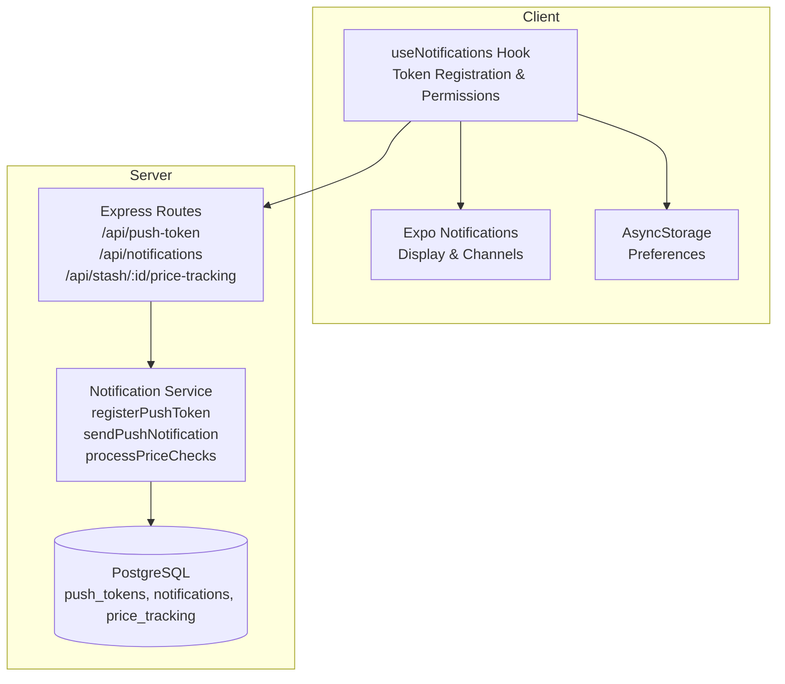
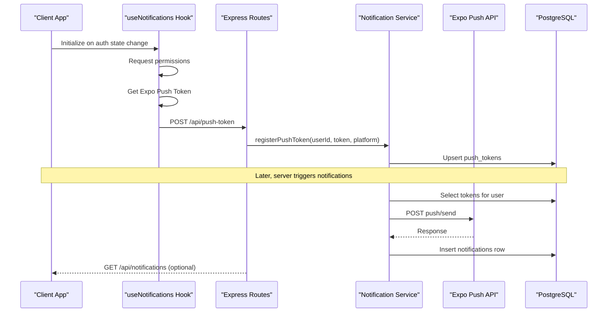
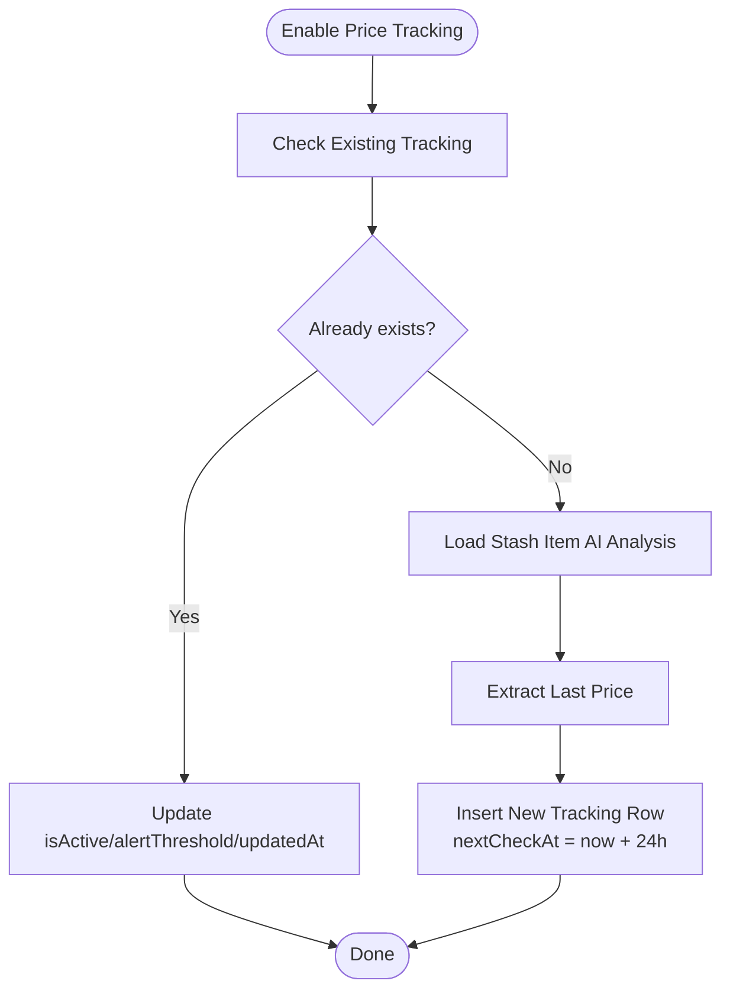
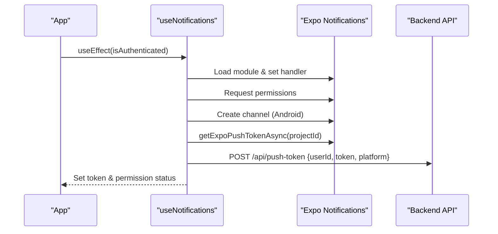
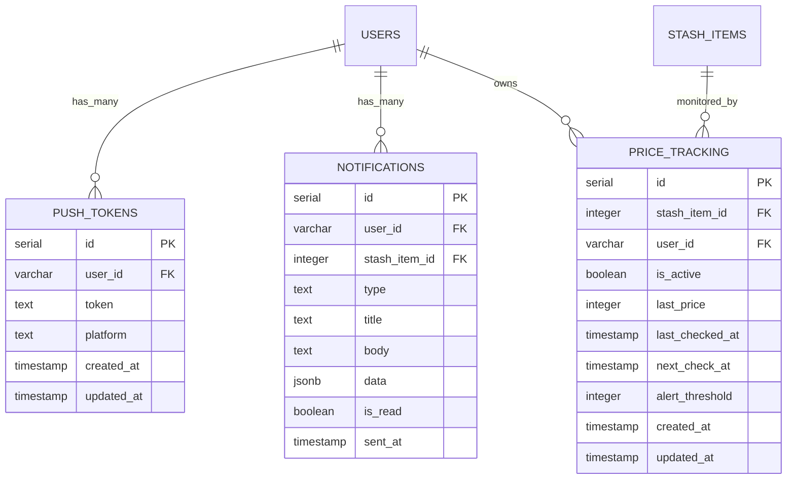
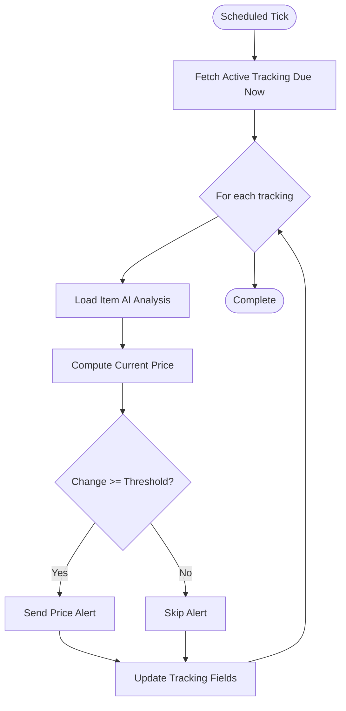
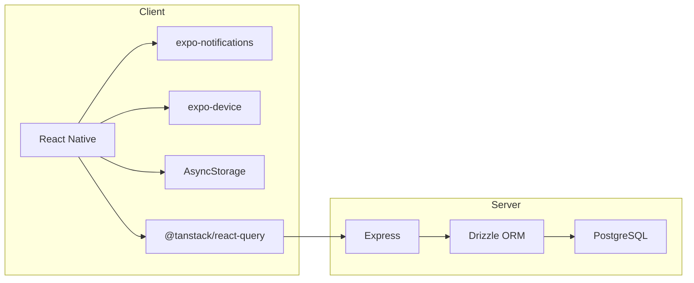

# Notifications System

<cite>
**Referenced Files in This Document**
- [notification.ts](file://server/services/notification.ts)
- [routes.ts](file://server/routes.ts)
- [schema.ts](file://shared/schema.ts)
- [useNotifications.ts](file://client/hooks/useNotifications.ts)
- [query-client.ts](file://client/lib/query-client.ts)
- [package.json](file://package.json)
- [SettingsScreen.tsx](file://client/screens/SettingsScreen.tsx)
</cite>

## Table of Contents
1. [Introduction](#introduction)
2. [Project Structure](#project-structure)
3. [Core Components](#core-components)
4. [Architecture Overview](#architecture-overview)
5. [Detailed Component Analysis](#detailed-component-analysis)
6. [Dependency Analysis](#dependency-analysis)
7. [Performance Considerations](#performance-considerations)
8. [Troubleshooting Guide](#troubleshooting-guide)
9. [Conclusion](#conclusion)

## Introduction
This document describes Hidden-Gem's push notification and alert management system. It covers the complete lifecycle from client-side token registration and permission handling to server-side delivery via Expo Push and price tracking alerting. The system supports both iOS and Android platforms, integrates with Firebase Cloud Messaging through Expo's infrastructure, and provides scheduling for price tracking alerts and user-specific notifications. The documentation also outlines client-side handling with Expo Notifications, permission management, and notification display customization.

## Project Structure
The notifications system spans three primary areas:
- Server-side notification service and scheduling
- API routes for token management and notification retrieval
- Client-side hook for token registration, permissions, and display

**Diagram sources**
- [useNotifications.ts](file://client/hooks/useNotifications.ts#L1-L137)
- [routes.ts](file://server/routes.ts#L44-L182)
- [notification.ts](file://server/services/notification.ts#L1-L414)
- [schema.ts](file://shared/schema.ts#L258-L293)

**Section sources**
- [useNotifications.ts](file://client/hooks/useNotifications.ts#L1-L137)
- [routes.ts](file://server/routes.ts#L44-L182)
- [notification.ts](file://server/services/notification.ts#L1-L414)
- [schema.ts](file://shared/schema.ts#L258-L293)

## Core Components
- Server-side notification service: registers tokens, sends notifications, manages price tracking, and schedules periodic checks.
- API routes: expose endpoints for token registration/unregistration, notification history, read status, and price tracking controls.
- Client-side hook: handles permission requests, token acquisition, registration, and local preferences.
- Database schema: defines tables for push tokens, notifications, and price tracking.

Key responsibilities:
- Token lifecycle: register, update, and remove push tokens per user and device.
- Delivery pipeline: send notifications to all user devices and persist delivery metadata.
- Price tracking: monitor item value changes and emit alerts when thresholds are exceeded.
- Client UX: request permissions, configure channels (Android), and surface notification preferences.

**Section sources**
- [notification.ts](file://server/services/notification.ts#L31-L67)
- [routes.ts](file://server/routes.ts#L46-L72)
- [schema.ts](file://shared/schema.ts#L258-L293)
- [useNotifications.ts](file://client/hooks/useNotifications.ts#L57-L75)

## Architecture Overview
The system integrates client and server components to deliver timely, user-targeted notifications.

**Diagram sources**
- [useNotifications.ts](file://client/hooks/useNotifications.ts#L77-L128)
- [routes.ts](file://server/routes.ts#L46-L72)
- [notification.ts](file://server/services/notification.ts#L31-L129)
- [schema.ts](file://shared/schema.ts#L258-L293)

## Detailed Component Analysis

### Server-Side Notification Service
The service encapsulates all server logic for push notifications and price tracking.

- Token management:
  - Registers tokens with platform identification.
  - Updates timestamps on reuse.
  - Removes tokens on logout/unlink.

- Notification delivery:
  - Resolves all tokens for a user.
  - Builds batched messages with high priority and default sound.
  - Sends via Expo Push API and persists notification records.

- Price tracking:
  - Enables/disables tracking with configurable alert thresholds.
  - Stores last observed price and scheduling fields.
  - Periodic processor evaluates price changes and emits alerts.

**Diagram sources**
- [notification.ts](file://server/services/notification.ts#L162-L223)

**Section sources**
- [notification.ts](file://server/services/notification.ts#L31-L67)
- [notification.ts](file://server/services/notification.ts#L72-L129)
- [notification.ts](file://server/services/notification.ts#L162-L223)
- [notification.ts](file://server/services/notification.ts#L332-L413)

### API Routes
The server exposes REST endpoints for:
- Token management: POST and DELETE /api/push-token
- Notification history: GET /api/notifications and GET /api/notifications/unread-count
- Read status: POST /api/notifications/:id/read and POST /api/notifications/read-all
- Price tracking: POST/DELETE/GET /api/stash/:id/price-tracking

These routes delegate to the notification service and enforce minimal validation.

**Section sources**
- [routes.ts](file://server/routes.ts#L46-L72)
- [routes.ts](file://server/routes.ts#L74-L129)
- [routes.ts](file://server/routes.ts#L132-L182)

### Client-Side Notification Handling
The client hook manages:
- Permission requests and status tracking.
- Android channel creation for reliable delivery.
- Token acquisition via Expo SDK and registration with the backend.
- Local preference storage to opt out of notifications.
- Listener attachment for received and response events.

**Diagram sources**
- [useNotifications.ts](file://client/hooks/useNotifications.ts#L10-L49)
- [useNotifications.ts](file://client/hooks/useNotifications.ts#L77-L128)

**Section sources**
- [useNotifications.ts](file://client/hooks/useNotifications.ts#L10-L49)
- [useNotifications.ts](file://client/hooks/useNotifications.ts#L57-L75)
- [useNotifications.ts](file://client/hooks/useNotifications.ts#L77-L128)

### Database Schema
The schema defines three tables central to notifications:
- push_tokens: stores user device tokens with platform metadata.
- notifications: logs sent notifications with read status and payload.
- price_tracking: tracks monitored items, thresholds, and scheduling.

**Diagram sources**
- [schema.ts](file://shared/schema.ts#L258-L293)

**Section sources**
- [schema.ts](file://shared/schema.ts#L258-L293)

### Notification Formatting and Delivery
- Formatting: Titles and bodies are constructed server-side based on event type (price increase/drop). Payloads include structured data for client-side routing.
- Delivery: Messages are sent as a batch to all user tokens with high priority and default sound. Responses are logged and stored as notification records.

**Section sources**
- [notification.ts](file://server/services/notification.ts#L134-L157)
- [notification.ts](file://server/services/notification.ts#L89-L129)

### Price Tracking System
- Configuration: Users can enable/disable tracking and set alert thresholds per item.
- Monitoring: A scheduled job (cron-compatible) evaluates tracked items, compares current vs. last price, and emits alerts when thresholds are met.
- Scheduling: Next check is set to 24 hours after successful evaluation.

**Diagram sources**
- [notification.ts](file://server/services/notification.ts#L332-L413)

**Section sources**
- [notification.ts](file://server/services/notification.ts#L162-L223)
- [notification.ts](file://server/services/notification.ts#L332-L413)

### Client-Side Preferences and Display
- Preferences: A local preference key controls whether the client attempts to register tokens and request permissions.
- Android channel: Ensures consistent vibration pattern and light color for notification delivery.
- Display: The notification handler is preconfigured to show alerts, play sounds, badge counts, banners, and list entries.

**Section sources**
- [useNotifications.ts](file://client/hooks/useNotifications.ts#L85-L86)
- [useNotifications.ts](file://client/hooks/useNotifications.ts#L34-L41)
- [useNotifications.ts](file://client/hooks/useNotifications.ts#L16-L24)

## Dependency Analysis
- Client dependencies:
  - expo-notifications for native notification APIs.
  - expo-device for device capability checks.
  - AsyncStorage for user preferences.
  - @tanstack/react-query for API requests.

- Server dependencies:
  - Drizzle ORM for database operations.
  - Express for HTTP endpoints.
  - PostgreSQL for persistence.

**Diagram sources**
- [package.json](file://package.json#L24-L76)
- [useNotifications.ts](file://client/hooks/useNotifications.ts#L1-L137)
- [routes.ts](file://server/routes.ts#L1-L37)

**Section sources**
- [package.json](file://package.json#L24-L76)
- [useNotifications.ts](file://client/hooks/useNotifications.ts#L1-L137)
- [routes.ts](file://server/routes.ts#L1-L37)

## Performance Considerations
- Batch delivery: Sending a single batch to multiple tokens reduces network overhead compared to per-device requests.
- Scheduling cadence: Price checks are spaced 24 hours apart to minimize unnecessary evaluations.
- Conditional processing: Checks are skipped when prices are unavailable, reducing wasted work.
- Database indexing: Consider adding indexes on push_tokens(userId), notifications(userId, sent_at), and price_tracking(nextCheckAt) for improved query performance.

## Troubleshooting Guide
Common issues and resolutions:
- No push tokens found: Verify client registration succeeded and the user is authenticated. Check API responses and server logs.
- Permission denied: Ensure the client requested and received permission before attempting token registration.
- Android delivery issues: Confirm the default notification channel was created and the project ID is correctly configured.
- Price alerts not firing: Validate the alert threshold and confirm the scheduled tick runs and processes items due for evaluation.
- Notification read status: Use the read endpoints to mark notifications as read and verify counts.

Operational checks:
- Confirm API endpoints are reachable and return expected responses.
- Inspect server logs for errors during token registration or push delivery.
- Validate database rows for push_tokens and notifications to ensure persistence.

**Section sources**
- [routes.ts](file://server/routes.ts#L46-L72)
- [notification.ts](file://server/services/notification.ts#L78-L129)
- [useNotifications.ts](file://client/hooks/useNotifications.ts#L85-L101)

## Conclusion
Hidden-Gem’s notifications system provides a robust foundation for delivering timely alerts across iOS and Android devices. It leverages Expo’s push infrastructure, maintains user preferences, and offers a scalable price tracking mechanism with configurable thresholds. The modular design separates client-side UX concerns from server-side delivery and scheduling, enabling future enhancements such as analytics capture, richer notification templates, and expanded marketplace update channels.