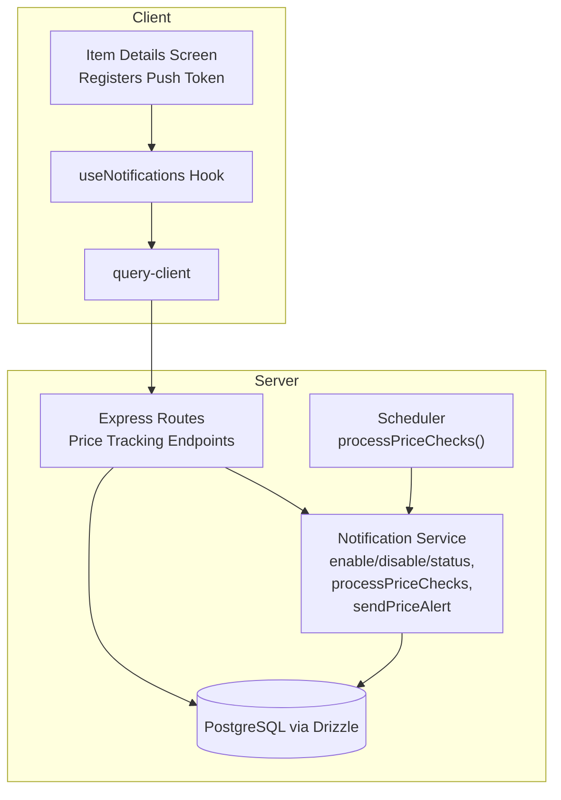
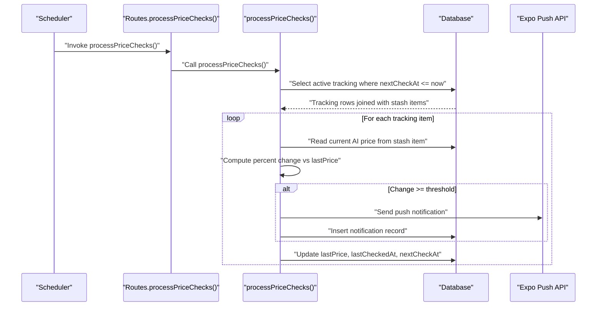
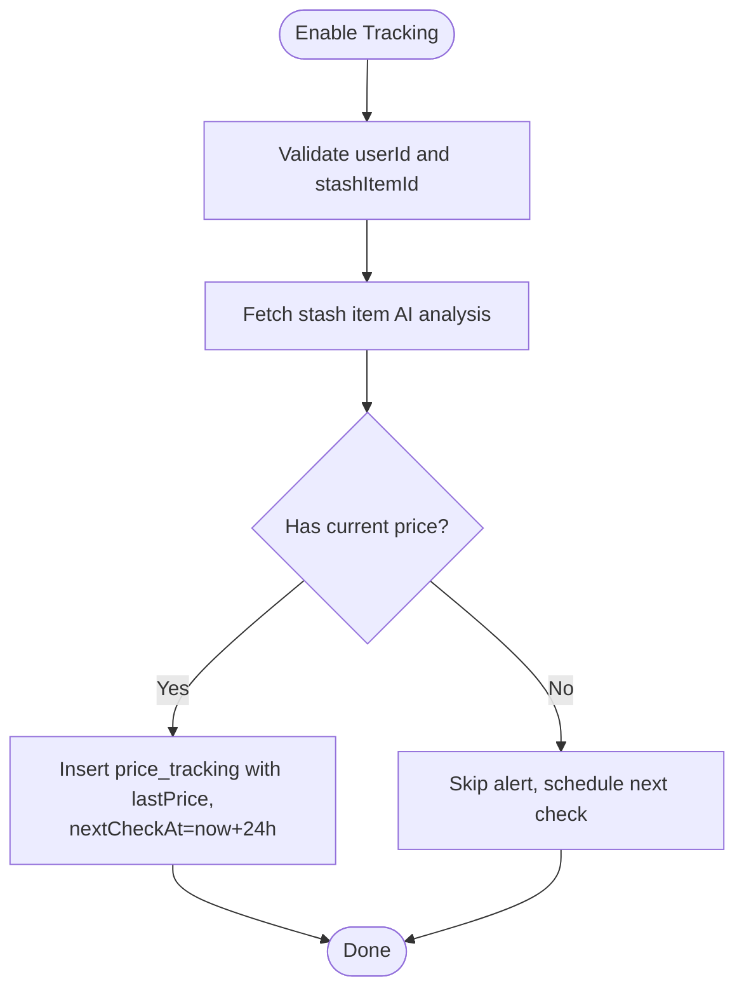
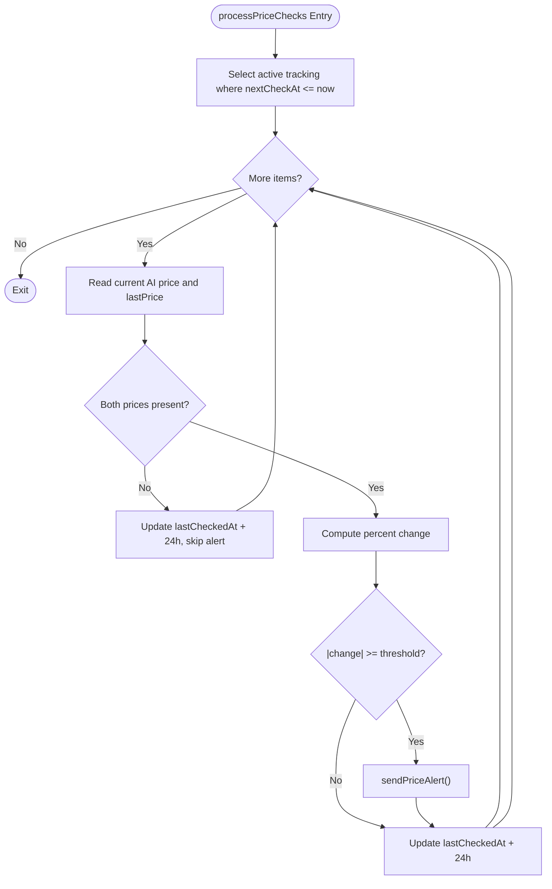
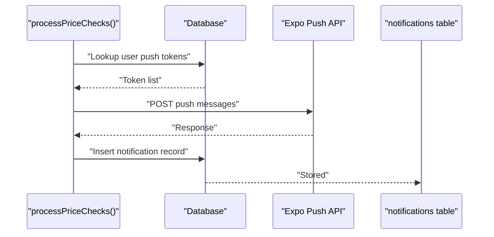
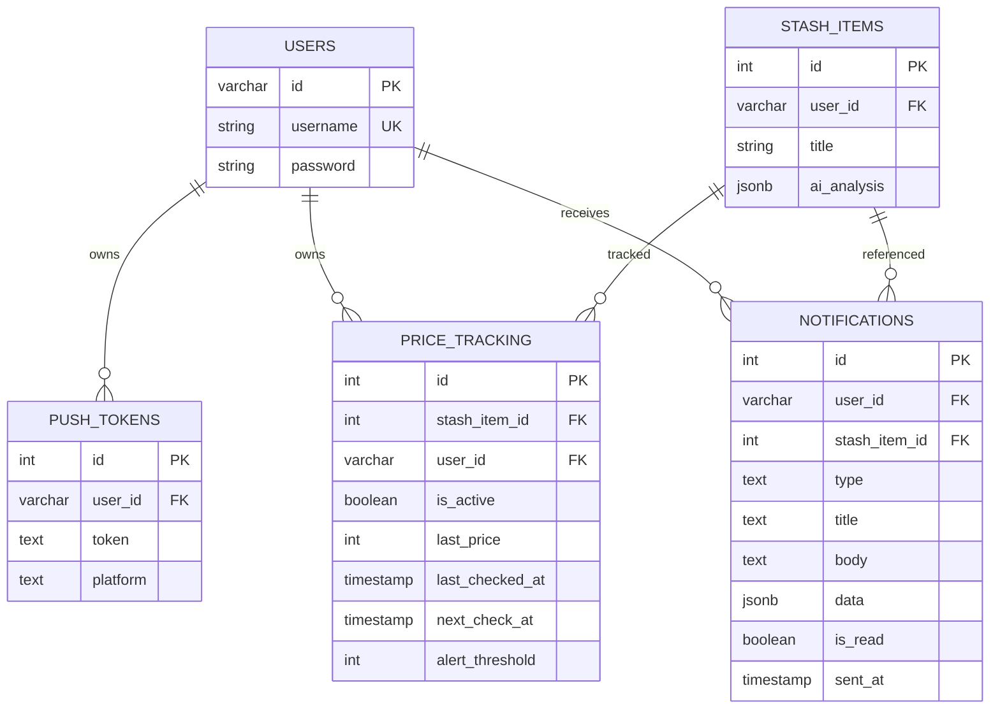
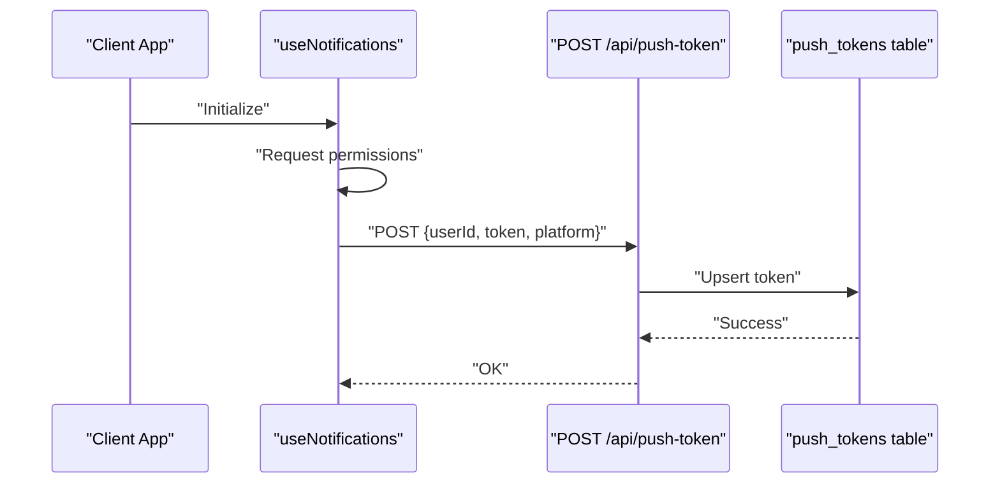
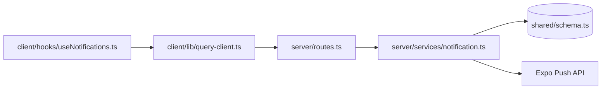

# Price Tracking Alerts

<cite>
**Referenced Files in This Document**
- [server/index.ts](file://server/index.ts)
- [server/services/notification.ts](file://server/services/notification.ts)
- [server/routes.ts](file://server/routes.ts)
- [shared/schema.ts](file://shared/schema.ts)
- [client/hooks/useNotifications.ts](file://client/hooks/useNotifications.ts)
- [client/lib/query-client.ts](file://client/lib/query-client.ts)
</cite>

## Table of Contents
1. [Introduction](#introduction)
2. [Project Structure](#project-structure)
3. [Core Components](#core-components)
4. [Architecture Overview](#architecture-overview)
5. [Detailed Component Analysis](#detailed-component-analysis)
6. [Dependency Analysis](#dependency-analysis)
7. [Performance Considerations](#performance-considerations)
8. [Troubleshooting Guide](#troubleshooting-guide)
9. [Conclusion](#conclusion)

## Introduction
This document explains Hidden-Gem’s price tracking and alert system. It covers configuration of alert thresholds, enabling/disabling tracking, automated monitoring, database schema, alert notification delivery, and backend processing. It also provides practical examples for enabling tracking, setting thresholds, and understanding how price change alerts are triggered and delivered.

## Project Structure
The price tracking system spans the backend server, database schema, and the mobile client:
- Backend server initializes a scheduler and exposes REST endpoints for price tracking.
- The notification service encapsulates price monitoring, alert calculation, and push notification delivery.
- The database schema defines tracking records, price history fields, and notification history.
- The client registers push tokens and integrates with the backend APIs.

**Diagram sources**
- [server/index.ts](file://server/index.ts#L247-L258)
- [server/routes.ts](file://server/routes.ts#L132-L182)
- [server/services/notification.ts](file://server/services/notification.ts#L162-L223)
- [shared/schema.ts](file://shared/schema.ts#L269-L280)
- [client/hooks/useNotifications.ts](file://client/hooks/useNotifications.ts#L51-L128)
- [client/lib/query-client.ts](file://client/lib/query-client.ts#L26-L43)

**Section sources**
- [server/index.ts](file://server/index.ts#L247-L258)
- [server/routes.ts](file://server/routes.ts#L132-L182)
- [server/services/notification.ts](file://server/services/notification.ts#L162-L223)
- [shared/schema.ts](file://shared/schema.ts#L269-L280)
- [client/hooks/useNotifications.ts](file://client/hooks/useNotifications.ts#L51-L128)
- [client/lib/query-client.ts](file://client/lib/query-client.ts#L26-L43)

## Core Components
- Price tracking configuration:
  - Enable tracking with an alert threshold.
  - Disable tracking.
  - Retrieve tracking status (active flag and threshold).
- Automated monitoring:
  - Scheduled job runs every six hours to check tracked items.
  - Calculates percentage change against stored last price.
  - Triggers alerts when change meets or exceeds threshold.
- Notification delivery:
  - Sends push notifications via Expo.
  - Stores notification metadata in the database.
- Database schema:
  - Tracks items, prices, thresholds, and scheduling fields.
  - Stores notification history.

**Section sources**
- [server/services/notification.ts](file://server/services/notification.ts#L162-L223)
- [server/services/notification.ts](file://server/services/notification.ts#L228-L241)
- [server/services/notification.ts](file://server/services/notification.ts#L246-L269)
- [server/services/notification.ts](file://server/services/notification.ts#L332-L413)
- [shared/schema.ts](file://shared/schema.ts#L269-L280)

## Architecture Overview
The system uses a scheduled job to periodically evaluate price tracking records and compare current AI-derived prices against stored baseline values. When a significant change is detected, a push notification is sent to the user’s registered devices.

**Diagram sources**
- [server/index.ts](file://server/index.ts#L247-L258)
- [server/routes.ts](file://server/routes.ts#L132-L182)
- [server/services/notification.ts](file://server/services/notification.ts#L332-L413)
- [shared/schema.ts](file://shared/schema.ts#L269-L280)

## Detailed Component Analysis

### Price Tracking Configuration
- Enabling tracking:
  - Endpoint: POST /api/stash/:id/price-tracking
  - Accepts: alertThreshold (optional, defaults to 10)
  - Behavior: Creates a new tracking record with initial lastPrice from AI analysis and schedules the first check for 24 hours later.
- Disabling tracking:
  - Endpoint: DELETE /api/stash/:id/price-tracking
  - Behavior: Sets isActive to false and updates timestamps.
- Retrieving status:
  - Endpoint: GET /api/stash/:id/price-tracking
  - Returns: isActive and alertThreshold.

**Diagram sources**
- [server/routes.ts](file://server/routes.ts#L132-L148)
- [server/services/notification.ts](file://server/services/notification.ts#L162-L223)

**Section sources**
- [server/routes.ts](file://server/routes.ts#L132-L148)
- [server/services/notification.ts](file://server/services/notification.ts#L162-L223)

### Automated Price Monitoring
- Scheduling:
  - A Node.js interval triggers processPriceChecks every six hours.
- Evaluation logic:
  - Selects active tracking entries whose nextCheckAt is due.
  - Reads current price from stash item AI analysis.
  - Computes percentage change versus lastPrice.
  - Compares absolute change to alertThreshold.
  - Updates tracking fields after evaluation.

**Diagram sources**
- [server/index.ts](file://server/index.ts#L247-L258)
- [server/services/notification.ts](file://server/services/notification.ts#L332-L413)

**Section sources**
- [server/index.ts](file://server/index.ts#L247-L258)
- [server/services/notification.ts](file://server/services/notification.ts#L332-L413)

### Price Alert Notification Delivery
- Detection:
  - Increase vs decrease is determined by sign of price delta.
- Formatting:
  - Title indicates direction (increase/drop).
  - Body includes percent change and new price.
- Delivery:
  - Uses Expo Push API to send to all tokens registered for the user.
  - Persists notification metadata in the notifications table.

**Diagram sources**
- [server/services/notification.ts](file://server/services/notification.ts#L134-L157)
- [server/services/notification.ts](file://server/services/notification.ts#L72-L129)
- [shared/schema.ts](file://shared/schema.ts#L283-L293)

**Section sources**
- [server/services/notification.ts](file://server/services/notification.ts#L134-L157)
- [server/services/notification.ts](file://server/services/notification.ts#L72-L129)
- [shared/schema.ts](file://shared/schema.ts#L283-L293)

### Price Tracking Database Schema
The schema supports:
- Tracking records with scheduling and thresholds.
- Notification history with read state.
- Push tokens for multi-device delivery.

**Diagram sources**
- [shared/schema.ts](file://shared/schema.ts#L6-L12)
- [shared/schema.ts](file://shared/schema.ts#L29-L50)
- [shared/schema.ts](file://shared/schema.ts#L259-L266)
- [shared/schema.ts](file://shared/schema.ts#L269-L280)
- [shared/schema.ts](file://shared/schema.ts#L283-L293)

**Section sources**
- [shared/schema.ts](file://shared/schema.ts#L259-L280)
- [shared/schema.ts](file://shared/schema.ts#L283-L293)

### Client Integration and User Preferences
- Push token registration:
  - The client requests permission and registers tokens with the backend.
  - Tokens are associated with the user and platform.
- Notification preferences:
  - The hook respects a user preference to enable or disable notifications.

**Diagram sources**
- [client/hooks/useNotifications.ts](file://client/hooks/useNotifications.ts#L51-L128)
- [server/routes.ts](file://server/routes.ts#L46-L58)
- [shared/schema.ts](file://shared/schema.ts#L259-L266)

**Section sources**
- [client/hooks/useNotifications.ts](file://client/hooks/useNotifications.ts#L51-L128)
- [server/routes.ts](file://server/routes.ts#L46-L58)
- [shared/schema.ts](file://shared/schema.ts#L259-L266)

## Dependency Analysis
- Backend dependencies:
  - Drizzle ORM for database operations.
  - PostgreSQL for persistence.
  - Expo Push API for cross-platform notifications.
- Client dependencies:
  - Expo Notifications for device permissions and token retrieval.
  - React Query for API communication.

**Diagram sources**
- [server/routes.ts](file://server/routes.ts#L132-L182)
- [server/services/notification.ts](file://server/services/notification.ts#L162-L223)
- [shared/schema.ts](file://shared/schema.ts#L269-L280)
- [client/hooks/useNotifications.ts](file://client/hooks/useNotifications.ts#L51-L128)
- [client/lib/query-client.ts](file://client/lib/query-client.ts#L26-L43)

**Section sources**
- [server/routes.ts](file://server/routes.ts#L132-L182)
- [server/services/notification.ts](file://server/services/notification.ts#L162-L223)
- [shared/schema.ts](file://shared/schema.ts#L269-L280)
- [client/hooks/useNotifications.ts](file://client/hooks/useNotifications.ts#L51-L128)
- [client/lib/query-client.ts](file://client/lib/query-client.ts#L26-L43)

## Performance Considerations
- Batch evaluation:
  - The scheduler evaluates all due tracking entries in a single pass; ensure indexes on isActive, nextCheckAt, and foreign keys are maintained.
- Network efficiency:
  - Use minimal payload sizes for push notifications and avoid redundant token lookups.
- Retry and resilience:
  - The service logs errors during price checks; consider adding retry logic or dead-letter handling for transient failures.
- Scalability:
  - Consider moving to a dedicated job queue (e.g., BullMQ) for precise scheduling and concurrency control.

[No sources needed since this section provides general guidance]

## Troubleshooting Guide
- No alerts despite price changes:
  - Verify tracking is active and threshold is set appropriately.
  - Confirm nextCheckAt is due and the scheduler is running.
  - Check that current and last prices are present in stash item AI analysis.
- Notifications not received:
  - Ensure push tokens are registered and permissions are granted.
  - Validate the Expo Push API response and error logs.
- API errors:
  - Review server logs for 5xx responses and malformed requests.

**Section sources**
- [server/services/notification.ts](file://server/services/notification.ts#L332-L413)
- [server/routes.ts](file://server/routes.ts#L132-L182)
- [client/hooks/useNotifications.ts](file://client/hooks/useNotifications.ts#L51-L128)

## Conclusion
Hidden-Gem’s price tracking system combines scheduled monitoring, configurable thresholds, and reliable push notifications to keep users informed of significant price movements. The modular design separates concerns between the scheduler, service logic, and persistence, while the client handles token registration and user preferences. Extending the system can involve adjusting scheduling cadence, refining alert thresholds, and integrating richer analytics from AI analysis.