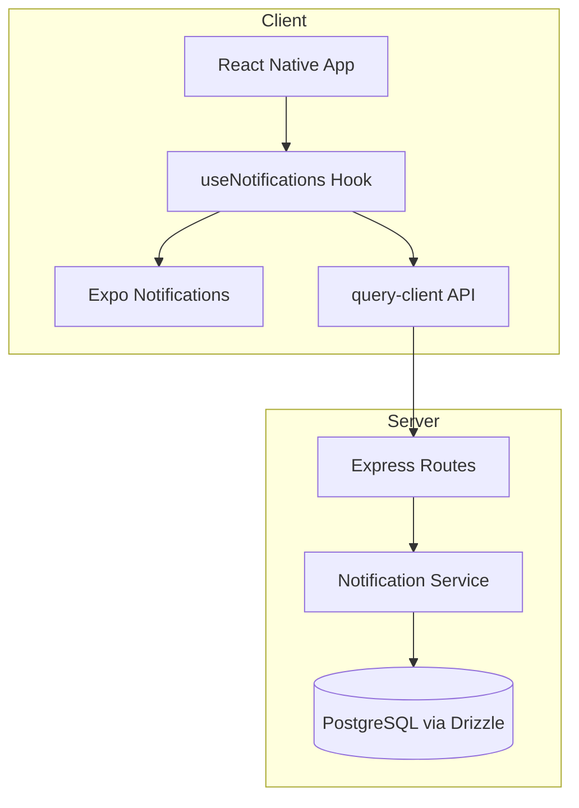
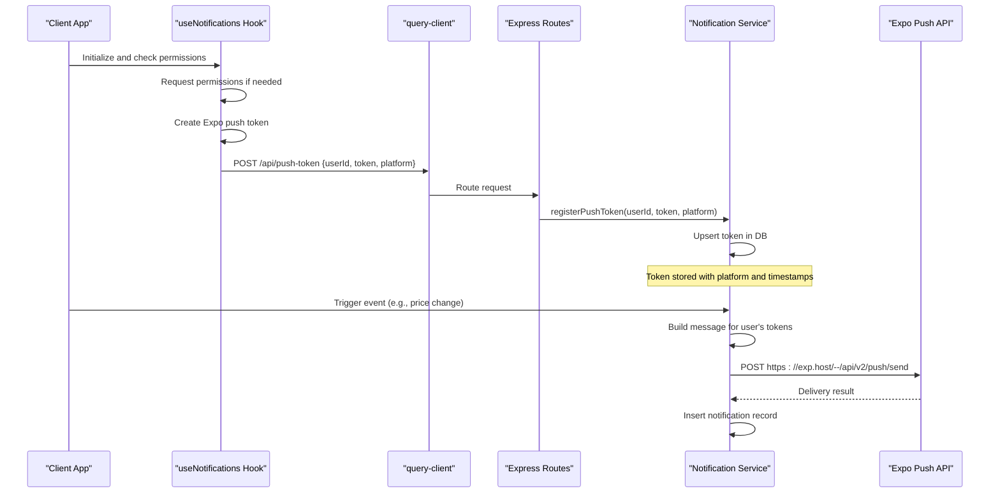
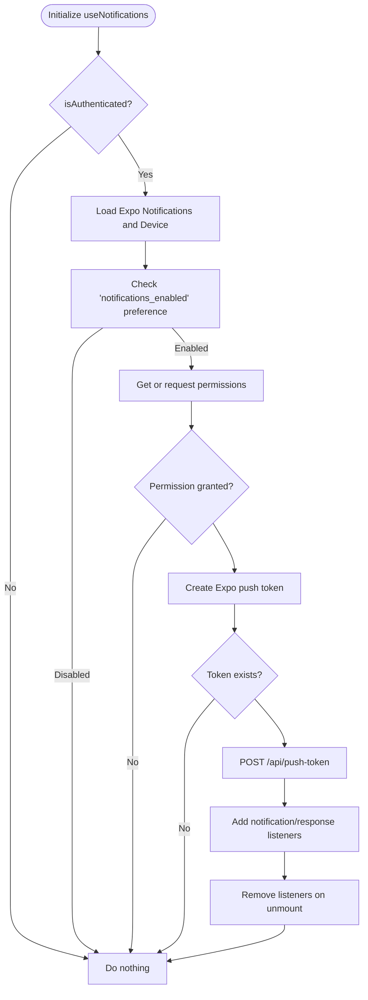
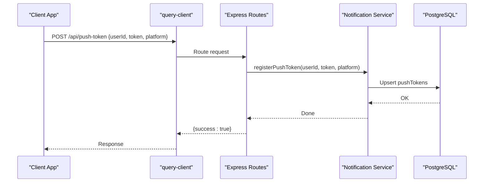
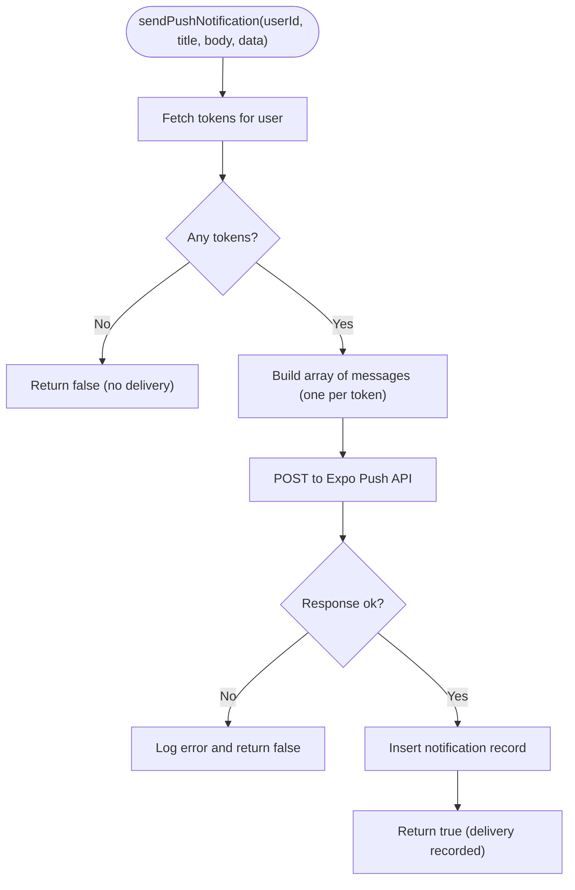
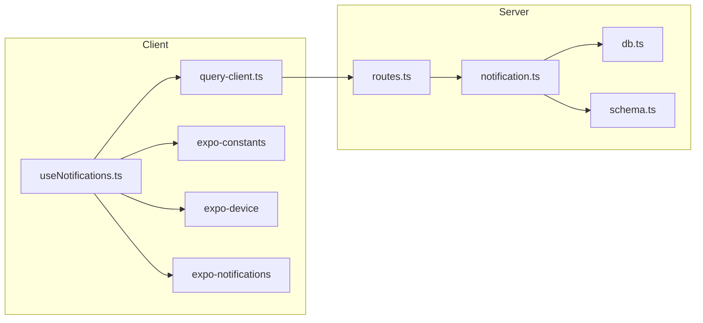

# Push Notifications

<cite>
**Referenced Files in This Document**
- [useNotifications.ts](file://client/hooks/useNotifications.ts)
- [query-client.ts](file://client/lib/query-client.ts)
- [notification.ts](file://server/services/notification.ts)
- [routes.ts](file://server/routes.ts)
- [schema.ts](file://shared/schema.ts)
- [db.ts](file://server/db.ts)
- [app.json](file://app.json)
- [package.json](file://package.json)
</cite>

## Table of Contents
1. [Introduction](#introduction)
2. [Project Structure](#project-structure)
3. [Core Components](#core-components)
4. [Architecture Overview](#architecture-overview)
5. [Detailed Component Analysis](#detailed-component-analysis)
6. [Dependency Analysis](#dependency-analysis)
7. [Performance Considerations](#performance-considerations)
8. [Troubleshooting Guide](#troubleshooting-guide)
9. [Conclusion](#conclusion)
10. [Appendices](#appendices)

## Introduction
This document explains Hidden-Gem’s real-time alert system built on Expo Push. It covers how clients register push tokens across iOS, Android, and Web, how the backend stores tokens and sends notifications via the Expo Push API, how messages are formatted and tracked, and how the frontend handles permissions, displays notifications, and integrates with the app. It also documents notification types (general alerts, price changes, and marketplace updates) and provides integration patterns for the frontend.

## Project Structure
The push notification system spans three layers:
- Client-side React Native/Expo module that requests permissions, obtains tokens, and registers/unregisters them with the backend.
- Backend Express routes and services that persist tokens, send push messages to Expo, and manage notification history.
- Shared database schema that defines token storage, notification history, and price tracking.

**Diagram sources**
- [useNotifications.ts](file://client/hooks/useNotifications.ts#L51-L136)
- [query-client.ts](file://client/lib/query-client.ts#L26-L43)
- [routes.ts](file://server/routes.ts#L44-L107)
- [notification.ts](file://server/services/notification.ts#L28-L129)
- [db.ts](file://server/db.ts#L1-L19)

**Section sources**
- [useNotifications.ts](file://client/hooks/useNotifications.ts#L1-L137)
- [query-client.ts](file://client/lib/query-client.ts#L1-L80)
- [routes.ts](file://server/routes.ts#L44-L107)
- [notification.ts](file://server/services/notification.ts#L1-L414)
- [schema.ts](file://shared/schema.ts#L258-L293)
- [db.ts](file://server/db.ts#L1-L19)

## Core Components
- Client-side token lifecycle and permission handling:
  - Requests notification permissions.
  - Creates an Expo push token per device.
  - Registers the token with the backend and unregisters on demand.
  - Stores preferences locally to avoid repeated prompts.
- Backend token management and delivery:
  - Registers/unregisters tokens linked to user IDs and platform.
  - Sends batch push notifications to all user tokens via Expo Push API.
  - Persists notification metadata for history and read tracking.
- Schema and storage:
  - pushTokens table stores tokens with platform and timestamps.
  - notifications table stores sent messages and read state.
  - priceTracking table supports periodic price-change alerts.

**Section sources**
- [useNotifications.ts](file://client/hooks/useNotifications.ts#L51-L136)
- [notification.ts](file://server/services/notification.ts#L28-L129)
- [schema.ts](file://shared/schema.ts#L258-L293)

## Architecture Overview
End-to-end flow for push notifications:
1. Client initializes notifications and requests permissions.
2. On grant, the client obtains an Expo push token and registers it with the backend.
3. Backend persists the token and associates it with the user ID and platform.
4. When an event occurs (e.g., price change), backend builds a message and sends it to Expo.
5. Expo delivers the notification to the device; client displays it according to handler configuration.
6. Backend records the sent notification in the notifications table for history and read tracking.

**Diagram sources**
- [useNotifications.ts](file://client/hooks/useNotifications.ts#L57-L111)
- [query-client.ts](file://client/lib/query-client.ts#L26-L43)
- [routes.ts](file://server/routes.ts#L46-L72)
- [notification.ts](file://server/services/notification.ts#L28-L129)

## Detailed Component Analysis

### Client-Side Notification Handling (useNotifications)
Responsibilities:
- Load Expo Notifications and Device modules dynamically.
- Configure notification handler to show alerts, play sounds, badge counts, and banners.
- Manage Android notification channel creation.
- Obtain Expo push token using EAS project ID from app configuration.
- Register/unregister tokens with the backend via API calls.
- Persist user preference to avoid prompting repeatedly.
- Clean up listeners on unmount.

Key behaviors:
- Permission gating: only proceeds if permissions are granted.
- Token registration: POSTs token and platform to backend.
- Listener cleanup: removes notification and response listeners on unmount.

**Diagram sources**
- [useNotifications.ts](file://client/hooks/useNotifications.ts#L51-L128)

**Section sources**
- [useNotifications.ts](file://client/hooks/useNotifications.ts#L1-L137)
- [app.json](file://app.json#L47-L50)

### Backend Token Registration and Management
Endpoints:
- POST /api/push-token: Registers a token for a user and platform.
- DELETE /api/push-token: Removes a token for a user.

Service functions:
- registerPushToken(userId, token, platform): Upserts token; updates timestamps on duplicates.
- unregisterPushToken(userId, token): Deletes token.

**Diagram sources**
- [routes.ts](file://server/routes.ts#L46-L72)
- [notification.ts](file://server/services/notification.ts#L28-L67)

**Section sources**
- [routes.ts](file://server/routes.ts#L46-L72)
- [notification.ts](file://server/services/notification.ts#L28-L67)

### Notification Delivery via Expo Push API
Core logic:
- sendPushNotification(userId, title, body, data?): Retrieves all tokens for a user, constructs messages, posts to Expo Push API, and records the notification in the database.
- sendPriceAlert(userId, stashItemId, itemTitle, oldPrice, newPrice, percentChange): Builds a contextualized message for price increases or drops and triggers sendPushNotification.

Message format:
- Fields include recipient token, title, body, optional data payload, default sound, and high priority.

**Diagram sources**
- [notification.ts](file://server/services/notification.ts#L72-L129)

**Section sources**
- [notification.ts](file://server/services/notification.ts#L72-L129)

### Notification Types and Payloads
- General alerts: Sent via sendPushNotification with customizable title/body/data.
- Price changes: Sent via sendPriceAlert with computed title/body based on direction and percent change; includes stashItemId and pricing data.
- Marketplace updates: Supported conceptually via notifications table type field; integration points exist in routes for marketplace-related workflows.

Payload examples (descriptive):
- General: title/body/data with type "general".
- Price drop/increase: title/body/data with type "price_drop" or "price_increase"; data includes stashItemId, oldPrice, newPrice, percentChange.

**Section sources**
- [notification.ts](file://server/services/notification.ts#L134-L157)
- [schema.ts](file://shared/schema.ts#L282-L293)

### Client-Side Integration Patterns
- Hook usage: Wrap initialization in a component that receives authentication state; call the hook with isAuthenticated to gate setup.
- Preference handling: Respect a local preference flag to avoid repeated permission prompts.
- Error resilience: Silent failures during registration/unregistration to keep UX smooth.
- Listener management: Add/remove notification/response listeners to prevent leaks.

Integration steps:
- Import useNotifications and call it with isAuthenticated.
- On successful token acquisition, the hook automatically registers with the backend.
- Optionally, expose a manual toggle to enable/disable notifications and persist preference.

**Section sources**
- [useNotifications.ts](file://client/hooks/useNotifications.ts#L51-L136)
- [query-client.ts](file://client/lib/query-client.ts#L26-L43)

## Dependency Analysis
- Client depends on:
  - Expo Notifications and Device for token creation and channel management.
  - Expo Constants for EAS project ID.
  - AsyncStorage for user preferences.
  - query-client for API communication.
- Server depends on:
  - Drizzle ORM for PostgreSQL access.
  - Express routes for HTTP endpoints.
  - Shared schema for typed database definitions.

**Diagram sources**
- [useNotifications.ts](file://client/hooks/useNotifications.ts#L1-L28)
- [query-client.ts](file://client/lib/query-client.ts#L1-L80)
- [routes.ts](file://server/routes.ts#L1-L30)
- [notification.ts](file://server/services/notification.ts#L1-L6)
- [db.ts](file://server/db.ts#L1-L19)
- [schema.ts](file://shared/schema.ts#L1-L10)

**Section sources**
- [package.json](file://package.json#L38-L49)
- [app.json](file://app.json#L47-L50)

## Performance Considerations
- Batch delivery: The service sends a single POST with an array of messages to Expo, minimizing network overhead.
- Token deduplication: registerPushToken updates timestamps on duplicates, reducing churn.
- Priority and sound: High priority and default sound ensure timely delivery on supported platforms.
- Asynchronous processing: Price tracking runs periodically via a scheduled job to avoid blocking user actions.

[No sources needed since this section provides general guidance]

## Troubleshooting Guide
Common issues and resolutions:
- No push tokens found:
  - Cause: User did not grant permissions or token creation failed.
  - Resolution: Ensure permissions are granted and the hook is initialized after authentication.
- Registration failures:
  - Cause: Network errors or invalid request payload.
  - Resolution: Verify EXPO_PUBLIC_DOMAIN is set and userId/token/platform are provided.
- Delivery failures:
  - Cause: Invalid token, rate limits, or upstream errors.
  - Resolution: Check server logs for Expo response errors and remove invalid tokens via unregister endpoint.
- Notification not shown:
  - Cause: Handler not configured or permissions denied.
  - Resolution: Confirm handler configuration and that permissions are granted.

**Section sources**
- [useNotifications.ts](file://client/hooks/useNotifications.ts#L91-L111)
- [routes.ts](file://server/routes.ts#L46-L72)
- [notification.ts](file://server/services/notification.ts#L98-L129)

## Conclusion
Hidden-Gem’s push notification system provides a robust foundation for delivering real-time alerts across iOS, Android, and Web. The client manages permissions and tokens, while the backend securely stores tokens, sends batch notifications via Expo, and maintains a history of sent notifications. The system supports general alerts and price-change notifications out of the box, with extensibility for marketplace updates and other event types.

[No sources needed since this section summarizes without analyzing specific files]

## Appendices

### API Reference: Push Token Endpoints
- POST /api/push-token
  - Body: { userId, token, platform }
  - Purpose: Register a push token for a user.
- DELETE /api/push-token
  - Body: { userId, token }
  - Purpose: Remove a push token for a user.

**Section sources**
- [routes.ts](file://server/routes.ts#L46-L72)

### Database Schema: Tokens, Notifications, and Price Tracking
- pushTokens: Stores user tokens with platform and timestamps.
- notifications: Records sent messages, type, title, body, data, read state, and sent time.
- priceTracking: Tracks items for price monitoring, thresholds, and scheduling.

**Section sources**
- [schema.ts](file://shared/schema.ts#L258-L293)