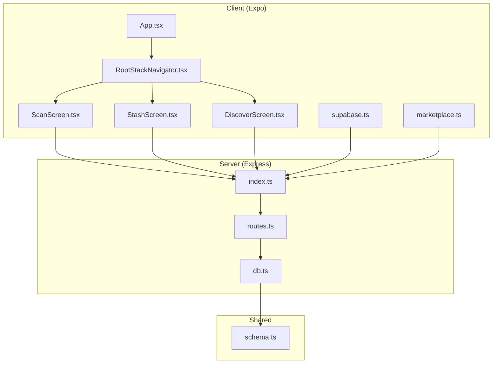
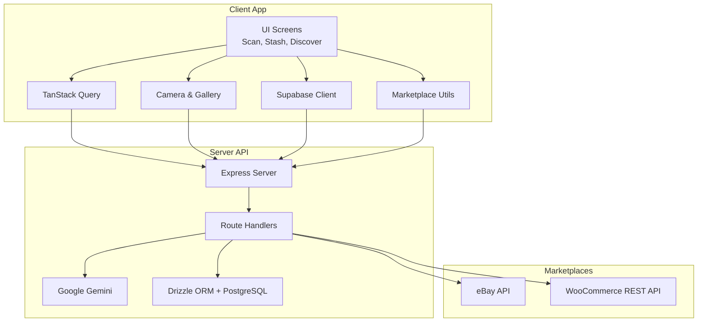
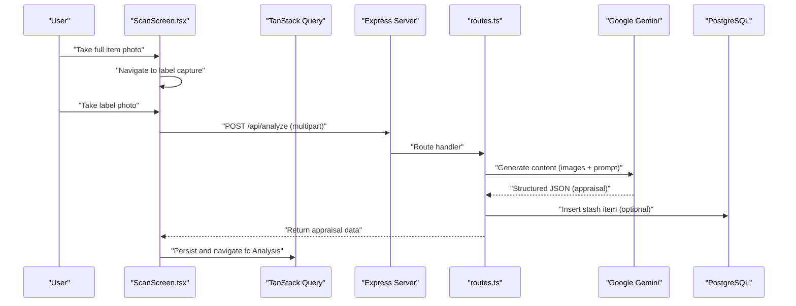
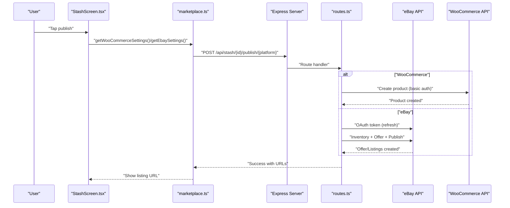
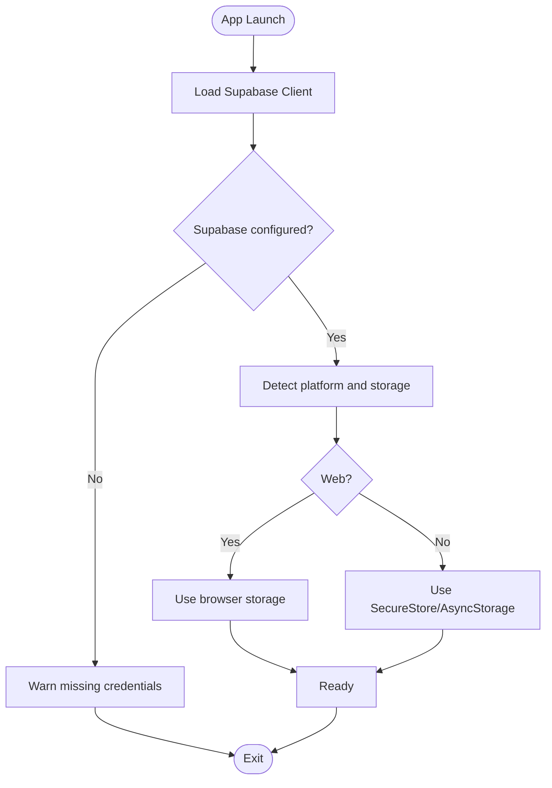
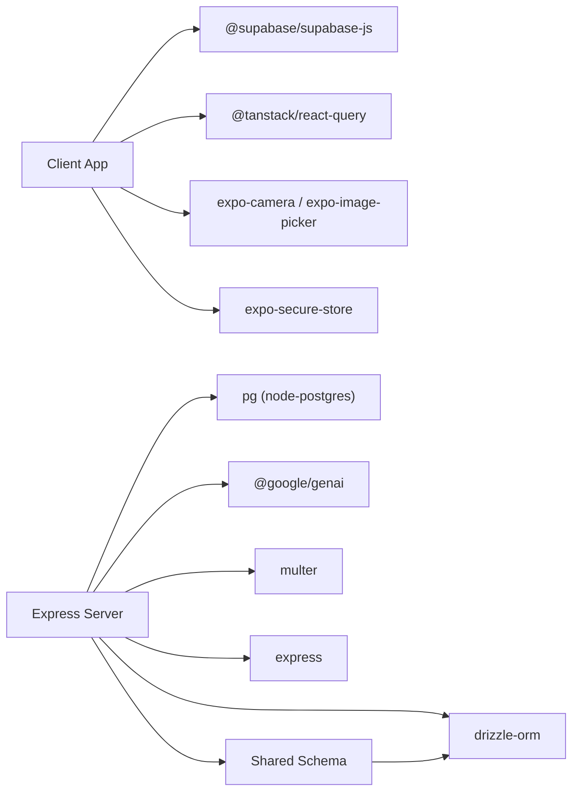

# Project Overview

<cite>
**Referenced Files in This Document**
- [package.json](file://package.json)
- [ENVIRONMENT.md](file://ENVIRONMENT.md)
- [app.json](file://app.json)
- [client/App.tsx](file://client/App.tsx)
- [client/navigation/RootStackNavigator.tsx](file://client/navigation/RootStackNavigator.tsx)
- [client/screens/ScanScreen.tsx](file://client/screens/ScanScreen.tsx)
- [client/screens/StashScreen.tsx](file://client/screens/StashScreen.tsx)
- [client/screens/DiscoverScreen.tsx](file://client/screens/DiscoverScreen.tsx)
- [client/lib/supabase.ts](file://client/lib/supabase.ts)
- [client/lib/marketplace.ts](file://client/lib/marketplace.ts)
- [server/index.ts](file://server/index.ts)
- [server/routes.ts](file://server/routes.ts)
- [server/db.ts](file://server/db.ts)
- [drizzle.config.ts](file://drizzle.config.ts)
</cite>

## Table of Contents
1. [Introduction](#introduction)
2. [Project Structure](#project-structure)
3. [Core Components](#core-components)
4. [Architecture Overview](#architecture-overview)
5. [Detailed Component Analysis](#detailed-component-analysis)
6. [Dependency Analysis](#dependency-analysis)
7. [Performance Considerations](#performance-considerations)
8. [Troubleshooting Guide](#troubleshooting-guide)
9. [Conclusion](#conclusion)

## Introduction
Hidden-Gem is a React Native/Expo mobile application designed to help users discover, appraise, and monetize collectible items. The app enables users to capture item photos (full view and label close-up), receive AI-powered appraisals, manage a personal stash, and publish listings to popular e-commerce platforms such as eBay and WooCommerce. It targets collectors, resellers, and enthusiasts who want a streamlined workflow from discovery to sale.

Key value propositions:
- Fast, on-device item capture with guided scanning
- AI-powered analysis for valuation, SEO metadata, and categorization
- Centralized stash with visibility of published status across marketplaces
- Direct publishing to eBay and WooCommerce with credential-backed automation
- Unified authentication and secure credential storage

Target audience:
- Casual collectors and hobbyists
- Side resellers and arbitrageurs
- Vintage and specialty item enthusiasts

## Project Structure
The project follows a clear separation of concerns:
- Client (React Native/Expo): Screens, navigation, UI components, authentication, marketplace integrations, and API client
- Server (Express): REST API, AI integrations, marketplace publishing, and database access
- Shared: Database schema and shared models
- Scripts and configs: Build, linting, and environment setup

**Diagram sources**
- [client/App.tsx](file://client/App.tsx#L30-L49)
- [client/navigation/RootStackNavigator.tsx](file://client/navigation/RootStackNavigator.tsx#L32-L122)
- [client/screens/ScanScreen.tsx](file://client/screens/ScanScreen.tsx#L17-L217)
- [client/screens/StashScreen.tsx](file://client/screens/StashScreen.tsx#L93-L162)
- [client/screens/DiscoverScreen.tsx](file://client/screens/DiscoverScreen.tsx#L88-L174)
- [client/lib/supabase.ts](file://client/lib/supabase.ts#L1-L39)
- [client/lib/marketplace.ts](file://client/lib/marketplace.ts#L1-L129)
- [server/index.ts](file://server/index.ts#L224-L246)
- [server/routes.ts](file://server/routes.ts#L24-L492)
- [server/db.ts](file://server/db.ts#L1-L19)

**Section sources**
- [package.json](file://package.json#L1-L85)
- [ENVIRONMENT.md](file://ENVIRONMENT.md#L115-L147)
- [app.json](file://app.json#L1-L52)

## Core Components
- Authentication and session management via Supabase (client and server)
- Camera-based scanning workflow with guided steps
- AI-powered item analysis using Google Gemini
- Stash management with listing status tracking
- Marketplace publishing to eBay and WooCommerce
- Database schema managed by Drizzle ORM and PostgreSQL

Technology stack overview:
- Client: React Native, Expo, React Navigation, TanStack Query, Expo Camera/Image Picker, Expo Secure Store
- Server: Express, Drizzle ORM, PostgreSQL, Multer, Google GenAI SDK
- AI: Google Gemini for image analysis and structured JSON responses
- Authentication: Supabase Auth with encrypted local storage on native platforms

**Section sources**
- [package.json](file://package.json#L19-L67)
- [client/lib/supabase.ts](file://client/lib/supabase.ts#L1-L39)
- [server/routes.ts](file://server/routes.ts#L9-L17)
- [server/db.ts](file://server/db.ts#L1-L19)
- [drizzle.config.ts](file://drizzle.config.ts#L1-L15)

## Architecture Overview
The app follows a client-server model with the client handling UI, camera, and user flows, while the server manages APIs, AI analysis, marketplace publishing, and database operations. Supabase provides authentication and session persistence. The server integrates with Google Gemini for AI analysis and external APIs for eBay and WooCommerce.

**Diagram sources**
- [client/screens/ScanScreen.tsx](file://client/screens/ScanScreen.tsx#L17-L217)
- [client/screens/StashScreen.tsx](file://client/screens/StashScreen.tsx#L93-L162)
- [client/screens/DiscoverScreen.tsx](file://client/screens/DiscoverScreen.tsx#L88-L174)
- [client/lib/supabase.ts](file://client/lib/supabase.ts#L1-L39)
- [client/lib/marketplace.ts](file://client/lib/marketplace.ts#L1-L129)
- [server/index.ts](file://server/index.ts#L224-L246)
- [server/routes.ts](file://server/routes.ts#L24-L492)
- [server/db.ts](file://server/db.ts#L1-L19)

## Detailed Component Analysis

### Scanning Workflow (Client → Server → AI)
The scanning flow captures two images (full item and label), uploads them to the server, and receives an AI-generated appraisal with SEO metadata and categorization.

**Diagram sources**
- [client/screens/ScanScreen.tsx](file://client/screens/ScanScreen.tsx#L26-L62)
- [server/routes.ts](file://server/routes.ts#L140-L226)
- [server/db.ts](file://server/db.ts#L1-L19)

Practical example:
- Capture a vintage watch from two angles, submit to AI, receive category, condition, value range, and SEO-ready copy, then save to stash.

**Section sources**
- [client/screens/ScanScreen.tsx](file://client/screens/ScanScreen.tsx#L17-L217)
- [server/routes.ts](file://server/routes.ts#L140-L226)

### Publishing to Marketplaces
The client retrieves saved credentials (stored securely on native platforms) and posts to the server, which handles marketplace-specific flows.

**Diagram sources**
- [client/screens/StashScreen.tsx](file://client/screens/StashScreen.tsx#L93-L162)
- [client/lib/marketplace.ts](file://client/lib/marketplace.ts#L19-L129)
- [server/routes.ts](file://server/routes.ts#L228-L488)

Practical example:
- Publish a saved item to eBay using a stored refresh token; the server creates inventory, offers, publishes, and returns the listing URL.

**Section sources**
- [client/lib/marketplace.ts](file://client/lib/marketplace.ts#L1-L129)
- [server/routes.ts](file://server/routes.ts#L228-L488)

### Authentication and Data Layer
Supabase handles user sessions and stores sensitive marketplace credentials securely on native platforms.

**Diagram sources**
- [client/lib/supabase.ts](file://client/lib/supabase.ts#L1-L39)

**Section sources**
- [client/lib/supabase.ts](file://client/lib/supabase.ts#L1-L39)
- [ENVIRONMENT.md](file://ENVIRONMENT.md#L54-L68)

## Dependency Analysis
High-level dependencies:
- Client depends on Supabase for auth, marketplace utilities for API calls, and TanStack Query for caching
- Server depends on Drizzle ORM for database operations, Google GenAI for AI, and external marketplace APIs
- Shared schema ensures consistent types and migrations

**Diagram sources**
- [package.json](file://package.json#L19-L67)
- [server/db.ts](file://server/db.ts#L1-L19)
- [drizzle.config.ts](file://drizzle.config.ts#L1-L15)

**Section sources**
- [package.json](file://package.json#L19-L67)
- [server/db.ts](file://server/db.ts#L1-L19)
- [drizzle.config.ts](file://drizzle.config.ts#L1-L15)

## Performance Considerations
- Camera capture quality and haptic feedback improve UX; ensure appropriate compression and permissions
- AI requests are multipart uploads; limit image sizes and provide progress feedback
- TanStack Query caching reduces redundant network calls; tune stale times for articles vs. stash
- Server-side rate limits and error handling prevent cascading failures for marketplace APIs
- Database migrations should be idempotent and applied before deployment

## Troubleshooting Guide
Common issues and resolutions:
- Supabase credentials missing: Ensure environment variables are set and the client warns appropriately
- AI analysis fails: Verify AI integration keys and quotas; fallback JSON is returned if parsing fails
- Marketplace publishing errors: Check credentials, OAuth tokens, and required policies on eBay; confirm store URLs and basic auth for WooCommerce
- Database connectivity: Confirm DATABASE_URL and PostgreSQL availability; apply migrations with Drizzle

**Section sources**
- [client/lib/supabase.ts](file://client/lib/supabase.ts#L20-L33)
- [server/routes.ts](file://server/routes.ts#L196-L226)
- [server/routes.ts](file://server/routes.ts#L298-L488)
- [ENVIRONMENT.md](file://ENVIRONMENT.md#L172-L210)

## Conclusion
Hidden-Gem streamlines the collectible lifecycle from discovery to sale by combining a guided scanning experience, AI-powered insights, and direct marketplace publishing. Its modular architecture separates concerns cleanly, enabling rapid iteration and reliable integrations. By leveraging Supabase for authentication, Drizzle ORM for data, and Google Gemini for AI, the app delivers a robust foundation for collectors and resellers to manage their inventory efficiently.