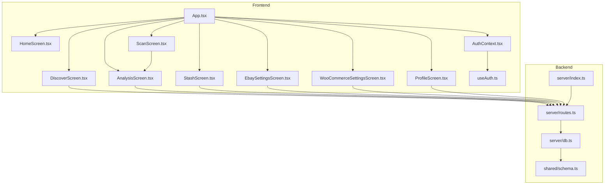
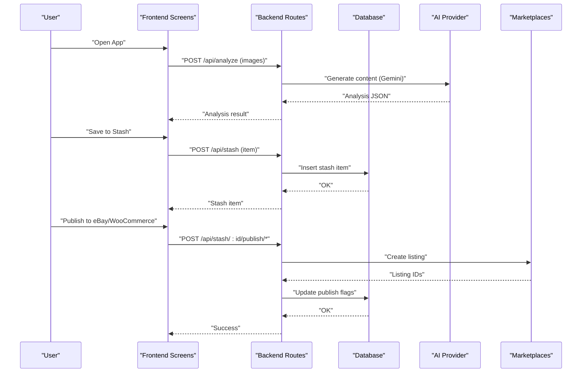
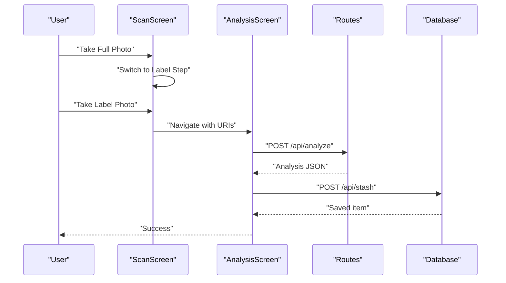
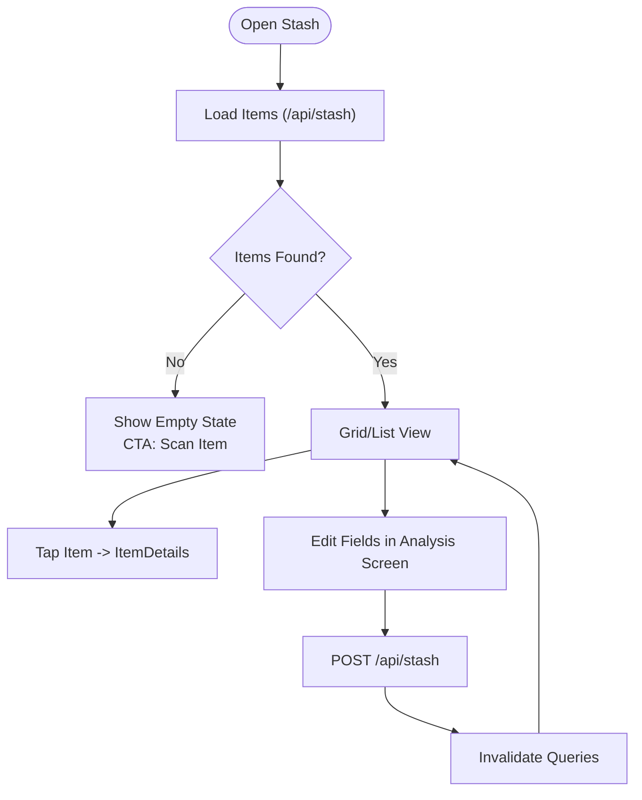
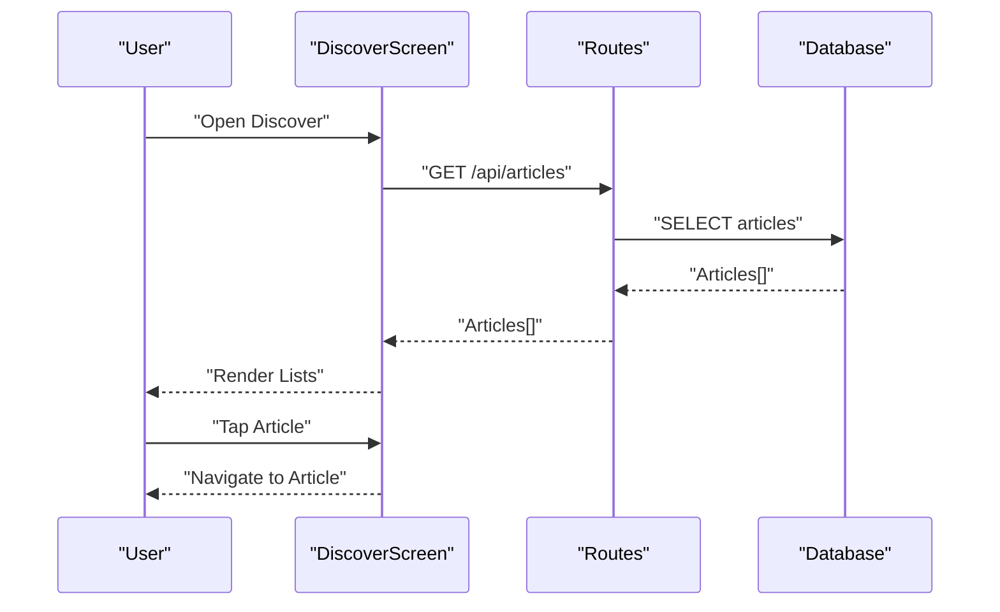
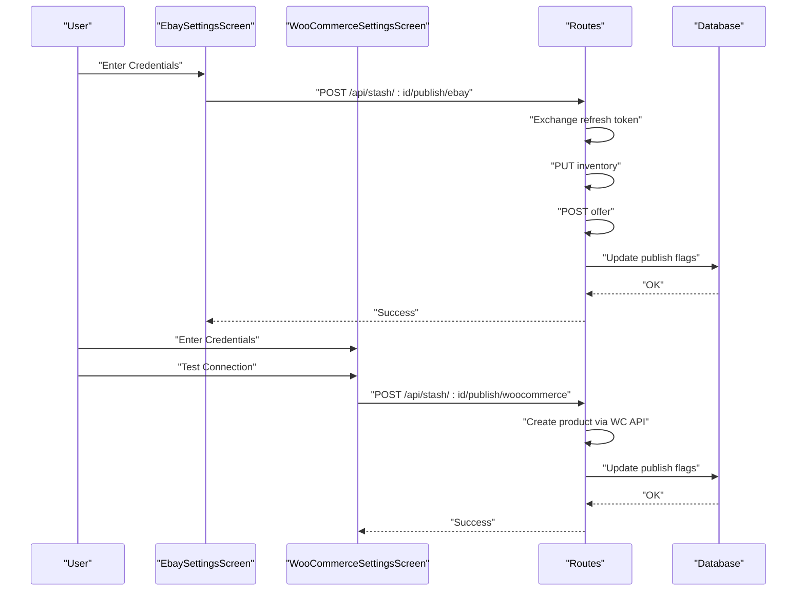
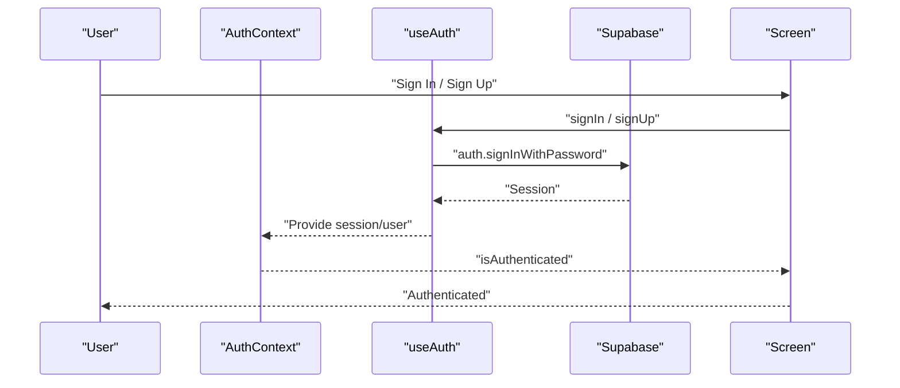
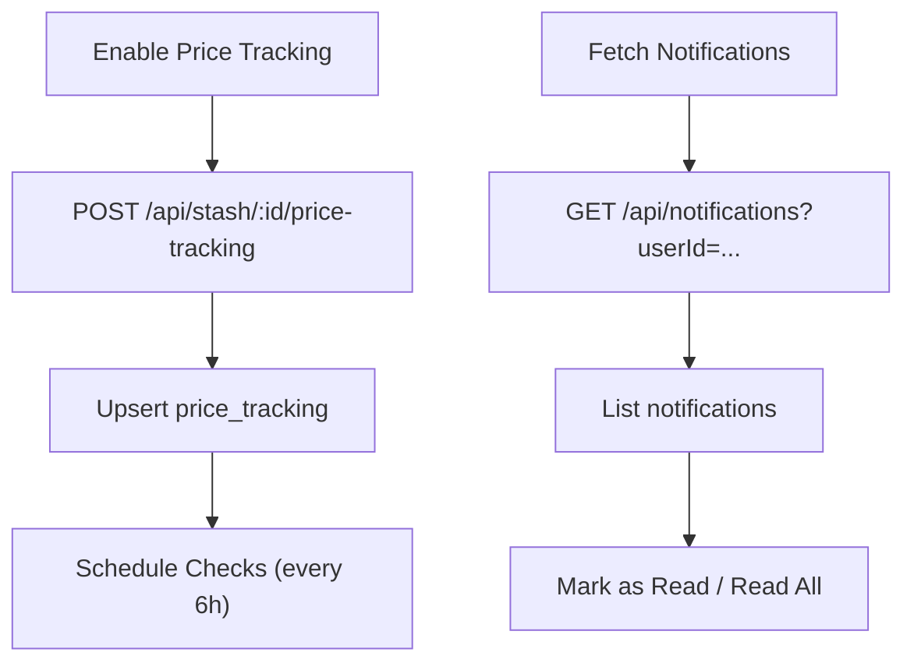
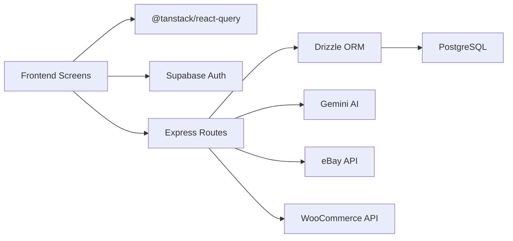

# Core Features

<cite>
**Referenced Files in This Document**
- [App.tsx](file://client/App.tsx)
- [HomeScreen.tsx](file://client/screens/HomeScreen.tsx)
- [DiscoverScreen.tsx](file://client/screens/DiscoverScreen.tsx)
- [ScanScreen.tsx](file://client/screens/ScanScreen.tsx)
- [AnalysisScreen.tsx](file://client/screens/AnalysisScreen.tsx)
- [StashScreen.tsx](file://client/screens/StashScreen.tsx)
- [EbaySettingsScreen.tsx](file://client/screens/EbaySettingsScreen.tsx)
- [WooCommerceSettingsScreen.tsx](file://client/screens/WooCommerceSettingsScreen.tsx)
- [ProfileScreen.tsx](file://client/screens/ProfileScreen.tsx)
- [AuthContext.tsx](file://client/contexts/AuthContext.tsx)
- [useAuth.ts](file://client/hooks/useAuth.ts)
- [index.ts](file://server/index.ts)
- [routes.ts](file://server/routes.ts)
- [db.ts](file://server/db.ts)
- [schema.ts](file://shared/schema.ts)
</cite>

## Table of Contents
1. [Introduction](#introduction)
2. [Project Structure](#project-structure)
3. [Core Components](#core-components)
4. [Architecture Overview](#architecture-overview)
5. [Detailed Component Analysis](#detailed-component-analysis)
6. [Dependency Analysis](#dependency-analysis)
7. [Performance Considerations](#performance-considerations)
8. [Troubleshooting Guide](#troubleshooting-guide)
9. [Conclusion](#conclusion)

## Introduction
This document presents the Hidden-Gem core features with a focus on the primary functionality that defines the application. It explains the item discovery and analysis workflow (camera-based scanning, AI-powered analysis, and market valuation), the personal stash management system (collection, metadata tracking, and value monitoring), the educational content system (articles and guides), marketplace integration (eBay and WooCommerce), user authentication and profile management, and the notification system for price tracking and market updates. It also highlights feature interconnections, user workflows, and business value propositions.

## Project Structure
The application follows a modern React Native architecture with a TypeScript backend and a Supabase-driven authentication and database layer. The frontend is organized by screens and shared concerns (contexts, hooks, libraries), while the backend exposes REST endpoints for AI analysis, marketplace publishing, notifications, and data persistence.

**Diagram sources**
- [App.tsx](file://client/App.tsx#L1-L67)
- [DiscoverScreen.tsx](file://client/screens/DiscoverScreen.tsx#L1-L340)
- [ScanScreen.tsx](file://client/screens/ScanScreen.tsx#L1-L394)
- [AnalysisScreen.tsx](file://client/screens/AnalysisScreen.tsx#L1-L743)
- [StashScreen.tsx](file://client/screens/StashScreen.tsx#L1-L290)
- [EbaySettingsScreen.tsx](file://client/screens/EbaySettingsScreen.tsx#L1-L568)
- [WooCommerceSettingsScreen.tsx](file://client/screens/WooCommerceSettingsScreen.tsx#L1-L512)
- [ProfileScreen.tsx](file://client/screens/ProfileScreen.tsx#L1-L27)
- [AuthContext.tsx](file://client/contexts/AuthContext.tsx#L1-L31)
- [useAuth.ts](file://client/hooks/useAuth.ts#L1-L151)
- [index.ts](file://server/index.ts#L1-L262)
- [routes.ts](file://server/routes.ts#L1-L929)
- [db.ts](file://server/db.ts#L1-L19)
- [schema.ts](file://shared/schema.ts#L1-L344)

**Section sources**
- [App.tsx](file://client/App.tsx#L1-L67)
- [index.ts](file://server/index.ts#L1-L262)

## Core Components
- Item Discovery and Analysis Workflow
  - Camera-based scanning with guided capture and gallery fallback
  - AI-powered analysis pipeline with retry and editing
  - Market valuation and authentication insights
- Personal Stash Management
  - Collection view with metadata and value display
  - Save, edit, and publish to marketplaces
- Educational Content System
  - Curated articles and guides for collectors
- Marketplace Integration
  - eBay and WooCommerce settings and listing creation
- User Authentication and Profile
  - Supabase-based auth with email/password and Google
  - Profile screen scaffolding
- Notifications
  - Price tracking toggles and notification retrieval

**Section sources**
- [ScanScreen.tsx](file://client/screens/ScanScreen.tsx#L1-L394)
- [AnalysisScreen.tsx](file://client/screens/AnalysisScreen.tsx#L1-L743)
- [StashScreen.tsx](file://client/screens/StashScreen.tsx#L1-L290)
- [DiscoverScreen.tsx](file://client/screens/DiscoverScreen.tsx#L1-L340)
- [EbaySettingsScreen.tsx](file://client/screens/EbaySettingsScreen.tsx#L1-L568)
- [WooCommerceSettingsScreen.tsx](file://client/screens/WooCommerceSettingsScreen.tsx#L1-L512)
- [AuthContext.tsx](file://client/contexts/AuthContext.tsx#L1-L31)
- [useAuth.ts](file://client/hooks/useAuth.ts#L1-L151)
- [routes.ts](file://server/routes.ts#L132-L182)

## Architecture Overview
The system integrates a React Native frontend with a Node.js/Express backend. The frontend captures images, sends them to the backend for AI analysis, persists results to the database, and enables marketplace publishing. Notifications are scheduled and delivered via backend services.

**Diagram sources**
- [routes.ts](file://server/routes.ts#L299-L385)
- [routes.ts](file://server/routes.ts#L387-L455)
- [routes.ts](file://server/routes.ts#L457-L647)
- [db.ts](file://server/db.ts#L1-L19)
- [schema.ts](file://shared/schema.ts#L29-L50)

## Detailed Component Analysis

### Item Discovery and Analysis Workflow
- Camera-based scanning
  - Guided two-step capture: full item and label close-up
  - Permissions handling and flash/torch support
  - Gallery selection fallback
- AI-powered analysis
  - Multi-part request with images and structured prompt
  - JSON parsing with graceful fallback
  - Retry mechanism with feedback and provider override
- Market valuation and authentication
  - Confidence scores, suggested list price, and condition
  - Authentication assessment and tips
  - SEO-ready listing previews

**Diagram sources**
- [ScanScreen.tsx](file://client/screens/ScanScreen.tsx#L26-L87)
- [AnalysisScreen.tsx](file://client/screens/AnalysisScreen.tsx#L111-L143)
- [routes.ts](file://server/routes.ts#L299-L385)
- [routes.ts](file://server/routes.ts#L572-L630)
- [schema.ts](file://shared/schema.ts#L29-L50)

**Section sources**
- [ScanScreen.tsx](file://client/screens/ScanScreen.tsx#L1-L394)
- [AnalysisScreen.tsx](file://client/screens/AnalysisScreen.tsx#L1-L743)
- [routes.ts](file://server/routes.ts#L299-L385)
- [routes.ts](file://server/routes.ts#L672-L711)

### Personal Stash Management
- Collection view
  - Grid layout with item cards, value badges, and publish indicators
  - Empty state with CTA to scan
- Metadata and value monitoring
  - Estimated value and category display
  - Publish flags for eBay/WooCommerce
- Editing and saving
  - Editable fields for title, subtitle, list price, condition, descriptions, specifics, categories, tags
  - Save mutation with optimistic updates

**Diagram sources**
- [StashScreen.tsx](file://client/screens/StashScreen.tsx#L93-L163)
- [AnalysisScreen.tsx](file://client/screens/AnalysisScreen.tsx#L93-L105)
- [routes.ts](file://server/routes.ts#L216-L286)

**Section sources**
- [StashScreen.tsx](file://client/screens/StashScreen.tsx#L1-L290)
- [AnalysisScreen.tsx](file://client/screens/AnalysisScreen.tsx#L1-L743)
- [routes.ts](file://server/routes.ts#L216-L286)

### Educational Content System
- Articles and guides
  - Featured and latest articles with category and reading time
  - Pull-to-refresh and empty state visuals
- Consumption flow
  - Browse articles, select to read, navigate to article screen

**Diagram sources**
- [DiscoverScreen.tsx](file://client/screens/DiscoverScreen.tsx#L88-L175)
- [routes.ts](file://server/routes.ts#L184-L214)
- [schema.ts](file://shared/schema.ts#L52-L62)

**Section sources**
- [DiscoverScreen.tsx](file://client/screens/DiscoverScreen.tsx#L1-L340)
- [routes.ts](file://server/routes.ts#L184-L214)
- [schema.ts](file://shared/schema.ts#L52-L62)

### Marketplace Integration (eBay and WooCommerce)
- eBay integration
  - Environment toggle (sandbox/production)
  - Credentials and optional refresh token
  - Test connection and save settings
  - Publish flow: inventory creation, offer creation, optional publish
- WooCommerce integration
  - Store URL, consumer key, and consumer secret
  - Test connection and save settings
  - Publish flow: create product via WC REST API, update publish flags

**Diagram sources**
- [EbaySettingsScreen.tsx](file://client/screens/EbaySettingsScreen.tsx#L112-L150)
- [WooCommerceSettingsScreen.tsx](file://client/screens/WooCommerceSettingsScreen.tsx#L108-L146)
- [routes.ts](file://server/routes.ts#L457-L647)
- [schema.ts](file://shared/schema.ts#L29-L50)

**Section sources**
- [EbaySettingsScreen.tsx](file://client/screens/EbaySettingsScreen.tsx#L1-L568)
- [WooCommerceSettingsScreen.tsx](file://client/screens/WooCommerceSettingsScreen.tsx#L1-L512)
- [routes.ts](file://server/routes.ts#L457-L647)

### User Authentication and Profile Management
- Authentication
  - Email/password and Google OAuth
  - Session management and state change subscriptions
  - Redirect handling for web and native flows
- Profile
  - Profile screen scaffolded for future profile features

**Diagram sources**
- [AuthContext.tsx](file://client/contexts/AuthContext.tsx#L1-L31)
- [useAuth.ts](file://client/hooks/useAuth.ts#L40-L70)
- [useAuth.ts](file://client/hooks/useAuth.ts#L72-L137)

**Section sources**
- [AuthContext.tsx](file://client/contexts/AuthContext.tsx#L1-L31)
- [useAuth.ts](file://client/hooks/useAuth.ts#L1-L151)
- [ProfileScreen.tsx](file://client/screens/ProfileScreen.tsx#L1-L27)

### Notifications and Price Tracking
- Price tracking
  - Enable/disable per stash item with threshold
  - Get status and scheduled checks
- Notifications
  - Register/unregister push tokens
  - Fetch notifications and unread counts
  - Mark as read and bulk read

**Diagram sources**
- [routes.ts](file://server/routes.ts#L132-L182)
- [routes.ts](file://server/routes.ts#L46-L129)
- [index.ts](file://server/index.ts#L247-L258)
- [schema.ts](file://shared/schema.ts#L268-L293)

**Section sources**
- [routes.ts](file://server/routes.ts#L132-L182)
- [routes.ts](file://server/routes.ts#L46-L129)
- [index.ts](file://server/index.ts#L247-L258)
- [schema.ts](file://shared/schema.ts#L268-L293)

## Dependency Analysis
- Frontend-to-backend
  - Screens depend on TanStack Query for data fetching and mutations
  - Auth context provides session-awareness across screens
- Backend-to-database
  - Drizzle ORM with PostgreSQL schema for all entities
- External integrations
  - AI provider via Gemini
  - eBay and WooCommerce APIs
  - Supabase for auth and session management

**Diagram sources**
- [useAuth.ts](file://client/hooks/useAuth.ts#L1-L151)
- [routes.ts](file://server/routes.ts#L1-L929)
- [db.ts](file://server/db.ts#L1-L19)
- [schema.ts](file://shared/schema.ts#L1-L344)

**Section sources**
- [useAuth.ts](file://client/hooks/useAuth.ts#L1-L151)
- [routes.ts](file://server/routes.ts#L1-L929)
- [db.ts](file://server/db.ts#L1-L19)
- [schema.ts](file://shared/schema.ts#L1-L344)

## Performance Considerations
- Image handling
  - Compress images before upload to reduce payload sizes
  - Use memory-efficient image picking and camera capture
- Network requests
  - Debounce refresh actions and avoid redundant queries
  - Use optimistic updates for saves and publishes
- Background tasks
  - Schedule periodic price checks efficiently to minimize load
- Database
  - Index frequently queried columns (e.g., user associations)
  - Normalize entities to reduce duplication and improve maintainability

## Troubleshooting Guide
- Camera permissions
  - Ensure camera permission granted; guide users to enable if denied
- AI analysis failures
  - Verify Gemini API key and endpoint configuration
  - Use retry with feedback to refine results
- Marketplace publishing
  - Confirm credentials and environment settings
  - For eBay, ensure business policies are configured in Seller Hub
- Authentication
  - Check Supabase configuration and redirect URLs
  - Validate OAuth flows for web and native platforms
- Notifications
  - Register push tokens and verify platform-specific handling
  - Confirm scheduled job execution for price checks

**Section sources**
- [ScanScreen.tsx](file://client/screens/ScanScreen.tsx#L99-L132)
- [AnalysisScreen.tsx](file://client/screens/AnalysisScreen.tsx#L136-L142)
- [routes.ts](file://server/routes.ts#L649-L670)
- [routes.ts](file://server/routes.ts#L457-L647)
- [useAuth.ts](file://client/hooks/useAuth.ts#L72-L137)
- [routes.ts](file://server/routes.ts#L46-L72)
- [index.ts](file://server/index.ts#L247-L258)

## Conclusion
Hidden-Gem’s core features form a cohesive collector-centric ecosystem: seamless item discovery powered by camera scanning and AI analysis, robust personal stash management with metadata and valuation, curated educational content, integrated marketplace publishing for eBay and WooCommerce, strong user authentication, and a notification system for price tracking and market updates. These features interlock to deliver immediate value—quick identification and valuation—while enabling long-term asset growth through streamlined listing and monitoring.