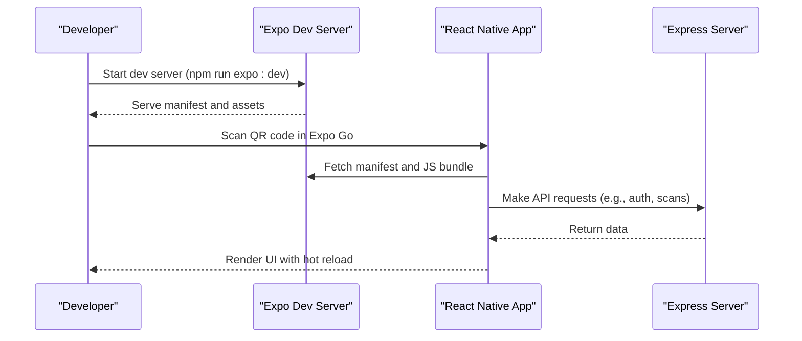
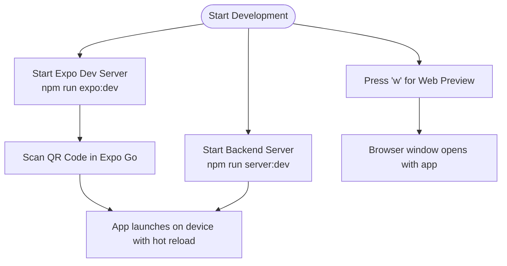
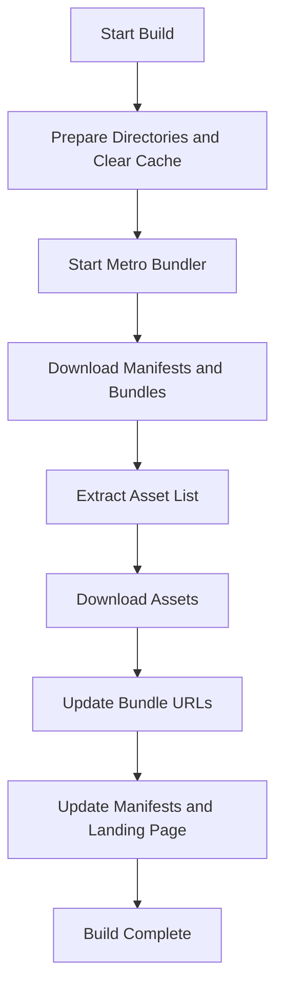

# Getting Started

<cite>
**Referenced Files in This Document**
- [package.json](file://package.json)
- [ENVIRONMENT.md](file://ENVIRONMENT.md)
- [app.json](file://app.json)
- [drizzle.config.ts](file://drizzle.config.ts)
- [scripts/build.js](file://scripts/build.js)
- [scripts/run-migration.js](file://scripts/run-migration.js)
- [server/index.ts](file://server/index.ts)
- [client/App.tsx](file://client/App.tsx)
- [shared/schema.ts](file://shared/schema.ts)
- [eslint.config.js](file://eslint.config.js)
- [tsconfig.json](file://tsconfig.json)
</cite>

## Table of Contents
1. [Introduction](#introduction)
2. [System Requirements](#system-requirements)
3. [Installation](#installation)
4. [Development Workflow](#development-workflow)
5. [Testing Locally](#testing-locally)
6. [Common Setup Issues and Troubleshooting](#common-setup-issues-and-troubleshooting)
7. [Contributing Guidelines](#contributing-guidelines)
8. [Deployment Preparation](#deployment-preparation)
9. [Appendices](#appendices)

## Introduction
This guide helps you set up and run the Hidden-Gem application locally. Hidden-Gem is a React Native mobile app built with Expo and an Express backend. It integrates with Supabase for authentication and data, uses PostgreSQL for persistence, and supports AI features via Replit integrations. You will install dependencies, configure environment variables, set up the database, build and run the development servers, test on devices/emulators, and learn how to contribute effectively.

## System Requirements
- Operating system: macOS, Windows, or Linux
- Node.js: v18 or higher
- Package manager: npm (bundled with Node.js) or Yarn
- Expo CLI: Available via npx (no global install required)
- Optional: Git for version control
- Optional: Replit account for integrated services (PostgreSQL, AI, secrets management)

Notes:
- The project uses Expo SDK and React Native. While Xcode and Android Studio are not mandatory for development, you will need them if you want to run the app on physical devices or simulators outside of Expo Go.
- The backend runs on Node.js with Express and TypeScript.

**Section sources**
- [ENVIRONMENT.md](file://ENVIRONMENT.md#L5-L11)
- [package.json](file://package.json#L24-L92)

## Installation
Follow these steps to install and prepare the project locally.

1. Clone the repository (if applicable) and navigate to the project directory.
2. Install dependencies:
   - Run: npm install
   - Alternatively, use Yarn if you prefer: yarn install
3. Create a local environment file:
   - Copy the provided environment guide to understand required variables.
   - Create a .env file at the project root and populate the required variables (see Environment Variables below).
4. Configure environment variables:
   - Required variables include database URL, Supabase keys, session secret, and optional AI and marketplace credentials.
   - Refer to the Environment Variables section for details.
5. Initialize the database:
   - Push migrations using: npm run db:push
   - Alternatively, use the migration runner script: node scripts/run-migration.js
6. Build the frontend:
   - Build static Expo bundle for production-like testing: npm run expo:static:build
   - Or start the development server: npm run expo:dev:local (starts both backend and frontend)

Notes:
- The backend server listens on port 5000 by default.
- The frontend dev server listens on port 8081 by default.

**Section sources**
- [ENVIRONMENT.md](file://ENVIRONMENT.md#L69-L113)
- [package.json](file://package.json#L5-L23)
- [drizzle.config.ts](file://drizzle.config.ts#L1-L19)
- [scripts/run-migration.js](file://scripts/run-migration.js#L1-L34)

## Development Workflow
This section explains how to start the development servers, enable hot reload, and debug the application.

1. Start the backend server:
   - Command: npm run server:dev
   - Purpose: Starts the Express server with hot reloading for TypeScript files.
   - Port: 5000
2. Start the frontend:
   - Command: npm run expo:dev
   - Purpose: Starts the Expo dev server with hot module replacement.
   - Port: 8081
   - QR code: Use the Expo Go app on your mobile device to connect.
3. Alternative: Start both servers concurrently:
   - Command: npm run dev:local
   - This runs the backend and frontend in parallel.
4. Debugging:
   - Use the in-terminal menus in the Expo dev server (press w for web, r for reload, d for debug).
   - Enable remote debugging in Expo Go for React Native components.
   - Inspect network requests in the browser’s developer tools when running on web.
5. Hot reload:
   - Save changes in the client code to trigger hot reload.
   - If hot reload stops working, restart the dev server or clear the cache with: npx expo start --clear

**Diagram sources**
- [server/index.ts](file://server/index.ts#L227-L261)
- [ENVIRONMENT.md](file://ENVIRONMENT.md#L71-L90)

**Section sources**
- [ENVIRONMENT.md](file://ENVIRONMENT.md#L69-L90)
- [server/index.ts](file://server/index.ts#L227-L261)

## Testing Locally
You can test the app on multiple platforms and environments.

1. Using Expo Go (recommended for quick iteration):
   - Start the frontend dev server: npm run expo:dev
   - Scan the QR code shown in the terminal with your mobile device’s camera or the Expo Go app.
   - Hot reload is enabled for rapid feedback.
2. Using a physical device (Replit):
   - Open the Replit workspace on your device’s browser.
   - Use the “Open in Expo Go” option from the URL bar menu.
3. Testing on web:
   - Press w in the Expo dev server terminal to open the app in a browser window.
   - Some native features (camera, location) have web fallbacks; test on mobile-sized windows for best results.

**Diagram sources**
- [ENVIRONMENT.md](file://ENVIRONMENT.md#L148-L171)

**Section sources**
- [ENVIRONMENT.md](file://ENVIRONMENT.md#L148-L171)

## Common Setup Issues and Troubleshooting
Below are typical problems and their solutions.

- Ports already in use:
  - Backend (5000): Kill the process occupying the port.
  - Frontend (8081): Kill the process occupying the port.
- Database connection issues:
  - Ensure DATABASE_URL is set in your environment.
  - Verify PostgreSQL is reachable via the connection string.
- Hot reload not working:
  - Restart the Expo dev server.
  - Clear the cache: npx expo start --clear
- Supabase authentication fails:
  - Confirm EXPO_PUBLIC_SUPABASE_URL and keys are set.
  - On Replit, ensure secrets are configured in the Secrets panel.
- AI features not working:
  - Verify AI_INTEGRATIONS_GEMINI_API_KEY is configured via Replit AI Integrations.
  - Check server logs for errors and ensure your API quota is sufficient.

**Section sources**
- [ENVIRONMENT.md](file://ENVIRONMENT.md#L172-L195)

## Contributing Guidelines
Follow these practices to keep the codebase consistent and collaborative.

- Code formatting:
  - Use Prettier for formatting. Run:
    - Format all files: npm run format
    - Check formatting: npm run check:format
- Linting:
  - Check code style: npm run lint
  - Automatically fix issues: npm run lint:fix
- Type checking:
  - Run TypeScript checks: npm run check:types
- Commit hygiene:
  - Keep commits small and focused.
  - Write clear, descriptive commit messages.
- Pull requests:
  - Open PRs early to gather feedback.
  - Ensure CI passes (lint, type checks).
  - Include screenshots or short videos for UI changes.

**Section sources**
- [eslint.config.js](file://eslint.config.js#L1-L13)
- [package.json](file://package.json#L15-L19)

## Deployment Preparation
Prepare the project for production deployment using the static build pipeline.

1. Build static assets:
   - Command: npm run expo:static:build
   - This prepares a static bundle for distribution.
2. Build the server:
   - Command: npm run server:build
   - This compiles the Express server to ESM for production.
3. Production server:
   - Command: npm run server:prod
   - This starts the production server on port 5000.
4. Static build generator:
   - The build script downloads manifests and assets, updates URLs, and writes platform-specific manifests.
   - It requires a deployment domain to be set via environment variables.

**Diagram sources**
- [scripts/build.js](file://scripts/build.js#L497-L553)

**Section sources**
- [scripts/build.js](file://scripts/build.js#L1-L562)
- [package.json](file://package.json#L11-L13)

## Appendices

### Environment Variables Reference
- Required:
  - DATABASE_URL: PostgreSQL connection string
  - EXPO_PUBLIC_SUPABASE_URL: Supabase project URL
  - EXPO_PUBLIC_SUPABASE_ANON_KEY: Supabase anonymous public key
  - SUPABASE_ANON_KEY: Supabase key for server-side use
  - SESSION_SECRET: Express session encryption secret
- Auto-configured (Replit):
  - AI_INTEGRATIONS_GEMINI_API_KEY, AI_INTEGRATIONS_GEMINI_BASE_URL
  - PGHOST, PGPORT, PGUSER, PGPASSWORD, PGDATABASE
- User-provided credentials (stored locally):
  - WooCommerce: Store URL, Consumer Key, Consumer Secret
  - eBay: Client ID, Client Secret, Refresh Token, Environment

**Section sources**
- [ENVIRONMENT.md](file://ENVIRONMENT.md#L12-L68)

### Project Structure Highlights
- Client (React Native + Expo):
  - Entry point: client/App.tsx
  - Navigation, screens, components, hooks, contexts, and libraries live under client/
- Server (Express + TypeScript):
  - Entry point: server/index.ts
  - Routes, database, storage, and integrations under server/
- Shared code:
  - Database schema and types: shared/schema.ts
- Database:
  - Drizzle config: drizzle.config.ts
  - Migrations: migrations/
- Scripts:
  - Static build: scripts/build.js
  - Migration runner: scripts/run-migration.js

**Section sources**
- [client/App.tsx](file://client/App.tsx#L1-L67)
- [server/index.ts](file://server/index.ts#L1-L262)
- [shared/schema.ts](file://shared/schema.ts#L1-L344)
- [drizzle.config.ts](file://drizzle.config.ts#L1-L19)